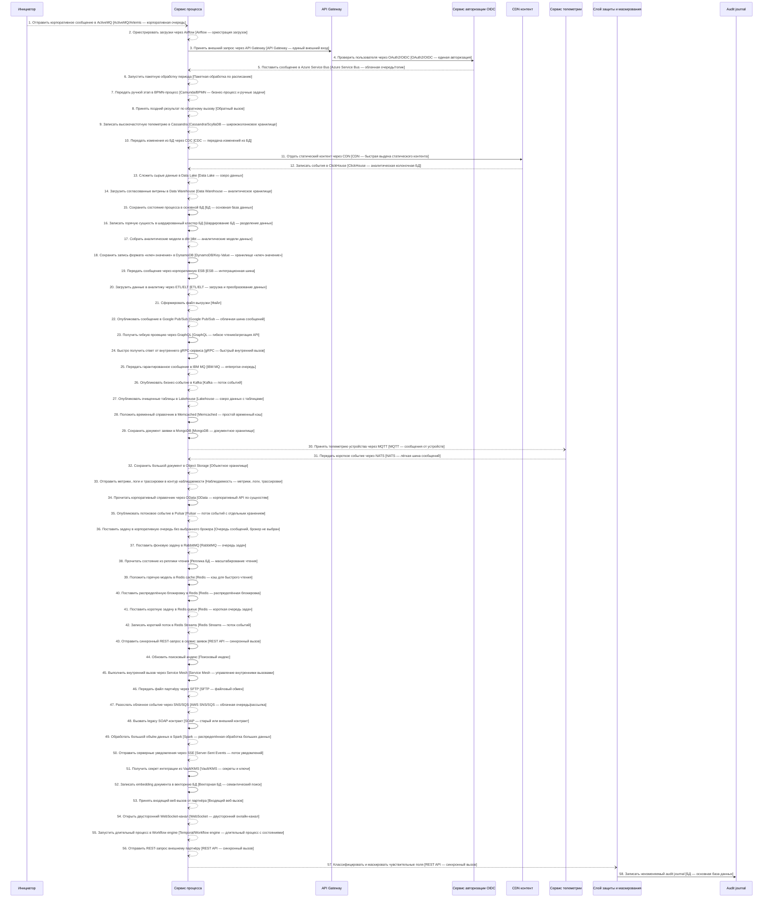

# Архитектурный разбор: Ультра-кейс: все цепочки и все технологии

**Итоговый вывод:** НЕ ГОТОВО: есть блокирующие риски Оценка архитектурной готовности: 0.0/10. Найдено классов рисков: критичных — 2, высоких — 7, средних — 6. Всего отдельных срабатываний правил: 80.
**Готовность к промышленному запуску:** нельзя выпускать без закрытия блокеров. **Полнота вводных: 68%. Надёжность рекомендаций: средняя.**

## Короткий человеческий вывод

**Что:** Процесс «Ультра-кейс: все цепочки и все технологии» описан как цепочка из 58 взаимодействий между 61 участниками. Система оценила архитектурную готовность как 0.0/10: НЕ ГОТОВО: есть блокирующие риски.
**Где:** Основные проблемные места: Финансовую сущность изменяют несколько систем одновременно — в зоне: Audit journal, Сервис процесса, Сервис телеметрии; Повторная обработка настроена без идемпотентности — в зоне: Затронуто мест: 2. Шаг 6 «Запустить пакетную обработку периода»; Шаг 48 «Вызвать legacy SOAP-контракт»; Важный асинхронный процесс не имеет сверки — в зоне: Весь процесс.
**Почему:** Эти места важны, потому что именно там выше риск потери данных, дублей, зависания статуса, неуправляемых повторных попыток или непонятного восстановления после сбоя.

**Что делать дальше:** сначала исправьте противоречия в схеме и блокирующие риски, затем уточните недостающие вводные, после этого согласуйте стек по каждой связи и только потом переводите решение в постановку на разработку.

**Бизнес-цель:** Проверить отчёт на полном наборе интеграционных цепочек и технологий.
**Основная сущность:** EnterpriseProcess. Деньги: прямой финансовый риск. Регуляторика: да. Клиентский сценарий: да.
**Целевое время ответа:** 2500 мс.

## Проверка логики схемы

Схема не содержит очевидных противоречий между названием связи, участниками и выбранным основным способом взаимодействия.

## Почему выбраны технологии и способы взаимодействия

### Объяснение по шагам

## Основная цепочка взаимодействий

В этот раздел попадают только бизнес-связи между участниками. Наблюдаемость, аудит, авторизация, секреты и маскирование вынесены ниже как сквозные контроли, чтобы они не искажали порядок процесса.

### Шаг 1. Отправить корпоративное сообщение в ActiveMQ

**Что:** шаг 1 — «Отправить корпоративное сообщение в ActiveMQ». Основной способ взаимодействия: ActiveMQ/Artemis.
**Где:** связь идёт от «Сервис процесса» к «ActiveMQ очередь». Исполнитель: «Сервис процесса». Выполняется после: начало процесса или внешний запуск. Характер связи: результат может прийти позже или обрабатывается отдельно.
**Почему:** Подходит для корпоративной JMS-очереди, если в организации уже используется Java/JMS-контур и нужны стандартные enterprise-возможности очередей.
**Почему не другой вариант:** RabbitMQ обычно проще для современных task queue. Kafka лучше для event log. IBM MQ выбирают, если уже есть строгий мейнфрейм/банковский MQ-контур.
**Служебные компоненты:** БД процесса нужна как служебный компонент: она фиксирует состояние, ключ идемпотентности и историю шага. Это служебная запись, а не основной канал связи с получателем. Если перед публикацией меняется состояние в БД, нужна таблица исходящих сообщений: запись и подготовка сообщения должны быть атомарными.
**Что проверить перед выпуском:** Нужны модель подтверждения, durable queues/topics, очередь ошибочных сообщений, транзакционность при необходимости и мониторинг потребителей.

### Шаг 2. Оркестрировать загрузки через Airflow

**Что:** шаг 2 — «Оркестрировать загрузки через Airflow». Основной способ взаимодействия: Airflow как оркестратор загрузок.
**Где:** связь идёт от «Сервис процесса» к «Airflow DAG». Исполнитель: «Сервис процесса». Выполняется после: шаг 1 «Отправить корпоративное сообщение в ActiveMQ». Характер связи: результат может прийти позже или обрабатывается отдельно.
**Почему:** Подходит для управления зависимыми заданиями: загрузки, проверки, преобразования, ожидания файлов и повторные запуски.
**Почему не другой вариант:** Один batch-скрипт проще, но быстро становится неуправляемым при зависимостях и целевое время ответа. Kafka не решает расписание и DAG-зависимости загрузок.
**Служебные компоненты:** БД процесса нужна как служебный компонент: она фиксирует состояние, ключ идемпотентности и историю шага. Это служебная запись, а не основной канал связи с получателем. Нужна сверка полноты между источником и аналитическим контуром: количество, ключи, контрольные суммы и отчёт расхождений.
**Что проверить перед выпуском:** Нужны DAG, расписание, повторная попытка, целевое время ответа, алерты, дозагрузка исторических данных/rerun и правила обработки частично выполненных загрузок.

### Шаг 3. Принять внешний запрос через API Gateway

**Что:** шаг 3 — «Принять внешний запрос через API Gateway». Основной способ взаимодействия: API Gateway.
**Где:** связь идёт от «Клиентский канал» к «API Gateway». Исполнитель: «API Gateway». Выполняется после: шаг 2 «Оркестрировать загрузки через Airflow». Характер связи: результат нужен сразу или в рамках текущего шага.
**Почему:** Нужен как единая внешняя точка входа: авторизация, лимиты запросов, маршрутизация, версия API и защита периметра.
**Почему не другой вариант:** Прямой вызов внутреннего сервиса раскрывает внутреннюю структуру и размазывает безопасность по сервисам. Брокеры не являются публичным входом для клиентского API.
**Что проверить перед выпуском:** Нужны проверка токена, лимиты запросов, трассировка, единая модель ошибок и запрет обхода шлюза.

### Шаг 5. Поставить сообщение в Azure Service Bus

**Что:** шаг 5 — «Поставить сообщение в Azure Service Bus». Основной способ взаимодействия: Azure Service Bus.
**Где:** связь идёт от «Сервис процесса» к «Azure Service Bus». Исполнитель: «Сервис процесса». Выполняется после: сквозной контроль 4 «Проверить пользователя через OAuth2/OIDC». Характер связи: результат может прийти позже или обрабатывается отдельно.
**Почему:** Подходит для управляемой очереди/топика в Microsoft Azure, особенно если уже используется Azure AD, Logic Apps или корпоративный Microsoft-контур.
**Почему не другой вариант:** RabbitMQ/Kafka требуют отдельного сопровождения. AWS SNS/SQS или Google Pub/Sub выбираются в других облаках. Redis queue слабее для критичной enterprise-очереди.
**Служебные компоненты:** БД процесса нужна как служебный компонент: она фиксирует состояние, ключ идемпотентности и историю шага. Это служебная запись, а не основной канал связи с получателем. Если перед публикацией меняется состояние в БД, нужна таблица исходящих сообщений: запись и подготовка сообщения должны быть атомарными.
**Что проверить перед выпуском:** Нужны namespace, queue/topic/subscription, dead-letter queue, lock duration, повторная попытка policy, RBAC и мониторинг.

### Шаг 6. Запустить пакетную обработку периода

**Что:** шаг 6 — «Запустить пакетную обработку периода». Основной способ взаимодействия: Пакетная обработка.
**Где:** связь идёт от «Сервис процесса» к «Batch processor». Исполнитель: «Сервис процесса». Выполняется после: шаг 5 «Поставить сообщение в Azure Service Bus». Характер связи: результат может прийти позже или обрабатывается отдельно.
**Почему:** Подходит для обработки по расписанию, сверки, загрузки периода или массовой операции, где допустима задержка.
**Почему не другой вариант:** REST/gRPC не подходят для больших периодических объёмов. Kafka хороша для потока событий, но не всегда удобна для регламентной сверки периода.
**Служебные компоненты:** БД процесса нужна как служебный компонент: она фиксирует состояние, ключ идемпотентности и историю шага. Это служебная запись, а не основной канал связи с получателем. Нужна сверка полноты между источником и аналитическим контуром: количество, ключи, контрольные суммы и отчёт расхождений.
**Что проверить перед выпуском:** Нужны идентификатор задания, контрольная отметка загрузки, контроль количества записей, повторный запуск периода и отчёт расхождений.

### Шаг 7. Передать ручной этап в BPMN-процесс

**Что:** шаг 7 — «Передать ручной этап в BPMN-процесс». Основной способ взаимодействия: BPM/BPMN-движок.
**Где:** связь идёт от «Сервис процесса» к «BPMN Camunda». Исполнитель: «Сервис процесса». Выполняется после: шаг 6 «Запустить пакетную обработку периода». Характер связи: результат может прийти позже или обрабатывается отдельно.
**Почему:** Подходит, когда процесс содержит согласования, ручные бизнес-задачи, роли, целевое время ответа и эскалации.
**Почему не другой вариант:** Workflow engine лучше для технической оркестрации. Простая таблица задач хуже, если бизнес хочет видеть и менять схему процесса.
**Что проверить перед выпуском:** Нужны роли, формы задач, целевое время ответа, эскалации, аудит решений, версии процесса и правила миграции активных экземпляров.

### Шаг 8. Принять поздний результат по обратному вызову

**Что:** шаг 8 — «Принять поздний результат по обратному вызову». Основной способ взаимодействия: Входящий веб-вызов.
**Где:** связь идёт от «Внешний партнёр» к «Endpoint обратного результата». Исполнитель: «Сервис процесса». Выполняется после: шаг 7 «Передать ручной этап в BPMN-процесс». Характер связи: результат может прийти позже или обрабатывается отдельно.
**Важное исправление:** В исходных данных шаг имел канал «обратный вызов», но по смыслу связи основной способ должен быть «Входящий веб-вызов». Выбор уточнён по смыслу связи между участниками.
**Почему:** Подходит, когда внешняя система сама присылает результат или статус в наш HTTP endpoint.
**Почему не другой вариант:** Kafka/RabbitMQ нельзя требовать от партнёра, если он работает через HTTP. Polling хуже, потому что создаёт лишнюю нагрузку и задержку.
**Служебные компоненты:** Для позднего входящего результата нужна таблица входящих сообщений: она защищает от дублей и повторной доставки.
**Что проверить перед выпуском:** Нужны подпись запроса, защита от повторов, окно времени, дедупликация и безопасное логирование без ПДн.

### Шаг 9. Записать высокочастотную телеметрию в Cassandra

**Что:** шаг 9 — «Записать высокочастотную телеметрию в Cassandra». Основной способ взаимодействия: Cassandra/ScyllaDB.
**Где:** связь идёт от «Сервис процесса» к «Cassandra telemetry store». Исполнитель: «Сервис процесса». Выполняется после: шаг 8 «Принять поздний результат по обратному вызову». Характер связи: результат может прийти позже или обрабатывается отдельно.
**Почему:** Подходит для очень больших распределённых записей по ключу, высокой записи и предсказуемых запросов по ключ партиционирования.
**Почему не другой вариант:** Реляционная БД проще для транзакций и ad-hoc запросов. MongoDB удобнее для документов. Cassandra плоха, если заранее неизвестны ключи доступа.
**Служебные компоненты:** БД процесса нужна как служебный компонент: она фиксирует состояние, ключ идемпотентности и историю шага. Это служебная запись, а не основной канал связи с получателем.
**Что проверить перед выпуском:** Нужны ключ партиционирования, clustering key, уровень консистентности, TTL, repair/compaction и проверка hot partition.

### Шаг 10. Передать изменения из БД через CDC

**Что:** шаг 10 — «Передать изменения из БД через CDC». Основной способ взаимодействия: Передача изменений из базы данных.
**Где:** связь идёт от «Сервис процесса» к «CDC pipeline». Исполнитель: «Сервис процесса». Выполняется после: шаг 9 «Записать высокочастотную телеметрию в Cassandra». Характер связи: результат может прийти позже или обрабатывается отдельно.
**Почему:** Подходит, когда данные уже зафиксированы в операционной БД и их нужно передавать в аналитический контур без замедления основного процесса.
**Почему не другой вариант:** Прямая запись в аналитическое хранилище из бизнес-сервиса связывает операционный процесс с аналитикой. Batch проще, но даёт большую задержку. Событие из приложения требует строгой outbox-дисциплины.
**Служебные компоненты:** БД процесса нужна как служебный компонент: она фиксирует состояние, ключ идемпотентности и историю шага. Это служебная запись, а не основной канал связи с получателем. Нужна сверка полноты между источником и аналитическим контуром: количество, ключи, контрольные суммы и отчёт расхождений.
**Что проверить перед выпуском:** Нужны контроль позиции чтения, контроль отставания, совместимость схем, повторная синхронизация и сверка полноты.

### Шаг 12. Записать события в ClickHouse

**Что:** шаг 12 — «Записать события в ClickHouse». Основной способ взаимодействия: Колоночная аналитическая база данных.
**Где:** связь идёт от «Сервис процесса» к «ClickHouse аналитика». Исполнитель: «Сервис процесса». Выполняется после: сквозной контроль 11 «Отдать статический контент через CDN». Характер связи: результат может прийти позже или обрабатывается отдельно.
**Почему:** Подходит для быстрой аналитики по большим таблицам, агрегаций, витрин и отчётов по событиям.
**Почему не другой вариант:** Операционная БД не должна выполнять тяжёлую аналитику. аналитическое хранилище шире по назначению, но ClickHouse удобен для быстрых аналитических запросов и логовых витрин.
**Служебные компоненты:** БД процесса нужна как служебный компонент: она фиксирует состояние, ключ идемпотентности и историю шага. Это служебная запись, а не основной канал связи с получателем. Нужна сверка полноты между источником и аналитическим контуром: количество, ключи, контрольные суммы и отчёт расхождений.
**Что проверить перед выпуском:** Нужны партиционирование, ключ сортировки, контроль свежести, политика хранения и сверка с источником.

### Шаг 13. Сложить сырые данные в Data Lake

**Что:** шаг 13 — «Сложить сырые данные в Data Lake». Основной способ взаимодействия: ETL/ELT-загрузка.
**Где:** связь идёт от «Сервис процесса» к «Data Lake raw zone». Исполнитель: «Сервис процесса». Выполняется после: шаг 12 «Записать события в ClickHouse». Характер связи: результат может прийти позже или обрабатывается отдельно.
**Важное исправление:** В исходных данных шаг имел канал «data_lake», но по смыслу связи основной способ должен быть «ETL/ELT-загрузка». Аналитический контур является получателем данных. Способ доставки нужно выбирать отдельно: CDC, ETL/ELT, Batch или поток событий.
**Почему:** Подходит для передачи данных в аналитический контур с преобразованием, контролем качества и подготовкой витрин.
**Почему не другой вариант:** Операционная БД является источником данных, но не способом доставки в аналитику. Прямая запись сервиса в аналитическое хранилище повышает связанность. CDC лучше для передачи изменений почти в реальном времени, Batch — для регламентной периодической загрузки.
**Служебные компоненты:** БД процесса нужна как служебный компонент: она фиксирует состояние, ключ идемпотентности и историю шага. Это служебная запись, а не основной канал связи с получателем. Нужна сверка полноты между источником и аналитическим контуром: количество, ключи, контрольные суммы и отчёт расхождений.
**Что проверить перед выпуском:** Нужны правила преобразования, контроль количества записей, журнал загрузки, карантин ошибок, повторный запуск периода и сверка с источником.

### Шаг 14. Загрузить согласованные витрины в Data Warehouse

**Что:** шаг 14 — «Загрузить согласованные витрины в Data Warehouse». Основной способ взаимодействия: ETL/ELT-загрузка.
**Где:** связь идёт от «Сервис процесса» к «Data Warehouse». Исполнитель: «Сервис процесса». Выполняется после: шаг 13 «Сложить сырые данные в Data Lake». Характер связи: результат может прийти позже или обрабатывается отдельно.
**Важное исправление:** В исходных данных шаг имел канал «data_warehouse», но по смыслу связи основной способ должен быть «ETL/ELT-загрузка». Аналитический контур является получателем данных. Способ доставки нужно выбирать отдельно: CDC, ETL/ELT, Batch или поток событий.
**Почему:** Подходит для передачи данных в аналитический контур с преобразованием, контролем качества и подготовкой витрин.
**Почему не другой вариант:** Операционная БД является источником данных, но не способом доставки в аналитику. Прямая запись сервиса в аналитическое хранилище повышает связанность. CDC лучше для передачи изменений почти в реальном времени, Batch — для регламентной периодической загрузки.
**Служебные компоненты:** БД процесса нужна как служебный компонент: она фиксирует состояние, ключ идемпотентности и историю шага. Это служебная запись, а не основной канал связи с получателем. Нужна сверка полноты между источником и аналитическим контуром: количество, ключи, контрольные суммы и отчёт расхождений.
**Что проверить перед выпуском:** Нужны правила преобразования, контроль количества записей, журнал загрузки, карантин ошибок, повторный запуск периода и сверка с источником.

### Шаг 15. Сохранить состояние процесса в основной БД

**Что:** шаг 15 — «Сохранить состояние процесса в основной БД». Основной способ взаимодействия: Основная база данных.
**Где:** связь идёт от «Сервис процесса» к «Основная БД процесса». Исполнитель: «Сервис процесса». Выполняется после: шаг 14 «Загрузить согласованные витрины в Data Warehouse». Характер связи: результат нужен сразу или в рамках текущего шага.
**Почему:** Подходит для фиксации состояния процесса, статусов, ключей идемпотентности, истории и технического журнала шагов.
**Почему не другой вариант:** Redis не должен быть источником истины. Kafka/RabbitMQ передают сообщения, но не заменяют надёжную операционную запись. аналитическое хранилище не подходит для оперативной транзакции.
**Что проверить перед выпуском:** Нужны транзакции, уникальные индексы, версия записи или optimistic locking, сроки хранения и план очистки технических таблиц.

### Шаг 16. Записать горячую сущность в шардированный кластер БД

**Что:** шаг 16 — «Записать горячую сущность в шардированный кластер БД». Основной способ взаимодействия: Шардирование базы данных.
**Где:** связь идёт от «Сервис процесса» к «Шардированный кластер БД». Исполнитель: «Сервис процесса». Выполняется после: шаг 15 «Сохранить состояние процесса в основной БД». Характер связи: результат нужен сразу или в рамках текущего шага.
**Почему:** Подходит, когда объём данных или запись по одному хранилищу уже не масштабируется и есть естественный ключ разделения.
**Почему не другой вариант:** Реплика чтения разгружает только read-нагрузку. Кэш не решает рост записи и объёма. Шардирование нельзя вводить без ключа доступа и стратегии ребалансировки.
**Служебные компоненты:** БД процесса нужна как служебный компонент: она фиксирует состояние, ключ идемпотентности и историю шага. Это служебная запись, а не основной канал связи с получателем.
**Что проверить перед выпуском:** Нужны ключ шардинга, правила ребалансировки, ограничения cross-shard запросов, миграция данных и тесты горячих ключей.

### Шаг 17. Собрать аналитические модели в dbt

**Что:** шаг 17 — «Собрать аналитические модели в dbt». Основной способ взаимодействия: dbt как слой аналитических моделей.
**Где:** связь идёт от «Сервис процесса» к «dbt модели витрин». Исполнитель: «Сервис процесса». Выполняется после: шаг 16 «Записать горячую сущность в шардированный кластер БД». Характер связи: результат может прийти позже или обрабатывается отдельно.
**Почему:** Подходит для управляемых SQL-моделей, тестов качества, lineage и прозрачной сборки аналитических витрин.
**Почему не другой вариант:** ETL-инструмент шире по загрузке данных, но dbt удобен для трансформаций внутри хранилища. Ручные SQL-скрипты хуже сопровождаются и тестируются.
**Служебные компоненты:** БД процесса нужна как служебный компонент: она фиксирует состояние, ключ идемпотентности и историю шага. Это служебная запись, а не основной канал связи с получателем. Нужна сверка полноты между источником и аналитическим контуром: количество, ключи, контрольные суммы и отчёт расхождений.
**Что проверить перед выпуском:** Нужны модели, тесты, freshness checks, documentation, lineage, окружения и правила релиза.

### Шаг 18. Сохранить запись формата «ключ-значение» в DynamoDB

**Что:** шаг 18 — «Сохранить запись формата «ключ-значение» в DynamoDB». Основной способ взаимодействия: Хранилище ключ-значение.
**Где:** связь идёт от «Сервис процесса» к «Key-Value хранилище». Исполнитель: «Сервис процесса». Выполняется после: шаг 17 «Собрать аналитические модели в dbt». Характер связи: результат нужен сразу или в рамках текущего шага.
**Почему:** Подходит для быстрого доступа по ключу в управляемом key-value/NoSQL-хранилище с предсказуемыми access patterns.
**Почему не другой вариант:** Реляционная БД лучше для сложных связей и транзакционных запросов. Cassandra чаще выбирается для self-hosted распределённой модели. Redis не источник истины для долговременных бизнес-данных.
**Служебные компоненты:** БД процесса нужна как служебный компонент: она фиксирует состояние, ключ идемпотентности и историю шага. Это служебная запись, а не основной канал связи с получателем.
**Что проверить перед выпуском:** Нужны ключ партиционирования, sort key, conditional write, TTL, лимиты throughput и защита от hot keys.

### Шаг 19. Передать сообщение через корпоративную ESB

**Что:** шаг 19 — «Передать сообщение через корпоративную ESB». Основной способ взаимодействия: Интеграционная шина ESB.
**Где:** связь идёт от «Сервис процесса» к «Корпоративная ESB». Исполнитель: «Сервис процесса». Выполняется после: шаг 18 «Сохранить запись формата «ключ-значение» в DynamoDB». Характер связи: результат нужен сразу или в рамках текущего шага.
**Почему:** Подходит, когда нужно связать несколько старых или корпоративных систем, выполнить маршрутизацию и преобразование форматов.
**Почему не другой вариант:** Прямые REST-вызовы увеличивают связанность систем. Kafka хороша для событий, но не всегда заменяет трансформации, оркестрацию и legacy-маршруты в enterprise-контуре.
**Что проверить перед выпуском:** Нужны владелец маршрутов, версии трансформаций, трассировка, контроль ошибок преобразования и идемпотентность.

### Шаг 20. Загрузить данные в аналитику через ETL/ELT

**Что:** шаг 20 — «Загрузить данные в аналитику через ETL/ELT». Основной способ взаимодействия: ETL/ELT-загрузка.
**Где:** связь идёт от «Сервис процесса» к «ETL/ELT pipeline». Исполнитель: «Сервис процесса». Выполняется после: шаг 19 «Передать сообщение через корпоративную ESB». Характер связи: результат может прийти позже или обрабатывается отдельно.
**Почему:** Подходит для передачи данных в аналитический контур с преобразованием, контролем качества и подготовкой витрин.
**Почему не другой вариант:** Операционная БД является источником данных, но не способом доставки в аналитику. Прямая запись сервиса в аналитическое хранилище повышает связанность. CDC лучше для передачи изменений почти в реальном времени, Batch — для регламентной периодической загрузки.
**Служебные компоненты:** БД процесса нужна как служебный компонент: она фиксирует состояние, ключ идемпотентности и историю шага. Это служебная запись, а не основной канал связи с получателем. Нужна сверка полноты между источником и аналитическим контуром: количество, ключи, контрольные суммы и отчёт расхождений.
**Что проверить перед выпуском:** Нужны правила преобразования, контроль количества записей, журнал загрузки, карантин ошибок, повторный запуск периода и сверка с источником.

### Шаг 21. Сформировать файл выгрузки

**Что:** шаг 21 — «Сформировать файл выгрузки». Основной способ взаимодействия: Файловая передача.
**Где:** связь идёт от «Сервис процесса» к «Файловый каталог обмена». Исполнитель: «Сервис процесса». Выполняется после: шаг 20 «Загрузить данные в аналитику через ETL/ELT». Характер связи: результат может прийти позже или обрабатывается отдельно.
**Почему:** Подходит для пакетной передачи документов или больших наборов данных, когда процесс не требует мгновенного ответа.
**Почему не другой вариант:** REST неудобен для больших файлов и массовой загрузки. Kafka не должна переносить тяжёлые документы внутри события. объектное хранилище лучше для хранения больших файлов, а file — для факта передачи.
**Служебные компоненты:** БД процесса нужна как служебный компонент: она фиксирует состояние, ключ идемпотентности и историю шага. Это служебная запись, а не основной канал связи с получателем.
**Что проверить перед выпуском:** Нужны контрольная сумма, размер, тип файла, антивирусная проверка, карантин и журнал строк/документов.

### Шаг 22. Опубликовать сообщение в Google Pub/Sub

**Что:** шаг 22 — «Опубликовать сообщение в Google Pub/Sub». Основной способ взаимодействия: Google Pub/Sub.
**Где:** связь идёт от «Сервис процесса» к «Google Pub/Sub». Исполнитель: «Сервис процесса». Выполняется после: шаг 21 «Сформировать файл выгрузки». Характер связи: результат может прийти позже или обрабатывается отдельно.
**Почему:** Подходит для управляемой облачной pub/sub-интеграции в Google Cloud с автоматическим масштабированием подписчиков.
**Почему не другой вариант:** Kafka даёт больше контроля над партициями и срок хранения, но требует сопровождения. AWS/Azure варианты выбираются в своих облаках.
**Служебные компоненты:** БД процесса нужна как служебный компонент: она фиксирует состояние, ключ идемпотентности и историю шага. Это служебная запись, а не основной канал связи с получателем. Если перед публикацией меняется состояние в БД, нужна таблица исходящих сообщений: запись и подготовка сообщения должны быть атомарными.
**Что проверить перед выпуском:** Нужны topic, subscription, ack deadline, dead-letter topic, ordering key при необходимости, IAM и контроль backlog.

### Шаг 23. Получить гибкую проекцию через GraphQL

**Что:** шаг 23 — «Получить гибкую проекцию через GraphQL». Основной способ взаимодействия: GraphQL.
**Где:** связь идёт от «Сервис процесса» к «GraphQL API клиентов». Исполнитель: «Сервис процесса». Выполняется после: шаг 22 «Опубликовать сообщение в Google Pub/Sub». Характер связи: результат нужен сразу или в рамках текущего шага.
**Почему:** Подходит для гибкого чтения, когда разные клиенты хотят получать разные наборы полей и не нужен отдельный REST-метод под каждую форму экрана.
**Почему не другой вариант:** REST проще для стабильных команд и фиксированных ресурсов. GraphQL хуже, если нет контроля сложности запроса и прав на уровне полей.
**Что проверить перед выпуском:** Нужны авторизация полей, лимит глубины/сложности запроса, пагинация, защита от тяжёлых запросов и понятный контракт схемы.

### Шаг 24. Быстро получить ответ от внутреннего gRPC-сервиса

**Что:** шаг 24 — «Быстро получить ответ от внутреннего gRPC-сервиса». Основной способ взаимодействия: gRPC.
**Где:** связь идёт от «Сервис процесса» к «Внутренний gRPC сервис скоринга». Исполнитель: «Сервис процесса». Выполняется после: шаг 23 «Получить гибкую проекцию через GraphQL». Характер связи: результат нужен сразу или в рамках текущего шага.
**Почему:** Подходит для быстрого внутреннего вызова между сервисами при стабильном контракте и требовании низкой задержки.
**Почему не другой вариант:** REST проще для внешних потребителей. Kafka/RabbitMQ не подходят, если вызывающий сервис должен получить ответ сразу.
**Что проверить перед выпуском:** Нужны общий срок ожидания, контракт Protobuf, совместимость версий, retries только для безопасных операций и обработка недоступности сервиса.

### Шаг 25. Передать гарантированное сообщение в IBM MQ

**Что:** шаг 25 — «Передать гарантированное сообщение в IBM MQ». Основной способ взаимодействия: IBM MQ.
**Где:** связь идёт от «Сервис процесса» к «IBM MQ очередь». Исполнитель: «Сервис процесса». Выполняется после: шаг 24 «Быстро получить ответ от внутреннего gRPC-сервиса». Характер связи: результат может прийти позже или обрабатывается отдельно.
**Почему:** Подходит для гарантированного корпоративного обмена в банках/enterprise/мейнфрейм-контуре, где IBM MQ уже является стандартом.
**Почему не другой вариант:** RabbitMQ проще и дешевле для новых очередей задач. Kafka лучше для событийного журнала. IBM MQ выбирают из-за совместимости, регламента и требований надёжности старого контура.
**Служебные компоненты:** БД процесса нужна как служебный компонент: она фиксирует состояние, ключ идемпотентности и историю шага. Это служебная запись, а не основной канал связи с получателем. Если перед публикацией меняется состояние в БД, нужна таблица исходящих сообщений: запись и подготовка сообщения должны быть атомарными.
**Что проверить перед выпуском:** Нужны queue manager, каналы, права, persistent messages, очередь ошибочных сообщений, мониторинг глубины очередей и регламент разбора зависших сообщений.

### Шаг 26. Опубликовать бизнес-событие в Kafka

**Что:** шаг 26 — «Опубликовать бизнес-событие в Kafka». Основной способ взаимодействия: Kafka.
**Где:** связь идёт от «Сервис процесса» к «Kafka event log». Исполнитель: «Сервис процесса». Выполняется после: шаг 25 «Передать гарантированное сообщение в IBM MQ». Характер связи: результат может прийти позже или обрабатывается отдельно.
**Почему:** Подходит для потока событий, высокой нагрузки, повторной обработки, хранения истории событий и рассылки нескольким потребителям.
**Почему не другой вариант:** REST не подходит, если потребителей несколько и результат не нужен немедленно. RabbitMQ проще для очереди задач, но хуже как долговременный журнал событий. Redis Streams легче, но обычно слабее для критичного event log.
**Служебные компоненты:** БД процесса нужна как служебный компонент: она фиксирует состояние, ключ идемпотентности и историю шага. Это служебная запись, а не основной канал связи с получателем. Если перед публикацией меняется состояние в БД, нужна таблица исходящих сообщений: запись и подготовка сообщения должны быть атомарными. Нужна сверка полноты между источником и аналитическим контуром: количество, ключи, контрольные суммы и отчёт расхождений.
**Что проверить перед выпуском:** Нужны topic, ключ партиционирования, группа потребителей, срок хранения, очередь ошибочных сообщений или карантин и инструкция повторной обработки.

### Шаг 27. Опубликовать очищенные таблицы в Lakehouse

**Что:** шаг 27 — «Опубликовать очищенные таблицы в Lakehouse». Основной способ взаимодействия: ETL/ELT-загрузка.
**Где:** связь идёт от «Сервис процесса» к «Lakehouse curated zone». Исполнитель: «Сервис процесса». Выполняется после: шаг 26 «Опубликовать бизнес-событие в Kafka». Характер связи: результат может прийти позже или обрабатывается отдельно.
**Важное исправление:** В исходных данных шаг имел канал «lakehouse», но по смыслу связи основной способ должен быть «ETL/ELT-загрузка». Аналитический контур является получателем данных. Способ доставки нужно выбирать отдельно: CDC, ETL/ELT, Batch или поток событий.
**Почему:** Подходит для передачи данных в аналитический контур с преобразованием, контролем качества и подготовкой витрин.
**Почему не другой вариант:** Операционная БД является источником данных, но не способом доставки в аналитику. Прямая запись сервиса в аналитическое хранилище повышает связанность. CDC лучше для передачи изменений почти в реальном времени, Batch — для регламентной периодической загрузки.
**Служебные компоненты:** БД процесса нужна как служебный компонент: она фиксирует состояние, ключ идемпотентности и историю шага. Это служебная запись, а не основной канал связи с получателем. Нужна сверка полноты между источником и аналитическим контуром: количество, ключи, контрольные суммы и отчёт расхождений.
**Что проверить перед выпуском:** Нужны правила преобразования, контроль количества записей, журнал загрузки, карантин ошибок, повторный запуск периода и сверка с источником.

### Шаг 28. Положить временный справочник в Memcached

**Что:** шаг 28 — «Положить временный справочник в Memcached». Основной способ взаимодействия: Memcached как простой временный кэш.
**Где:** связь идёт от «Сервис процесса» к «Memcached cache». Исполнитель: «Сервис процесса». Выполняется после: шаг 27 «Опубликовать очищенные таблицы в Lakehouse». Характер связи: результат нужен сразу или в рамках текущего шага.
**Почему:** Подходит для простого временного кэша без сложных структур, когда нужна высокая скорость чтения и допустима потеря кэша.
**Почему не другой вариант:** Redis богаче по структурам данных и сценариям блокировок/streams. БД остаётся источником истины, но не должна держать весь горячий read-трафик.
**Что проверить перед выпуском:** Нужны TTL, стратегия инвалидации, запасной сценарий к источнику, лимит размера значений и защита от лавина одновременных обращений к источнику данных.

### Шаг 29. Сохранить документ заявки в MongoDB

**Что:** шаг 29 — «Сохранить документ заявки в MongoDB». Основной способ взаимодействия: Документное хранилище.
**Где:** связь идёт от «Сервис процесса» к «MongoDB документы». Исполнитель: «Сервис процесса». Выполняется после: шаг 28 «Положить временный справочник в Memcached». Характер связи: результат нужен сразу или в рамках текущего шага.
**Почему:** Подходит для гибких документов и меняющейся структуры, когда сущность удобнее хранить как документ, а не как набор жёстких таблиц.
**Почему не другой вариант:** Реляционная БД лучше для строгих связей, транзакций и отчётности по нормализованной модели. Key-value проще, но хуже для сложного документа и индексов по полям.
**Служебные компоненты:** БД процесса нужна как служебный компонент: она фиксирует состояние, ключ идемпотентности и историю шага. Это служебная запись, а не основной канал связи с получателем.
**Что проверить перед выпуском:** Нужны схема документа, индексы, правила миграции структуры, лимит размера документа и стратегия консистентности.

### Шаг 30. Принять телеметрию устройства через MQTT

**Что:** шаг 30 — «Принять телеметрию устройства через MQTT». Основной способ взаимодействия: MQTT.
**Где:** связь идёт от «IoT устройство» к «MQTT broker». Исполнитель: «Сервис телеметрии». Выполняется после: шаг 29 «Сохранить документ заявки в MongoDB». Характер связи: результат может прийти позже или обрабатывается отдельно.
**Почему:** Подходит для устройств, датчиков и IoT-сценариев, где важны лёгкий протокол, темы сообщений и разные уровни гарантии доставки.
**Почему не другой вариант:** REST тяжелее для частых сообщений от устройств. Kafka может принять поток дальше внутри платформы, но не всегда удобна как протокол подключения устройств.
**Служебные компоненты:** БД процесса нужна как служебный компонент: она фиксирует состояние, ключ идемпотентности и историю шага. Это служебная запись, а не основной канал связи с получателем. Если перед публикацией меняется состояние в БД, нужна таблица исходящих сообщений: запись и подготовка сообщения должны быть атомарными.
**Что проверить перед выпуском:** Нужны topic-структура, QoS, идентификация устройства, контроль повторов, управление сессиями и защита канала.

### Шаг 31. Передать короткое событие через NATS

**Что:** шаг 31 — «Передать короткое событие через NATS». Основной способ взаимодействия: NATS.
**Где:** связь идёт от «Сервис процесса» к «NATS bus». Исполнитель: «Сервис процесса». Выполняется после: шаг 30 «Принять телеметрию устройства через MQTT». Характер связи: результат может прийти позже или обрабатывается отдельно.
**Почему:** Подходит для лёгкой внутренней рассылки сообщений с малой задержкой, когда нужна простая pub/sub-модель без тяжёлого брокера.
**Почему не другой вариант:** Kafka лучше для долговременного журнала и повторная обработка. RabbitMQ лучше для надёжной очереди задач. NATS выбирается, когда важна простота и скорость, а не длительное хранение событий.
**Служебные компоненты:** БД процесса нужна как служебный компонент: она фиксирует состояние, ключ идемпотентности и историю шага. Это служебная запись, а не основной канал связи с получателем. Если перед публикацией меняется состояние в БД, нужна таблица исходящих сообщений: запись и подготовка сообщения должны быть атомарными.
**Что проверить перед выпуском:** Нужны subject-ы, правила подписки, допустимость потерь/JetStream при необходимости, мониторинг и ограничения размера сообщений.

### Шаг 32. Сохранить большой документ в Object Storage

**Что:** шаг 32 — «Сохранить большой документ в Object Storage». Основной способ взаимодействия: Объектное хранилище.
**Где:** связь идёт от «Сервис процесса» к «Object Storage S3». Исполнитель: «Сервис процесса». Выполняется после: шаг 31 «Передать короткое событие через NATS». Характер связи: результат может прийти позже или обрабатывается отдельно.
**Почему:** Подходит для хранения больших файлов, документов, сканов и вложений, когда в сообщениях нужно передавать только ссылку.
**Почему не другой вариант:** БД не стоит нагружать большими бинарными файлами. Kafka/RabbitMQ не должны переносить тяжёлые документы. File/SFTP могут быть транспортом, но не обязательно удобным хранилищем.
**Служебные компоненты:** БД процесса нужна как служебный компонент: она фиксирует состояние, ключ идемпотентности и историю шага. Это служебная запись, а не основной канал связи с получателем.
**Что проверить перед выпуском:** Нужны права доступа, срок хранения, шифрование, антивирусная проверка и запрет публичных ссылок без срока действия.

### Шаг 34. Прочитать корпоративный справочник через OData

**Что:** шаг 34 — «Прочитать корпоративный справочник через OData». Основной способ взаимодействия: OData.
**Где:** связь идёт от «Сервис процесса» к «OData API справочников». Исполнитель: «Сервис процесса». Выполняется после: сквозной контроль 33 «Отправить метрики, логи и трассировки в контур наблюдаемости». Характер связи: результат нужен сразу или в рамках текущего шага.
**Почему:** Подходит для корпоративного API по сущностям, где нужны стандартные фильтры, сортировка, выбор полей и интеграция с enterprise-инструментами.
**Почему не другой вариант:** REST проще для произвольных команд. GraphQL гибче для клиентских экранов, но хуже вписывается в контур, где уже принят OData-подход к сущностям.
**Что проверить перед выпуском:** Нужны ограничения фильтров, права на поля, лимит размера ответа, версионирование сущностей и аудит доступа.

### Шаг 35. Опубликовать потоковое событие в Pulsar

**Что:** шаг 35 — «Опубликовать потоковое событие в Pulsar». Основной способ взаимодействия: Pulsar.
**Где:** связь идёт от «Сервис процесса» к «Pulsar event log». Исполнитель: «Сервис процесса». Выполняется после: шаг 34 «Прочитать корпоративный справочник через OData». Характер связи: результат может прийти позже или обрабатывается отдельно.
**Почему:** Подходит для масштабного потока событий, когда нужны независимое хранение, много подписок, разделение хранения и вычисления или сложная multi-tenant модель.
**Почему не другой вариант:** Kafka чаще проще найти в командах и инфраструктуре. RabbitMQ лучше для очереди задач. Pulsar стоит выбирать, когда его преимущества реально нужны и команда умеет его сопровождать.
**Служебные компоненты:** БД процесса нужна как служебный компонент: она фиксирует состояние, ключ идемпотентности и историю шага. Это служебная запись, а не основной канал связи с получателем. Если перед публикацией меняется состояние в БД, нужна таблица исходящих сообщений: запись и подготовка сообщения должны быть атомарными. Нужна сверка полноты между источником и аналитическим контуром: количество, ключи, контрольные суммы и отчёт расхождений.
**Что проверить перед выпуском:** Нужны tenant/namespace/topic, срок хранения, backlog, subscription type, ключ порядка, мониторинг backlog и план эксплуатации BookKeeper/хранилища.

### Шаг 36. Поставить задачу в корпоративную очередь без выбранного брокера

**Что:** шаг 36 — «Поставить задачу в корпоративную очередь без выбранного брокера». Основной способ взаимодействия: Очередь сообщений, брокер пока не выбран.
**Где:** связь идёт от «Сервис процесса» к «Корпоративная очередь». Исполнитель: «Сервис процесса». Выполняется после: шаг 35 «Опубликовать потоковое событие в Pulsar». Характер связи: результат может прийти позже или обрабатывается отдельно.
**Почему:** Подходит как нейтральное решение, когда известно, что нужна асинхронная очередь, но конкретный брокер ещё не утверждён.
**Почему не другой вариант:** REST не подходит для отложенной обработки. Kafka/RabbitMQ/Redis выбираются позже по требованиям: event log, маршрутизация, надёжность, нагрузка и стоимость эксплуатации.
**Служебные компоненты:** БД процесса нужна как служебный компонент: она фиксирует состояние, ключ идемпотентности и историю шага. Это служебная запись, а не основной канал связи с получателем. Если перед публикацией меняется состояние в БД, нужна таблица исходящих сообщений: запись и подготовка сообщения должны быть атомарными.
**Что проверить перед выпуском:** Нужно отдельно выбрать брокер, определить модель подтверждения, лимит повторов, очередь ошибок и владельца разбора.

### Шаг 37. Поставить фоновую задачу в RabbitMQ

**Что:** шаг 37 — «Поставить фоновую задачу в RabbitMQ». Основной способ взаимодействия: RabbitMQ.
**Где:** связь идёт от «Сервис процесса» к «RabbitMQ task queue». Исполнитель: «Сервис процесса». Выполняется после: шаг 36 «Поставить задачу в корпоративную очередь без выбранного брокера». Характер связи: результат может прийти позже или обрабатывается отдельно.
**Почему:** Подходит для очереди задач, маршрутизации, подтверждения обработки, ограниченного числа worker-ов и сценариев task queue.
**Почему не другой вариант:** Kafka лучше для event log, повторная обработка и большого числа независимых потребителей. REST не выравнивает нагрузку между worker-ами. Redis queue проще, но слабее для критичных процессов.
**Служебные компоненты:** БД процесса нужна как служебный компонент: она фиксирует состояние, ключ идемпотентности и историю шага. Это служебная запись, а не основной канал связи с получателем. Если перед публикацией меняется состояние в БД, нужна таблица исходящих сообщений: запись и подготовка сообщения должны быть атомарными.
**Что проверить перед выпуском:** Нужны exchange, маршрутизация key, очередь, подтверждение обработки, dead-letter exchange, предварительная выдача сообщений обработчику и лимит повторов.

### Шаг 38. Прочитать состояние из реплики чтения

**Что:** шаг 38 — «Прочитать состояние из реплики чтения». Основной способ взаимодействия: Реплика базы данных для чтения.
**Где:** связь идёт от «Сервис процесса» к «Реплика чтения». Исполнитель: «Сервис процесса». Выполняется после: шаг 37 «Поставить фоновую задачу в RabbitMQ». Характер связи: результат нужен сразу или в рамках текущего шага.
**Почему:** Подходит, если чтений много и нужно разгрузить основную БД без изменения модели записи.
**Почему не другой вариант:** Кэш быстрее, но может устаревать и требует инвалидации. Шардирование сложнее и нужно, когда уже не хватает разделения по нагрузке/объёму.
**Что проверить перед выпуском:** Нужны контроль задержки репликации, маршрутизация read-only запросов, запасной сценарий на основную БД и запрет операций записи в реплику.

### Шаг 39. Положить горячую модель в Redis cache

**Что:** шаг 39 — «Положить горячую модель в Redis cache». Основной способ взаимодействия: Redis как кэш.
**Где:** связь идёт от «Сервис процесса» к «Redis cache». Исполнитель: «Сервис процесса». Выполняется после: шаг 38 «Прочитать состояние из реплики чтения». Характер связи: результат нужен сразу или в рамках текущего шага.
**Почему:** Подходит для ускорения чтения часто используемых данных, если потеря кэша не разрушает бизнес-состояние.
**Почему не другой вариант:** БД остаётся источником истины. Kafka/RabbitMQ не ускоряют чтение текущего состояния. Redis lock нужен для блокировки, а не для чтения данных.
**Что проверить перед выпуском:** Нужны TTL, инвалидация, защита от лавины обращений к источнику и запасной сценарий чтения из БД/источника.

### Шаг 40. Поставить распределённую блокировку в Redis

**Что:** шаг 40 — «Поставить распределённую блокировку в Redis». Основной способ взаимодействия: Redis как распределённая блокировка.
**Где:** связь идёт от «Сервис процесса» к «Redis lock service». Исполнитель: «Сервис процесса». Выполняется после: шаг 39 «Положить горячую модель в Redis cache». Характер связи: результат нужен сразу или в рамках текущего шага.
**Почему:** Подходит для короткой защиты критической секции, когда нельзя параллельно выполнять операцию по одной сущности.
**Почему не другой вариант:** Кэш Redis не решает взаимное исключение. БД-lock может быть надёжнее для финансовой записи, но дороже и сильнее нагружает БД. Kafka сама по себе не блокирует критическую секцию.
**Что проверить перед выпуском:** Нужны TTL, защитный токен блокировки, безопасное освобождение и обработка зависшего процесса.

### Шаг 41. Поставить короткую задачу в Redis queue

**Что:** шаг 41 — «Поставить короткую задачу в Redis queue». Основной способ взаимодействия: Redis как короткая очередь задач.
**Где:** связь идёт от «Сервис процесса» к «Redis queue». Исполнитель: «Сервис процесса». Выполняется после: шаг 40 «Поставить распределённую блокировку в Redis». Характер связи: результат может прийти позже или обрабатывается отдельно.
**Почему:** Подходит для простых фоновых задач с коротким сроком жизни, где допустимы ограничения Redis.
**Почему не другой вариант:** RabbitMQ надёжнее для критичных task queue. Kafka лучше для событий и повторная обработка. БД-таблица проще, но хуже по производительности очереди.
**Служебные компоненты:** БД процесса нужна как служебный компонент: она фиксирует состояние, ключ идемпотентности и историю шага. Это служебная запись, а не основной канал связи с получателем. Если перед публикацией меняется состояние в БД, нужна таблица исходящих сообщений: запись и подготовка сообщения должны быть атомарными.
**Что проверить перед выпуском:** Нужны TTL, повторные попытки, обработка зависших задач и понимание риска потери при неверной настройке persistence.

### Шаг 42. Записать короткий поток в Redis Streams

**Что:** шаг 42 — «Записать короткий поток в Redis Streams». Основной способ взаимодействия: Redis Streams.
**Где:** связь идёт от «Сервис процесса» к «Redis Streams». Исполнитель: «Сервис процесса». Выполняется после: шаг 41 «Поставить короткую задачу в Redis queue». Характер связи: результат может прийти позже или обрабатывается отдельно.
**Почему:** Подходит для лёгкого потока событий или задач внутри контура, когда уже используется Redis и требования к долговременному хранению ниже, чем у Kafka.
**Почему не другой вариант:** Kafka надёжнее для долгого event log и масштабной повторной обработки. RabbitMQ удобнее для сложной маршрутизации задач. Redis cache не является очередью событий.
**Служебные компоненты:** БД процесса нужна как служебный компонент: она фиксирует состояние, ключ идемпотентности и историю шага. Это служебная запись, а не основной канал связи с получателем. Если перед публикацией меняется состояние в БД, нужна таблица исходящих сообщений: запись и подготовка сообщения должны быть атомарными.
**Что проверить перед выпуском:** Нужны группа потребителей, контроль pending entries, политика обрезки stream и понимание настроек сохранности Redis.

### Шаг 43. Отправить синхронный REST-запрос в сервис заявок

**Что:** шаг 43 — «Отправить синхронный REST-запрос в сервис заявок». Основной способ взаимодействия: REST API.
**Где:** связь идёт от «Сервис процесса» к «REST сервис заявок». Исполнитель: «Сервис процесса». Выполняется после: шаг 42 «Записать короткий поток в Redis Streams». Характер связи: результат нужен сразу или в рамках текущего шага.
**Почему:** Подходит для синхронного запроса по HTTP: система отправляет запрос и должна получить ответ в рамках текущего сценария.
**Почему не другой вариант:** SOAP нужен в основном при старом WSDL/XML-контракте. Kafka, RabbitMQ и другие брокеры разрывают сценарий во времени и подходят, когда ответ не нужен сразу.
**Что проверить перед выпуском:** Нужны таймаут, лимит повторных попыток, единая модель ошибок, трассировка и ключ идемпотентности для операций с записью.

### Шаг 44. Обновить поисковый индекс

**Что:** шаг 44 — «Обновить поисковый индекс». Основной способ взаимодействия: Поисковый индекс.
**Где:** связь идёт от «Сервис процесса» к «Поисковый индекс». Исполнитель: «Сервис процесса». Выполняется после: шаг 43 «Отправить синхронный REST-запрос в сервис заявок». Характер связи: результат нужен сразу или в рамках текущего шага.
**Почему:** Подходит для полнотекстового поиска, фильтрации по многим полям и быстрых пользовательских выборок.
**Почему не другой вариант:** БД может быть источником истины, но не всегда удобна для полнотекстового поиска. Redis ускоряет чтение по ключу, но не заменяет поисковый индекс.
**Служебные компоненты:** БД процесса нужна как служебный компонент: она фиксирует состояние, ключ идемпотентности и историю шага. Это служебная запись, а не основной канал связи с получателем.
**Что проверить перед выпуском:** Нужны переиндексация, контроль отставания индекса, правила актуализации и понятная свежесть данных для пользователя.

### Шаг 46. Передать файл партнёру через SFTP

**Что:** шаг 46 — «Передать файл партнёру через SFTP». Основной способ взаимодействия: SFTP.
**Где:** связь идёт от «Сервис процесса» к «SFTP сервер партнёра». Исполнитель: «Сервис процесса». Выполняется после: сквозной контроль 45 «Выполнить внутренний вызов через Service Mesh». Характер связи: результат может прийти позже или обрабатывается отдельно.
**Почему:** Подходит для защищённого файлового обмена с legacy или внешним контрагентом, когда API недоступен или запрещён регламентом.
**Почему не другой вариант:** REST/gRPC удобнее для оперативных запросов, но не подходят, если партнёр работает только файлами. Kafka/RabbitMQ обычно не доступны между организациями без отдельного соглашения.
**Служебные компоненты:** Если партнёр вернёт результат позже, нужен отдельный входящий шаг: партнёр присылает статус в сервис процесса с подписью и дедупликацией.
**Что проверить перед выпуском:** Нужны имя файла, контрольная сумма, идентификатор пакета, журнал загрузки, карантин ошибок и повторная обработка файла.

### Шаг 47. Разослать облачное событие через SNS/SQS

**Что:** шаг 47 — «Разослать облачное событие через SNS/SQS». Основной способ взаимодействия: AWS SNS/SQS.
**Где:** связь идёт от «Сервис процесса» к «AWS SNS/SQS». Исполнитель: «Сервис процесса». Выполняется после: шаг 46 «Передать файл партнёру через SFTP». Характер связи: результат может прийти позже или обрабатывается отдельно.
**Почему:** Подходит для облачной очереди или топика в AWS-контуре, когда команда хочет управляемый сервис без собственного брокера.
**Почему не другой вариант:** Kafka/RabbitMQ дают больше контроля, но требуют сопровождения. Azure Service Bus или Google Pub/Sub выбираются в соответствующих облаках.
**Служебные компоненты:** БД процесса нужна как служебный компонент: она фиксирует состояние, ключ идемпотентности и историю шага. Это служебная запись, а не основной канал связи с получателем. Если перед публикацией меняется состояние в БД, нужна таблица исходящих сообщений: запись и подготовка сообщения должны быть атомарными.
**Что проверить перед выпуском:** Нужны IAM-права, очередь ошибочных сообщений, visibility таймаут, FIFO/standard выбор, лимиты облака, стоимость и мониторинг задержек.

### Шаг 48. Вызвать legacy SOAP-контракт

**Что:** шаг 48 — «Вызвать legacy SOAP-контракт». Основной способ взаимодействия: SOAP.
**Где:** связь идёт от «Сервис процесса» к «Legacy SOAP шлюз». Исполнитель: «Сервис процесса». Выполняется после: шаг 47 «Разослать облачное событие через SNS/SQS». Характер связи: результат нужен сразу или в рамках текущего шага.
**Почему:** Подходит для старых корпоративных систем, если уже есть WSDL/XSD-контракт, XML-сообщения и регламент обмена через SOAP.
**Почему не другой вариант:** REST/gRPC проще для новых API, но могут быть невозможны без доработки старой системы. Брокер сообщений не заменит существующий синхронный SOAP-вызов.
**Что проверить перед выпуском:** Нужны версии XSD, описание SOAP Fault, таймауты, логирование исходного XML, маскирование чувствительных данных и регламент повторов.

### Шаг 49. Обработать большой объём данных в Spark

**Что:** шаг 49 — «Обработать большой объём данных в Spark». Основной способ взаимодействия: Spark.
**Где:** связь идёт от «Сервис процесса» к «Spark cluster». Исполнитель: «Сервис процесса». Выполняется после: шаг 48 «Вызвать legacy SOAP-контракт». Характер связи: результат может прийти позже или обрабатывается отдельно.
**Почему:** Подходит для большой распределённой обработки данных: тяжёлые преобразования, агрегации, пересчёты истории и обработка больших файлов.
**Почему не другой вариант:** Обычный batch проще для малых объёмов. ClickHouse/аналитическое хранилище лучше для запросов по уже подготовленным данным. Spark нужен именно для распределённого вычисления.
**Служебные компоненты:** БД процесса нужна как служебный компонент: она фиксирует состояние, ключ идемпотентности и историю шага. Это служебная запись, а не основной канал связи с получателем. Нужна сверка полноты между источником и аналитическим контуром: количество, ключи, контрольные суммы и отчёт расхождений.
**Что проверить перед выпуском:** Нужны партиционирование, checkpoint, контроль shuffle, повторный запуск, ресурсы кластера и контроль качества результата.

### Шаг 50. Отправить серверные уведомления через SSE

**Что:** шаг 50 — «Отправить серверные уведомления через SSE». Основной способ взаимодействия: Server-Sent Events.
**Где:** связь идёт от «Сервис процесса» к «SSE канал уведомлений». Исполнитель: «Сервис процесса». Выполняется после: шаг 49 «Обработать большой объём данных в Spark». Характер связи: результат может прийти позже или обрабатывается отдельно.
**Почему:** Подходит для однонаправленного потока уведомлений от сервера клиенту поверх HTTP, когда клиенту не нужно отправлять сообщения назад по тому же каналу.
**Почему не другой вариант:** WebSocket нужен для двустороннего обмена. REST polling создаёт лишнюю нагрузку. Брокер сообщений может быть внутри, но не заменяет клиентский поток.
**Что проверить перед выпуском:** Нужны last-event-id, переподключение, лимит соединений, контроль частоты событий и запасной сценарий для клиентов без поддержки SSE.

### Шаг 52. Записать embedding документа в векторную БД

**Что:** шаг 52 — «Записать embedding документа в векторную БД». Основной способ взаимодействия: Векторное хранилище.
**Где:** связь идёт от «Сервис процесса» к «Векторная БД». Исполнитель: «Сервис процесса». Выполняется после: сквозной контроль 51 «Получить секрет интеграции из Vault/KMS». Характер связи: результат нужен сразу или в рамках текущего шага.
**Почему:** Подходит для семантического поиска по текстам, похожих документов, эмбеддингов и сценариев поиска по смыслу.
**Почему не другой вариант:** Обычный search лучше для точных фильтров и полнотекста. Реляционная БД не предназначена как основной движок similarity search.
**Служебные компоненты:** БД процесса нужна как служебный компонент: она фиксирует состояние, ключ идемпотентности и историю шага. Это служебная запись, а не основной канал связи с получателем.
**Что проверить перед выпуском:** Нужны модель эмбеддингов, версия векторов, переиндексация, контроль качества поиска и правила доступа к исходным текстам.

### Шаг 53. Принять входящий веб-вызов от партнёра

**Что:** шаг 53 — «Принять входящий веб-вызов от партнёра». Основной способ взаимодействия: Входящий веб-вызов.
**Где:** связь идёт от «Внешний партнёр» к «Входящий endpoint результата». Исполнитель: «Сервис процесса». Выполняется после: шаг 52 «Записать embedding документа в векторную БД». Характер связи: результат может прийти позже или обрабатывается отдельно.
**Почему:** Подходит, когда внешняя система сама присылает результат или статус в наш HTTP endpoint.
**Почему не другой вариант:** Kafka/RabbitMQ нельзя требовать от партнёра, если он работает через HTTP. Polling хуже, потому что создаёт лишнюю нагрузку и задержку.
**Служебные компоненты:** Для позднего входящего результата нужна таблица входящих сообщений: она защищает от дублей и повторной доставки.
**Что проверить перед выпуском:** Нужны подпись запроса, защита от повторов, окно времени, дедупликация и безопасное логирование без ПДн.

### Шаг 54. Открыть двусторонний WebSocket-канал

**Что:** шаг 54 — «Открыть двусторонний WebSocket-канал». Основной способ взаимодействия: WebSocket.
**Где:** связь идёт от «Сервис процесса» к «WebSocket канал оператора». Исполнитель: «Сервис процесса». Выполняется после: шаг 53 «Принять входящий веб-вызов от партнёра». Характер связи: результат может прийти позже или обрабатывается отдельно.
**Почему:** Подходит для двустороннего онлайн-канала, где сервер и клиент обмениваются сообщениями в рамках открытого соединения.
**Почему не другой вариант:** SSE проще для однонаправленных уведомлений от сервера клиенту. REST требует частых опросов. Kafka/RabbitMQ не являются клиентским онлайн-каналом.
**Что проверить перед выпуском:** Нужны heartbeat, переподключение, лимит соединений, авторизация сессии, обратное давление и стратегия доставки пропущенных сообщений.

### Шаг 55. Запустить длительный процесс в Workflow engine

**Что:** шаг 55 — «Запустить длительный процесс в Workflow engine». Основной способ взаимодействия: Движок длительного процесса.
**Где:** связь идёт от «Сервис процесса» к «Workflow engine Temporal». Исполнитель: «Сервис процесса». Выполняется после: шаг 54 «Открыть двусторонний WebSocket-канал». Характер связи: результат может прийти позже или обрабатывается отдельно.
**Почему:** Подходит для долгого процесса с состояниями, таймерами, ожиданием внешних результатов и компенсационными действиями.
**Почему не другой вариант:** Простая БД со статусами может хватить для короткого процесса, но становится хрупкой при таймерах, ожиданиях, повторная попытка и компенсациях. Kafka хранит события, но не заменяет orchestration state.
**Что проверить перед выпуском:** Нужны модель состояний, таймеры, компенсации, история процесса, идемпотентность команд и правила ручного вмешательства.

### Шаг 56. Отправить REST-запрос внешнему партнёру

**Что:** шаг 56 — «Отправить REST-запрос внешнему партнёру». Основной способ взаимодействия: REST API / HTTP-запрос к внешнему партнёру.
**Где:** связь идёт от «Сервис процесса» к «Внешний партнёр». Исполнитель: «Сервис процесса». Выполняется после: шаг 55 «Запустить длительный процесс в Workflow engine». Характер связи: результат может прийти позже или обрабатывается отдельно.
**Почему:** Подходит как исходящий запрос к партнёру для передачи данных или запуска внешней обработки. Технический ответ может подтвердить приём, а финальный бизнес-результат должен приходить отдельным входящим шагом.
**Почему не другой вариант:** Обратный вызов не является исходящей отправкой: это отдельный входящий результат от партнёра. БД фиксирует статус процесса, но не передаёт данные партнёру. Брокер нельзя требовать от внешней организации без отдельного соглашения.
**Служебные компоненты:** БД процесса нужна как служебный компонент: она фиксирует состояние, ключ идемпотентности и историю шага. Это служебная запись, а не основной канал связи с получателем. Если партнёр вернёт результат позже, нужен отдельный входящий шаг: партнёр присылает статус в сервис процесса с подписью и дедупликацией.
**Что проверить перед выпуском:** Нужны таймаут, внешний requestId, ключ идемпотентности, ограниченные повторы, проверка неизвестного результата и отдельный входящий обратный вызов или входящий веб-вызов для финального статуса.

## Сквозные контроли и служебные компоненты

Эти пункты важны, но они не являются очередными бизнес-шагами. Они применяются поверх процесса или к группе связей.

### Контроль 4. Проверить пользователя через OAuth2/OIDC

**Что:** контроль «Проверить пользователя через OAuth2/OIDC». Технический компонент: OAuth2/OIDC.
**Где:** применяется не как очередной бизнес-шаг, а как сквозной контроль на область: весь процесс. Ответственный исполнитель: «Сервис авторизации OIDC».
**Почему:** Подходит для единой авторизации пользователей, сервисов или партнёров с токенами, scopes и централизованной проверкой доступа.
**Почему не другой вариант:** Самописная авторизация опаснее и сложнее в сопровождении. API Gateway может проверять токен, но источник идентичности и протокол всё равно нужны отдельно.
**Что проверить перед выпуском:** Нужны scopes/claims, срок жизни токена, refresh-правила, аудит входа, ротация ключей и проверка прав на уровне действий.

### Контроль 11. Отдать статический контент через CDN

**Что:** контроль «Отдать статический контент через CDN». Технический компонент: CDN.
**Где:** применяется не как очередной бизнес-шаг, а как сквозной контроль на область: связь «Клиентский канал → CDN контент». Ответственный исполнитель: «CDN контент».
**Почему:** Подходит для быстрой раздачи статических файлов или публичных/полупубличных вложений пользователям в разных регионах.
**Почему не другой вариант:** объектное хранилище хранит файл, но не ускоряет доставку по географии. API-сервис не должен сам отдавать тяжёлую статику под высокой нагрузкой.
**Что проверить перед выпуском:** Нужны cache-control, purge, срок жизни ссылки, приватный доступ, защита от утечки и стратегия обновления файлов.

### Контроль 33. Отправить метрики, логи и трассировки в контур наблюдаемости

**Что:** контроль «Отправить метрики, логи и трассировки в контур наблюдаемости». Технический компонент: Наблюдаемость.
**Где:** применяется не как очередной бизнес-шаг, а как сквозной контроль на область: весь процесс. Ответственный исполнитель: «Сервис процесса».
**Почему:** Подходит, чтобы видеть, где завис процесс: метрики, логи, трассировки, алерты и бизнес-события по состояниям.
**Почему не другой вариант:** Обычные логи без корреляции не показывают сквозной процесс. Брокер/БД сами по себе не дают ответа, где именно потерялся запрос.
**Что проверить перед выпуском:** Нужны идентификатор сквозной связи, метрики задержки и ошибок, трассировка, алерты по очередям/лагу/ошибкам, дашборды и инструкции разбора.

### Контроль 45. Выполнить внутренний вызов через Service Mesh

**Что:** контроль «Выполнить внутренний вызов через Service Mesh». Технический компонент: Service Mesh.
**Где:** применяется не как очередной бизнес-шаг, а как сквозной контроль на область: связь «Сервис процесса → Service Mesh». Ответственный исполнитель: «Сервис процесса».
**Почему:** Подходит для управления внутренними вызовами: взаимная TLS-аутентификация, политики трафика, ретраи, трассировка и постепенное переключение версий.
**Почему не другой вариант:** API Gateway закрывает внешний периметр, но не управляет всем внутренним service-to-service трафиком. Ручная настройка в каждом сервисе быстро расходится.
**Что проверить перед выпуском:** Нужны владельцы mesh-политик, лимиты повторная попытка, mTLS, наблюдаемость, правила пробное включение на малой доле/traffic split и план аварийного обхода.

### Контроль 51. Получить секрет интеграции из Vault/KMS

**Что:** контроль «Получить секрет интеграции из Vault/KMS». Технический компонент: Vault/KMS для секретов и ключей.
**Где:** применяется не как очередной бизнес-шаг, а как сквозной контроль на область: весь процесс. Ответственный исполнитель: «Сервис процесса».
**Почему:** Подходит, когда нужно безопасно хранить пароли, ключи подписи, сертификаты и секреты интеграций.
**Почему не другой вариант:** Хранение секретов в конфигурации или БД повышает риск утечки. OAuth2/OIDC решает идентификацию, но не хранение технических секретов.
**Что проверить перед выпуском:** Нужны политики доступа, ротация ключей, аудит чтения секретов, шифрование, разграничение окружений и emergency-процедуры.

### Контроль 57. Классифицировать и маскировать чувствительные поля

**Что:** контроль «Классифицировать и маскировать чувствительные поля». Технический компонент: защита и маскирование данных.
**Где:** применяется не как очередной бизнес-шаг, а как сквозной контроль на область: весь процесс. Ответственный исполнитель: «Слой защиты и маскирования».
**Почему:** Подходит для чувствительных данных: классифицирует поля, маскирует лишнее в логах и событиях, ограничивает доступ и снижает риск утечки.
**Почему не другой вариант:** REST, БД или брокер являются каналами/хранилищами, но сами по себе не решают классификацию ПДн, маскирование и правила доступа.
**Что проверить перед выпуском:** Нужны классификация полей, маскирование логов, запрет секретов в событиях, роли доступа, срок хранения и проверка тестовых стендов.

### Контроль 58. Записать неизменяемый audit journal

**Что:** контроль «Записать неизменяемый audit journal». Технический компонент: неизменяемый журнал аудита.
**Где:** применяется не как очередной бизнес-шаг, а как сквозной контроль на область: связь «Сервис процесса → Audit journal». Ответственный исполнитель: «Audit journal».
**Почему:** Подходит для юридически значимых действий: фиксирует факт, автора, время, причину изменения и связь с процессом без возможности тихо переписать историю.
**Почему не другой вариант:** Обычная операционная БД может хранить записи, но без append-only правил, прав доступа и контроля изменений она не даёт достаточной доказательной базы. Брокер передаёт событие, но не заменяет аудит.
**Что проверить перед выпуском:** Нужны append-only модель, идентификатор сквозной связи, запрет изменения задним числом, срок хранения, разграничение доступа и аудит чтения журнала.

## Таблица решений по основной цепочке

| Шаг | Связь | Основной способ | Почему выбрано | Обязательные условия |
|---|---|---|---|---|
| 1. Отправить корпоративное сообщение в ActiveMQ | Сервис процесса → ActiveMQ очередь. Исполнитель: Сервис процесса. | ActiveMQ/Artemis | Подходит для корпоративной JMS-очереди, если в организации уже используется Java/JMS-контур и нужны стандартные enterprise-возможности очередей. | Нужны модель подтверждения, durable queues/topics, очередь ошибочных сообщений, транзакционность при необходимости и мониторинг потребителей. |
| 2. Оркестрировать загрузки через Airflow | Сервис процесса → Airflow DAG. Исполнитель: Сервис процесса. | Airflow как оркестратор загрузок | Подходит для управления зависимыми заданиями: загрузки, проверки, преобразования, ожидания файлов и повторные запуски. | Нужны DAG, расписание, повторная попытка, целевое время ответа, алерты, дозагрузка исторических данных/rerun и правила обработки частично выполненных загрузок. |
| 3. Принять внешний запрос через API Gateway | Клиентский канал → API Gateway. Исполнитель: API Gateway. | API Gateway | Нужен как единая внешняя точка входа: авторизация, лимиты запросов, маршрутизация, версия API и защита периметра. | Нужны проверка токена, лимиты запросов, трассировка, единая модель ошибок и запрет обхода шлюза. |
| 5. Поставить сообщение в Azure Service Bus | Сервис процесса → Azure Service Bus. Исполнитель: Сервис процесса. | Azure Service Bus | Подходит для управляемой очереди/топика в Microsoft Azure, особенно если уже используется Azure AD, Logic Apps или корпоративный Microsoft-контур. | Нужны namespace, queue/topic/subscription, dead-letter queue, lock duration, повторная попытка policy, RBAC и мониторинг. |
| 6. Запустить пакетную обработку периода | Сервис процесса → Batch processor. Исполнитель: Сервис процесса. | Пакетная обработка | Подходит для обработки по расписанию, сверки, загрузки периода или массовой операции, где допустима задержка. | Нужны идентификатор задания, контрольная отметка загрузки, контроль количества записей, повторный запуск периода и отчёт расхождений. |
| 7. Передать ручной этап в BPMN-процесс | Сервис процесса → BPMN Camunda. Исполнитель: Сервис процесса. | BPM/BPMN-движок | Подходит, когда процесс содержит согласования, ручные бизнес-задачи, роли, целевое время ответа и эскалации. | Нужны роли, формы задач, целевое время ответа, эскалации, аудит решений, версии процесса и правила миграции активных экземпляров. |
| 8. Принять поздний результат по обратному вызову | Внешний партнёр → Endpoint обратного результата. Исполнитель: Сервис процесса. | Входящий веб-вызов | Подходит, когда внешняя система сама присылает результат или статус в наш HTTP endpoint. | Нужны подпись запроса, защита от повторов, окно времени, дедупликация и безопасное логирование без ПДн. |
| 9. Записать высокочастотную телеметрию в Cassandra | Сервис процесса → Cassandra telemetry store. Исполнитель: Сервис процесса. | Cassandra/ScyllaDB | Подходит для очень больших распределённых записей по ключу, высокой записи и предсказуемых запросов по ключ партиционирования. | Нужны ключ партиционирования, clustering key, уровень консистентности, TTL, repair/compaction и проверка hot partition. |
| 10. Передать изменения из БД через CDC | Сервис процесса → CDC pipeline. Исполнитель: Сервис процесса. | Передача изменений из базы данных | Подходит, когда данные уже зафиксированы в операционной БД и их нужно передавать в аналитический контур без замедления основного процесса. | Нужны контроль позиции чтения, контроль отставания, совместимость схем, повторная синхронизация и сверка полноты. |
| 12. Записать события в ClickHouse | Сервис процесса → ClickHouse аналитика. Исполнитель: Сервис процесса. | Колоночная аналитическая база данных | Подходит для быстрой аналитики по большим таблицам, агрегаций, витрин и отчётов по событиям. | Нужны партиционирование, ключ сортировки, контроль свежести, политика хранения и сверка с источником. |
| 13. Сложить сырые данные в Data Lake | Сервис процесса → Data Lake raw zone. Исполнитель: Сервис процесса. | ETL/ELT-загрузка | Подходит для передачи данных в аналитический контур с преобразованием, контролем качества и подготовкой витрин. | Нужны правила преобразования, контроль количества записей, журнал загрузки, карантин ошибок, повторный запуск периода и сверка с источником. |
| 14. Загрузить согласованные витрины в Data Warehouse | Сервис процесса → Data Warehouse. Исполнитель: Сервис процесса. | ETL/ELT-загрузка | Подходит для передачи данных в аналитический контур с преобразованием, контролем качества и подготовкой витрин. | Нужны правила преобразования, контроль количества записей, журнал загрузки, карантин ошибок, повторный запуск периода и сверка с источником. |
| 15. Сохранить состояние процесса в основной БД | Сервис процесса → Основная БД процесса. Исполнитель: Сервис процесса. | Основная база данных | Подходит для фиксации состояния процесса, статусов, ключей идемпотентности, истории и технического журнала шагов. | Нужны транзакции, уникальные индексы, версия записи или optimistic locking, сроки хранения и план очистки технических таблиц. |
| 16. Записать горячую сущность в шардированный кластер БД | Сервис процесса → Шардированный кластер БД. Исполнитель: Сервис процесса. | Шардирование базы данных | Подходит, когда объём данных или запись по одному хранилищу уже не масштабируется и есть естественный ключ разделения. | Нужны ключ шардинга, правила ребалансировки, ограничения cross-shard запросов, миграция данных и тесты горячих ключей. |
| 17. Собрать аналитические модели в dbt | Сервис процесса → dbt модели витрин. Исполнитель: Сервис процесса. | dbt как слой аналитических моделей | Подходит для управляемых SQL-моделей, тестов качества, lineage и прозрачной сборки аналитических витрин. | Нужны модели, тесты, freshness checks, documentation, lineage, окружения и правила релиза. |
| 18. Сохранить запись формата «ключ-значение» в DynamoDB | Сервис процесса → Key-Value хранилище. Исполнитель: Сервис процесса. | Хранилище ключ-значение | Подходит для быстрого доступа по ключу в управляемом key-value/NoSQL-хранилище с предсказуемыми access patterns. | Нужны ключ партиционирования, sort key, conditional write, TTL, лимиты throughput и защита от hot keys. |
| 19. Передать сообщение через корпоративную ESB | Сервис процесса → Корпоративная ESB. Исполнитель: Сервис процесса. | Интеграционная шина ESB | Подходит, когда нужно связать несколько старых или корпоративных систем, выполнить маршрутизацию и преобразование форматов. | Нужны владелец маршрутов, версии трансформаций, трассировка, контроль ошибок преобразования и идемпотентность. |
| 20. Загрузить данные в аналитику через ETL/ELT | Сервис процесса → ETL/ELT pipeline. Исполнитель: Сервис процесса. | ETL/ELT-загрузка | Подходит для передачи данных в аналитический контур с преобразованием, контролем качества и подготовкой витрин. | Нужны правила преобразования, контроль количества записей, журнал загрузки, карантин ошибок, повторный запуск периода и сверка с источником. |
| 21. Сформировать файл выгрузки | Сервис процесса → Файловый каталог обмена. Исполнитель: Сервис процесса. | Файловая передача | Подходит для пакетной передачи документов или больших наборов данных, когда процесс не требует мгновенного ответа. | Нужны контрольная сумма, размер, тип файла, антивирусная проверка, карантин и журнал строк/документов. |
| 22. Опубликовать сообщение в Google Pub/Sub | Сервис процесса → Google Pub/Sub. Исполнитель: Сервис процесса. | Google Pub/Sub | Подходит для управляемой облачной pub/sub-интеграции в Google Cloud с автоматическим масштабированием подписчиков. | Нужны topic, subscription, ack deadline, dead-letter topic, ordering key при необходимости, IAM и контроль backlog. |
| 23. Получить гибкую проекцию через GraphQL | Сервис процесса → GraphQL API клиентов. Исполнитель: Сервис процесса. | GraphQL | Подходит для гибкого чтения, когда разные клиенты хотят получать разные наборы полей и не нужен отдельный REST-метод под каждую форму экрана. | Нужны авторизация полей, лимит глубины/сложности запроса, пагинация, защита от тяжёлых запросов и понятный контракт схемы. |
| 24. Быстро получить ответ от внутреннего gRPC-сервиса | Сервис процесса → Внутренний gRPC сервис скоринга. Исполнитель: Сервис процесса. | gRPC | Подходит для быстрого внутреннего вызова между сервисами при стабильном контракте и требовании низкой задержки. | Нужны общий срок ожидания, контракт Protobuf, совместимость версий, retries только для безопасных операций и обработка недоступности сервиса. |
| 25. Передать гарантированное сообщение в IBM MQ | Сервис процесса → IBM MQ очередь. Исполнитель: Сервис процесса. | IBM MQ | Подходит для гарантированного корпоративного обмена в банках/enterprise/мейнфрейм-контуре, где IBM MQ уже является стандартом. | Нужны queue manager, каналы, права, persistent messages, очередь ошибочных сообщений, мониторинг глубины очередей и регламент разбора зависших сообщений. |
| 26. Опубликовать бизнес-событие в Kafka | Сервис процесса → Kafka event log. Исполнитель: Сервис процесса. | Kafka | Подходит для потока событий, высокой нагрузки, повторной обработки, хранения истории событий и рассылки нескольким потребителям. | Нужны topic, ключ партиционирования, группа потребителей, срок хранения, очередь ошибочных сообщений или карантин и инструкция повторной обработки. |
| 27. Опубликовать очищенные таблицы в Lakehouse | Сервис процесса → Lakehouse curated zone. Исполнитель: Сервис процесса. | ETL/ELT-загрузка | Подходит для передачи данных в аналитический контур с преобразованием, контролем качества и подготовкой витрин. | Нужны правила преобразования, контроль количества записей, журнал загрузки, карантин ошибок, повторный запуск периода и сверка с источником. |
| 28. Положить временный справочник в Memcached | Сервис процесса → Memcached cache. Исполнитель: Сервис процесса. | Memcached как простой временный кэш | Подходит для простого временного кэша без сложных структур, когда нужна высокая скорость чтения и допустима потеря кэша. | Нужны TTL, стратегия инвалидации, запасной сценарий к источнику, лимит размера значений и защита от лавина одновременных обращений к источнику данных. |
| 29. Сохранить документ заявки в MongoDB | Сервис процесса → MongoDB документы. Исполнитель: Сервис процесса. | Документное хранилище | Подходит для гибких документов и меняющейся структуры, когда сущность удобнее хранить как документ, а не как набор жёстких таблиц. | Нужны схема документа, индексы, правила миграции структуры, лимит размера документа и стратегия консистентности. |
| 30. Принять телеметрию устройства через MQTT | IoT устройство → MQTT broker. Исполнитель: Сервис телеметрии. | MQTT | Подходит для устройств, датчиков и IoT-сценариев, где важны лёгкий протокол, темы сообщений и разные уровни гарантии доставки. | Нужны topic-структура, QoS, идентификация устройства, контроль повторов, управление сессиями и защита канала. |
| 31. Передать короткое событие через NATS | Сервис процесса → NATS bus. Исполнитель: Сервис процесса. | NATS | Подходит для лёгкой внутренней рассылки сообщений с малой задержкой, когда нужна простая pub/sub-модель без тяжёлого брокера. | Нужны subject-ы, правила подписки, допустимость потерь/JetStream при необходимости, мониторинг и ограничения размера сообщений. |
| 32. Сохранить большой документ в Object Storage | Сервис процесса → Object Storage S3. Исполнитель: Сервис процесса. | Объектное хранилище | Подходит для хранения больших файлов, документов, сканов и вложений, когда в сообщениях нужно передавать только ссылку. | Нужны права доступа, срок хранения, шифрование, антивирусная проверка и запрет публичных ссылок без срока действия. |
| 34. Прочитать корпоративный справочник через OData | Сервис процесса → OData API справочников. Исполнитель: Сервис процесса. | OData | Подходит для корпоративного API по сущностям, где нужны стандартные фильтры, сортировка, выбор полей и интеграция с enterprise-инструментами. | Нужны ограничения фильтров, права на поля, лимит размера ответа, версионирование сущностей и аудит доступа. |
| 35. Опубликовать потоковое событие в Pulsar | Сервис процесса → Pulsar event log. Исполнитель: Сервис процесса. | Pulsar | Подходит для масштабного потока событий, когда нужны независимое хранение, много подписок, разделение хранения и вычисления или сложная multi-tenant модель. | Нужны tenant/namespace/topic, срок хранения, backlog, subscription type, ключ порядка, мониторинг backlog и план эксплуатации BookKeeper/хранилища. |
| 36. Поставить задачу в корпоративную очередь без выбранного брокера | Сервис процесса → Корпоративная очередь. Исполнитель: Сервис процесса. | Очередь сообщений, брокер пока не выбран | Подходит как нейтральное решение, когда известно, что нужна асинхронная очередь, но конкретный брокер ещё не утверждён. | Нужно отдельно выбрать брокер, определить модель подтверждения, лимит повторов, очередь ошибок и владельца разбора. |
| 37. Поставить фоновую задачу в RabbitMQ | Сервис процесса → RabbitMQ task queue. Исполнитель: Сервис процесса. | RabbitMQ | Подходит для очереди задач, маршрутизации, подтверждения обработки, ограниченного числа worker-ов и сценариев task queue. | Нужны exchange, маршрутизация key, очередь, подтверждение обработки, dead-letter exchange, предварительная выдача сообщений обработчику и лимит повторов. |
| 38. Прочитать состояние из реплики чтения | Сервис процесса → Реплика чтения. Исполнитель: Сервис процесса. | Реплика базы данных для чтения | Подходит, если чтений много и нужно разгрузить основную БД без изменения модели записи. | Нужны контроль задержки репликации, маршрутизация read-only запросов, запасной сценарий на основную БД и запрет операций записи в реплику. |
| 39. Положить горячую модель в Redis cache | Сервис процесса → Redis cache. Исполнитель: Сервис процесса. | Redis как кэш | Подходит для ускорения чтения часто используемых данных, если потеря кэша не разрушает бизнес-состояние. | Нужны TTL, инвалидация, защита от лавины обращений к источнику и запасной сценарий чтения из БД/источника. |
| 40. Поставить распределённую блокировку в Redis | Сервис процесса → Redis lock service. Исполнитель: Сервис процесса. | Redis как распределённая блокировка | Подходит для короткой защиты критической секции, когда нельзя параллельно выполнять операцию по одной сущности. | Нужны TTL, защитный токен блокировки, безопасное освобождение и обработка зависшего процесса. |
| 41. Поставить короткую задачу в Redis queue | Сервис процесса → Redis queue. Исполнитель: Сервис процесса. | Redis как короткая очередь задач | Подходит для простых фоновых задач с коротким сроком жизни, где допустимы ограничения Redis. | Нужны TTL, повторные попытки, обработка зависших задач и понимание риска потери при неверной настройке persistence. |
| 42. Записать короткий поток в Redis Streams | Сервис процесса → Redis Streams. Исполнитель: Сервис процесса. | Redis Streams | Подходит для лёгкого потока событий или задач внутри контура, когда уже используется Redis и требования к долговременному хранению ниже, чем у Kafka. | Нужны группа потребителей, контроль pending entries, политика обрезки stream и понимание настроек сохранности Redis. |
| 43. Отправить синхронный REST-запрос в сервис заявок | Сервис процесса → REST сервис заявок. Исполнитель: Сервис процесса. | REST API | Подходит для синхронного запроса по HTTP: система отправляет запрос и должна получить ответ в рамках текущего сценария. | Нужны таймаут, лимит повторных попыток, единая модель ошибок, трассировка и ключ идемпотентности для операций с записью. |
| 44. Обновить поисковый индекс | Сервис процесса → Поисковый индекс. Исполнитель: Сервис процесса. | Поисковый индекс | Подходит для полнотекстового поиска, фильтрации по многим полям и быстрых пользовательских выборок. | Нужны переиндексация, контроль отставания индекса, правила актуализации и понятная свежесть данных для пользователя. |
| 46. Передать файл партнёру через SFTP | Сервис процесса → SFTP сервер партнёра. Исполнитель: Сервис процесса. | SFTP | Подходит для защищённого файлового обмена с legacy или внешним контрагентом, когда API недоступен или запрещён регламентом. | Нужны имя файла, контрольная сумма, идентификатор пакета, журнал загрузки, карантин ошибок и повторная обработка файла. |
| 47. Разослать облачное событие через SNS/SQS | Сервис процесса → AWS SNS/SQS. Исполнитель: Сервис процесса. | AWS SNS/SQS | Подходит для облачной очереди или топика в AWS-контуре, когда команда хочет управляемый сервис без собственного брокера. | Нужны IAM-права, очередь ошибочных сообщений, visibility таймаут, FIFO/standard выбор, лимиты облака, стоимость и мониторинг задержек. |
| 48. Вызвать legacy SOAP-контракт | Сервис процесса → Legacy SOAP шлюз. Исполнитель: Сервис процесса. | SOAP | Подходит для старых корпоративных систем, если уже есть WSDL/XSD-контракт, XML-сообщения и регламент обмена через SOAP. | Нужны версии XSD, описание SOAP Fault, таймауты, логирование исходного XML, маскирование чувствительных данных и регламент повторов. |
| 49. Обработать большой объём данных в Spark | Сервис процесса → Spark cluster. Исполнитель: Сервис процесса. | Spark | Подходит для большой распределённой обработки данных: тяжёлые преобразования, агрегации, пересчёты истории и обработка больших файлов. | Нужны партиционирование, checkpoint, контроль shuffle, повторный запуск, ресурсы кластера и контроль качества результата. |
| 50. Отправить серверные уведомления через SSE | Сервис процесса → SSE канал уведомлений. Исполнитель: Сервис процесса. | Server-Sent Events | Подходит для однонаправленного потока уведомлений от сервера клиенту поверх HTTP, когда клиенту не нужно отправлять сообщения назад по тому же каналу. | Нужны last-event-id, переподключение, лимит соединений, контроль частоты событий и запасной сценарий для клиентов без поддержки SSE. |
| 52. Записать embedding документа в векторную БД | Сервис процесса → Векторная БД. Исполнитель: Сервис процесса. | Векторное хранилище | Подходит для семантического поиска по текстам, похожих документов, эмбеддингов и сценариев поиска по смыслу. | Нужны модель эмбеддингов, версия векторов, переиндексация, контроль качества поиска и правила доступа к исходным текстам. |
| 53. Принять входящий веб-вызов от партнёра | Внешний партнёр → Входящий endpoint результата. Исполнитель: Сервис процесса. | Входящий веб-вызов | Подходит, когда внешняя система сама присылает результат или статус в наш HTTP endpoint. | Нужны подпись запроса, защита от повторов, окно времени, дедупликация и безопасное логирование без ПДн. |
| 54. Открыть двусторонний WebSocket-канал | Сервис процесса → WebSocket канал оператора. Исполнитель: Сервис процесса. | WebSocket | Подходит для двустороннего онлайн-канала, где сервер и клиент обмениваются сообщениями в рамках открытого соединения. | Нужны heartbeat, переподключение, лимит соединений, авторизация сессии, обратное давление и стратегия доставки пропущенных сообщений. |
| 55. Запустить длительный процесс в Workflow engine | Сервис процесса → Workflow engine Temporal. Исполнитель: Сервис процесса. | Движок длительного процесса | Подходит для долгого процесса с состояниями, таймерами, ожиданием внешних результатов и компенсационными действиями. | Нужны модель состояний, таймеры, компенсации, история процесса, идемпотентность команд и правила ручного вмешательства. |
| 56. Отправить REST-запрос внешнему партнёру | Сервис процесса → Внешний партнёр. Исполнитель: Сервис процесса. | REST API / HTTP-запрос к внешнему партнёру | Подходит как исходящий запрос к партнёру для передачи данных или запуска внешней обработки. Технический ответ может подтвердить приём, а финальный бизнес-результат должен приходить отдельным входящим шагом. | Нужны таймаут, внешний requestId, ключ идемпотентности, ограниченные повторы, проверка неизвестного результата и отдельный входящий обратный вызов или входящий веб-вызов для финального статуса. |

## Как читать предложенное решение

Почему предлагается именно так: решение выбирается из смысла связи и уточнений пользователя. Почему нельзя просто не делать: без выбранных гарантий процесс может терять данные, создавать дубли или становиться неразбираемым при сбое. В строке «основной способ взаимодействия» указан канал связи между участниками: API, файл, очередь, поток событий, CDC или загрузка в аналитику. БД процесса, таблицы входящих и исходящих сообщений, аудит, секреты и наблюдаемость описываются отдельно как служебные компоненты и сквозные контроли. Они не должны подменять канал связи.

## Контрольные проверки готовности к промышленному запуску

| Проверка | Статус | Что мешает выпуску | Что нужно уточнить |
|---|---|---|---|
| Контракт | Блокирует выпуск | Каждое событие содержит стандартную обёртку события | — |
| Надёжность | Блокирует выпуск | Повторные попытки не создают дубли бизнес-операций | Для асинхронной обработки задан лимит попыток и очередь ошибочных сообщений или карантин |
| Целостность данных | Блокирует выпуск | При записи в БД и публикации события используется таблица исходящих сообщений; Для процесса предусмотрена сверка | Для входящих событий и для входящего веб-вызова используется таблица входящих сообщений для дедупликации или дедупликация; У основной сущности есть владелец и единственный писатель |
| Наблюдаемость | Проходит | — | — |
| Безопасность | Блокирует выпуск | Входящий веб-вызов или обратный вызов проходит проверку подписи | — |
| Производительность | Требует проверки | — | Для нагрузки описаны пропускная способность, обратное давление и отставание потребителей |
| Эксплуатация и внедрение | Проходит | — | — |

## Какие вводные нужно уточнить

| Приоритет | Область | Что нужно уточнить | Почему это важно |
|---|---|---|---|
| medium | Данные | Какой natural/бизнес-ключ или operationId уникально определяет операцию? | Без уникального ключа сложно гарантировать dedup и повторную обработку без дублей. |
| high | Надёжность | Куда попадает сообщение после исчерпания попыток? | Без очередь ошибочных сообщений/карантина poison message может потеряться или бесконечно крутиться. |
| medium | Эксплуатация | Какой срок хранения у топиков, outbox/inbox и журналов? | Без политики хранения растёт стоимость и ухудшается восстановление/аудит. |
| medium | Сверка | Как сверяются расхождения между источником истины и потребителями? | Техническая доставка не гарантирует бизнесовую полноту и согласованность. |
| info | Владение | Кто владельцы систем, контрактов и алертов? | Без владельцев неясны ответственность и эскалация. |

## Найденные риски и слабые места

Риски описаны по схеме «что / где / почему / что сделать».

### Критично

#### Финансовую сущность изменяют несколько систем одновременно.

**Что:** найден риск «Финансовую сущность изменяют несколько систем одновременно.». затронуто мест: 1
**Где:** Audit journal, Сервис процесса, Сервис телеметрии.
**Затронутые места:** Audit journal, Сервис процесса, Сервис телеметрии
**Почему важно:** Несколько писателей баланса или лимита без единого владельца данных — это прямой путь к расхождениям, двойному списанию и сложным инцидентам.
**Что нужно сделать:** Назначьте единственного писателя для счёта или шарда и ведите append-only журнал проводок; остальные системы должны отправлять команды, а не менять финансовое состояние напрямую.

#### Повторная обработка настроена без идемпотентности.

**Что:** найден риск «Повторная обработка настроена без идемпотентности.». затронуто мест: 2
**Где:** Шаг 6 «Запустить пакетную обработку периода»; Шаг 48 «Вызвать legacy SOAP-контракт».
**Затронутые места:** Шаг 6 «Запустить пакетную обработку периода»; Шаг 48 «Вызвать legacy SOAP-контракт»
**Почему важно:** Повтор без ключа идемпотентности может создать дубли бизнес-операции; для денег это double-spend/двойное списание.
**Что нужно сделать:** Добавьте ключ идемпотентности с уникальным индексом в БД или используйте устойчивый natural key; consumer должен обрабатывать повторную доставку без изменения результата второй раз.

### Высокий риск

#### Важный асинхронный процесс не имеет сверки.

**Что:** найден риск «Важный асинхронный процесс не имеет сверки.». затронуто мест: 1
**Где:** Весь процесс.
**Затронутые места:** Весь процесс
**Почему важно:** Повторная попытка и очередь ошибочных сообщений закрывают технические сбои, но не доказывают, что все бизнес-сущности дошли до финального состояния и что банк, партнёр или витрина не разошлись по данным.
**Что нужно сделать:** Добавьте регулярную сверку источника истины с потребителями: expected vs actual, отчёт расхождений, автоматическое довосстановление там, где это безопасно, и ручной разбор.

#### Система одновременно пишет в БД и публикует событие без таблицы исходящих сообщений.

**Что:** найден риск «Система одновременно пишет в БД и публикует событие без таблицы исходящих сообщений.». затронуто мест: 2
**Где:** Сервис процесса: «Отправить корпоративное сообщение в ActiveMQ», «Поставить сообщение в Azure Service Bus», «Опубликовать сообщение в Google Pub/Sub», «Передать гарантированное сообщение в IBM MQ», «Опубликовать бизнес-событие в Kafka», «Передать короткое событие через NATS», «Опубликовать потоковое событие в Pulsar», «Поставить задачу в корпоративную очередь без выбранного брокера», «Поставить фоновую задачу в RabbitMQ», «Поставить короткую задачу в Redis queue», «Записать короткий поток в Redis Streams», «Разослать облачное событие через SNS/SQS»; Сервис телеметрии: «Принять телеметрию устройства через MQTT».
**Затронутые места:** Сервис процесса: «Отправить корпоративное сообщение в ActiveMQ», «Поставить сообщение в Azure Service Bus», «Опубликовать сообщение в Google Pub/Sub», «Передать гарантированное сообщение в IBM MQ», «Опубликовать бизнес-событие в Kafka», «Передать короткое событие через NATS», «Опубликовать потоковое событие в Pulsar», «Поставить задачу в корпоративную очередь без выбранного брокера», «Поставить фоновую задачу в RabbitMQ», «Поставить короткую задачу в Redis queue», «Записать короткий поток в Redis Streams», «Разослать облачное событие через SNS/SQS»; Сервис телеметрии: «Принять телеметрию устройства через MQTT»
**Почему важно:** Запись в БД и публикация события являются двумя несвязанными операциями: при сбое между ними событие может потеряться или, наоборот, появиться без записи в БД.
**Что нужно сделать:** Используйте Transactional таблица исходящих сообщений: событие записывается в той же транзакции, что и агрегат, а отдельный publisher вычитывает outbox и публикует событие с повторная попытка.

#### Замена legacy-системы описана без плана переключения.

**Что:** найден риск «Замена legacy-системы описана без плана переключения.». затронуто мест: 1
**Где:** Весь процесс.
**Затронутые места:** Весь процесс
**Почему важно:** Миграция — это не просто «включили новое»: без parallel run и плана отката первый серьёзный дефект нового контура может остановить бизнес.
**Что нужно сделать:** Используйте strangler-подход: parallel run со сверкой старого и нового контура, поэтапное переключение трафика по процентам или сегментам, критерии переключение и план отката с сохранением данных, накопленных в новом контуре.

#### В multi-tenant потоке не предусмотрена изоляция нагрузки.

**Что:** найден риск «В multi-tenant потоке не предусмотрена изоляция нагрузки.». затронуто мест: 1
**Где:** Общая очередь/topic.
**Затронутые места:** Общая очередь/topic
**Почему важно:** Один крупный tenant может занять общий пул потребителей и создать отставание обработки для всех остальных клиентов, то есть возникнет эффект noisy neighbor.
**Что нужно сделать:** Добавьте tenant-квоты и fair scheduling; партиционируйте данные по tenantId; для крупных tenant выделите отдельные пулы и отслеживайте отставание обработки per tenant.

#### Высоконагруженный поток не имеет контролей ingestion.

**Что:** найден риск «Высоконагруженный поток не имеет контролей ingestion.». затронуто мест: 1
**Где:** Пик 25000 RPS: «Отправить корпоративное сообщение в ActiveMQ», «Поставить сообщение в Azure Service Bus», «Опубликовать сообщение в Google Pub/Sub».
**Затронутые места:** Пик 25000 RPS: «Отправить корпоративное сообщение в ActiveMQ», «Поставить сообщение в Azure Service Bus», «Опубликовать сообщение в Google Pub/Sub»
**Почему важно:** На таком потоке неизбежны out-of-order события, опоздавшие события, горячие партиции и всплески нагрузки, которые потребитель может не обработать вовремя.
**Что нужно сделать:** Используйте партиционирование по ключу и контроль горячих партиций; учитывайте event-time и контрольная отметка загрузки с политикой late события; настройте обратное давление и алертинг на лаг и пропускную способность.

#### В процессе есть слишком длинная синхронная цепочка: 3 блокирующих шага подряд.

**Что:** найден риск «В процессе есть слишком длинная синхронная цепочка: 3 блокирующих шага подряд.». затронуто мест: 1
**Где:** Отправить синхронный REST-запрос в сервис заявок → Обновить поисковый индекс → Выполнить внутренний вызов через Service Mesh.
**Затронутые места:** Отправить синхронный REST-запрос в сервис заявок → Обновить поисковый индекс → Выполнить внутренний вызов через Service Mesh
**Почему важно:** Каждое синхронное звено увеличивает вероятность отказа и добавляет задержку к общему времени ответа; если откажет любое звено, весь пользовательский или системный запрос завершится ошибкой.
**Что нужно сделать:** Разорвите цепочку: после первого подтверждённого шага переводите дальнейшую обработку в события или очередь, а клиенту возвращайте идентификатор отслеживания и понятную статусную модель процесса.

#### Дочерний вызов может ждать дольше, чем родительский шаг.

**Что:** найден риск «Дочерний вызов может ждать дольше, чем родительский шаг.». затронуто мест: 4
**Где:** 15 «Сохранить состояние процесса в основной БД» (300мс) → 16 «Записать горячую сущность в шардированный кластер БД» (300мс); 28 «Положить временный справочник в Memcached» (300мс) → 29 «Сохранить документ заявки в MongoDB» (300мс); 43 «Отправить синхронный REST-запрос в сервис заявок» (300мс) → 44 «Обновить поисковый индекс» (300мс); 51 «Получить секрет интеграции из Vault/KMS» (300мс) → 52 «Записать embedding документа в векторную БД» (300мс).
**Затронутые места:** 15 «Сохранить состояние процесса в основной БД» (300мс) → 16 «Записать горячую сущность в шардированный кластер БД» (300мс); 28 «Положить временный справочник в Memcached» (300мс) → 29 «Сохранить документ заявки в MongoDB» (300мс); 43 «Отправить синхронный REST-запрос в сервис заявок» (300мс) → 44 «Обновить поисковый индекс» (300мс); 51 «Получить секрет интеграции из Vault/KMS» (300мс) → 52 «Записать embedding документа в векторную БД» (300мс)
**Почему важно:** Родительский шаг завершится по таймауту раньше, чем ответит дочерний вызов; в результате выполненная работа будет потрачена впустую, а запись может «осиротеть»: она есть в БД дочерней системы, но родитель уже считает операцию отказавшей.
**Что нужно сделать:** Таймауты должны строго убывать вниз по цепочке: дочерний таймаут должен быть меньше родительского с учётом сетевых накладных; общий бюджет времени распределяйте от целевого времени ответа сверху вниз.

### Средний риск

#### Для CDC-потока не описаны обязательные контроли.

**Что:** найден риск «Для CDC-потока не описаны обязательные контроли.». затронуто мест: 1
**Где:** Шаг 10 «Передать изменения из БД через CDC» (Сервис процесса).
**Затронутые места:** Шаг 10 «Передать изменения из БД через CDC» (Сервис процесса)
**Почему важно:** CDC может незаметно сломаться на пропусках позиций, удалениях и эволюции схемы источника, из-за чего проекция тихо расходится с источником истины.
**Что нужно сделать:** Используйте LSN или контрольная отметка загрузки с контролем пропусков (gap detection); добавьте обработку delete-событий, политику эволюции схемы, идемпотентную проекцию, регулярную сверка-сверку и повторная обработка за период.

#### Событие не содержит обязательную обёртка события.

**Что:** найден риск «Событие не содержит обязательную обёртка события.». затронуто мест: 1
**Где:** «Отправить корпоративное сообщение в ActiveMQ», «Поставить сообщение в Azure Service Bus», «Опубликовать сообщение в Google Pub/Sub».
**Затронутые места:** «Отправить корпоративное сообщение в ActiveMQ», «Поставить сообщение в Azure Service Bus», «Опубликовать сообщение в Google Pub/Sub»
**Почему важно:** Событие можно доставить, но его сложно дедуплицировать, трассировать, версионировать и восстанавливать после инцидента: не хватает тип события, версия события, время возникновения события.
**Что нужно сделать:** Зафиксируйте единый обёртка события: идентификатор события, тип события, версия события, идентификатор агрегата или entityId, сквозной идентификатор / идентификатор трассировки, время возникновения события, producer и тело сообщения.

#### У идентификатора не зафиксирована область уникальности.

**Что:** найден риск «У идентификатора не зафиксирована область уникальности.». затронуто мест: 1
**Где:** Ключи поиска и обновления.
**Затронутые места:** Ключи поиска и обновления
**Почему важно:** Один и тот же идентификатор может быть уникален только внутри конкретного типа операции, целевой системы, tenant, процесса или источника. Если использовать его как глобальный ключ, разные записи могут перезаписать друг друга, повторная обработка может восстановить не ту операцию, а дедупликация может ошибочно отфильтровать корректное событие.
**Что нужно сделать:** Для каждого идентификатора укажите scope уникальности. Проверьте, что SELECT, UPDATE, UPSERT, уникальные индексы, таблица входящих сообщений для дедупликации, таблица исходящих сообщений и повторная обработка используют одинаковый составной ключ: например requestId + operationType + targetSystem + tenantId или processId.

#### Повторные попытки настроены без лимита попыток и очередь ошибочных сообщений.

**Что:** найден риск «Повторные попытки настроены без лимита попыток и очередь ошибочных сообщений.». затронуто мест: 19
**Где:** Шаг 1 «Отправить корпоративное сообщение в ActiveMQ»; Шаг 5 «Поставить сообщение в Azure Service Bus»; Шаг 6 «Запустить пакетную обработку периода»; Шаг 8 «Принять поздний результат по обратному вызову»; Ещё затронуто мест: 15..
**Затронутые места:** Шаг 1 «Отправить корпоративное сообщение в ActiveMQ»; Шаг 5 «Поставить сообщение в Azure Service Bus»; Шаг 6 «Запустить пакетную обработку периода»; Шаг 8 «Принять поздний результат по обратному вызову»; Ещё затронуто мест: 15.
**Почему важно:** «Ядовитое» сообщение будет снова и снова возвращаться в очередь: это создаст бесконечный цикл ошибок, лишнюю нагрузку на CPU и переполнение очереди.
**Что нужно сделать:** Добавьте счётчик попыток и экспоненциальная увеличивающаяся пауза между повторными попытками; после заданного числа попыток отправляйте сообщение в очередь ошибочных сообщений или карантин с алертом и описанной процедурой повторная обработка.

#### Клиент читает результат сразу после асинхронной записи.

**Что:** найден риск «Клиент читает результат сразу после асинхронной записи.». затронуто мест: 26
**Где:** Шаг 1 «Отправить корпоративное сообщение в ActiveMQ» пишет асинхронно, далее синхронный шаг; Шаг 2 «Оркестрировать загрузки через Airflow» пишет асинхронно, далее синхронный шаг; Шаг 5 «Поставить сообщение в Azure Service Bus» пишет асинхронно, далее синхронный шаг; Шаг 6 «Запустить пакетную обработку периода» пишет асинхронно, далее синхронный шаг; Ещё затронуто мест: 22..
**Затронутые места:** Шаг 1 «Отправить корпоративное сообщение в ActiveMQ» пишет асинхронно, далее синхронный шаг; Шаг 2 «Оркестрировать загрузки через Airflow» пишет асинхронно, далее синхронный шаг; Шаг 5 «Поставить сообщение в Azure Service Bus» пишет асинхронно, далее синхронный шаг; Шаг 6 «Запустить пакетную обработку периода» пишет асинхронно, далее синхронный шаг; Ещё затронуто мест: 22.
**Почему важно:** В одном клиентском сценарии запись выполняется асинхронно, а чтение — синхронно: клиент может не увидеть только что сделанное изменение из-за окна консистентности.
**Что нужно сделать:** Либо подтверждайте запись синхронно до ответа, либо используйте optimistic UI и статус «в обработке»; также можно читать из той же модели или реплики, куда была выполнена запись.

#### Дочерний вызов может ждать дольше, чем родительский шаг.

**Что:** найден риск «Дочерний вызов может ждать дольше, чем родительский шаг.». затронуто мест: 6
**Где:** 3 «Принять внешний запрос через API Gateway» (300мс) → 4 «Проверить пользователя через OAuth2/OIDC» (300мс); 18 «Сохранить запись формата «ключ-значение» в DynamoDB» (300мс) → 19 «Передать сообщение через корпоративную ESB» (300мс); 23 «Получить гибкую проекцию через GraphQL» (300мс) → 24 «Быстро получить ответ от внутреннего gRPC-сервиса» (300мс); 38 «Прочитать состояние из реплики чтения» (300мс) → 39 «Положить горячую модель в Redis cache» (300мс); Ещё затронуто мест: 2..
**Затронутые места:** 3 «Принять внешний запрос через API Gateway» (300мс) → 4 «Проверить пользователя через OAuth2/OIDC» (300мс); 18 «Сохранить запись формата «ключ-значение» в DynamoDB» (300мс) → 19 «Передать сообщение через корпоративную ESB» (300мс); 23 «Получить гибкую проекцию через GraphQL» (300мс) → 24 «Быстро получить ответ от внутреннего gRPC-сервиса» (300мс); 38 «Прочитать состояние из реплики чтения» (300мс) → 39 «Положить горячую модель в Redis cache» (300мс); Ещё затронуто мест: 2.
**Почему важно:** Родительский шаг завершится по таймауту раньше, чем ответит дочерний вызов; в результате выполненная работа будет потрачена впустую.
**Что нужно сделать:** Таймауты должны строго убывать вниз по цепочке: дочерний таймаут должен быть меньше родительского с учётом сетевых накладных; общий бюджет времени распределяйте от целевого времени ответа сверху вниз.

### На заметку

#### Для клиентского API не зафиксирована модель ошибок.

**Что:** найден риск «Для клиентского API не зафиксирована модель ошибок.». затронуто мест: 1
**Где:** «Быстро получить ответ от внутреннего gRPC-сервиса», «Отправить синхронный REST-запрос в сервис заявок», «Вызвать legacy SOAP-контракт».
**Затронутые места:** «Быстро получить ответ от внутреннего gRPC-сервиса», «Отправить синхронный REST-запрос в сервис заявок», «Вызвать legacy SOAP-контракт»
**Почему важно:** Без контракта ошибок фронт, клиент и поддержка будут по-разному трактовать отказы, таймаут, дубли и промежуточные состояния.
**Что нужно сделать:** Опишите errorCode, userMessage, technicalMessage для логов, повторяемые, идентификатор сквозной связи, mapping 4xx/5xx/gRPC status и примеры ошибок.

#### Входящий веб-вызов должен проходить проверку подлинности.

**Что:** найден риск «Входящий веб-вызов должен проходить проверку подлинности.». затронуто мест: 2
**Где:** Шаг 8 «Принять поздний результат по обратному вызову»; Шаг 53 «Принять входящий веб-вызов от партнёра».
**Затронутые места:** Шаг 8 «Принять поздний результат по обратному вызову»; Шаг 53 «Принять входящий веб-вызов от партнёра»
**Почему важно:** Подпись проверяется, поэтому этот контроль нужно явно зафиксировать в требованиях и тестах.
**Что нужно сделать:** Добавьте негативный тест: запрос с неверной подписью отклоняется до запуска бизнес-логики.

#### Для критичной системы не указан владелец.

**Что:** найден риск «Для критичной системы не указан владелец.». затронуто мест: 7
**Где:** Сервис процесса; Сервис телеметрии; CDN контент; API Gateway; Ещё затронуто мест: 3..
**Затронутые места:** Сервис процесса; Сервис телеметрии; CDN контент; API Gateway; Ещё затронуто мест: 3.
**Почему важно:** При инциденте будет непонятно, кто отвечает за целевое время ответа, контракт, лимиты, повторная обработка и согласование изменений.
**Что нужно сделать:** Зафиксируйте владельца системы или команды, канал поддержки, SLO и порядок эскалации.

#### Концентрация критического пути в одной системе

**Что:** найден риск «Концентрация критического пути в одной системе». затронуто мест: 1
**Где:** Сервис процесса: 2 блокирующих шага.
**Затронутые места:** Сервис процесса: 2 блокирующих шага
**Почему важно:** Система — единая точка отказа сценария.
**Что нужно сделать:** Проверить её HA/DR-план; рассмотреть деградацию сценария при её отказе.

#### Для служебных таблиц не описана политика роста и очистки.

**Что:** найден риск «Для служебных таблиц не описана политика роста и очистки.». затронуто мест: 1
**Где:** outbox, inbox, журнал проводок + журнал шагов.
**Затронутые места:** outbox, inbox, журнал проводок + журнал шагов
**Почему важно:** Эти таблицы пополняются на каждое событие; без архивации и партиционирования они со временем ухудшат latency запросов и существенно раздуют БД.
**Что нужно сделать:** Добавьте партиционирование по времени, архивацию или перенос в холодное хранилище, а также очистку опубликованных outbox-записей; контролируйте размер таблиц и время запросов к ним.

## Обязательный архитектурный чек-лист

| Область | Статус | Что проверяется | Как закрыть пункт |
|---|---|---|---|
| Контракт | Проверено | Для каждого события или API зафиксирована единая схема и версия. Для каждого REST/API или события должны быть владелец, версия, правила совместимости и примеры тела сообщения. | Используйте реестр схем событий, JSON Schema, Avro или Protobuf и добавьте контрактные тесты со стороны потребителя. |
| Контракт | Блокирует выпуск | Каждое событие содержит стандартную обёртку события. Событие должно позволять дедупликацию, трассировку, повторную обработку и безопасную эволюцию схемы. | Стандартизируйте обязательную обёртку события: идентификатор события, тип события, версия события, идентификатор агрегата, время возникновения события и идентификатор сквозной связи. |
| Контракт | Блокирует выпуск | Для клиентского API описана модель ошибок. Фронт, клиент и поддержка должны одинаково понимать повторяемые и неповторяемые ошибки, статусы и идентификатор сквозной связи. | Опишите код ошибки, признак возможности повтора, сообщение пользователю, техническое сообщение для логов и соответствие HTTP/gRPC-статусам. |
| Данные | Блокирует выпуск | Ключ поиска и ключ идемпотентности имеют правильную область уникальности. Если один технический идентификатор используется в разных типах операций, tenant, провайдерах или целевых системах, поиск, update, dedup и повторная обработка должны учитывать эту область уникальности. | Опишите составной ключ и используйте его одинаково в SELECT, UPDATE, UPSERT, UNIQUE-индексе, таблица входящих сообщений для дедупликации, таблица исходящих сообщений и повторная обработка. Примеры: requestId + operationType + targetSystem + tenantId; operUid + operationType + targetSystem; providerEventId + providerCode. |
| Надёжность | Проверено | Для каждого блокирующего вызова задан таймаут. Ни один рабочий поток не должен ждать внешний или внутренний вызов бесконечно. | Задайте таймаут на каждом шаге и общий deadline, рассчитанный от целевого времени ответа. |
| Надёжность | Блокирует выпуск | Повторные попытки не создают дубли бизнес-операций. Каждая повторная попытка, которая может привести к записи, должна иметь ключ идемпотентности или natural key. | Используйте operationId или ключ идемпотентности с unique index; для входящих событий добавьте таблица входящих сообщений для дедупликации. |
| Надёжность | Требует проверки | Для асинхронной обработки задан лимит попыток и очередь ошибочных сообщений или карантин. Poison message не должен теряться и не должен бесконечно возвращаться в обработку. | Настройте увеличивающаяся пауза между повторными попытками, max attempts, очередь ошибочных сообщений, алерт и владельца ручного разбора. |
| Надёжность | Проверено | После исправления ошибки есть понятная процедура повторной обработки. Команда должна понимать, как безопасно переиграть очередь ошибочных сообщений, период или конкретную сущность. | Опишите ручной и пакетный повторная обработка, требования к идемпотентности и права доступа на запуск. |
| Надёжность | Проверено | Для внешних блокирующих вызовов описаны предохранитель внешнего вызова и деградация. Отказ партнёра не должен бесконтрольно приводить к отказу всего сценария. | Добавьте таймаут, предохранитель внешнего вызова, запасной сценарий, bulkhead и очередь выравнивания нагрузки. |
| Целостность | Блокирует выпуск | При записи в БД и публикации события используется таблица исходящих сообщений. Событие не должно теряться и не должно появляться без соответствующей записи в БД. | Записывайте Transactional таблица исходящих сообщений в одной транзакции с изменением агрегата. |
| Целостность | Требует проверки | Для входящих событий и для входящего веб-вызова используется таблица входящих сообщений для дедупликации или дедупликация. Повторная доставка не должна менять состояние второй раз. | Используйте таблица входящих сообщений для дедупликации с уникальным идентификатор события и коммитьте offset только после успешной обработки. |
| Целостность | Не указано | У основной сущности есть владелец и единственный писатель. Должно быть понятно, какая система имеет право менять состояние основной сущности. | Назначьте system of record; остальные системы должны отправлять команды или события. |
| Целостность | Проверено | Требование к порядку событий и ключу партиционирования явно зафиксировано. Если порядок важен, события одной сущности должны попадать в одну партицию. | Уточните требование к порядку; для per-entity ordering используйте ключ партиционирования = entityId. |
| Целостность | Блокирует выпуск | Для процесса предусмотрена сверка. Должен быть способ доказать полноту обработки и восстановить найденные расхождения. | Реализуйте expected/actual сверку, отчёт расхождений, безопасное авто-восстановление и ручной разбор. |
| Наблюдаемость | Проверено | CorrelationId или traceId проходит через всю цепочку. Инцидент должен собираться по логам всех систем без ручного угадывания связей. | Передавайте W3C traceparent или идентификатор сквозной связи в запросах, событиях и логах. |
| Наблюдаемость | Проверено | Для процесса настроены метрики, алерты и дашборды. Для процесса должны быть SLO и метрики latency, error rate, отставание обработки, очередь ошибочных сообщений и возраст статуса. | Добавьте бизнесовые и технические метрики, алерты и владельцев реакции. |
| Наблюдаемость | Проверено | Для процесса описана статусная модель и история переходов. Поддержка должна видеть, где застряла сущность и почему это произошло. | Опишите статусы, status_history или step_log, а также финальные и промежуточные состояния. |
| Безопасность | Блокирует выпуск | Входящий веб-вызов или обратный вызов проходит проверку подписи. Внешний вход нельзя подделать простым POST-запросом. | Используйте HMAC, JWT или mTLS, повторная обработка-window и ротацию секретов. |
| Безопасность | Проверено | Для ПДн и чувствительных полей описаны маскирование и срок хранения. ПДн не должны попадать в логи, события и аналитическое хранилище без явной политики. | Минимизируйте тело сообщения, маскируйте логи, настройте TTL или удаление и роли доступа. |
| Производительность | Проверено | Заявленный целевое время ответа сходится с критическим путём. Сумма таймаутов и ожидаемая latency не должны превышать обещанный целевое время ответа. | Разорвите цепочку, распараллельте независимые шаги, добавьте кэш или уменьшите таймаут. |
| Производительность | Требует проверки | Для нагрузки описаны пропускная способность, обратное давление и отставание потребителей. Пиковая нагрузка не должна ронять партнёра, брокер, consumer или БД. | Проведите нагрузочный тест, задайте лимиты, обратное давление, партиции и алерты на отставание потребителей. |
| Эксплуатация | Блокирует выпуск | Для служебных таблиц и топиков задан срок хранения и архивирование. таблица исходящих сообщений, таблица входящих сообщений для дедупликации, журнал проводок и логи не должны расти бесконечно. | Добавьте партиционирование, TTL, архив, cleanup job и мониторинг размера. |
| Внедрение | Блокирует выпуск | Для внедрения описаны переключение, откат и управляемый флаг включения. У команды должен быть безопасный план включения и отката. | Опишите parallel run, сверку, поэтапное включение и критерии отката. |

## Карта процесса и последовательность взаимодействий

```mermaid
flowchart LR
  U([Инициатор])
  Сервис_процесса["Сервис процесса"]
  API_Gateway["API Gateway"]
  Сервис_авторизации_OIDC["Сервис авторизации OIDC"]
  CDN_контент["CDN контент"]
  Сервис_телеметрии["Сервис телеметрии"]
  Слой_защиты_и_маскирования["Слой защиты и маскирования"]
  Audit_journal["Audit journal"]
  U -.->|1. ActiveMQ/Artemis — корпоративная очередь| Сервис_процесса
  Сервис_процесса -.->|2. Airflow — оркестрация загрузок| Сервис_процесса
  Сервис_процесса -->|3. API Gateway — единый внешний вход| API_Gateway
  API_Gateway -->|4. OAuth2/OIDC — единая авторизация| Сервис_авторизации_OIDC
  Сервис_авторизации_OIDC -.->|5. Azure Service Bus — облачная очередь/топик| Сервис_процесса
  Сервис_процесса -.->|6. Пакетная обработка по расписанию| Сервис_процесса
  Сервис_процесса -.->|7. Camunda/BPMN — бизнес-процесс и ручные задачи| Сервис_процесса
  Сервис_процесса -.->|8. Обратный вызов| Сервис_процесса
  Сервис_процесса -.->|9. Cassandra/ScyllaDB — ширококолонковое хранилище| Сервис_процесса
  Сервис_процесса -.->|10. CDC — передача изменений из БД| Сервис_процесса
  Сервис_процесса -->|11. CDN — быстрая выдача статического контента| CDN_контент
  CDN_контент -.->|12. ClickHouse — аналитическая колоночная БД| Сервис_процесса
  Сервис_процесса -.->|13. Data Lake — озеро данных| Сервис_процесса
  Сервис_процесса -.->|14. Data Warehouse — аналитическое хранилище| Сервис_процесса
  Сервис_процесса -->|15. БД — основная база данных| Сервис_процесса
  Сервис_процесса -->|16. Шардирование БД — разделение данных| Сервис_процесса
  Сервис_процесса -.->|17. dbt — аналитические модели данных| Сервис_процесса
  Сервис_процесса -->|18. DynamoDB/Key-Value — хранилище «ключ-значение»| Сервис_процесса
  Сервис_процесса -->|19. ESB — интеграционная шина| Сервис_процесса
  Сервис_процесса -.->|20. ETL/ELT — загрузка и преобразование данных| Сервис_процесса
  Сервис_процесса -.->|21. Файл| Сервис_процесса
  Сервис_процесса -.->|22. Google Pub/Sub — облачная шина сообщений| Сервис_процесса
  Сервис_процесса -->|23. GraphQL — гибкое чтение/агрегация API| Сервис_процесса
  Сервис_процесса -->|24. gRPC — быстрый внутренний вызов| Сервис_процесса
  Сервис_процесса -.->|25. IBM MQ — enterprise-очередь| Сервис_процесса
  Сервис_процесса -.->|26. Kafka — поток событий| Сервис_процесса
  Сервис_процесса -.->|27. Lakehouse — озеро данных с таблицами| Сервис_процесса
  Сервис_процесса -->|28. Memcached — простой временный кэш| Сервис_процесса
  Сервис_процесса -->|29. MongoDB — документное хранилище| Сервис_процесса
  Сервис_процесса -.->|30. MQTT — сообщения от устройств| Сервис_телеметрии
  Сервис_телеметрии -.->|31. NATS — лёгкая шина сообщений| Сервис_процесса
  Сервис_процесса -.->|32. Объектное хранилище| Сервис_процесса
  Сервис_процесса -.->|33. Наблюдаемость — метрики, логи, трассировки| Сервис_процесса
  Сервис_процесса -->|34. OData — корпоративный API по сущностям| Сервис_процесса
  Сервис_процесса -.->|35. Pulsar — поток событий с отдельным хранением| Сервис_процесса
  Сервис_процесса -.->|36. Очередь сообщений, брокер не выбран| Сервис_процесса
  Сервис_процесса -.->|37. RabbitMQ — очередь задач| Сервис_процесса
  Сервис_процесса -->|38. Реплика БД — масштабирование чтения| Сервис_процесса
  Сервис_процесса -->|39. Redis — кэш для быстрого чтения| Сервис_процесса
  Сервис_процесса -->|40. Redis — распределённая блокировка| Сервис_процесса
  Сервис_процесса -.->|41. Redis — короткая очередь задач| Сервис_процесса
  Сервис_процесса -.->|42. Redis Streams — поток событий| Сервис_процесса
  Сервис_процесса -->|43. REST API — синхронный вызов| Сервис_процесса
  Сервис_процесса -->|44. Поисковый индекс| Сервис_процесса
  Сервис_процесса -->|45. Service Mesh — управление внутренними вызовами| Сервис_процесса
  Сервис_процесса -.->|46. SFTP — файловый обмен| Сервис_процесса
  Сервис_процесса -.->|47. AWS SNS/SQS — облачная очередь/рассылка| Сервис_процесса
  Сервис_процесса -->|48. SOAP — старый или внешний контракт| Сервис_процесса
  Сервис_процесса -.->|49. Spark — распределённая обработка больших данных| Сервис_процесса
  Сервис_процесса -.->|50. Server-Sent Events — поток уведомлений| Сервис_процесса
  Сервис_процесса -->|51. Vault/KMS — секреты и ключи| Сервис_процесса
  Сервис_процесса -->|52. Векторная БД — семантический поиск| Сервис_процесса
  Сервис_процесса -.->|53. Входящий веб-вызов| Сервис_процесса
  Сервис_процесса -.->|54. WebSocket — двусторонний онлайн-канал| Сервис_процесса
  Сервис_процесса -.->|55. Temporal/Workflow engine — длительный процесс с состояниями| Сервис_процесса
  Сервис_процесса -.->|56. REST API — синхронный вызов| Сервис_процесса
  Сервис_процесса -.->|57. REST API — синхронный вызов| Слой_защиты_и_маскирования
  Слой_защиты_и_маскирования -->|58. БД — основная база данных| Audit_journal
```





## Сценарная основа для дальнейшей разработки

### Основной сценарий

1. **Сервис процесса: Отправить корпоративное сообщение в ActiveMQ** (бизнес-шаг)
   - Что происходит: Система «Сервис процесса» выполняет действие «Отправить корпоративное сообщение в ActiveMQ». Способ взаимодействия: ActiveMQ/Artemis — корпоративная очередь.
   - Способ взаимодействия: ActiveMQ/Artemis — корпоративная очередь.
   - Зависимость: старт процесса.
   - Результат: Результат шага фиксируется в статусе процесса или в журнале шагов; меняет состояние основной сущности.
   - При ошибке: ручной разбор и безопасная повторная обработка
2. **Сервис процесса: Оркестрировать загрузки через Airflow** (бизнес-шаг)
   - Что происходит: Система «Сервис процесса» выполняет действие «Оркестрировать загрузки через Airflow». Способ взаимодействия: Airflow — оркестрация загрузок.
   - Способ взаимодействия: Airflow — оркестрация загрузок.
   - Зависимость: 1.
   - Результат: Результат шага фиксируется в статусе процесса или в журнале шагов; меняет состояние основной сущности.
   - При ошибке: ручной разбор и безопасная повторная обработка
3. **API Gateway: Принять внешний запрос через API Gateway** (бизнес-шаг)
   - Что происходит: Система «API Gateway» выполняет действие «Принять внешний запрос через API Gateway». Способ взаимодействия: API Gateway — единый внешний вход.
   - Способ взаимодействия: API Gateway — единый внешний вход.
   - Зависимость: 2.
   - Результат: Результат шага фиксируется в статусе процесса или в журнале шагов; не меняет основную сущность.
   - При ошибке: Если вызов завершился таймаут, 5xx или сетевой ошибкой, процесс должен перейти в явный технический статус, а не зависнуть без результата. Для API Gateway нужны auth, лимит запросов, маршрутизация, версионирование, request size limits и единая модель ошибок. Повторять вызов можно только при подтверждённой идемпотентности; иначе нужна ручная проверка или компенсация. Для 4xx/валидационной ошибки нужен доменный отказ; для 5xx — техническая ошибка с возможностью безопасного повтора.
4. **Сервис авторизации OIDC: Проверить пользователя через OAuth2/OIDC** (сквозной контроль)
   - Что происходит: Система «Сервис авторизации OIDC» выполняет действие «Проверить пользователя через OAuth2/OIDC». Способ взаимодействия: OAuth2/OIDC — единая авторизация.
   - Способ взаимодействия: OAuth2/OIDC — единая авторизация.
   - Зависимость: 3.
   - Результат: Результат шага фиксируется в статусе процесса или в журнале шагов; не меняет основную сущность.
   - При ошибке: Если вызов завершился таймаут, 5xx или сетевой ошибкой, процесс должен перейти в явный технический статус, а не зависнуть без результата. Повторять вызов можно только при подтверждённой идемпотентности; иначе нужна ручная проверка или компенсация. Для 4xx/валидационной ошибки нужен доменный отказ; для 5xx — техническая ошибка с возможностью безопасного повтора.
5. **Сервис процесса: Поставить сообщение в Azure Service Bus** (бизнес-шаг)
   - Что происходит: Система «Сервис процесса» выполняет действие «Поставить сообщение в Azure Service Bus». Способ взаимодействия: Azure Service Bus — облачная очередь/топик.
   - Способ взаимодействия: Azure Service Bus — облачная очередь/топик.
   - Зависимость: 4.
   - Результат: Результат шага фиксируется в статусе процесса или в журнале шагов; меняет состояние основной сущности.
   - При ошибке: ручной разбор и безопасная повторная обработка
6. **Сервис процесса: Запустить пакетную обработку периода** (бизнес-шаг)
   - Что происходит: Система «Сервис процесса» выполняет действие «Запустить пакетную обработку периода». Способ взаимодействия: Пакетная обработка по расписанию.
   - Способ взаимодействия: Пакетная обработка по расписанию.
   - Зависимость: 5.
   - Результат: Результат шага фиксируется в статусе процесса или в журнале шагов; меняет состояние основной сущности.
   - При ошибке: ручной разбор и безопасная повторная обработка
7. **Сервис процесса: Передать ручной этап в BPMN-процесс** (бизнес-шаг)
   - Что происходит: Система «Сервис процесса» выполняет действие «Передать ручной этап в BPMN-процесс». Способ взаимодействия: Camunda/BPMN — бизнес-процесс и ручные задачи.
   - Способ взаимодействия: Camunda/BPMN — бизнес-процесс и ручные задачи.
   - Зависимость: 6.
   - Результат: Результат шага фиксируется в статусе процесса или в журнале шагов; не меняет основную сущность.
   - При ошибке: ручной разбор и безопасная повторная обработка
8. **Сервис процесса: Принять поздний результат по обратному вызову** (бизнес-шаг)
   - Что происходит: Система «Сервис процесса» выполняет действие «Принять поздний результат по обратному вызову». Способ взаимодействия: Обратный вызов.
   - Способ взаимодействия: Обратный вызов.
   - Зависимость: 7.
   - Результат: Результат шага фиксируется в статусе процесса или в журнале шагов; не меняет основную сущность.
   - При ошибке: ручной разбор и безопасная повторная обработка
9. **Сервис процесса: Записать высокочастотную телеметрию в Cassandra** (бизнес-шаг)
   - Что происходит: Система «Сервис процесса» выполняет действие «Записать высокочастотную телеметрию в Cassandra». Способ взаимодействия: Cassandra/ScyllaDB — ширококолонковое хранилище.
   - Способ взаимодействия: Cassandra/ScyllaDB — ширококолонковое хранилище.
   - Зависимость: 8.
   - Результат: Результат шага фиксируется в статусе процесса или в журнале шагов; меняет состояние основной сущности.
   - При ошибке: ручной разбор и безопасная повторная обработка
10. **Сервис процесса: Передать изменения из БД через CDC** (бизнес-шаг)
   - Что происходит: Система «Сервис процесса» выполняет действие «Передать изменения из БД через CDC». Способ взаимодействия: CDC — передача изменений из БД.
   - Способ взаимодействия: CDC — передача изменений из БД.
   - Зависимость: 9.
   - Результат: Результат шага фиксируется в статусе процесса или в журнале шагов; меняет состояние основной сущности.
   - При ошибке: ручной разбор и безопасная повторная обработка
11. **CDN контент: Отдать статический контент через CDN** (сквозной контроль)
   - Что происходит: Система «CDN контент» выполняет действие «Отдать статический контент через CDN». Способ взаимодействия: CDN — быстрая выдача статического контента.
   - Способ взаимодействия: CDN — быстрая выдача статического контента.
   - Зависимость: 10.
   - Результат: Результат шага фиксируется в статусе процесса или в журнале шагов; не меняет основную сущность.
   - При ошибке: Нужно явно описать поведение при ошибке для этого шага: какой статус выставляется, кто владелец разбора, как выполняется безопасный повтор и как исключается дубль.
12. **Сервис процесса: Записать события в ClickHouse** (бизнес-шаг)
   - Что происходит: Система «Сервис процесса» выполняет действие «Записать события в ClickHouse». Способ взаимодействия: ClickHouse — аналитическая колоночная БД.
   - Способ взаимодействия: ClickHouse — аналитическая колоночная БД.
   - Зависимость: 11.
   - Результат: Результат шага фиксируется в статусе процесса или в журнале шагов; меняет состояние основной сущности.
   - При ошибке: ручной разбор и безопасная повторная обработка
13. **Сервис процесса: Сложить сырые данные в Data Lake** (бизнес-шаг)
   - Что происходит: Система «Сервис процесса» выполняет действие «Сложить сырые данные в Data Lake». Способ взаимодействия: Data Lake — озеро данных.
   - Способ взаимодействия: Data Lake — озеро данных.
   - Зависимость: 12.
   - Результат: Результат шага фиксируется в статусе процесса или в журнале шагов; меняет состояние основной сущности.
   - При ошибке: ручной разбор и безопасная повторная обработка
14. **Сервис процесса: Загрузить согласованные витрины в Data Warehouse** (бизнес-шаг)
   - Что происходит: Система «Сервис процесса» выполняет действие «Загрузить согласованные витрины в Data Warehouse». Способ взаимодействия: Data Warehouse — аналитическое хранилище.
   - Способ взаимодействия: Data Warehouse — аналитическое хранилище.
   - Зависимость: 13.
   - Результат: Результат шага фиксируется в статусе процесса или в журнале шагов; меняет состояние основной сущности.
   - При ошибке: ручной разбор и безопасная повторная обработка
15. **Сервис процесса: Сохранить состояние процесса в основной БД** (бизнес-шаг)
   - Что происходит: Система «Сервис процесса» выполняет действие «Сохранить состояние процесса в основной БД». Способ взаимодействия: БД — основная база данных.
   - Способ взаимодействия: БД — основная база данных.
   - Зависимость: 14.
   - Результат: Результат шага фиксируется в статусе процесса или в журнале шагов; меняет состояние основной сущности.
   - При ошибке: При ошибке записи транзакция должна откатиться целиком. Для повторного запуска используется UNIQUE-индекс или optimistic locking, чтобы не создать дубль. Конфликт версии или уникальности должен обрабатываться как известный сценарий: вернуть существующий результат, повторить чтение или отправить на ручную сверку. История статусов или step_log должна показать, на каком изменении остановился процесс.
16. **Сервис процесса: Записать горячую сущность в шардированный кластер БД** (бизнес-шаг)
   - Что происходит: Система «Сервис процесса» выполняет действие «Записать горячую сущность в шардированный кластер БД». Способ взаимодействия: Шардирование БД — разделение данных.
   - Способ взаимодействия: Шардирование БД — разделение данных.
   - Зависимость: 15.
   - Результат: Результат шага фиксируется в статусе процесса или в журнале шагов; меняет состояние основной сущности.
   - При ошибке: Нужно явно описать поведение при ошибке для этого шага: какой статус выставляется, кто владелец разбора, как выполняется безопасный повтор и как исключается дубль.
17. **Сервис процесса: Собрать аналитические модели в dbt** (бизнес-шаг)
   - Что происходит: Система «Сервис процесса» выполняет действие «Собрать аналитические модели в dbt». Способ взаимодействия: dbt — аналитические модели данных.
   - Способ взаимодействия: dbt — аналитические модели данных.
   - Зависимость: 16.
   - Результат: Результат шага фиксируется в статусе процесса или в журнале шагов; меняет состояние основной сущности.
   - При ошибке: ручной разбор и безопасная повторная обработка
18. **Сервис процесса: Сохранить запись формата «ключ-значение» в DynamoDB** (бизнес-шаг)
   - Что происходит: Система «Сервис процесса» выполняет действие «Сохранить запись формата «ключ-значение» в DynamoDB». Способ взаимодействия: DynamoDB/Key-Value — хранилище «ключ-значение».
   - Способ взаимодействия: DynamoDB/Key-Value — хранилище «ключ-значение».
   - Зависимость: 17.
   - Результат: Результат шага фиксируется в статусе процесса или в журнале шагов; меняет состояние основной сущности.
   - При ошибке: Нужно явно описать поведение при ошибке для этого шага: какой статус выставляется, кто владелец разбора, как выполняется безопасный повтор и как исключается дубль.
19. **Сервис процесса: Передать сообщение через корпоративную ESB** (бизнес-шаг)
   - Что происходит: Система «Сервис процесса» выполняет действие «Передать сообщение через корпоративную ESB». Способ взаимодействия: ESB — интеграционная шина.
   - Способ взаимодействия: ESB — интеграционная шина.
   - Зависимость: 18.
   - Результат: Результат шага фиксируется в статусе процесса или в журнале шагов; не меняет основную сущность.
   - При ошибке: Если вызов завершился таймаут, 5xx или сетевой ошибкой, процесс должен перейти в явный технический статус, а не зависнуть без результата. Для ESB нужны правила маршрутизации, трансформации сообщений, идемпотентность и ownership схем. Повторять вызов можно только при подтверждённой идемпотентности; иначе нужна ручная проверка или компенсация. Для 4xx/валидационной ошибки нужен доменный отказ; для 5xx — техническая ошибка с возможностью безопасного повтора.
20. **Сервис процесса: Загрузить данные в аналитику через ETL/ELT** (бизнес-шаг)
   - Что происходит: Система «Сервис процесса» выполняет действие «Загрузить данные в аналитику через ETL/ELT». Способ взаимодействия: ETL/ELT — загрузка и преобразование данных.
   - Способ взаимодействия: ETL/ELT — загрузка и преобразование данных.
   - Зависимость: 19.
   - Результат: Результат шага фиксируется в статусе процесса или в журнале шагов; меняет состояние основной сущности.
   - При ошибке: ручной разбор и безопасная повторная обработка
21. **Сервис процесса: Сформировать файл выгрузки** (бизнес-шаг)
   - Что происходит: Система «Сервис процесса» выполняет действие «Сформировать файл выгрузки». Способ взаимодействия: Файл.
   - Способ взаимодействия: Файл.
   - Зависимость: 20.
   - Результат: Результат шага фиксируется в статусе процесса или в журнале шагов; меняет состояние основной сущности.
   - При ошибке: ручной разбор и безопасная повторная обработка
22. **Сервис процесса: Опубликовать сообщение в Google Pub/Sub** (бизнес-шаг)
   - Что происходит: Система «Сервис процесса» выполняет действие «Опубликовать сообщение в Google Pub/Sub». Способ взаимодействия: Google Pub/Sub — облачная шина сообщений.
   - Способ взаимодействия: Google Pub/Sub — облачная шина сообщений.
   - Зависимость: 21.
   - Результат: Результат шага фиксируется в статусе процесса или в журнале шагов; меняет состояние основной сущности.
   - При ошибке: ручной разбор и безопасная повторная обработка
23. **Сервис процесса: Получить гибкую проекцию через GraphQL** (бизнес-шаг)
   - Что происходит: Система «Сервис процесса» выполняет действие «Получить гибкую проекцию через GraphQL». Способ взаимодействия: GraphQL — гибкое чтение/агрегация API.
   - Способ взаимодействия: GraphQL — гибкое чтение/агрегация API.
   - Зависимость: 22.
   - Результат: Результат шага фиксируется в статусе процесса или в журнале шагов; не меняет основную сущность.
   - При ошибке: Если вызов завершился таймаут, 5xx или сетевой ошибкой, процесс должен перейти в явный технический статус, а не зависнуть без результата. Повторять вызов можно только при подтверждённой идемпотентности; иначе нужна ручная проверка или компенсация. Для 4xx/валидационной ошибки нужен доменный отказ; для 5xx — техническая ошибка с возможностью безопасного повтора.
24. **Сервис процесса: Быстро получить ответ от внутреннего gRPC-сервиса** (бизнес-шаг)
   - Что происходит: Система «Сервис процесса» выполняет действие «Быстро получить ответ от внутреннего gRPC-сервиса». Способ взаимодействия: gRPC — быстрый внутренний вызов.
   - Способ взаимодействия: gRPC — быстрый внутренний вызов.
   - Зависимость: 23.
   - Результат: Результат шага фиксируется в статусе процесса или в журнале шагов; не меняет основную сущность.
   - При ошибке: Если вызов завершился таймаут, 5xx или сетевой ошибкой, процесс должен перейти в явный технический статус, а не зависнуть без результата. Повторять вызов можно только при подтверждённой идемпотентности; иначе нужна ручная проверка или компенсация. Для 4xx/валидационной ошибки нужен доменный отказ; для 5xx — техническая ошибка с возможностью безопасного повтора.
25. **Сервис процесса: Передать гарантированное сообщение в IBM MQ** (бизнес-шаг)
   - Что происходит: Система «Сервис процесса» выполняет действие «Передать гарантированное сообщение в IBM MQ». Способ взаимодействия: IBM MQ — enterprise-очередь.
   - Способ взаимодействия: IBM MQ — enterprise-очередь.
   - Зависимость: 24.
   - Результат: Результат шага фиксируется в статусе процесса или в журнале шагов; меняет состояние основной сущности.
   - При ошибке: ручной разбор и безопасная повторная обработка
26. **Сервис процесса: Опубликовать бизнес-событие в Kafka** (бизнес-шаг)
   - Что происходит: Система «Сервис процесса» выполняет действие «Опубликовать бизнес-событие в Kafka». Способ взаимодействия: Kafka — поток событий.
   - Способ взаимодействия: Kafka — поток событий.
   - Зависимость: 25.
   - Результат: Результат шага фиксируется в статусе процесса или в журнале шагов; меняет состояние основной сущности.
   - При ошибке: ручной разбор и безопасная повторная обработка
27. **Сервис процесса: Опубликовать очищенные таблицы в Lakehouse** (бизнес-шаг)
   - Что происходит: Система «Сервис процесса» выполняет действие «Опубликовать очищенные таблицы в Lakehouse». Способ взаимодействия: Lakehouse — озеро данных с таблицами.
   - Способ взаимодействия: Lakehouse — озеро данных с таблицами.
   - Зависимость: 26.
   - Результат: Результат шага фиксируется в статусе процесса или в журнале шагов; меняет состояние основной сущности.
   - При ошибке: ручной разбор и безопасная повторная обработка
28. **Сервис процесса: Положить временный справочник в Memcached** (бизнес-шаг)
   - Что происходит: Система «Сервис процесса» выполняет действие «Положить временный справочник в Memcached». Способ взаимодействия: Memcached — простой временный кэш.
   - Способ взаимодействия: Memcached — простой временный кэш.
   - Зависимость: 27.
   - Результат: Результат шага фиксируется в статусе процесса или в журнале шагов; не меняет основную сущность.
   - При ошибке: Нужно явно описать поведение при ошибке для этого шага: какой статус выставляется, кто владелец разбора, как выполняется безопасный повтор и как исключается дубль.
29. **Сервис процесса: Сохранить документ заявки в MongoDB** (бизнес-шаг)
   - Что происходит: Система «Сервис процесса» выполняет действие «Сохранить документ заявки в MongoDB». Способ взаимодействия: MongoDB — документное хранилище.
   - Способ взаимодействия: MongoDB — документное хранилище.
   - Зависимость: 28.
   - Результат: Результат шага фиксируется в статусе процесса или в журнале шагов; меняет состояние основной сущности.
   - При ошибке: Нужно явно описать поведение при ошибке для этого шага: какой статус выставляется, кто владелец разбора, как выполняется безопасный повтор и как исключается дубль.
30. **Сервис телеметрии: Принять телеметрию устройства через MQTT** (бизнес-шаг)
   - Что происходит: Система «Сервис телеметрии» выполняет действие «Принять телеметрию устройства через MQTT». Способ взаимодействия: MQTT — сообщения от устройств.
   - Способ взаимодействия: MQTT — сообщения от устройств.
   - Зависимость: 29.
   - Результат: Результат шага фиксируется в статусе процесса или в журнале шагов; меняет состояние основной сущности.
   - При ошибке: ручной разбор и безопасная повторная обработка
31. **Сервис процесса: Передать короткое событие через NATS** (бизнес-шаг)
   - Что происходит: Система «Сервис процесса» выполняет действие «Передать короткое событие через NATS». Способ взаимодействия: NATS — лёгкая шина сообщений.
   - Способ взаимодействия: NATS — лёгкая шина сообщений.
   - Зависимость: 30.
   - Результат: Результат шага фиксируется в статусе процесса или в журнале шагов; меняет состояние основной сущности.
   - При ошибке: ручной разбор и безопасная повторная обработка
32. **Сервис процесса: Сохранить большой документ в Object Storage** (бизнес-шаг)
   - Что происходит: Система «Сервис процесса» выполняет действие «Сохранить большой документ в Object Storage». Способ взаимодействия: Объектное хранилище.
   - Способ взаимодействия: Объектное хранилище.
   - Зависимость: 31.
   - Результат: Результат шага фиксируется в статусе процесса или в журнале шагов; меняет состояние основной сущности.
   - При ошибке: ручной разбор и безопасная повторная обработка
33. **Сервис процесса: Отправить метрики, логи и трассировки в контур наблюдаемости** (сквозной контроль)
   - Что происходит: Система «Сервис процесса» выполняет действие «Отправить метрики, логи и трассировки в контур наблюдаемости». Способ взаимодействия: Наблюдаемость — метрики, логи, трассировки.
   - Способ взаимодействия: Наблюдаемость — метрики, логи, трассировки.
   - Зависимость: 32.
   - Результат: Результат шага фиксируется в статусе процесса или в журнале шагов; не меняет основную сущность.
   - При ошибке: ручной разбор и безопасная повторная обработка
34. **Сервис процесса: Прочитать корпоративный справочник через OData** (бизнес-шаг)
   - Что происходит: Система «Сервис процесса» выполняет действие «Прочитать корпоративный справочник через OData». Способ взаимодействия: OData — корпоративный API по сущностям.
   - Способ взаимодействия: OData — корпоративный API по сущностям.
   - Зависимость: 33.
   - Результат: Результат шага фиксируется в статусе процесса или в журнале шагов; не меняет основную сущность.
   - При ошибке: Если вызов завершился таймаут, 5xx или сетевой ошибкой, процесс должен перейти в явный технический статус, а не зависнуть без результата. Повторять вызов можно только при подтверждённой идемпотентности; иначе нужна ручная проверка или компенсация. Для 4xx/валидационной ошибки нужен доменный отказ; для 5xx — техническая ошибка с возможностью безопасного повтора.
35. **Сервис процесса: Опубликовать потоковое событие в Pulsar** (бизнес-шаг)
   - Что происходит: Система «Сервис процесса» выполняет действие «Опубликовать потоковое событие в Pulsar». Способ взаимодействия: Pulsar — поток событий с отдельным хранением.
   - Способ взаимодействия: Pulsar — поток событий с отдельным хранением.
   - Зависимость: 34.
   - Результат: Результат шага фиксируется в статусе процесса или в журнале шагов; меняет состояние основной сущности.
   - При ошибке: ручной разбор и безопасная повторная обработка
36. **Сервис процесса: Поставить задачу в корпоративную очередь без выбранного брокера** (бизнес-шаг)
   - Что происходит: Система «Сервис процесса» выполняет действие «Поставить задачу в корпоративную очередь без выбранного брокера». Способ взаимодействия: Очередь сообщений, брокер не выбран.
   - Способ взаимодействия: Очередь сообщений, брокер не выбран.
   - Зависимость: 35.
   - Результат: Результат шага фиксируется в статусе процесса или в журнале шагов; меняет состояние основной сущности.
   - При ошибке: ручной разбор и безопасная повторная обработка
37. **Сервис процесса: Поставить фоновую задачу в RabbitMQ** (бизнес-шаг)
   - Что происходит: Система «Сервис процесса» выполняет действие «Поставить фоновую задачу в RabbitMQ». Способ взаимодействия: RabbitMQ — очередь задач.
   - Способ взаимодействия: RabbitMQ — очередь задач.
   - Зависимость: 36.
   - Результат: Результат шага фиксируется в статусе процесса или в журнале шагов; меняет состояние основной сущности.
   - При ошибке: ручной разбор и безопасная повторная обработка
38. **Сервис процесса: Прочитать состояние из реплики чтения** (бизнес-шаг)
   - Что происходит: Система «Сервис процесса» выполняет действие «Прочитать состояние из реплики чтения». Способ взаимодействия: Реплика БД — масштабирование чтения.
   - Способ взаимодействия: Реплика БД — масштабирование чтения.
   - Зависимость: 37.
   - Результат: Результат шага фиксируется в статусе процесса или в журнале шагов; не меняет основную сущность.
   - При ошибке: Нужно явно описать поведение при ошибке для этого шага: какой статус выставляется, кто владелец разбора, как выполняется безопасный повтор и как исключается дубль.
39. **Сервис процесса: Положить горячую модель в Redis cache** (бизнес-шаг)
   - Что происходит: Система «Сервис процесса» выполняет действие «Положить горячую модель в Redis cache». Способ взаимодействия: Redis — кэш для быстрого чтения.
   - Способ взаимодействия: Redis — кэш для быстрого чтения.
   - Зависимость: 38.
   - Результат: Результат шага фиксируется в статусе процесса или в журнале шагов; не меняет основную сущность.
   - При ошибке: Redis cache должен быть только ускорителем чтения, а не источником истины. Нужны TTL, invalidation/кэширование с чтением из источника при промахе, защита от лавина одновременных обращений к источнику данных и запасной сценарий к БД.
40. **Сервис процесса: Поставить распределённую блокировку в Redis** (бизнес-шаг)
   - Что происходит: Система «Сервис процесса» выполняет действие «Поставить распределённую блокировку в Redis». Способ взаимодействия: Redis — распределённая блокировка.
   - Способ взаимодействия: Redis — распределённая блокировка.
   - Зависимость: 39.
   - Результат: Результат шага фиксируется в статусе процесса или в журнале шагов; не меняет основную сущность.
   - При ошибке: Redis lock требует TTL, защитный токен блокировки и безопасного release. Без защитный токен блокировки задержанный процесс может продолжить запись после истечения lock.
41. **Сервис процесса: Поставить короткую задачу в Redis queue** (бизнес-шаг)
   - Что происходит: Система «Сервис процесса» выполняет действие «Поставить короткую задачу в Redis queue». Способ взаимодействия: Redis — короткая очередь задач.
   - Способ взаимодействия: Redis — короткая очередь задач.
   - Зависимость: 40.
   - Результат: Результат шага фиксируется в статусе процесса или в журнале шагов; меняет состояние основной сущности.
   - При ошибке: ручной разбор и безопасная повторная обработка
42. **Сервис процесса: Записать короткий поток в Redis Streams** (бизнес-шаг)
   - Что происходит: Система «Сервис процесса» выполняет действие «Записать короткий поток в Redis Streams». Способ взаимодействия: Redis Streams — поток событий.
   - Способ взаимодействия: Redis Streams — поток событий.
   - Зависимость: 41.
   - Результат: Результат шага фиксируется в статусе процесса или в журнале шагов; меняет состояние основной сущности.
   - При ошибке: ручной разбор и безопасная повторная обработка
43. **Сервис процесса: Отправить синхронный REST-запрос в сервис заявок** (бизнес-шаг)
   - Что происходит: Система «Сервис процесса» выполняет действие «Отправить синхронный REST-запрос в сервис заявок». Способ взаимодействия: REST API — синхронный вызов.
   - Способ взаимодействия: REST API — синхронный вызов.
   - Зависимость: 42.
   - Результат: Результат шага фиксируется в статусе процесса или в журнале шагов; не меняет основную сущность.
   - При ошибке: Если вызов завершился таймаут, 5xx или сетевой ошибкой, процесс должен перейти в явный технический статус, а не зависнуть без результата. Повторять вызов можно только при подтверждённой идемпотентности; иначе нужна ручная проверка или компенсация. Для 4xx/валидационной ошибки нужен доменный отказ; для 5xx — техническая ошибка с возможностью безопасного повтора.
44. **Сервис процесса: Обновить поисковый индекс** (бизнес-шаг)
   - Что происходит: Система «Сервис процесса» выполняет действие «Обновить поисковый индекс». Способ взаимодействия: Поисковый индекс.
   - Способ взаимодействия: Поисковый индекс.
   - Зависимость: 43.
   - Результат: Результат шага фиксируется в статусе процесса или в журнале шагов; меняет состояние основной сущности.
   - При ошибке: Поисковый индекс должен обновляться асинхронно через outbox/indexer; нужны перестроение индекса, alias switch, контроль отставание обработки и запасной сценарий при отставании индекса.
45. **Сервис процесса: Выполнить внутренний вызов через Service Mesh** (сквозной контроль)
   - Что происходит: Система «Сервис процесса» выполняет действие «Выполнить внутренний вызов через Service Mesh». Способ взаимодействия: Service Mesh — управление внутренними вызовами.
   - Способ взаимодействия: Service Mesh — управление внутренними вызовами.
   - Зависимость: 44.
   - Результат: Результат шага фиксируется в статусе процесса или в журнале шагов; не меняет основную сущность.
   - При ошибке: Если вызов завершился таймаут, 5xx или сетевой ошибкой, процесс должен перейти в явный технический статус, а не зависнуть без результата. Повторять вызов можно только при подтверждённой идемпотентности; иначе нужна ручная проверка или компенсация. Для 4xx/валидационной ошибки нужен доменный отказ; для 5xx — техническая ошибка с возможностью безопасного повтора.
46. **Сервис процесса: Передать файл партнёру через SFTP** (бизнес-шаг)
   - Что происходит: Система «Сервис процесса» выполняет действие «Передать файл партнёру через SFTP». Способ взаимодействия: SFTP — файловый обмен.
   - Способ взаимодействия: SFTP — файловый обмен.
   - Зависимость: 45.
   - Результат: Результат шага фиксируется в статусе процесса или в журнале шагов; не меняет основную сущность.
   - При ошибке: ручной разбор и безопасная повторная обработка
47. **Сервис процесса: Разослать облачное событие через SNS/SQS** (бизнес-шаг)
   - Что происходит: Система «Сервис процесса» выполняет действие «Разослать облачное событие через SNS/SQS». Способ взаимодействия: AWS SNS/SQS — облачная очередь/рассылка.
   - Способ взаимодействия: AWS SNS/SQS — облачная очередь/рассылка.
   - Зависимость: 46.
   - Результат: Результат шага фиксируется в статусе процесса или в журнале шагов; меняет состояние основной сущности.
   - При ошибке: ручной разбор и безопасная повторная обработка
48. **Сервис процесса: Вызвать legacy SOAP-контракт** (бизнес-шаг)
   - Что происходит: Система «Сервис процесса» выполняет действие «Вызвать legacy SOAP-контракт». Способ взаимодействия: SOAP — старый или внешний контракт.
   - Способ взаимодействия: SOAP — старый или внешний контракт.
   - Зависимость: 47.
   - Результат: Результат шага фиксируется в статусе процесса или в журнале шагов; не меняет основную сущность.
   - При ошибке: Если вызов завершился таймаут, 5xx или сетевой ошибкой, процесс должен перейти в явный технический статус, а не зависнуть без результата. Для SOAP/WSDL фиксируйте XSD, SOAP Fault mapping, версионирование и совместимость с legacy-клиентами. Повторять вызов можно только при подтверждённой идемпотентности; иначе нужна ручная проверка или компенсация. Для 4xx/валидационной ошибки нужен доменный отказ; для 5xx — техническая ошибка с возможностью безопасного повтора.
49. **Сервис процесса: Обработать большой объём данных в Spark** (бизнес-шаг)
   - Что происходит: Система «Сервис процесса» выполняет действие «Обработать большой объём данных в Spark». Способ взаимодействия: Spark — распределённая обработка больших данных.
   - Способ взаимодействия: Spark — распределённая обработка больших данных.
   - Зависимость: 48.
   - Результат: Результат шага фиксируется в статусе процесса или в журнале шагов; меняет состояние основной сущности.
   - При ошибке: ручной разбор и безопасная повторная обработка
50. **Сервис процесса: Отправить серверные уведомления через SSE** (бизнес-шаг)
   - Что происходит: Система «Сервис процесса» выполняет действие «Отправить серверные уведомления через SSE». Способ взаимодействия: Server-Sent Events — поток уведомлений.
   - Способ взаимодействия: Server-Sent Events — поток уведомлений.
   - Зависимость: 49.
   - Результат: Результат шага фиксируется в статусе процесса или в журнале шагов; не меняет основную сущность.
   - При ошибке: ручной разбор и безопасная повторная обработка
51. **Сервис процесса: Получить секрет интеграции из Vault/KMS** (сквозной контроль)
   - Что происходит: Система «Сервис процесса» выполняет действие «Получить секрет интеграции из Vault/KMS». Способ взаимодействия: Vault/KMS — секреты и ключи.
   - Способ взаимодействия: Vault/KMS — секреты и ключи.
   - Зависимость: 50.
   - Результат: Результат шага фиксируется в статусе процесса или в журнале шагов; не меняет основную сущность.
   - При ошибке: Если вызов завершился таймаут, 5xx или сетевой ошибкой, процесс должен перейти в явный технический статус, а не зависнуть без результата. Повторять вызов можно только при подтверждённой идемпотентности; иначе нужна ручная проверка или компенсация. Для 4xx/валидационной ошибки нужен доменный отказ; для 5xx — техническая ошибка с возможностью безопасного повтора.
52. **Сервис процесса: Записать embedding документа в векторную БД** (бизнес-шаг)
   - Что происходит: Система «Сервис процесса» выполняет действие «Записать embedding документа в векторную БД». Способ взаимодействия: Векторная БД — семантический поиск.
   - Способ взаимодействия: Векторная БД — семантический поиск.
   - Зависимость: 51.
   - Результат: Результат шага фиксируется в статусе процесса или в журнале шагов; меняет состояние основной сущности.
   - При ошибке: Нужно явно описать поведение при ошибке для этого шага: какой статус выставляется, кто владелец разбора, как выполняется безопасный повтор и как исключается дубль.
53. **Сервис процесса: Принять входящий веб-вызов от партнёра** (бизнес-шаг)
   - Что происходит: Система «Сервис процесса» выполняет действие «Принять входящий веб-вызов от партнёра». Способ взаимодействия: Входящий веб-вызов.
   - Способ взаимодействия: Входящий веб-вызов.
   - Зависимость: 52.
   - Результат: Результат шага фиксируется в статусе процесса или в журнале шагов; не меняет основную сущность.
   - При ошибке: ручной разбор и безопасная повторная обработка
54. **Сервис процесса: Открыть двусторонний WebSocket-канал** (бизнес-шаг)
   - Что происходит: Система «Сервис процесса» выполняет действие «Открыть двусторонний WebSocket-канал». Способ взаимодействия: WebSocket — двусторонний онлайн-канал.
   - Способ взаимодействия: WebSocket — двусторонний онлайн-канал.
   - Зависимость: 53.
   - Результат: Результат шага фиксируется в статусе процесса или в журнале шагов; не меняет основную сущность.
   - При ошибке: ручной разбор и безопасная повторная обработка
55. **Сервис процесса: Запустить длительный процесс в Workflow engine** (бизнес-шаг)
   - Что происходит: Система «Сервис процесса» выполняет действие «Запустить длительный процесс в Workflow engine». Способ взаимодействия: Temporal/Workflow engine — длительный процесс с состояниями.
   - Способ взаимодействия: Temporal/Workflow engine — длительный процесс с состояниями.
   - Зависимость: 54.
   - Результат: Результат шага фиксируется в статусе процесса или в журнале шагов; не меняет основную сущность.
   - При ошибке: ручной разбор и безопасная повторная обработка
56. **Сервис процесса: Отправить REST-запрос внешнему партнёру** (бизнес-шаг)
   - Что происходит: Система «Сервис процесса» выполняет действие «Отправить REST-запрос внешнему партнёру». Способ взаимодействия: REST API — синхронный вызов.
   - Способ взаимодействия: REST API — синхронный вызов.
   - Зависимость: 55.
   - Результат: Результат шага фиксируется в статусе процесса или в журнале шагов; меняет состояние основной сущности.
   - При ошибке: проверка неизвестного результата
57. **Слой защиты и маскирования: Классифицировать и маскировать чувствительные поля** (сквозной контроль)
   - Что происходит: Система «Слой защиты и маскирования» выполняет действие «Классифицировать и маскировать чувствительные поля». Способ взаимодействия: REST API — синхронный вызов.
   - Способ взаимодействия: REST API — синхронный вызов.
   - Зависимость: 56.
   - Результат: Результат шага фиксируется в статусе процесса или в журнале шагов; не меняет основную сущность.
   - При ошибке: Если вызов завершился таймаут, 5xx или сетевой ошибкой, процесс должен перейти в явный технический статус, а не зависнуть без результата. Повторять вызов можно только при подтверждённой идемпотентности; иначе нужна ручная проверка или компенсация. Для 4xx/валидационной ошибки нужен доменный отказ; для 5xx — техническая ошибка с возможностью безопасного повтора.
58. **Audit journal: Записать неизменяемый audit journal** (сквозной контроль)
   - Что происходит: Система «Audit journal» выполняет действие «Записать неизменяемый audit journal». Способ взаимодействия: БД — основная база данных.
   - Способ взаимодействия: БД — основная база данных.
   - Зависимость: 57.
   - Результат: Результат шага фиксируется в статусе процесса или в журнале шагов; меняет состояние основной сущности.
   - При ошибке: При ошибке записи транзакция должна откатиться целиком. Для повторного запуска используется UNIQUE-индекс или optimistic locking, чтобы не создать дубль. Конфликт версии или уникальности должен обрабатываться как известный сценарий: вернуть существующий результат, повторить чтение или отправить на ручную сверку. История статусов или step_log должна показать, на каком изменении остановился процесс.

### Альтернативные сценарии

1. **Асинхронное принятие заявки без ожидания финального результата**
   - Когда возникает: Хвост процесса занимает больше допустимого времени ответа или зависит от внешних систем.
   - Ожидаемый результат: Пользователь или потребитель видит промежуточный статус, а не зависший запрос.
2. **Повторная доставка или повторный запрос**
   - Когда возникает: Сеть оборвалась, producer отправил событие повторно или consumer переобработал сообщение.
   - Ожидаемый результат: Повтор не создаёт дубль операции, документа, проводки или статуса.
3. **Ошибка обработки сообщения**
   - Когда возникает: Consumer получил сообщение, но бизнес-обработка завершилась ошибкой.
   - Ожидаемый результат: Сообщение не теряется и не крутится бесконечно.
4. **Расхождение данных между источником истины и потребителем**
   - Когда возникает: Техническая доставка прошла не полностью, повторная обработка был пропущен или потребитель отстал.
   - Ожидаемый результат: Бизнес видит не только техническую доставку, но и фактическую полноту процесса.

## Варианты архитектурного решения

### Вариант A — минимально допустимый фикс
Почему предлагается именно так: срок короткий и нельзя сильно менять архитектуру.
Почему нельзя просто не делать: Он не является целевой архитектурой: часть технического долга останется, поэтому его нельзя считать финальным решением для высокой нагрузки или регуляторного сценария.
Что изменить:
- Добавьте идентификатор события и сделайте consumer идемпотентным.
- Настройте очередь ошибочных сообщений с алертом и владельцем разбора.
- Опишите ручной повторная обработка после исправления ошибки.
- Зафиксируйте контракт события с версией и правилами совместимости.
- Добавьте Transactional таблица исходящих сообщений на стороне producer.
- Возвращайте идентификатор отслеживания и предоставьте GET /status для проверки прогресса.
- Сохраняйте историю статусов процесса.
- Ведите append-only audit/evidence для юридически значимых шагов.
- Настройте регулярную сверка-сверку.

### Вариант B — промышленный запуск-компромисс
Почему предлагается именно так: нужен рабочий промышленный запуск-вариант для типовой корпоративной интеграции.
Почему нельзя просто не делать: Он хуже целевого варианта по запасу прочности, но безопаснее минимального исправления, если закрыть явно перечисленные ограничения.
Что изменить:
- Добавьте идентификатор события и сделайте consumer идемпотентным.
- Настройте очередь ошибочных сообщений с алертом и владельцем разбора.
- Опишите ручной повторная обработка после исправления ошибки.
- Зафиксируйте контракт события с версией и правилами совместимости.
- Добавьте Transactional таблица исходящих сообщений на стороне producer.
- Возвращайте идентификатор отслеживания и предоставьте GET /status для проверки прогресса.
- Сохраняйте историю статусов процесса.
- Ведите append-only audit/evidence для юридически значимых шагов.
- Настройте регулярную сверка-сверку.
- Добавьте метрики latency, error rate, отставание обработки, очередь ошибочных сообщений и возраст статуса.
- Добавьте контрактные тесты между producer и consumer.
- Проведите нагрузочный тест на пиковом профиле.

### Вариант C — целевая архитектура
Почему предлагается именно так: поток критичен, регуляторен, денежный или станет платформенным.
Почему нельзя просто не делать: Он дороже минимального варианта, но снижает риск скрытых дублей, потери событий, ручных аварийных исправлений и неуправляемого отката.
Что изменить:
- Добавьте идентификатор события и сделайте consumer идемпотентным.
- Настройте очередь ошибочных сообщений с алертом и владельцем разбора.
- Опишите ручной повторная обработка после исправления ошибки.
- Зафиксируйте контракт события с версией и правилами совместимости.
- Добавьте Transactional таблица исходящих сообщений на стороне producer.
- Возвращайте идентификатор отслеживания и предоставьте GET /status для проверки прогресса.
- Сохраняйте историю статусов процесса.
- Ведите append-only audit/evidence для юридически значимых шагов.
- Настройте регулярную сверка-сверку.
- Добавьте метрики latency, error rate, отставание обработки, очередь ошибочных сообщений и возраст статуса.
- Добавьте контрактные тесты между producer и consumer.
- Проведите нагрузочный тест на пиковом профиле.
- Внедрите schema registry с compatibility rules.
- Автоматизируйте повторная обработка по периоду или конкретной сущности.
- Подготовьте SLO-дашборд и инструкция разбора инцидентов.
- Добавьте chaos/failure-тесты для критичных зависимостей.

## Матрица деталей, которые нельзя забыть

Матрица деталей: применимо инвариантов из каталога v7.1 — 125 из 125; блокируют выпуск — 16, требуют внимания — 30, нужно уточнить — 39, уже выглядит закрытым — 55.

| Область | Статус | Что проверить | Почему это важно | Как закрыть |
|---|---|---|---|---|
| Идентичность и ключи | Блокирует выпуск | Область уникальности каждого идентификатора должна быть явной. Какие поля однозначно определяют бизнес-операцию, подоперацию, внешний запрос, событие, повторная обработка и запись в БД? | Большая часть тонких ошибок возникает не из-за протокола, а из-за неверного ключа поиска: одинаковый id в разных типах операций, tenant, системах или подоперациях начинает склеивать разные записи. | Для каждого id зафиксируйте scope: global, per-process, per-operationType, per-targetSystem, per-tenant или per-provider. Затем проверьте одинаковость ключа в SELECT, UPDATE, UPSERT, UNIQUE, таблица входящих сообщений для дедупликации, таблица исходящих сообщений, очередь ошибочных сообщений и повторная обработка. Примеры: operUid + operationType + targetSystem; providerEventId + providerCode; requestId + sourceSystem + tenantId. |
| Идентичность и ключи | Блокирует выпуск | Повторная обработка должна использовать тот же ключ, что и бизнес-операция. Одинаковый ли ключ используется для идемпотентности, дедупликации входящих сообщений, повторного запуска и поиска существующей операции? | Если idempotency key отличается от ключа поиска или уникального индекса, повтор может не создать дубль технически, но восстановить или обновить не ту бизнес-запись. | Составьте таблицу соответствия: businessKey, ключ идемпотентности, lookupKey, uniqueIndex, повторная обработкаKey. Несовпадения должны быть явно обоснованы. |
| Контракт | Блокирует выпуск | Контракт должен описывать не только поля, но и их смысл. Для каждого поля указаны обязательность, формат, источник, владелец, допустимые значения, обратная совместимость и правила изменения? | Сервис может формально принимать JSON, но ломаться на изменении enum, nullable-поля, даты, валюты или статуса. | Добавьте schema/version, examples, required/optional, enum lifecycle, compatibility rules, контрактные тесты producer↔consumer. Примеры: версия события; время возникновения события с timezone; statusReason; currency/amount precision. |
| Контракт | Проверено | Время события должно быть однозначным. Где фиксируется время факта, время публикации, время обработки и timezone? | Ошибки с временем редко видны на основной успешный сценарий, но ломают целевое время ответа, сверки, регуляторные отчёты, повторную обработку и расследование инцидентов. | Разделите время возникновения события, producedAt, processedAt. Используйте UTC/offset и явно опишите, какое поле используется для сортировки, целевое время ответа и отчётности. |
| Статусы и сценарии | Проверено | Процесс должен иметь явную статусную модель. Какие статусы промежуточные, какие финальные, какие ошибочные, а из каких разрешён повтор? | Без статусов поддержка не понимает, где застряла заявка, а разработка не знает, какой результат должен быть у альтернативных сценариев. | Опишите state machine: allowed transitions, terminal statuses, повторяемые statuses, ручной разбор, cancellation, таймаут и сверка statuses. |
| Статусы и сценарии | Требует проверки | У каждого альтернативного сценария должен быть ожидаемый результат. Что происходит при частичном успехе, отказе внешней системы, дубле, out-of-order событии, ручном исправлении и отмене процесса? | Если альтернативы не описаны, команда реализует только основной успешный сценарий, а ошибки начнут всплывать на тестировании или в промышленный запуск. | Для каждого шага заведите минимум: success, validation error, таймаут, попытки исчерпаны, duplicate, stale/out-of-order, ручной correction. |
| Целостность данных | Блокирует выпуск | У каждой бизнес-сущности должен быть владелец и единственный писатель. Кто имеет право менять основную сущность, а кто только отправляет команду или читает проекцию? | Несколько писателей создают гонки, потерянные обновления и расхождения между сервисами. | Назначьте system of record. Для остальных систем используйте команды, события, модель для чтения или сверка. |
| Целостность данных | Проверено | Нужно проверить потерянные обновления и конкурентные изменения. Есть ли version/revision/optimistic locking для обновления одной записи несколькими запросами или обработчиками? | Даже при правильном ключе два обработчика могут одновременно прочитать старое состояние и перезаписать результат друг друга. | Для изменяемых записей добавьте version/revision, optimistic locking, compare-and-set или сериализацию команд на уровне владельца сущности. |
| Восстановление | Блокирует выпуск | Для каждой ошибки должен быть понятный маршрут восстановления. После исчерпания повторная попытка куда попадает запись, кто получает алерт, как выполняется повторная обработка и как понять, что процесс восстановился? | очередь ошибочных сообщений без инструкция разбора и повторная обработка — это не восстановление, а склад ошибок. | Опишите max attempts, очередь ошибочных сообщений/карантин ошибок, ownership, alert, команда повторной обработки, идемпотентная повторная обработка, сверка после повторной обработки. |
| Восстановление | Блокирует выпуск | Техническая доставка должна проверяться бизнесовой сверкой. Как система доказывает, что все сущности дошли до финального состояния и данные не разошлись между источником и потребителями? | At-least-once доставка не гарантирует бизнесовую полноту. Сообщение могло попасть в очередь ошибочных сообщений, быть пропущено, обработаться частично или устареть. | Добавьте сверка: expected vs actual, отчёт расхождений, автоматическое довосстановление, ручной разбор и аудит исправлений. |
| Порядок и конкуренция | Требует проверки | Порядок событий должен быть задан только там, где он действительно нужен. Нужно ли обрабатывать события строго по сущности, глобально или порядок вообще не важен? | Лишнее требование глобального порядка убивает масштабирование, а отсутствие per-entity ordering ломает статусные переходы. | Опишите ключ партиционирования, stale-event policy, sequence/version, обработку out-of-order и правила игнорирования устаревших событий. |
| Порядок и конкуренция | Проверено | Дубли и устаревшие события должны быть частью сценария. Что происходит, если одно и то же событие пришло дважды, пришло после финального статуса или пришло старее текущей версии сущности? | На реальных брокерах и входящий веб-вызов дубли — нормальное поведение, а не исключение. | Добавьте таблица входящих сообщений для дедупликации/dedup, sequence/version check, terminal-state guard и тесты duplicate/stale/out-of-order. |
| Безопасность | Требует проверки | Чувствительные данные должны иметь правила хранения и отображения. Какие поля являются ПДн/секретами, где они логируются, как маскируются, сколько хранятся и кто имеет доступ? | Интеграция часто случайно уносит ПДн в логи, очередь ошибочных сообщений, outbox, аналитические витрины и тестовые стенды. | Опишите классификацию полей, маскирование логов, encryption at rest/in transit, срок хранения, права доступа, очистку очередь ошибочных сообщений и запрет чувствительных данных в технических ошибках. |
| Наблюдаемость | Требует проверки | У поддержки должен быть способ найти весь процесс по одному идентификатору. По какому идентификатор отслеживания/идентификатор сквозной связи оператор, аналитик или разработчик найдёт все шаги, события, внешние вызовы и ошибки? | Без сквозной трассировки даже правильный процесс невозможно поддерживать в incident mode. | Пробросьте сквозной идентификатор / идентификатор трассировки, заведите status history, business metrics, technical metrics, dashboard, alert rules и инструкция разбора. |
| Внедрение | Требует проверки | Для изменения существующей интеграции нужен план перехода. Как будет выполнен переключение, что происходит со старыми сообщениями, как откатиться и как проверяется совместимость? | Даже хорошая целевая архитектура может сломать промышленный запуск при переходе без параллельный прогон старого и нового контура, откат и миграции незавершённых процессов. | Опишите управляемый флаг включения, параллельный прогон старого и нового контура/shadow, дозагрузка исторических данных, миграцию старых статусов, откат criteria, freeze window и совместимость контрактов. |
| Бизнес и границы | Проверено | У процесса должен быть явно определён успешный финал. Что считается успешным завершением процесса и какой результат видит потребитель? | Без финала команда реализует шаги, но не понимает, когда процесс действительно завершён. | Опишите финальный бизнес-результат, финальные статусы, владельца результата и критерий готовности. Примеры: финальный статус COMPLETED; создана операция в системе-получателе. |
| Бизнес и границы | Не указано | Границы ответственности систем должны быть зафиксированы. Какая система владеет процессом, данными, контрактом и ошибками? | Без границ ответственности спорные ошибки будут перекладываться между командами. | Назначьте владельца процесса, владельца каждой системы, владельца контракта и правила эскалации. |
| Бизнес и границы | Не указано | Процесс должен разделять обязательные и необязательные шаги. Какие шаги блокируют бизнес-результат, а какие могут быть выполнены позже? | Необязательные обогащения часто случайно попадают в критический путь и ломают целевое время ответа. | Для каждого шага укажите mandatory/optional и допустимую деградацию. |
| Бизнес и границы | Проверено | Должен быть понятен инициатор и потребитель результата. Кто запускает процесс и кто использует результат: клиент, оператор, система, batch или регулятор? | От инициатора зависит целевое время ответа, ошибки, права доступа, UX и требования к статусам. | Укажите actor, channel, expected response и способ получения финального результата. |
| Бизнес и границы | Проверено | Нужно отличать команду от события. Шаг просит систему что-то сделать или только сообщает о уже случившемся факте? | Путаница command/event приводит к неверной идемпотентности, ответственности и повторной обработке. | Команды называйте в повелительном стиле, события — в прошедшем времени; зафиксируйте владельца команды и владельца факта. |
| Бизнес и границы | Не указано | Нужно фиксировать бизнес-инварианты, которые нельзя нарушать. Какие условия должны быть истинны всегда, даже при повторная попытка, сбоях и ручных исправлениях? | Технически успешный процесс может нарушить бизнес-ограничение: двойное списание, неверный статус, повторная отправка. | Составьте список invariants: не более одной активной операции, сумма проводок сходится, финальный статус не откатывается без компенсации. |
| Бизнес и границы | Проверено | Процесс должен иметь owner ручных решений. Кто принимает решение при спорном статусе, конфликте данных или частичном отказе? | Без владельца ручной разбор становится бесконечным зависанием в промежуточном состоянии. | Опишите роли поддержки, back-office, технического владельца и целевое время ответа ручного разбора. |
| Бизнес и границы | Проверено | Нужно определить допустимый уровень eventual consistency. Сколько времени разные системы могут видеть разные состояния одной сущности? | Асинхронная архитектура всегда создаёт окно рассогласования, которое нужно согласовать с бизнесом. | Укажите freshness/целевое время ответа согласованности для потребителей, витрин и статусов. |
| Идентичность и ключи | Блокирует выпуск | Каждый идентификатор должен иметь область уникальности. Где именно уникален requestId, operationId, externalId или providerEventId? | Одинаковый id может быть допустим в разных типах операций, tenant, провайдерах или целевых системах. | Зафиксируйте scope: global, per-source, per-provider, per-operationType, per-targetSystem, per-tenant, per-process. Примеры: operUid + operationType + targetSystem; providerEventId + providerCode. |
| Идентичность и ключи | Блокирует выпуск | Business key, lookup key и idempotency key должны быть согласованы. Одинаковые ли поля используются для поиска, upsert, дедупликации и повторная обработка? | Если ключи отличаются, повторная попытка может не создать дубль, но обновить не ту запись. | Составьте таблицу соответствия businessKey / lookupKey / ключ идемпотентности / повторная обработкаKey / uniqueIndex. |
| Идентичность и ключи | Проверено | Внешний идентификатор не должен считаться глобально уникальным без доказательства. От какого источника пришёл externalId и может ли он пересекаться с другим источником? | Провайдеры часто гарантируют уникальность только внутри своей системы или договора. | Добавьте sourceSystem/providerCode в составной ключ и в контракт события. |
| Идентичность и ключи | Не указано | В multi-tenant контуре ключи должны включать tenant scope. Используется ли tenantId во всех SELECT, UPDATE, UNIQUE, кешах и событиях? | Без tenantId возможна утечка данных и пересечение записей разных клиентов. | Включите tenantId в ключи, индексы, ACL, логи и метрики. |
| Идентичность и ключи | Проверено | EventId должен отличаться от идентификатор агрегата. Есть ли отдельный идентификатор события для дедупликации события и идентификатор агрегата для бизнес-сущности? | Одно и то же событие и одна и та же сущность имеют разный жизненный цикл. | В обёртка события заведите идентификатор события, идентификатор агрегата/entityId и идентификатор сквозной связи как разные поля. |
| Идентичность и ключи | Проверено | CorrelationId не должен использоваться как ключ идемпотентности. CorrelationId нужен для трассировки или для дедупликации? | Один идентификатор сквозной связи может объединять несколько разных операций внутри одного процесса. | Используйте идентификатор сквозной связи для поиска цепочки, а operationId/ключ идемпотентности — для защиты от дублей. |
| Идентичность и ключи | Проверено | Уникальный индекс должен соответствовать бизнес-уникальности. Какие поля реально запрещают создать дубль операции? | Проверка в коде без уникального индекса проигрывает гонку при параллельных запросах. | Добавьте UNIQUE/partial UNIQUE индекс на бизнес-ключ или idempotency key. |
| Идентичность и ключи | Проверено | Ключи не должны зависеть от изменяемых полей. Есть ли в ключе поля, которые могут быть исправлены, нормализованы или переименованы? | Изменение поля-части ключа ломает ссылки, повторная обработка и аудит. | Используйте стабильные идентификаторы; изменяемые атрибуты храните отдельно. |
| Идентичность и ключи | Требует проверки | Должен быть mapping внутренних и внешних идентификаторов. Где хранится связь internalId ↔ externalId и что происходит при повторной регистрации? | Без mapping невозможно расследовать ошибки внешней системы и безопасно повторять запросы. | Заведите таблицу mapping с sourceSystem, externalId, internalId, status, timestamps. |
| Идентичность и ключи | Проверено | Повторная обработка должна использовать тот же scope, что и обычная обработка. По каким ключам выбирается запись для повторной обработки? | Повторная обработка по неполному ключу может переиграть не ту подоперацию. | Используйте тот же составной ключ, что в таблица входящих сообщений для дедупликации/таблица исходящих сообщений/уникальном индексе. |
| Контракты | Блокирует выпуск | Каждое событие должно иметь стандартный envelope. Есть ли идентификатор события, тип события, версия события, идентификатор агрегата, идентификатор сквозной связи, время возникновения события и producer? | Без envelope событие трудно дедуплицировать, трассировать, версионировать и переигрывать. | Утвердите единый envelope для всех событий и контрактные тесты. |
| Контракты | Не указано | Событийный контракт должен иметь версию и правила совместимости. Какие изменения считаются backward-compatible и кто проверяет совместимость? | Потребители ломаются не только от удаления поля, но и от изменения enum, nullable, формата даты. | Используйте реестр схем событий/JSON Schema/Avro/Protobuf, версионирование и compatibility checks. |
| Контракты | Блокирует выпуск | API должен иметь контракт ошибок. Какие errorCode, повторяемые, userMessage и technicalMessage возвращаются? | Без модели ошибок потребители неправильно повторяют запросы и показывают пользователю неясные сообщения. | Опишите Problem+JSON/gRPC status, бизнес-коды ошибок, повторяемые и идентификатор сквозной связи. |
| Контракты | Проверено | Контракт должен описывать nullable и обязательность полей. Какие поля required, optional, nullable и когда они появляются? | Неявный null часто ломает потребителей сильнее, чем отсутствие нового поля. | Зафиксируйте required/optional/nullable, значения по умолчанию и миграционный период. |
| Контракты | Проверено | Enum должен иметь жизненный цикл. Что делает потребитель при неизвестном enum/status/type? | Добавление нового значения enum может сломать старого потребителя. | Опишите unknown/default handling, deprecated values и контрактные тесты. |
| Контракты | Не указано | Денежные и количественные поля должны иметь точность и единицы измерения. Какая валюта, масштаб, округление и единица измерения используются? | decimal/float, копейки/рубли и разные rounding modes создают финансовые расхождения. | Используйте decimal/numeric, amount+currency, scale, rounding mode и тесты границ. |
| Контракты | Не указано | Время в контракте должно быть однозначным. Какие поля означают факт, публикацию, получение и обработку; какая timezone? | Ошибки времени ломают целевое время ответа, сортировку, сверки и регуляторные отчёты. | Разделите время возникновения события, producedAt, receivedAt, processedAt; используйте UTC/offset. |

## Готовность к выпуску

**Готово к разработке:**
- Бизнес-цель и финальные статусы согласованы.
- Источник истины и владелец основной сущности определены.
- Контракты API и события описаны с примерами и версиями.
- целевое время ответа, нагрузка, пиковый профиль и лимиты запросов зафиксированы.
- Ошибочные сценарии и ручное восстановление согласованы.

**Готово к выпуску:**
- Все критичные и высокие находки закрыты или приняты в ADR как осознанный риск.
- Идемпотентность и обработка дублей покрыты автотестами.
- очередь ошибочных сообщений, повторная обработка и инструкция разбора проверены на тестовом контуре.
- Метрики, алерты и идентификатор сквозной связи видны в логах/трейсах.
- Контрактные тесты producer↔consumer проходят в CI.
- Нагрузочный тест подтверждает целевое время ответа и допустимое отставание обработки.
- Аудиторский журнал append-only проверен.
- Сверка даёт отчёт расхождений.

## Черновик контракта события

- **идентификатор события:** UUID, уникальный идентификатор события
- **тип события:** доменный тип события
- **версия события:** версия схемы
- **идентификатор агрегата:** идентификатор сущности EnterpriseProcess
- **идентификатор сквозной связи:** сквозная трассировка процесса
- **время возникновения события:** момент бизнес-события
- **producer:** система-источник
- **тело сообщения:** только необходимые доменные поля без лишних ПДн

## Структура хранения

```sql
CREATE TABLE enterpriseprocess (
  id uuid PRIMARY KEY DEFAULT gen_random_uuid(),
  [{'name' text,
  'type' text,
  'required' text,
  'unique' text,
  'indexed' text,
  'sensitive' text,
  {'name' text,
  'type' text,
  'required' text,
  'unique' text,
  'indexed' text,
  'sensitive' text,
  {'name' text,
  'type' text,
  'required' text,
  'unique' text,
  'indexed' text,
  'sensitive' text,
  {'name' text,
  'type' text,
  'required' text,
  'unique' text,
  'indexed' text,
  'sensitive' text,
  {'name' text,
  'type' text,
  'required' text,
  'unique' text,
  'indexed' text,
  'sensitive' text,
  status text NOT NULL,
  created_at timestamptz NOT NULL DEFAULT now(),
  updated_at timestamptz NOT NULL DEFAULT now()
);

CREATE TABLE enterpriseprocess_step_log (
  id bigserial PRIMARY KEY,
  enterpriseprocess_id uuid NOT NULL,
  step text NOT NULL,
  status text NOT NULL,
  details jsonb,
  occurred_at timestamptz NOT NULL DEFAULT now()
);

CREATE INDEX idx_enterpriseprocess_step_log_ref ON enterpriseprocess_step_log (enterpriseprocess_id);

CREATE TABLE outbox (
  id bigserial PRIMARY KEY,
  aggregate_id uuid NOT NULL,
  event_type text NOT NULL,
  тело сообщения jsonb NOT NULL,
  created_at timestamptz NOT NULL DEFAULT now(),
  published_at timestamptz
);

CREATE INDEX idx_outbox_unpublished ON outbox (id) WHERE published_at IS NULL;

CREATE TABLE inbox (
  provider_event_id text PRIMARY KEY,
  received_at timestamptz NOT NULL DEFAULT now(),
  тело сообщения jsonb NOT NULL,
  processed_at timestamptz
);

CREATE TABLE журнал проводок (
  id bigserial PRIMARY KEY,
  account_id uuid NOT NULL,
  operation_id text NOT NULL UNIQUE,
  amount numeric(18,2) NOT NULL,
  kind text NOT NULL,
  created_at timestamptz NOT NULL DEFAULT now()
);

CREATE INDEX idx_журнал проводок_account ON журнал проводок (account_id);
```

## Чек-лист проверок и тестов

- Основной успешный сценарий: процесс проходит все шаги до финального статуса.
- Отказ шага 3 «Принять внешний запрос через API Gateway»: таймаут/5xx — процесс не зависает, статус и алерт корректны.
- Отказ шага 4 «Проверить пользователя через OAuth2/OIDC»: таймаут/5xx — процесс не зависает, статус и алерт корректны.
- Отказ шага 11 «Отдать статический контент через CDN»: таймаут/5xx — процесс не зависает, статус и алерт корректны.
- Отказ шага 15 «Сохранить состояние процесса в основной БД»: таймаут/5xx — процесс не зависает, статус и алерт корректны.
- Отказ шага 16 «Записать горячую сущность в шардированный кластер БД»: таймаут/5xx — процесс не зависает, статус и алерт корректны.
- Отказ шага 18 «Сохранить запись формата «ключ-значение» в DynamoDB»: таймаут/5xx — процесс не зависает, статус и алерт корректны.
- Отказ шага 19 «Передать сообщение через корпоративную ESB»: таймаут/5xx — процесс не зависает, статус и алерт корректны.
- Отказ шага 23 «Получить гибкую проекцию через GraphQL»: таймаут/5xx — процесс не зависает, статус и алерт корректны.
- Отказ шага 24 «Быстро получить ответ от внутреннего gRPC-сервиса»: таймаут/5xx — процесс не зависает, статус и алерт корректны.
- Отказ шага 28 «Положить временный справочник в Memcached»: таймаут/5xx — процесс не зависает, статус и алерт корректны.
- Отказ шага 29 «Сохранить документ заявки в MongoDB»: таймаут/5xx — процесс не зависает, статус и алерт корректны.
- Отказ шага 34 «Прочитать корпоративный справочник через OData»: таймаут/5xx — процесс не зависает, статус и алерт корректны.
- Отказ шага 38 «Прочитать состояние из реплики чтения»: таймаут/5xx — процесс не зависает, статус и алерт корректны.
- Отказ шага 39 «Положить горячую модель в Redis cache»: таймаут/5xx — процесс не зависает, статус и алерт корректны.
- Отказ шага 40 «Поставить распределённую блокировку в Redis»: таймаут/5xx — процесс не зависает, статус и алерт корректны.
- Отказ шага 43 «Отправить синхронный REST-запрос в сервис заявок»: таймаут/5xx — процесс не зависает, статус и алерт корректны.
- Отказ шага 44 «Обновить поисковый индекс»: таймаут/5xx — процесс не зависает, статус и алерт корректны.
- Отказ шага 45 «Выполнить внутренний вызов через Service Mesh»: таймаут/5xx — процесс не зависает, статус и алерт корректны.
- Отказ шага 48 «Вызвать legacy SOAP-контракт»: таймаут/5xx — процесс не зависает, статус и алерт корректны.
- Отказ шага 51 «Получить секрет интеграции из Vault/KMS»: таймаут/5xx — процесс не зависает, статус и алерт корректны.
- Отказ шага 52 «Записать embedding документа в векторную БД»: таймаут/5xx — процесс не зависает, статус и алерт корректны.
- Отказ шага 58 «Записать неизменяемый audit journal»: таймаут/5xx — процесс не зависает, статус и алерт корректны.
- Регресс на «Финансовую сущность изменяют несколько систем одновременно.»: Назначьте единственного писателя для счёта или шарда и ведите append-only журнал проводок; остальные системы должны отправлять команды, а не менять финансовое состояние напрямую.
- Регресс на «Повторная обработка настроена без идемпотентности.»: Добавьте ключ идемпотентности с уникальным индексом в БД или используйте устойчивый natural key; consumer должен обрабатывать повторную доставку без изменения результата второй раз. Затронуто мест: 2.
- Регресс на «Важный асинхронный процесс не имеет сверки.»: Добавьте регулярную сверку источника истины с потребителями: expected vs actual, отчёт расхождений, автоматическое довосстановление там, где это безопасно, и ручной разбор.
- Регресс на «Система одновременно пишет в БД и публикует событие без таблицы исходящих сообщений.»: Используйте Transactional таблица исходящих сообщений: событие записывается в той же транзакции, что и агрегат, а отдельный publisher вычитывает outbox и публикует событие с повторная попытка. Затронуто мест: 2.
- Регресс на «Замена legacy-системы описана без плана переключения.»: Используйте strangler-подход: parallel run со сверкой старого и нового контура, поэтапное переключение трафика по процентам или сегментам, критерии переключение и план отката с сохранением данных, накопленных в новом контуре.
- Регресс на «В multi-tenant потоке не предусмотрена изоляция нагрузки.»: Добавьте tenant-квоты и fair scheduling; партиционируйте данные по tenantId; для крупных tenant выделите отдельные пулы и отслеживайте отставание обработки per tenant.
- Регресс на «Высоконагруженный поток не имеет контролей ingestion.»: Используйте партиционирование по ключу и контроль горячих партиций; учитывайте event-time и контрольная отметка загрузки с политикой late события; настройте обратное давление и алертинг на лаг и пропускную способность.
- Регресс на «В процессе есть слишком длинная синхронная цепочка: 3 блокирующих шага подряд.»: Разорвите цепочку: после первого подтверждённого шага переводите дальнейшую обработку в события или очередь, а клиенту возвращайте идентификатор отслеживания и понятную статусную модель процесса.
- Регресс на «Дочерний вызов может ждать дольше, чем родительский шаг.»: Таймауты должны строго убывать вниз по цепочке: дочерний таймаут должен быть меньше родительского с учётом сетевых накладных; общий бюджет времени распределяйте от целевого времени ответа сверху вниз. Затронуто мест: 4.
- Дубль события/запроса с тем же ключом обрабатывается ровно один раз.
- Ядовитое сообщение уходит в очередь ошибочных сообщений после N попыток; повторная обработка восстанавливает обработку.
- Сверка: сумма проводок журнал проводок сходится с агрегатом баланса.

## Итог

Этот отчёт нужно читать как архитектурный черновик: он отделяет бизнес-цепочку от служебных компонентов и сквозных контролей, показывает основной канал связи по каждой связи и явно указывает, что нужно проверить перед промышленным запуском.