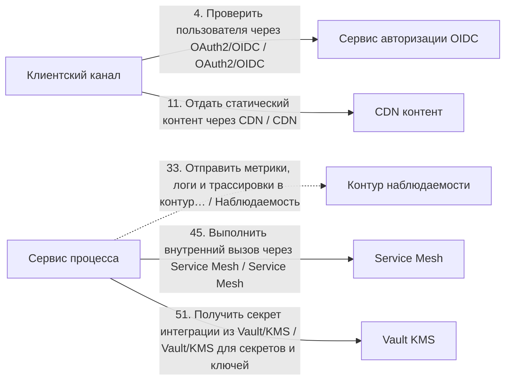

# Архитектурный разбор: Ультра-кейс: все цепочки и все технологии

## Короткий человеческий вывод

**Итог:** НЕ ГОТОВО: есть блокирующие риски. **Архитектурная готовность:** 0.0/10. **Готовность к промышленному запуску:** нельзя выпускать без закрытия блокеров.

**Полнота вводных:** 56%. **Надёжность рекомендаций:** низкая.

**Масштаб процесса:** 55 взаимодействий, из них 50 в основной цепочке и 5 сквозных контролей. Участников: 59.

**Бизнес-цель:** Проверить отчёт на полном наборе интеграционных цепочек и технологий.
**Основная сущность:** EnterpriseProcess. Деньги: да. Регуляторика: да. Клиентский сценарий: да.

**Как читать оценку:** низкая оценка не означает, что все выбранные технологии неправильные. Она означает, что до запуска есть блокеры: не закрыты гарантии доставки, восстановления, безопасности, сверки или эксплуатации.

## Что блокирует запуск

| Приоритет | Проблема | Где проявляется | Что сделать |
|---|---|---|---|
| Критический | Финансовую сущность изменяют несколько систем одновременно. | Сервис процесса, Сервис телеметрии | Назначьте единственного писателя для счёта или шарда и ведите неизменяемый журнал проводок; остальные системы должны отправлять команды, а не менять финансовое состояние напрямую. |
| Критический | Повторная обработка настроена без идемпотентности. | Затронуто мест: 2 | Добавьте ключ идемпотентности с уникальным индексом в БД или используйте устойчивый естественный бизнес-ключ; потребитель должен обрабатывать повторную доставку без изменения результата второй раз. |
| Высокий | В многоклиентском потоке не предусмотрена изоляция нагрузки. | Общая очередь/топик | Добавьте квоты по клиентам/tenant и справедливое распределение нагрузки; партиционируйте данные по tenantId; для крупных клиентов/tenant выделите отдельные пулы и отслеживайте отставание обработки по каждому клиенту/tenant. |
| Высокий | Замена legacy-системы описана без плана переключения. | Весь процесс | Используйте strangler-подход: параллельный прогон со сверкой старого и нового контура, поэтапное переключение трафика по процентам или сегментам, критерии переключения и план отката с сохранением данных, накопленных в новом контуре. |
| Высокий | В регуляторном процессе не описан аудиторский след. | Весь процесс | Ведите неизменяемый журнал операций с политикой срока хранения и сохраняйте evidence на каждый значимый переход статуса. |
| Высокий | В процессе есть слишком длинная синхронная цепочка: 3 блокирующих шага подряд. | Отправить синхронный REST-запрос в сервис заявок → Обновить поисковый индекс → Выполнить внутренний вызов через Service Mesh | Разорвите цепочку: после первого подтверждённого шага переводите дальнейшую обработку в события или очередь, а клиенту возвращайте идентификатор отслеживания и понятную статусную модель процесса. |
| Высокий | Дочерний вызов может ждать дольше, чем родительский шаг. | Затронуто мест: 4 | Таймауты должны строго убывать вниз по цепочке: дочерний таймаут должен быть меньше родительского с учётом сетевых накладных; общий бюджет времени распределяйте от целевого времени ответа сверху вниз. |
| Высокий | Высоконагруженный поток не имеет контролей приёма потока. | Пик 25000 RPS: «Отправить корпоративное сообщение в ActiveMQ», «Поставить сообщение в Azure Service Bus», «Опубликовать сообщение в Google Pub/Sub» | Используйте партиционирование по ключу и контроль горячих партиций; учитывайте время события и контрольную отметку загрузки с политикой обработки запоздалых событий; настройте обратное давление и алерты на лаг и пропускную способность. |
| Информация | Ещё 13 менее приоритетных замечаний | См. приложение с полным чек-листом | Разобрать после закрытия основных блокеров |

## Рекомендуемый порядок действий

1. Назначить единственного владельца финансовой сущности и запретить прямую запись из остальных систем.
2. Зафиксировать ключ идемпотентности и уникальный индекс для повторных запросов, событий и повторной обработки.
3. Добавить сверку ожидаемых и фактических данных и процедуру восстановления расхождений.
4. Для асинхронных участков описать лимит повторов, очередь ошибок, владельца разбора и повторную обработку.
5. Разорвать длинные синхронные цепочки: вернуть идентификатор отслеживания и вынести хвост обработки в очередь или событие.
6. Пересчитать бюджет таймаутов сверху вниз: дочерний вызов должен завершаться раньше родительского.
7. Описать план перехода со старого контура: параллельный прогон, критерии переключения и откат.
8. Добавить изоляцию нагрузки между клиентами/tenant: квоты, отдельные пулы для крупных клиентов и метрики отставания.
9. Для высоконагруженного потока описать партиционирование, горячие ключи, обратное давление и алерты на лаг.

## Проверка логики схемы

Схема не содержит очевидных противоречий между названием связи, участниками и выбранным основным способом взаимодействия.

## Почему выбраны технологии и способы взаимодействия

### Объяснение по шагам

Решения ниже сгруппированы по смыслу. В основной карте взаимодействий показано, **кто с кем взаимодействует и каким способом**. Сквозные вещи — аудит, безопасность, авторизация, наблюдаемость, секреты — вынесены отдельно и не смешиваются с бизнес-потоком.

Для каждого решения указано: **Почему выбрано**, **Почему не другой вариант**, **Обязательные условия**, **Почему предлагается именно так** и **Почему нельзя просто не делать**.

### API и онлайн-взаимодействие

### Шаг 3. Принять внешний запрос через API Gateway

**Что:** шаг 3 — «Принять внешний запрос через API Gateway». Основной способ взаимодействия: API Gateway.
**Где:** связь идёт от «Клиентский канал» к «API Gateway». Исполнитель: «API Gateway».
**Почему:** Нужен как единая внешняя точка входа: авторизация, лимиты запросов, маршрутизация, версия API и защита периметра.
**Почему не другой вариант:** Прямой вызов внутреннего сервиса раскрывает внутреннюю структуру и размазывает безопасность по сервисам. Брокеры не являются публичным входом для клиентского API.
**Что проверить перед выпуском:** Нужны проверка токена, лимиты запросов, трассировка, единая модель ошибок и запрет обхода шлюза.

### Шаг 8. Принять поздний результат по обратному вызову

**Что:** шаг 8 — «Принять поздний результат по обратному вызову». Основной способ взаимодействия: Входящий веб-вызов.
**Где:** связь идёт от «Внешний партнёр» к «Эндпоинт обратного результата». Исполнитель: «Сервис процесса».
**Почему:** Подходит, когда внешняя система сама присылает результат или статус в наш HTTP эндпоинт.
**Почему не другой вариант:** Kafka/RabbitMQ нельзя требовать от партнёра, если он работает через HTTP. Периодический опрос хуже, потому что создаёт лишнюю нагрузку и задержку.
**Служебные компоненты:** Для позднего входящего результата нужна таблица входящих сообщений: она защищает от дублей и повторной доставки.
**Что проверить перед выпуском:** Нужны подпись запроса, защита от повторов, окно времени, дедупликация и безопасное логирование без ПДн.

### Шаг 19. Передать сообщение через корпоративную ESB

**Что:** шаг 19 — «Передать сообщение через корпоративную ESB». Основной способ взаимодействия: Интеграционная шина ESB.
**Где:** связь идёт от «Сервис процесса» к «Корпоративная ESB». Исполнитель: «Сервис процесса».
**Почему:** Подходит, когда нужно связать несколько старых или корпоративных систем, выполнить маршрутизацию и преобразование форматов.
**Почему не другой вариант:** Прямые REST-вызовы увеличивают связанность систем. Kafka хороша для событий, но не всегда заменяет трансформации, оркестрацию и legacy-маршруты в enterprise-контуре.
**Что проверить перед выпуском:** Нужны владелец маршрутов, версии трансформаций, трассировка, контроль ошибок преобразования и идемпотентность.

### Шаг 23. Получить гибкую проекцию через GraphQL

**Что:** шаг 23 — «Получить гибкую проекцию через GraphQL». Основной способ взаимодействия: GraphQL.
**Где:** связь идёт от «Сервис процесса» к «GraphQL API клиентов». Исполнитель: «Сервис процесса».
**Почему:** Подходит для гибкого чтения, когда разные клиенты хотят получать разные наборы полей и не нужен отдельный REST-метод под каждую форму экрана.
**Почему не другой вариант:** REST проще для стабильных команд и фиксированных ресурсов. GraphQL хуже, если нет контроля сложности запроса и прав на уровне полей.
**Что проверить перед выпуском:** Нужны авторизация полей, лимит глубины/сложности запроса, пагинация, защита от тяжёлых запросов и понятный контракт схемы.

### Шаг 24. Быстро получить ответ от внутреннего gRPC-сервиса

**Что:** шаг 24 — «Быстро получить ответ от внутреннего gRPC-сервиса». Основной способ взаимодействия: gRPC.
**Где:** связь идёт от «Сервис процесса» к «Внутренний gRPC сервис скоринга». Исполнитель: «Сервис процесса».
**Почему:** Подходит для быстрого внутреннего вызова между сервисами при стабильном контракте и требовании низкой задержки.
**Почему не другой вариант:** REST проще для внешних потребителей. Kafka/RabbitMQ не подходят, если вызывающий сервис должен получить ответ сразу.
**Что проверить перед выпуском:** Нужны общий срок ожидания, контракт Protobuf, совместимость версий, повторные попытки только для безопасных операций и обработка недоступности сервиса.

### Шаг 34. Прочитать корпоративный справочник через OData

**Что:** шаг 34 — «Прочитать корпоративный справочник через OData». Основной способ взаимодействия: OData.
**Где:** связь идёт от «Сервис процесса» к «OData API справочников». Исполнитель: «Сервис процесса».
**Почему:** Подходит для корпоративного API по сущностям, где нужны стандартные фильтры, сортировка, выбор полей и интеграция с enterprise-инструментами.
**Почему не другой вариант:** REST проще для произвольных команд. GraphQL гибче для клиентских экранов, но хуже вписывается в контур, где уже принят OData-подход к сущностям.
**Что проверить перед выпуском:** Нужны ограничения фильтров, права на поля, лимит размера ответа, версионирование сущностей и аудит доступа.

### Шаг 43. Отправить синхронный REST-запрос в сервис заявок

**Что:** шаг 43 — «Отправить синхронный REST-запрос в сервис заявок». Основной способ взаимодействия: REST API.
**Где:** связь идёт от «Сервис процесса» к «REST-сервис заявок». Исполнитель: «Сервис процесса».
**Почему:** Подходит для синхронного запроса по HTTP: система отправляет запрос и должна получить ответ в рамках текущего сценария.
**Почему не другой вариант:** SOAP нужен в основном при старом WSDL/XML-контракте. Kafka, RabbitMQ и другие брокеры разрывают сценарий во времени и подходят, когда ответ не нужен сразу.
**Что проверить перед выпуском:** Нужны таймаут, лимит повторных попыток, единая модель ошибок, трассировка и ключ идемпотентности для операций с записью.

### Шаг 48. Вызвать legacy SOAP-контракт

**Что:** шаг 48 — «Вызвать legacy SOAP-контракт». Основной способ взаимодействия: SOAP.
**Где:** связь идёт от «Сервис процесса» к «Legacy SOAP-шлюз». Исполнитель: «Сервис процесса».
**Почему:** Подходит для старых корпоративных систем, если уже есть WSDL/XSD-контракт, XML-сообщения и регламент обмена через SOAP.
**Почему не другой вариант:** REST/gRPC проще для новых API, но могут быть невозможны без доработки старой системы. Брокер сообщений не заменит существующий синхронный SOAP-вызов.
**Что проверить перед выпуском:** Нужны версии XSD, описание SOAP Fault, таймауты, логирование исходного XML, маскирование чувствительных данных и регламент повторов.

### Шаг 50. Отправить серверные уведомления через SSE

**Что:** шаг 50 — «Отправить серверные уведомления через SSE». Основной способ взаимодействия: Server-Sent Events.
**Где:** связь идёт от «Сервис процесса» к «SSE канал уведомлений». Исполнитель: «Сервис процесса».
**Почему:** Подходит для однонаправленного потока уведомлений от сервера клиенту поверх HTTP, когда клиенту не нужно отправлять сообщения назад по тому же каналу.
**Почему не другой вариант:** WebSocket нужен для двустороннего обмена. REST периодический опрос создаёт лишнюю нагрузку. Брокер сообщений может быть внутри, но не заменяет клиентский поток.
**Что проверить перед выпуском:** Нужны Last-Event-ID, переподключение, лимит соединений, контроль частоты событий и запасной сценарий для клиентов без поддержки SSE.

### Шаг 53. Принять входящий веб-вызов от партнёра

**Что:** шаг 53 — «Принять входящий веб-вызов от партнёра». Основной способ взаимодействия: Входящий веб-вызов.
**Где:** связь идёт от «Внешний партнёр» к «Входящий эндпоинт результата». Исполнитель: «Сервис процесса».
**Почему:** Подходит, когда внешняя система сама присылает результат или статус в наш HTTP эндпоинт.
**Почему не другой вариант:** Kafka/RabbitMQ нельзя требовать от партнёра, если он работает через HTTP. Периодический опрос хуже, потому что создаёт лишнюю нагрузку и задержку.
**Служебные компоненты:** Для позднего входящего результата нужна таблица входящих сообщений: она защищает от дублей и повторной доставки.
**Что проверить перед выпуском:** Нужны подпись запроса, защита от повторов, окно времени, дедупликация и безопасное логирование без ПДн.

### Шаг 54. Открыть двусторонний WebSocket-канал

**Что:** шаг 54 — «Открыть двусторонний WebSocket-канал». Основной способ взаимодействия: WebSocket.
**Где:** связь идёт от «Сервис процесса» к «WebSocket канал оператора». Исполнитель: «Сервис процесса».
**Почему:** Подходит для двустороннего онлайн-канала, где сервер и клиент обмениваются сообщениями в рамках открытого соединения.
**Почему не другой вариант:** SSE проще для однонаправленных уведомлений от сервера клиенту. REST требует частых опросов. Kafka/RabbitMQ не являются клиентским онлайн-каналом.
**Что проверить перед выпуском:** Нужны heartbeat, переподключение, лимит соединений, авторизация сессии, обратное давление и стратегия доставки пропущенных сообщений.

### Асинхронный обмен

### Шаг 1. Отправить корпоративное сообщение в ActiveMQ

**Что:** шаг 1 — «Отправить корпоративное сообщение в ActiveMQ». Основной способ взаимодействия: ActiveMQ/Artemis.
**Где:** связь идёт от «Сервис процесса» к «ActiveMQ очередь». Исполнитель: «Сервис процесса».
**Почему:** Подходит для корпоративной JMS-очереди, если в организации уже используется Java/JMS-контур и нужны стандартные enterprise-возможности очередей.
**Почему не другой вариант:** RabbitMQ обычно проще для современных очередь задач. Kafka лучше для журнала событий. IBM MQ выбирают, если уже есть строгий мейнфрейм/банковский MQ-контур.
**Служебные компоненты:** БД процесса нужна как служебный компонент: она фиксирует состояние, ключ идемпотентности и историю шага. Служебная запись в БД не должна подменять канал взаимодействия с получателем. Если перед публикацией меняется состояние в БД, нужна таблица исходящих сообщений: изменение состояния и подготовка сообщения должны быть атомарными.
**Что проверить перед выпуском:** Нужны модель подтверждения, устойчивые очереди/топики, очередь ошибок, транзакционность при необходимости и мониторинг потребителей.

### Шаг 5. Поставить сообщение в Azure Service Bus

**Что:** шаг 5 — «Поставить сообщение в Azure Service Bus». Основной способ взаимодействия: Azure Service Bus.
**Где:** связь идёт от «Сервис процесса» к «Azure Service Bus». Исполнитель: «Сервис процесса».
**Почему:** Подходит для управляемой очереди/топика в Microsoft Azure, особенно если уже используется Azure AD, Logic Apps или корпоративный Microsoft-контур.
**Почему не другой вариант:** RabbitMQ/Kafka требуют отдельного сопровождения. AWS SNS/SQS или Google Pub/Sub выбираются в других облаках. очередь Redis слабее для критичной enterprise-очереди.
**Служебные компоненты:** БД процесса нужна как служебный компонент: она фиксирует состояние, ключ идемпотентности и историю шага. Служебная запись в БД не должна подменять канал взаимодействия с получателем. Если перед публикацией меняется состояние в БД, нужна таблица исходящих сообщений: изменение состояния и подготовка сообщения должны быть атомарными.
**Что проверить перед выпуском:** Нужно пространство имён, очередь, топик или подписка, очередь ошибок, срок блокировки сообщения, политика повторных попыток, ролевая модель доступа и мониторинг.

### Шаг 22. Опубликовать сообщение в Google Pub/Sub

**Что:** шаг 22 — «Опубликовать сообщение в Google Pub/Sub». Основной способ взаимодействия: Google Pub/Sub.
**Где:** связь идёт от «Сервис процесса» к «Google Pub/Sub». Исполнитель: «Сервис процесса».
**Почему:** Подходит для управляемой облачной pub/sub-интеграции в Google Cloud с автоматическим масштабированием подписчиков.
**Почему не другой вариант:** Kafka даёт больше контроля над партициями и срок хранения, но требует сопровождения. AWS/Azure варианты выбираются в своих облаках.
**Служебные компоненты:** БД процесса нужна как служебный компонент: она фиксирует состояние, ключ идемпотентности и историю шага. Служебная запись в БД не должна подменять канал взаимодействия с получателем. Если перед публикацией меняется состояние в БД, нужна таблица исходящих сообщений: изменение состояния и подготовка сообщения должны быть атомарными.
**Что проверить перед выпуском:** Нужны топик, подписка, ack предельный срок ожидания, тема ошибок, ключ порядка при необходимости, IAM и контроль накопление очереди.

### Шаг 25. Передать гарантированное сообщение в IBM MQ

**Что:** шаг 25 — «Передать гарантированное сообщение в IBM MQ». Основной способ взаимодействия: IBM MQ.
**Где:** связь идёт от «Сервис процесса» к «IBM MQ очередь». Исполнитель: «Сервис процесса».
**Почему:** Подходит для гарантированного корпоративного обмена в банках/enterprise/мейнфрейм-контуре, где IBM MQ уже является стандартом.
**Почему не другой вариант:** RabbitMQ проще и дешевле для новых очередей задач. Kafka лучше для событийного журнала. IBM MQ выбирают из-за совместимости, регламента и требований надёжности старого контура.
**Служебные компоненты:** БД процесса нужна как служебный компонент: она фиксирует состояние, ключ идемпотентности и историю шага. Служебная запись в БД не должна подменять канал взаимодействия с получателем. Если перед публикацией меняется состояние в БД, нужна таблица исходящих сообщений: изменение состояния и подготовка сообщения должны быть атомарными.
**Что проверить перед выпуском:** Нужны менеджер очередей, каналы, права, устойчивые сообщения, очередь ошибок, мониторинг глубины очередей и регламент разбора зависших сообщений.

### Шаг 26. Опубликовать бизнес-событие в Kafka

**Что:** шаг 26 — «Опубликовать бизнес-событие в Kafka». Основной способ взаимодействия: Kafka.
**Где:** связь идёт от «Сервис процесса» к «Журнал событий Kafka». Исполнитель: «Сервис процесса».
**Почему:** Подходит для потока событий, высокой нагрузки, повторной обработки, хранения истории событий и рассылки нескольким потребителям.
**Почему не другой вариант:** REST не подходит, если потребителей несколько и результат не нужен немедленно. RabbitMQ проще для очереди задач, но хуже как долговременный журнал событий. Redis Streams легче, но обычно слабее для критичного журнал событий.
**Служебные компоненты:** БД процесса нужна как служебный компонент: она фиксирует состояние, ключ идемпотентности и историю шага. Служебная запись в БД не должна подменять канал взаимодействия с получателем. Если перед публикацией меняется состояние в БД, нужна таблица исходящих сообщений: изменение состояния и подготовка сообщения должны быть атомарными. Нужна сверка полноты между источником и аналитическим контуром: количество записей, ключи, контрольные суммы и отчёт расхождений.
**Что проверить перед выпуском:** Нужны топик, ключ партиционирования, группа потребителей, срок хранения, очередь ошибок или карантин и инструкция повторной обработки.

### Шаг 30. Принять телеметрию устройства через MQTT

**Что:** шаг 30 — «Принять телеметрию устройства через MQTT». Основной способ взаимодействия: MQTT.
**Где:** связь идёт от «IoT устройство» к «MQTT broker». Исполнитель: «Сервис телеметрии».
**Почему:** Подходит для устройств, датчиков и IoT-сценариев, где важны лёгкий протокол, темы сообщений и разные уровни гарантии доставки.
**Почему не другой вариант:** REST тяжелее для частых сообщений от устройств. Kafka может принять поток дальше внутри платформы, но не всегда удобна как протокол подключения устройств.
**Служебные компоненты:** БД процесса нужна как служебный компонент: она фиксирует состояние, ключ идемпотентности и историю шага. Служебная запись в БД не должна подменять канал взаимодействия с получателем. Если перед публикацией меняется состояние в БД, нужна таблица исходящих сообщений: изменение состояния и подготовка сообщения должны быть атомарными.
**Что проверить перед выпуском:** Нужны топик-структура, QoS, идентификация устройства, контроль повторов, управление сессиями и защита канала.

### Шаг 31. Передать короткое событие через NATS

**Что:** шаг 31 — «Передать короткое событие через NATS». Основной способ взаимодействия: NATS.
**Где:** связь идёт от «Сервис процесса» к «шина NATS». Исполнитель: «Сервис процесса».
**Почему:** Подходит для лёгкой внутренней рассылки сообщений с малой задержкой, когда нужна простая pub/sub-модель без тяжёлого брокера.
**Почему не другой вариант:** Kafka лучше для долговременного журнала и повторная обработка. RabbitMQ лучше для надёжной очереди задач. NATS выбирается, когда важна простота и скорость, а не длительное хранение событий.
**Служебные компоненты:** БД процесса нужна как служебный компонент: она фиксирует состояние, ключ идемпотентности и историю шага. Служебная запись в БД не должна подменять канал взаимодействия с получателем. Если перед публикацией меняется состояние в БД, нужна таблица исходящих сообщений: изменение состояния и подготовка сообщения должны быть атомарными.
**Что проверить перед выпуском:** Нужны правила именования subject-ов, правила подписки, допустимость потерь/JetStream при необходимости, мониторинг и ограничения размера сообщений.

### Шаг 35. Опубликовать потоковое событие в Pulsar

**Что:** шаг 35 — «Опубликовать потоковое событие в Pulsar». Основной способ взаимодействия: Pulsar.
**Где:** связь идёт от «Сервис процесса» к «Журнал событий Pulsar». Исполнитель: «Сервис процесса».
**Почему:** Подходит для масштабного потока событий, когда нужны независимое хранение, много подписок, разделение хранения и вычисления или сложная многоклиентская модель.
**Почему не другой вариант:** Kafka чаще проще найти в командах и инфраструктуре. RabbitMQ лучше для очереди задач. Pulsar стоит выбирать, когда его преимущества реально нужны и команда умеет его сопровождать.
**Служебные компоненты:** БД процесса нужна как служебный компонент: она фиксирует состояние, ключ идемпотентности и историю шага. Служебная запись в БД не должна подменять канал взаимодействия с получателем. Если перед публикацией меняется состояние в БД, нужна таблица исходящих сообщений: изменение состояния и подготовка сообщения должны быть атомарными. Нужна сверка полноты между источником и аналитическим контуром: количество записей, ключи, контрольные суммы и отчёт расхождений.
**Что проверить перед выпуском:** Нужны клиент/tenant, пространство имён и топик, срок хранения, накопление очереди, тип подписки, ключ порядка, мониторинг накопления очереди и план эксплуатации BookKeeper/хранилища.

### Шаг 36. Поставить задачу в корпоративную очередь без выбранного брокера

**Что:** шаг 36 — «Поставить задачу в корпоративную очередь без выбранного брокера». Основной способ взаимодействия: Очередь сообщений, брокер пока не выбран.
**Где:** связь идёт от «Сервис процесса» к «Корпоративная очередь». Исполнитель: «Сервис процесса».
**Почему:** Подходит как нейтральное решение, когда известно, что нужна асинхронная очередь, но конкретный брокер ещё не утверждён.
**Почему не другой вариант:** REST не подходит для отложенной обработки. Kafka/RabbitMQ/Redis выбираются позже по требованиям: журнал событий, маршрутизация, надёжность, нагрузка и стоимость эксплуатации.
**Служебные компоненты:** БД процесса нужна как служебный компонент: она фиксирует состояние, ключ идемпотентности и историю шага. Служебная запись в БД не должна подменять канал взаимодействия с получателем. Если перед публикацией меняется состояние в БД, нужна таблица исходящих сообщений: изменение состояния и подготовка сообщения должны быть атомарными.
**Что проверить перед выпуском:** Нужно отдельно выбрать брокер, определить модель подтверждения, лимит повторов, очередь ошибок и владельца разбора.

### Шаг 37. Поставить фоновую задачу в RabbitMQ

**Что:** шаг 37 — «Поставить фоновую задачу в RabbitMQ». Основной способ взаимодействия: RabbitMQ.
**Где:** связь идёт от «Сервис процесса» к «Очередь задач RabbitMQ». Исполнитель: «Сервис процесса».
**Почему:** Подходит для очереди задач, маршрутизации, подтверждения обработки, ограниченного числа обработчиков и сценариев очереди задач.
**Почему не другой вариант:** Kafka лучше для журнала событий, повторной обработки и большого числа независимых потребителей. REST не выравнивает нагрузку между обработчиками. очередь Redis проще, но слабее для критичных процессов.
**Служебные компоненты:** БД процесса нужна как служебный компонент: она фиксирует состояние, ключ идемпотентности и историю шага. Служебная запись в БД не должна подменять канал взаимодействия с получателем. Если перед публикацией меняется состояние в БД, нужна таблица исходящих сообщений: изменение состояния и подготовка сообщения должны быть атомарными.
**Что проверить перед выпуском:** Нужны exchange, ключ маршрутизации, очередь, подтверждение обработки, обменник очереди ошибок, предварительная выдача сообщений обработчику и лимит повторов.

### Шаг 41. Поставить короткую задачу в очередь Redis

**Что:** шаг 41 — «Поставить короткую задачу в очередь Redis». Основной способ взаимодействия: Redis как короткая очередь задач.
**Где:** связь идёт от «Сервис процесса» к «очередь Redis». Исполнитель: «Сервис процесса».
**Почему:** Подходит для простых фоновых задач с коротким сроком жизни, где допустимы ограничения Redis.
**Почему не другой вариант:** RabbitMQ надёжнее для критичных очередь задач. Kafka лучше подходит для событий и повторной обработки. БД-таблица проще, но хуже по производительности очереди.
**Служебные компоненты:** БД процесса нужна как служебный компонент: она фиксирует состояние, ключ идемпотентности и историю шага. Служебная запись в БД не должна подменять канал взаимодействия с получателем. Если перед публикацией меняется состояние в БД, нужна таблица исходящих сообщений: изменение состояния и подготовка сообщения должны быть атомарными.
**Что проверить перед выпуском:** Нужны TTL, повторные попытки, обработка зависших задач и понимание риска потери при неверной настройке сохранность данных.

### Шаг 42. Записать короткий поток в Redis Streams

**Что:** шаг 42 — «Записать короткий поток в Redis Streams». Основной способ взаимодействия: Redis Streams.
**Где:** связь идёт от «Сервис процесса» к «Redis Streams». Исполнитель: «Сервис процесса».
**Почему:** Подходит для лёгкого потока событий или задач внутри контура, когда уже используется Redis и требования к долговременному хранению ниже, чем у Kafka.
**Почему не другой вариант:** Kafka надёжнее для долгого журнал событий и масштабной повторной обработки. RabbitMQ удобнее для сложной маршрутизации задач. Redis cache не является очередью событий.
**Служебные компоненты:** БД процесса нужна как служебный компонент: она фиксирует состояние, ключ идемпотентности и историю шага. Служебная запись в БД не должна подменять канал взаимодействия с получателем. Если перед публикацией меняется состояние в БД, нужна таблица исходящих сообщений: изменение состояния и подготовка сообщения должны быть атомарными.
**Что проверить перед выпуском:** Нужны группа потребителей, контроль зависшие сообщения, политика обрезки stream и понимание настроек сохранности Redis.

### Шаг 47. Разослать облачное событие через SNS/SQS

**Что:** шаг 47 — «Разослать облачное событие через SNS/SQS». Основной способ взаимодействия: AWS SNS/SQS.
**Где:** связь идёт от «Сервис процесса» к «AWS SNS/SQS». Исполнитель: «Сервис процесса».
**Почему:** Подходит для облачной очереди или топика в AWS-контуре, когда команда хочет управляемый сервис без собственного брокера.
**Почему не другой вариант:** Kafka/RabbitMQ дают больше контроля, но требуют сопровождения. Azure Service Bus или Google Pub/Sub выбираются в соответствующих облаках.
**Служебные компоненты:** БД процесса нужна как служебный компонент: она фиксирует состояние, ключ идемпотентности и историю шага. Служебная запись в БД не должна подменять канал взаимодействия с получателем. Если перед публикацией меняется состояние в БД, нужна таблица исходящих сообщений: изменение состояния и подготовка сообщения должны быть атомарными.
**Что проверить перед выпуском:** Нужны IAM-права, очередь ошибок, таймаут видимости сообщения, выбор FIFO-очереди или стандартной очереди, лимиты облака, стоимость и мониторинг задержек.

### Данные и чтение

### Шаг 9. Записать высокочастотную телеметрию в Cassandra

**Что:** шаг 9 — «Записать высокочастотную телеметрию в Cassandra». Основной способ взаимодействия: Cassandra/ScyllaDB.
**Где:** связь идёт от «Сервис процесса» к «Cassandra telemetry store». Исполнитель: «Сервис процесса».
**Почему:** Подходит для очень больших распределённых записей по ключу, высокой записи и предсказуемых запросов по ключу партиционирования.
**Почему не другой вариант:** Реляционная БД проще для транзакций и ad-hoc запросов. MongoDB удобнее для документов. Cassandra плоха, если заранее неизвестны ключи доступа.
**Служебные компоненты:** БД процесса нужна как служебный компонент: она фиксирует состояние, ключ идемпотентности и историю шага.
**Что проверить перед выпуском:** Нужен ключ партиционирования, ключ кластеризации, уровень консистентности, TTL, процедуры восстановления и уплотнения данных и проверка горячих партиций.

### Шаг 15. Сохранить состояние процесса в основной БД

**Что:** шаг 15 — «Сохранить состояние процесса в основной БД». Основной способ взаимодействия: Основная база данных.
**Где:** связь идёт от «Сервис процесса» к «Основная БД процесса». Исполнитель: «Сервис процесса».
**Почему:** Подходит для фиксации состояния процесса, статусов, ключей идемпотентности, истории и технического журнала шагов.
**Почему не другой вариант:** Redis не должен быть источником истины. Kafka/RabbitMQ передают сообщения, но не заменяют надёжную операционную запись. Аналитическое хранилище не подходит для оперативной транзакции.
**Что проверить перед выпуском:** Нужны транзакции, уникальные индексы, версия записи или optimistic locking, сроки хранения и план очистки технических таблиц.

### Шаг 16. Записать горячую сущность в шардированный кластер БД

**Что:** шаг 16 — «Записать горячую сущность в шардированный кластер БД». Основной способ взаимодействия: Шардирование базы данных.
**Где:** связь идёт от «Сервис процесса» к «Шардированный кластер БД». Исполнитель: «Сервис процесса».
**Почему:** Подходит, когда объём данных или запись по одному хранилищу уже не масштабируется и есть естественный ключ разделения.
**Почему не другой вариант:** Реплика чтения разгружает только нагрузку на чтение. Кэш не решает рост записи и объёма. Шардирование нельзя вводить без ключа доступа и стратегии ребалансировки.
**Служебные компоненты:** БД процесса нужна как служебный компонент: она фиксирует состояние, ключ идемпотентности и историю шага.
**Что проверить перед выпуском:** Нужны ключ шардинга, правила ребалансировки, ограничения межшардовых запросов, миграция данных и тесты горячих ключей.

### Шаг 18. Сохранить запись формата «ключ-значение» в DynamoDB

**Что:** шаг 18 — «Сохранить запись формата «ключ-значение» в DynamoDB». Основной способ взаимодействия: Хранилище ключ-значение.
**Где:** связь идёт от «Сервис процесса» к «Key-Value хранилище». Исполнитель: «Сервис процесса».
**Почему:** Подходит для быстрого доступа по ключу в управляемом key-value/NoSQL-хранилище с предсказуемыми сценариями доступа.
**Почему не другой вариант:** Реляционная БД лучше для сложных связей и транзакционных запросов. Cassandra чаще выбирается для самостоятельно сопровождаемой распределённой модели. Redis не источник истины для долговременных бизнес-данных.
**Служебные компоненты:** БД процесса нужна как служебный компонент: она фиксирует состояние, ключ идемпотентности и историю шага.
**Что проверить перед выпуском:** Нужен ключ партиционирования, ключ сортировки, условная запись, TTL, лимиты пропускной способности и защита от горячих ключей.

### Шаг 28. Положить временный справочник в Memcached

**Что:** шаг 28 — «Положить временный справочник в Memcached». Основной способ взаимодействия: Memcached как простой временный кэш.
**Где:** связь идёт от «Сервис процесса» к «Memcached cache». Исполнитель: «Сервис процесса».
**Почему:** Подходит для простого временного кэша без сложных структур, когда нужна высокая скорость чтения и допустима потеря кэша.
**Почему не другой вариант:** Redis богаче по структурам данных и сценариям блокировок/streams. БД остаётся источником истины, но не должна держать весь горячий read-трафик.
**Что проверить перед выпуском:** Нужны TTL, стратегия инвалидации, запасной сценарий к источнику, лимит размера значений и защита от лавины одновременных обращений к источнику данных.

### Шаг 29. Сохранить документ заявки в MongoDB

**Что:** шаг 29 — «Сохранить документ заявки в MongoDB». Основной способ взаимодействия: Документное хранилище.
**Где:** связь идёт от «Сервис процесса» к «MongoDB документы». Исполнитель: «Сервис процесса».
**Почему:** Подходит для гибких документов и меняющейся структуры, когда сущность удобнее хранить как документ, а не как набор жёстких таблиц.
**Почему не другой вариант:** Реляционная БД лучше для строгих связей, транзакций и отчётности по нормализованной модели. Key-value проще, но хуже для сложного документа и индексов по полям.
**Служебные компоненты:** БД процесса нужна как служебный компонент: она фиксирует состояние, ключ идемпотентности и историю шага.
**Что проверить перед выпуском:** Нужны схема документа, индексы, правила миграции структуры, лимит размера документа и стратегия консистентности.

### Шаг 38. Прочитать состояние из реплики чтения

**Что:** шаг 38 — «Прочитать состояние из реплики чтения». Основной способ взаимодействия: Реплика БД.
**Где:** связь идёт от «Сервис процесса» к «Реплика чтения». Исполнитель: «Сервис процесса».
**Почему:** Подходит, если чтений много и нужно разгрузить основную БД без изменения модели записи.
**Почему не другой вариант:** Кэш быстрее, но может устаревать и требует инвалидации. Шардирование сложнее и нужно, когда уже не хватает разделения по нагрузке/объёму.
**Что проверить перед выпуском:** Нужны контроль задержки репликации, маршрутизация read-only запросов, запасной сценарий на основную БД и запрет операций записи в реплику.

### Шаг 39. Положить горячую модель в Redis cache

**Что:** шаг 39 — «Положить горячую модель в Redis cache». Основной способ взаимодействия: Redis как кэш.
**Где:** связь идёт от «Сервис процесса» к «Redis cache». Исполнитель: «Сервис процесса».
**Почему:** Подходит для ускорения чтения часто используемых данных, если потеря кэша не разрушает бизнес-состояние.
**Почему не другой вариант:** БД остаётся источником истины. Kafka/RabbitMQ не ускоряют чтение текущего состояния. Redis lock нужен для блокировки, а не для чтения данных.
**Что проверить перед выпуском:** Нужны TTL, инвалидация, защита от лавины обращений к источнику и запасной сценарий чтения из БД/источника.

### Шаг 40. Поставить распределённую блокировку в Redis

**Что:** шаг 40 — «Поставить распределённую блокировку в Redis». Основной способ взаимодействия: Redis как распределённая блокировка.
**Где:** связь идёт от «Сервис процесса» к «Redis lock service». Исполнитель: «Сервис процесса».
**Почему:** Подходит для короткой защиты критической секции, когда нельзя параллельно выполнять операцию по одной сущности.
**Почему не другой вариант:** Кэш Redis не решает взаимное исключение. БД-lock может быть надёжнее для финансовой записи, но дороже и сильнее нагружает БД. Kafka сама по себе не блокирует критическую секцию.
**Что проверить перед выпуском:** Нужны TTL, защитный токен блокировки, безопасное освобождение и обработка зависшего процесса.

### Шаг 44. Обновить поисковый индекс

**Что:** шаг 44 — «Обновить поисковый индекс». Основной способ взаимодействия: Поисковый индекс.
**Где:** связь идёт от «Сервис процесса» к «Поисковый индекс». Исполнитель: «Сервис процесса».
**Почему:** Подходит для полнотекстового поиска, фильтрации по многим полям и быстрых пользовательских выборок.
**Почему не другой вариант:** БД может быть источником истины, но не всегда удобна для полнотекстового поиска. Redis ускоряет чтение по ключу, но не заменяет поисковый индекс.
**Служебные компоненты:** БД процесса нужна как служебный компонент: она фиксирует состояние, ключ идемпотентности и историю шага.
**Что проверить перед выпуском:** Нужны переиндексация, контроль отставания индекса, правила актуализации и понятная свежесть данных для пользователя.

### Шаг 52. Записать embedding документа в векторную БД

**Что:** шаг 52 — «Записать embedding документа в векторную БД». Основной способ взаимодействия: Векторное хранилище.
**Где:** связь идёт от «Сервис процесса» к «Векторная БД». Исполнитель: «Сервис процесса».
**Почему:** Подходит для семантического поиска по текстам, похожих документов, эмбеддингов и сценариев поиска по смыслу.
**Почему не другой вариант:** Обычный search лучше для точных фильтров и полнотекста. Реляционная БД не предназначена как основной движок similarity search.
**Служебные компоненты:** БД процесса нужна как служебный компонент: она фиксирует состояние, ключ идемпотентности и историю шага.
**Что проверить перед выпуском:** Нужны модель эмбеддингов, версия векторов, переиндексация, контроль качества поиска и правила доступа к исходным текстам.

### Аналитика и загрузки

### Шаг 2. Оркестрировать загрузки через Airflow

**Что:** шаг 2 — «Оркестрировать загрузки через Airflow». Основной способ взаимодействия: Airflow как оркестратор загрузок.
**Где:** связь идёт от «Сервис процесса» к «Airflow DAG». Исполнитель: «Сервис процесса».
**Почему:** Подходит для управления зависимыми заданиями: загрузки, проверки, преобразования, ожидания файлов и повторные запуски.
**Почему не другой вариант:** Один batch-скрипт проще, но быстро становится неуправляемым при зависимостях и целевое время ответа. Kafka не решает расписание и DAG-зависимости загрузок.
**Служебные компоненты:** БД процесса нужна как служебный компонент: она фиксирует состояние, ключ идемпотентности и историю шага. Служебная запись в БД не должна подменять канал взаимодействия с получателем. Нужна сверка полноты между источником и аналитическим контуром: количество записей, ключи, контрольные суммы и отчёт расхождений.
**Что проверить перед выпуском:** Нужен DAG, расписание, политика повторных попыток, целевое время ответа, алерты, дозагрузка исторических данных или повторный запуск и правила обработки частично выполненных загрузок.

### Шаг 6. Запустить пакетную обработку периода

**Что:** шаг 6 — «Запустить пакетную обработку периода». Основной способ взаимодействия: Пакетная обработка.
**Где:** связь идёт от «Сервис процесса» к «Batch processor». Исполнитель: «Сервис процесса».
**Почему:** Подходит для обработки по расписанию, сверки, загрузки периода или массовой операции, где допустима задержка.
**Почему не другой вариант:** REST/gRPC не подходят для больших периодических объёмов. Kafka хороша для потока событий, но не всегда удобна для регламентной сверки периода.
**Служебные компоненты:** БД процесса нужна как служебный компонент: она фиксирует состояние, ключ идемпотентности и историю шага. Служебная запись в БД не должна подменять канал взаимодействия с получателем. Нужна сверка полноты между источником и аналитическим контуром: количество записей, ключи, контрольные суммы и отчёт расхождений.
**Что проверить перед выпуском:** Нужны идентификатор задания, контрольную отметку загрузки, контроль количества записей, повторный запуск периода и отчёт расхождений.

### Шаг 10. Передать изменения из БД через CDC

**Что:** шаг 10 — «Передать изменения из БД через CDC». Основной способ взаимодействия: Передача изменений из базы данных.
**Где:** связь идёт от «Сервис процесса» к «CDC pipeline». Исполнитель: «Сервис процесса».
**Почему:** Подходит, когда данные уже зафиксированы в операционной БД и их нужно передавать в аналитический контур без замедления основного процесса.
**Почему не другой вариант:** Прямая запись в аналитическое хранилище из бизнес-сервиса связывает операционный процесс с аналитикой. Batch проще, но даёт большую задержку. Событие из приложения требует строгой дисциплины таблицы исходящих сообщений.
**Служебные компоненты:** БД процесса нужна как служебный компонент: она фиксирует состояние, ключ идемпотентности и историю шага. Служебная запись в БД не должна подменять канал взаимодействия с получателем. Нужна сверка полноты между источником и аналитическим контуром: количество записей, ключи, контрольные суммы и отчёт расхождений.
**Что проверить перед выпуском:** Нужны контроль позиции чтения, контроль отставания, совместимость схем, повторная синхронизация и сверка полноты.

### Шаг 12. Записать события в ClickHouse

**Что:** шаг 12 — «Записать события в ClickHouse». Основной способ взаимодействия: Колоночная аналитическая база данных.
**Где:** связь идёт от «Сервис процесса» к «ClickHouse аналитика». Исполнитель: «Сервис процесса».
**Почему:** Подходит для быстрой аналитики по большим таблицам, агрегаций, витрин и отчётов по событиям.
**Почему не другой вариант:** Операционная БД не должна выполнять тяжёлую аналитику. аналитическое хранилище шире по назначению, но ClickHouse удобен для быстрых аналитических запросов и логовых витрин.
**Служебные компоненты:** БД процесса нужна как служебный компонент: она фиксирует состояние, ключ идемпотентности и историю шага. Служебная запись в БД не должна подменять канал взаимодействия с получателем. Нужна сверка полноты между источником и аналитическим контуром: количество записей, ключи, контрольные суммы и отчёт расхождений.
**Что проверить перед выпуском:** Нужны партиционирование, ключ сортировки, контроль свежести, политика хранения и сверка с источником.

### Шаг 13. Сложить сырые данные в Data Lake

**Что:** шаг 13 — «Сложить сырые данные в Data Lake». Основной способ взаимодействия: ETL/ELT-загрузка.
**Где:** связь идёт от «Сервис процесса» к «Data Lake raw zone». Исполнитель: «Сервис процесса».
**Почему:** Подходит для передачи данных в аналитический контур с преобразованием, контролем качества и подготовкой витрин.
**Почему не другой вариант:** Операционная БД является источником данных, но не способом доставки в аналитику. Прямая запись сервиса в аналитическое хранилище повышает связанность. CDC лучше для передачи изменений почти в реальном времени, Batch — для регламентной периодической загрузки.
**Служебные компоненты:** БД процесса нужна как служебный компонент: она фиксирует состояние, ключ идемпотентности и историю шага. Служебная запись в БД не должна подменять канал взаимодействия с получателем. Нужна сверка полноты между источником и аналитическим контуром: количество записей, ключи, контрольные суммы и отчёт расхождений.
**Что проверить перед выпуском:** Нужны правила преобразования, контроль количества записей, журнал загрузки, карантин ошибок, повторный запуск периода и сверка с источником.

### Шаг 14. Загрузить согласованные витрины в Data Warehouse

**Что:** шаг 14 — «Загрузить согласованные витрины в Data Warehouse». Основной способ взаимодействия: ETL/ELT-загрузка.
**Где:** связь идёт от «Сервис процесса» к «Data Warehouse». Исполнитель: «Сервис процесса».
**Почему:** Подходит для передачи данных в аналитический контур с преобразованием, контролем качества и подготовкой витрин.
**Почему не другой вариант:** Операционная БД является источником данных, но не способом доставки в аналитику. Прямая запись сервиса в аналитическое хранилище повышает связанность. CDC лучше для передачи изменений почти в реальном времени, Batch — для регламентной периодической загрузки.
**Служебные компоненты:** БД процесса нужна как служебный компонент: она фиксирует состояние, ключ идемпотентности и историю шага. Служебная запись в БД не должна подменять канал взаимодействия с получателем. Нужна сверка полноты между источником и аналитическим контуром: количество записей, ключи, контрольные суммы и отчёт расхождений.
**Что проверить перед выпуском:** Нужны правила преобразования, контроль количества записей, журнал загрузки, карантин ошибок, повторный запуск периода и сверка с источником.

### Шаг 17. Собрать аналитические модели в dbt

**Что:** шаг 17 — «Собрать аналитические модели в dbt». Основной способ взаимодействия: dbt как слой аналитических моделей.
**Где:** связь идёт от «Сервис процесса» к «dbt модели витрин». Исполнитель: «Сервис процесса».
**Почему:** Подходит для управляемых SQL-моделей, тестов качества, происхождение данных и прозрачной сборки аналитических витрин.
**Почему не другой вариант:** ETL-инструмент шире по загрузке данных, но dbt удобен для трансформаций внутри хранилища. Ручные SQL-скрипты хуже сопровождаются и тестируются.
**Служебные компоненты:** БД процесса нужна как служебный компонент: она фиксирует состояние, ключ идемпотентности и историю шага. Служебная запись в БД не должна подменять канал взаимодействия с получателем. Нужна сверка полноты между источником и аналитическим контуром: количество записей, ключи, контрольные суммы и отчёт расхождений.
**Что проверить перед выпуском:** Нужны модели, тесты, проверки свежести данных, документация, происхождение данных, окружения и правила релиза.

### Шаг 20. Загрузить данные в аналитику через ETL/ELT

**Что:** шаг 20 — «Загрузить данные в аналитику через ETL/ELT». Основной способ взаимодействия: ETL/ELT-загрузка.
**Где:** связь идёт от «Сервис процесса» к «ETL/ELT pipeline». Исполнитель: «Сервис процесса».
**Почему:** Подходит для передачи данных в аналитический контур с преобразованием, контролем качества и подготовкой витрин.
**Почему не другой вариант:** Операционная БД является источником данных, но не способом доставки в аналитику. Прямая запись сервиса в аналитическое хранилище повышает связанность. CDC лучше для передачи изменений почти в реальном времени, Batch — для регламентной периодической загрузки.
**Служебные компоненты:** БД процесса нужна как служебный компонент: она фиксирует состояние, ключ идемпотентности и историю шага. Служебная запись в БД не должна подменять канал взаимодействия с получателем. Нужна сверка полноты между источником и аналитическим контуром: количество записей, ключи, контрольные суммы и отчёт расхождений.
**Что проверить перед выпуском:** Нужны правила преобразования, контроль количества записей, журнал загрузки, карантин ошибок, повторный запуск периода и сверка с источником.

### Шаг 27. Опубликовать очищенные таблицы в Lakehouse

**Что:** шаг 27 — «Опубликовать очищенные таблицы в Lakehouse». Основной способ взаимодействия: ETL/ELT-загрузка.
**Где:** связь идёт от «Сервис процесса» к «Lakehouse curated zone». Исполнитель: «Сервис процесса».
**Почему:** Подходит для передачи данных в аналитический контур с преобразованием, контролем качества и подготовкой витрин.
**Почему не другой вариант:** Операционная БД является источником данных, но не способом доставки в аналитику. Прямая запись сервиса в аналитическое хранилище повышает связанность. CDC лучше для передачи изменений почти в реальном времени, Batch — для регламентной периодической загрузки.
**Служебные компоненты:** БД процесса нужна как служебный компонент: она фиксирует состояние, ключ идемпотентности и историю шага. Служебная запись в БД не должна подменять канал взаимодействия с получателем. Нужна сверка полноты между источником и аналитическим контуром: количество записей, ключи, контрольные суммы и отчёт расхождений.
**Что проверить перед выпуском:** Нужны правила преобразования, контроль количества записей, журнал загрузки, карантин ошибок, повторный запуск периода и сверка с источником.

### Шаг 49. Обработать большой объём данных в Spark

**Что:** шаг 49 — «Обработать большой объём данных в Spark». Основной способ взаимодействия: Spark.
**Где:** связь идёт от «Сервис процесса» к «Spark cluster». Исполнитель: «Сервис процесса».
**Почему:** Подходит для большой распределённой обработки данных: тяжёлые преобразования, агрегации, пересчёты истории и обработка больших файлов.
**Почему не другой вариант:** Обычный batch проще для малых объёмов. ClickHouse/аналитическое хранилище лучше для запросов по уже подготовленным данным. Spark нужен именно для распределённого вычисления.
**Служебные компоненты:** БД процесса нужна как служебный компонент: она фиксирует состояние, ключ идемпотентности и историю шага. Служебная запись в БД не должна подменять канал взаимодействия с получателем. Нужна сверка полноты между источником и аналитическим контуром: количество записей, ключи, контрольные суммы и отчёт расхождений.
**Что проверить перед выпуском:** Нужны партиционирование, checkpoint, контроль shuffle, повторный запуск, ресурсы кластера и контроль качества результата.

### Файлы и доставка контента

### Шаг 21. Сформировать файл выгрузки

**Что:** шаг 21 — «Сформировать файл выгрузки». Основной способ взаимодействия: Файловая передача.
**Где:** связь идёт от «Сервис процесса» к «Файловый каталог обмена». Исполнитель: «Сервис процесса».
**Почему:** Подходит для пакетной передачи документов или больших наборов данных, когда процесс не требует мгновенного ответа.
**Почему не другой вариант:** REST неудобен для больших файлов и массовой загрузки. Kafka не должна переносить тяжёлые документы внутри события. объектное хранилище лучше для хранения больших файлов, а file — для факта передачи.
**Служебные компоненты:** БД процесса нужна как служебный компонент: она фиксирует состояние, ключ идемпотентности и историю шага.
**Что проверить перед выпуском:** Нужны контрольная сумма, размер, тип файла, антивирусная проверка, карантин и журнал строк/документов.

### Шаг 32. Сохранить большой документ в Object Storage

**Что:** шаг 32 — «Сохранить большой документ в Object Storage». Основной способ взаимодействия: Объектное хранилище.
**Где:** связь идёт от «Сервис процесса» к «объектное хранилище S3». Исполнитель: «Сервис процесса».
**Почему:** Подходит для хранения больших файлов, документов, сканов и вложений, когда в сообщениях нужно передавать только ссылку.
**Почему не другой вариант:** БД не стоит нагружать большими бинарными файлами. Kafka/RabbitMQ не должны переносить тяжёлые документы. File/SFTP могут быть транспортом, но не обязательно удобным хранилищем.
**Служебные компоненты:** БД процесса нужна как служебный компонент: она фиксирует состояние, ключ идемпотентности и историю шага.
**Что проверить перед выпуском:** Нужны права доступа, срок хранения, шифрование, антивирусная проверка и запрет публичных ссылок без срока действия.

### Шаг 46. Передать файл партнёру через SFTP

**Что:** шаг 46 — «Передать файл партнёру через SFTP». Основной способ взаимодействия: SFTP.
**Где:** связь идёт от «Сервис процесса» к «SFTP сервер партнёра». Исполнитель: «Сервис процесса».
**Почему:** Подходит для защищённого файлового обмена с legacy или внешним контрагентом, когда API недоступен или запрещён регламентом.
**Почему не другой вариант:** REST/gRPC удобнее для оперативных запросов, но не подходят, если партнёр работает только файлами. Kafka/RabbitMQ обычно не доступны между организациями без отдельного соглашения.
**Служебные компоненты:** Если партнёр вернёт результат позже, нужен отдельный входящий шаг: партнёр присылает статус в сервис процесса с подписью и дедупликацией.
**Что проверить перед выпуском:** Нужны имя файла, контрольная сумма, идентификатор пакета, журнал загрузки, карантин ошибок и повторная обработка файла.

### Оркестрация процесса

### Шаг 7. Передать ручной этап в BPMN-процесс

**Что:** шаг 7 — «Передать ручной этап в BPMN-процесс». Основной способ взаимодействия: BPM/BPMN-движок.
**Где:** связь идёт от «Сервис процесса» к «BPMN Camunda». Исполнитель: «Сервис процесса».
**Почему:** Подходит, когда процесс содержит согласования, ручные бизнес-задачи, роли, целевое время ответа и эскалации.
**Почему не другой вариант:** Workflow engine лучше для технической оркестрации. Простая таблица задач хуже, если бизнес хочет видеть и менять схему процесса.
**Что проверить перед выпуском:** Нужны роли, формы задач, целевое время ответа, эскалации, аудит решений, версии процесса и правила миграции активных экземпляров.

### Шаг 55. Запустить длительный процесс в Workflow engine

**Что:** шаг 55 — «Запустить длительный процесс в Workflow engine». Основной способ взаимодействия: Движок длительного процесса.
**Где:** связь идёт от «Сервис процесса» к «Workflow engine Temporal». Исполнитель: «Сервис процесса».
**Почему:** Подходит для долгого процесса с состояниями, таймерами, ожиданием внешних результатов и компенсационными действиями.
**Почему не другой вариант:** Простая БД со статусами может хватить для короткого процесса, но становится хрупкой при таймерах, ожиданиях, повторная попытка и компенсациях. Kafka хранит события, но не заменяет orchestration state.
**Что проверить перед выпуском:** Нужны модель состояний, таймеры, компенсации, история процесса, идемпотентность команд и правила ручного вмешательства.

## Сквозные контроли и служебные компоненты

Эти элементы не являются отдельными бизнес-шагами. Они применяются к процессу как контроль безопасности, эксплуатации, аудита или инфраструктуры.

### Контроль 4. Проверить пользователя через OAuth2/OIDC

**Назначение:** OAuth2/OIDC.
**Где применяется:** «Клиентский канал» → «Сервис авторизации OIDC» или ко всему процессу.
**Зачем нужен:** Подходит для единой авторизации пользователей, сервисов или партнёров с токенами, правами доступа и централизованной проверкой доступа.
**Что проверить:** Нужны права доступа и атрибуты токена, срок жизни токена, правила обновления токенов, аудит входа, ротация ключей и проверка прав на уровне действий.

### Контроль 11. Отдать статический контент через CDN

**Назначение:** CDN.
**Где применяется:** «Клиентский канал» → «CDN контент» или ко всему процессу.
**Зачем нужен:** Подходит для быстрой раздачи статических файлов или публичных/полупубличных вложений пользователям в разных регионах.
**Что проверить:** Нужны правила кэширования, очистка кэша, срок жизни ссылки, приватный доступ, защита от утечки и стратегия обновления файлов.

### Контроль 33. Отправить метрики, логи и трассировки в контур наблюдаемости

**Назначение:** Наблюдаемость.
**Где применяется:** «Сервис процесса» → «Контур наблюдаемости» или ко всему процессу.
**Зачем нужен:** Подходит, чтобы видеть, где завис процесс: метрики, логи, трассировки, алерты и бизнес-события по состояниям.
**Что проверить:** Нужны идентификатор сквозной связи, метрики задержки и ошибок, трассировка, алерты по очередям/лагу/ошибкам, дашборды и инструкции разбора.

### Контроль 45. Выполнить внутренний вызов через Service Mesh

**Назначение:** Service Mesh.
**Где применяется:** «Сервис процесса» → «Service Mesh» или ко всему процессу.
**Зачем нужен:** Подходит для управления внутренними вызовами: взаимная TLS-аутентификация, политики трафика, ретраи, трассировка и постепенное переключение версий.
**Что проверить:** Нужны владельцы mesh-политик, лимиты повторных попыток, mTLS, наблюдаемость, правила пробного включения на малой доле/разделение трафика и план аварийного обхода.

### Контроль 51. Получить секрет интеграции из Vault/KMS

**Назначение:** Vault/KMS для секретов и ключей.
**Где применяется:** «Сервис процесса» → «Vault KMS» или ко всему процессу.
**Зачем нужен:** Подходит, когда нужно безопасно хранить пароли, ключи подписи, сертификаты и секреты интеграций.
**Что проверить:** Нужны политики доступа, ротация ключей, аудит чтения секретов, шифрование, разграничение окружений и аварийные процедуры.

## Контрольные проверки готовности к промышленному запуску

| Область | Статус | Что важно |
|---|---|---|
| Контракт | Блокирует выпуск | Каждое событие содержит стандартную обёртку события. |
| Надёжность | Блокирует выпуск | Повторные попытки не создают дубли бизнес-операций.; Для асинхронной обработки задан лимит попыток и очередь ошибок или карантин. |
| Целостность данных | Блокирует выпуск | При записи в БД и публикации события используется таблица исходящих сообщений; Для процесса предусмотрена сверка.; Для входящих событий и для входящего веб-вызова используется таблица входящих сообщений для защиты от дублей или другой механизм защиты от дублей.; У основной сущности есть владелец и единственный писатель. |
| Наблюдаемость | Проходит | Явных проблем не найдено. |
| Безопасность | Блокирует выпуск | Входящий веб-вызов или обратный вызов проходит проверку подписи. |
| Производительность | Требует проверки | Для нагрузки описаны пропускная способность, обратное давление и отставание потребителей. |
| Эксплуатация и внедрение | Проходит | Явных проблем не найдено. |

## Какие вводные нужно уточнить

| Приоритет | Область | Что уточнить | Почему важно |
|---|---|---|---|
| high | Надёжность | Куда попадает сообщение после исчерпания попыток? | Без очередь ошибок/карантина poison message может потеряться или бесконечно крутиться. |
| high | Комплаенс | Как фиксируется аудиторский след юридически значимых шагов? | Для денег/регуляторики нужен доказуемый журнал переходов и решений. |
| medium | Данные | Какой natural/бизнес-ключ или operationId уникально определяет операцию? | Без уникального ключа сложно гарантировать dedup и повторную обработку без дублей. |
| medium | Эксплуатация | Какой срок хранения у топиков, таблиц исходящих и входящих сообщений и журналов? | Без политики хранения растёт стоимость и ухудшается восстановление/аудит. |
| medium | Сверка | Как сверяются расхождения между источником истины и потребителями? | Техническая доставка не гарантирует бизнесовую полноту и согласованность. |
| Информация | Владение | Кто владельцы систем, контрактов и алертов? | Без владельцев неясны ответственность и эскалация. |

## Краткая сводка по стеку

| Технология / способ | Где применяется |
|---|---:|
| ETL/ELT-загрузка | 4 |
| Входящий веб-вызов | 2 |
| ActiveMQ/Artemis | 1 |
| Airflow как оркестратор загрузок | 1 |
| API Gateway | 1 |
| AWS SNS/SQS | 1 |
| Azure Service Bus | 1 |
| BPM/BPMN-движок | 1 |
| Cassandra/ScyllaDB | 1 |
| dbt как слой аналитических моделей | 1 |
| Google Pub/Sub | 1 |
| GraphQL | 1 |
| gRPC | 1 |
| IBM MQ | 1 |
| Kafka | 1 |
| Memcached как простой временный кэш | 1 |
| MQTT | 1 |
| NATS | 1 |
| OData | 1 |
| Pulsar | 1 |
| RabbitMQ | 1 |
| Redis Streams | 1 |
| Redis как короткая очередь задач | 1 |
| Redis как кэш | 1 |
| Redis как распределённая блокировка | 1 |
| REST API | 1 |
| Server-Sent Events | 1 |
| SFTP | 1 |
| SOAP | 1 |
| Spark | 1 |
| WebSocket | 1 |
| Векторное хранилище | 1 |
| Движок длительного процесса | 1 |
| Документное хранилище | 1 |
| Интеграционная шина ESB | 1 |
| Колоночная аналитическая база данных | 1 |
| Объектное хранилище | 1 |
| Основная база данных | 1 |
| Очередь сообщений, брокер пока не выбран | 1 |
| Пакетная обработка | 1 |
| Передача изменений из базы данных | 1 |
| Поисковый индекс | 1 |
| Реплика БД | 1 |
| Файловая передача | 1 |
| Хранилище ключ-значение | 1 |
| Шардирование базы данных | 1 |

<details>
<summary>Приложение A. Полная таблица по всем шагам</summary>

| Шаг | Связь | Основной способ | Что проверить |
|---|---|---|---|
| 1. Отправить корпоративное сообщение в ActiveMQ | Сервис процесса → ActiveMQ очередь. Исполнитель: Сервис процесса | ActiveMQ/Artemis | Нужны модель подтверждения, устойчивые очереди/топики, очередь ошибок, транзакционность при необходимости и мониторинг потребителей. |
| 2. Оркестрировать загрузки через Airflow | Сервис процесса → Airflow DAG. Исполнитель: Сервис процесса | Airflow как оркестратор загрузок | Нужен DAG, расписание, политика повторных попыток, целевое время ответа, алерты, дозагрузка исторических данных или повторный запуск и правила обработки частично выполненных загрузок. |
| 3. Принять внешний запрос через API Gateway | Клиентский канал → API Gateway. Исполнитель: API Gateway | API Gateway | Нужны проверка токена, лимиты запросов, трассировка, единая модель ошибок и запрет обхода шлюза. |
| 5. Поставить сообщение в Azure Service Bus | Сервис процесса → Azure Service Bus. Исполнитель: Сервис процесса | Azure Service Bus | Нужно пространство имён, очередь, топик или подписка, очередь ошибок, срок блокировки сообщения, политика повторных попыток, ролевая модель доступа и мониторинг. |
| 6. Запустить пакетную обработку периода | Сервис процесса → Batch processor. Исполнитель: Сервис процесса | Пакетная обработка | Нужны идентификатор задания, контрольную отметку загрузки, контроль количества записей, повторный запуск периода и отчёт расхождений. |
| 7. Передать ручной этап в BPMN-процесс | Сервис процесса → BPMN Camunda. Исполнитель: Сервис процесса | BPM/BPMN-движок | Нужны роли, формы задач, целевое время ответа, эскалации, аудит решений, версии процесса и правила миграции активных экземпляров. |
| 8. Принять поздний результат по обратному вызову | Внешний партнёр → Эндпоинт обратного результата. Исполнитель: Сервис процесса | Входящий веб-вызов | Нужны подпись запроса, защита от повторов, окно времени, дедупликация и безопасное логирование без ПДн. |
| 9. Записать высокочастотную телеметрию в Cassandra | Сервис процесса → Cassandra telemetry store. Исполнитель: Сервис процесса | Cassandra/ScyllaDB | Нужен ключ партиционирования, ключ кластеризации, уровень консистентности, TTL, процедуры восстановления и уплотнения данных и проверка горячих партиций. |
| 10. Передать изменения из БД через CDC | Сервис процесса → CDC pipeline. Исполнитель: Сервис процесса | Передача изменений из базы данных | Нужны контроль позиции чтения, контроль отставания, совместимость схем, повторная синхронизация и сверка полноты. |
| 12. Записать события в ClickHouse | Сервис процесса → ClickHouse аналитика. Исполнитель: Сервис процесса | Колоночная аналитическая база данных | Нужны партиционирование, ключ сортировки, контроль свежести, политика хранения и сверка с источником. |
| 13. Сложить сырые данные в Data Lake | Сервис процесса → Data Lake raw zone. Исполнитель: Сервис процесса | ETL/ELT-загрузка | Нужны правила преобразования, контроль количества записей, журнал загрузки, карантин ошибок, повторный запуск периода и сверка с источником. |
| 14. Загрузить согласованные витрины в Data Warehouse | Сервис процесса → Data Warehouse. Исполнитель: Сервис процесса | ETL/ELT-загрузка | Нужны правила преобразования, контроль количества записей, журнал загрузки, карантин ошибок, повторный запуск периода и сверка с источником. |
| 15. Сохранить состояние процесса в основной БД | Сервис процесса → Основная БД процесса. Исполнитель: Сервис процесса | Основная база данных | Нужны транзакции, уникальные индексы, версия записи или optimistic locking, сроки хранения и план очистки технических таблиц. |
| 16. Записать горячую сущность в шардированный кластер БД | Сервис процесса → Шардированный кластер БД. Исполнитель: Сервис процесса | Шардирование базы данных | Нужны ключ шардинга, правила ребалансировки, ограничения межшардовых запросов, миграция данных и тесты горячих ключей. |
| 17. Собрать аналитические модели в dbt | Сервис процесса → dbt модели витрин. Исполнитель: Сервис процесса | dbt как слой аналитических моделей | Нужны модели, тесты, проверки свежести данных, документация, происхождение данных, окружения и правила релиза. |
| 18. Сохранить запись формата «ключ-значение» в DynamoDB | Сервис процесса → Key-Value хранилище. Исполнитель: Сервис процесса | Хранилище ключ-значение | Нужен ключ партиционирования, ключ сортировки, условная запись, TTL, лимиты пропускной способности и защита от горячих ключей. |
| 19. Передать сообщение через корпоративную ESB | Сервис процесса → Корпоративная ESB. Исполнитель: Сервис процесса | Интеграционная шина ESB | Нужны владелец маршрутов, версии трансформаций, трассировка, контроль ошибок преобразования и идемпотентность. |
| 20. Загрузить данные в аналитику через ETL/ELT | Сервис процесса → ETL/ELT pipeline. Исполнитель: Сервис процесса | ETL/ELT-загрузка | Нужны правила преобразования, контроль количества записей, журнал загрузки, карантин ошибок, повторный запуск периода и сверка с источником. |
| 21. Сформировать файл выгрузки | Сервис процесса → Файловый каталог обмена. Исполнитель: Сервис процесса | Файловая передача | Нужны контрольная сумма, размер, тип файла, антивирусная проверка, карантин и журнал строк/документов. |
| 22. Опубликовать сообщение в Google Pub/Sub | Сервис процесса → Google Pub/Sub. Исполнитель: Сервис процесса | Google Pub/Sub | Нужны топик, подписка, ack предельный срок ожидания, тема ошибок, ключ порядка при необходимости, IAM и контроль накопление очереди. |
| 23. Получить гибкую проекцию через GraphQL | Сервис процесса → GraphQL API клиентов. Исполнитель: Сервис процесса | GraphQL | Нужны авторизация полей, лимит глубины/сложности запроса, пагинация, защита от тяжёлых запросов и понятный контракт схемы. |
| 24. Быстро получить ответ от внутреннего gRPC-сервиса | Сервис процесса → Внутренний gRPC сервис скоринга. Исполнитель: Сервис процесса | gRPC | Нужны общий срок ожидания, контракт Protobuf, совместимость версий, повторные попытки только для безопасных операций и обработка недоступности сервиса. |
| 25. Передать гарантированное сообщение в IBM MQ | Сервис процесса → IBM MQ очередь. Исполнитель: Сервис процесса | IBM MQ | Нужны менеджер очередей, каналы, права, устойчивые сообщения, очередь ошибок, мониторинг глубины очередей и регламент разбора зависших сообщений. |
| 26. Опубликовать бизнес-событие в Kafka | Сервис процесса → Журнал событий Kafka. Исполнитель: Сервис процесса | Kafka | Нужны топик, ключ партиционирования, группа потребителей, срок хранения, очередь ошибок или карантин и инструкция повторной обработки. |
| 27. Опубликовать очищенные таблицы в Lakehouse | Сервис процесса → Lakehouse curated zone. Исполнитель: Сервис процесса | ETL/ELT-загрузка | Нужны правила преобразования, контроль количества записей, журнал загрузки, карантин ошибок, повторный запуск периода и сверка с источником. |
| 28. Положить временный справочник в Memcached | Сервис процесса → Memcached cache. Исполнитель: Сервис процесса | Memcached как простой временный кэш | Нужны TTL, стратегия инвалидации, запасной сценарий к источнику, лимит размера значений и защита от лавины одновременных обращений к источнику данных. |
| 29. Сохранить документ заявки в MongoDB | Сервис процесса → MongoDB документы. Исполнитель: Сервис процесса | Документное хранилище | Нужны схема документа, индексы, правила миграции структуры, лимит размера документа и стратегия консистентности. |
| 30. Принять телеметрию устройства через MQTT | IoT устройство → MQTT broker. Исполнитель: Сервис телеметрии | MQTT | Нужны топик-структура, QoS, идентификация устройства, контроль повторов, управление сессиями и защита канала. |
| 31. Передать короткое событие через NATS | Сервис процесса → шина NATS. Исполнитель: Сервис процесса | NATS | Нужны правила именования subject-ов, правила подписки, допустимость потерь/JetStream при необходимости, мониторинг и ограничения размера сообщений. |
| 32. Сохранить большой документ в Object Storage | Сервис процесса → объектное хранилище S3. Исполнитель: Сервис процесса | Объектное хранилище | Нужны права доступа, срок хранения, шифрование, антивирусная проверка и запрет публичных ссылок без срока действия. |
| 34. Прочитать корпоративный справочник через OData | Сервис процесса → OData API справочников. Исполнитель: Сервис процесса | OData | Нужны ограничения фильтров, права на поля, лимит размера ответа, версионирование сущностей и аудит доступа. |
| 35. Опубликовать потоковое событие в Pulsar | Сервис процесса → Журнал событий Pulsar. Исполнитель: Сервис процесса | Pulsar | Нужны клиент/tenant, пространство имён и топик, срок хранения, накопление очереди, тип подписки, ключ порядка, мониторинг накопления очереди и план эксплуатации BookKeeper/хранилища. |
| 36. Поставить задачу в корпоративную очередь без выбранного брокера | Сервис процесса → Корпоративная очередь. Исполнитель: Сервис процесса | Очередь сообщений, брокер пока не выбран | Нужно отдельно выбрать брокер, определить модель подтверждения, лимит повторов, очередь ошибок и владельца разбора. |
| 37. Поставить фоновую задачу в RabbitMQ | Сервис процесса → Очередь задач RabbitMQ. Исполнитель: Сервис процесса | RabbitMQ | Нужны exchange, ключ маршрутизации, очередь, подтверждение обработки, обменник очереди ошибок, предварительная выдача сообщений обработчику и лимит повторов. |
| 38. Прочитать состояние из реплики чтения | Сервис процесса → Реплика чтения. Исполнитель: Сервис процесса | Реплика БД | Нужны контроль задержки репликации, маршрутизация read-only запросов, запасной сценарий на основную БД и запрет операций записи в реплику. |
| 39. Положить горячую модель в Redis cache | Сервис процесса → Redis cache. Исполнитель: Сервис процесса | Redis как кэш | Нужны TTL, инвалидация, защита от лавины обращений к источнику и запасной сценарий чтения из БД/источника. |
| 40. Поставить распределённую блокировку в Redis | Сервис процесса → Redis lock service. Исполнитель: Сервис процесса | Redis как распределённая блокировка | Нужны TTL, защитный токен блокировки, безопасное освобождение и обработка зависшего процесса. |
| 41. Поставить короткую задачу в очередь Redis | Сервис процесса → очередь Redis. Исполнитель: Сервис процесса | Redis как короткая очередь задач | Нужны TTL, повторные попытки, обработка зависших задач и понимание риска потери при неверной настройке сохранность данных. |
| 42. Записать короткий поток в Redis Streams | Сервис процесса → Redis Streams. Исполнитель: Сервис процесса | Redis Streams | Нужны группа потребителей, контроль зависшие сообщения, политика обрезки stream и понимание настроек сохранности Redis. |
| 43. Отправить синхронный REST-запрос в сервис заявок | Сервис процесса → REST-сервис заявок. Исполнитель: Сервис процесса | REST API | Нужны таймаут, лимит повторных попыток, единая модель ошибок, трассировка и ключ идемпотентности для операций с записью. |
| 44. Обновить поисковый индекс | Сервис процесса → Поисковый индекс. Исполнитель: Сервис процесса | Поисковый индекс | Нужны переиндексация, контроль отставания индекса, правила актуализации и понятная свежесть данных для пользователя. |
| 46. Передать файл партнёру через SFTP | Сервис процесса → SFTP сервер партнёра. Исполнитель: Сервис процесса | SFTP | Нужны имя файла, контрольная сумма, идентификатор пакета, журнал загрузки, карантин ошибок и повторная обработка файла. |
| 47. Разослать облачное событие через SNS/SQS | Сервис процесса → AWS SNS/SQS. Исполнитель: Сервис процесса | AWS SNS/SQS | Нужны IAM-права, очередь ошибок, таймаут видимости сообщения, выбор FIFO-очереди или стандартной очереди, лимиты облака, стоимость и мониторинг задержек. |
| 48. Вызвать legacy SOAP-контракт | Сервис процесса → Legacy SOAP-шлюз. Исполнитель: Сервис процесса | SOAP | Нужны версии XSD, описание SOAP Fault, таймауты, логирование исходного XML, маскирование чувствительных данных и регламент повторов. |
| 49. Обработать большой объём данных в Spark | Сервис процесса → Spark cluster. Исполнитель: Сервис процесса | Spark | Нужны партиционирование, checkpoint, контроль shuffle, повторный запуск, ресурсы кластера и контроль качества результата. |
| 50. Отправить серверные уведомления через SSE | Сервис процесса → SSE канал уведомлений. Исполнитель: Сервис процесса | Server-Sent Events | Нужны Last-Event-ID, переподключение, лимит соединений, контроль частоты событий и запасной сценарий для клиентов без поддержки SSE. |
| 52. Записать embedding документа в векторную БД | Сервис процесса → Векторная БД. Исполнитель: Сервис процесса | Векторное хранилище | Нужны модель эмбеддингов, версия векторов, переиндексация, контроль качества поиска и правила доступа к исходным текстам. |
| 53. Принять входящий веб-вызов от партнёра | Внешний партнёр → Входящий эндпоинт результата. Исполнитель: Сервис процесса | Входящий веб-вызов | Нужны подпись запроса, защита от повторов, окно времени, дедупликация и безопасное логирование без ПДн. |
| 54. Открыть двусторонний WebSocket-канал | Сервис процесса → WebSocket канал оператора. Исполнитель: Сервис процесса | WebSocket | Нужны heartbeat, переподключение, лимит соединений, авторизация сессии, обратное давление и стратегия доставки пропущенных сообщений. |
| 55. Запустить длительный процесс в Workflow engine | Сервис процесса → Workflow engine Temporal. Исполнитель: Сервис процесса | Движок длительного процесса | Нужны модель состояний, таймеры, компенсации, история процесса, идемпотентность команд и правила ручного вмешательства. |

</details>

<details>
<summary>Приложение B. Найденные риски и слабые места</summary>

## Найденные риски и слабые места

### Критично

#### Финансовую сущность изменяют несколько систем одновременно.

**Что:** найден риск «Финансовую сущность изменяют несколько систем одновременно.». затронуто мест: 1.
**Затронутые места:** Сервис процесса, Сервис телеметрии.
**Почему это важно:** Несколько писателей баланса или лимита без единого владельца данных — это прямой путь к расхождениям, двойному списанию и сложным инцидентам.
**Что нужно сделать:** Назначьте единственного писателя для счёта или шарда и ведите неизменяемый журнал проводок; остальные системы должны отправлять команды, а не менять финансовое состояние напрямую.

#### Повторная обработка настроена без идемпотентности.

**Что:** найден риск «Повторная обработка настроена без идемпотентности.». затронуто мест: 2.
**Затронутые места:** Затронуто мест: 2.
**Почему это важно:** Повтор без ключа идемпотентности может создать дубли бизнес-операции; для денег это double-spend/двойное списание.
**Что нужно сделать:** Добавьте ключ идемпотентности с уникальным индексом в БД или используйте устойчивый естественный бизнес-ключ; потребитель должен обрабатывать повторную доставку без изменения результата второй раз.

### Высокий риск

#### В многоклиентском потоке не предусмотрена изоляция нагрузки.

**Что:** найден риск «В многоклиентском потоке не предусмотрена изоляция нагрузки.». затронуто мест: 1.
**Затронутые места:** Общая очередь/топик.
**Почему это важно:** Один крупный клиент/tenant может занять общий пул потребителей и создать отставание обработки для всех остальных клиентов, то есть возникнет эффект noisy neighbor.
**Что нужно сделать:** Добавьте квоты по клиентам/tenant и справедливое распределение нагрузки; партиционируйте данные по tenantId; для крупных клиентов/tenant выделите отдельные пулы и отслеживайте отставание обработки по каждому клиенту/tenant.

#### Замена legacy-системы описана без плана переключения.

**Что:** найден риск «Замена legacy-системы описана без плана переключения.». затронуто мест: 1.
**Затронутые места:** Весь процесс.
**Почему это важно:** Миграция — это не просто «включили новое»: без параллельного прогона и плана отката первый серьёзный дефект нового контура может остановить бизнес.
**Что нужно сделать:** Используйте strangler-подход: параллельный прогон со сверкой старого и нового контура, поэтапное переключение трафика по процентам или сегментам, критерии переключения и план отката с сохранением данных, накопленных в новом контуре.

#### В регуляторном процессе не описан аудиторский след.

**Что:** найден риск «В регуляторном процессе не описан аудиторский след.». затронуто мест: 1.
**Затронутые места:** Весь процесс.
**Почему это важно:** Юридически значимые шаги требуют доказуемой истории: кто, что, когда и на каком основании выполнил.
**Что нужно сделать:** Ведите неизменяемый журнал операций с политикой срока хранения и сохраняйте evidence на каждый значимый переход статуса.

#### В процессе есть слишком длинная синхронная цепочка: 3 блокирующих шага подряд.

**Что:** найден риск «В процессе есть слишком длинная синхронная цепочка: 3 блокирующих шага подряд.». затронуто мест: 1.
**Затронутые места:** Отправить синхронный REST-запрос в сервис заявок → Обновить поисковый индекс → Выполнить внутренний вызов через Service Mesh.
**Почему это важно:** Каждое синхронное звено увеличивает вероятность отказа и добавляет задержку к общему времени ответа; если откажет любое звено, весь пользовательский или системный запрос завершится ошибкой.
**Что нужно сделать:** Разорвите цепочку: после первого подтверждённого шага переводите дальнейшую обработку в события или очередь, а клиенту возвращайте идентификатор отслеживания и понятную статусную модель процесса.

#### Дочерний вызов может ждать дольше, чем родительский шаг.

**Что:** найден риск «Дочерний вызов может ждать дольше, чем родительский шаг.». затронуто мест: 4.
**Затронутые места:** Затронуто мест: 4.
**Почему это важно:** Родительский шаг завершится по таймауту раньше, чем ответит дочерний вызов; в результате выполненная работа будет потрачена впустую, а запись может «осиротеть»: она есть в БД дочерней системы, но родитель уже считает операцию отказавшей.
**Что нужно сделать:** Таймауты должны строго убывать вниз по цепочке: дочерний таймаут должен быть меньше родительского с учётом сетевых накладных; общий бюджет времени распределяйте от целевого времени ответа сверху вниз.

#### Высоконагруженный поток не имеет контролей приёма потока.

**Что:** найден риск «Высоконагруженный поток не имеет контролей приёма потока.». затронуто мест: 1.
**Затронутые места:** Пик 25000 RPS: «Отправить корпоративное сообщение в ActiveMQ», «Поставить сообщение в Azure Service Bus», «Опубликовать сообщение в Google Pub/Sub».
**Почему это важно:** На таком потоке неизбежны out-of-order события, опоздавшие события, горячие партиции и всплески нагрузки, которые потребитель может не обработать вовремя.
**Что нужно сделать:** Используйте партиционирование по ключу и контроль горячих партиций; учитывайте время события и контрольную отметку загрузки с политикой обработки запоздалых событий; настройте обратное давление и алерты на лаг и пропускную способность.

#### Важный асинхронный процесс не имеет сверки.

**Что:** найден риск «Важный асинхронный процесс не имеет сверки.». затронуто мест: 1.
**Затронутые места:** Весь процесс.
**Почему это важно:** Повторная попытка и очередь ошибок закрывают технические сбои, но не доказывают, что все бизнес-сущности дошли до финального состояния и что банк, партнёр или витрина не разошлись по данным.
**Что нужно сделать:** Добавьте регулярную сверку источника истины с потребителями: ожидаемые и фактические данные, отчёт расхождений, автоматическое довосстановление там, где это безопасно, и ручной разбор.

#### Система одновременно пишет в БД и публикует событие без таблицы исходящих сообщений.

**Что:** найден риск «Система одновременно пишет в БД и публикует событие без таблицы исходящих сообщений.». затронуто мест: 2.
**Затронутые места:** Затронуто мест: 2.
**Почему это важно:** Запись в БД и публикация события являются двумя несвязанными операциями: при сбое между ними событие может потеряться или, наоборот, появиться без записи в БД.
**Что нужно сделать:** Используйте транзакционную таблицу исходящих сообщений: событие записывается в той же транзакции, что и агрегат, а отдельный публикатор читает таблицу исходящих сообщений и публикует событие с повторными попытками.

### Средний риск

#### У идентификатора не зафиксирована область уникальности.

**Что:** найден риск «У идентификатора не зафиксирована область уникальности.». затронуто мест: 1.
**Затронутые места:** Ключи поиска и обновления.
**Почему это важно:** Один и тот же идентификатор может быть уникален только внутри конкретного типа операции, целевой системы, клиента/tenant, процесса или источника. Если использовать его как глобальный ключ, разные записи могут перезаписать друг друга, повторная обработка может восстановить не ту операцию, а дедупликация может ошибочно отфильтровать корректное событие.
**Что нужно сделать:** Для каждого идентификатора укажите область уникальности. Проверьте, что SELECT, UPDATE, UPSERT, уникальные индексы, таблицу входящих сообщений для защиты от дублей, таблицу исходящих сообщений и процедуру повторной обработки используют одинаковый составной ключ: например requestId + operationType + targetSystem + tenantId или processId.

#### Событие не содержит обязательную обёртку события.

**Что:** найден риск «Событие не содержит обязательную обёртку события.». затронуто мест: 1.
**Затронутые места:** «Отправить корпоративное сообщение в ActiveMQ», «Поставить сообщение в Azure Service Bus», «Опубликовать сообщение в Google Pub/Sub».
**Почему это важно:** Событие можно доставить, но его сложно дедуплицировать, трассировать, версионировать и восстанавливать после инцидента: не хватает типа события, версии события и времени возникновения события.
**Что нужно сделать:** Зафиксируйте единую обёртку события: идентификатор события, тип события, версия события, идентификатор агрегата или entityId, сквозной идентификатор или идентификатор трассировки, время возникновения события, производитель события и тело сообщения.

#### Повторные попытки настроены без лимита попыток и очередь ошибок.

**Что:** найден риск «Повторные попытки настроены без лимита попыток и очередь ошибок.». затронуто мест: 19.
**Затронутые места:** Затронуто мест: 19.
**Почему это важно:** «Ядовитое» сообщение будет снова и снова возвращаться в очередь: это создаст бесконечный цикл ошибок, лишнюю нагрузку на CPU и переполнение очереди.
**Что нужно сделать:** Добавьте счётчик попыток и экспоненциальная увеличением паузы между повторами; после заданного числа попыток отправляйте сообщение в очередь ошибок или карантин с алертом и описанной процедурой повторной обработки.

#### Дочерний вызов может ждать дольше, чем родительский шаг.

**Что:** найден риск «Дочерний вызов может ждать дольше, чем родительский шаг.». затронуто мест: 6.
**Затронутые места:** Затронуто мест: 6.
**Почему это важно:** Родительский шаг завершится по таймауту раньше, чем ответит дочерний вызов; в результате выполненная работа будет потрачена впустую.
**Что нужно сделать:** Таймауты должны строго убывать вниз по цепочке: дочерний таймаут должен быть меньше родительского с учётом сетевых накладных; общий бюджет времени распределяйте от целевого времени ответа сверху вниз.

#### Для CDC-потока не описаны обязательные контроли.

**Что:** найден риск «Для CDC-потока не описаны обязательные контроли.». затронуто мест: 1.
**Затронутые места:** Шаг 10 «Передать изменения из БД через CDC» (Сервис процесса).
**Почему это важно:** CDC может незаметно сломаться на пропусках позиций, удалениях и эволюции схемы источника, из-за чего проекция тихо расходится с источником истины.
**Что нужно сделать:** Используйте LSN или контрольную отметку загрузки с контролем пропусков (gap detection); добавьте обработку delete-событий, политику эволюции схемы, идемпотентную проекцию, регулярную сверку и повторная обработка за выбранный период.

#### Клиент читает результат сразу после асинхронной записи.

**Что:** найден риск «Клиент читает результат сразу после асинхронной записи.». затронуто мест: 26.
**Затронутые места:** Затронуто мест: 26.
**Почему это важно:** В одном клиентском сценарии запись выполняется асинхронно, а чтение — синхронно: клиент может не увидеть только что сделанное изменение из-за окна консистентности.
**Что нужно сделать:** Либо подтверждайте запись синхронно до ответа, либо используйте optimistic UI и статус «в обработке»; также можно читать из той же модели или реплики, куда была выполнена запись.

### Информация

#### Концентрация критического пути в одной системе

**Что:** найден риск «Концентрация критического пути в одной системе». затронуто мест: 1.
**Затронутые места:** Сервис процесса: 2 блокирующих шага.
**Почему это важно:** Система — единая точка отказа сценария.
**Что нужно сделать:** Проверить её HA/DR-план; рассмотреть деградацию сценария при её отказе.

#### Входящий веб-вызов должен проходить проверку подлинности.

**Что:** найден риск «Входящий веб-вызов должен проходить проверку подлинности.». затронуто мест: 2.
**Затронутые места:** Затронуто мест: 2.
**Почему это важно:** Подпись проверяется, поэтому этот контроль нужно явно зафиксировать в требованиях и тестах.
**Что нужно сделать:** Добавьте негативный тест: запрос с неверной подписью отклоняется до запуска бизнес-логики.

#### Для клиентского API не зафиксирована модель ошибок.

**Что:** найден риск «Для клиентского API не зафиксирована модель ошибок.». затронуто мест: 1.
**Затронутые места:** «Быстро получить ответ от внутреннего gRPC-сервиса», «Отправить синхронный REST-запрос в сервис заявок», «Вызвать legacy SOAP-контракт».
**Почему это важно:** Без контракта ошибок фронт, клиент и поддержка будут по-разному трактовать отказы, таймаут, дубли и промежуточные состояния.
**Что нужно сделать:** Опишите errorCode, userMessage, technicalMessage для логов, повторяемые, идентификатор сквозной связи, сопоставление 4xx/5xx/gRPC status и примеры ошибок.

#### Для критичной системы не указан владелец.

**Что:** найден риск «Для критичной системы не указан владелец.». затронуто мест: 5.
**Затронутые места:** Затронуто мест: 5.
**Почему это важно:** При инциденте будет непонятно, кто отвечает за целевое время ответа, контракт, лимиты, повторная обработка и согласование изменений.
**Что нужно сделать:** Зафиксируйте владельца системы или команды, канал поддержки, SLO и порядок эскалации.

#### Для служебных таблиц не описана политика роста и очистки.

**Что:** найден риск «Для служебных таблиц не описана политика роста и очистки.». затронуто мест: 1.
**Затронутые места:** таблица исходящих сообщений, Inbox, журнал проводок и журнал шагов.
**Почему это важно:** Эти таблицы пополняются на каждое событие; без архивации и партиционирования они со временем ухудшат latency запросов и существенно раздуют БД.
**Что нужно сделать:** Добавьте партиционирование по времени, архивацию или перенос в холодное хранилище, а также очистку опубликованных записей таблицы исходящих сообщений; контролируйте размер таблиц и время запросов к ним.


</details>

<details>
<summary>Приложение C. Сценарная основа для дальнейшей разработки</summary>

## Сценарная основа для дальнейшей разработки

Этот раздел нужен не для выбора технологий, а для постановки на разработку и тестирование: какой поток считается успешным, какие есть альтернативы, что происходит при ошибках и как проверять готовность.

### Важное замечание по сценарию

Текущая схема похожа не на один линейный happy path, а на карту множества интеграционных возможностей. Поэтому отчёт не строит искусственный сценарий из всех шагов подряд. Сначала нужно выбрать конкретный бизнес-поток, а ниже использовать сценарные блоки как основу для детализации.

### Сценарные блоки по типам взаимодействий

| Блок | Что входит | Ожидаемый результат | Что обязательно проверить |
|---|---|---|---|
| API и онлайн-взаимодействие | шаг 3: Клиентский канал → API Gateway — Принять внешний запрос через API Gateway (API Gateway); шаг 8: Внешний партнёр → Эндпоинт обратного результата — Принять поздний результат по обратному вызову (Входящий веб-вызов); шаг 19: Сервис процесса → Корпоративная ESB — Передать сообщение через корпоративную ESB (Интеграционная шина ESB); ещё 8 | входящий или внутренний запрос получает быстрый ответ либо идентификатор отслеживания для дальнейшего отслеживания | Нужны проверка токена, лимиты запросов, трассировка, единая модель ошибок и запрет обхода шлюза; Нужны подпись запроса, защита от повторов, окно времени, дедупликация и безопасное логирование без ПДн; ещё 9 |
| Асинхронный обмен | шаг 1: Сервис процесса → ActiveMQ очередь — Отправить корпоративное сообщение в ActiveMQ (ActiveMQ/Artemis); шаг 5: Сервис процесса → Azure Service Bus — Поставить сообщение в Azure Service Bus (Azure Service Bus); шаг 22: Сервис процесса → Google Pub/Sub — Опубликовать сообщение в Google Pub/Sub (Google Pub/Sub); ещё 10 | нагрузка выровнена через брокер, сообщение не теряется, есть повторная обработка и очередь ошибок | Нужны модель подтверждения, устойчивые очереди/топики, очередь ошибок, транзакционность при необходимости и мониторинг потребителей; Нужно пространство имён, очередь, топик или подписка, очередь ошибок, срок блокировки сообщения, политика повторных попыток, ролевая модель доступа и мониторинг; ещё 11 |
| Данные и чтение | шаг 9: Сервис процесса → Cassandra telemetry store — Записать высокочастотную телеметрию в Cassandra (Cassandra/ScyllaDB); шаг 15: Сервис процесса → Основная БД процесса — Сохранить состояние процесса в основной БД (Основная база данных); шаг 16: Сервис процесса → Шардированный кластер БД — Записать горячую сущность в шардированный кластер БД (Шардирование базы данных); ещё 8 | основная сущность, справочники или проекции сохранены без дублей и потерянных обновлений | Нужен ключ партиционирования, ключ кластеризации, уровень консистентности, TTL, процедуры восстановления и уплотнения данных и проверка горячих партиций; Нужны транзакции, уникальные индексы, версия записи или optimistic locking, сроки хранения и план очистки технических таблиц; ещё 9 |
| Аналитика и загрузки | шаг 2: Сервис процесса → Airflow DAG — Оркестрировать загрузки через Airflow (Airflow как оркестратор загрузок); шаг 6: Сервис процесса → Batch processor — Запустить пакетную обработку периода (Пакетная обработка); шаг 10: Сервис процесса → CDC pipeline — Передать изменения из БД через CDC (Передача изменений из базы данных); ещё 7 | данные попадают в аналитический контур с контролем полноты и возможностью сверки | Нужен DAG, расписание, политика повторных попыток, целевое время ответа, алерты, дозагрузка исторических данных или повторный запуск и правила обработки частично выполненных загрузок; Нужны идентификатор задания, контрольную отметку загрузки, контроль количества записей, повторный запуск периода и отчёт расхождений; ещё 8 |
| Файлы и доставка контента | шаг 21: Сервис процесса → Файловый каталог обмена — Сформировать файл выгрузки (Файловая передача); шаг 32: Сервис процесса → объектное хранилище S3 — Сохранить большой документ в Object Storage (Объектное хранилище); шаг 46: Сервис процесса → SFTP сервер партнёра — Передать файл партнёру через SFTP (SFTP) | файлы, документы и статический контент передаются с контролем доступа, размера и целостности | Нужны контрольная сумма, размер, тип файла, антивирусная проверка, карантин и журнал строк/документов; Нужны права доступа, срок хранения, шифрование, антивирусная проверка и запрет публичных ссылок без срока действия; ещё 1 |
| Оркестрация процесса | шаг 7: Сервис процесса → BPMN Camunda — Передать ручной этап в BPMN-процесс (BPM/BPMN-движок); шаг 55: Сервис процесса → Workflow engine Temporal — Запустить длительный процесс в Workflow engine (Движок длительного процесса) | длительный процесс имеет статусы, таймеры, компенсации и понятный ручной разбор | Нужны роли, формы задач, целевое время ответа, эскалации, аудит решений, версии процесса и правила миграции активных экземпляров; Нужны модель состояний, таймеры, компенсации, история процесса, идемпотентность команд и правила ручного вмешательства |

### Сквозные сценарии контроля

| Контроль | Где применяется | Ожидаемый результат |
|---|---|---|
| Проверить пользователя через OAuth2/OIDC | Клиентский канал → Сервис авторизации OIDC; при необходимости применяется ко всему процессу | контроль работает сквозно и не меняет порядок бизнес-шагов |
| Отдать статический контент через CDN | Клиентский канал → CDN контент; при необходимости применяется ко всему процессу | контроль работает сквозно и не меняет порядок бизнес-шагов |
| Отправить метрики, логи и трассировки в контур наблюдаемости | Сервис процесса → Контур наблюдаемости; при необходимости применяется ко всему процессу | контроль работает сквозно и не меняет порядок бизнес-шагов |
| Выполнить внутренний вызов через Service Mesh | Сервис процесса → Service Mesh; при необходимости применяется ко всему процессу | контроль работает сквозно и не меняет порядок бизнес-шагов |
| Получить секрет интеграции из Vault/KMS | Сервис процесса → Vault KMS; при необходимости применяется ко всему процессу | контроль работает сквозно и не меняет порядок бизнес-шагов |

### Альтернативные сценарии

#### Асинхронное принятие заявки без ожидания финального результата

**Когда возникает:** Хвост процесса занимает больше допустимого времени ответа или зависит от внешних систем.
**Как должен пройти сценарий:**
1. Система принимает запрос и создаёт идентификатор отслеживания.
2. Клиенту или вызывающей системе возвращается подтверждение приёма.
3. Дальнейшая обработка идёт через событие/очередь.
4. Статус процесса обновляется после каждого значимого шага.
**Ожидаемый результат:** Пользователь или потребитель видит промежуточный статус, а не зависший запрос.
**Обязательные проверки:** идентификатор отслеживания обязателен; GET /status или событие статуса; финальные статусы должны быть согласованы.

#### Повторная доставка или повторный запрос

**Когда возникает:** Сеть оборвалась, производитель события отправил событие повторно или потребитель переобработал сообщение.
**Как должен пройти сценарий:**
1. Система получает тот же ключ идемпотентности/идентификатор события/бизнес-ключ.
2. Выполняется попытка вставки ключа в таблицу входящих сообщений для защиты от дублей или поиск существующей операции.
3. Если ключ уже обработан, система возвращает прежний результат без повторного изменения бизнес-состояния.
**Ожидаемый результат:** Повтор не создаёт дубль операции, документа, проводки или статуса.
**Обязательные проверки:** UNIQUE-индекс на ключ идемпотентности; фиксация позиции чтения только после успешной обработки; тест дубля обязателен.

#### Ошибка обработки сообщения

**Когда возникает:** потребитель события получил сообщение, но бизнес-обработка завершилась ошибкой.
**Как должен пройти сценарий:**
1. потребитель события выполняет ограниченные повторные попытки с увеличением паузы между повторами.
2. После исчерпания попыток сообщение попадает в очередь ошибок или карантин.
3. Создаётся алерт и задача на разбор.
4. После исправления причины выполняется повторная обработка.
**Ожидаемый результат:** Сообщение не теряется и не крутится бесконечно.
**Обязательные проверки:** максимальное число попыток; очередь ошибок/карантин; инструкция повторной обработки; идемпотентность повторной обработки.

#### Расхождение данных между источником истины и потребителем

**Когда возникает:** Техническая доставка прошла не полностью, повторная обработка была пропущена или потребитель отстал.
**Как должен пройти сценарий:**
1. Регламентная сверка сравнивает ожидаемые и фактические состояния.
2. Найденные расхождения попадают в отчёт.
3. Безопасные расхождения восстанавливаются автоматически.
4. Опасные расхождения уходят на ручной разбор.
**Ожидаемый результат:** Бизнес видит не только техническую доставку, но и фактическую полноту процесса.
**Обязательные проверки:** регулярная сверка; отчёт расхождений; владелец ручного разбора; аудит исправлений.

#### Поздний результат от внешней системы

**Когда возникает:** Партнёр завершает обработку после исходного запроса и присылает статус отдельно.
**Как должен пройти сценарий:**
1. принять входящий вызов.
2. проверить подпись и окно времени.
3. найти исходную операцию.
4. проверить событие на дубль.
5. обновить статус.
**Ожидаемый результат:** поздний результат применён один раз и связан с исходным процессом.
**Обязательные проверки:** подпись запроса; providerEventId + providerCode; Inbox; история статусов.

#### Асинхронная обработка без ожидания финального результата

**Когда возникает:** Часть процесса длится дольше допустимого времени ответа или зависит от очереди/брокера.
**Как должен пройти сценарий:**
1. создать идентификатор отслеживания.
2. зафиксировать статус PROCESSING.
3. передать сообщение в брокер.
4. обновлять статус по мере обработки.
**Ожидаемый результат:** вызывающая сторона не висит в ожидании, а видит отслеживаемый статус.
**Обязательные проверки:** ключ идемпотентности; очередь ошибок; повторная обработка; метрики отставания.

#### Повторная загрузка или сверка аналитических данных

**Когда возникает:** Найдены расхождения между источником и аналитическим контуром либо загрузка завершилась частично.
**Как должен пройти сценарий:**
1. сравнить ожидаемые и фактические данные.
2. выделить расхождения.
3. безопасно перезапустить период или идентификатор пакета.
4. зафиксировать результат сверки.
**Ожидаемый результат:** аналитический контур восстановлен без повторного применения уже обработанных данных.
**Обязательные проверки:** идентификатор пакета; контрольные суммы; журнал загрузки; отчёт расхождений.

### Ошибочные сценарии и восстановление

| Ошибка | Где возникает | Как система должна восстановиться |
|---|---|---|
| Финансовую сущность изменяют несколько систем одновременно. | Сервис процесса, Сервис телеметрии | Назначьте единственного писателя для счёта или шарда и ведите неизменяемый журнал проводок; остальные системы должны отправлять команды, а не менять финансовое состояние напрямую. |
| Повторная обработка настроена без идемпотентности. | Затронуто мест: 2. Шаг 6 «Запустить пакетную обработку периода»; Шаг 48 «Вызвать legacy SOAP-контракт» | Добавьте ключ идемпотентности с уникальным индексом в БД или используйте устойчивый естественный бизнес-ключ; потребитель должен обрабатывать повторную доставку без изменения результата второй раз. |
| Важный асинхронный процесс не имеет сверки. | Весь процесс | Добавьте регулярную сверку источника истины с потребителями: ожидаемые и фактические данные, отчёт расхождений, автоматическое довосстановление там, где это безопасно, и ручной разбор. |
| Система одновременно пишет в БД и публикует событие без таблицы исходящих сообщений. | Затронуто мест: 2. Сервис процесса: «Отправить корпоративное сообщение в ActiveMQ», «Поставить сообщение в Azure Service Bus», «Опубликовать сообщение в Google Pub/Sub», «Передать гарантированное сообщение в IBM MQ», «Опубликовать бизнес-событие в Kafka», «Передать короткое событие через NATS», «Опубликовать потоковое событие в Pulsar», «Поставить задачу в корпоративную очередь без выбранного брокера», «Поставить фоновую задачу в RabbitMQ», «Поставить короткую задачу в очередь Redis», «Записать короткий поток в Redis Streams», «Разослать облачное событие через SNS/SQS»; Сервис телеметрии: «Принять телеметрию устройства через MQTT» | Используйте транзакционную таблицу исходящих сообщений: событие записывается в той же транзакции, что и агрегат, а отдельный публикатор читает таблицу исходящих сообщений и публикует событие с повторными попытками. |
| Замена legacy-системы описана без плана переключения. | Весь процесс | Используйте strangler-подход: параллельный прогон со сверкой старого и нового контура, поэтапное переключение трафика по процентам или сегментам, критерии переключения и план отката с сохранением данных, накопленных в новом контуре. |
| В многоклиентском потоке не предусмотрена изоляция нагрузки. | Общая очередь/топик | Добавьте квоты по клиентам/tenant и справедливое распределение нагрузки; партиционируйте данные по tenantId; для крупных клиентов/tenant выделите отдельные пулы и отслеживайте отставание обработки по каждому клиенту/tenant. |
| В регуляторном процессе не описан аудиторский след. | Весь процесс | Ведите неизменяемый журнал операций с политикой срока хранения и сохраняйте evidence на каждый значимый переход статуса. |
| Высоконагруженный поток не имеет контролей приёма потока. | Пик 25000 RPS: «Отправить корпоративное сообщение в ActiveMQ», «Поставить сообщение в Azure Service Bus», «Опубликовать сообщение в Google Pub/Sub» | Используйте партиционирование по ключу и контроль горячих партиций; учитывайте время события и контрольную отметку загрузки с политикой обработки запоздалых событий; настройте обратное давление и алерты на лаг и пропускную способность. |
| В процессе есть слишком длинная синхронная цепочка: 3 блокирующих шага подряд. | Отправить синхронный REST-запрос в сервис заявок → Обновить поисковый индекс → Выполнить внутренний вызов через Service Mesh | Разорвите цепочку: после первого подтверждённого шага переводите дальнейшую обработку в события или очередь, а клиенту возвращайте идентификатор отслеживания и понятную статусную модель процесса. |
| Дочерний вызов может ждать дольше, чем родительский шаг. | Затронуто мест: 4. 15 «Сохранить состояние процесса в основной БД» (300мс) → 16 «Записать горячую сущность в шардированный кластер БД» (300мс); 28 «Положить временный справочник в Memcached» (300мс) → 29 «Сохранить документ заявки в MongoDB» (300мс); 43 «Отправить синхронный REST-запрос в сервис заявок» (300мс) → 44 «Обновить поисковый индекс» (300мс); 51 «Получить секрет интеграции из Vault/KMS» (300мс) → 52 «Записать embedding документа в векторную БД» (300мс) | Таймауты должны строго убывать вниз по цепочке: дочерний таймаут должен быть меньше родительского с учётом сетевых накладных; общий бюджет времени распределяйте от целевого времени ответа сверху вниз. |

### Критерии приёмки сценариев

- основной сценарий проходит до финального статуса без ручного вмешательства.
- повторный запрос или повторное событие не создаёт дубль бизнес-операции.
- таймаут внешней системы переводит процесс в понятный статус и создаёт алерт.
- сообщение после исчерпания попыток попадает в очередь ошибок или карантин.
- по идентификатору сквозной связи можно найти все шаги процесса.
- Основной успешный сценарий проходит от первого шага до финального статуса без ручного вмешательства.
- Каждый отказ из error-flow переводит процесс в понятный статус и оставляет запись в журнале.
- Повторный запрос или повторное событие не создаёт дубль бизнес-операции.
- По сквозной идентификатор / идентификатор отслеживания можно найти все шаги одного процесса в логах и БД.

</details>

<details>
<summary>Приложение D. Артефакты для постановки и выпуска</summary>

## Варианты архитектурного решения

1. **Вариант A — минимально допустимый фикс** — срок короткий и нельзя сильно менять архитектуру.
2. **Вариант B — промышленный запуск-компромисс** — нужен рабочий промышленный запуск-вариант для типовой корпоративной интеграции.
3. **Вариант C — целевая архитектура** — поток критичен, регуляторен, денежный или станет платформенным.

## Готовность к выпуску

- Все критичные и высокие находки закрыты или приняты в ADR как осознанный риск.
- Идемпотентность и обработка дублей покрыты автотестами.
- очередь ошибок, повторная обработка и инструкция разбора проверены на тестовом контуре.
- Метрики, алерты и идентификатор сквозной связи видны в логах/трейсах.
- Контрактные тесты производитель события↔потребитель проходят в CI.
- Нагрузочный тест подтверждает целевое время ответа и допустимое отставание обработки.
- Аудиторский журнал неизменяемый проверен.
- Сверка даёт отчёт расхождений.

## Черновик контракта события

- **идентификатор события:** UUID, уникальный идентификатор события
- **тип события:** доменный тип события
- **версия события:** версия схемы
- **идентификатор агрегата:** идентификатор сущности EnterpriseProcess
- **идентификатор сквозной связи:** сквозная трассировка процесса
- **время возникновения события:** момент бизнес-события
- **производитель события:** система-источник
- **тело сообщения:** только необходимые доменные поля без лишних ПДн

## Чек-лист проверок и тестов

- Основной успешный сценарий: процесс проходит все шаги до финального статуса.
- Отказ шага 3 «Принять внешний запрос через API Gateway»: таймаут/5xx — процесс не зависает, статус и алерт корректны.
- Отказ шага 4 «Проверить пользователя через OAuth2/OIDC»: таймаут/5xx — процесс не зависает, статус и алерт корректны.
- Отказ шага 11 «Отдать статический контент через CDN»: таймаут/5xx — процесс не зависает, статус и алерт корректны.
- Отказ шага 15 «Сохранить состояние процесса в основной БД»: таймаут/5xx — процесс не зависает, статус и алерт корректны.
- Отказ шага 16 «Записать горячую сущность в шардированный кластер БД»: таймаут/5xx — процесс не зависает, статус и алерт корректны.
- Отказ шага 18 «Сохранить запись формата «ключ-значение» в DynamoDB»: таймаут/5xx — процесс не зависает, статус и алерт корректны.
- Отказ шага 19 «Передать сообщение через корпоративную ESB»: таймаут/5xx — процесс не зависает, статус и алерт корректны.
- Отказ шага 23 «Получить гибкую проекцию через GraphQL»: таймаут/5xx — процесс не зависает, статус и алерт корректны.
- Отказ шага 24 «Быстро получить ответ от внутреннего gRPC-сервиса»: таймаут/5xx — процесс не зависает, статус и алерт корректны.
- Отказ шага 28 «Положить временный справочник в Memcached»: таймаут/5xx — процесс не зависает, статус и алерт корректны.
- Отказ шага 29 «Сохранить документ заявки в MongoDB»: таймаут/5xx — процесс не зависает, статус и алерт корректны.
- Отказ шага 34 «Прочитать корпоративный справочник через OData»: таймаут/5xx — процесс не зависает, статус и алерт корректны.
- Отказ шага 38 «Прочитать состояние из реплики чтения»: таймаут/5xx — процесс не зависает, статус и алерт корректны.
- Отказ шага 39 «Положить горячую модель в Redis cache»: таймаут/5xx — процесс не зависает, статус и алерт корректны.
- Отказ шага 40 «Поставить распределённую блокировку в Redis»: таймаут/5xx — процесс не зависает, статус и алерт корректны.
- Отказ шага 43 «Отправить синхронный REST-запрос в сервис заявок»: таймаут/5xx — процесс не зависает, статус и алерт корректны.
- Отказ шага 44 «Обновить поисковый индекс»: таймаут/5xx — процесс не зависает, статус и алерт корректны.
- Отказ шага 45 «Выполнить внутренний вызов через Service Mesh»: таймаут/5xx — процесс не зависает, статус и алерт корректны.
- Отказ шага 48 «Вызвать legacy SOAP-контракт»: таймаут/5xx — процесс не зависает, статус и алерт корректны.
- Отказ шага 51 «Получить секрет интеграции из Vault/KMS»: таймаут/5xx — процесс не зависает, статус и алерт корректны.
- Отказ шага 52 «Записать embedding документа в векторную БД»: таймаут/5xx — процесс не зависает, статус и алерт корректны.
- Регресс на «Финансовую сущность изменяют несколько систем одновременно.»: Назначьте единственного писателя для счёта или шарда и ведите неизменяемый журнал проводок; остальные системы должны отправлять команды, а не менять финансовое состояние напрямую.
- Регресс на «Повторная обработка настроена без идемпотентности.»: Добавьте ключ идемпотентности с уникальным индексом в БД или используйте устойчивый естественный бизнес-ключ; потребитель должен обрабатывать повторную доставку без изменения результата второй раз. Затронуто мест: 2.
- Регресс на «Важный асинхронный процесс не имеет сверки.»: Добавьте регулярную сверку источника истины с потребителями: ожидаемые и фактические данные, отчёт расхождений, автоматическое довосстановление там, где это безопасно, и ручной разбор.
- Регресс на «Система одновременно пишет в БД и публикует событие без таблицы исходящих сообщений.»: Используйте транзакционную таблицу исходящих сообщений: событие записывается в той же транзакции, что и агрегат, а отдельный публикатор читает таблицу исходящих сообщений и публикует событие с повторными попытками. Затронуто мест: 2.
- Регресс на «Замена legacy-системы описана без плана переключения.»: Используйте strangler-подход: параллельный прогон со сверкой старого и нового контура, поэтапное переключение трафика по процентам или сегментам, критерии переключения и план отката с сохранением данных, накопленных в новом контуре.
- Регресс на «В многоклиентском потоке не предусмотрена изоляция нагрузки.»: Добавьте квоты по клиентам/tenant и справедливое распределение нагрузки; партиционируйте данные по tenantId; для крупных клиентов/tenant выделите отдельные пулы и отслеживайте отставание обработки по каждому клиенту/tenant.
- Регресс на «В регуляторном процессе не описан аудиторский след.»: Ведите неизменяемый журнал операций с политикой срока хранения и сохраняйте evidence на каждый значимый переход статуса.
- Регресс на «Высоконагруженный поток не имеет контролей приёма потока.»: Используйте партиционирование по ключу и контроль горячих партиций; учитывайте время события и контрольную отметку загрузки с политикой обработки запоздалых событий; настройте обратное давление и алерты на лаг и пропускную способность.
- Регресс на «В процессе есть слишком длинная синхронная цепочка: 3 блокирующих шага подряд.»: Разорвите цепочку: после первого подтверждённого шага переводите дальнейшую обработку в события или очередь, а клиенту возвращайте идентификатор отслеживания и понятную статусную модель процесса.
- Регресс на «Дочерний вызов может ждать дольше, чем родительский шаг.»: Таймауты должны строго убывать вниз по цепочке: дочерний таймаут должен быть меньше родительского с учётом сетевых накладных; общий бюджет времени распределяйте от целевого времени ответа сверху вниз. Затронуто мест: 4.
- Дубль события/запроса с тем же ключом обрабатывается ровно один раз.
- Ядовитое сообщение уходит в очередь ошибок после N попыток; повторная обработка восстанавливает обработку.
- Сверка: сумма проводок журнал проводок сходится с агрегатом баланса.

## SQL-черновик хранения

```sql
CREATE TABLE enterpriseprocess (
 id uuid PRIMARY KEY DEFAULT gen_random_uuid(),
 [{'name' text,
 'type' text,
 'required' text,
 'unique' text,
 'indexed' text,
 'sensitive' text,
 {'name' text,
 'type' text,
 'required' text,
 'unique' text,
 'indexed' text,
 'sensitive' text,
 {'name' text,
 'type' text,
 'required' text,
 'unique' text,
 'indexed' text,
 'sensitive' text,
 {'name' text,
 'type' text,
 'required' text,
 'unique' text,
 'indexed' text,
 'sensitive' text,
 {'name' text,
 'type' text,
 'required' text,
 'unique' text,
 'indexed' text,
 'sensitive' text,
 status text NOT NULL,
 created_at timestamptz NOT NULL DEFAULT now(),
 updated_at timestamptz NOT NULL DEFAULT now()
);

CREATE TABLE enterpriseprocess_step_log (
 id bigserial PRIMARY KEY,
 enterpriseprocess_id uuid NOT NULL,
 step text NOT NULL,
 status text NOT NULL,
 details jsonb,
 occurred_at timestamptz NOT NULL DEFAULT now()
);

CREATE INDEX idx_enterpriseprocess_step_log_ref ON enterpriseprocess_step_log (enterpriseprocess_id);

CREATE TABLE outbox (
 id bigserial PRIMARY KEY,
 aggregate_id uuid NOT NULL,
 event_type text NOT NULL,
 тело сообщения jsonb NOT NULL,
 created_at timestamptz NOT NULL DEFAULT now(),
 published_at timestamptz
);

CREATE INDEX idx_outbox_unpublished ON outbox (id) WHERE published_at IS NULL;

CREATE TABLE inbox (
 provider_event_id text PRIMARY KEY,
 received_at timestamptz NOT NULL DEFAULT now(),
 тело сообщения jsonb NOT NULL,
 processed_at timestamptz
);

CREATE TABLE журнал проводок (
 id bigserial PRIMARY KEY,
 account_id uuid NOT NULL,
 operation_id text NOT NULL UNIQUE,
 amount numeric(18,2) NOT NULL,
 kind text NOT NULL,
 created_at timestamptz NOT NULL DEFAULT now()
);

CREATE INDEX idx_журнал проводок_account ON журнал проводок (account_id);
```

## Диаграммы процесса

Диаграммы строятся по фактической связи «кто → кому». Исполнитель шага не подставляется внутрь маршрута, поэтому схема не должна создавать ложные цепочки вида «источник → исполнитель → получатель».

### Основная схема взаимодействий

```mermaid
flowchart LR
 N1["Сервис процесса"]
 N2["ActiveMQ очередь"]
 N3["Airflow DAG"]
 N4["Клиентский канал"]
 N5["API Gateway"]
 N6["Azure Service Bus"]
 N7["Batch processor"]
 N8["BPMN Camunda"]
 N9["Внешний партнёр"]
 N10["Эндпоинт обратного результата"]
 N11["Cassandra telemetry store"]
 N12["CDC pipeline"]
 N13["ClickHouse аналитика"]
 N14["Data Lake raw zone"]
 N15["Data Warehouse"]
 N16["Основная БД процесса"]
 N17["Шардированный кластер БД"]
 N18["dbt модели витрин"]
 N19["Key-Value хранилище"]
 N20["Корпоративная ESB"]
 N21["ETL/ELT pipeline"]
 N22["Файловый каталог обмена"]
 N23["Google Pub/Sub"]
 N24["GraphQL API клиентов"]
 N25["Внутренний gRPC сервис скоринга"]
 N26["IBM MQ очередь"]
 N27["Журнал событий Kafka"]
 N28["Lakehouse curated zone"]
 N29["Memcached cache"]
 N30["MongoDB документы"]
 N31["IoT устройство"]
 N32["MQTT broker"]
 N33["шина NATS"]
 N34["объектное хранилище S3"]
 N35["OData API справочников"]
 N36["Журнал событий Pulsar"]
 N37["Корпоративная очередь"]
 N38["Очередь задач RabbitMQ"]
 N39["Реплика чтения"]
 N40["Redis cache"]
 N41["Redis lock service"]
 N42["очередь Redis"]
 N43["Redis Streams"]
 N44["REST-сервис заявок"]
 N45["Поисковый индекс"]
 N46["SFTP сервер партнёра"]
 N47["AWS SNS/SQS"]
 N48["Legacy SOAP-шлюз"]
 N49["Spark cluster"]
 N50["SSE канал уведомлений"]
 N51["Векторная БД"]
 N52["Входящий эндпоинт результата"]
 N53["WebSocket канал оператора"]
 N54["Workflow engine Temporal"]
 N1 -.->|"1. Отправить корпоративное сообщение в ActiveMQ / ActiveMQ/Artemis"| N2
 N1 -.->|"2. Оркестрировать загрузки через Airflow / Airflow как оркестратор загрузок"| N3
 N4 -->|"3. Принять внешний запрос через API Gateway / API Gateway"| N5
 N1 -.->|"5. Поставить сообщение в Azure Service Bus / Azure Service Bus"| N6
 N1 -.->|"6. Запустить пакетную обработку периода / Пакетная обработка"| N7
 N1 -.->|"7. Передать ручной этап в BPMN-процесс / BPM/BPMN-движок"| N8
 N9 -.->|"8. Принять поздний результат по обратному вызову / Входящий веб-вызов"| N10
 N1 -.->|"9. Записать высокочастотную телеметрию в Cassandra / Cassandra/ScyllaDB"| N11
 N1 -.->|"10. Передать изменения из БД через CDC / Передача изменений из базы данных"| N12
 N1 -.->|"12. Записать события в ClickHouse / Колоночная аналитическая база данных"| N13
 N1 -.->|"13. Сложить сырые данные в Data Lake / ETL/ELT-загрузка"| N14
 N1 -.->|"14. Загрузить согласованные витрины в Data Warehouse / ETL/ELT-загрузка"| N15
 N1 -->|"15. Сохранить состояние процесса в основной БД / Основная база данных"| N16
 N1 -->|"16. Записать горячую сущность в шардированный класт… / Шардирование базы данных"| N17
 N1 -.->|"17. Собрать аналитические модели в dbt / dbt как слой аналитических моделей"| N18
 N1 -->|"18. Сохранить запись формата «ключ-значение» в Dyna… / Хранилище ключ-значение"| N19
 N1 -->|"19. Передать сообщение через корпоративную ESB / Интеграционная шина ESB"| N20
 N1 -.->|"20. Загрузить данные в аналитику через ETL/ELT / ETL/ELT-загрузка"| N21
 N1 -.->|"21. Сформировать файл выгрузки / Файловая передача"| N22
 N1 -.->|"22. Опубликовать сообщение в Google Pub/Sub / Google Pub/Sub"| N23
 N1 -->|"23. Получить гибкую проекцию через GraphQL / GraphQL"| N24
 N1 -->|"24. Быстро получить ответ от внутреннего gRPC-серви… / gRPC"| N25
 N1 -.->|"25. Передать гарантированное сообщение в IBM MQ / IBM MQ"| N26
 N1 -.->|"26. Опубликовать бизнес-событие в Kafka / Kafka"| N27
 N1 -.->|"27. Опубликовать очищенные таблицы в Lakehouse / ETL/ELT-загрузка"| N28
 N1 -->|"28. Положить временный справочник в Memcached / Memcached как простой временный кэш"| N29
 N1 -->|"29. Сохранить документ заявки в MongoDB / Документное хранилище"| N30
 N31 -.->|"30. Принять телеметрию устройства через MQTT / MQTT"| N32
 N1 -.->|"31. Передать короткое событие через NATS / NATS"| N33
 N1 -.->|"32. Сохранить большой документ в Object Storage / Объектное хранилище"| N34
 N1 -->|"34. Прочитать корпоративный справочник через OData / OData"| N35
 N1 -.->|"35. Опубликовать потоковое событие в Pulsar / Pulsar"| N36
 N1 -.->|"36. Поставить задачу в корпоративную очередь без вы… / Очередь сообщений, брокер пока не в…"| N37
 N1 -.->|"37. Поставить фоновую задачу в RabbitMQ / RabbitMQ"| N38
 N1 -->|"38. Прочитать состояние из реплики чтения / Реплика БД"| N39
 N1 -->|"39. Положить горячую модель в Redis cache / Redis как кэш"| N40
 N1 -->|"40. Поставить распределённую блокировку в Redis / Redis как распределённая блокировка"| N41
 N1 -.->|"41. Поставить короткую задачу в очередь Redis / Redis как короткая очередь задач"| N42
 N1 -.->|"42. Записать короткий поток в Redis Streams / Redis Streams"| N43
 N1 -->|"43. Отправить синхронный REST-запрос в сервис заявок / REST API"| N44
 N1 -->|"44. Обновить поисковый индекс / Поисковый индекс"| N45
 N1 -.->|"46. Передать файл партнёру через SFTP / SFTP"| N46
 N1 -.->|"47. Разослать облачное событие через SNS/SQS / AWS SNS/SQS"| N47
 N1 -->|"48. Вызвать legacy SOAP-контракт / SOAP"| N48
 N1 -.->|"49. Обработать большой объём данных в Spark / Spark"| N49
 N1 -.->|"50. Отправить серверные уведомления через SSE / Server-Sent Events"| N50
 N1 -->|"52. Записать embedding документа в векторную БД / Векторное хранилище"| N51
 N9 -.->|"53. Принять входящий веб-вызов от партнёра / Входящий веб-вызов"| N52
 N1 -.->|"54. Открыть двусторонний WebSocket-канал / WebSocket"| N53
 N1 -.->|"55. Запустить длительный процесс в Workflow engine / Движок длительного процесса"| N54
```



### Условный порядок отображения связей

Это технический порядок отображения карты, а не единый успешный бизнес-сценарий. Для all-tech кейса сценарии выше сгруппированы по типам взаимодействий.

```mermaid
sequenceDiagram
 participant N1 as Сервис процесса
 participant N2 as ActiveMQ очередь
 participant N3 as Airflow DAG
 participant N4 as Клиентский канал
 participant N5 as API Gateway
 participant N6 as Azure Service Bus
 participant N7 as Batch processor
 participant N8 as BPMN Camunda
 participant N9 as Внешний партнёр
 participant N10 as Эндпоинт обратного результата
 participant N11 as Cassandra telemetry store
 participant N12 as CDC pipeline
 participant N13 as ClickHouse аналитика
 participant N14 as Data Lake raw zone
 participant N15 as Data Warehouse
 participant N16 as Основная БД процесса
 participant N17 as Шардированный кластер БД
 participant N18 as dbt модели витрин
 participant N19 as Key-Value хранилище
 participant N20 as Корпоративная ESB
 participant N21 as ETL/ELT pipeline
 participant N22 as Файловый каталог обмена
 participant N23 as Google Pub/Sub
 participant N24 as GraphQL API клиентов
 participant N25 as Внутренний gRPC сервис скоринга
 participant N26 as IBM MQ очередь
 participant N27 as Журнал событий Kafka
 participant N28 as Lakehouse curated zone
 participant N29 as Memcached cache
 participant N30 as MongoDB документы
 participant N31 as IoT устройство
 participant N32 as MQTT broker
 participant N33 as шина NATS
 participant N34 as объектное хранилище S3
 participant N35 as OData API справочников
 participant N36 as Журнал событий Pulsar
 participant N37 as Корпоративная очередь
 participant N38 as Очередь задач RabbitMQ
 participant N39 as Реплика чтения
 participant N40 as Redis cache
 participant N41 as Redis lock service
 participant N42 as очередь Redis
 participant N43 as Redis Streams
 participant N44 as REST-сервис заявок
 participant N45 as Поисковый индекс
 participant N46 as SFTP сервер партнёра
 participant N47 as AWS SNS/SQS
 participant N48 as Legacy SOAP-шлюз
 participant N49 as Spark cluster
 participant N50 as SSE канал уведомлений
 participant N51 as Векторная БД
 participant N52 as Входящий эндпоинт результата
 participant N53 as WebSocket канал оператора
 participant N54 as Workflow engine Temporal
 N1--)N2: 1. Отправить корпоративное сообщение в ActiveMQ / ActiveMQ/Artemis
 N1--)N3: 2. Оркестрировать загрузки через Airflow / Airflow как оркестратор загрузок
 N4->>N5: 3. Принять внешний запрос через API Gateway / API Gateway
 N1--)N6: 5. Поставить сообщение в Azure Service Bus / Azure Service Bus
 N1--)N7: 6. Запустить пакетную обработку периода / Пакетная обработка
 N1--)N8: 7. Передать ручной этап в BPMN-процесс / BPM/BPMN-движок
 N9--)N10: 8. Принять поздний результат по обратному вызову / Входящий веб-вызов
 N1--)N11: 9. Записать высокочастотную телеметрию в Cassandra / Cassandra/ScyllaDB
 N1--)N12: 10. Передать изменения из БД через CDC / Передача изменений из базы данных
 N1--)N13: 12. Записать события в ClickHouse / Колоночная аналитическая база данных
 N1--)N14: 13. Сложить сырые данные в Data Lake / ETL/ELT-загрузка
 N1--)N15: 14. Загрузить согласованные витрины в Data Warehouse / ETL/ELT-загрузка
 N1->>N16: 15. Сохранить состояние процесса в основной БД / Основная база данных
 N1->>N17: 16. Записать горячую сущность в шардированный класт… / Шардирование базы данных
 N1--)N18: 17. Собрать аналитические модели в dbt / dbt как слой аналитических моделей
 N1->>N19: 18. Сохранить запись формата «ключ-значение» в Dyna… / Хранилище ключ-значение
 N1->>N20: 19. Передать сообщение через корпоративную ESB / Интеграционная шина ESB
 N1--)N21: 20. Загрузить данные в аналитику через ETL/ELT / ETL/ELT-загрузка
 N1--)N22: 21. Сформировать файл выгрузки / Файловая передача
 N1--)N23: 22. Опубликовать сообщение в Google Pub/Sub / Google Pub/Sub
 N1->>N24: 23. Получить гибкую проекцию через GraphQL / GraphQL
 N1->>N25: 24. Быстро получить ответ от внутреннего gRPC-серви… / gRPC
 N1--)N26: 25. Передать гарантированное сообщение в IBM MQ / IBM MQ
 N1--)N27: 26. Опубликовать бизнес-событие в Kafka / Kafka
 N1--)N28: 27. Опубликовать очищенные таблицы в Lakehouse / ETL/ELT-загрузка
 N1->>N29: 28. Положить временный справочник в Memcached / Memcached как простой временный кэш
 N1->>N30: 29. Сохранить документ заявки в MongoDB / Документное хранилище
 N31--)N32: 30. Принять телеметрию устройства через MQTT / MQTT
 N1--)N33: 31. Передать короткое событие через NATS / NATS
 N1--)N34: 32. Сохранить большой документ в Object Storage / Объектное хранилище
 N1->>N35: 34. Прочитать корпоративный справочник через OData / OData
 N1--)N36: 35. Опубликовать потоковое событие в Pulsar / Pulsar
 N1--)N37: 36. Поставить задачу в корпоративную очередь без вы… / Очередь сообщений, брокер пока не в…
 N1--)N38: 37. Поставить фоновую задачу в RabbitMQ / RabbitMQ
 N1->>N39: 38. Прочитать состояние из реплики чтения / Реплика БД
 N1->>N40: 39. Положить горячую модель в Redis cache / Redis как кэш
 N1->>N41: 40. Поставить распределённую блокировку в Redis / Redis как распределённая блокировка
 N1--)N42: 41. Поставить короткую задачу в очередь Redis / Redis как короткая очередь задач
 N1--)N43: 42. Записать короткий поток в Redis Streams / Redis Streams
 N1->>N44: 43. Отправить синхронный REST-запрос в сервис заявок / REST API
 N1->>N45: 44. Обновить поисковый индекс / Поисковый индекс
 N1--)N46: 46. Передать файл партнёру через SFTP / SFTP
 N1--)N47: 47. Разослать облачное событие через SNS/SQS / AWS SNS/SQS
 N1->>N48: 48. Вызвать legacy SOAP-контракт / SOAP
 N1--)N49: 49. Обработать большой объём данных в Spark / Spark
 N1--)N50: 50. Отправить серверные уведомления через SSE / Server-Sent Events
 N1->>N51: 52. Записать embedding документа в векторную БД / Векторное хранилище
 N9--)N52: 53. Принять входящий веб-вызов от партнёра / Входящий веб-вызов
 N1--)N53: 54. Открыть двусторонний WebSocket-канал / WebSocket
 N1--)N54: 55. Запустить длительный процесс в Workflow engine / Движок длительного процесса
```



### Сквозные контроли

Эта схема показывает аудит, авторизацию, секреты, маскирование, наблюдаемость и другие сквозные элементы отдельно от бизнес-цепочки.



</details>

<details>
<summary>Приложение E. Обязательный архитектурный чек-лист</summary>

| Область | Статус | Что проверяется | Как закрыть |
|---|---|---|---|
| Безопасность | Блокирует выпуск | Входящий веб-вызов или обратный вызов проходит проверку подписи. | Используйте HMAC, JWT или mTLS, окно защиты от повторной доставки и ротацию секретов. |
| Внедрение | Блокирует выпуск | Для внедрения описаны переключение, откат и управляемый флаг включения. | Опишите параллельный прогон, сверку, поэтапное включение и критерии отката. |
| Данные | Блокирует выпуск | Ключ поиска и ключ идемпотентности имеют правильную область уникальности. | Опишите составной ключ и используйте его одинаково в SELECT, UPDATE, UPSERT, уникальном индексе, таблице входящих сообщений, таблице исходящих сообщений и процедуре повторной обработки. Примеры: requestId + operationType + targetSystem + tenantId; operUid + operationType + targetSystem; providerEventId + providerCode. |
| Контракт | Блокирует выпуск | Для клиентского API описана модель ошибок. | Опишите errorCode, повторяемые, userMessage, technicalMessage и сопоставление HTTP/gRPC. |
| Контракт | Блокирует выпуск | Каждое событие содержит стандартную обёртку события. | Стандартизируйте обязательную обёртку события: идентификатор события, тип события, версия события, идентификатор агрегата, время возникновения события и идентификатор сквозной связи. |
| Надёжность | Блокирует выпуск | Повторные попытки не создают дубли бизнес-операций. | Используйте operationId или ключ идемпотентности с уникальным индексом; для входящих событий добавьте таблицу входящих сообщений для защиты от дублей. |
| Целостность | Блокирует выпуск | Для процесса предусмотрена сверка. | Реализуйте сверку ожидаемых и фактических данных, отчёт расхождений, безопасное авто-восстановление и ручной разбор. |
| Целостность | Блокирует выпуск | При записи в БД и публикации события используется таблица исходящих сообщений. | Используйте транзакционную таблицу исходящих сообщений: запись события должна выполняться в одной транзакции с изменением агрегата. |
| Эксплуатация | Блокирует выпуск | Для служебных таблиц и топиков задан срок хранения и архивирование. | Добавьте партиционирование, TTL, архив, регламентную очистку и мониторинг размера. |
| Надёжность | Требует проверки | Для асинхронной обработки задан лимит попыток и очередь ошибок или карантин. | Настройте увеличение паузы между повторами, максимальное число попыток, очередь ошибок, алерт и владельца ручного разбора. |
| Производительность | Требует проверки | Для нагрузки описаны пропускная способность, обратное давление и отставание потребителей. | Проведите нагрузочный тест, задайте лимиты, механизм обратного давления, партиции и алерты на отставание потребителей. |
| Целостность | Требует проверки | Для входящих событий и для входящего веб-вызова используется таблица входящих сообщений для защиты от дублей или другой механизм защиты от дублей. | Используйте таблицу входящих сообщений для защиты от дублей с уникальным идентификатор события и фиксируйте позицию чтения только после успешной обработки. |
| Целостность | Не указано | У основной сущности есть владелец и единственный писатель. | Назначьте system of record; остальные системы должны отправлять команды или события. |
| Безопасность | Проверено | Для ПДн и чувствительных полей описаны маскирование и срок хранения. | Минимизируйте тело сообщения, маскируйте логи, настройте TTL или удаление и роли доступа. |
| Контракт | Проверено | Для каждого события или API зафиксирована единая схема и версия. | Используйте реестр схем событий, JSON Schema, Avro или Protobuf и добавьте контрактные тесты со стороны потребителя. |
| Наблюдаемость | Проверено | CorrelationId или traceId проходит через всю цепочку. | Передавайте W3C traceparent или идентификатор сквозной связи в запросах, событиях и логах. |
| Наблюдаемость | Проверено | Для процесса настроены метрики, алерты и дашборды. | Добавьте бизнесовые и технические метрики, алерты и владельцев реакции. |
| Наблюдаемость | Проверено | Для процесса описана статусная модель и история переходов. | Опишите статусы, status_history или step_log, а также финальные и промежуточные состояния. |
| Надёжность | Проверено | Для внешних блокирующих вызовов описаны предохранитель внешнего вызова и деградация. | Добавьте таймаут, предохранитель внешнего вызова, запасной сценарий, изоляция ресурса и очередь выравнивания нагрузки. |
| Надёжность | Проверено | Для каждого блокирующего вызова задан таймаут. | Задайте таймаут на каждом шаге и общий предельный срок ожидания, рассчитанный от целевого времени ответа. |
| Надёжность | Проверено | После исправления ошибки есть понятная процедура повторной обработки. | Опишите ручную и пакетную повторную обработку, требования к идемпотентности и права доступа на запуск. |
| Производительность | Проверено | Заявленное целевое время ответа сходится с критическим путём. | Разорвите цепочку, распараллельте независимые шаги, добавьте кэш или уменьшите таймаут. |
| Целостность | Проверено | Требование к порядку событий и ключу партиционирования явно зафиксировано. | Уточните требование к порядку; для порядка внутри одной сущности используйте ключ партиционирования = entityId. |

</details>

<details>
<summary>Приложение F. Матрица деталей, которые нельзя забыть</summary>

Матрица деталей: применимо инвариантов из каталога v7.1 — 125 из 125; блокируют выпуск — 18, требуют внимания — 30, нужно уточнить — 39, уже выглядит закрытым — 53.

| Область | Статус | Что проверить | Почему важно | Как закрыть |
|---|---|---|---|---|
| Асинхронность и брокеры | Блокирует выпуск | — | Иначе poison message теряется или бесконечно крутится. | — |
| Безопасность | Блокирует выпуск | — | Интеграция часто случайно уносит ПДн в логи, очередь ошибок, таблицу исходящих сообщений и аналитические витрины и тестовые стенды. | — |
| Внешние зависимости | Блокирует выпуск | — | Иначе любой может подделать обратный вызов. | — |
| Восстановление | Блокирует выпуск | — | очередь ошибок без инструкции разбора и безопасной повторной обработки — это не восстановление, а склад ошибок. | — |
| Восстановление | Блокирует выпуск | — | Доставка с гарантией «минимум один раз» не гарантирует бизнесовую полноту. Сообщение могло попасть в очередь ошибок, быть пропущено, обработаться частично или устареть. | — |
| Идентичность и ключи | Блокирует выпуск | — | Большая часть тонких ошибок возникает не из-за протокола, а из-за неверного ключа поиска: одинаковый id в разных типах операций, клиентах/tenant, системах или подоперациях начинает склеивать разные записи. | — |
| Идентичность и ключи | Блокирует выпуск | — | Если ключ идемпотентности отличается от ключа поиска или уникального индекса, повтор может не создать дубль технически, но восстановить или обновить не ту бизнес-запись. | — |
| Идентичность и ключи | Блокирует выпуск | — | Одинаковый id может быть допустим в разных типах операций, клиентах/tenant, провайдерах или целевых системах. | — |
| Идентичность и ключи | Блокирует выпуск | — | Если ключи отличаются, повторная попытка может не создать дубль, но обновить не ту запись. | — |
| Комплаенс и аудит | Блокирует выпуск | — | Регуляторика и спорные операции требуют доказуемой истории. | — |
| Контракт | Блокирует выпуск | — | Сервис может формально принимать JSON, но ломаться на изменении enum, nullable-поля, даты, валюты или статуса. | — |
| Контракты | Блокирует выпуск | — | Без стандартной обёртки событие трудно дедуплицировать, трассировать, версионировать и переигрывать. | — |
| Контракты | Блокирует выпуск | — | Без модели ошибок потребители неправильно повторяют запросы и показывают пользователю неясные сообщения. | — |
| Производительность | Блокирует выпуск | — | Лаг превращает почти real-time процесс в пакетную обработку. | — |
| Целостность данных | Блокирует выпуск | — | Несколько писателей создают гонки, потерянные обновления и расхождения между сервисами. | — |
| Целостность данных | Блокирует выпуск | — | Несколько писателей создают потерянные обновления и расхождения. | — |
| Целостность данных | Блокирует выпуск | — | Без таблицы исходящих сообщений событие может потеряться или появиться без записи. | — |
| Целостность данных | Блокирует выпуск | — | Доставка с гарантией «минимум один раз» означает нормальные дубли. | — |
| Асинхронность и брокеры | Требует проверки | — | Без обратного давления отставание обработки и очереди растут до отказа. | — |
| Асинхронность и брокеры | Требует проверки | — | Если срок хранения меньше окна восстановления, повторная обработка из брокера невозможна. | — |
| Асинхронность и брокеры | Требует проверки | — | Повтор валидационной ошибки создаёт шум и лаг. | — |
| Безопасность | Требует проверки | — | Без политики срока хранения данные остаются навсегда во вспомогательных местах. | — |
| Безопасность | Требует проверки | — | Неротируемый секрет превращает утечку в постоянный доступ. | — |
| Безопасность | Требует проверки | — | Тело интеграционного сообщения может содержать неожиданные структуры, SQL/JSON injection и слишком глубокие объекты. | — |
| Внедрение | Требует проверки | — | Даже хорошая целевая архитектура может сломать промышленный запуск при переходе без параллельного прогона старого и нового контура, откат и миграции незавершённых процессов. | — |
| Внешние зависимости | Требует проверки | — | Пики нагрузки превратятся в 429 и массовые отказы. | — |
| Внешние зависимости | Требует проверки | — | Повтор без проверки может создать дубль во внешней системе. | — |
| Внешние зависимости | Требует проверки | — | Провайдеры часто отправляют обратный вызов повторно. | — |
| Внешние зависимости | Требует проверки | — | Нельзя обещать клиенту лучше, чем позволяет критический внешний путь. | — |
| Идентичность и ключи | Требует проверки | — | Без сопоставления невозможно расследовать ошибки внешней системы и безопасно повторять запросы. | — |
| Комплаенс и аудит | Требует проверки | — | Перезапись баланса не объясняет происхождение денег. | — |
| Комплаенс и аудит | Требует проверки | — | Исправление отчётности без журнала создаёт юридический риск. | — |
| Комплаенс и аудит | Требует проверки | — | Часть данных нужно удалить, а часть сохранить как evidence. | — |
| Наблюдаемость | Требует проверки | — | Без сквозной трассировки даже правильный процесс невозможно поддерживать в режиме инцидента. | — |
| Наблюдаемость | Требует проверки | — | очередь ошибок без алертов превращается в кладбище событий. | — |
| Порядок и конкуренция | Требует проверки | — | Лишнее требование глобального порядка убивает масштабирование, а отсутствие порядка внутри одной сущности ломает статусные переходы. | — |
| Производительность | Требует проверки | — | Система падает на всплесках, а не на среднем значении. | — |
| Производительность | Требует проверки | — | Нагрузочный тест без отказов не показывает устойчивость. | — |
| Синхронные API | Требует проверки | — | Иначе деградация партнёра истощит ваши потоки. | — |
| Синхронные API | Требует проверки | — | Один медленный партнёр может занять весь пул обработчиков. | — |
| Статусы и сценарии | Требует проверки | — | Если альтернативы не описаны, команда реализует только основной успешный сценарий, а ошибки начнут всплывать на тестировании или в промышленный запуск. | — |
| Сценарии и статусы | Требует проверки | — | Без статусов процесс выглядит как пропавшая заявка. | — |
| Сценарии и статусы | Требует проверки | — | Это классический источник дублей и спорных состояний. | — |
| Сценарии и статусы | Требует проверки | — | Без возраст статуса процесс может зависнуть навсегда. | — |
| Тестирование | Требует проверки | — | Дубли являются нормой для at-least-once. | — |
| Тестирование | Требует проверки | — | Внешние отказы должны быть штатным сценарием. | — |
| Тестирование | Требует проверки | — | Восстановление часто ломается, если его не проверять. | — |
| Тестирование | Требует проверки | — | Короткий тест не показывает утечки, рост лагов и таблиц. | — |
| аналитическое хранилище и витрины | Не указано | — | Ошибки трансформаций требуют переобработки периода. | — |
| аналитическое хранилище и витрины | Не указано | — | Поздние события иначе попадают не в тот период. | — |
| аналитическое хранилище и витрины | Не указано | — | Потребитель должен понимать, что читает проекцию, а не источник истины. | — |
| Асинхронность и брокеры | Не указано | — | Rolling deployment создаёт период разных версий производителя и потребителя события. | — |
| Асинхронность и брокеры | Не указано | — | Неизвестные потребители усложняют изменение контракта. | — |
| Асинхронность и брокеры | Не указано | — | Циклы событий создают лавину сообщений и дубли. | — |
| Бизнес и границы | Не указано | — | Без границ ответственности спорные ошибки будут перекладываться между командами. | — |
| Бизнес и границы | Не указано | — | Необязательные обогащения часто случайно попадают в критический путь и ломают целевое время ответа. | — |
| Бизнес и границы | Не указано | — | Технически успешный процесс может нарушить бизнес-ограничение: двойное списание, неверный статус, повторная отправка. | — |
| Внедрение и миграция | Не указано | — | Без плана переключения можно потерять незавершённые процессы. | — |
| Внедрение и миграция | Не указано | — | Без параллельной проверки ошибки проявятся только после переключения. | — |
| Внедрение и миграция | Не указано | — | Незавершённые процессы часто ломаются при смене контракта или маршрута. | — |
| Внедрение и миграция | Не указано | — | В промышленный запуск версии обновляются не мгновенно. | — |
| Внедрение и миграция | Не указано | — | Откат приложения не откатывает схему БД и события. | — |
| Внедрение и миграция | Не указано | — | Жёсткие миграции создают простой и аварии при откате. | — |
| Идентичность и ключи | Не указано | — | Без tenantId возможна утечка данных и пересечение записей разных клиентов. | — |
| Контракты | Не указано | — | Потребители ломаются не только от удаления поля, но и от изменения enum, nullable, формата даты. | — |
| Контракты | Не указано | — | decimal/float, копейки/рубли и разные режимы округления создают финансовые расхождения. | — |
| Контракты | Не указано | — | Ошибки времени ломают целевое время ответа, сортировку, сверки и регуляторные отчёты. | — |
| Синхронные API | Не указано | — | Без таймаута поток может зависнуть бесконечно. | — |
| Синхронные API | Не указано | — | Без лимитов повторная попытка усиливает аварию зависимости. | — |
| Синхронные API | Не указано | — | Без лимитов один потребитель может перегрузить сервис. | — |
| Синхронные API | Не указано | — | Большие тела создают нехватку памяти, медленные запросы и сетевые таймауты. | — |
| Синхронные API | Не указано | — | Пользователь не должен видеть технический таймаут вместо статуса обработки. | — |
| Сценарии и статусы | Не указано | — | Большинство инцидентов на промышленном запуске живут не в основном успешном сценарии. | — |
| Сценарии и статусы | Не указано | — | Запоздалые события могут испортить уже финализированный процесс. | — |
| Сценарии и статусы | Не указано | — | Cancel почти всегда отличается от failed и rejected. | — |
| Тестирование | Не указано | — | Без сквозной проверки интеграция может быть “зелёной” по частям и сломанной целиком. | — |
| Тестирование | Не указано | — | На потоке порядок не всегда гарантирован. | — |
| Тестирование | Не указано | — | Гонка данных не виден на одиночном тесте. | — |
| Тестирование | Не указано | — | Изменение обязательного поля часто не ловится unit-тестами. | — |
| Тестирование | Не указано | — | Откат часто ломается из-за несовместимых данных. | — |
| Целостность данных | Не указано | — | Частично выполненная распределённая операция оставляет разные системы в разных состояниях. | — |
| Целостность данных | Не указано | — | После события потребитель может ещё не обновить модель для чтения. | — |
| Целостность данных | Не указано | — | Последнее состояние не объясняет, почему и где процесс сломался. | — |
| Целостность данных | Не указано | — | Физическое удаление ломает аудит, сверки и повторную обработку. | — |
| Целостность данных | Не указано | — | Раннее событие может привести потребителя к чтению ещё несуществующих данных. | — |
| Эксплуатация | Не указано | — | Без инструкции разбора время восстановления зависит от конкретного человека. | — |
| Эксплуатация | Не указано | — | Алерт без владельца — это шум. | — |
| аналитическое хранилище и витрины | Проверено | — | аналитическое хранилище обычно не рассчитан на операционный целевое время ответа. | — |
| аналитическое хранилище и витрины | Проверено | — | Технический экспорт не гарантирует бизнесовую полноту. | — |
| Асинхронность и брокеры | Проверено | — | Повторная обработка часто запускается после инцидента и может умножить ущерб. | — |
| Асинхронность и брокеры | Проверено | — | Commit до обработки приводит к потере сообщения при падении. | — |
| Асинхронность и брокеры | Проверено | — | Без правильного ключа события одной сущности могут прийти out-of-order. | — |
| Асинхронность и брокеры | Проверено | — | Горячая партиция ограничит пропускная способность всего потока. | — |
| Асинхронность и брокеры | Проверено | — | Позднее событие может откатить корректный статус. | — |
| Безопасность | Проверено | — | Интеграции часто становятся обходным путём авторизации. | — |
| Безопасность | Проверено | — | Технические хранилища часто менее защищены, чем основная БД. | — |
| Безопасность | Проверено | — | Подписанный, но старый обратный вызов может быть переиспользован. | — |
| Безопасность | Проверено | — | Аналитический контур часто имеет больше пользователей. | — |
| Безопасность | Проверено | — | Файл легко скопировать, потерять или подменить. | — |
| Бизнес и границы | Проверено | — | Без финала команда реализует шаги, но не понимает, когда процесс действительно завершён. | — |
| Бизнес и границы | Проверено | — | От инициатора зависит целевое время ответа, ошибки, права доступа, UX и требования к статусам. | — |
| Бизнес и границы | Проверено | — | Путаница command/event приводит к неверной идемпотентности, ответственности и повторной обработке. | — |
| Бизнес и границы | Проверено | — | Без владельца ручной разбор становится бесконечным зависанием в промежуточном состоянии. | — |
| Бизнес и границы | Проверено | — | Асинхронная архитектура всегда создаёт окно рассогласования, которое нужно согласовать с бизнесом. | — |
| Внешние зависимости | Проверено | — | Внешняя система вне вашего контроля. | — |
| Идентичность и ключи | Проверено | — | Провайдеры часто гарантируют уникальность только внутри своей системы или договора. | — |
| Идентичность и ключи | Проверено | — | Одно и то же событие и одна и та же сущность имеют разный жизненный цикл. | — |
| Идентичность и ключи | Проверено | — | Один идентификатор сквозной связи может объединять несколько разных операций внутри одного процесса. | — |
| Идентичность и ключи | Проверено | — | Проверка в коде без уникального индекса проигрывает гонку при параллельных запросах. | — |
| Идентичность и ключи | Проверено | — | Изменение поля-части ключа ломает ссылки, повторная обработка и аудит. | — |
| Идентичность и ключи | Проверено | — | Повторная обработка по неполному ключу может переиграть не ту подоперацию. | — |
| Комплаенс и аудит | Проверено | — | Без происхождение данных нельзя объяснить расхождение отчёта. | — |
| Комплаенс и аудит | Проверено | — | Повторная обработка — это фактически повторное выполнение бизнес-операции. | — |
| Контракт | Проверено | — | Ошибки с временем редко видны на основной успешный сценарий, но ломают целевое время ответа, сверки, регуляторные отчёты, повторную обработку и расследование инцидентов. | — |
| Контракты | Проверено | — | Неявный null часто ломает потребителей сильнее, чем отсутствие нового поля. | — |
| Контракты | Проверено | — | Добавление нового значения enum может сломать старого потребителя. | — |
| Контракты | Проверено | — | Без change process новое поле или статус может сломать промышленный запуск. | — |
| Контракты | Проверено | — | Event-as-command смешивает ответственность и приводит к непредсказуемым side effects. | — |
| Контракты | Проверено | — | Большие тело сообщения ухудшают latency, storage, broker пропускная способность и очередь ошибок/повторная обработка. | — |
| Наблюдаемость | Проверено | — | Без трассировки incident response становится ручным поиском. | — |
| Наблюдаемость | Проверено | — | CPU и latency не показывают, что бизнес-процесс застрял. | — |
| Наблюдаемость | Проверено | — | Lag — главный сигнал деградации потоковой обработки. | — |
| Наблюдаемость | Проверено | — | Без разреза по партнёру непонятно, кто деградирует. | — |
| Наблюдаемость | Проверено | — | Свободный текст плохо ищется и агрегируется. | — |
| Порядок и конкуренция | Проверено | — | На реальных брокерах и входящий веб-вызов дубли — нормальное поведение, а не исключение. | — |
| Производительность | Проверено | — | Без явной политики перегрузка распространяется по цепочке. | — |
| Производительность | Проверено | — | Неверный индекс на высоком RPS превращает БД в bottleneck. | — |
| Производительность | Проверено | — | Служебные таблицы незаметно становятся самыми большими. | — |
| Производительность | Проверено | — | Горячий рассылка в несколько веток создаёт высокий latency и отказоустойчивость худшей зависимости. | — |
| Производительность | Проверено | — | Мало партиций ограничивает пропускная способность, слишком много усложняет эксплуатацию. | — |
| Синхронные API | Проверено | — | Клиент не знает, выполнилась ли операция, и может повторить запрос. | — |
| Статусы и сценарии | Проверено | — | Без статусов поддержка не понимает, где застряла заявка, а разработка не знает, какой результат должен быть у альтернативных сценариев. | — |
| Сценарии и статусы | Проверено | — | Без пошагового сценария разработчики додумывают разные варианты реализации. | — |
| Сценарии и статусы | Проверено | — | Ручное исправление без аудита ломает расследование и сверки. | — |
| Тестирование | Проверено | — | Основной успешный сценарий не доказывает безопасность. | — |
| Файлы и batch | Проверено | — | Файлы часто обрываются, приходят повторно или частично. | — |
| Файлы и batch | Проверено | — | Повтор batch может задублировать данные или пропустить период. | — |
| Целостность данных | Проверено | — | Даже при правильном ключе два обработчика могут одновременно прочитать старое состояние и перезаписать результат друг друга. | — |
| Целостность данных | Проверено | — | Параллельные обработчики могут перезаписать результат друг друга. | — |
| Целостность данных | Проверено | — | Неверная кардинальность приводит к дублям, потерянным данным и сложным миграциям. | — |

</details>

<!-- Совместимость: Обязательный архитектурный чек-лист; Матрица деталей, которые нельзя забыть; Контрольные проверки готовности к промышленному запуску -->