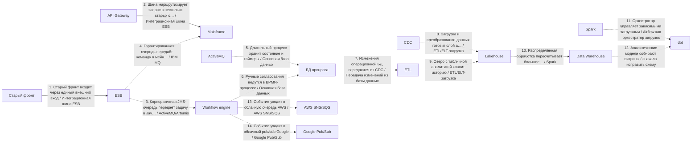

# Архитектурный разбор: Сложный кейс 4: миграция enterprise-процесса со старого контура

## Короткий человеческий вывод

**Итог:** НЕ ГОТОВО: есть блокирующие риски. **Архитектурная готовность:** 0.0/10. **Готовность к промышленному запуску:** нельзя выпускать без закрытия блокеров.

**Полнота вводных:** 68%. **Надёжность рекомендаций:** средняя.

**Масштаб процесса:** 14 взаимодействий, из них 14 в основной цепочке и 0 сквозных контролей. Участников: 18.

**Бизнес-цель:** Есть старый контур, шина, очереди, длительный процесс, ручные согласования и аналитическая миграция.
**Основная сущность:** EnterpriseCase. Деньги: да. Регуляторика: да. Клиентский сценарий: да.

**Как читать оценку:** низкая оценка не означает, что все выбранные технологии неправильные. Она означает, что до запуска есть блокеры: не закрыты гарантии доставки, восстановления, безопасности, сверки или эксплуатации.

## Что блокирует запуск

| Приоритет | Проблема | Где проявляется | Что сделать |
|---|---|---|---|
| Критический | Финансовую сущность изменяют несколько систем одновременно. | BPM engine, Workflow engine | Назначьте единственного писателя для счёта или шарда и ведите неизменяемый журнал проводок; остальные системы должны отправлять команды, а не менять финансовое состояние напрямую. |
| Высокий | Замена legacy-системы описана без плана переключения. | Весь процесс | Используйте strangler-подход: параллельный прогон со сверкой старого и нового контура, поэтапное переключение трафика по процентам или сегментам, критерии переключения и план отката с сохранением данных, накопленных в новом контуре. |
| Высокий | В регуляторном процессе не описан аудиторский след. | Весь процесс | Ведите неизменяемый журнал операций с политикой срока хранения и сохраняйте evidence на каждый значимый переход статуса. |
| Высокий | Повторы в синхронной цепочке усиливают друг друга. | «Старый фронт входит через единый внешний вход» → «Шина маршрутизирует запрос в несколько старых систем» | Задайте единый бюджет повторов на весь запрос (общий предельный срок ожидания), предохранитель внешнего вызова на каждом звене и экспоненциальная увеличением паузы между повторами со случайным разбросом; не повторяйте вызовы, которые уже не успеют уложиться в целевое время ответа. |
| Высокий | Высоконагруженный поток не имеет контролей приёма потока. | Пик 6000 RPS: «Корпоративная JMS-очередь передаёт задачу в Java-контур», «Гарантированная очередь передаёт команду в мейнфрейм», «Событие уходит в облачную очередь AWS» | Используйте партиционирование по ключу и контроль горячих партиций; учитывайте время события и контрольную отметку загрузки с политикой обработки запоздалых событий; настройте обратное давление и алерты на лаг и пропускную способность. |
| Высокий | аналитическое хранилище или аналитика находятся в операционном основной поток. | Шаг 9 «Озеро с табличной аналитикой хранит историю» → Lakehouse | Сделайте шаг non-blocking: используйте CDC, ETL или событие после фиксации результата в операционной системе. |
| Высокий | Важный асинхронный процесс не имеет сверки. | Весь процесс | Добавьте регулярную сверку источника истины с потребителями: ожидаемые и фактические данные, отчёт расхождений, автоматическое довосстановление там, где это безопасно, и ручной разбор. |
| Средний | Событие не содержит обязательную обёртку события. | «Корпоративная JMS-очередь передаёт задачу в Java-контур», «Гарантированная очередь передаёт команду в мейнфрейм», «Событие уходит в облачную очередь AWS» | Зафиксируйте единую обёртку события: идентификатор события, тип события, версия события, идентификатор агрегата или entityId, сквозной идентификатор или идентификатор трассировки, время возникновения события, производитель события и тело сообщения. |
| Информация | Ещё 7 менее приоритетных замечаний | См. приложение с полным чек-листом | Разобрать после закрытия основных блокеров |

## Рекомендуемый порядок действий

1. Назначить единственного владельца финансовой сущности и запретить прямую запись из остальных систем.
2. Добавить сверку ожидаемых и фактических данных и процедуру восстановления расхождений.
3. Описать план перехода со старого контура: параллельный прогон, критерии переключения и откат.
4. Для высоконагруженного потока описать партиционирование, горячие ключи, обратное давление и алерты на лаг.
5. После исправлений повторить архитектурную проверку и зафиксировать принятые компромиссы в ADR.

## Проверка логики схемы

Перед подбором стека нужно исправить следующие противоречия в схеме:

- **Шаг 12 «Аналитические модели собирают витрины»**: Источник и получатель совпадают. Скорее всего, потерян реальный участник связи.

## Почему выбраны технологии и способы взаимодействия

### Объяснение по шагам

Решения ниже сгруппированы по смыслу. В основной цепочке показано, **кто с кем взаимодействует и каким способом**. Сквозные вещи — аудит, безопасность, авторизация, наблюдаемость, секреты — вынесены отдельно и не смешиваются с бизнес-потоком.

Для каждого решения указано: **Почему выбрано**, **Почему не другой вариант**, **Обязательные условия**, **Почему предлагается именно так** и **Почему нельзя просто не делать**.

### API и онлайн-взаимодействие

### Шаг 1. Старый фронт входит через единый внешний вход

**Что:** шаг 1 — «Старый фронт входит через единый внешний вход». Основной способ взаимодействия: Интеграционная шина ESB.
**Где:** связь идёт от «Старый фронт» к «ESB». Исполнитель: «API Gateway». Выполняется после: начало процесса или внешний запуск.
**Почему:** Подходит, когда нужно связать несколько старых или корпоративных систем, выполнить маршрутизацию и преобразование форматов.
**Почему не другой вариант:** Прямые REST-вызовы увеличивают связанность систем. Kafka хороша для событий, но не всегда заменяет трансформации, оркестрацию и legacy-маршруты в enterprise-контуре.
**Что проверить перед выпуском:** Нужны владелец маршрутов, версии трансформаций, трассировка, контроль ошибок преобразования и идемпотентность.

### Шаг 2. Шина маршрутизирует запрос в несколько старых систем

**Что:** шаг 2 — «Шина маршрутизирует запрос в несколько старых систем». Основной способ взаимодействия: Интеграционная шина ESB.
**Где:** связь идёт от «API Gateway» к «Mainframe». Исполнитель: «ESB». Выполняется после: шаг 1 «Старый фронт входит через единый внешний вход».
**Почему:** Подходит, когда нужно связать несколько старых или корпоративных систем, выполнить маршрутизацию и преобразование форматов.
**Почему не другой вариант:** Прямые REST-вызовы увеличивают связанность систем. Kafka хороша для событий, но не всегда заменяет трансформации, оркестрацию и legacy-маршруты в enterprise-контуре.
**Что проверить перед выпуском:** Нужны владелец маршрутов, версии трансформаций, трассировка, контроль ошибок преобразования и идемпотентность.

### Асинхронный обмен

### Шаг 3. Корпоративная JMS-очередь передаёт задачу в Java-контур

**Что:** шаг 3 — «Корпоративная JMS-очередь передаёт задачу в Java-контур». Основной способ взаимодействия: ActiveMQ/Artemis.
**Где:** связь идёт от «ESB» к «Workflow engine». Исполнитель: «ActiveMQ». Выполняется после: шаг 2 «Шина маршрутизирует запрос в несколько старых систем».
**Почему:** Подходит для корпоративной JMS-очереди, если в организации уже используется Java/JMS-контур и нужны стандартные enterprise-возможности очередей.
**Почему не другой вариант:** RabbitMQ обычно проще для современных очередь задач. Kafka лучше для журнала событий. IBM MQ выбирают, если уже есть строгий мейнфрейм/банковский MQ-контур.
**Что проверить перед выпуском:** Нужны модель подтверждения, устойчивые очереди/топики, очередь ошибок, транзакционность при необходимости и мониторинг потребителей.

### Шаг 4. Гарантированная очередь передаёт команду в мейнфрейм

**Что:** шаг 4 — «Гарантированная очередь передаёт команду в мейнфрейм». Основной способ взаимодействия: IBM MQ.
**Где:** связь идёт от «ESB» к «Mainframe». Исполнитель: «IBM MQ». Выполняется после: шаг 2 «Шина маршрутизирует запрос в несколько старых систем».
**Почему:** Подходит для гарантированного корпоративного обмена в банках/enterprise/мейнфрейм-контуре, где IBM MQ уже является стандартом.
**Почему не другой вариант:** RabbitMQ проще и дешевле для новых очередей задач. Kafka лучше для событийного журнала. IBM MQ выбирают из-за совместимости, регламента и требований надёжности старого контура.
**Что проверить перед выпуском:** Нужны менеджер очередей, каналы, права, устойчивые сообщения, очередь ошибок, мониторинг глубины очередей и регламент разбора зависших сообщений.

### Шаг 13. Событие уходит в облачную очередь AWS

**Что:** шаг 13 — «Событие уходит в облачную очередь AWS». Основной способ взаимодействия: AWS SNS/SQS.
**Где:** связь идёт от «Workflow engine» к «AWS SNS/SQS». Исполнитель: «AWS SNS/SQS». Выполняется после: шаг 6 «Ручные согласования ведутся в BPMN-процессе».
**Почему:** Подходит для облачной очереди или топика в AWS-контуре, когда команда хочет управляемый сервис без собственного брокера.
**Почему не другой вариант:** Kafka/RabbitMQ дают больше контроля, но требуют сопровождения. Azure Service Bus или Google Pub/Sub выбираются в соответствующих облаках.
**Служебные компоненты:** Если перед публикацией меняется состояние в БД, нужна таблица исходящих сообщений: изменение состояния и подготовка сообщения должны быть атомарными.
**Что проверить перед выпуском:** Нужны IAM-права, очередь ошибок, таймаут видимости сообщения, выбор FIFO-очереди или стандартной очереди, лимиты облака, стоимость и мониторинг задержек.

### Шаг 14. Событие уходит в облачный pub/sub Google

**Что:** шаг 14 — «Событие уходит в облачный pub/sub Google». Основной способ взаимодействия: Google Pub/Sub.
**Где:** связь идёт от «Workflow engine» к «Google Pub/Sub». Исполнитель: «Google Pub/Sub». Выполняется после: шаг 6 «Ручные согласования ведутся в BPMN-процессе».
**Почему:** Подходит для управляемой облачной pub/sub-интеграции в Google Cloud с автоматическим масштабированием подписчиков.
**Почему не другой вариант:** Kafka даёт больше контроля над партициями и срок хранения, но требует сопровождения. AWS/Azure варианты выбираются в своих облаках.
**Служебные компоненты:** Если перед публикацией меняется состояние в БД, нужна таблица исходящих сообщений: изменение состояния и подготовка сообщения должны быть атомарными.
**Что проверить перед выпуском:** Нужны топик, подписка, ack предельный срок ожидания, тема ошибок, ключ порядка при необходимости, IAM и контроль накопление очереди.

### Данные и чтение

### Шаг 5. Длительный процесс хранит состояние и таймеры

**Что:** шаг 5 — «Длительный процесс хранит состояние и таймеры». Основной способ взаимодействия: Основная база данных.
**Где:** связь идёт от «ActiveMQ» к «БД процесса». Исполнитель: «Workflow engine». Выполняется после: шаг 3 «Корпоративная JMS-очередь передаёт задачу в Java-контур».
**Почему:** Подходит для фиксации состояния процесса, статусов, ключей идемпотентности, истории и технического журнала шагов.
**Почему не другой вариант:** Redis не должен быть источником истины. Kafka/RabbitMQ передают сообщения, но не заменяют надёжную операционную запись. Аналитическое хранилище не подходит для оперативной транзакции.
**Что проверить перед выпуском:** Нужны транзакции, уникальные индексы, версия записи или optimistic locking, сроки хранения и план очистки технических таблиц.

### Шаг 6. Ручные согласования ведутся в BPMN-процессе

**Что:** шаг 6 — «Ручные согласования ведутся в BPMN-процессе». Основной способ взаимодействия: Основная база данных.
**Где:** связь идёт от «Workflow engine» к «БД процесса». Исполнитель: «BPM engine». Выполняется после: шаг 5 «Длительный процесс хранит состояние и таймеры».
**Почему:** Подходит для фиксации состояния процесса, статусов, ключей идемпотентности, истории и технического журнала шагов.
**Почему не другой вариант:** Redis не должен быть источником истины. Kafka/RabbitMQ передают сообщения, но не заменяют надёжную операционную запись. Аналитическое хранилище не подходит для оперативной транзакции.
**Что проверить перед выпуском:** Нужны транзакции, уникальные индексы, версия записи или optimistic locking, сроки хранения и план очистки технических таблиц.

### Аналитика и загрузки

### Шаг 7. Изменения операционной БД передаются из CDC

**Что:** шаг 7 — «Изменения операционной БД передаются из CDC». Основной способ взаимодействия: Передача изменений из базы данных.
**Где:** связь идёт от «БД процесса» к «ETL». Исполнитель: «CDC». Выполняется после: шаг 6 «Ручные согласования ведутся в BPMN-процессе».
**Почему:** Подходит, когда данные уже зафиксированы в операционной БД и их нужно передавать в аналитический контур без замедления основного процесса.
**Почему не другой вариант:** Прямая запись в аналитическое хранилище из бизнес-сервиса связывает операционный процесс с аналитикой. Batch проще, но даёт большую задержку. Событие из приложения требует строгой дисциплины таблицы исходящих сообщений.
**Служебные компоненты:** Нужна сверка полноты между источником и аналитическим контуром: количество записей, ключи, контрольные суммы и отчёт расхождений.
**Что проверить перед выпуском:** Нужны контроль позиции чтения, контроль отставания, совместимость схем, повторная синхронизация и сверка полноты.

### Шаг 8. Загрузка и преобразование данных готовит слой аналитики

**Что:** шаг 8 — «Загрузка и преобразование данных готовит слой аналитики». Основной способ взаимодействия: ETL/ELT-загрузка.
**Где:** связь идёт от «CDC» к «Lakehouse». Исполнитель: «ETL». Выполняется после: шаг 7 «Изменения операционной БД передаются из CDC».
**Почему:** Подходит для передачи данных в аналитический контур с преобразованием, контролем качества и подготовкой витрин.
**Почему не другой вариант:** Операционная БД является источником данных, но не способом доставки в аналитику. Прямая запись сервиса в аналитическое хранилище повышает связанность. CDC лучше для передачи изменений почти в реальном времени, Batch — для регламентной периодической загрузки.
**Служебные компоненты:** Нужна сверка полноты между источником и аналитическим контуром: количество записей, ключи, контрольные суммы и отчёт расхождений.
**Что проверить перед выпуском:** Нужны правила преобразования, контроль количества записей, журнал загрузки, карантин ошибок, повторный запуск периода и сверка с источником.

### Шаг 9. Озеро с табличной аналитикой хранит историю

**Что:** шаг 9 — «Озеро с табличной аналитикой хранит историю». Основной способ взаимодействия: ETL/ELT-загрузка.
**Где:** связь идёт от «ETL» к «Lakehouse». Исполнитель: «Lakehouse». Выполняется после: шаг 8 «Загрузка и преобразование данных готовит слой аналитики».
**Почему:** Подходит для передачи данных в аналитический контур с преобразованием, контролем качества и подготовкой витрин.
**Почему не другой вариант:** Операционная БД является источником данных, но не способом доставки в аналитику. Прямая запись сервиса в аналитическое хранилище повышает связанность. CDC лучше для передачи изменений почти в реальном времени, Batch — для регламентной периодической загрузки.
**Служебные компоненты:** Нужна сверка полноты между источником и аналитическим контуром: количество записей, ключи, контрольные суммы и отчёт расхождений.
**Что проверить перед выпуском:** Нужны правила преобразования, контроль количества записей, журнал загрузки, карантин ошибок, повторный запуск периода и сверка с источником.

### Шаг 10. Распределённая обработка пересчитывает большие периоды

**Что:** шаг 10 — «Распределённая обработка пересчитывает большие периоды». Основной способ взаимодействия: Spark.
**Где:** связь идёт от «Lakehouse» к «Data Warehouse». Исполнитель: «Spark». Выполняется после: шаг 9 «Озеро с табличной аналитикой хранит историю».
**Почему:** Подходит для большой распределённой обработки данных: тяжёлые преобразования, агрегации, пересчёты истории и обработка больших файлов.
**Почему не другой вариант:** Обычный batch проще для малых объёмов. ClickHouse/аналитическое хранилище лучше для запросов по уже подготовленным данным. Spark нужен именно для распределённого вычисления.
**Служебные компоненты:** Нужна сверка полноты между источником и аналитическим контуром: количество записей, ключи, контрольные суммы и отчёт расхождений.
**Что проверить перед выпуском:** Нужны партиционирование, checkpoint, контроль shuffle, повторный запуск, ресурсы кластера и контроль качества результата.

### Шаг 11. Оркестратор управляет зависимыми загрузками

**Что:** шаг 11 — «Оркестратор управляет зависимыми загрузками». Основной способ взаимодействия: Airflow как оркестратор загрузок.
**Где:** связь идёт от «Spark» к «dbt». Исполнитель: «Airflow». Выполняется после: шаг 10 «Распределённая обработка пересчитывает большие периоды».
**Почему:** Подходит для управления зависимыми заданиями: загрузки, проверки, преобразования, ожидания файлов и повторные запуски.
**Почему не другой вариант:** Один batch-скрипт проще, но быстро становится неуправляемым при зависимостях и целевое время ответа. Kafka не решает расписание и DAG-зависимости загрузок.
**Служебные компоненты:** Нужна сверка полноты между источником и аналитическим контуром: количество записей, ключи, контрольные суммы и отчёт расхождений.
**Что проверить перед выпуском:** Нужен DAG, расписание, политика повторных попыток, целевое время ответа, алерты, дозагрузка исторических данных или повторный запуск и правила обработки частично выполненных загрузок.

### Прочее

### Шаг 12. Аналитические модели собирают витрины

**Что:** шаг 12 — «Аналитические модели собирают витрины». Основной способ взаимодействия: сначала исправить схему.
**Где:** связь идёт от «Data Warehouse» к «Data Warehouse». Исполнитель: «dbt». Выполняется после: шаг 11 «Оркестратор управляет зависимыми загрузками».
**Почему:** Источник и получатель совпадают. Скорее всего, потерян реальный участник связи.
**Почему не другой вариант:** Выбор gRPC, REST, брокера или БД поверх некорректной связи создаст ложное ощущение готовой архитектуры.
**Что проверить перед выпуском:** Верните шаг на этап проектирования связей, исправьте источник, получателя и смысл действия, затем повторно запустите проверку и подбор стека.

## Сквозные контроли и служебные компоненты

Сквозные контроли в схеме не выделены. Перед запуском всё равно проверьте авторизацию, аудит, секреты, логирование, метрики и инструкции разбора инцидентов.

## Контрольные проверки готовности к промышленному запуску

| Область | Статус | Что важно |
|---|---|---|
| Контракт | Блокирует выпуск | Каждое событие содержит стандартную обёртку события.; Для клиентского API описана модель ошибок. |
| Надёжность | Требует проверки | Для асинхронной обработки задан лимит попыток и очередь ошибок или карантин. |
| Целостность данных | Блокирует выпуск | Для процесса предусмотрена сверка.; У основной сущности есть владелец и единственный писатель. |
| Наблюдаемость | Блокирует выпуск | Для процесса настроены метрики, алерты и дашборды. |
| Безопасность | Проходит | Явных проблем не найдено. |
| Производительность | Требует проверки | Для нагрузки описаны пропускная способность, обратное давление и отставание потребителей. |
| Эксплуатация и внедрение | Проходит | Явных проблем не найдено. |

## Какие вводные нужно уточнить

| Приоритет | Область | Что уточнить | Почему важно |
|---|---|---|---|
| high | Надёжность | Куда попадает сообщение после исчерпания попыток? | Без очередь ошибок/карантина poison message может потеряться или бесконечно крутиться. |
| medium | Эксплуатация | Какой срок хранения у топиков, таблиц исходящих и входящих сообщений и журналов? | Без политики хранения растёт стоимость и ухудшается восстановление/аудит. |
| medium | целевое время ответа | Какой целевое время ответа и таймаут для пользовательского или системного ответа? | Без целевое время ответа невозможно распределить бюджет таймаутов и понять, где нужна async-граница. |
| medium | Сверка | Как сверяются расхождения между источником истины и потребителями? | Техническая доставка не гарантирует бизнесовую полноту и согласованность. |
| Информация | Владение | Кто владельцы систем, контрактов и алертов? | Без владельцев неясны ответственность и эскалация. |

## Краткая сводка по стеку

| Технология / способ | Где применяется |
|---|---:|
| ETL/ELT-загрузка | 2 |
| Интеграционная шина ESB | 2 |
| Основная база данных | 2 |
| ActiveMQ/Artemis | 1 |
| Airflow как оркестратор загрузок | 1 |
| AWS SNS/SQS | 1 |
| Google Pub/Sub | 1 |
| IBM MQ | 1 |
| Spark | 1 |
| Передача изменений из базы данных | 1 |
| сначала исправить схему | 1 |

<details>
<summary>Приложение A. Полная таблица по всем шагам</summary>

| Шаг | Связь | Основной способ | Что проверить |
|---|---|---|---|
| 1. Старый фронт входит через единый внешний вход | Старый фронт → ESB. Исполнитель: API Gateway | Интеграционная шина ESB | Нужны владелец маршрутов, версии трансформаций, трассировка, контроль ошибок преобразования и идемпотентность. |
| 2. Шина маршрутизирует запрос в несколько старых систем | API Gateway → Mainframe. Исполнитель: ESB | Интеграционная шина ESB | Нужны владелец маршрутов, версии трансформаций, трассировка, контроль ошибок преобразования и идемпотентность. |
| 3. Корпоративная JMS-очередь передаёт задачу в Java-контур | ESB → Workflow engine. Исполнитель: ActiveMQ | ActiveMQ/Artemis | Нужны модель подтверждения, устойчивые очереди/топики, очередь ошибок, транзакционность при необходимости и мониторинг потребителей. |
| 4. Гарантированная очередь передаёт команду в мейнфрейм | ESB → Mainframe. Исполнитель: IBM MQ | IBM MQ | Нужны менеджер очередей, каналы, права, устойчивые сообщения, очередь ошибок, мониторинг глубины очередей и регламент разбора зависших сообщений. |
| 5. Длительный процесс хранит состояние и таймеры | ActiveMQ → БД процесса. Исполнитель: Workflow engine | Основная база данных | Нужны транзакции, уникальные индексы, версия записи или optimistic locking, сроки хранения и план очистки технических таблиц. |
| 6. Ручные согласования ведутся в BPMN-процессе | Workflow engine → БД процесса. Исполнитель: BPM engine | Основная база данных | Нужны транзакции, уникальные индексы, версия записи или optimistic locking, сроки хранения и план очистки технических таблиц. |
| 7. Изменения операционной БД передаются из CDC | БД процесса → ETL. Исполнитель: CDC | Передача изменений из базы данных | Нужны контроль позиции чтения, контроль отставания, совместимость схем, повторная синхронизация и сверка полноты. |
| 8. Загрузка и преобразование данных готовит слой аналитики | CDC → Lakehouse. Исполнитель: ETL | ETL/ELT-загрузка | Нужны правила преобразования, контроль количества записей, журнал загрузки, карантин ошибок, повторный запуск периода и сверка с источником. |
| 9. Озеро с табличной аналитикой хранит историю | ETL → Lakehouse. Исполнитель: Lakehouse | ETL/ELT-загрузка | Нужны правила преобразования, контроль количества записей, журнал загрузки, карантин ошибок, повторный запуск периода и сверка с источником. |
| 10. Распределённая обработка пересчитывает большие периоды | Lakehouse → Data Warehouse. Исполнитель: Spark | Spark | Нужны партиционирование, checkpoint, контроль shuffle, повторный запуск, ресурсы кластера и контроль качества результата. |
| 11. Оркестратор управляет зависимыми загрузками | Spark → dbt. Исполнитель: Airflow | Airflow как оркестратор загрузок | Нужен DAG, расписание, политика повторных попыток, целевое время ответа, алерты, дозагрузка исторических данных или повторный запуск и правила обработки частично выполненных загрузок. |
| 12. Аналитические модели собирают витрины | Data Warehouse → Data Warehouse. Исполнитель: dbt | сначала исправить схему | Верните шаг на этап проектирования связей, исправьте источник, получателя и смысл действия, затем повторно запустите проверку и подбор стека. |
| 13. Событие уходит в облачную очередь AWS | Workflow engine → AWS SNS/SQS. Исполнитель: AWS SNS/SQS | AWS SNS/SQS | Нужны IAM-права, очередь ошибок, таймаут видимости сообщения, выбор FIFO-очереди или стандартной очереди, лимиты облака, стоимость и мониторинг задержек. |
| 14. Событие уходит в облачный pub/sub Google | Workflow engine → Google Pub/Sub. Исполнитель: Google Pub/Sub | Google Pub/Sub | Нужны топик, подписка, ack предельный срок ожидания, тема ошибок, ключ порядка при необходимости, IAM и контроль накопление очереди. |

</details>

<details>
<summary>Приложение B. Найденные риски и слабые места</summary>

## Найденные риски и слабые места

### Критично

#### Финансовую сущность изменяют несколько систем одновременно.

**Что:** найден риск «Финансовую сущность изменяют несколько систем одновременно.». затронуто мест: 1.
**Затронутые места:** BPM engine, Workflow engine.
**Почему это важно:** Несколько писателей баланса или лимита без единого владельца данных — это прямой путь к расхождениям, двойному списанию и сложным инцидентам.
**Что нужно сделать:** Назначьте единственного писателя для счёта или шарда и ведите неизменяемый журнал проводок; остальные системы должны отправлять команды, а не менять финансовое состояние напрямую.

### Высокий риск

#### Замена legacy-системы описана без плана переключения.

**Что:** найден риск «Замена legacy-системы описана без плана переключения.». затронуто мест: 1.
**Затронутые места:** Весь процесс.
**Почему это важно:** Миграция — это не просто «включили новое»: без параллельного прогона и плана отката первый серьёзный дефект нового контура может остановить бизнес.
**Что нужно сделать:** Используйте strangler-подход: параллельный прогон со сверкой старого и нового контура, поэтапное переключение трафика по процентам или сегментам, критерии переключения и план отката с сохранением данных, накопленных в новом контуре.

#### В регуляторном процессе не описан аудиторский след.

**Что:** найден риск «В регуляторном процессе не описан аудиторский след.». затронуто мест: 1.
**Затронутые места:** Весь процесс.
**Почему это важно:** Юридически значимые шаги требуют доказуемой истории: кто, что, когда и на каком основании выполнил.
**Что нужно сделать:** Ведите неизменяемый журнал операций с политикой срока хранения и сохраняйте evidence на каждый значимый переход статуса.

#### Повторы в синхронной цепочке усиливают друг друга.

**Что:** найден риск «Повторы в синхронной цепочке усиливают друг друга.». затронуто мест: 1.
**Затронутые места:** «Старый фронт входит через единый внешний вход» → «Шина маршрутизирует запрос в несколько старых систем».
**Почему это важно:** Несколько звеньев с автоматическими повторами друг за другом перемножают количество попыток (N×M×…): при деградации это создаёт шторм повторных попыток и лавинообразный рост нагрузки в самый плохой момент.
**Что нужно сделать:** Задайте единый бюджет повторов на весь запрос (общий предельный срок ожидания), предохранитель внешнего вызова на каждом звене и экспоненциальная увеличением паузы между повторами со случайным разбросом; не повторяйте вызовы, которые уже не успеют уложиться в целевое время ответа.

#### Высоконагруженный поток не имеет контролей приёма потока.

**Что:** найден риск «Высоконагруженный поток не имеет контролей приёма потока.». затронуто мест: 1.
**Затронутые места:** Пик 6000 RPS: «Корпоративная JMS-очередь передаёт задачу в Java-контур», «Гарантированная очередь передаёт команду в мейнфрейм», «Событие уходит в облачную очередь AWS».
**Почему это важно:** На таком потоке неизбежны out-of-order события, опоздавшие события, горячие партиции и всплески нагрузки, которые потребитель может не обработать вовремя.
**Что нужно сделать:** Используйте партиционирование по ключу и контроль горячих партиций; учитывайте время события и контрольную отметку загрузки с политикой обработки запоздалых событий; настройте обратное давление и алерты на лаг и пропускную способность.

#### аналитическое хранилище или аналитика находятся в операционном основной поток.

**Что:** найден риск «аналитическое хранилище или аналитика находятся в операционном основной поток.». затронуто мест: 1.
**Затронутые места:** Шаг 9 «Озеро с табличной аналитикой хранит историю» → Lakehouse.
**Почему это важно:** Аналитическое хранилище обычно не обеспечивает операционный целевое время ответа: его деградация не должна останавливать основной бизнес-процесс.
**Что нужно сделать:** Сделайте шаг non-blocking: используйте CDC, ETL или событие после фиксации результата в операционной системе.

#### Важный асинхронный процесс не имеет сверки.

**Что:** найден риск «Важный асинхронный процесс не имеет сверки.». затронуто мест: 1.
**Затронутые места:** Весь процесс.
**Почему это важно:** Повторная попытка и очередь ошибок закрывают технические сбои, но не доказывают, что все бизнес-сущности дошли до финального состояния и что банк, партнёр или витрина не разошлись по данным.
**Что нужно сделать:** Добавьте регулярную сверку источника истины с потребителями: ожидаемые и фактические данные, отчёт расхождений, автоматическое довосстановление там, где это безопасно, и ручной разбор.

### Средний риск

#### Событие не содержит обязательную обёртку события.

**Что:** найден риск «Событие не содержит обязательную обёртку события.». затронуто мест: 1.
**Затронутые места:** «Корпоративная JMS-очередь передаёт задачу в Java-контур», «Гарантированная очередь передаёт команду в мейнфрейм», «Событие уходит в облачную очередь AWS».
**Почему это важно:** Событие можно доставить, но его сложно дедуплицировать, трассировать, версионировать и восстанавливать после инцидента: не хватает типа события, версии события и времени возникновения события, идентификатор агрегата.
**Что нужно сделать:** Зафиксируйте единую обёртку события: идентификатор события, тип события, версия события, идентификатор агрегата или entityId, сквозной идентификатор или идентификатор трассировки, время возникновения события, производитель события и тело сообщения.

#### Для интеграции не описана модель наблюдаемости.

**Что:** найден риск «Для интеграции не описана модель наблюдаемости.». затронуто мест: 1.
**Затронутые места:** Весь процесс.
**Почему это важно:** Даже корректная архитектура станет неуправляемой в промышленный запуск, если нельзя быстро увидеть, где застряла сущность, растёт ли отставание обработки, сколько сообщений находится в очередь ошибок и какой внешний вызов деградирует.
**Что нужно сделать:** Добавьте технические и бизнес-метрики: latency по шагам, success/error rate, отставание потребителей, количество сообщений в очереди ошибок, количество повторных попыток, возраст статуса, traces по идентификатор сквозной связи и алерты по SLO.

#### Дочерний вызов может ждать дольше, чем родительский шаг.

**Что:** найден риск «Дочерний вызов может ждать дольше, чем родительский шаг.». затронуто мест: 1.
**Затронутые места:** 1 «Старый фронт входит через единый внешний вход» (800мс) → 2 «Шина маршрутизирует запрос в несколько старых систем» (800мс).
**Почему это важно:** Родительский шаг завершится по таймауту раньше, чем ответит дочерний вызов; в результате выполненная работа будет потрачена впустую.
**Что нужно сделать:** Таймауты должны строго убывать вниз по цепочке: дочерний таймаут должен быть меньше родительского с учётом сетевых накладных; общий бюджет времени распределяйте от целевого времени ответа сверху вниз.

#### Для CDC-потока не описаны обязательные контроли.

**Что:** найден риск «Для CDC-потока не описаны обязательные контроли.». затронуто мест: 1.
**Затронутые места:** Шаг 7 «Изменения операционной БД передаются из CDC» (CDC).
**Почему это важно:** CDC может незаметно сломаться на пропусках позиций, удалениях и эволюции схемы источника, из-за чего проекция тихо расходится с источником истины.
**Что нужно сделать:** Используйте LSN или контрольную отметку загрузки с контролем пропусков (gap detection); добавьте обработку delete-событий, политику эволюции схемы, идемпотентную проекцию, регулярную сверку и повторная обработка за выбранный период.

#### Для порядка событий в рамках сущности не задан ключ партиционирования.

**Что:** найден риск «Для порядка событий в рамках сущности не задан ключ партиционирования.». затронуто мест: 1.
**Затронутые места:** «Корпоративная JMS-очередь передаёт задачу в Java-контур», «Гарантированная очередь передаёт команду в мейнфрейм», «Событие уходит в облачную очередь AWS», «Событие уходит в облачный pub/sub Google».
**Почему это важно:** Без ключ партиционирования события одной сущности могут разойтись по разным партициям и быть обработаны в неправильном порядке.
**Что нужно сделать:** Партиционируйте события по entityId и явно укажите этот ключ во входных данных шага.

#### Клиент читает результат сразу после асинхронной записи.

**Что:** найден риск «Клиент читает результат сразу после асинхронной записи.». затронуто мест: 2.
**Затронутые места:** Затронуто мест: 2.
**Почему это важно:** В одном клиентском сценарии запись выполняется асинхронно, а чтение — синхронно: клиент может не увидеть только что сделанное изменение из-за окна консистентности.
**Что нужно сделать:** Либо подтверждайте запись синхронно до ответа, либо используйте optimistic UI и статус «в обработке»; также можно читать из той же модели или реплики, куда была выполнена запись.

### Информация

#### Для критичной системы не указан владелец.

**Что:** найден риск «Для критичной системы не указан владелец.». затронуто мест: 14.
**Затронутые места:** Затронуто мест: 14.
**Почему это важно:** При инциденте будет непонятно, кто отвечает за целевое время ответа, контракт, лимиты, повторная обработка и согласование изменений.
**Что нужно сделать:** Зафиксируйте владельца системы или команды, канал поддержки, SLO и порядок эскалации.

#### Для служебных таблиц не описана политика роста и очистки.

**Что:** найден риск «Для служебных таблиц не описана политика роста и очистки.». затронуто мест: 1.
**Затронутые места:** outbox, журнал проводок + журнал шагов.
**Почему это важно:** Эти таблицы пополняются на каждое событие; без архивации и партиционирования они со временем ухудшат latency запросов и существенно раздуют БД.
**Что нужно сделать:** Добавьте партиционирование по времени, архивацию или перенос в холодное хранилище, а также очистку опубликованных записей таблицы исходящих сообщений; контролируйте размер таблиц и время запросов к ним.


</details>

<details>
<summary>Приложение C. Сценарная основа для дальнейшей разработки</summary>

## Сценарная основа для дальнейшей разработки

Этот раздел нужен не для выбора технологий, а для постановки на разработку и тестирование: какой поток считается успешным, какие есть альтернативы, что происходит при ошибках и как проверять готовность.

### Важное замечание по сценарию

Текущая схема похожа не на один линейный happy path, а на карту множества интеграционных возможностей. Поэтому отчёт не строит искусственный сценарий из всех шагов подряд. Сначала нужно выбрать конкретный бизнес-поток, а ниже использовать сценарные блоки как основу для детализации.

### Сценарные блоки по типам взаимодействий

| Блок | Что входит | Ожидаемый результат | Что обязательно проверить |
|---|---|---|---|
| API и онлайн-взаимодействие | шаг 1: Старый фронт → ESB — Старый фронт входит через единый внешний вход (Интеграционная шина ESB); шаг 2: API Gateway → Mainframe — Шина маршрутизирует запрос в несколько старых систем (Интеграционная шина ESB) | входящий или внутренний запрос получает быстрый ответ либо идентификатор отслеживания для дальнейшего отслеживания | Нужны владелец маршрутов, версии трансформаций, трассировка, контроль ошибок преобразования и идемпотентность; Нужны владелец маршрутов, версии трансформаций, трассировка, контроль ошибок преобразования и идемпотентность |
| Асинхронный обмен | шаг 3: ESB → Workflow engine — Корпоративная JMS-очередь передаёт задачу в Java-контур (ActiveMQ/Artemis); шаг 4: ESB → Mainframe — Гарантированная очередь передаёт команду в мейнфрейм (IBM MQ); шаг 13: Workflow engine → AWS SNS/SQS — Событие уходит в облачную очередь AWS (AWS SNS/SQS); ещё 1 | нагрузка выровнена через брокер, сообщение не теряется, есть повторная обработка и очередь ошибок | Нужны модель подтверждения, устойчивые очереди/топики, очередь ошибок, транзакционность при необходимости и мониторинг потребителей; Нужны менеджер очередей, каналы, права, устойчивые сообщения, очередь ошибок, мониторинг глубины очередей и регламент разбора зависших сообщений; ещё 2 |
| Данные и чтение | шаг 5: ActiveMQ → БД процесса — Длительный процесс хранит состояние и таймеры (Основная база данных); шаг 6: Workflow engine → БД процесса — Ручные согласования ведутся в BPMN-процессе (Основная база данных) | основная сущность, справочники или проекции сохранены без дублей и потерянных обновлений | Нужны транзакции, уникальные индексы, версия записи или optimistic locking, сроки хранения и план очистки технических таблиц; Нужны транзакции, уникальные индексы, версия записи или optimistic locking, сроки хранения и план очистки технических таблиц |
| Аналитика и загрузки | шаг 7: БД процесса → ETL — Изменения операционной БД передаются из CDC (Передача изменений из базы данных); шаг 8: CDC → Lakehouse — Загрузка и преобразование данных готовит слой аналитики (ETL/ELT-загрузка); шаг 9: ETL → Lakehouse — Озеро с табличной аналитикой хранит историю (ETL/ELT-загрузка); ещё 2 | данные попадают в аналитический контур с контролем полноты и возможностью сверки | Нужны контроль позиции чтения, контроль отставания, совместимость схем, повторная синхронизация и сверка полноты; Нужны правила преобразования, контроль количества записей, журнал загрузки, карантин ошибок, повторный запуск периода и сверка с источником; ещё 3 |
| Прочее | шаг 12: Data Warehouse → Data Warehouse — Аналитические модели собирают витрины (сначала исправить схему) | дополнительные взаимодействия описаны отдельно и требуют ручного уточнения владельцев и результата | Верните шаг на этап проектирования связей, исправьте источник, получателя и смысл действия, затем повторно запустите проверку и подбор стека |

### Альтернативные сценарии

#### Асинхронное принятие заявки без ожидания финального результата

**Когда возникает:** Хвост процесса занимает больше допустимого времени ответа или зависит от внешних систем.
**Как должен пройти сценарий:**
1. Система принимает запрос и создаёт идентификатор отслеживания.
2. Клиенту или вызывающей системе возвращается подтверждение приёма.
3. Дальнейшая обработка идёт через событие/очередь.
4. Статус процесса обновляется после каждого значимого шага.
**Ожидаемый результат:** Пользователь или потребитель видит промежуточный статус, а не зависший запрос.
**Обязательные проверки:** идентификатор отслеживания обязателен; GET /status или событие статуса; финальные статусы должны быть согласованы.

#### Повторная доставка или повторный запрос

**Когда возникает:** Сеть оборвалась, производитель события отправил событие повторно или потребитель переобработал сообщение.
**Как должен пройти сценарий:**
1. Система получает тот же ключ идемпотентности/идентификатор события/бизнес-ключ.
2. Выполняется попытка вставки ключа в таблицу входящих сообщений для защиты от дублей или поиск существующей операции.
3. Если ключ уже обработан, система возвращает прежний результат без повторного изменения бизнес-состояния.
**Ожидаемый результат:** Повтор не создаёт дубль операции, документа, проводки или статуса.
**Обязательные проверки:** UNIQUE-индекс на ключ идемпотентности; фиксация позиции чтения только после успешной обработки; тест дубля обязателен.

#### Расхождение данных между источником истины и потребителем

**Когда возникает:** Техническая доставка прошла не полностью, повторная обработка была пропущена или потребитель отстал.
**Как должен пройти сценарий:**
1. Регламентная сверка сравнивает ожидаемые и фактические состояния.
2. Найденные расхождения попадают в отчёт.
3. Безопасные расхождения восстанавливаются автоматически.
4. Опасные расхождения уходят на ручной разбор.
**Ожидаемый результат:** Бизнес видит не только техническую доставку, но и фактическую полноту процесса.
**Обязательные проверки:** регулярная сверка; отчёт расхождений; владелец ручного разбора; аудит исправлений.

#### Асинхронная обработка без ожидания финального результата

**Когда возникает:** Часть процесса длится дольше допустимого времени ответа или зависит от очереди/брокера.
**Как должен пройти сценарий:**
1. создать идентификатор отслеживания.
2. зафиксировать статус PROCESSING.
3. передать сообщение в брокер.
4. обновлять статус по мере обработки.
**Ожидаемый результат:** вызывающая сторона не висит в ожидании, а видит отслеживаемый статус.
**Обязательные проверки:** ключ идемпотентности; очередь ошибок; повторная обработка; метрики отставания.

#### Повторная загрузка или сверка аналитических данных

**Когда возникает:** Найдены расхождения между источником и аналитическим контуром либо загрузка завершилась частично.
**Как должен пройти сценарий:**
1. сравнить ожидаемые и фактические данные.
2. выделить расхождения.
3. безопасно перезапустить период или идентификатор пакета.
4. зафиксировать результат сверки.
**Ожидаемый результат:** аналитический контур восстановлен без повторного применения уже обработанных данных.
**Обязательные проверки:** идентификатор пакета; контрольные суммы; журнал загрузки; отчёт расхождений.

### Ошибочные сценарии и восстановление

| Ошибка | Где возникает | Как система должна восстановиться |
|---|---|---|
| Финансовую сущность изменяют несколько систем одновременно. | BPM engine, Workflow engine | Назначьте единственного писателя для счёта или шарда и ведите неизменяемый журнал проводок; остальные системы должны отправлять команды, а не менять финансовое состояние напрямую. |
| аналитическое хранилище или аналитика находятся в операционном основной поток. | Шаг 9 «Озеро с табличной аналитикой хранит историю» → Lakehouse | Сделайте шаг non-blocking: используйте CDC, ETL или событие после фиксации результата в операционной системе. |
| Важный асинхронный процесс не имеет сверки. | Весь процесс | Добавьте регулярную сверку источника истины с потребителями: ожидаемые и фактические данные, отчёт расхождений, автоматическое довосстановление там, где это безопасно, и ручной разбор. |
| Замена legacy-системы описана без плана переключения. | Весь процесс | Используйте strangler-подход: параллельный прогон со сверкой старого и нового контура, поэтапное переключение трафика по процентам или сегментам, критерии переключения и план отката с сохранением данных, накопленных в новом контуре. |
| В регуляторном процессе не описан аудиторский след. | Весь процесс | Ведите неизменяемый журнал операций с политикой срока хранения и сохраняйте evidence на каждый значимый переход статуса. |
| Повторы в синхронной цепочке усиливают друг друга. | «Старый фронт входит через единый внешний вход» → «Шина маршрутизирует запрос в несколько старых систем» | Задайте единый бюджет повторов на весь запрос (общий предельный срок ожидания), предохранитель внешнего вызова на каждом звене и экспоненциальная увеличением паузы между повторами со случайным разбросом; не повторяйте вызовы, которые уже не успеют уложиться в целевое время ответа. |
| Высоконагруженный поток не имеет контролей приёма потока. | Пик 6000 RPS: «Корпоративная JMS-очередь передаёт задачу в Java-контур», «Гарантированная очередь передаёт команду в мейнфрейм», «Событие уходит в облачную очередь AWS» | Используйте партиционирование по ключу и контроль горячих партиций; учитывайте время события и контрольную отметку загрузки с политикой обработки запоздалых событий; настройте обратное давление и алерты на лаг и пропускную способность. |

### Критерии приёмки сценариев

- основной сценарий проходит до финального статуса без ручного вмешательства.
- повторный запрос или повторное событие не создаёт дубль бизнес-операции.
- таймаут внешней системы переводит процесс в понятный статус и создаёт алерт.
- сообщение после исчерпания попыток попадает в очередь ошибок или карантин.
- по идентификатору сквозной связи можно найти все шаги процесса.
- Основной успешный сценарий проходит от первого шага до финального статуса без ручного вмешательства.
- Каждый отказ из error-flow переводит процесс в понятный статус и оставляет запись в журнале.
- Повторный запрос или повторное событие не создаёт дубль бизнес-операции.
- По сквозной идентификатор / идентификатор отслеживания можно найти все шаги одного процесса в логах и БД.

</details>

<details>
<summary>Приложение D. Артефакты для постановки и выпуска</summary>

## Варианты архитектурного решения

1. **Вариант A — минимально допустимый фикс** — срок короткий и нельзя сильно менять архитектуру.
2. **Вариант B — промышленный запуск-компромисс** — нужен рабочий промышленный запуск-вариант для типовой корпоративной интеграции.
3. **Вариант C — целевая архитектура** — поток критичен, регуляторен, денежный или станет платформенным.

## Готовность к выпуску

- Все критичные и высокие находки закрыты или приняты в ADR как осознанный риск.
- Идемпотентность и обработка дублей покрыты автотестами.
- очередь ошибок, повторная обработка и инструкция разбора проверены на тестовом контуре.
- Метрики, алерты и идентификатор сквозной связи видны в логах/трейсах.
- Контрактные тесты производитель события↔потребитель проходят в CI.
- Нагрузочный тест подтверждает целевое время ответа и допустимое отставание обработки.
- Аудиторский журнал неизменяемый проверен.
- Сверка даёт отчёт расхождений.

## Черновик контракта события

- **идентификатор события:** UUID, уникальный идентификатор события
- **тип события:** доменный тип события
- **версия события:** версия схемы
- **идентификатор агрегата:** идентификатор сущности EnterpriseCase
- **идентификатор сквозной связи:** сквозная трассировка процесса
- **время возникновения события:** момент бизнес-события
- **производитель события:** система-источник
- **тело сообщения:** только необходимые доменные поля без лишних ПДн

## Чек-лист проверок и тестов

- Основной успешный сценарий: процесс проходит все шаги до финального статуса.
- Отказ шага 1 «Старый фронт входит через единый внешний вход»: таймаут/5xx — процесс не зависает, статус и алерт корректны.
- Отказ шага 2 «Шина маршрутизирует запрос в несколько старых систем»: таймаут/5xx — процесс не зависает, статус и алерт корректны.
- Отказ шага 9 «Озеро с табличной аналитикой хранит историю»: таймаут/5xx — процесс не зависает, статус и алерт корректны.
- Регресс на «Финансовую сущность изменяют несколько систем одновременно.»: Назначьте единственного писателя для счёта или шарда и ведите неизменяемый журнал проводок; остальные системы должны отправлять команды, а не менять финансовое состояние напрямую.
- Регресс на «аналитическое хранилище или аналитика находятся в операционном основной поток.»: Сделайте шаг non-blocking: используйте CDC, ETL или событие после фиксации результата в операционной системе.
- Регресс на «Важный асинхронный процесс не имеет сверки.»: Добавьте регулярную сверку источника истины с потребителями: ожидаемые и фактические данные, отчёт расхождений, автоматическое довосстановление там, где это безопасно, и ручной разбор.
- Регресс на «Замена legacy-системы описана без плана переключения.»: Используйте strangler-подход: параллельный прогон со сверкой старого и нового контура, поэтапное переключение трафика по процентам или сегментам, критерии переключения и план отката с сохранением данных, накопленных в новом контуре.
- Регресс на «В регуляторном процессе не описан аудиторский след.»: Ведите неизменяемый журнал операций с политикой срока хранения и сохраняйте evidence на каждый значимый переход статуса.
- Регресс на «Повторы в синхронной цепочке усиливают друг друга.»: Задайте единый бюджет повторов на весь запрос (общий предельный срок ожидания), предохранитель внешнего вызова на каждом звене и экспоненциальная увеличением паузы между повторами со случайным разбросом; не повторяйте вызовы, которые уже не успеют уложиться в целевое время ответа.
- Регресс на «Высоконагруженный поток не имеет контролей приёма потока.»: Используйте партиционирование по ключу и контроль горячих партиций; учитывайте время события и контрольную отметку загрузки с политикой обработки запоздалых событий; настройте обратное давление и алерты на лаг и пропускную способность.
- Дубль события/запроса с тем же ключом обрабатывается ровно один раз.
- Ядовитое сообщение уходит в очередь ошибок после N попыток; повторная обработка восстанавливает обработку.
- Сверка: сумма проводок журнал проводок сходится с агрегатом баланса.

## SQL-черновик хранения

```sql
CREATE TABLE enterprisecase (
 id uuid PRIMARY KEY DEFAULT gen_random_uuid(),
 businessId uuid NOT NULL,
 идентификатор события uuid UNIQUE,
 идентификатор сквозной связи uuid,
 status text NOT NULL,
 версия статуса integer NOT NULL,
 status text NOT NULL,
 created_at timestamptz NOT NULL DEFAULT now(),
 updated_at timestamptz NOT NULL DEFAULT now()
);

CREATE INDEX idx_enterprisecase_businessId ON enterprisecase (businessId);

CREATE INDEX idx_enterprisecase_идентификатор сквозной связи ON enterprisecase (идентификатор сквозной связи);

CREATE TABLE enterprisecase_step_log (
 id bigserial PRIMARY KEY,
 enterprisecase_id uuid NOT NULL,
 step text NOT NULL,
 status text NOT NULL,
 details jsonb,
 occurred_at timestamptz NOT NULL DEFAULT now()
);

CREATE INDEX idx_enterprisecase_step_log_ref ON enterprisecase_step_log (enterprisecase_id);

CREATE TABLE outbox (
 id bigserial PRIMARY KEY,
 aggregate_id uuid NOT NULL,
 event_type text NOT NULL,
 тело сообщения jsonb NOT NULL,
 created_at timestamptz NOT NULL DEFAULT now(),
 published_at timestamptz
);

CREATE INDEX idx_outbox_unpublished ON outbox (id) WHERE published_at IS NULL;

CREATE TABLE журнал проводок (
 id bigserial PRIMARY KEY,
 account_id uuid NOT NULL,
 operation_id text NOT NULL UNIQUE,
 amount numeric(18,2) NOT NULL,
 kind text NOT NULL,
 created_at timestamptz NOT NULL DEFAULT now()
);

CREATE INDEX idx_журнал проводок_account ON журнал проводок (account_id);
```

## Диаграммы процесса

Диаграммы строятся по фактической связи «кто → кому». Исполнитель шага не подставляется внутрь маршрута, поэтому схема не должна создавать ложные цепочки вида «источник → исполнитель → получатель».

### Основная схема взаимодействий



### Последовательность основной цепочки

```mermaid
sequenceDiagram
 participant N1 as Старый фронт
 participant N2 as ESB
 participant N3 as API Gateway
 participant N4 as Mainframe
 participant N5 as Workflow engine
 participant N6 as ActiveMQ
 participant N7 as БД процесса
 participant N8 as ETL
 participant N9 as CDC
 participant N10 as Lakehouse
 participant N11 as Data Warehouse
 participant N12 as Spark
 participant N13 as dbt
 participant N14 as AWS SNS/SQS
 participant N15 as Google Pub/Sub
 N1->>N2: 1. Старый фронт входит через единый внешний вход / Интеграционная шина ESB
 N3->>N4: 2. Шина маршрутизирует запрос в несколько старых с… / Интеграционная шина ESB
 N2--)N5: 3. Корпоративная JMS-очередь передаёт задачу в Jav… / ActiveMQ/Artemis
 N2--)N4: 4. Гарантированная очередь передаёт команду в мейн… / IBM MQ
 N6--)N7: 5. Длительный процесс хранит состояние и таймеры / Основная база данных
 N5--)N7: 6. Ручные согласования ведутся в BPMN-процессе / Основная база данных
 N7--)N8: 7. Изменения операционной БД передаются из CDC / Передача изменений из базы данных
 N9--)N10: 8. Загрузка и преобразование данных готовит слой а… / ETL/ELT-загрузка
 N8->>N10: 9. Озеро с табличной аналитикой хранит историю / ETL/ELT-загрузка
 N10--)N11: 10. Распределённая обработка пересчитывает большие… / Spark
 N12--)N13: 11. Оркестратор управляет зависимыми загрузками / Airflow как оркестратор загрузок
 N11--)N13: 12. Аналитические модели собирают витрины / сначала исправить схему
 N5--)N14: 13. Событие уходит в облачную очередь AWS / AWS SNS/SQS
 N5--)N15: 14. Событие уходит в облачный pub/sub Google / Google Pub/Sub
```



</details>

<details>
<summary>Приложение E. Обязательный архитектурный чек-лист</summary>

| Область | Статус | Что проверяется | Как закрыть |
|---|---|---|---|
| Внедрение | Блокирует выпуск | Для внедрения описаны переключение, откат и управляемый флаг включения. | Опишите параллельный прогон, сверку, поэтапное включение и критерии отката. |
| Контракт | Блокирует выпуск | Каждое событие содержит стандартную обёртку события. | Стандартизируйте обязательную обёртку события: идентификатор события, тип события, версия события, идентификатор агрегата, время возникновения события и идентификатор сквозной связи. |
| Наблюдаемость | Блокирует выпуск | Для процесса настроены метрики, алерты и дашборды. | Добавьте бизнесовые и технические метрики, алерты и владельцев реакции. |
| Целостность | Блокирует выпуск | Для процесса предусмотрена сверка. | Реализуйте сверку ожидаемых и фактических данных, отчёт расхождений, безопасное авто-восстановление и ручной разбор. |
| Целостность | Блокирует выпуск | Требование к порядку событий и ключу партиционирования явно зафиксировано. | Уточните требование к порядку; для порядка внутри одной сущности используйте ключ партиционирования = entityId. |
| Эксплуатация | Блокирует выпуск | Для служебных таблиц и топиков задан срок хранения и архивирование. | Добавьте партиционирование, TTL, архив, регламентную очистку и мониторинг размера. |
| Контракт | Требует проверки | Для клиентского API описана модель ошибок. | Опишите errorCode, повторяемые, userMessage, technicalMessage и сопоставление HTTP/gRPC. |
| Надёжность | Требует проверки | Для асинхронной обработки задан лимит попыток и очередь ошибок или карантин. | Настройте увеличение паузы между повторами, максимальное число попыток, очередь ошибок, алерт и владельца ручного разбора. |
| Производительность | Требует проверки | Для нагрузки описаны пропускная способность, обратное давление и отставание потребителей. | Проведите нагрузочный тест, задайте лимиты, механизм обратного давления, партиции и алерты на отставание потребителей. |
| Целостность | Не указано | У основной сущности есть владелец и единственный писатель. | Назначьте system of record; остальные системы должны отправлять команды или события. |
| Безопасность | Проверено | Входящий веб-вызов или обратный вызов проходит проверку подписи. | Используйте HMAC, JWT или mTLS, окно защиты от повторной доставки и ротацию секретов. |
| Безопасность | Проверено | Для ПДн и чувствительных полей описаны маскирование и срок хранения. | Минимизируйте тело сообщения, маскируйте логи, настройте TTL или удаление и роли доступа. |
| Данные | Проверено | Ключ поиска и ключ идемпотентности имеют правильную область уникальности. | Опишите составной ключ и используйте его одинаково в SELECT, UPDATE, UPSERT, уникальном индексе, таблице входящих сообщений, таблице исходящих сообщений и процедуре повторной обработки. Примеры: requestId + operationType + targetSystem + tenantId; operUid + operationType + targetSystem; providerEventId + providerCode. |
| Контракт | Проверено | Для каждого события или API зафиксирована единая схема и версия. | Используйте реестр схем событий, JSON Schema, Avro или Protobuf и добавьте контрактные тесты со стороны потребителя. |
| Наблюдаемость | Проверено | CorrelationId или traceId проходит через всю цепочку. | Передавайте W3C traceparent или идентификатор сквозной связи в запросах, событиях и логах. |
| Наблюдаемость | Проверено | Для процесса описана статусная модель и история переходов. | Опишите статусы, status_history или step_log, а также финальные и промежуточные состояния. |
| Надёжность | Проверено | Повторные попытки не создают дубли бизнес-операций. | Используйте operationId или ключ идемпотентности с уникальным индексом; для входящих событий добавьте таблицу входящих сообщений для защиты от дублей. |
| Надёжность | Проверено | Для внешних блокирующих вызовов описаны предохранитель внешнего вызова и деградация. | Добавьте таймаут, предохранитель внешнего вызова, запасной сценарий, изоляция ресурса и очередь выравнивания нагрузки. |
| Надёжность | Проверено | Для каждого блокирующего вызова задан таймаут. | Задайте таймаут на каждом шаге и общий предельный срок ожидания, рассчитанный от целевого времени ответа. |
| Надёжность | Проверено | После исправления ошибки есть понятная процедура повторной обработки. | Опишите ручную и пакетную повторную обработку, требования к идемпотентности и права доступа на запуск. |
| Производительность | Проверено | Заявленное целевое время ответа сходится с критическим путём. | Разорвите цепочку, распараллельте независимые шаги, добавьте кэш или уменьшите таймаут. |
| Целостность | Проверено | Для входящих событий и для входящего веб-вызова используется таблица входящих сообщений для защиты от дублей или другой механизм защиты от дублей. | Используйте таблицу входящих сообщений для защиты от дублей с уникальным идентификатор события и фиксируйте позицию чтения только после успешной обработки. |
| Целостность | Проверено | При записи в БД и публикации события используется таблица исходящих сообщений. | Используйте транзакционную таблицу исходящих сообщений: запись события должна выполняться в одной транзакции с изменением агрегата. |

</details>

<details>
<summary>Приложение F. Матрица деталей, которые нельзя забыть</summary>

Матрица деталей: применимо инвариантов из каталога v7.1 — 117 из 125; блокируют выпуск — 12, требуют внимания — 32, нужно уточнить — 53, уже выглядит закрытым — 35.

| Область | Статус | Что проверить | Почему важно | Как закрыть |
|---|---|---|---|---|
| аналитическое хранилище и витрины | Блокирует выпуск | — | аналитическое хранилище обычно не рассчитан на операционный целевое время ответа. | — |
| Безопасность | Блокирует выпуск | — | Интеграция часто случайно уносит ПДн в логи, очередь ошибок, таблицу исходящих сообщений и аналитические витрины и тестовые стенды. | — |
| Восстановление | Блокирует выпуск | — | Доставка с гарантией «минимум один раз» не гарантирует бизнесовую полноту. Сообщение могло попасть в очередь ошибок, быть пропущено, обработаться частично или устареть. | — |
| Комплаенс и аудит | Блокирует выпуск | — | Регуляторика и спорные операции требуют доказуемой истории. | — |
| Контракт | Блокирует выпуск | — | Сервис может формально принимать JSON, но ломаться на изменении enum, nullable-поля, даты, валюты или статуса. | — |
| Контракты | Блокирует выпуск | — | Без стандартной обёртки событие трудно дедуплицировать, трассировать, версионировать и переигрывать. | — |
| Наблюдаемость | Блокирует выпуск | — | Без сквозной трассировки даже правильный процесс невозможно поддерживать в режиме инцидента. | — |
| Наблюдаемость | Блокирует выпуск | — | Без трассировки incident response становится ручным поиском. | — |
| Порядок и конкуренция | Блокирует выпуск | — | Лишнее требование глобального порядка убивает масштабирование, а отсутствие порядка внутри одной сущности ломает статусные переходы. | — |
| Производительность | Блокирует выпуск | — | Лаг превращает почти real-time процесс в пакетную обработку. | — |
| Целостность данных | Блокирует выпуск | — | Несколько писателей создают гонки, потерянные обновления и расхождения между сервисами. | — |
| Целостность данных | Блокирует выпуск | — | Несколько писателей создают потерянные обновления и расхождения. | — |
| Асинхронность и брокеры | Требует проверки | — | Иначе poison message теряется или бесконечно крутится. | — |
| Асинхронность и брокеры | Требует проверки | — | Без обратного давления отставание обработки и очереди растут до отказа. | — |
| Асинхронность и брокеры | Требует проверки | — | Если срок хранения меньше окна восстановления, повторная обработка из брокера невозможна. | — |
| Асинхронность и брокеры | Требует проверки | — | Повтор валидационной ошибки создаёт шум и лаг. | — |
| Безопасность | Требует проверки | — | Интеграции часто становятся обходным путём авторизации. | — |
| Безопасность | Требует проверки | — | Технические хранилища часто менее защищены, чем основная БД. | — |
| Безопасность | Требует проверки | — | Без политики срока хранения данные остаются навсегда во вспомогательных местах. | — |
| Безопасность | Требует проверки | — | Подписанный, но старый обратный вызов может быть переиспользован. | — |
| Безопасность | Требует проверки | — | Неротируемый секрет превращает утечку в постоянный доступ. | — |
| Безопасность | Требует проверки | — | Тело интеграционного сообщения может содержать неожиданные структуры, SQL/JSON injection и слишком глубокие объекты. | — |
| Внешние зависимости | Требует проверки | — | Внешняя система вне вашего контроля. | — |
| Внешние зависимости | Требует проверки | — | Повтор без проверки может создать дубль во внешней системе. | — |
| Внешние зависимости | Требует проверки | — | Нельзя обещать клиенту лучше, чем позволяет критический внешний путь. | — |
| Восстановление | Требует проверки | — | очередь ошибок без инструкции разбора и безопасной повторной обработки — это не восстановление, а склад ошибок. | — |
| Идентичность и ключи | Требует проверки | — | Если ключ идемпотентности отличается от ключа поиска или уникального индекса, повтор может не создать дубль технически, но восстановить или обновить не ту бизнес-запись. | — |
| Идентичность и ключи | Требует проверки | — | Без сопоставления невозможно расследовать ошибки внешней системы и безопасно повторять запросы. | — |
| Комплаенс и аудит | Требует проверки | — | Перезапись баланса не объясняет происхождение денег. | — |
| Комплаенс и аудит | Требует проверки | — | Исправление отчётности без журнала создаёт юридический риск. | — |
| Комплаенс и аудит | Требует проверки | — | Часть данных нужно удалить, а часть сохранить как evidence. | — |
| Наблюдаемость | Требует проверки | — | очередь ошибок без алертов превращается в кладбище событий. | — |
| Производительность | Требует проверки | — | Система падает на всплесках, а не на среднем значении. | — |
| Производительность | Требует проверки | — | Без явной политики перегрузка распространяется по цепочке. | — |
| Производительность | Требует проверки | — | Нагрузочный тест без отказов не показывает устойчивость. | — |
| Синхронные API | Требует проверки | — | Иначе деградация партнёра истощит ваши потоки. | — |
| Синхронные API | Требует проверки | — | Один медленный партнёр может занять весь пул обработчиков. | — |
| Статусы и сценарии | Требует проверки | — | Если альтернативы не описаны, команда реализует только основной успешный сценарий, а ошибки начнут всплывать на тестировании или в промышленный запуск. | — |
| Сценарии и статусы | Требует проверки | — | Это классический источник дублей и спорных состояний. | — |
| Тестирование | Требует проверки | — | Дубли являются нормой для at-least-once. | — |
| Тестирование | Требует проверки | — | Внешние отказы должны быть штатным сценарием. | — |
| Тестирование | Требует проверки | — | Восстановление часто ломается, если его не проверять. | — |
| Тестирование | Требует проверки | — | Короткий тест не показывает утечки, рост лагов и таблиц. | — |
| Тестирование | Требует проверки | — | Основной успешный сценарий не доказывает безопасность. | — |
| аналитическое хранилище и витрины | Не указано | — | Технический экспорт не гарантирует бизнесовую полноту. | — |
| аналитическое хранилище и витрины | Не указано | — | Ошибки трансформаций требуют переобработки периода. | — |
| аналитическое хранилище и витрины | Не указано | — | Поздние события иначе попадают не в тот период. | — |
| аналитическое хранилище и витрины | Не указано | — | Потребитель должен понимать, что читает проекцию, а не источник истины. | — |
| Асинхронность и брокеры | Не указано | — | Rolling deployment создаёт период разных версий производителя и потребителя события. | — |
| Асинхронность и брокеры | Не указано | — | Неизвестные потребители усложняют изменение контракта. | — |
| Асинхронность и брокеры | Не указано | — | Циклы событий создают лавину сообщений и дубли. | — |
| Безопасность | Не указано | — | Файл легко скопировать, потерять или подменить. | — |
| Бизнес и границы | Не указано | — | Без финала команда реализует шаги, но не понимает, когда процесс действительно завершён. | — |
| Бизнес и границы | Не указано | — | Без границ ответственности спорные ошибки будут перекладываться между командами. | — |
| Бизнес и границы | Не указано | — | Необязательные обогащения часто случайно попадают в критический путь и ломают целевое время ответа. | — |
| Бизнес и границы | Не указано | — | От инициатора зависит целевое время ответа, ошибки, права доступа, UX и требования к статусам. | — |
| Бизнес и границы | Не указано | — | Технически успешный процесс может нарушить бизнес-ограничение: двойное списание, неверный статус, повторная отправка. | — |
| Внедрение и миграция | Не указано | — | Без параллельной проверки ошибки проявятся только после переключения. | — |
| Внедрение и миграция | Не указано | — | В промышленный запуск версии обновляются не мгновенно. | — |
| Внедрение и миграция | Не указано | — | Откат приложения не откатывает схему БД и события. | — |
| Внедрение и миграция | Не указано | — | Жёсткие миграции создают простой и аварии при откате. | — |
| Идентичность и ключи | Не указано | — | Одинаковый id может быть допустим в разных типах операций, клиентах/tenant, провайдерах или целевых системах. | — |
| Идентичность и ключи | Не указано | — | Если ключи отличаются, повторная попытка может не создать дубль, но обновить не ту запись. | — |
| Идентичность и ключи | Не указано | — | Проверка в коде без уникального индекса проигрывает гонку при параллельных запросах. | — |
| Контракты | Не указано | — | Без модели ошибок потребители неправильно повторяют запросы и показывают пользователю неясные сообщения. | — |
| Контракты | Не указано | — | Неявный null часто ломает потребителей сильнее, чем отсутствие нового поля. | — |
| Контракты | Не указано | — | Добавление нового значения enum может сломать старого потребителя. | — |
| Контракты | Не указано | — | decimal/float, копейки/рубли и разные режимы округления создают финансовые расхождения. | — |
| Контракты | Не указано | — | Ошибки времени ломают целевое время ответа, сортировку, сверки и регуляторные отчёты. | — |
| Контракты | Не указано | — | Большие тело сообщения ухудшают latency, storage, broker пропускная способность и очередь ошибок/повторная обработка. | — |
| Наблюдаемость | Не указано | — | CPU и latency не показывают, что бизнес-процесс застрял. | — |
| Наблюдаемость | Не указано | — | Свободный текст плохо ищется и агрегируется. | — |
| Производительность | Не указано | — | Неверный индекс на высоком RPS превращает БД в bottleneck. | — |
| Производительность | Не указано | — | Горячий рассылка в несколько веток создаёт высокий latency и отказоустойчивость худшей зависимости. | — |
| Синхронные API | Не указано | — | Без таймаута поток может зависнуть бесконечно. | — |
| Синхронные API | Не указано | — | Без лимитов повторная попытка усиливает аварию зависимости. | — |
| Синхронные API | Не указано | — | Клиент не знает, выполнилась ли операция, и может повторить запрос. | — |
| Синхронные API | Не указано | — | Большие тела создают нехватку памяти, медленные запросы и сетевые таймауты. | — |
| Синхронные API | Не указано | — | Пользователь не должен видеть технический таймаут вместо статуса обработки. | — |
| Сценарии и статусы | Не указано | — | Запоздалые события могут испортить уже финализированный процесс. | — |
| Сценарии и статусы | Не указано | — | Cancel почти всегда отличается от failed и rejected. | — |
| Тестирование | Не указано | — | Без сквозной проверки интеграция может быть “зелёной” по частям и сломанной целиком. | — |
| Тестирование | Не указано | — | На потоке порядок не всегда гарантирован. | — |
| Тестирование | Не указано | — | Гонка данных не виден на одиночном тесте. | — |
| Тестирование | Не указано | — | Изменение обязательного поля часто не ловится unit-тестами. | — |
| Тестирование | Не указано | — | Откат часто ломается из-за несовместимых данных. | — |
| Файлы и batch | Не указано | — | Файлы часто обрываются, приходят повторно или частично. | — |
| Файлы и batch | Не указано | — | Повтор batch может задублировать данные или пропустить период. | — |
| Целостность данных | Не указано | — | Без таблицы исходящих сообщений событие может потеряться или появиться без записи. | — |
| Целостность данных | Не указано | — | Частично выполненная распределённая операция оставляет разные системы в разных состояниях. | — |
| Целостность данных | Не указано | — | После события потребитель может ещё не обновить модель для чтения. | — |
| Целостность данных | Не указано | — | Последнее состояние не объясняет, почему и где процесс сломался. | — |
| Целостность данных | Не указано | — | Неверная кардинальность приводит к дублям, потерянным данным и сложным миграциям. | — |
| Целостность данных | Не указано | — | Физическое удаление ломает аудит, сверки и повторную обработку. | — |
| Целостность данных | Не указано | — | Раннее событие может привести потребителя к чтению ещё несуществующих данных. | — |
| Эксплуатация | Не указано | — | Без инструкции разбора время восстановления зависит от конкретного человека. | — |
| Эксплуатация | Не указано | — | Алерт без владельца — это шум. | — |
| Асинхронность и брокеры | Проверено | — | Повторная обработка часто запускается после инцидента и может умножить ущерб. | — |
| Асинхронность и брокеры | Проверено | — | Позднее событие может откатить корректный статус. | — |
| Безопасность | Проверено | — | Аналитический контур часто имеет больше пользователей. | — |
| Бизнес и границы | Проверено | — | Путаница command/event приводит к неверной идемпотентности, ответственности и повторной обработке. | — |
| Бизнес и границы | Проверено | — | Без владельца ручной разбор становится бесконечным зависанием в промежуточном состоянии. | — |
| Бизнес и границы | Проверено | — | Асинхронная архитектура всегда создаёт окно рассогласования, которое нужно согласовать с бизнесом. | — |
| Внедрение | Проверено | — | Даже хорошая целевая архитектура может сломать промышленный запуск при переходе без параллельного прогона старого и нового контура, откат и миграции незавершённых процессов. | — |
| Внедрение и миграция | Проверено | — | Без плана переключения можно потерять незавершённые процессы. | — |
| Внедрение и миграция | Проверено | — | Незавершённые процессы часто ломаются при смене контракта или маршрута. | — |
| Внешние зависимости | Проверено | — | Пики нагрузки превратятся в 429 и массовые отказы. | — |
| Идентичность и ключи | Проверено | — | Большая часть тонких ошибок возникает не из-за протокола, а из-за неверного ключа поиска: одинаковый id в разных типах операций, клиентах/tenant, системах или подоперациях начинает склеивать разные записи. | — |
| Идентичность и ключи | Проверено | — | Провайдеры часто гарантируют уникальность только внутри своей системы или договора. | — |
| Идентичность и ключи | Проверено | — | Одно и то же событие и одна и та же сущность имеют разный жизненный цикл. | — |
| Идентичность и ключи | Проверено | — | Один идентификатор сквозной связи может объединять несколько разных операций внутри одного процесса. | — |
| Идентичность и ключи | Проверено | — | Изменение поля-части ключа ломает ссылки, повторная обработка и аудит. | — |
| Идентичность и ключи | Проверено | — | Повторная обработка по неполному ключу может переиграть не ту подоперацию. | — |
| Комплаенс и аудит | Проверено | — | Без происхождение данных нельзя объяснить расхождение отчёта. | — |
| Комплаенс и аудит | Проверено | — | Повторная обработка — это фактически повторное выполнение бизнес-операции. | — |
| Контракт | Проверено | — | Ошибки с временем редко видны на основной успешный сценарий, но ломают целевое время ответа, сверки, регуляторные отчёты, повторную обработку и расследование инцидентов. | — |
| Контракты | Проверено | — | Потребители ломаются не только от удаления поля, но и от изменения enum, nullable, формата даты. | — |
| Контракты | Проверено | — | Без change process новое поле или статус может сломать промышленный запуск. | — |
| Контракты | Проверено | — | Event-as-command смешивает ответственность и приводит к непредсказуемым side effects. | — |
| Наблюдаемость | Проверено | — | Без разреза по партнёру непонятно, кто деградирует. | — |
| Порядок и конкуренция | Проверено | — | На реальных брокерах и входящий веб-вызов дубли — нормальное поведение, а не исключение. | — |
| Производительность | Проверено | — | Служебные таблицы незаметно становятся самыми большими. | — |
| Синхронные API | Проверено | — | Без лимитов один потребитель может перегрузить сервис. | — |
| Статусы и сценарии | Проверено | — | Без статусов поддержка не понимает, где застряла заявка, а разработка не знает, какой результат должен быть у альтернативных сценариев. | — |
| Сценарии и статусы | Проверено | — | Без пошагового сценария разработчики додумывают разные варианты реализации. | — |
| Сценарии и статусы | Проверено | — | Большинство инцидентов на промышленном запуске живут не в основном успешном сценарии. | — |
| Сценарии и статусы | Проверено | — | Без статусов процесс выглядит как пропавшая заявка. | — |
| Сценарии и статусы | Проверено | — | Без возраст статуса процесс может зависнуть навсегда. | — |
| Сценарии и статусы | Проверено | — | Ручное исправление без аудита ломает расследование и сверки. | — |
| Целостность данных | Проверено | — | Даже при правильном ключе два обработчика могут одновременно прочитать старое состояние и перезаписать результат друг друга. | — |
| Целостность данных | Проверено | — | Доставка с гарантией «минимум один раз» означает нормальные дубли. | — |
| Целостность данных | Проверено | — | Параллельные обработчики могут перезаписать результат друг друга. | — |

</details>

<!-- Совместимость: Обязательный архитектурный чек-лист; Матрица деталей, которые нельзя забыть; Контрольные проверки готовности к промышленному запуску -->