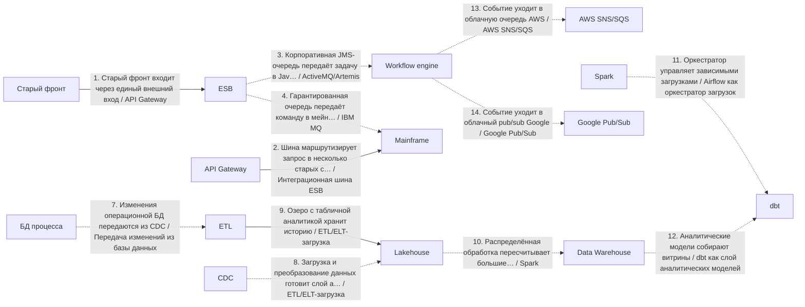
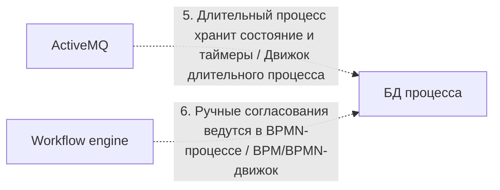

# Архитектурный разбор: Сложный кейс 4: миграция enterprise-процесса со старого контура

## Короткий человеческий вывод

**Итог:** НЕ ГОТОВО: есть блокирующие риски. **Архитектурная готовность:** 0.0/10. **Готовность к промышленному запуску:** нельзя выпускать без закрытия блокеров.

**Полнота вводных:** 68%. **Надёжность рекомендаций:** средняя.

**Масштаб процесса:** 14 взаимодействий, из них 12 в основной цепочке и 2 сквозных контролей. Участников: 18.

**Бизнес-цель:** Есть старый контур, шина, очереди, длительный процесс, ручные согласования и аналитическая миграция.
**Основная сущность:** EnterpriseCase. Деньги: да. Регуляторика: да. Клиентский сценарий: да.

**Как читать оценку:** низкая оценка не означает, что все выбранные технологии неправильные. Она означает, что до запуска есть блокеры: не закрыты гарантии доставки, восстановления, безопасности, сверки или эксплуатации.

## Что блокирует запуск

| Приоритет | Проблема | Где проявляется | Что сделать |
|---|---|---|---|
| Критический | Финансовую сущность изменяют несколько систем одновременно. | BPM engine, Workflow engine | Назначьте единственного писателя для счёта или шарда и ведите неизменяемый журнал проводок; остальные системы должны отправлять команды, а не менять финансовое состояние напрямую. |
| Высокий | Замена legacy-системы описана без плана переключения. | Весь процесс | Используйте strangler-подход: параллельный прогон со сверкой старого и нового контура, поэтапное переключение трафика по процентам или сегментам, критерии переключения и план отката с сохранением данных, накопленных в новом контуре. |
| Высокий | В регуляторном процессе не описан аудиторский след. | Весь процесс | Ведите неизменяемый журнал операций с политикой срока хранения и сохраняйте evidence на каждый значимый переход статуса. |
| Высокий | Повторы в синхронной цепочке усиливают друг друга. | «Старый фронт входит через единый внешний вход» → «Шина маршрутизирует запрос в несколько старых систем» | Задайте единый бюджет повторов на весь запрос (общий предельный срок ожидания), предохранитель внешнего вызова на каждом звене и экспоненциальное увеличение паузы между повторами со случайным разбросом; не повторяйте вызовы, которые уже не успеют уложиться в целевое время ответа. |
| Высокий | Процесс блокируется на вызове внешней системы. | Шаг 2 «Шина маршрутизирует запрос в несколько старых систем» → Mainframe | Настройте таймаут, предохранитель внешнего вызова и запасной сценарий-ответ; если бизнес-сценарий позволяет, переведите шаг в асинхронную обработку через очередь с компенсацией. |
| Высокий | Высоконагруженный поток не имеет контролей приёма потока. | Пик 6000 RPS: «Корпоративная JMS-очередь передаёт задачу в Java-контур», «Гарантированная очередь передаёт команду в мейнфрейм», «Событие уходит в облачную очередь AWS» | Используйте партиционирование по ключу и контроль горячих партиций; учитывайте время события и контрольную отметку загрузки с политикой обработки запоздалых событий; настройте обратное давление и алерты на лаг и пропускную способность. |
| Высокий | аналитическое хранилище или аналитика находятся в операционном основном потоке. | Шаг 9 «Озеро с табличной аналитикой хранит историю» → Lakehouse | Сделайте шаг non-blocking: используйте CDC, ETL или событие после фиксации результата в операционной системе. |
| Высокий | Важный асинхронный процесс не имеет сверки. | Весь процесс | Добавьте регулярную сверку источника истины с потребителями: ожидаемые и фактические данные, отчёт расхождений, автоматическое довосстановление там, где это безопасно, и ручной разбор. |
| Информация | Ещё 8 менее приоритетных замечаний | См. приложение с полным чек-листом | Разобрать после закрытия основных блокеров |

## Рекомендуемый порядок действий

1. Назначить единственного владельца финансовой сущности и запретить прямую запись из остальных систем.
2. Добавить сверку ожидаемых и фактических данных и процедуру восстановления расхождений.
3. Для асинхронных участков описать лимит повторов, очередь ошибок, владельца разбора и повторную обработку.
4. Пересчитать бюджет таймаутов сверху вниз: дочерний вызов должен завершаться раньше родительского.
5. Описать план перехода со старого контура: параллельный прогон, критерии переключения и откат.
6. Для высоконагруженного потока описать партиционирование, горячие ключи, обратное давление и алерты на лаг.
7. После исправлений повторить архитектурную проверку и зафиксировать принятые компромиссы в ADR.

## Проверка логики схемы

Схема не содержит очевидных противоречий между названием связи, участниками и выбранным основным способом взаимодействия.

## Почему выбраны технологии и способы взаимодействия

### Объяснение по шагам

Решения ниже сгруппированы по смыслу. В основной цепочке показано, **кто с кем взаимодействует и каким способом**. Сквозные вещи — аудит, безопасность, авторизация, наблюдаемость, секреты — вынесены отдельно и не смешиваются с бизнес-потоком.

Для каждого решения указано: **Почему выбрано**, **Почему не другой вариант**, **Обязательные условия**, **Почему предлагается именно так** и **Почему нельзя просто не делать**.

### API и онлайн-взаимодействие

### Шаг 1. Старый фронт входит через единый внешний вход

**Что:** шаг 1 — «Старый фронт входит через единый внешний вход». Основной способ взаимодействия: API Gateway.
**Где:** связь идёт от «Старый фронт» к «ESB». Исполнитель: «API Gateway». Выполняется после: начало процесса или внешний запуск.
**Почему:** Нужен как единая внешняя точка входа: авторизация, лимиты запросов, маршрутизация, версия API и защита периметра.
**Почему не другой вариант:** Прямой вызов внутреннего сервиса раскрывает внутреннюю структуру и размазывает безопасность по сервисам. Брокеры не являются публичным входом для клиентского API.
**Что проверить перед выпуском:** Нужны проверка токена, лимиты запросов, трассировка, единая модель ошибок и запрет обхода шлюза.

### Шаг 2. Шина маршрутизирует запрос в несколько старых систем

**Что:** шаг 2 — «Шина маршрутизирует запрос в несколько старых систем». Основной способ взаимодействия: Интеграционная шина ESB.
**Где:** связь идёт от «API Gateway» к «Mainframe». Исполнитель: «ESB». Выполняется после: шаг 1 «Старый фронт входит через единый внешний вход».
**Почему:** Подходит, когда нужно связать несколько старых или корпоративных систем, выполнить маршрутизацию и преобразование форматов.
**Почему не другой вариант:** Прямые REST-вызовы увеличивают связанность систем. Kafka хороша для событий, но не всегда заменяет трансформации, оркестрацию и legacy-маршруты в enterprise-контуре.
**Что проверить перед выпуском:** Нужны владелец маршрутов, версии трансформаций, трассировка, контроль ошибок преобразования и идемпотентность.

### Асинхронный обмен

### Шаг 3. Корпоративная JMS-очередь передаёт задачу в Java-контур

**Что:** шаг 3 — «Корпоративная JMS-очередь передаёт задачу в Java-контур». Основной способ взаимодействия: ActiveMQ/Artemis.
**Где:** связь идёт от «ESB» к «Workflow engine». Исполнитель: «ActiveMQ». Выполняется после: шаг 2 «Шина маршрутизирует запрос в несколько старых систем».
**Почему:** Подходит для корпоративной JMS-очереди, если в организации уже используется Java/JMS-контур и нужны стандартные enterprise-возможности очередей.
**Почему не другой вариант:** RabbitMQ обычно проще для современных очередь задач. Kafka лучше для журнала событий. IBM MQ выбирают, если уже есть строгий мейнфрейм/банковский MQ-контур.
**Что проверить перед выпуском:** Нужны модель подтверждения, устойчивые очереди/топики, очередь ошибок, транзакционность при необходимости и мониторинг потребителей.

### Шаг 4. Гарантированная очередь передаёт команду в мейнфрейм

**Что:** шаг 4 — «Гарантированная очередь передаёт команду в мейнфрейм». Основной способ взаимодействия: IBM MQ.
**Где:** связь идёт от «ESB» к «Mainframe». Исполнитель: «IBM MQ». Выполняется после: шаг 2 «Шина маршрутизирует запрос в несколько старых систем».
**Почему:** Подходит для гарантированного корпоративного обмена в банках/enterprise/мейнфрейм-контуре, где IBM MQ уже является стандартом.
**Почему не другой вариант:** RabbitMQ проще и дешевле для новых очередей задач. Kafka лучше для событийного журнала. IBM MQ выбирают из-за совместимости, регламента и требований надёжности старого контура.
**Что проверить перед выпуском:** Нужны менеджер очередей, каналы, права, устойчивые сообщения, очередь ошибок, мониторинг глубины очередей и регламент разбора зависших сообщений.

### Шаг 13. Событие уходит в облачную очередь AWS

**Что:** шаг 13 — «Событие уходит в облачную очередь AWS». Основной способ взаимодействия: AWS SNS/SQS.
**Где:** связь идёт от «Workflow engine» к «AWS SNS/SQS». Исполнитель: «AWS SNS/SQS». Выполняется после: сквозной контроль 6 «Ручные согласования ведутся в BPMN-процессе».
**Почему:** Подходит для облачной очереди или топика в AWS-контуре, когда команда хочет управляемый сервис без собственного брокера.
**Почему не другой вариант:** Kafka/RabbitMQ дают больше контроля, но требуют сопровождения. Azure Service Bus или Google Pub/Sub выбираются в соответствующих облаках.
**Служебные компоненты:** Если перед публикацией меняется состояние в БД, нужна таблица исходящих сообщений: изменение состояния и подготовка сообщения должны быть атомарными.
**Что проверить перед выпуском:** Нужны IAM-права, очередь ошибок, таймаут видимости сообщения, выбор FIFO-очереди или стандартной очереди, лимиты облака, стоимость и мониторинг задержек.

### Шаг 14. Событие уходит в облачный pub/sub Google

**Что:** шаг 14 — «Событие уходит в облачный pub/sub Google». Основной способ взаимодействия: Google Pub/Sub.
**Где:** связь идёт от «Workflow engine» к «Google Pub/Sub». Исполнитель: «Google Pub/Sub». Выполняется после: сквозной контроль 6 «Ручные согласования ведутся в BPMN-процессе».
**Почему:** Подходит для управляемой облачной pub/sub-интеграции в Google Cloud с автоматическим масштабированием подписчиков.
**Почему не другой вариант:** Kafka даёт больше контроля над партициями и срок хранения, но требует сопровождения. AWS/Azure варианты выбираются в своих облаках.
**Служебные компоненты:** Если перед публикацией меняется состояние в БД, нужна таблица исходящих сообщений: изменение состояния и подготовка сообщения должны быть атомарными.
**Что проверить перед выпуском:** Нужны топик, подписка, ack предельный срок ожидания, тема ошибок, ключ порядка при необходимости, IAM и контроль накопление очереди.

### Аналитика и загрузки

### Шаг 7. Изменения операционной БД передаются из CDC

**Что:** шаг 7 — «Изменения операционной БД передаются из CDC». Основной способ взаимодействия: Передача изменений из базы данных.
**Где:** связь идёт от «БД процесса» к «ETL». Исполнитель: «CDC». Выполняется после: сквозной контроль 6 «Ручные согласования ведутся в BPMN-процессе».
**Почему:** Подходит, когда данные уже зафиксированы в операционной БД и их нужно передавать в аналитический контур без замедления основного процесса.
**Почему не другой вариант:** Прямая запись в аналитическое хранилище из бизнес-сервиса связывает операционный процесс с аналитикой. Batch проще, но даёт большую задержку. Событие из приложения требует строгой дисциплины таблицы исходящих сообщений.
**Служебные компоненты:** Нужна сверка полноты между источником и аналитическим контуром: количество записей, ключи, контрольные суммы и отчёт расхождений.
**Что проверить перед выпуском:** Нужны контроль позиции чтения, контроль отставания, совместимость схем, повторная синхронизация и сверка полноты.

### Шаг 8. Загрузка и преобразование данных готовит слой аналитики

**Что:** шаг 8 — «Загрузка и преобразование данных готовит слой аналитики». Основной способ взаимодействия: ETL/ELT-загрузка.
**Где:** связь идёт от «CDC» к «Lakehouse». Исполнитель: «ETL». Выполняется после: шаг 7 «Изменения операционной БД передаются из CDC».
**Почему:** Подходит для передачи данных в аналитический контур с преобразованием, контролем качества и подготовкой витрин.
**Почему не другой вариант:** Операционная БД является источником данных, но не способом доставки в аналитику. Прямая запись сервиса в аналитическое хранилище повышает связанность. CDC лучше для передачи изменений почти в реальном времени, Batch — для регламентной периодической загрузки.
**Служебные компоненты:** Нужна сверка полноты между источником и аналитическим контуром: количество записей, ключи, контрольные суммы и отчёт расхождений.
**Что проверить перед выпуском:** Нужны правила преобразования, контроль количества записей, журнал загрузки, карантин ошибок, повторный запуск периода и сверка с источником.

### Шаг 9. Озеро с табличной аналитикой хранит историю

**Что:** шаг 9 — «Озеро с табличной аналитикой хранит историю». Основной способ взаимодействия: ETL/ELT-загрузка.
**Где:** связь идёт от «ETL» к «Lakehouse». Исполнитель: «Lakehouse». Выполняется после: шаг 8 «Загрузка и преобразование данных готовит слой аналитики».
**Почему:** Подходит для передачи данных в аналитический контур с преобразованием, контролем качества и подготовкой витрин.
**Почему не другой вариант:** Операционная БД является источником данных, но не способом доставки в аналитику. Прямая запись сервиса в аналитическое хранилище повышает связанность. CDC лучше для передачи изменений почти в реальном времени, Batch — для регламентной периодической загрузки.
**Служебные компоненты:** Нужна сверка полноты между источником и аналитическим контуром: количество записей, ключи, контрольные суммы и отчёт расхождений.
**Что проверить перед выпуском:** Нужны правила преобразования, контроль количества записей, журнал загрузки, карантин ошибок, повторный запуск периода и сверка с источником.

### Шаг 10. Распределённая обработка пересчитывает большие периоды

**Что:** шаг 10 — «Распределённая обработка пересчитывает большие периоды». Основной способ взаимодействия: Spark.
**Где:** связь идёт от «Lakehouse» к «Data Warehouse». Исполнитель: «Spark». Выполняется после: шаг 9 «Озеро с табличной аналитикой хранит историю».
**Почему:** Подходит для большой распределённой обработки данных: тяжёлые преобразования, агрегации, пересчёты истории и обработка больших файлов.
**Почему не другой вариант:** Обычный batch проще для малых объёмов. ClickHouse/аналитическое хранилище лучше для запросов по уже подготовленным данным. Spark нужен именно для распределённого вычисления.
**Служебные компоненты:** Нужна сверка полноты между источником и аналитическим контуром: количество записей, ключи, контрольные суммы и отчёт расхождений.
**Что проверить перед выпуском:** Нужны партиционирование, checkpoint, контроль shuffle, повторный запуск, ресурсы кластера и контроль качества результата.

### Шаг 11. Оркестратор управляет зависимыми загрузками

**Что:** шаг 11 — «Оркестратор управляет зависимыми загрузками». Основной способ взаимодействия: Airflow как оркестратор загрузок.
**Где:** связь идёт от «Spark» к «dbt». Исполнитель: «Airflow». Выполняется после: шаг 10 «Распределённая обработка пересчитывает большие периоды».
**Почему:** Подходит для управления зависимыми заданиями: загрузки, проверки, преобразования, ожидания файлов и повторные запуски.
**Почему не другой вариант:** Один batch-скрипт проще, но быстро становится неуправляемым при зависимостях и целевое время ответа. Kafka не решает расписание и DAG-зависимости загрузок.
**Служебные компоненты:** Нужна сверка полноты между источником и аналитическим контуром: количество записей, ключи, контрольные суммы и отчёт расхождений.
**Что проверить перед выпуском:** Нужен DAG, расписание, политика повторных попыток, целевое время ответа, алерты, дозагрузка исторических данных или повторный запуск и правила обработки частично выполненных загрузок.

### Шаг 12. Аналитические модели собирают витрины

**Что:** шаг 12 — «Аналитические модели собирают витрины». Основной способ взаимодействия: dbt как слой аналитических моделей.
**Где:** связь идёт от «Data Warehouse» к «Data Warehouse». Исполнитель: «dbt». Выполняется после: шаг 11 «Оркестратор управляет зависимыми загрузками».
**Почему:** Подходит для управляемых SQL-моделей, тестов качества, происхождение данных и прозрачной сборки аналитических витрин.
**Почему не другой вариант:** ETL-инструмент шире по загрузке данных, но dbt удобен для трансформаций внутри хранилища. Ручные SQL-скрипты хуже сопровождаются и тестируются.
**Служебные компоненты:** Нужна сверка полноты между источником и аналитическим контуром: количество записей, ключи, контрольные суммы и отчёт расхождений.
**Что проверить перед выпуском:** Нужны модели, тесты, проверки свежести данных, документация, происхождение данных, окружения и правила релиза.

## Сквозные контроли и служебные компоненты

Эти элементы не являются отдельными бизнес-шагами. Они применяются к процессу как контроль безопасности, эксплуатации, аудита или инфраструктуры.

### Контроль 5. Длительный процесс хранит состояние и таймеры

**Назначение:** Движок длительного процесса.
**Где применяется:** «ActiveMQ» → «БД процесса» или ко всему процессу.
**Зачем нужен:** Подходит для долгого процесса с состояниями, таймерами, ожиданием внешних результатов и компенсационными действиями.
**Что проверить:** Нужны модель состояний, таймеры, компенсации, история процесса, идемпотентность команд и правила ручного вмешательства.

### Контроль 6. Ручные согласования ведутся в BPMN-процессе

**Назначение:** BPM/BPMN-движок.
**Где применяется:** «Workflow engine» → «БД процесса» или ко всему процессу.
**Зачем нужен:** Подходит, когда процесс содержит согласования, ручные бизнес-задачи, роли, целевое время ответа и эскалации.
**Что проверить:** Нужны роли, формы задач, целевое время ответа, эскалации, аудит решений, версии процесса и правила миграции активных экземпляров.

## Контрольные проверки готовности к промышленному запуску

| Область | Статус | Что важно |
|---|---|---|
| Контракт | Блокирует выпуск | Каждое событие содержит стандартную обёртку события.; Для клиентского API описана модель ошибок. |
| Надёжность | Блокирует выпуск | Для внешних блокирующих вызовов описаны предохранитель внешнего вызова и деградация.; Для асинхронной обработки задан лимит попыток и очередь ошибок или карантин. |
| Целостность данных | Блокирует выпуск | Для процесса предусмотрена сверка.; У основной сущности есть владелец и единственный писатель. |
| Наблюдаемость | Блокирует выпуск | Для процесса настроены метрики, алерты и дашборды. |
| Безопасность | Проходит | Явных проблем не найдено. |
| Производительность | Требует проверки | Для нагрузки описаны пропускная способность, обратное давление и отставание потребителей. |
| Эксплуатация и внедрение | Проходит | Явных проблем не найдено. |

## Какие вводные нужно уточнить

| Приоритет | Область | Что уточнить | Почему важно |
|---|---|---|---|
| high | Надёжность | Куда попадает сообщение после исчерпания попыток? | Без очереди ошибок/карантина poison message может потеряться или бесконечно крутиться. |
| medium | Эксплуатация | Какой срок хранения у топиков, таблиц исходящих и входящих сообщений и журналов? | Без политики хранения растёт стоимость и ухудшается восстановление/аудит. |
| medium | целевое время ответа | Какое целевое время ответа и таймаут для пользовательского или системного ответа? | Без целевого времени ответа невозможно распределить бюджет таймаутов и понять, где нужна async-граница. |
| medium | Сверка | Как сверяются расхождения между источником истины и потребителями? | Техническая доставка не гарантирует бизнесовую полноту и согласованность. |
| Информация | Владение | Кто владельцы систем, контрактов и алертов? | Без владельцев неясны ответственность и эскалация. |

## Краткая сводка по стеку

| Технология / способ | Где применяется |
|---|---:|
| ETL/ELT-загрузка | 2 |
| ActiveMQ/Artemis | 1 |
| Airflow как оркестратор загрузок | 1 |
| API Gateway | 1 |
| AWS SNS/SQS | 1 |
| dbt как слой аналитических моделей | 1 |
| Google Pub/Sub | 1 |
| IBM MQ | 1 |
| Spark | 1 |
| Интеграционная шина ESB | 1 |
| Передача изменений из базы данных | 1 |

<details>
<summary>Приложение A. Полная таблица по всем шагам</summary>

| Шаг | Связь | Основной способ | Что проверить |
|---|---|---|---|
| 1. Старый фронт входит через единый внешний вход | Старый фронт → ESB. Исполнитель: API Gateway | API Gateway | Нужны проверка токена, лимиты запросов, трассировка, единая модель ошибок и запрет обхода шлюза. |
| 2. Шина маршрутизирует запрос в несколько старых систем | API Gateway → Mainframe. Исполнитель: ESB | Интеграционная шина ESB | Нужны владелец маршрутов, версии трансформаций, трассировка, контроль ошибок преобразования и идемпотентность. |
| 3. Корпоративная JMS-очередь передаёт задачу в Java-контур | ESB → Workflow engine. Исполнитель: ActiveMQ | ActiveMQ/Artemis | Нужны модель подтверждения, устойчивые очереди/топики, очередь ошибок, транзакционность при необходимости и мониторинг потребителей. |
| 4. Гарантированная очередь передаёт команду в мейнфрейм | ESB → Mainframe. Исполнитель: IBM MQ | IBM MQ | Нужны менеджер очередей, каналы, права, устойчивые сообщения, очередь ошибок, мониторинг глубины очередей и регламент разбора зависших сообщений. |
| 7. Изменения операционной БД передаются из CDC | БД процесса → ETL. Исполнитель: CDC | Передача изменений из базы данных | Нужны контроль позиции чтения, контроль отставания, совместимость схем, повторная синхронизация и сверка полноты. |
| 8. Загрузка и преобразование данных готовит слой аналитики | CDC → Lakehouse. Исполнитель: ETL | ETL/ELT-загрузка | Нужны правила преобразования, контроль количества записей, журнал загрузки, карантин ошибок, повторный запуск периода и сверка с источником. |
| 9. Озеро с табличной аналитикой хранит историю | ETL → Lakehouse. Исполнитель: Lakehouse | ETL/ELT-загрузка | Нужны правила преобразования, контроль количества записей, журнал загрузки, карантин ошибок, повторный запуск периода и сверка с источником. |
| 10. Распределённая обработка пересчитывает большие периоды | Lakehouse → Data Warehouse. Исполнитель: Spark | Spark | Нужны партиционирование, checkpoint, контроль shuffle, повторный запуск, ресурсы кластера и контроль качества результата. |
| 11. Оркестратор управляет зависимыми загрузками | Spark → dbt. Исполнитель: Airflow | Airflow как оркестратор загрузок | Нужен DAG, расписание, политика повторных попыток, целевое время ответа, алерты, дозагрузка исторических данных или повторный запуск и правила обработки частично выполненных загрузок. |
| 12. Аналитические модели собирают витрины | Data Warehouse → dbt. Исполнитель: dbt | dbt как слой аналитических моделей | Нужны модели, тесты, проверки свежести данных, документация, происхождение данных, окружения и правила релиза. |
| 13. Событие уходит в облачную очередь AWS | Workflow engine → AWS SNS/SQS. Исполнитель: AWS SNS/SQS | AWS SNS/SQS | Нужны IAM-права, очередь ошибок, таймаут видимости сообщения, выбор FIFO-очереди или стандартной очереди, лимиты облака, стоимость и мониторинг задержек. |
| 14. Событие уходит в облачный pub/sub Google | Workflow engine → Google Pub/Sub. Исполнитель: Google Pub/Sub | Google Pub/Sub | Нужны топик, подписка, ack предельный срок ожидания, тема ошибок, ключ порядка при необходимости, IAM и контроль накопление очереди. |

</details>

<details>
<summary>Приложение B. Найденные риски и слабые места</summary>

## Найденные риски и слабые места

### Критично

#### Финансовую сущность изменяют несколько систем одновременно.

**Что:** найден риск «Финансовую сущность изменяют несколько систем одновременно.». затронуто мест: 1.
**Затронутые места:** BPM engine, Workflow engine.
**Почему это важно:** Несколько писателей баланса или лимита без единого владельца данных — это прямой путь к расхождениям, двойному списанию и сложным инцидентам.
**Что нужно сделать:** Назначьте единственного писателя для счёта или шарда и ведите неизменяемый журнал проводок; остальные системы должны отправлять команды, а не менять финансовое состояние напрямую.

### Высокий риск

#### Замена legacy-системы описана без плана переключения.

**Что:** найден риск «Замена legacy-системы описана без плана переключения.». затронуто мест: 1.
**Затронутые места:** Весь процесс.
**Почему это важно:** Миграция — это не просто «включили новое»: без параллельного прогона и плана отката первый серьёзный дефект нового контура может остановить бизнес.
**Что нужно сделать:** Используйте strangler-подход: параллельный прогон со сверкой старого и нового контура, поэтапное переключение трафика по процентам или сегментам, критерии переключения и план отката с сохранением данных, накопленных в новом контуре.

#### В регуляторном процессе не описан аудиторский след.

**Что:** найден риск «В регуляторном процессе не описан аудиторский след.». затронуто мест: 1.
**Затронутые места:** Весь процесс.
**Почему это важно:** Юридически значимые шаги требуют доказуемой истории: кто, что, когда и на каком основании выполнил.
**Что нужно сделать:** Ведите неизменяемый журнал операций с политикой срока хранения и сохраняйте evidence на каждый значимый переход статуса.

#### Повторы в синхронной цепочке усиливают друг друга.

**Что:** найден риск «Повторы в синхронной цепочке усиливают друг друга.». затронуто мест: 1.
**Затронутые места:** «Старый фронт входит через единый внешний вход» → «Шина маршрутизирует запрос в несколько старых систем».
**Почему это важно:** Несколько звеньев с автоматическими повторами друг за другом перемножают количество попыток (N×M×…): при деградации это создаёт шторм повторных попыток и лавинообразный рост нагрузки в самый плохой момент.
**Что нужно сделать:** Задайте единый бюджет повторов на весь запрос (общий предельный срок ожидания), предохранитель внешнего вызова на каждом звене и экспоненциальное увеличение паузы между повторами со случайным разбросом; не повторяйте вызовы, которые уже не успеют уложиться в целевое время ответа.

#### Процесс блокируется на вызове внешней системы.

**Что:** найден риск «Процесс блокируется на вызове внешней системы.». затронуто мест: 1.
**Затронутые места:** Шаг 2 «Шина маршрутизирует запрос в несколько старых систем» → Mainframe.
**Почему это важно:** Внешняя система находится вне вашего контроля: её деградация напрямую ухудшает ваше целевое время ответа и может исчерпать пул рабочих потоков.
**Что нужно сделать:** Настройте таймаут, предохранитель внешнего вызова и запасной сценарий-ответ; если бизнес-сценарий позволяет, переведите шаг в асинхронную обработку через очередь с компенсацией.

#### Высоконагруженный поток не имеет контролей приёма потока.

**Что:** найден риск «Высоконагруженный поток не имеет контролей приёма потока.». затронуто мест: 1.
**Затронутые места:** Пик 6000 RPS: «Корпоративная JMS-очередь передаёт задачу в Java-контур», «Гарантированная очередь передаёт команду в мейнфрейм», «Событие уходит в облачную очередь AWS».
**Почему это важно:** На таком потоке неизбежны out-of-order события, опоздавшие события, горячие партиции и всплески нагрузки, которые потребитель может не обработать вовремя.
**Что нужно сделать:** Используйте партиционирование по ключу и контроль горячих партиций; учитывайте время события и контрольную отметку загрузки с политикой обработки запоздалых событий; настройте обратное давление и алерты на лаг и пропускную способность.

#### аналитическое хранилище или аналитика находятся в операционном основном потоке.

**Что:** найден риск «аналитическое хранилище или аналитика находятся в операционном основном потоке.». затронуто мест: 1.
**Затронутые места:** Шаг 9 «Озеро с табличной аналитикой хранит историю» → Lakehouse.
**Почему это важно:** Аналитическое хранилище обычно не обеспечивает операционный целевое время ответа: его деградация не должна останавливать основной бизнес-процесс.
**Что нужно сделать:** Сделайте шаг non-blocking: используйте CDC, ETL или событие после фиксации результата в операционной системе.

#### Важный асинхронный процесс не имеет сверки.

**Что:** найден риск «Важный асинхронный процесс не имеет сверки.». затронуто мест: 1.
**Затронутые места:** Весь процесс.
**Почему это важно:** Повторная попытка и очередь ошибок закрывают технические сбои, но не доказывают, что все бизнес-сущности дошли до финального состояния и что банк, партнёр или витрина не разошлись по данным.
**Что нужно сделать:** Добавьте регулярную сверку источника истины с потребителями: ожидаемые и фактические данные, отчёт расхождений, автоматическое довосстановление там, где это безопасно, и ручной разбор.

### Средний риск

#### Событие не содержит обязательную обёртку события.

**Что:** найден риск «Событие не содержит обязательную обёртку события.». затронуто мест: 1.
**Затронутые места:** «Корпоративная JMS-очередь передаёт задачу в Java-контур», «Гарантированная очередь передаёт команду в мейнфрейм», «Событие уходит в облачную очередь AWS».
**Почему это важно:** Событие можно доставить, но его сложно дедуплицировать, трассировать, версионировать и восстанавливать после инцидента: не хватает типа события, версии события и времени возникновения события, идентификатор агрегата.
**Что нужно сделать:** Зафиксируйте единую обёртку события: идентификатор события, тип события, версия события, идентификатор агрегата или entityId, сквозной идентификатор или идентификатор трассировки, время возникновения события, производитель события и тело сообщения.

#### Для интеграции не описана модель наблюдаемости.

**Что:** найден риск «Для интеграции не описана модель наблюдаемости.». затронуто мест: 1.
**Затронутые места:** Весь процесс.
**Почему это важно:** Даже корректная архитектура станет неуправляемой при промышленном запуске, если нельзя быстро увидеть, где застряла сущность, растёт ли отставание обработки, сколько сообщений находится в очередь ошибок и какой внешний вызов деградирует.
**Что нужно сделать:** Добавьте технические и бизнес-метрики: latency по шагам, success/error rate, отставание потребителей, количество сообщений в очереди ошибок, количество повторных попыток, контроль возраста статуса, traces по идентификатор сквозной связи и алерты по SLO.

#### Дочерний вызов может ждать дольше, чем родительский шаг.

**Что:** найден риск «Дочерний вызов может ждать дольше, чем родительский шаг.». затронуто мест: 1.
**Затронутые места:** 1 «Старый фронт входит через единый внешний вход» (800мс) → 2 «Шина маршрутизирует запрос в несколько старых систем» (800мс).
**Почему это важно:** Родительский шаг завершится по таймауту раньше, чем ответит дочерний вызов; в результате выполненная работа будет потрачена впустую.
**Что нужно сделать:** Таймауты должны строго убывать вниз по цепочке: дочерний таймаут должен быть меньше родительского с учётом сетевых накладных; общий бюджет времени распределяйте от целевого времени ответа сверху вниз.

#### Для CDC-потока не описаны обязательные контроли.

**Что:** найден риск «Для CDC-потока не описаны обязательные контроли.». затронуто мест: 1.
**Затронутые места:** Шаг 7 «Изменения операционной БД передаются из CDC» (CDC).
**Почему это важно:** CDC может незаметно сломаться на пропусках позиций, удалениях и эволюции схемы источника, из-за чего проекция тихо расходится с источником истины.
**Что нужно сделать:** Используйте LSN или контрольную отметку загрузки с контролем пропусков (gap detection); добавьте обработку delete-событий, политику эволюции схемы, идемпотентную проекцию, регулярную сверку и повторная обработка за выбранный период.

#### Для порядка событий в рамках сущности не задан ключ партиционирования.

**Что:** найден риск «Для порядка событий в рамках сущности не задан ключ партиционирования.». затронуто мест: 1.
**Затронутые места:** «Корпоративная JMS-очередь передаёт задачу в Java-контур», «Гарантированная очередь передаёт команду в мейнфрейм», «Событие уходит в облачную очередь AWS», «Событие уходит в облачный pub/sub Google».
**Почему это важно:** Без ключ партиционирования события одной сущности могут разойтись по разным партициям и быть обработаны в неправильном порядке.
**Что нужно сделать:** Партиционируйте события по entityId и явно укажите этот ключ во входных данных шага.

#### Клиент читает результат сразу после асинхронной записи.

**Что:** найден риск «Клиент читает результат сразу после асинхронной записи.». затронуто мест: 2.
**Затронутые места:** Затронуто мест: 2.
**Почему это важно:** В одном клиентском сценарии запись выполняется асинхронно, а чтение — синхронно: клиент может не увидеть только что сделанное изменение из-за окна консистентности.
**Что нужно сделать:** Либо подтверждайте запись синхронно до ответа, либо используйте optimistic UI и статус «в обработке»; также можно читать из той же модели или реплики, куда была выполнена запись.

### Информация

#### Для критичной системы не указан владелец.

**Что:** найден риск «Для критичной системы не указан владелец.». затронуто мест: 14.
**Затронутые места:** Затронуто мест: 14.
**Почему это важно:** При инциденте будет непонятно, кто отвечает за целевое время ответа, контракт, лимиты, повторная обработка и согласование изменений.
**Что нужно сделать:** Зафиксируйте владельца системы или команды, канал поддержки, SLO и порядок эскалации.

#### Для служебных таблиц не описана политика роста и очистки.

**Что:** найден риск «Для служебных таблиц не описана политика роста и очистки.». затронуто мест: 1.
**Затронутые места:** outbox, журнал проводок + журнал шагов.
**Почему это важно:** Эти таблицы пополняются на каждое событие; без архивации и партиционирования они со временем ухудшат latency запросов и существенно раздуют БД.
**Что нужно сделать:** Добавьте партиционирование по времени, архивацию или перенос в холодное хранилище, а также очистку опубликованных записей таблицы исходящих сообщений; контролируйте размер таблиц и время запросов к ним.


</details>

<details>
<summary>Приложение C. Сценарная основа для дальнейшей разработки</summary>

## Сценарная основа для дальнейшей разработки

Этот раздел нужен не для выбора технологий, а для постановки на разработку и тестирование: какой поток считается успешным, какие есть альтернативы, что происходит при ошибках и как проверять готовность.

### Основной сценарий

| Шаг | Связь | Что происходит | Ожидаемый результат |
|---|---|---|---|
| 1 | Старый фронт → ESB | Старый фронт входит через единый внешний вход | шаг завершён, результат отражён в статусе процесса или журнале шагов |
| 2 | API Gateway → Mainframe | Шина маршрутизирует запрос в несколько старых систем | шаг завершён, результат отражён в статусе процесса или журнале шагов |
| 3 | ESB → Workflow engine | Корпоративная JMS-очередь передаёт задачу в Java-контур | сообщение принято в брокер, дальнейшая обработка идёт асинхронно, статус процесса отслеживается отдельно |
| 4 | ESB → Mainframe | Гарантированная очередь передаёт команду в мейнфрейм | сообщение принято в брокер, дальнейшая обработка идёт асинхронно, статус процесса отслеживается отдельно |
| 7 | БД процесса → ETL | Изменения операционной БД передаются из CDC | данные доставлены в аналитический контур, полнота загрузки подтверждается сверкой |
| 8 | CDC → Lakehouse | Загрузка и преобразование данных готовит слой аналитики | данные доставлены в аналитический контур, полнота загрузки подтверждается сверкой |
| 9 | ETL → Lakehouse | Озеро с табличной аналитикой хранит историю | данные доставлены в аналитический контур, полнота загрузки подтверждается сверкой |
| 10 | Lakehouse → Data Warehouse | Распределённая обработка пересчитывает большие периоды | данные доставлены в аналитический контур, полнота загрузки подтверждается сверкой |
| 11 | Spark → dbt | Оркестратор управляет зависимыми загрузками | данные доставлены в аналитический контур, полнота загрузки подтверждается сверкой |
| 12 | Data Warehouse → dbt | Аналитические модели собирают витрины | данные доставлены в аналитический контур, полнота загрузки подтверждается сверкой |
| 13 | Workflow engine → AWS SNS/SQS | Событие уходит в облачную очередь AWS | сообщение принято в брокер, дальнейшая обработка идёт асинхронно, статус процесса отслеживается отдельно |
| 14 | Workflow engine → Google Pub/Sub | Событие уходит в облачный pub/sub Google | сообщение принято в брокер, дальнейшая обработка идёт асинхронно, статус процесса отслеживается отдельно |

### Альтернативные сценарии

#### Асинхронное принятие заявки без ожидания финального результата

**Когда возникает:** Хвост процесса занимает больше допустимого времени ответа или зависит от внешних систем.
**Как должен пройти сценарий:**
1. Система принимает запрос и создаёт идентификатор отслеживания.
2. Клиенту или вызывающей системе возвращается подтверждение приёма.
3. Дальнейшая обработка идёт через событие/очередь.
4. Статус процесса обновляется после каждого значимого шага.
**Ожидаемый результат:** Пользователь или потребитель видит промежуточный статус, а не зависший запрос.
**Обязательные проверки:** идентификатор отслеживания обязателен; GET /status или событие статуса; финальные статусы должны быть согласованы.

#### Повторная доставка или повторный запрос

**Когда возникает:** Сеть оборвалась, производитель события отправил событие повторно или потребитель переобработал сообщение.
**Как должен пройти сценарий:**
1. Система получает тот же ключ идемпотентности/идентификатор события/бизнес-ключ.
2. Выполняется попытка вставки ключа в таблицу входящих сообщений для защиты от дублей или поиск существующей операции.
3. Если ключ уже обработан, система возвращает прежний результат без повторного изменения бизнес-состояния.
**Ожидаемый результат:** Повтор не создаёт дубль операции, документа, проводки или статуса.
**Обязательные проверки:** UNIQUE-индекс на ключ идемпотентности; фиксация позиции чтения только после успешной обработки; тест дубля обязателен.

#### Внешняя система недоступна или отвечает медленно

**Когда возникает:** Внешняя зависимость вернула таймаут, 5xx, 429 или стала нестабильной.
**Как должен пройти сценарий:**
1. Вызов завершается по таймаут, а не висит бесконечно.
2. Circuit breaker ограничивает новые попытки.
3. Если операция критична, она переводится в статус ожидания или ручного разбора.
4. Если данные необязательны, используется запасной сценарий или частичный ответ.
**Ожидаемый результат:** Отказ партнёра не приводит к каскадному отказу всего процесса.
**Обязательные проверки:** таймаут на каждый внешний вызов; предохранитель внешнего вызова; запасной сценарий/очередь/ручной разбор; алерт владельцу зависимости.

#### Расхождение данных между источником истины и потребителем

**Когда возникает:** Техническая доставка прошла не полностью, повторная обработка былааааааа пропущена или потребитель отстал.
**Как должен пройти сценарий:**
1. Регламентная сверка сравнивает ожидаемые и фактические состояния.
2. Найденные расхождения попадают в отчёт.
3. Безопасные расхождения восстанавливаются автоматически.
4. Опасные расхождения уходят на ручной разбор.
**Ожидаемый результат:** Бизнес видит не только техническую доставку, но и фактическую полноту процесса.
**Обязательные проверки:** регулярная сверка; отчёт расхождений; владелец ручного разбора; аудит исправлений.

#### Асинхронная обработка без ожидания финального результата

**Когда возникает:** Часть процесса длится дольше допустимого времени ответа или зависит от очереди/брокера.
**Как должен пройти сценарий:**
1. создать идентификатор отслеживания.
2. зафиксировать статус PROCESSING.
3. передать сообщение в брокер.
4. обновлять статус по мере обработки.
**Ожидаемый результат:** вызывающая сторона не висит в ожидании, а видит отслеживаемый статус.
**Обязательные проверки:** ключ идемпотентности; очередь ошибок; повторная обработка; метрики отставания.

#### Повторная загрузка или сверка аналитических данных

**Когда возникает:** Найдены расхождения между источником и аналитическим контуром либо загрузка завершилась частично.
**Как должен пройти сценарий:**
1. сравнить ожидаемые и фактические данные.
2. выделить расхождения.
3. безопасно перезапустить период или идентификатор пакета.
4. зафиксировать результат сверки.
**Ожидаемый результат:** аналитический контур восстановлен без повторного применения уже обработанных данных.
**Обязательные проверки:** идентификатор пакета; контрольные суммы; журнал загрузки; отчёт расхождений.

### Ошибочные сценарии и восстановление

| Ошибка | Где возникает | Как система должна восстановиться |
|---|---|---|
| Финансовую сущность изменяют несколько систем одновременно. | BPM engine, Workflow engine | Назначьте единственного писателя для счёта или шарда и ведите неизменяемый журнал проводок; остальные системы должны отправлять команды, а не менять финансовое состояние напрямую. |
| аналитическое хранилище или аналитика находятся в операционном основном потоке. | Шаг 9 «Озеро с табличной аналитикой хранит историю» → Lakehouse | Сделайте шаг non-blocking: используйте CDC, ETL или событие после фиксации результата в операционной системе. |
| Важный асинхронный процесс не имеет сверки. | Весь процесс | Добавьте регулярную сверку источника истины с потребителями: ожидаемые и фактические данные, отчёт расхождений, автоматическое довосстановление там, где это безопасно, и ручной разбор. |
| Процесс блокируется на вызове внешней системы. | Шаг 2 «Шина маршрутизирует запрос в несколько старых систем» → Mainframe | Настройте таймаут, предохранитель внешнего вызова и запасной сценарий-ответ; если бизнес-сценарий позволяет, переведите шаг в асинхронную обработку через очередь с компенсацией. |
| Замена legacy-системы описана без плана переключения. | Весь процесс | Используйте strangler-подход: параллельный прогон со сверкой старого и нового контура, поэтапное переключение трафика по процентам или сегментам, критерии переключения и план отката с сохранением данных, накопленных в новом контуре. |
| В регуляторном процессе не описан аудиторский след. | Весь процесс | Ведите неизменяемый журнал операций с политикой срока хранения и сохраняйте evidence на каждый значимый переход статуса. |
| Повторы в синхронной цепочке усиливают друг друга. | «Старый фронт входит через единый внешний вход» → «Шина маршрутизирует запрос в несколько старых систем» | Задайте единый бюджет повторов на весь запрос (общий предельный срок ожидания), предохранитель внешнего вызова на каждом звене и экспоненциальное увеличение паузы между повторами со случайным разбросом; не повторяйте вызовы, которые уже не успеют уложиться в целевое время ответа. |
| Высоконагруженный поток не имеет контролей приёма потока. | Пик 6000 RPS: «Корпоративная JMS-очередь передаёт задачу в Java-контур», «Гарантированная очередь передаёт команду в мейнфрейм», «Событие уходит в облачную очередь AWS» | Используйте партиционирование по ключу и контроль горячих партиций; учитывайте время события и контрольную отметку загрузки с политикой обработки запоздалых событий; настройте обратное давление и алерты на лаг и пропускную способность. |

### Критерии приёмки сценариев

- основной сценарий проходит до финального статуса без ручного вмешательства.
- повторный запрос или повторное событие не создаёт дубль бизнес-операции.
- таймаут внешней системы переводит процесс в понятный статус и создаёт алерт.
- сообщение после исчерпания попыток попадает в очередь ошибок или карантин.
- по идентификатору сквозной связи можно найти все шаги процесса.
- Основной успешный сценарий проходит от первого шага до финального статуса без ручного вмешательства.
- Каждый отказ из error-flow переводит процесс в понятный статус и оставляет запись в журнале.
- По сквозной идентификатор / идентификатор отслеживания можно найти все шаги одного процесса в логах и БД.

</details>

<details>
<summary>Приложение D. Артефакты для постановки и выпуска</summary>

## Варианты архитектурного решения

1. **Вариант A — минимально допустимый фикс** — срок короткий и нельзя сильно менять архитектуру.
2. **Вариант B — промышленный запуск-компромисс** — нужен рабочий вариант промышленного запуска для типовой корпоративной интеграции.
3. **Вариант C — целевая архитектура** — поток критичен, регуляторен, денежный или станет платформенным.

## Готовность к выпуску

- Все критичные и высокие находки закрыты или приняты в ADR как осознанный риск.
- Идемпотентность и обработка дублей покрыты автотестами.
- очередь ошибок, повторная обработка и инструкция разбора проверены на тестовом контуре.
- Метрики, алерты и идентификатор сквозной связи видны в логах/трейсах.
- Контрактные тесты производитель события↔потребитель проходят в CI.
- Нагрузочный тест подтверждает целевое время ответа и допустимое отставание обработки.
- Аудиторский журнал неизменяемый проверен.
- Сверка даёт отчёт расхождений.

## Черновик контракта события

- **идентификатор события:** UUID, уникальный идентификатор события
- **тип события:** доменный тип события
- **версия события:** версия схемы
- **идентификатор агрегата:** идентификатор сущности EnterpriseCase
- **идентификатор сквозной связи:** сквозная трассировка процесса
- **время возникновения события:** момент бизнес-события
- **производитель события:** система-источник
- **тело сообщения:** только необходимые доменные поля без лишних ПДн

## Чек-лист проверок и тестов

- Основной успешный сценарий: процесс проходит все шаги до финального статуса.
- Отказ шага 1 «Старый фронт входит через единый внешний вход»: таймаут/5xx — процесс не зависает, статус и алерт корректны.
- Отказ шага 2 «Шина маршрутизирует запрос в несколько старых систем»: таймаут/5xx — процесс не зависает, статус и алерт корректны.
- Отказ шага 9 «Озеро с табличной аналитикой хранит историю»: таймаут/5xx — процесс не зависает, статус и алерт корректны.
- Регресс на «Финансовую сущность изменяют несколько систем одновременно.»: Назначьте единственного писателя для счёта или шарда и ведите неизменяемый журнал проводок; остальные системы должны отправлять команды, а не менять финансовое состояние напрямую.
- Регресс на «аналитическое хранилище или аналитика находятся в операционном основном потоке.»: Сделайте шаг non-blocking: используйте CDC, ETL или событие после фиксации результата в операционной системе.
- Регресс на «Важный асинхронный процесс не имеет сверки.»: Добавьте регулярную сверку источника истины с потребителями: ожидаемые и фактические данные, отчёт расхождений, автоматическое довосстановление там, где это безопасно, и ручной разбор.
- Регресс на «Процесс блокируется на вызове внешней системы.»: Настройте таймаут, предохранитель внешнего вызова и запасной сценарий-ответ; если бизнес-сценарий позволяет, переведите шаг в асинхронную обработку через очередь с компенсацией.
- Регресс на «Замена legacy-системы описана без плана переключения.»: Используйте strangler-подход: параллельный прогон со сверкой старого и нового контура, поэтапное переключение трафика по процентам или сегментам, критерии переключения и план отката с сохранением данных, накопленных в новом контуре.
- Регресс на «В регуляторном процессе не описан аудиторский след.»: Ведите неизменяемый журнал операций с политикой срока хранения и сохраняйте evidence на каждый значимый переход статуса.
- Регресс на «Повторы в синхронной цепочке усиливают друг друга.»: Задайте единый бюджет повторов на весь запрос (общий предельный срок ожидания), предохранитель внешнего вызова на каждом звене и экспоненциальное увеличение паузы между повторами со случайным разбросом; не повторяйте вызовы, которые уже не успеют уложиться в целевое время ответа.
- Регресс на «Высоконагруженный поток не имеет контролей приёма потока.»: Используйте партиционирование по ключу и контроль горячих партиций; учитывайте время события и контрольную отметку загрузки с политикой обработки запоздалых событий; настройте обратное давление и алерты на лаг и пропускную способность.
- Дубль события/запроса с тем же ключом обрабатывается ровно один раз.
- Ядовитое сообщение уходит в очередь ошибок после N попыток; повторная обработка восстанавливает обработку.
- Сверка: сумма проводок журнал проводок сходится с агрегатом баланса.

## SQL-черновик хранения

```sql
CREATE TABLE entity (
    id uuid PRIMARY KEY DEFAULT gen_random_uuid(),
    business_id text NOT NULL,
    event_id uuid UNIQUE,
    correlation_id uuid NOT NULL,
    status text NOT NULL,
    created_at timestamptz NOT NULL DEFAULT now(),
    updated_at timestamptz NOT NULL DEFAULT now()
);

CREATE INDEX idx_entity_business_id ON entity (business_id);
CREATE INDEX idx_entity_correlation_id ON entity (correlation_id);

CREATE TABLE entity_step_log (
    id bigserial PRIMARY KEY,
    entity_id uuid NOT NULL REFERENCES entity(id),
    step_name text NOT NULL,
    status text NOT NULL,
    details jsonb,
    occurred_at timestamptz NOT NULL DEFAULT now()
);

CREATE INDEX idx_entity_step_log_entity_id ON entity_step_log (entity_id);

CREATE TABLE outbox (
    id bigserial PRIMARY KEY,
    aggregate_id uuid NOT NULL,
    event_type text NOT NULL,
    event_body jsonb NOT NULL,
    created_at timestamptz NOT NULL DEFAULT now(),
    published_at timestamptz
);

CREATE INDEX idx_outbox_unpublished ON outbox (id) WHERE published_at IS NULL;

CREATE TABLE inbox_dedup (
    event_id uuid PRIMARY KEY,
    source_system text NOT NULL,
    received_at timestamptz NOT NULL DEFAULT now(),
    processed_at timestamptz
);
```

## Диаграммы процесса

Диаграммы строятся по фактической связи «кто → кому». Исполнитель шага не подставляется внутрь маршрута, поэтому схема не должна создавать ложные цепочки вида «источник → исполнитель → получатель».

### Основная схема взаимодействий



### Последовательность основной цепочки

```mermaid
sequenceDiagram
 participant N1 as Старый фронт
 participant N2 as ESB
 participant N3 as API Gateway
 participant N4 as Mainframe
 participant N5 as Workflow engine
 participant N6 as БД процесса
 participant N7 as ETL
 participant N8 as CDC
 participant N9 as Lakehouse
 participant N10 as Data Warehouse
 participant N11 as Spark
 participant N12 as dbt
 participant N13 as AWS SNS/SQS
 participant N14 as Google Pub/Sub
 N1->>N2: 1. Старый фронт входит через единый внешний вход / API Gateway
 N3->>N4: 2. Шина маршрутизирует запрос в несколько старых с… / Интеграционная шина ESB
 N2--)N5: 3. Корпоративная JMS-очередь передаёт задачу в Jav… / ActiveMQ/Artemis
 N2--)N4: 4. Гарантированная очередь передаёт команду в мейн… / IBM MQ
 N6--)N7: 7. Изменения операционной БД передаются из CDC / Передача изменений из базы данных
 N8--)N9: 8. Загрузка и преобразование данных готовит слой а… / ETL/ELT-загрузка
 N7->>N9: 9. Озеро с табличной аналитикой хранит историю / ETL/ELT-загрузка
 N9--)N10: 10. Распределённая обработка пересчитывает большие… / Spark
 N11--)N12: 11. Оркестратор управляет зависимыми загрузками / Airflow как оркестратор загрузок
 N10--)N12: 12. Аналитические модели собирают витрины / dbt как слой аналитических моделей
 N5--)N13: 13. Событие уходит в облачную очередь AWS / AWS SNS/SQS
 N5--)N14: 14. Событие уходит в облачный pub/sub Google / Google Pub/Sub
```



### Сквозные контроли

Эта схема показывает аудит, авторизацию, секреты, маскирование, наблюдаемость и другие сквозные элементы отдельно от бизнес-цепочки.



</details>

<details>
<summary>Приложение E. Обязательный архитектурный чек-лист</summary>

| Область | Статус | Что проверяется | Как закрыть |
|---|---|---|---|
| Внедрение | Блокирует выпуск | Для внедрения описаны переключение, откат и управляемый флаг включения. | Опишите параллельный прогон, сверку, поэтапное включение и критерии отката. |
| Контракт | Блокирует выпуск | Каждое событие содержит стандартную обёртку события. | Стандартизируйте обязательную обёртку события: идентификатор события, тип события, версия события, идентификатор агрегата, время возникновения события и идентификатор сквозной связи. |
| Наблюдаемость | Блокирует выпуск | Для процесса настроены метрики, алерты и дашборды. | Добавьте бизнесовые и технические метрики, алерты и владельцев реакции. |
| Надёжность | Блокирует выпуск | Для внешних блокирующих вызовов описаны предохранитель внешнего вызова и деградация. | Добавьте таймаут, предохранитель внешнего вызова, запасной сценарий, изоляция ресурса и очередь выравнивания нагрузки. |
| Целостность | Блокирует выпуск | Для процесса предусмотрена сверка. | Реализуйте сверку ожидаемых и фактических данных, отчёт расхождений, безопасное авто-восстановление и ручной разбор. |
| Целостность | Блокирует выпуск | Требование к порядку событий и ключу партиционирования явно зафиксировано. | Уточните требование к порядку; для порядка внутри одной сущности используйте ключ партиционирования = entityId. |
| Эксплуатация | Блокирует выпуск | Для служебных таблиц и топиков задан срок хранения и архивирование. | Добавьте партиционирование, TTL, архив, регламентную очистку и мониторинг размера. |
| Контракт | Требует проверки | Для клиентского API описана модель ошибок. | Опишите errorCode, повторяемые, userMessage, technicalMessage и сопоставление HTTP/gRPC. |
| Надёжность | Требует проверки | Для асинхронной обработки задан лимит попыток и очередь ошибок или карантин. | Настройте увеличение паузы между повторами, максимальное число попыток, очередь ошибок, алерт и владельца ручного разбора. |
| Производительность | Требует проверки | Для нагрузки описаны пропускная способность, обратное давление и отставание потребителей. | Проведите нагрузочный тест, задайте лимиты, механизм обратного давления, партиции и алерты на отставание потребителей. |
| Целостность | Не указано | У основной сущности есть владелец и единственный писатель. | Назначьте system of record; остальные системы должны отправлять команды или события. |
| Безопасность | Проверено | Входящий веб-вызов или обратный вызов проходит проверку подписи. | Используйте HMAC, JWT или mTLS, окно защиты от повторной доставки и ротацию секретов. |
| Безопасность | Проверено | Для ПДн и чувствительных полей описаны маскирование и срок хранения. | Минимизируйте тело сообщения, маскируйте логи, настройте TTL или удаление и роли доступа. |
| Данные | Проверено | Ключ поиска и ключ идемпотентности имеют правильную область уникальности. | Опишите составной ключ и используйте его одинаково в SELECT, UPDATE, UPSERT, уникальном индексе, таблице входящих сообщений, таблице исходящих сообщений и процедуре повторной обработки. Примеры: requestId + operationType + targetSystem + tenantId; operUid + operationType + targetSystem; providerEventId + providerCode. |
| Контракт | Проверено | Для каждого события или API зафиксирована единая схема и версия. | Используйте реестр схем событий, JSON Schema, Avro или Protobuf и добавьте контрактные тесты со стороны потребителя. |
| Наблюдаемость | Проверено | CorrelationId или traceId проходит через всю цепочку. | Передавайте W3C traceparent или идентификатор сквозной связи в запросах, событиях и логах. |
| Наблюдаемость | Проверено | Для процесса описана статусная модель и история переходов. | Опишите статусы, status_history или step_log, а также финальные и промежуточные состояния. |
| Надёжность | Проверено | Повторные попытки не создают дубли бизнес-операций. | Используйте operationId или ключ идемпотентности с уникальным индексом; для входящих событий добавьте таблицу входящих сообщений для защиты от дублей. |
| Надёжность | Проверено | Для каждого блокирующего вызова задан таймаут. | Задайте таймаут на каждом шаге и общий предельный срок ожидания, рассчитанный от целевого времени ответа. |
| Надёжность | Проверено | После исправления ошибки есть понятная процедура повторной обработки. | Опишите ручную и пакетную повторную обработку, требования к идемпотентности и права доступа на запуск. |
| Производительность | Проверено | Заявленное целевое время ответа сходится с критическим путём. | Разорвите цепочку, распараллельте независимые шаги, добавьте кэш или уменьшите таймаут. |
| Целостность | Проверено | Для входящих событий и для входящего веб-вызова используется таблица входящих сообщений для защиты от дублей или другой механизм защиты от дублей. | Используйте таблицу входящих сообщений для защиты от дублей с уникальным идентификатор события и фиксируйте позицию чтения только после успешной обработки. |
| Целостность | Проверено | При записи в БД и публикации события используется таблица исходящих сообщений. | Используйте транзакционную таблицу исходящих сообщений: запись события должна выполняться в одной транзакции с изменением агрегата. |

</details>

<details>
<summary>Приложение F. Матрица деталей, которые нельзя забыть</summary>

Матрица деталей: применимо инвариантов из каталога v7.1 — 117 из 125; блокируют выпуск — 13, требуют внимания — 31, нужно уточнить — 53, уже выглядит закрытым — 35.

| Область | Статус | Что проверить | Почему важно | Как закрыть |
|---|---|---|---|---|
| аналитическое хранилище и витрины | Блокирует выпуск | аналитическое хранилище не должен находиться в основной поток. | аналитическое хранилище обычно не рассчитаноооооооо на операционный целевое время ответа. | Выгружайте через CDC/ETL после фиксации операции. |
| Безопасность | Блокирует выпуск | Чувствительные данные должны иметь правила хранения и отображения. | Интеграция часто случайно уносит ПДн в логи, очередь ошибок, таблицу исходящих сообщений и аналитические витрины и тестовые стенды. | Опишите классификацию полей, маскирование логов, encryption at rest/in transit, срок хранения, права доступа, очистку очередь ошибок и запрет чувствительных данных в технических ошибках. |
| Восстановление | Блокирует выпуск | Техническая доставка должна проверяться бизнесовой сверкой. | Доставка с гарантией «минимум один раз» не гарантирует бизнесовую полноту. Сообщение могло попасть в очередь ошибок, быть пропущено, обработаться частично или устареть. | Добавьте сверка: ожидаемые и фактические данные, отчёт расхождений, автоматическое довосстановление, ручной разбор и аудит исправлений. |
| Комплаенс и аудит | Блокирует выпуск | Юридически значимые действия должны иметь неизменяемый audit trail. | Регуляторика и спорные операции требуют доказуемой истории. | Пишите неизменяемый audit/журнал событий с actor, reason, тело сообщения hash, timestamp. |
| Контракт | Блокирует выпуск | Контракт должен описывать не только поля, но и их смысл. | Сервис может формально принимать JSON, но ломаться на изменении enum, nullable-поля, даты, валюты или статуса. | Добавьте schema/version, examples, required/optional, enum lifecycle, compatibility rules, контрактные тесты производитель события↔потребитель. |
| Контракты | Блокирует выпуск | Каждое событие должно иметь стандартный envelope. | Без стандартной обёртки событие трудно дедуплицировать, трассировать, версионировать и переигрывать. | Утвердите единый envelope для всех событий и контрактные тесты. |
| Наблюдаемость | Блокирует выпуск | CorrelationId должен проходить через всю цепочку. | Без трассировки incident response становится ручным поиском. | Пробрасывайте идентификатор сквозной связи/traceparent во все логи, события, headers и таблицы. |
| Наблюдаемость | Блокирует выпуск | У поддержки должен быть способ найти весь процесс по одному идентификатору. | Без сквозной трассировки даже правильный процесс невозможно поддерживать в режиме инцидента. | Пробросьте сквозной идентификатор или traceId, заведите status history, business metrics, technical metrics, dashboard, alert rules и инструкция разбора. |
| Порядок и конкуренция | Блокирует выпуск | Порядок событий должен быть задан только там, где он действительно нужен. | Лишнее требование глобального порядка убивает масштабирование, а отсутствие порядка внутри одной сущности ломает статусные переходы. | Опишите ключ партиционирования, правила обработки устаревших событий, sequence/version, обработку out-of-order и правила игнорирования устаревших событий. |
| Производительность | Блокирует выпуск | Нужно оценить отставание потребителей. | Лаг превращает почти real-time процесс в пакетную обработку. | Считайте пропускная способность производителя и потребителя события, partitions, processing time и восстановление time. |
| Синхронные API | Блокирует выпуск | Для внешнего вызова нужен предохранитель внешнего вызова. | Иначе деградация партнёра истощит ваши потоки. | Настройте закрыт / открыт / пробный режим, запасной сценарий и метрики breaker state. |
| Целостность данных | Блокирует выпуск | У каждой бизнес-сущности должен быть владелец и единственный писатель. | Несколько писателей создают гонки, потерянные обновления и расхождения между сервисами. | Назначьте system of record. Для остальных систем используйте команды, события, модель для чтения или сверка. |
| Целостность данных | Блокирует выпуск | У сущности должен быть system of record. | Несколько писателей создают потерянные обновления и расхождения. | Назначьте владельца записи; остальные системы отправляют команды или читают проекции. |
| Асинхронность и брокеры | Требует проверки | Async-шаг должен иметь очередь ошибок или карантин. | Иначе poison message теряется или бесконечно крутится. | Настройте максимальное число попыток, увеличение паузы между повторами, очередь ошибок или карантин, владельца и алерт. |
| Асинхронность и брокеры | Требует проверки | Retention топика должен покрывать время восстановления. | Если срок хранения меньше окна восстановления, повторная обработка из брокера невозможна. | Укажите срок хранения по топикам, очередь ошибок и таблиц исходящих и входящих сообщений. |
| Асинхронность и брокеры | Требует проверки | Нужно различать повторяемые и неповторяемые ошибки. | Повтор валидационной ошибки создаёт шум и лаг. | Классифицируйте валидационные, бизнесовые и технические ошибки и разные маршруты обработки. |
| Асинхронность и брокеры | Требует проверки | Потребитель должен иметь обратное давление. | Без обратного давления отставание обработки и очереди растут до отказа. | Ограничьте concurrency, настройте лимиты запросов, предохранитель внешнего вызова и pause/resume consumption. |
| Безопасность | Требует проверки | Все входы должны быть аутентифицированы и авторизованы. | Интеграции часто становятся обходным путём авторизации. | Используйте mTLS, OAuth/JWT и сервисные учётные записи, ACL топиков, ролевая модель доступа и минимально необходимые права. |
| Безопасность | Требует проверки | Должна быть защита от injection и schema poisoning. | Тело интеграционного сообщения может содержать неожиданные структуры, SQL/JSON injection и слишком глубокие объекты. | Используйте schema validation, белый список полей, лимиты глубины и размера и параметризованные запросы. |
| Безопасность | Требует проверки | Должна быть политика срок хранения для чувствительных данных. | Без политики срока хранения данные остаются навсегда во вспомогательных местах. | Опишите TTL, archive, deletion, anonymization и исключения для аудита. |
| Безопасность | Требует проверки | Нужна защита от повторная обработка-атак. | Подписанный, но старый обратный вызов может быть переиспользован. | Проверяйте время запроса, одноразовый номер и подпись и окно идемпотентности. |
| Безопасность | Требует проверки | ПДн и секреты не должны попадать в логи, очередь ошибок и ошибки. | Технические хранилища часто менее защищены, чем основная БД. | Классифицируйте поля, маскируйте логи, очищайте очередь ошибок/outbox, не возвращайте секреты в errorMessage. |
| Безопасность | Требует проверки | Секреты интеграций должны ротироваться. | Неротируемый секрет превращает утечку в постоянный доступ. | Используйте хранилище секретов, версии секретов, период совместной работы старого и нового секрета и инструкция разбора ротации. |
| Внешние зависимости | Требует проверки | Договорное целевое время ответа внешней системы должны быть отделены от вашего целевого времени ответа. | Нельзя обещать клиенту лучше, чем позволяет критический внешний путь. | Согласуйте SLO, бюджет ошибок и управляемую деградацию и асинхронный поток со статусами. |
| Внешние зависимости | Требует проверки | Должен быть known-degradation сценарий. | Внешняя система вне вашего контроля. | Опишите запасной сценарий, кэш или устаревшие данные как режим деградации, очередь на повтор, ручной разбор. |
| Внешние зависимости | Требует проверки | Нужно запрос статуса для неизвестного результата внешней операции. | Повтор без проверки может создать дубль во внешней системе. | Используйте ключ идемпотентности и отдельный запрос статуса по идентификатору внешней операции. |
| Восстановление | Требует проверки | Для каждой ошибки должен быть понятный маршрут восстановления. | очередь ошибок без инструкции разбора и безопасной повторной обработки — это не восстановление, а склад ошибок. | Опишите максимальное число попыток, очередь ошибок или карантин, владельца, алерт, команду повторной обработки, идемпотентная повторная обработка, сверка после повторной обработки. |
| Идентичность и ключи | Требует проверки | Должен быть сопоставление внутренних и внешних идентификаторов. | Без сопоставления невозможно расследовать ошибки внешней системы и безопасно повторять запросы. | Заведите таблицу сопоставление с sourceSystem, externalId, internalId, status, timestamps. |
| Идентичность и ключи | Требует проверки | Повторная обработка должна использовать тот же ключ, что и бизнес-операция. | Если ключ идемпотентности отличается от ключа поиска или уникального индекса, повтор может не создать дубль технически, но восстановить или обновить не ту бизнес-запись. | Составьте таблицу соответствия: business key, ключ идемпотентности, lookup key, unique index, ключ повторной обработки. Несовпадения должны быть явно обоснованы. |
| Комплаенс и аудит | Требует проверки | Нужно управлять исправлениями отчётных данных. | Исправление отчётности без журнала создаёт юридический риск. | Используйте correction records, versioned reports и audit reason. |
| Комплаенс и аудит | Требует проверки | Нужно учитывать хранение доказательств после удаления ПДн. | Часть данных нужно удалить, а часть сохранить как evidence. | Разделите ПДн и audit hash/evidence, применяйте anonymization и legal hold. |
| Комплаенс и аудит | Требует проверки | Финансовые изменения должны быть журналом проводок. | Перезапись баланса не объясняет происхождение денег. | Используйте неизменяемый журнал проводок, immutable operationId и сверка. |
| Наблюдаемость | Требует проверки | Нужны метрики очередь ошибок, повторная попытка и повторная обработка. | очередь ошибок без алертов превращается в кладбище событий. | Мониторьте количество сообщений в очереди ошибок/age, количество повторных попыток, успешные и неуспешные повторные обработки и алерты владельцу. |
| Производительность | Требует проверки | Нужен расчёт peak load, а не только average. | Система падает на всплесках, а не на среднем значении. | Укажите avg/peak RPS, burst, тело сообщения size, concurrency и capacity margin. |
| Производительность | Требует проверки | Нужно тестировать деградацию, а не только happy пропускная способность. | Нагрузочный тест без отказов не показывает устойчивость. | Добавьте soak, spike, stress, failover, chaos и повторная обработка-load tests. |
| Производительность | Требует проверки | Нужны обратное давление и shedding. | Без явной политики перегрузка распространяется по цепочке. | Опишите queue limits, лимиты запросов, предохранитель внешнего вызова, graceful degradation и shed optional work. |
| Синхронные API | Требует проверки | Для внешнего вызова нужен изоляция ресурса. | Один медленный партнёр может занять весь пул обработчиков. | Выделите отдельный пул соединений и потоков и лимиты concurrency. |
| Статусы и сценарии | Требует проверки | У каждого альтернативного сценария должен быть ожидаемый результат. | Если альтернативы не описаны, команда реализует только основной успешный сценарий, а ошибки начнут всплывать на тестировании или при промышленном запуске. | Для каждого шага заведите минимум: успех, ошибка валидации, таймаут, попытки исчерпаны, дубль, устаревшее событие или нарушение порядка, ручное исправление. |
| Сценарии и статусы | Требует проверки | Частичный успех внешней операции должен быть описан. | Это классический источник дублей и спорных состояний. | Используйте ключ идемпотентности, запрос статуса API, сверка и ручной разбор. |
| Тестирование | Требует проверки | Нужен нагрузочный и soak-тест. | Короткий тест не показывает утечки, рост лагов и таблиц. | Проведите load, stress, spike, soak и восстановление tests. |
| Тестирование | Требует проверки | Нужен тест очередь ошибок и повторная обработка. | Восстановление часто ломается, если его не проверять. | Автоматизируйте сценарий poison message → очередь ошибок → fix → повторная обработка → сверка. |
| Тестирование | Требует проверки | Нужен тест таймаут внешней системы. | Внешние отказы должны быть штатным сценарием. | Добавьте contract/mock tests для таймаут/5xx/429 и проверку запасной сценарий. |
| Тестирование | Требует проверки | Нужен тест дубля сообщения. | Дубли являются нормой для at-least-once. | Добавьте тест duplicate event/request и проверку отсутствия дубля бизнес-записи. |
| Тестирование | Требует проверки | Нужны негативные тесты безопасности. | Основной успешный сценарий не доказывает безопасность. | Добавьте negative security tests для аутентификация, signature, ACL, PII leakage и input limits. |
| аналитическое хранилище и витрины | Не указано | Read-model должен иметь freshness contract. | Потребитель должен понимать, что читает проекцию, а не источник истины. | Показывайте lastUpdatedAt, отставание обработки и целевое время ответа свежести. |
| аналитическое хранилище и витрины | Не указано | Выгрузка должна иметь контроль полноты. | Технический экспорт не гарантирует бизнесовую полноту. | Используйте контрольную отметку загрузки, counts, контрольная суммаs, сверка и отчёт расхождений. |
| аналитическое хранилище и витрины | Не указано | Нужен повторная обработка/дозагрузка исторических данных за период. | Ошибки трансформаций требуют переобработки периода. | Храните raw layer, versioned transformations и дозагрузка исторических данных procedure. |
| аналитическое хранилище и витрины | Не указано | Нужно разделять event time и load time. | Поздние события иначе попадают не в тот период. | Храните время возникновения события, loadedAt, businessDate и правила late data. |
| Асинхронность и брокеры | Не указано | потребитель события должен быть готов к неизвестной версии события. | Rolling deployment создаёт период разных версий производителя и потребителя события. | Поддерживайте обратная совместимость и устойчивый разбор неизвестных полей. |
| Асинхронность и брокеры | Не указано | Event storm должен быть ограничен. | Циклы событий создают лавину сообщений и дубли. | Опишите causationId, дедупликацию, запрет циклов и лимиты рассылка в несколько веток. |
| Асинхронность и брокеры | Не указано | Событие должно иметь владельцев потребителей или явную модель подписки. | Неизвестные потребители усложняют изменение контракта. | Ведите каталог производителя и потребителя события, целевое время доставки и compatibility matrix. |
| Безопасность | Не указано | Файлы должны шифроваться и проверяться. | Файл легко скопировать, потерять или подменить. | Используйте encryption, signature/контрольная сумма, secure transport и lifecycle cleanup. |
| Бизнес и границы | Не указано | Границы ответственности систем должны быть зафиксированы. | Без границ ответственности спорные ошибки будут перекладываться между командами. | Назначьте владельца процесса, владельца каждой системы, владельца контракта и правила эскалации. |
| Бизнес и границы | Не указано | Должен быть понятен инициатор и потребитель результата. | От инициатора зависит целевое время ответа, ошибки, права доступа, UX и требования к статусам. | Укажите actor, channel, expected response и способ получения финального результата. |
| Бизнес и границы | Не указано | Нужно фиксировать бизнес-инварианты, которые нельзя нарушать. | Технически успешный процесс может нарушить бизнес-ограничение: двойное списание, неверный статус, повторная отправка. | Составьте список invariants: не более одной активной операции, сумма проводок сходится, финальный статус не откатывается без компенсации. |
| Бизнес и границы | Не указано | Процесс должен разделять обязательные и необязательные шаги. | Необязательные обогащения часто случайно попадают в критический путь и ломают целевое время ответа. | Для каждого шага укажите mandatory/optional и допустимую деградацию. |
| Бизнес и границы | Не указано | У процесса должен быть явно определён успешный финал. | Без финала команда реализует шаги, но не понимает, когда процесс действительно завершён. | Опишите финальный бизнес-результат, финальные статусы, владельца результата и критерий готовности. |
| Внедрение и миграция | Не указано | Контракт должен поддерживать rolling deployment. | В промышленный запуск версии обновляются не мгновенно. | Сначала добавляйте optional fields, затем обновляйте потребительs, потом делайте required. |
| Внедрение и миграция | Не указано | Миграции БД должны быть backward-compatible. | Жёсткие миграции создают простой и аварии при откате. | Применяйте expand → migrate → contract, nullable first, дозагрузка исторических данных, then enforce. |
| Внедрение и миграция | Не указано | Нужен параллельный прогон старого и нового контура или теневой прогон mode для рискованных миграций. | Без параллельной проверки ошибки проявятся только после переключения. | Запустите теневой прогон/параллельный прогон старого и нового контура, сравните результаты и заведите diff report. |
| Внедрение и миграция | Не указано | Нужен откат, который не ломает данные. | Откат приложения не откатывает схему БД и события. | Используйте expand-contract migrations, reversible changes, управляемый флаг включенияs и data compatibility. |
| Идентичность и ключи | Не указано | Business key, lookup key и ключ идемпотентности должны быть согласованы. | Если ключи отличаются, повторная попытка может не создать дубль, но обновить не ту запись. | Составьте таблицу соответствия business key / lookup key / ключ идемпотентности / ключ повторной обработки / unique index. |
| Идентичность и ключи | Не указано | Каждый идентификатор должен иметь область уникальности. | Одинаковый id может быть допустим в разных типах операций, клиентах/tenant, провайдерах или целевых системах. | Зафиксируйте scope: global, per-source, per-provider, per-operationType, per-targetSystem, per-tenant, per-process. |
| Идентичность и ключи | Не указано | Уникальный индекс должен соответствовать бизнес-уникальности. | Проверка в коде без уникального индекса проигрывает гонку при параллельных запросах. | Добавьте UNIQUE/partial UNIQUE индекс на бизнес-ключ или ключ идемпотентности. |
| Контракты | Не указано | API должен иметь контракт ошибок. | Без модели ошибок потребители неправильно повторяют запросы и показывают пользователю неясные сообщения. | Опишите Problem JSON/gRPC status, бизнес-коды ошибок, повторяемые и идентификатор сквозной связи. |
| Контракты | Не указано | Enum должен иметь жизненный цикл. | Добавление нового значения enum может сломать старого потребителя. | Опишите обработку неизвестных значений, deprecated values и контрактные тесты. |
| Контракты | Не указано | Тело сообщения должен иметь ограничения размера. | Большие тело сообщения ухудшают latency, storage, broker пропускная способность и очередь ошибок/повторная обработка. | Зафиксируйте max size, compression, ссылку на объектное хранилище для больших документов. |
| Контракты | Не указано | Время в контракте должно быть однозначным. | Ошибки времени ломают целевое время ответа, сортировку, сверки и регуляторные отчёты. | Разделите время возникновения события, producedAt, receivedAt, processedAt; используйте UTC/позиция чтения. |
| Контракты | Не указано | Денежные и количественные поля должны иметь точность и единицы измерения. | decimal/float, копейки/рубли и разные режимы округления создают финансовые расхождения. | Используйте decimal/numeric, amount+currency, scale, rounding mode и тесты границ. |
| Контракты | Не указано | Контракт должен описывать nullable и обязательность полей. | Неявный null часто ломает потребителей сильнее, чем отсутствие нового поля. | Зафиксируйте обязательность, необязательность и допустимость null, значения по умолчанию и миграционный период. |
| Наблюдаемость | Не указано | Логи должны быть структурированными. | Свободный текст плохо ищется и агрегируется. | Используйте структурированные JSON-логи и единый logging contract. |
| Наблюдаемость | Не указано | Нужны бизнес-метрики, а не только технические. | CPU и latency не показывают, что бизнес-процесс застрял. | Добавьте metrics: created/completed/failed/stuck/status_age/повторно обработано/reconciled. |
| Производительность | Не указано | Горячее чтение должно иметь кэш или модель для чтения. | Горячая рассылка в несколько веток создаёт высокий latency и отказоустойчивость худшей зависимости. | Используйте cache/модель для чтения/materialized view и freshness contract. |
| Производительность | Не указано | Индексы должны соответствовать реальным запросам. | Неверный индекс на высоком RPS превращает БД в bottleneck. | Сопоставьте lookup keys с индексами, проверьте EXPLAIN и нагрузочный тест. |
| Синхронные API | Не указано | API должен быть идемпотентен для повторяемых команд. | Клиент не знает, выполнилась ли операция, и может повторить запрос. | Добавьте Idempotency-Key, operationId и запрос статуса. |
| Синхронные API | Не указано | Повторная попытка синхронного API должен быть ограничен и безопасен. | Без лимитов повторная попытка усиливает аварию зависимости. | Используйте capped повторная попытка, exponential увеличение паузы между повторами, случайный разброс паузы и ключ идемпотентности. |
| Синхронные API | Не указано | Каждый блокирующий вызов должен иметь таймаут. | Без таймаута поток может зависнуть бесконечно. | Распределите бюджет таймаутов от пользовательского целевое время ответа и задайте передачу общего предельного срока ожидания. |
| Синхронные API | Не указано | Клиентский ответ должен быть понятным при async-обработке. | Пользователь не должен видеть технический таймаут вместо статуса обработки. | Возвращайте 202/идентификатор отслеживания/status эндпоинт и понятные userMessage. |
| Синхронные API | Не указано | Нужно ограничение размера запроса и ответа. | Большие тела создают нехватку памяти, медленные запросы и сетевые таймауты. | Валидируйте размер, используйте streaming/объектное хранилище для файлов. |
| Сценарии и статусы | Не указано | Отмена процесса должна быть отдельным сценарием. | Cancel почти всегда отличается от failed и rejected. | Опишите CANCEL_REQUESTED или CANCELLED, компенсации, запрет отмены после финального статуса. |

Показаны первые 80 пунктов из 132. Остальные лучше разбирать в отдельном рабочем чек-листе.

</details>

<!-- Совместимость: Обязательный архитектурный чек-лист; Матрица деталей, которые нельзя забыть; Контрольные проверки готовности к промышленному запуску -->