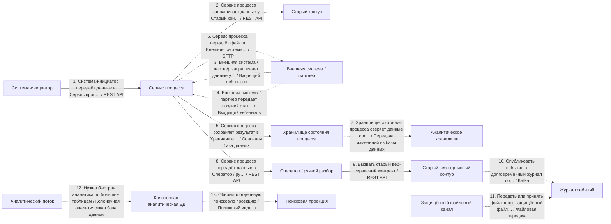

# Архитектурный разбор: Черновой разбор процесса

## Короткий человеческий вывод

**Итог:** НЕ ГОТОВО: слишком много рисков. **Архитектурная готовность:** 2.2/10. **Готовность к промышленному запуску:** нельзя выпускать без закрытия блокеров.

**Полнота вводных:** 56%. **Надёжность рекомендаций:** низкая.

**Масштаб процесса:** 13 взаимодействий, из них 13 в основной цепочке и 0 сквозных контролей. Участников: 15.

**Бизнес-цель:** Предварительно оценить интеграционный процесс по неполному описанию
**Основная сущность:** Entity. Деньги: нет. Регуляторика: нет. Клиентский сценарий: нет.

**Как читать оценку:** низкая оценка не означает, что все выбранные технологии неправильные. Она означает, что до запуска есть блокеры: не закрыты гарантии доставки, восстановления, безопасности, сверки или эксплуатации.

## Что блокирует запуск

| Приоритет | Проблема | Где проявляется | Что сделать |
|---|---|---|---|
| Высокий | Замена legacy-системы описана без плана переключения. | Весь процесс | Используйте strangler-подход: параллельный прогон со сверкой старого и нового контура, поэтапное переключение трафика по процентам или сегментам, критерии переключения и план отката с сохранением данных, накопленных в новом контуре. |
| Высокий | Входящий веб-вызов должен проходить проверку подлинности. | Затронуто мест: 2 | Проверяйте HMAC или подпись провайдера до любой бизнес-обработки; секрет храните в защищённом хранилище и предусмотрите его ротацию. |
| Высокий | Дочерний вызов может ждать дольше, чем родительский шаг. | 1 «Система-инициатор передаёт данные в Сервис процесса» (500мс) → 2 «Сервис процесса запрашивает данные у Старый контур» (500мс) | Таймауты должны строго убывать вниз по цепочке: дочерний таймаут должен быть меньше родительского с учётом сетевых накладных; общий бюджет времени распределяйте от целевого времени ответа сверху вниз. |
| Высокий | Процесс блокируется на вызове внешней системы. | Затронуто мест: 2 | Настройте таймаут, предохранитель внешнего вызова и запасной сценарий-ответ; если бизнес-сценарий позволяет, переведите шаг в асинхронную обработку через очередь с компенсацией. |
| Высокий | Система одновременно пишет в БД и публикует событие без таблицы исходящих сообщений. | Сервис процесса: «Опубликовать событие в долговременный журнал событий» | Используйте транзакционную таблицу исходящих сообщений: событие записывается в той же транзакции, что и агрегат, а отдельный публикатор читает таблицу исходящих сообщений и публикует событие с повторными попытками. |
| Средний | Событие не содержит обязательную обёртку события. | «Опубликовать событие в долговременный журнал событий» | Зафиксируйте единую обёртку события: идентификатор события, тип события, версия события, идентификатор агрегата или entityId, сквозной идентификатор или идентификатор трассировки, время возникновения события, производитель события и тело сообщения. |
| Средний | Повторные попытки настроены без лимита попыток и очередь ошибок. | Затронуто мест: 3 | Добавьте счётчик попыток и экспоненциальное увеличение паузы между повторами; после заданного числа попыток отправляйте сообщение в очередь ошибок или карантин с алертом и описанной процедурой повторной обработки. |
| Средний | Дочерний вызов может ждать дольше, чем родительский шаг. | 8 «Сервис процесса передаёт данные в Оператор / ручной разбор» (500мс) → 9 «Вызвать старый веб-сервисный контракт» (1500мс) | Таймауты должны строго убывать вниз по цепочке: дочерний таймаут должен быть меньше родительского с учётом сетевых накладных; общий бюджет времени распределяйте от целевого времени ответа сверху вниз. |

## Рекомендуемый порядок действий

1. Связать запись в БД и публикацию события через транзакционную таблицу исходящих сообщений.
2. Закрыть безопасность входящих вызовов: подпись, окно времени, защита от повторов и дедупликация.
3. Добавить сверку ожидаемых и фактических данных и процедуру восстановления расхождений.
4. Для асинхронных участков описать лимит повторов, очередь ошибок, владельца разбора и повторную обработку.
5. Пересчитать бюджет таймаутов сверху вниз: дочерний вызов должен завершаться раньше родительского.
6. Описать план перехода со старого контура: параллельный прогон, критерии переключения и откат.
7. После исправлений повторить архитектурную проверку и зафиксировать принятые компромиссы в ADR.

## Проверка логики схемы

Схема не содержит очевидных противоречий между названием связи, участниками и выбранным основным способом взаимодействия.

## Почему выбраны технологии и способы взаимодействия

### Объяснение по шагам

Решения ниже сгруппированы по смыслу. В основной цепочке показано, **кто с кем взаимодействует и каким способом**. Сквозные вещи — аудит, безопасность, авторизация, наблюдаемость, секреты — вынесены отдельно и не смешиваются с бизнес-потоком.

Для каждого решения указано: **Почему выбрано**, **Почему не другой вариант**, **Обязательные условия**, **Почему предлагается именно так** и **Почему нельзя просто не делать**.

### API и онлайн-взаимодействие

### Шаг 1. Система-инициатор передаёт данные в Сервис процесса

**Что:** шаг 1 — «Система-инициатор передаёт данные в Сервис процесса». Основной способ взаимодействия: REST API.
**Где:** связь идёт от «Система-инициатор» к «Сервис процесса». Исполнитель: «Система-инициатор». Выполняется после: начало процесса или внешний запуск.
**Почему:** Подходит для синхронного запроса по HTTP: система отправляет запрос и должна получить ответ в рамках текущего сценария.
**Почему не другой вариант:** SOAP нужен в основном при старом WSDL/XML-контракте. Kafka, RabbitMQ и другие брокеры разрывают сценарий во времени и подходят, когда ответ не нужен сразу.
**Что проверить перед выпуском:** Нужны таймаут, лимит повторных попыток, единая модель ошибок, трассировка и ключ идемпотентности для операций с записью.

### Шаг 2. Сервис процесса запрашивает данные у Старый контур

**Что:** шаг 2 — «Сервис процесса запрашивает данные у Старый контур». Основной способ взаимодействия: REST API.
**Где:** связь идёт от «Сервис процесса» к «Старый контур». Исполнитель: «Сервис процесса». Выполняется после: шаг 1 «Система-инициатор передаёт данные в Сервис процесса».
**Почему:** Подходит для синхронного запроса по HTTP: система отправляет запрос и должна получить ответ в рамках текущего сценария.
**Почему не другой вариант:** SOAP нужен в основном при старом WSDL/XML-контракте. Kafka, RabbitMQ и другие брокеры разрывают сценарий во времени и подходят, когда ответ не нужен сразу.
**Служебные компоненты:** БД процесса нужна как служебный компонент: она фиксирует состояние, ключ идемпотентности и историю шага.
**Что проверить перед выпуском:** Нужны таймаут, лимит повторных попыток, единая модель ошибок, трассировка и ключ идемпотентности для операций с записью.

### Шаг 3. Внешняя система / партнёр запрашивает данные у Сервис процесса

**Что:** шаг 3 — «Внешняя система / партнёр запрашивает данные у Сервис процесса». Основной способ взаимодействия: Входящий веб-вызов.
**Где:** связь идёт от «Внешняя система / партнёр» к «Сервис процесса». Исполнитель: «Сервис процесса». Выполняется после: шаг 2 «Сервис процесса запрашивает данные у Старый контур».
**Почему:** Подходит, когда внешняя система сама присылает результат или статус в наш HTTP эндпоинт.
**Почему не другой вариант:** Kafka/RabbitMQ нельзя требовать от партнёра, если он работает через HTTP. Периодический опрос хуже, потому что создаёт лишнюю нагрузку и задержку.
**Служебные компоненты:** БД процесса нужна как служебный компонент: она фиксирует состояние, ключ идемпотентности и историю шага. Служебная запись в БД не должна подменять канал взаимодействия с получателем. Для позднего входящего результата нужна таблица входящих сообщений: она защищает от дублей и повторной доставки.
**Что проверить перед выпуском:** Нужны подпись запроса, защита от повторов, окно времени, дедупликация и безопасное логирование без ПДн.

### Шаг 4. Внешняя система / партнёр передаёт поздний статус в Сервис процесса

**Что:** шаг 4 — «Внешняя система / партнёр передаёт поздний статус в Сервис процесса». Основной способ взаимодействия: Входящий веб-вызов.
**Где:** связь идёт от «Внешняя система / партнёр» к «Сервис процесса». Исполнитель: «Внешняя система / партнёр». Выполняется после: шаг 3 «Внешняя система / партнёр запрашивает данные у Сервис процесса».
**Почему:** Подходит, когда внешняя система сама присылает результат или статус в наш HTTP эндпоинт.
**Почему не другой вариант:** Kafka/RabbitMQ нельзя требовать от партнёра, если он работает через HTTP. Периодический опрос хуже, потому что создаёт лишнюю нагрузку и задержку.
**Служебные компоненты:** БД процесса нужна как служебный компонент: она фиксирует состояние, ключ идемпотентности и историю шага. Служебная запись в БД не должна подменять канал взаимодействия с получателем. Для позднего входящего результата нужна таблица входящих сообщений: она защищает от дублей и повторной доставки.
**Что проверить перед выпуском:** Нужны подпись запроса, защита от повторов, окно времени, дедупликация и безопасное логирование без ПДн.

### Шаг 8. Сервис процесса передаёт данные в Оператор / ручной разбор

**Что:** шаг 8 — «Сервис процесса передаёт данные в Оператор / ручной разбор». Основной способ взаимодействия: REST API.
**Где:** связь идёт от «Сервис процесса» к «Оператор / ручной разбор». Исполнитель: «Сервис процесса». Выполняется после: шаг 7 «Хранилище состояния процесса сверяет данные с Аналитическое хранилище».
**Почему:** Подходит для синхронного запроса по HTTP: система отправляет запрос и должна получить ответ в рамках текущего сценария.
**Почему не другой вариант:** SOAP нужен в основном при старом WSDL/XML-контракте. Kafka, RabbitMQ и другие брокеры разрывают сценарий во времени и подходят, когда ответ не нужен сразу.
**Что проверить перед выпуском:** Нужны таймаут, лимит повторных попыток, единая модель ошибок, трассировка и ключ идемпотентности для операций с записью.

### Шаг 9. Вызвать старый веб-сервисный контракт

**Что:** шаг 9 — «Вызвать старый веб-сервисный контракт». Основной способ взаимодействия: REST API.
**Где:** связь идёт от «Оператор / ручной разбор» к «Старый веб-сервисный контур». Исполнитель: «Сервис процесса». Выполняется после: шаг 8 «Сервис процесса передаёт данные в Оператор / ручной разбор».
**Почему:** Подходит для синхронного запроса по HTTP: система отправляет запрос и должна получить ответ в рамках текущего сценария.
**Почему не другой вариант:** SOAP нужен в основном при старом WSDL/XML-контракте. Kafka, RabbitMQ и другие брокеры разрывают сценарий во времени и подходят, когда ответ не нужен сразу.
**Что проверить перед выпуском:** Нужны таймаут, лимит повторных попыток, единая модель ошибок, трассировка и ключ идемпотентности для операций с записью.

### Асинхронный обмен

### Шаг 10. Опубликовать событие в долговременный журнал событий

**Что:** шаг 10 — «Опубликовать событие в долговременный журнал событий». Основной способ взаимодействия: Kafka.
**Где:** связь идёт от «Старый веб-сервисный контур» к «Журнал событий». Исполнитель: «Сервис процесса». Выполняется после: шаг 9 «Вызвать старый веб-сервисный контракт».
**Почему:** Подходит для потока событий, высокой нагрузки, повторной обработки, хранения истории событий и рассылки нескольким потребителям.
**Почему не другой вариант:** REST не подходит, если потребителей несколько и результат не нужен немедленно. RabbitMQ проще для очереди задач, но хуже как долговременный журнал событий. Redis Streams легче, но обычно слабее для критичного журнала событий.
**Служебные компоненты:** Если перед публикацией меняется состояние в БД, нужна таблица исходящих сообщений: изменение состояния и подготовка сообщения должны быть атомарными. Нужна сверка полноты между источником и аналитическим контуром: количество записей, ключи, контрольные суммы и отчёт расхождений.
**Что проверить перед выпуском:** Нужны топик, ключ партиционирования, группа потребителей, срок хранения, очередь ошибок или карантин и инструкция повторной обработки.

### Данные и чтение

### Шаг 5. Сервис процесса сохраняет результат в Хранилище состояния процесса

**Что:** шаг 5 — «Сервис процесса сохраняет результат в Хранилище состояния процесса». Основной способ взаимодействия: Основная база данных.
**Где:** связь идёт от «Сервис процесса» к «Хранилище состояния процесса». Исполнитель: «Сервис процесса». Выполняется после: шаг 4 «Внешняя система / партнёр передаёт поздний статус в Сервис процесса».
**Почему:** Подходит для фиксации состояния процесса, статусов, ключей идемпотентности, истории и технического журнала шагов.
**Почему не другой вариант:** Redis не должен быть источником истины. Kafka/RabbitMQ передают сообщения, но не заменяют надёжную операционную запись. Аналитическое хранилище не подходит для оперативной транзакции.
**Что проверить перед выпуском:** Нужны транзакции, уникальные индексы, версия записи или optimistic locking, сроки хранения и план очистки технических таблиц.

### Шаг 13. Обновить отдельную поисковую проекцию

**Что:** шаг 13 — «Обновить отдельную поисковую проекцию». Основной способ взаимодействия: Поисковый индекс.
**Где:** связь идёт от «Колоночная аналитическая БД» к «Поисковая проекция». Исполнитель: «Сервис процесса». Выполняется после: шаг 12 «Нужна быстрая аналитика по большим таблицам».
**Почему:** Подходит для полнотекстового поиска, фильтрации по многим полям и быстрых пользовательских выборок.
**Почему не другой вариант:** БД может быть источником истины, но не всегда удобна для полнотекстового поиска. Redis ускоряет чтение по ключу, но не заменяет поисковый индекс.
**Что проверить перед выпуском:** Нужны переиндексация, контроль отставания индекса, правила актуализации и понятная свежесть данных для пользователя.

### Аналитика и загрузки

### Шаг 7. Хранилище состояния процесса сверяет данные с Аналитическое хранилище

**Что:** шаг 7 — «Хранилище состояния процесса сверяет данные с Аналитическое хранилище». Основной способ взаимодействия: Передача изменений из базы данных.
**Где:** связь идёт от «Хранилище состояния процесса» к «Аналитическое хранилище». Исполнитель: «Хранилище состояния процесса». Выполняется после: шаг 6 «Сервис процесса передаёт файл в Внешняя система / партнёр».
**Почему:** Подходит, когда данные уже зафиксированы в операционной БД и их нужно передавать в аналитический контур без замедления основного процесса.
**Почему не другой вариант:** Прямая запись в аналитическое хранилище из бизнес-сервиса связывает операционный процесс с аналитикой. Batch проще, но даёт большую задержку. Событие из приложения требует строгой дисциплины таблицы исходящих сообщений.
**Служебные компоненты:** Нужна сверка полноты между источником и аналитическим контуром: количество записей, ключи, контрольные суммы и отчёт расхождений.
**Что проверить перед выпуском:** Нужны контроль позиции чтения, контроль отставания, совместимость схем, повторная синхронизация и сверка полноты.

### Шаг 12. Нужна быстрая аналитика по большим таблицам

**Что:** шаг 12 — «Нужна быстрая аналитика по большим таблицам». Основной способ взаимодействия: Колоночная аналитическая база данных.
**Где:** связь идёт от «Аналитический поток» к «Колоночная аналитическая БД». Исполнитель: «Сервис процесса». Выполняется после: шаг 11 «Передать или принять файл через защищённый файловый канал».
**Почему:** Подходит для быстрой аналитики по большим таблицам, агрегаций, витрин и отчётов по событиям.
**Почему не другой вариант:** Операционная БД не должна выполнять тяжёлую аналитику. аналитическое хранилище шире по назначению, но ClickHouse удобен для быстрых аналитических запросов и логовых витрин.
**Служебные компоненты:** Нужна сверка полноты между источником и аналитическим контуром: количество записей, ключи, контрольные суммы и отчёт расхождений.
**Что проверить перед выпуском:** Нужны партиционирование, ключ сортировки, контроль свежести, политика хранения и сверка с источником.

### Файлы и доставка контента

### Шаг 6. Сервис процесса передаёт файл в Внешняя система / партнёр

**Что:** шаг 6 — «Сервис процесса передаёт файл в Внешняя система / партнёр». Основной способ взаимодействия: SFTP.
**Где:** связь идёт от «Сервис процесса» к «Внешняя система / партнёр». Исполнитель: «Сервис процесса». Выполняется после: шаг 5 «Сервис процесса сохраняет результат в Хранилище состояния процесса».
**Почему:** Подходит для защищённого файлового обмена с legacy или внешним контрагентом, когда API недоступен или запрещён регламентом.
**Почему не другой вариант:** REST/gRPC удобнее для оперативных запросов, но не подходят, если партнёр работает только файлами. Kafka/RabbitMQ обычно не доступны между организациями без отдельного соглашения.
**Служебные компоненты:** Если партнёр вернёт результат позже, нужен отдельный входящий шаг: партнёр присылает статус в сервис процесса с подписью и дедупликацией.
**Что проверить перед выпуском:** Нужны имя файла, контрольная сумма, идентификатор пакета, журнал загрузки, карантин ошибок и повторная обработка файла.

### Шаг 11. Передать или принять файл через защищённый файловый канал

**Что:** шаг 11 — «Передать или принять файл через защищённый файловый канал». Основной способ взаимодействия: Файловая передача.
**Где:** связь идёт от «Защищённый файловый канал» к «Журнал событий». Исполнитель: «Сервис процесса». Выполняется после: шаг 10 «Опубликовать событие в долговременный журнал событий».
**Почему:** Подходит для пакетной передачи документов или больших наборов данных, когда процесс не требует мгновенного ответа.
**Почему не другой вариант:** REST неудобен для больших файлов и массовой загрузки. Kafka не должна переносить тяжёлые документы внутри события. объектное хранилище лучше для хранения больших файлов, а file — для факта передачи.
**Что проверить перед выпуском:** Нужны контрольная сумма, размер, тип файла, антивирусная проверка, карантин и журнал строк/документов.

## Сквозные контроли и служебные компоненты

Сквозные контроли в схеме не выделены. Перед запуском всё равно проверьте авторизацию, аудит, секреты, логирование, метрики и инструкции разбора инцидентов.

## Контрольные проверки готовности к промышленному запуску

| Область | Статус | Что важно |
|---|---|---|
| Контракт | Блокирует выпуск | Каждое событие содержит стандартную обёртку события. |
| Надёжность | Блокирует выпуск | Для внешних блокирующих вызовов описаны предохранитель внешнего вызова и деградация. |
| Целостность данных | Блокирует выпуск | При записи в БД и публикации события используется таблица исходящих сообщений; Для процесса предусмотрена сверка. |
| Наблюдаемость | Требует проверки | Для процесса настроены метрики, алерты и дашборды. |
| Безопасность | Блокирует выпуск | Входящий веб-вызов или обратный вызов проходит проверку подписи. |
| Производительность | Проходит | Явных проблем не найдено. |
| Эксплуатация и внедрение | Проходит | Явных проблем не найдено. |

## Какие вводные нужно уточнить

| Приоритет | Область | Что уточнить | Почему важно |
|---|---|---|---|
| medium | Данные | Какой natural/бизнес-ключ или operationId уникально определяет операцию? | Без уникального ключа сложно гарантировать dedup и повторную обработку без дублей. |
| medium | Порядок | Нужен ли порядок событий хотя бы в рамках одной сущности? | Многие статусы/операции нельзя применять в произвольном порядке. |
| medium | Внешние системы | Какие лимиты запросов у внешних систем и что делать при 429/лимите? | Без лимитов нельзя оценить пиковую нагрузку и обратное давление. |
| medium | Отказоустойчивость | Какая деградация допустима при отказе внешней системы? | Иначе отказ партнёра становится отказом вашего сценария. |
| medium | целевое время ответа | Какое целевое время ответа и таймаут для пользовательского или системного ответа? | Без целевого времени ответа невозможно распределить бюджет таймаутов и понять, где нужна async-граница. |
| medium | Нагрузка | Какая средняя и пиковая нагрузка, размер события и допустимый лаг? | Без нагрузки нельзя выбрать партиционирование, пул потребителей, БД и лимиты. |
| medium | Сверка | Как сверяются расхождения между источником истины и потребителями? | Техническая доставка не гарантирует бизнесовую полноту и согласованность. |
| Информация | Владение | Кто владельцы систем, контрактов и алертов? | Без владельцев неясны ответственность и эскалация. |

## Краткая сводка по стеку

| Технология / способ | Где применяется |
|---|---:|
| REST API | 4 |
| Входящий веб-вызов | 2 |
| Kafka | 1 |
| SFTP | 1 |
| Колоночная аналитическая база данных | 1 |
| Основная база данных | 1 |
| Передача изменений из базы данных | 1 |
| Поисковый индекс | 1 |
| Файловая передача | 1 |

<details>
<summary>Приложение A. Полная таблица по всем шагам</summary>

| Шаг | Связь | Основной способ | Что проверить |
|---|---|---|---|
| 1. Система-инициатор передаёт данные в Сервис процесса | Система-инициатор → Сервис процесса. Исполнитель: Система-инициатор | REST API | Нужны таймаут, лимит повторных попыток, единая модель ошибок, трассировка и ключ идемпотентности для операций с записью. |
| 2. Сервис процесса запрашивает данные у Старый контур | Сервис процесса → Старый контур. Исполнитель: Сервис процесса | REST API | Нужны таймаут, лимит повторных попыток, единая модель ошибок, трассировка и ключ идемпотентности для операций с записью. |
| 3. Внешняя система / партнёр запрашивает данные у Сервис процесса | Внешняя система / партнёр → Сервис процесса. Исполнитель: Сервис процесса | Входящий веб-вызов | Нужны подпись запроса, защита от повторов, окно времени, дедупликация и безопасное логирование без ПДн. |
| 4. Внешняя система / партнёр передаёт поздний статус в Сервис процесса | Внешняя система / партнёр → Сервис процесса. Исполнитель: Внешняя система / партнёр | Входящий веб-вызов | Нужны подпись запроса, защита от повторов, окно времени, дедупликация и безопасное логирование без ПДн. |
| 5. Сервис процесса сохраняет результат в Хранилище состояния процесса | Сервис процесса → Хранилище состояния процесса. Исполнитель: Сервис процесса | Основная база данных | Нужны транзакции, уникальные индексы, версия записи или optimistic locking, сроки хранения и план очистки технических таблиц. |
| 6. Сервис процесса передаёт файл в Внешняя система / партнёр | Сервис процесса → Внешняя система / партнёр. Исполнитель: Сервис процесса | SFTP | Нужны имя файла, контрольная сумма, идентификатор пакета, журнал загрузки, карантин ошибок и повторная обработка файла. |
| 7. Хранилище состояния процесса сверяет данные с Аналитическое хранилище | Хранилище состояния процесса → Аналитическое хранилище. Исполнитель: Хранилище состояния процесса | Передача изменений из базы данных | Нужны контроль позиции чтения, контроль отставания, совместимость схем, повторная синхронизация и сверка полноты. |
| 8. Сервис процесса передаёт данные в Оператор / ручной разбор | Сервис процесса → Оператор / ручной разбор. Исполнитель: Сервис процесса | REST API | Нужны таймаут, лимит повторных попыток, единая модель ошибок, трассировка и ключ идемпотентности для операций с записью. |
| 9. Вызвать старый веб-сервисный контракт | Оператор / ручной разбор → Старый веб-сервисный контур. Исполнитель: Сервис процесса | REST API | Нужны таймаут, лимит повторных попыток, единая модель ошибок, трассировка и ключ идемпотентности для операций с записью. |
| 10. Опубликовать событие в долговременный журнал событий | Старый веб-сервисный контур → Журнал событий. Исполнитель: Сервис процесса | Kafka | Нужны топик, ключ партиционирования, группа потребителей, срок хранения, очередь ошибок или карантин и инструкция повторной обработки. |
| 11. Передать или принять файл через защищённый файловый канал | Защищённый файловый канал → Журнал событий. Исполнитель: Сервис процесса | Файловая передача | Нужны контрольная сумма, размер, тип файла, антивирусная проверка, карантин и журнал строк/документов. |
| 12. Нужна быстрая аналитика по большим таблицам | Аналитический поток → Колоночная аналитическая БД. Исполнитель: Сервис процесса | Колоночная аналитическая база данных | Нужны партиционирование, ключ сортировки, контроль свежести, политика хранения и сверка с источником. |
| 13. Обновить отдельную поисковую проекцию | Колоночная аналитическая БД → Поисковая проекция. Исполнитель: Сервис процесса | Поисковый индекс | Нужны переиндексация, контроль отставания индекса, правила актуализации и понятная свежесть данных для пользователя. |

</details>

<details>
<summary>Приложение B. Найденные риски и слабые места</summary>

## Найденные риски и слабые места

### Высокий риск

#### Замена legacy-системы описана без плана переключения.

**Что:** найден риск «Замена legacy-системы описана без плана переключения.». затронуто мест: 1.
**Затронутые места:** Весь процесс.
**Почему это важно:** Миграция — это не просто «включили новое»: без параллельного прогона и плана отката первый серьёзный дефект нового контура может остановить бизнес.
**Что нужно сделать:** Используйте strangler-подход: параллельный прогон со сверкой старого и нового контура, поэтапное переключение трафика по процентам или сегментам, критерии переключения и план отката с сохранением данных, накопленных в новом контуре.

#### Входящий веб-вызов должен проходить проверку подлинности.

**Что:** найден риск «Входящий веб-вызов должен проходить проверку подлинности.». затронуто мест: 2.
**Затронутые места:** Затронуто мест: 2.
**Почему это важно:** Входящий веб-вызов является публичной точкой входа: без проверки подписи любой внешний отправитель может подделать бизнес-событие обычным POST-запросом.
**Что нужно сделать:** Проверяйте HMAC или подпись провайдера до любой бизнес-обработки; секрет храните в защищённом хранилище и предусмотрите его ротацию.

#### Дочерний вызов может ждать дольше, чем родительский шаг.

**Что:** найден риск «Дочерний вызов может ждать дольше, чем родительский шаг.». затронуто мест: 1.
**Затронутые места:** 1 «Система-инициатор передаёт данные в Сервис процесса» (500мс) → 2 «Сервис процесса запрашивает данные у Старый контур» (500мс).
**Почему это важно:** Родительский шаг завершится по таймауту раньше, чем ответит дочерний вызов; в результате выполненная работа будет потрачена впустую, а запись может «осиротеть»: она есть в БД дочерней системы, но родитель уже считает операцию отказавшей.
**Что нужно сделать:** Таймауты должны строго убывать вниз по цепочке: дочерний таймаут должен быть меньше родительского с учётом сетевых накладных; общий бюджет времени распределяйте от целевого времени ответа сверху вниз.

#### Процесс блокируется на вызове внешней системы.

**Что:** найден риск «Процесс блокируется на вызове внешней системы.». затронуто мест: 2.
**Затронутые места:** Затронуто мест: 2.
**Почему это важно:** Внешняя система находится вне вашего контроля: её деградация напрямую ухудшает ваше целевое время ответа и может исчерпать пул рабочих потоков.
**Что нужно сделать:** Настройте таймаут, предохранитель внешнего вызова и запасной сценарий-ответ; если бизнес-сценарий позволяет, переведите шаг в асинхронную обработку через очередь с компенсацией.

#### Система одновременно пишет в БД и публикует событие без таблицы исходящих сообщений.

**Что:** найден риск «Система одновременно пишет в БД и публикует событие без таблицы исходящих сообщений.». затронуто мест: 1.
**Затронутые места:** Сервис процесса: «Опубликовать событие в долговременный журнал событий».
**Почему это важно:** Запись в БД и публикация события являются двумя несвязанными операциями: при сбое между ними событие может потеряться или, наоборот, появиться без записи в БД.
**Что нужно сделать:** Используйте транзакционную таблицу исходящих сообщений: событие записывается в той же транзакции, что и агрегат, а отдельный публикатор читает таблицу исходящих сообщений и публикует событие с повторными попытками.

### Средний риск

#### Событие не содержит обязательную обёртку события.

**Что:** найден риск «Событие не содержит обязательную обёртку события.». затронуто мест: 1.
**Затронутые места:** «Опубликовать событие в долговременный журнал событий».
**Почему это важно:** Событие можно доставить, но его сложно дедуплицировать, трассировать, версионировать и восстанавливать после инцидента: не хватает идентификатор события, тип события, время возникновения события, идентификатор агрегата.
**Что нужно сделать:** Зафиксируйте единую обёртку события: идентификатор события, тип события, версия события, идентификатор агрегата или entityId, сквозной идентификатор или идентификатор трассировки, время возникновения события, производитель события и тело сообщения.

#### Повторные попытки настроены без лимита попыток и очередь ошибок.

**Что:** найден риск «Повторные попытки настроены без лимита попыток и очередь ошибок.». затронуто мест: 3.
**Затронутые места:** Затронуто мест: 3.
**Почему это важно:** «Ядовитое» сообщение будет снова и снова возвращаться в очередь: это создаст бесконечный цикл ошибок, лишнюю нагрузку на CPU и переполнение очереди.
**Что нужно сделать:** Добавьте счётчик попыток и экспоненциальное увеличение паузы между повторами; после заданного числа попыток отправляйте сообщение в очередь ошибок или карантин с алертом и описанной процедурой повторной обработки.

#### Дочерний вызов может ждать дольше, чем родительский шаг.

**Что:** найден риск «Дочерний вызов может ждать дольше, чем родительский шаг.». затронуто мест: 1.
**Затронутые места:** 8 «Сервис процесса передаёт данные в Оператор / ручной разбор» (500мс) → 9 «Вызвать старый веб-сервисный контракт» (1500мс).
**Почему это важно:** Родительский шаг завершится по таймауту раньше, чем ответит дочерний вызов; в результате выполненная работа будет потрачена впустую.
**Что нужно сделать:** Таймауты должны строго убывать вниз по цепочке: дочерний таймаут должен быть меньше родительского с учётом сетевых накладных; общий бюджет времени распределяйте от целевого времени ответа сверху вниз.


</details>

<details>
<summary>Приложение C. Сценарная основа для дальнейшей разработки</summary>

## Сценарная основа для дальнейшей разработки

Этот раздел нужен не для выбора технологий, а для постановки на разработку и тестирование: какой поток считается успешным, какие есть альтернативы, что происходит при ошибках и как проверять готовность.

### Основной сценарий

| Шаг | Связь | Что происходит | Ожидаемый результат |
|---|---|---|---|
| 1 | Система-инициатор → Сервис процесса | Система-инициатор передаёт данные в Сервис процесса | получен ответ или понятная ошибка с кодом, таймаутом и идентификатором сквозной связи |
| 2 | Сервис процесса → Старый контур | Сервис процесса запрашивает данные у Старый контур | получен ответ или понятная ошибка с кодом, таймаутом и идентификатором сквозной связи |
| 3 | Внешняя система / партнёр → Сервис процесса | Внешняя система / партнёр запрашивает данные у Сервис процесса | входящий результат проверен, дедуплицирован и применён к существующему процессу |
| 4 | Внешняя система / партнёр → Сервис процесса | Внешняя система / партнёр передаёт поздний статус в Сервис процесса | входящий результат проверен, дедуплицирован и применён к существующему процессу |
| 5 | Сервис процесса → Хранилище состояния процесса | Сервис процесса сохраняет результат в Хранилище состояния процесса | состояние или данные сохранены с защитой от дублей и конкурентных изменений |
| 6 | Сервис процесса → Внешняя система / партнёр | Сервис процесса передаёт файл в Внешняя система / партнёр | файл или документ сохранён/передан, контрольная сумма и повторная загрузка обработаны безопасно |
| 7 | Хранилище состояния процесса → Аналитическое хранилище | Хранилище состояния процесса сверяет данные с Аналитическое хранилище | данные доставлены в аналитический контур, полнота загрузки подтверждается сверкой |
| 8 | Сервис процесса → Оператор / ручной разбор | Сервис процесса передаёт данные в Оператор / ручной разбор | получен ответ или понятная ошибка с кодом, таймаутом и идентификатором сквозной связи |
| 9 | Оператор / ручной разбор → Старый веб-сервисный контур | Вызвать старый веб-сервисный контракт | получен ответ или понятная ошибка с кодом, таймаутом и идентификатором сквозной связи |
| 10 | Старый веб-сервисный контур → Журнал событий | Опубликовать событие в долговременный журнал событий | сообщение принято в брокер, дальнейшая обработка идёт асинхронно, статус процесса отслеживается отдельно |
| 11 | Защищённый файловый канал → Журнал событий | Передать или принять файл через защищённый файловый канал | файл или документ сохранён/передан, контрольная сумма и повторная загрузка обработаны безопасно |
| 12 | Аналитический поток → Колоночная аналитическая БД | Нужна быстрая аналитика по большим таблицам | данные доставлены в аналитический контур, полнота загрузки подтверждается сверкой |
| 13 | Колоночная аналитическая БД → Поисковая проекция | Обновить отдельную поисковую проекцию | шаг завершён, результат отражён в статусе процесса или журнале шагов |

### Альтернативные сценарии

#### Асинхронное принятие заявки без ожидания финального результата

**Когда возникает:** Хвост процесса занимает больше допустимого времени ответа или зависит от внешних систем.
**Как должен пройти сценарий:**
1. Система принимает запрос и создаёт идентификатор отслеживания.
2. Клиенту или вызывающей системе возвращается подтверждение приёма.
3. Дальнейшая обработка идёт через событие/очередь.
4. Статус процесса обновляется после каждого значимого шага.
**Ожидаемый результат:** Пользователь или потребитель видит промежуточный статус, а не зависший запрос.
**Обязательные проверки:** идентификатор отслеживания обязателен; GET /status или событие статуса; финальные статусы должны быть согласованы.

#### Повторная доставка или повторный запрос

**Когда возникает:** Сеть оборвалась, производитель события отправил событие повторно или потребитель переобработал сообщение.
**Как должен пройти сценарий:**
1. Система получает тот же ключ идемпотентности/идентификатор события/бизнес-ключ.
2. Выполняется попытка вставки ключа в таблицу входящих сообщений для защиты от дублей или поиск существующей операции.
3. Если ключ уже обработан, система возвращает прежний результат без повторного изменения бизнес-состояния.
**Ожидаемый результат:** Повтор не создаёт дубль операции, документа, проводки или статуса.
**Обязательные проверки:** UNIQUE-индекс на ключ идемпотентности; фиксация позиции чтения только после успешной обработки; тест дубля обязателен.

#### Внешняя система недоступна или отвечает медленно

**Когда возникает:** Внешняя зависимость вернула таймаут, 5xx, 429 или стала нестабильной.
**Как должен пройти сценарий:**
1. Вызов завершается по таймаут, а не висит бесконечно.
2. Circuit breaker ограничивает новые попытки.
3. Если операция критична, она переводится в статус ожидания или ручного разбора.
4. Если данные необязательны, используется запасной сценарий или частичный ответ.
**Ожидаемый результат:** Отказ партнёра не приводит к каскадному отказу всего процесса.
**Обязательные проверки:** таймаут на каждый внешний вызов; предохранитель внешнего вызова; запасной сценарий/очередь/ручной разбор; алерт владельцу зависимости.

#### Ошибка обработки сообщения

**Когда возникает:** потребитель события получил сообщение, но бизнес-обработка завершилась ошибкой.
**Как должен пройти сценарий:**
1. потребитель события выполняет ограниченные повторные попытки с увеличение паузы между повторами.
2. После исчерпания попыток сообщение попадает в очередь ошибок или карантин.
3. Создаётся алерт и задача на разбор.
4. После исправления причины выполняется повторная обработка.
**Ожидаемый результат:** Сообщение не теряется и не крутится бесконечно.
**Обязательные проверки:** максимальное число попыток; очередь ошибок/карантин; инструкция повторной обработки; идемпотентность повторной обработки.

#### Расхождение данных между источником истины и потребителем

**Когда возникает:** Техническая доставка прошла не полностью, повторная обработка былааааааа пропущена или потребитель отстал.
**Как должен пройти сценарий:**
1. Регламентная сверка сравнивает ожидаемые и фактические состояния.
2. Найденные расхождения попадают в отчёт.
3. Безопасные расхождения восстанавливаются автоматически.
4. Опасные расхождения уходят на ручной разбор.
**Ожидаемый результат:** Бизнес видит не только техническую доставку, но и фактическую полноту процесса.
**Обязательные проверки:** регулярная сверка; отчёт расхождений; владелец ручного разбора; аудит исправлений.

#### Поздний результат от внешней системы

**Когда возникает:** Партнёр завершает обработку после исходного запроса и присылает статус отдельно.
**Как должен пройти сценарий:**
1. принять входящий вызов.
2. проверить подпись и окно времени.
3. найти исходную операцию.
4. защититься от дублей.
5. обновить статус.
**Ожидаемый результат:** поздний результат применён один раз и связан с исходным процессом.
**Обязательные проверки:** подпись запроса; providerEventId + providerCode; таблица входящих сообщений; история статусов.

#### Асинхронная обработка без ожидания финального результата

**Когда возникает:** Часть процесса длится дольше допустимого времени ответа или зависит от очереди/брокера.
**Как должен пройти сценарий:**
1. создать идентификатор отслеживания.
2. зафиксировать статус PROCESSING.
3. передать сообщение в брокер.
4. обновлять статус по мере обработки.
**Ожидаемый результат:** вызывающая сторона не висит в ожидании, а видит отслеживаемый статус.
**Обязательные проверки:** ключ идемпотентности; очередь ошибок; повторная обработка; метрики отставания.

#### Повторная загрузка или сверка аналитических данных

**Когда возникает:** Найдены расхождения между источником и аналитическим контуром либо загрузка завершилась частично.
**Как должен пройти сценарий:**
1. сравнить ожидаемые и фактические данные.
2. выделить расхождения.
3. безопасно перезапустить период или идентификатор пакета.
4. зафиксировать результат сверки.
**Ожидаемый результат:** аналитический контур восстановлен без повторного применения уже обработанных данных.
**Обязательные проверки:** идентификатор пакета; контрольные суммы; журнал загрузки; отчёт расхождений.

### Ошибочные сценарии и восстановление

| Ошибка | Где возникает | Как система должна восстановиться |
|---|---|---|
| Система одновременно пишет в БД и публикует событие без таблицы исходящих сообщений. | Сервис процесса: «Опубликовать событие в долговременный журнал событий» | Используйте транзакционную таблицу исходящих сообщений: событие записывается в той же транзакции, что и агрегат, а отдельный публикатор читает таблицу исходящих сообщений и публикует событие с повторными попытками. |
| Процесс блокируется на вызове внешней системы. | Затронуто мест: 2. Шаг 2 «Сервис процесса запрашивает данные у Старый контур» → Старый контур; Шаг 9 «Вызвать старый веб-сервисный контракт» → Старый веб-сервисный контур | Настройте таймаут, предохранитель внешнего вызова и запасной сценарий-ответ; если бизнес-сценарий позволяет, переведите шаг в асинхронную обработку через очередь с компенсацией. |
| Входящий веб-вызов должен проходить проверку подлинности. | Затронуто мест: 2. Шаг 3 «Внешняя система / партнёр запрашивает данные у Сервис процесса»; Шаг 4 «Внешняя система / партнёр передаёт поздний статус в Сервис процесса» | Проверяйте HMAC или подпись провайдера до любой бизнес-обработки; секрет храните в защищённом хранилище и предусмотрите его ротацию. |
| Замена legacy-системы описана без плана переключения. | Весь процесс | Используйте strangler-подход: параллельный прогон со сверкой старого и нового контура, поэтапное переключение трафика по процентам или сегментам, критерии переключения и план отката с сохранением данных, накопленных в новом контуре. |
| Дочерний вызов может ждать дольше, чем родительский шаг. | 1 «Система-инициатор передаёт данные в Сервис процесса» (500мс) → 2 «Сервис процесса запрашивает данные у Старый контур» (500мс) | Таймауты должны строго убывать вниз по цепочке: дочерний таймаут должен быть меньше родительского с учётом сетевых накладных; общий бюджет времени распределяйте от целевого времени ответа сверху вниз. |

### Критерии приёмки сценариев

- основной сценарий проходит до финального статуса без ручного вмешательства.
- повторный запрос или повторное событие не создаёт дубль бизнес-операции.
- таймаут внешней системы переводит процесс в понятный статус и создаёт алерт.
- сообщение после исчерпания попыток попадает в очередь ошибок или карантин.
- по идентификатору сквозной связи можно найти все шаги процесса.
- Основной успешный сценарий проходит от первого шага до финального статуса без ручного вмешательства.
- Каждый отказ из error-flow переводит процесс в понятный статус и оставляет запись в журнале.
- По сквозной идентификатор / идентификатор отслеживания можно найти все шаги одного процесса в логах и БД.

</details>

<details>
<summary>Приложение D. Артефакты для постановки и выпуска</summary>

## Варианты архитектурного решения

1. **Вариант A — минимально допустимый фикс** — срок короткий и нельзя сильно менять архитектуру.
2. **Вариант B — промышленный запуск-компромисс** — нужен рабочий вариант промышленного запуска для типовой корпоративной интеграции.
3. **Вариант C — целевая архитектура** — поток критичен, регуляторен, денежный или станет платформенным.

## Готовность к выпуску

- Все критичные и высокие находки закрыты или приняты в ADR как осознанный риск.
- Идемпотентность и обработка дублей покрыты автотестами.
- очередь ошибок, повторная обработка и инструкция разбора проверены на тестовом контуре.
- Метрики, алерты и идентификатор сквозной связи видны в логах/трейсах.
- Контрактные тесты производитель события↔потребитель проходят в CI.
- Нагрузочный тест подтверждает целевое время ответа и допустимое отставание обработки.

## Черновик контракта события

- **идентификатор события:** UUID, уникальный идентификатор события
- **тип события:** доменный тип события
- **версия события:** версия схемы
- **идентификатор агрегата:** идентификатор сущности Entity
- **идентификатор сквозной связи:** сквозная трассировка процесса
- **время возникновения события:** момент бизнес-события
- **производитель события:** система-источник
- **тело сообщения:** только необходимые доменные поля без лишних ПДн

## Чек-лист проверок и тестов

- Основной успешный сценарий: процесс проходит все шаги до финального статуса.
- Отказ шага 1 «Система-инициатор передаёт данные в Сервис процесса»: таймаут/5xx — процесс не зависает, статус и алерт корректны.
- Отказ шага 2 «Сервис процесса запрашивает данные у Старый контур»: таймаут/5xx — процесс не зависает, статус и алерт корректны.
- Отказ шага 5 «Сервис процесса сохраняет результат в Хранилище состояния процесса»: таймаут/5xx — процесс не зависает, статус и алерт корректны.
- Отказ шага 8 «Сервис процесса передаёт данные в Оператор / ручной разбор»: таймаут/5xx — процесс не зависает, статус и алерт корректны.
- Отказ шага 9 «Вызвать старый веб-сервисный контракт»: таймаут/5xx — процесс не зависает, статус и алерт корректны.
- Регресс на «Система одновременно пишет в БД и публикует событие без таблицы исходящих сообщений.»: Используйте транзакционную таблицу исходящих сообщений: событие записывается в той же транзакции, что и агрегат, а отдельный публикатор читает таблицу исходящих сообщений и публикует событие с повторными попытками.
- Регресс на «Процесс блокируется на вызове внешней системы.»: Настройте таймаут, предохранитель внешнего вызова и запасной сценарий-ответ; если бизнес-сценарий позволяет, переведите шаг в асинхронную обработку через очередь с компенсацией. Затронуто мест: 2.
- Регресс на «Входящий веб-вызов должен проходить проверку подлинности.»: Проверяйте HMAC или подпись провайдера до любой бизнес-обработки; секрет храните в защищённом хранилище и предусмотрите его ротацию. Затронуто мест: 2.
- Регресс на «Замена legacy-системы описана без плана переключения.»: Используйте strangler-подход: параллельный прогон со сверкой старого и нового контура, поэтапное переключение трафика по процентам или сегментам, критерии переключения и план отката с сохранением данных, накопленных в новом контуре.
- Регресс на «Дочерний вызов может ждать дольше, чем родительский шаг.»: Таймауты должны строго убывать вниз по цепочке: дочерний таймаут должен быть меньше родительского с учётом сетевых накладных; общий бюджет времени распределяйте от целевого времени ответа сверху вниз.
- Дубль события/запроса с тем же ключом обрабатывается ровно один раз.
- Ядовитое сообщение уходит в очередь ошибок после N попыток; повторная обработка восстанавливает обработку.

## SQL-черновик хранения

```sql
CREATE TABLE entity (
    id uuid PRIMARY KEY DEFAULT gen_random_uuid(),
    business_id text NOT NULL,
    event_id uuid UNIQUE,
    correlation_id uuid NOT NULL,
    status text NOT NULL,
    created_at timestamptz NOT NULL DEFAULT now(),
    updated_at timestamptz NOT NULL DEFAULT now()
);

CREATE INDEX idx_entity_business_id ON entity (business_id);
CREATE INDEX idx_entity_correlation_id ON entity (correlation_id);

CREATE TABLE entity_step_log (
    id bigserial PRIMARY KEY,
    entity_id uuid NOT NULL REFERENCES entity(id),
    step_name text NOT NULL,
    status text NOT NULL,
    details jsonb,
    occurred_at timestamptz NOT NULL DEFAULT now()
);

CREATE INDEX idx_entity_step_log_entity_id ON entity_step_log (entity_id);

CREATE TABLE outbox (
    id bigserial PRIMARY KEY,
    aggregate_id uuid NOT NULL,
    event_type text NOT NULL,
    event_body jsonb NOT NULL,
    created_at timestamptz NOT NULL DEFAULT now(),
    published_at timestamptz
);

CREATE INDEX idx_outbox_unpublished ON outbox (id) WHERE published_at IS NULL;

CREATE TABLE inbox_dedup (
    event_id uuid PRIMARY KEY,
    source_system text NOT NULL,
    received_at timestamptz NOT NULL DEFAULT now(),
    processed_at timestamptz
);
```

## Диаграммы процесса

Диаграммы строятся по фактической связи «кто → кому». Исполнитель шага не подставляется внутрь маршрута, поэтому схема не должна создавать ложные цепочки вида «источник → исполнитель → получатель».

### Основная схема взаимодействий



### Последовательность основной цепочки

```mermaid
sequenceDiagram
 participant N1 as Система-инициатор
 participant N2 as Сервис процесса
 participant N3 as Старый контур
 participant N4 as Внешняя система / партнёр
 participant N5 as Хранилище состояния процесса
 participant N6 as Аналитическое хранилище
 participant N7 as Оператор / ручной разбор
 participant N8 as Старый веб-сервисный контур
 participant N9 as Журнал событий
 participant N10 as Защищённый файловый канал
 participant N11 as Аналитический поток
 participant N12 as Колоночная аналитическая БД
 participant N13 as Поисковая проекция
 N1->>N2: 1. Система-инициатор передаёт данные в Сервис проц… / REST API
 N2->>N3: 2. Сервис процесса запрашивает данные у Старый кон… / REST API
 N4--)N2: 3. Внешняя система / партнёр запрашивает данные у… / Входящий веб-вызов
 N4--)N2: 4. Внешняя система / партнёр передаёт поздний стат… / Входящий веб-вызов
 N2->>N5: 5. Сервис процесса сохраняет результат в Хранилище… / Основная база данных
 N2--)N4: 6. Сервис процесса передаёт файл в Внешняя система… / SFTP
 N5--)N6: 7. Хранилище состояния процесса сверяет данные с А… / Передача изменений из базы данных
 N2->>N7: 8. Сервис процесса передаёт данные в Оператор / ру… / REST API
 N7->>N8: 9. Вызвать старый веб-сервисный контракт / REST API
 N8--)N9: 10. Опубликовать событие в долговременный журнал со… / Kafka
 N10--)N9: 11. Передать или принять файл через защищённый файл… / Файловая передача
 N11--)N12: 12. Нужна быстрая аналитика по большим таблицам / Колоночная аналитическая база данных
 N12--)N13: 13. Обновить отдельную поисковую проекцию / Поисковый индекс
```



</details>

<details>
<summary>Приложение E. Обязательный архитектурный чек-лист</summary>

| Область | Статус | Что проверяется | Как закрыть |
|---|---|---|---|
| Безопасность | Блокирует выпуск | Входящий веб-вызов или обратный вызов проходит проверку подписи. | Используйте HMAC, JWT или mTLS, окно защиты от повторной доставки и ротацию секретов. |
| Внедрение | Блокирует выпуск | Для внедрения описаны переключение, откат и управляемый флаг включения. | Опишите параллельный прогон, сверку, поэтапное включение и критерии отката. |
| Контракт | Блокирует выпуск | Каждое событие содержит стандартную обёртку события. | Стандартизируйте обязательную обёртку события: идентификатор события, тип события, версия события, идентификатор агрегата, время возникновения события и идентификатор сквозной связи. |
| Надёжность | Блокирует выпуск | Для внешних блокирующих вызовов описаны предохранитель внешнего вызова и деградация. | Добавьте таймаут, предохранитель внешнего вызова, запасной сценарий, изоляция ресурса и очередь выравнивания нагрузки. |
| Целостность | Блокирует выпуск | При записи в БД и публикации события используется таблица исходящих сообщений. | Используйте транзакционную таблицу исходящих сообщений: запись события должна выполняться в одной транзакции с изменением агрегата. |
| Наблюдаемость | Требует проверки | Для процесса настроены метрики, алерты и дашборды. | Добавьте бизнесовые и технические метрики, алерты и владельцев реакции. |
| Целостность | Требует проверки | Для процесса предусмотрена сверка. | Реализуйте сверку ожидаемых и фактических данных, отчёт расхождений, безопасное авто-восстановление и ручной разбор. |
| Безопасность | Проверено | Для ПДн и чувствительных полей описаны маскирование и срок хранения. | Минимизируйте тело сообщения, маскируйте логи, настройте TTL или удаление и роли доступа. |
| Данные | Проверено | Ключ поиска и ключ идемпотентности имеют правильную область уникальности. | Опишите составной ключ и используйте его одинаково в SELECT, UPDATE, UPSERT, уникальном индексе, таблице входящих сообщений, таблице исходящих сообщений и процедуре повторной обработки. Примеры: requestId + operationType + targetSystem + tenantId; operUid + operationType + targetSystem; providerEventId + providerCode. |
| Контракт | Проверено | Для каждого события или API зафиксирована единая схема и версия. | Используйте реестр схем событий, JSON Schema, Avro или Protobuf и добавьте контрактные тесты со стороны потребителя. |
| Контракт | Проверено | Для клиентского API описана модель ошибок. | Опишите errorCode, повторяемые, userMessage, technicalMessage и сопоставление HTTP/gRPC. |
| Наблюдаемость | Проверено | CorrelationId или traceId проходит через всю цепочку. | Передавайте W3C traceparent или идентификатор сквозной связи в запросах, событиях и логах. |
| Наблюдаемость | Проверено | Для процесса описана статусная модель и история переходов. | Опишите статусы, status_history или step_log, а также финальные и промежуточные состояния. |
| Надёжность | Проверено | Повторные попытки не создают дубли бизнес-операций. | Используйте operationId или ключ идемпотентности с уникальным индексом; для входящих событий добавьте таблицу входящих сообщений для защиты от дублей. |
| Надёжность | Проверено | Для асинхронной обработки задан лимит попыток и очередь ошибок или карантин. | Настройте увеличение паузы между повторами, максимальное число попыток, очередь ошибок, алерт и владельца ручного разбора. |
| Надёжность | Проверено | Для каждого блокирующего вызова задан таймаут. | Задайте таймаут на каждом шаге и общий предельный срок ожидания, рассчитанный от целевого времени ответа. |
| Надёжность | Проверено | После исправления ошибки есть понятная процедура повторной обработки. | Опишите ручную и пакетную повторную обработку, требования к идемпотентности и права доступа на запуск. |
| Производительность | Проверено | Для нагрузки описаны пропускная способность, обратное давление и отставание потребителей. | Проведите нагрузочный тест, задайте лимиты, механизм обратного давления, партиции и алерты на отставание потребителей. |
| Производительность | Проверено | Заявленное целевое время ответа сходится с критическим путём. | Разорвите цепочку, распараллельте независимые шаги, добавьте кэш или уменьшите таймаут. |
| Целостность | Проверено | Для входящих событий и для входящего веб-вызова используется таблица входящих сообщений для защиты от дублей или другой механизм защиты от дублей. | Используйте таблицу входящих сообщений для защиты от дублей с уникальным идентификатор события и фиксируйте позицию чтения только после успешной обработки. |
| Целостность | Проверено | Требование к порядку событий и ключу партиционирования явно зафиксировано. | Уточните требование к порядку; для порядка внутри одной сущности используйте ключ партиционирования = entityId. |
| Целостность | Проверено | У основной сущности есть владелец и единственный писатель. | Назначьте system of record; остальные системы должны отправлять команды или события. |
| Эксплуатация | Проверено | Для служебных таблиц и топиков задан срок хранения и архивирование. | Добавьте партиционирование, TTL, архив, регламентную очистку и мониторинг размера. |

</details>

<details>
<summary>Приложение F. Матрица деталей, которые нельзя забыть</summary>

Матрица деталей: применимо инвариантов из каталога v7.1 — 108 из 125; блокируют выпуск — 7, требуют внимания — 24, нужно уточнить — 42, уже выглядит закрытым — 50.

| Область | Статус | Что проверить | Почему важно | Как закрыть |
|---|---|---|---|---|
| Асинхронность и брокеры | Блокирует выпуск | Async-шаг должен иметь очередь ошибок или карантин. | Иначе poison message теряется или бесконечно крутится. | Настройте максимальное число попыток, увеличение паузы между повторами, очередь ошибок или карантин, владельца и алерт. |
| Внешние зависимости | Блокирует выпуск | Входящий веб-вызов должен проверять подпись до бизнес-логики. | Иначе любой может подделать обратный вызов. | Проверяйте HMAC/JWT/mTLS, timestamp, nonce и повторная обработка window. |
| Восстановление | Блокирует выпуск | Для каждой ошибки должен быть понятный маршрут восстановления. | очередь ошибок без инструкции разбора и безопасной повторной обработки — это не восстановление, а склад ошибок. | Опишите максимальное число попыток, очередь ошибок или карантин, владельца, алерт, команду повторной обработки, идемпотентная повторная обработка, сверка после повторной обработки. |
| Контракт | Блокирует выпуск | Контракт должен описывать не только поля, но и их смысл. | Сервис может формально принимать JSON, но ломаться на изменении enum, nullable-поля, даты, валюты или статуса. | Добавьте schema/version, examples, required/optional, enum lifecycle, compatibility rules, контрактные тесты производитель события↔потребитель. |
| Контракты | Блокирует выпуск | Каждое событие должно иметь стандартный envelope. | Без стандартной обёртки событие трудно дедуплицировать, трассировать, версионировать и переигрывать. | Утвердите единый envelope для всех событий и контрактные тесты. |
| Синхронные API | Блокирует выпуск | Для внешнего вызова нужен предохранитель внешнего вызова. | Иначе деградация партнёра истощит ваши потоки. | Настройте закрыт / открыт / пробный режим, запасной сценарий и метрики breaker state. |
| Целостность данных | Блокирует выпуск | Запись и публикация события должны быть атомарно связаны. | Без таблицы исходящих сообщений событие может потеряться или появиться без записи. | Используйте транзакционную таблицу исходящих сообщений и публикатор с повторная попытка. |
| Асинхронность и брокеры | Требует проверки | Offset должен коммититься только после успешной обработки. | Commit до обработки приводит к потере сообщения при падении. | Коммитьте после транзакционной обработки или используйте таблицы исходящих/входящих сообщений на стороне получателя. |
| Асинхронность и брокеры | Требует проверки | Нужно различать повторяемые и неповторяемые ошибки. | Повтор валидационной ошибки создаёт шум и лаг. | Классифицируйте валидационные, бизнесовые и технические ошибки и разные маршруты обработки. |
| Асинхронность и брокеры | Требует проверки | Нужно учитывать горячие партиции. | Горячая партиция ограничит пропускную способность всего потока. | Измеряйте распределение ключей, используйте salting/шардирование там, где порядок не критичен. |
| Асинхронность и брокеры | Требует проверки | Потребитель должен иметь обратное давление. | Без обратного давления отставание обработки и очереди растут до отказа. | Ограничьте concurrency, настройте лимиты запросов, предохранитель внешнего вызова и pause/resume consumption. |
| Безопасность | Требует проверки | Все входы должны быть аутентифицированы и авторизованы. | Интеграции часто становятся обходным путём авторизации. | Используйте mTLS, OAuth/JWT и сервисные учётные записи, ACL топиков, ролевая модель доступа и минимально необходимые права. |
| Безопасность | Требует проверки | Должна быть защита от injection и schema poisoning. | Тело интеграционного сообщения может содержать неожиданные структуры, SQL/JSON injection и слишком глубокие объекты. | Используйте schema validation, белый список полей, лимиты глубины и размера и параметризованные запросы. |
| Безопасность | Требует проверки | Нужна защита от повторная обработка-атак. | Подписанный, но старый обратный вызов может быть переиспользован. | Проверяйте время запроса, одноразовый номер и подпись и окно идемпотентности. |
| Безопасность | Требует проверки | Секреты интеграций должны ротироваться. | Неротируемый секрет превращает утечку в постоянный доступ. | Используйте хранилище секретов, версии секретов, период совместной работы старого и нового секрета и инструкция разбора ротации. |
| Внедрение | Требует проверки | Для изменения существующей интеграции нужен план перехода. | Даже хорошая целевая архитектура может сломать промышленный запуск при переходе без параллельного прогона старого и нового контура, откат и миграции незавершённых процессов. | Опишите управляемый флаг включения, параллельный прогон старого и нового контура/теневой прогон, дозагрузка исторических данных, миграцию старых статусов, откат criteria, окно заморозки и совместимость контрактов. |
| Внешние зависимости | Требует проверки | Должен быть known-degradation сценарий. | Внешняя система вне вашего контроля. | Опишите запасной сценарий, кэш или устаревшие данные как режим деградации, очередь на повтор, ручной разбор. |
| Внешние зависимости | Требует проверки | Нужно учитывать лимиты запросов и квоты партнёра. | Пики нагрузки превратятся в 429 и массовые отказы. | Добавьте клиентский ограничитель запросов, очередь, увеличение паузы между повторами, квоты и алерты. |
| Восстановление | Требует проверки | Техническая доставка должна проверяться бизнесовой сверкой. | Доставка с гарантией «минимум один раз» не гарантирует бизнесовую полноту. Сообщение могло попасть в очередь ошибок, быть пропущено, обработаться частично или устареть. | Добавьте сверка: ожидаемые и фактические данные, отчёт расхождений, автоматическое довосстановление, ручной разбор и аудит исправлений. |
| Идентичность и ключи | Требует проверки | Должен быть сопоставление внутренних и внешних идентификаторов. | Без сопоставления невозможно расследовать ошибки внешней системы и безопасно повторять запросы. | Заведите таблицу сопоставление с sourceSystem, externalId, internalId, status, timestamps. |
| Идентичность и ключи | Требует проверки | Повторная обработка должна использовать тот же ключ, что и бизнес-операция. | Если ключ идемпотентности отличается от ключа поиска или уникального индекса, повтор может не создать дубль технически, но восстановить или обновить не ту бизнес-запись. | Составьте таблицу соответствия: business key, ключ идемпотентности, lookup key, unique index, ключ повторной обработки. Несовпадения должны быть явно обоснованы. |
| Наблюдаемость | Требует проверки | Нужны метрики очередь ошибок, повторная попытка и повторная обработка. | очередь ошибок без алертов превращается в кладбище событий. | Мониторьте количество сообщений в очереди ошибок/age, количество повторных попыток, успешные и неуспешные повторные обработки и алерты владельцу. |
| Наблюдаемость | Требует проверки | У поддержки должен быть способ найти весь процесс по одному идентификатору. | Без сквозной трассировки даже правильный процесс невозможно поддерживать в режиме инцидента. | Пробросьте сквозной идентификатор или traceId, заведите status history, business metrics, technical metrics, dashboard, alert rules и инструкция разбора. |
| Порядок и конкуренция | Требует проверки | Порядок событий должен быть задан только там, где он действительно нужен. | Лишнее требование глобального порядка убивает масштабирование, а отсутствие порядка внутри одной сущности ломает статусные переходы. | Опишите ключ партиционирования, правила обработки устаревших событий, sequence/version, обработку out-of-order и правила игнорирования устаревших событий. |
| Синхронные API | Требует проверки | Для внешнего вызова нужен изоляция ресурса. | Один медленный партнёр может занять весь пул обработчиков. | Выделите отдельный пул соединений и потоков и лимиты concurrency. |
| Статусы и сценарии | Требует проверки | У каждого альтернативного сценария должен быть ожидаемый результат. | Если альтернативы не описаны, команда реализует только основной успешный сценарий, а ошибки начнут всплывать на тестировании или при промышленном запуске. | Для каждого шага заведите минимум: успех, ошибка валидации, таймаут, попытки исчерпаны, дубль, устаревшее событие или нарушение порядка, ручное исправление. |
| Сценарии и статусы | Требует проверки | Должен быть сценарий “зависло в промежуточном статусе”. | Без контроль возраста статуса процесс может зависнуть навсегда. | Добавьте целевое время ответа по статусам, job поиска зависших, алерт и восстановление action. |
| Тестирование | Требует проверки | Нужен тест очередь ошибок и повторная обработка. | Восстановление часто ломается, если его не проверять. | Автоматизируйте сценарий poison message → очередь ошибок → fix → повторная обработка → сверка. |
| Тестирование | Требует проверки | Нужен тест таймаут внешней системы. | Внешние отказы должны быть штатным сценарием. | Добавьте contract/mock tests для таймаут/5xx/429 и проверку запасной сценарий. |
| Тестирование | Требует проверки | Нужен тест дубля сообщения. | Дубли являются нормой для at-least-once. | Добавьте тест duplicate event/request и проверку отсутствия дубля бизнес-записи. |
| Тестирование | Требует проверки | Нужны негативные тесты безопасности. | Основной успешный сценарий не доказывает безопасность. | Добавьте negative security tests для аутентификация, signature, ACL, PII leakage и input limits. |
| аналитическое хранилище и витрины | Не указано | Выгрузка должна иметь контроль полноты. | Технический экспорт не гарантирует бизнесовую полноту. | Используйте контрольную отметку загрузки, counts, контрольная суммаs, сверка и отчёт расхождений. |
| аналитическое хранилище и витрины | Не указано | Нужен повторная обработка/дозагрузка исторических данных за период. | Ошибки трансформаций требуют переобработки периода. | Храните raw layer, versioned transformations и дозагрузка исторических данных procedure. |
| аналитическое хранилище и витрины | Не указано | Нужно разделять event time и load time. | Поздние события иначе попадают не в тот период. | Храните время возникновения события, loadedAt, businessDate и правила late data. |
| Асинхронность и брокеры | Не указано | потребитель события должен быть готов к неизвестной версии события. | Rolling deployment создаёт период разных версий производителя и потребителя события. | Поддерживайте обратная совместимость и устойчивый разбор неизвестных полей. |
| Асинхронность и брокеры | Не указано | Event storm должен быть ограничен. | Циклы событий создают лавину сообщений и дубли. | Опишите causationId, дедупликацию, запрет циклов и лимиты рассылка в несколько веток. |
| Бизнес и границы | Не указано | Границы ответственности систем должны быть зафиксированы. | Без границ ответственности спорные ошибки будут перекладываться между командами. | Назначьте владельца процесса, владельца каждой системы, владельца контракта и правила эскалации. |
| Бизнес и границы | Не указано | Нужно определить допустимый уровень eventual consistency. | Асинхронная архитектура всегда создаёт окно рассогласования, которое нужно согласовать с бизнесом. | Укажите freshness/целевое время ответа согласованности для потребителей, витрин и статусов. |
| Бизнес и границы | Не указано | Процесс должен разделять обязательные и необязательные шаги. | Необязательные обогащения часто случайно попадают в критический путь и ломают целевое время ответа. | Для каждого шага укажите mandatory/optional и допустимую деградацию. |
| Внедрение и миграция | Не указано | Контракт должен поддерживать rolling deployment. | В промышленный запуск версии обновляются не мгновенно. | Сначала добавляйте optional fields, затем обновляйте потребительs, потом делайте required. |
| Внедрение и миграция | Не указано | Миграции БД должны быть backward-compatible. | Жёсткие миграции создают простой и аварии при откате. | Применяйте expand → migrate → contract, nullable first, дозагрузка исторических данных, then enforce. |
| Внедрение и миграция | Не указано | Нужен параллельный прогон старого и нового контура или теневой прогон mode для рискованных миграций. | Без параллельной проверки ошибки проявятся только после переключения. | Запустите теневой прогон/параллельный прогон старого и нового контура, сравните результаты и заведите diff report. |
| Внедрение и миграция | Не указано | Нужен откат, который не ломает данные. | Откат приложения не откатывает схему БД и события. | Используйте expand-contract migrations, reversible changes, управляемый флаг включенияs и data compatibility. |
| Внедрение и миграция | Не указано | Переход со старой системы должен иметь переключение plan. | Без плана переключения можно потерять незавершённые процессы. | Опишите управляемый флаг включенияs, migration window, freeze, smoke tests и откат criteria. |
| Внедрение и миграция | Не указано | Старые незавершённые процессы должны быть мигрированы или добиты старым путём. | Незавершённые процессы часто ломаются при смене контракта или маршрута. | Опишите migration of in-flight, compatibility layer или drain old flow. |
| Идентичность и ключи | Не указано | Каждый идентификатор должен иметь область уникальности. | Одинаковый id может быть допустим в разных типах операций, клиентах/tenant, провайдерах или целевых системах. | Зафиксируйте scope: global, per-source, per-provider, per-operationType, per-targetSystem, per-tenant, per-process. |
| Идентичность и ключи | Не указано | Ключи не должны зависеть от изменяемых полей. | Изменение поля-части ключа ломает ссылки, повторная обработка и аудит. | Используйте стабильные идентификаторы; изменяемые атрибуты храните отдельно. |
| Контракт | Не указано | Время события должно быть однозначным. | Ошибки с временем редко видны на основной успешный сценарий, но ломают целевое время ответа, сверки, регуляторные отчёты, повторную обработку и расследование инцидентов. | Разделите время возникновения события, producedAt, processedAt. Используйте UTC/позиция чтения и явно опишите, какое поле используется для сортировки, целевое время ответа и отчётности. |
| Контракты | Не указано | API должен иметь контракт ошибок. | Без модели ошибок потребители неправильно повторяют запросы и показывают пользователю неясные сообщения. | Опишите Problem JSON/gRPC status, бизнес-коды ошибок, повторяемые и идентификатор сквозной связи. |
| Контракты | Не указано | Тело сообщения должен иметь ограничения размера. | Большие тело сообщения ухудшают latency, storage, broker пропускная способность и очередь ошибок/повторная обработка. | Зафиксируйте max size, compression, ссылку на объектное хранилище для больших документов. |
| Контракты | Не указано | Денежные и количественные поля должны иметь точность и единицы измерения. | decimal/float, копейки/рубли и разные режимы округления создают финансовые расхождения. | Используйте decimal/numeric, amount+currency, scale, rounding mode и тесты границ. |
| Контракты | Не указано | Контракт должен описывать nullable и обязательность полей. | Неявный null часто ломает потребителей сильнее, чем отсутствие нового поля. | Зафиксируйте обязательность, необязательность и допустимость null, значения по умолчанию и миграционный период. |
| Наблюдаемость | Не указано | Логи должны быть структурированными. | Свободный текст плохо ищется и агрегируется. | Используйте структурированные JSON-логи и единый logging contract. |
| Наблюдаемость | Не указано | Нужны бизнес-метрики, а не только технические. | CPU и latency не показывают, что бизнес-процесс застрял. | Добавьте metrics: created/completed/failed/stuck/status_age/повторно обработано/reconciled. |
| Синхронные API | Не указано | API должен быть идемпотентен для повторяемых команд. | Клиент не знает, выполнилась ли операция, и может повторить запрос. | Добавьте Idempotency-Key, operationId и запрос статуса. |
| Синхронные API | Не указано | Повторная попытка синхронного API должен быть ограничен и безопасен. | Без лимитов повторная попытка усиливает аварию зависимости. | Используйте capped повторная попытка, exponential увеличение паузы между повторами, случайный разброс паузы и ключ идемпотентности. |
| Синхронные API | Не указано | Нужна политика лимиты запросов. | Без лимитов один потребитель может перегрузить сервис. | Добавьте per-client/per-tenant limits, 429 contract и увеличение паузы между повторами. |
| Синхронные API | Не указано | Нужно ограничение размера запроса и ответа. | Большие тела создают нехватку памяти, медленные запросы и сетевые таймауты. | Валидируйте размер, используйте streaming/объектное хранилище для файлов. |
| Сценарии и статусы | Не указано | Отмена процесса должна быть отдельным сценарием. | Cancel почти всегда отличается от failed и rejected. | Опишите CANCEL_REQUESTED или CANCELLED, компенсации, запрет отмены после финального статуса. |
| Сценарии и статусы | Не указано | Финальный статус должен быть защищён от случайного отката. | Запоздалые события могут испортить уже финализированный процесс. | Добавьте terminal-state guard и правила допустимых переходов. |
| Тестирование | Не указано | Нужен тест основной успешный сценарий. | Без сквозной проверки интеграция может быть “зелёной” по частям и сломанной целиком. | Добавьте E2E тест с проверкой статуса, данных, событий и журналов. |
| Тестирование | Не указано | Нужен тест out-of-order/stale события. | На потоке порядок не всегда гарантирован. | Тестируйте sequence/version и terminal-state guard. |
| Тестирование | Не указано | Нужно тестировать откат и совместимость версий. | Откат часто ломается из-за несовместимых данных. | Тестируйте rolling deploy, old/new compatibility, управляемый флаг включения off и data откат plan. |
| Тестирование | Не указано | Нужны контрактные тесты. | Изменение обязательного поля часто не ловится unit-тестами. | Добавьте потребитель-driven contracts, schema compatibility и negative tests. |
| Файлы и batch | Не указано | Batch должен иметь окно запуска и rerun policy. | Повтор batch может задублировать данные или пропустить период. | Опишите batch window, контрольную отметку загрузки, checkpoint, rerun и сверка. |
| Целостность данных | Не указано | Read-your-writes после async-записи должен быть явно запрещён или обеспечен. | После события потребитель может ещё не обновить модель для чтения. | Возвращайте идентификатор отслеживания/status или используйте синхронную запись в источник истины. |
| Целостность данных | Не указано | Должна быть история изменений статуса. | Последнее состояние не объясняет, почему и где процесс сломался. | Добавьте status_history/step_log с actor, reason, old/new status, timestamp. |
| Целостность данных | Не указано | Операция должна быть либо атомарной, либо компенсируемой. | Частично выполненная распределённая операция оставляет разные системы в разных состояниях. | Опишите Saga, компенсации, политика повторных попыток и ручное восстановление. |
| Целостность данных | Не указано | Событие должно публиковаться после фиксации факта. | Раннее событие может привести потребителя к чтению ещё несуществующих данных. | Публикуйте из таблица исходящих сообщений после commit; избегайте event before commit. |
| Целостность данных | Не указано | У сущности должен быть system of record. | Несколько писателей создают потерянные обновления и расхождения. | Назначьте владельца записи; остальные системы отправляют команды или читают проекции. |
| Целостность данных | Не указано | Удаление должно быть логическим или аудируемым там, где нужен след. | Физическое удаление ломает аудит, сверки и повторную обработку. | Используйте deleted_at/status + срок хранения policy; физическую очистку делайте регламентно. |
| Эксплуатация | Не указано | Алерты должны иметь владельца и порог. | Алерт без владельца — это шум. | Для каждого alert укажите owner, severity, threshold, action и silence policy. |
| Эксплуатация | Не указано | Должен быть инструкция разбора инцидентов. | Без инструкции разбора время восстановления зависит от конкретного человека. | Опишите диагностику, команды повторная обработка, откат, escalation и коммуникации. |
| аналитическое хранилище и витрины | Проверено | аналитическое хранилище не должен находиться в основной поток. | аналитическое хранилище обычно не рассчитаноооооооо на операционный целевое время ответа. | Выгружайте через CDC/ETL после фиксации операции. |
| Асинхронность и брокеры | Проверено | Late события должны иметь политику обработки. | Позднее событие может откатить корректный статус. | Используйте sequence/version/event time и правила обработки устаревших событий. |
| Асинхронность и брокеры | Проверено | Partition key должен соответствовать требованию порядка. | Без правильного ключа события одной сущности могут прийти out-of-order. | Используйте entityId/идентификатор агрегата как ключ партиционирования там, где нужен порядок внутри одной сущности. |
| Асинхронность и брокеры | Проверено | Повторная обработка должна быть безопасной и идемпотентным. | Повторная обработка часто запускается после инцидента и может умножить ущерб. | Опишите команду повторной обработки, права запуска, пробный запуск без изменений, idempotency и сверка после повторной обработки. |
| Асинхронность и брокеры | Проверено | Retention топика должен покрывать время восстановления. | Если срок хранения меньше окна восстановления, повторная обработка из брокера невозможна. | Укажите срок хранения по топикам, очередь ошибок и таблиц исходящих и входящих сообщений. |
| Асинхронность и брокеры | Проверено | Событие должно иметь владельцев потребителей или явную модель подписки. | Неизвестные потребители усложняют изменение контракта. | Ведите каталог производителя и потребителя события, целевое время доставки и compatibility matrix. |
| Безопасность | Проверено | аналитическое хранилище/витрина не должны расширять доступ к ПДн. | Аналитический контур часто имеет больше пользователей. | Минимизируйте поля, обезличивайте, применяйте ролевая модель доступа/ABAC и audit queries. |

Показаны первые 80 пунктов из 123. Остальные лучше разбирать в отдельном рабочем чек-листе.

</details>

<!-- Совместимость: Обязательный архитектурный чек-лист; Матрица деталей, которые нельзя забыть; Контрольные проверки готовности к промышленному запуску -->