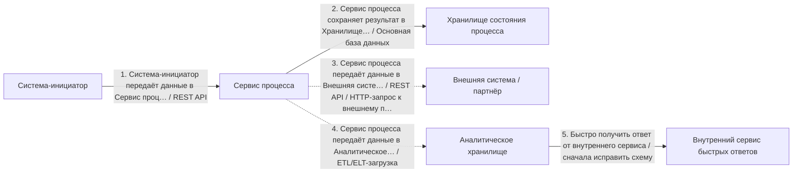
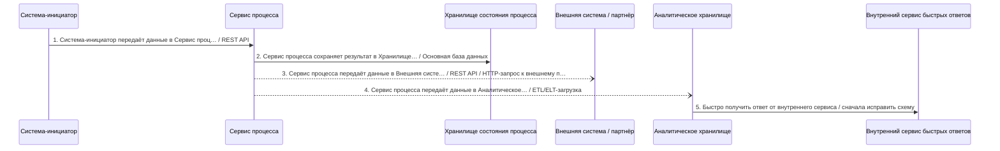
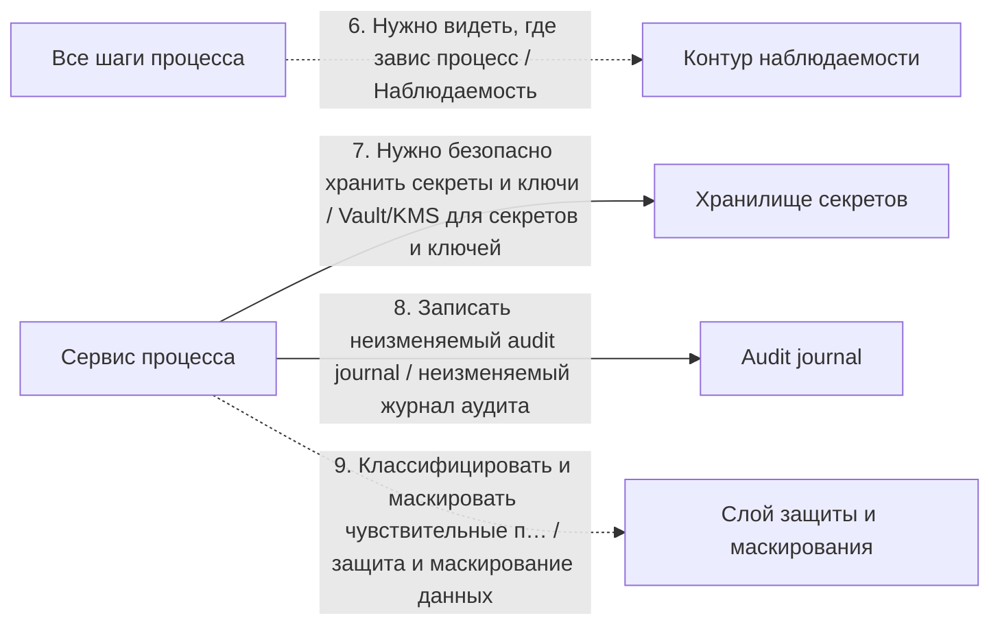

# Архитектурный разбор: synthetic v8.6.20 report audit

## Короткий человеческий вывод

**Итог:** НЕ ГОТОВО: слишком много рисков. **Архитектурная готовность:** 4.4/10. **Готовность к промышленному запуску:** нельзя выпускать без закрытия блокеров.

**Полнота вводных:** 32%. **Надёжность рекомендаций:** низкая.

**Масштаб процесса:** 9 взаимодействий, из них 5 в основной цепочке и 4 сквозных контролей. Участников: 9.

**Бизнес-цель:** не указана
**Основная сущность:** Entity. Деньги: нет. Регуляторика: да. Клиентский сценарий: нет.

**Как читать оценку:** низкая оценка не означает, что все выбранные технологии неправильные. Она означает, что до запуска есть блокеры: не закрыты гарантии доставки, восстановления, безопасности, сверки или эксплуатации.

## Что блокирует запуск

| Приоритет | Проблема | Где проявляется | Что сделать |
|---|---|---|---|
| Высокий | Повторы в синхронной цепочке усиливают друг друга. | «Система-инициатор передаёт данные в Сервис процесса» → «Сервис процесса сохраняет результат в Хранилище состояния процесса» | Задайте единый бюджет повторов на весь запрос (общий предельный срок ожидания), предохранитель внешнего вызова на каждом звене и экспоненциальная увеличением паузы между повторами со случайным разбросом; не повторяйте вызовы, которые уже не успеют уложиться в целевое время ответа. |
| Высокий | Процесс блокируется на вызове внешней системы. | Шаг 1 «Система-инициатор передаёт данные в Сервис процесса» → Система-инициатор | Настройте таймаут, предохранитель внешнего вызова и запасной сценарий-ответ; если бизнес-сценарий позволяет, переведите шаг в асинхронную обработку через очередь с компенсацией. |
| Высокий | Важный асинхронный процесс не имеет сверки. | Весь процесс | Добавьте регулярную сверку источника истины с потребителями: ожидаемые и фактические данные, отчёт расхождений, автоматическое довосстановление там, где это безопасно, и ручной разбор. |
| Средний | Для интеграции не описана модель наблюдаемости. | Весь процесс | Добавьте технические и бизнес-метрики: latency по шагам, success/error rate, отставание потребителей, количество сообщений в очереди ошибок, количество повторных попыток, возраст статуса, traces по идентификатор сквозной связи и алерты по SLO. |
| Средний | Распределённый процесс не имеет сквозного идентификатора. | Весь процесс | Пробрасывайте сквозной идентификатор или идентификатор трассировки через все шаги и тело сообщения событий (W3C traceparent); логируйте его на каждом переходе и связывайте с идентификатором бизнес-процесса. |
| Средний | Повторные попытки настроены без лимита попыток и очередь ошибок. | Шаг 4 «Сервис процесса передаёт данные в Аналитическое хранилище» | Добавьте счётчик попыток и экспоненциальная увеличением паузы между повторами; после заданного числа попыток отправляйте сообщение в очередь ошибок или карантин с алертом и описанной процедурой повторной обработки. |
| Средний | В блокирующих шагах не задан таймаут. | 1 «Система-инициатор передаёт данные в Сервис процесса», 2 «Сервис процесса сохраняет результат в Хранилище состояния процесса», 5 «Быстро получить ответ от внутреннего сервиса», 7 «Нужно безопасно хранить секреты и ключи», 8 «Записать неизменяемый audit journal» | Задайте таймаут каждому блокирующему вызову и распределите бюджет времени от целевого времени ответа сверху вниз. |

## Рекомендуемый порядок действий

1. Добавить сверку ожидаемых и фактических данных и процедуру восстановления расхождений.
2. Для асинхронных участков описать лимит повторов, очередь ошибок, владельца разбора и повторную обработку.
3. Пересчитать бюджет таймаутов сверху вниз: дочерний вызов должен завершаться раньше родительского.
4. После исправлений повторить архитектурную проверку и зафиксировать принятые компромиссы в ADR.

## Проверка логики схемы

Перед подбором стека нужно исправить следующие противоречия в схеме:

- **Шаг 5 «Быстро получить ответ от внутреннего сервиса»**: Для быстрого синхронного ответа источник выглядит ошибочным: аналитическое хранилище не должно становиться инициатором gRPC-вызова. Исправьте связь на «Сервис процесса → внутренний сервис» или вынесите аналитическую витрину в отдельную модель для чтения.

## Почему выбраны технологии и способы взаимодействия

### Объяснение по шагам

Решения ниже сгруппированы по смыслу. В основной цепочке показано, **кто с кем взаимодействует и каким способом**. Сквозные вещи — аудит, безопасность, авторизация, наблюдаемость, секреты — вынесены отдельно и не смешиваются с бизнес-потоком.

Для каждого решения указано: **Почему выбрано**, **Почему не другой вариант**, **Обязательные условия**, **Почему предлагается именно так** и **Почему нельзя просто не делать**.

### API и онлайн-взаимодействие

### Шаг 1. Система-инициатор передаёт данные в Сервис процесса

**Что:** шаг 1 — «Система-инициатор передаёт данные в Сервис процесса». Основной способ взаимодействия: REST API.
**Где:** связь идёт от «Система-инициатор» к «Сервис процесса». Исполнитель: «Система-инициатор». Выполняется после: начало процесса или внешний запуск.
**Почему:** Подходит для синхронного запроса по HTTP: система отправляет запрос и должна получить ответ в рамках текущего сценария.
**Почему не другой вариант:** SOAP нужен в основном при старом WSDL/XML-контракте. Kafka, RabbitMQ и другие брокеры разрывают сценарий во времени и подходят, когда ответ не нужен сразу.
**Что проверить перед выпуском:** Нужны таймаут, лимит повторных попыток, единая модель ошибок, трассировка и ключ идемпотентности для операций с записью.

### Шаг 3. Сервис процесса передаёт данные в Внешняя система / партнёр

**Что:** шаг 3 — «Сервис процесса передаёт данные в Внешняя система / партнёр». Основной способ взаимодействия: REST API / HTTP-запрос к внешнему партнёру.
**Где:** связь идёт от «Сервис процесса» к «Внешняя система / партнёр». Исполнитель: «Сервис процесса». Выполняется после: шаг 2 «Сервис процесса сохраняет результат в Хранилище состояния процесса».
**Почему:** Подходит как исходящий запрос к партнёру для передачи данных или запуска внешней обработки. Технический ответ может подтвердить приём, а финальный бизнес-результат должен приходить отдельным входящим шагом.
**Почему не другой вариант:** Обратный вызов не является исходящей отправкой: это отдельный входящий результат от партнёра. БД фиксирует статус процесса, но не передаёт данные партнёру. Брокер нельзя требовать от внешней организации без отдельного соглашения.
**Служебные компоненты:** БД процесса нужна как служебный компонент: она фиксирует состояние, ключ идемпотентности и историю шага. Служебная запись в БД не должна подменять канал взаимодействия с получателем. Если партнёр вернёт результат позже, нужен отдельный входящий шаг: партнёр присылает статус в сервис процесса с подписью и дедупликацией.
**Что проверить перед выпуском:** Нужны таймаут, внешний requestId, ключ идемпотентности, ограниченные повторы, проверка неизвестного результата и отдельный входящий обратный вызов или входящий веб-вызов для финального статуса.

### Данные и чтение

### Шаг 2. Сервис процесса сохраняет результат в Хранилище состояния процесса

**Что:** шаг 2 — «Сервис процесса сохраняет результат в Хранилище состояния процесса». Основной способ взаимодействия: Основная база данных.
**Где:** связь идёт от «Сервис процесса» к «Хранилище состояния процесса». Исполнитель: «Сервис процесса». Выполняется после: шаг 1 «Система-инициатор передаёт данные в Сервис процесса».
**Почему:** Подходит для фиксации состояния процесса, статусов, ключей идемпотентности, истории и технического журнала шагов.
**Почему не другой вариант:** Redis не должен быть источником истины. Kafka/RabbitMQ передают сообщения, но не заменяют надёжную операционную запись. Аналитическое хранилище не подходит для оперативной транзакции.
**Что проверить перед выпуском:** Нужны транзакции, уникальные индексы, версия записи или optimistic locking, сроки хранения и план очистки технических таблиц.

### Аналитика и загрузки

### Шаг 4. Сервис процесса передаёт данные в Аналитическое хранилище

**Что:** шаг 4 — «Сервис процесса передаёт данные в Аналитическое хранилище». Основной способ взаимодействия: ETL/ELT-загрузка.
**Где:** связь идёт от «Сервис процесса» к «Аналитическое хранилище». Исполнитель: «Сервис процесса». Выполняется после: шаг 2 «Сервис процесса сохраняет результат в Хранилище состояния процесса».
**Почему:** Подходит для передачи данных в аналитический контур с преобразованием, контролем качества и подготовкой витрин.
**Почему не другой вариант:** Операционная БД является источником данных, но не способом доставки в аналитику. Прямая запись сервиса в аналитическое хранилище повышает связанность. CDC лучше для передачи изменений почти в реальном времени, Batch — для регламентной периодической загрузки.
**Служебные компоненты:** Нужна сверка полноты между источником и аналитическим контуром: количество записей, ключи, контрольные суммы и отчёт расхождений.
**Что проверить перед выпуском:** Нужны правила преобразования, контроль количества записей, журнал загрузки, карантин ошибок, повторный запуск периода и сверка с источником.

### Прочее

### Шаг 5. Быстро получить ответ от внутреннего сервиса

**Что:** шаг 5 — «Быстро получить ответ от внутреннего сервиса». Основной способ взаимодействия: сначала исправить схему.
**Где:** связь идёт от «Аналитическое хранилище» к «Внутренний сервис быстрых ответов». Исполнитель: «Сервис процесса». Выполняется после: шаг 4 «Сервис процесса передаёт данные в Аналитическое хранилище».
**Почему:** Для быстрого синхронного ответа источник выглядит ошибочным: аналитическое хранилище не должно становиться инициатором gRPC-вызова. Исправьте связь на «Сервис процесса → внутренний сервис» или вынесите аналитическую витрину в отдельную модель для чтения.
**Почему не другой вариант:** Выбор gRPC, REST, брокера или БД поверх некорректной связи создаст ложное ощущение готовой архитектуры.
**Что проверить перед выпуском:** Верните шаг на этап проектирования связей, исправьте источник, получателя и смысл действия, затем повторно запустите проверку и подбор стека.

## Сквозные контроли и служебные компоненты

Эти элементы не являются отдельными бизнес-шагами. Они применяются к процессу как контроль безопасности, эксплуатации, аудита или инфраструктуры.

### Контроль 6. Нужно видеть, где завис процесс

**Назначение:** Наблюдаемость.
**Где применяется:** «Все шаги процесса» → «Контур наблюдаемости» или ко всему процессу.
**Зачем нужен:** Подходит, чтобы видеть, где завис процесс: метрики, логи, трассировки, алерты и бизнес-события по состояниям.
**Что проверить:** Нужны идентификатор сквозной связи, метрики задержки и ошибок, трассировка, алерты по очередям/лагу/ошибкам, дашборды и инструкции разбора.

### Контроль 7. Нужно безопасно хранить секреты и ключи

**Назначение:** Vault/KMS для секретов и ключей.
**Где применяется:** «Сервис процесса» → «Хранилище секретов» или ко всему процессу.
**Зачем нужен:** Подходит, когда нужно безопасно хранить пароли, ключи подписи, сертификаты и секреты интеграций.
**Что проверить:** Нужны политики доступа, ротация ключей, аудит чтения секретов, шифрование, разграничение окружений и аварийные процедуры.

### Контроль 8. Записать неизменяемый audit journal

**Назначение:** неизменяемый журнал аудита.
**Где применяется:** «Сервис процесса» → «Audit journal» или ко всему процессу.
**Зачем нужен:** Подходит для юридически значимых действий: фиксирует факт, автора, время, причину изменения и связь с процессом без возможности тихо переписать историю.
**Что проверить:** Нужна неизменяемая модель, идентификатор сквозной связи, запрет изменения задним числом, срок хранения, разграничение доступа и аудит чтения журнала.

### Контроль 9. Классифицировать и маскировать чувствительные поля

**Назначение:** защита и маскирование данных.
**Где применяется:** «Сервис процесса» → «Сервис процесса» или ко всему процессу.
**Зачем нужен:** Подходит для чувствительных данных: классифицирует поля, маскирует лишнее в логах и событиях, ограничивает доступ и снижает риск утечки.
**Что проверить:** Нужны классификация полей, маскирование логов, запрет секретов в событиях, роли доступа, срок хранения и проверка тестовых стендов.

## Контрольные проверки готовности к промышленному запуску

| Область | Статус | Что важно |
|---|---|---|
| Контракт | Проходит | Явных проблем не найдено. |
| Надёжность | Блокирует выпуск | Для каждого блокирующего вызова задан таймаут.; Для внешних блокирующих вызовов описаны предохранитель внешнего вызова и деградация.; Для асинхронной обработки задан лимит попыток и очередь ошибок или карантин.; После исправления ошибки есть понятная процедура повторной обработки. |
| Целостность данных | Блокирует выпуск | Для процесса предусмотрена сверка. |
| Наблюдаемость | Блокирует выпуск | CorrelationId или traceId проходит через всю цепочку.; Для процесса настроены метрики, алерты и дашборды. |
| Безопасность | Проходит | Явных проблем не найдено. |
| Производительность | Проходит | Явных проблем не найдено. |
| Эксплуатация и внедрение | Проходит | Явных проблем не найдено. |

## Какие вводные нужно уточнить

| Приоритет | Область | Что уточнить | Почему важно |
|---|---|---|---|
| high | Бизнес | Какая бизнес-цель и что считается успешным финалом процесса? | Без цели невозможно отличить обязательный шаг от необязательной дообработки. |
| high | Трассировка | Какой сквозной сквозной идентификатор / идентификатор отслеживания проходит через все системы? | Без него нельзя расследовать инциденты по распределённой цепочке. |
| medium | Данные | Какие ключевые поля сущности, уникальные ключи и чувствительные данные? | Без полей нельзя проверить идемпотентность, индексы, ПДн и контракт. |
| medium | Данные | Какой natural/бизнес-ключ или operationId уникально определяет операцию? | Без уникального ключа сложно гарантировать dedup и повторную обработку без дублей. |
| medium | Внешние системы | Какие лимиты запросов у внешних систем и что делать при 429/лимите? | Без лимитов нельзя оценить пиковую нагрузку и обратное давление. |
| medium | Отказоустойчивость | Какая деградация допустима при отказе внешней системы? | Иначе отказ партнёра становится отказом вашего сценария. |
| medium | целевое время ответа | Какой целевое время ответа и таймаут для пользовательского или системного ответа? | Без целевое время ответа невозможно распределить бюджет таймаутов и понять, где нужна async-граница. |
| medium | Нагрузка | Какая средняя и пиковая нагрузка, размер события и допустимый лаг? | Без нагрузки нельзя выбрать партиционирование, пул потребителей, БД и лимиты. |
| medium | Сверка | Как сверяются расхождения между источником истины и потребителями? | Техническая доставка не гарантирует бизнесовую полноту и согласованность. |
| Информация | Владение | Кто владельцы систем, контрактов и алертов? | Без владельцев неясны ответственность и эскалация. |

## Краткая сводка по стеку

| Технология / способ | Где применяется |
|---|---:|
| ETL/ELT-загрузка | 1 |
| REST API | 1 |
| REST API / HTTP-запрос к внешнему партнёру | 1 |
| Основная база данных | 1 |
| сначала исправить схему | 1 |

<details>
<summary>Приложение A. Полная таблица по всем шагам</summary>

| Шаг | Связь | Основной способ | Что проверить |
|---|---|---|---|
| 1. Система-инициатор передаёт данные в Сервис процесса | Система-инициатор → Сервис процесса. Исполнитель: Система-инициатор | REST API | Нужны таймаут, лимит повторных попыток, единая модель ошибок, трассировка и ключ идемпотентности для операций с записью. |
| 2. Сервис процесса сохраняет результат в Хранилище состояния процесса | Сервис процесса → Хранилище состояния процесса. Исполнитель: Сервис процесса | Основная база данных | Нужны транзакции, уникальные индексы, версия записи или optimistic locking, сроки хранения и план очистки технических таблиц. |
| 3. Сервис процесса передаёт данные в Внешняя система / партнёр | Сервис процесса → Внешняя система / партнёр. Исполнитель: Сервис процесса | REST API / HTTP-запрос к внешнему партнёру | Нужны таймаут, внешний requestId, ключ идемпотентности, ограниченные повторы, проверка неизвестного результата и отдельный входящий обратный вызов или входящий веб-вызов для финального статуса. |
| 4. Сервис процесса передаёт данные в Аналитическое хранилище | Сервис процесса → Аналитическое хранилище. Исполнитель: Сервис процесса | ETL/ELT-загрузка | Нужны правила преобразования, контроль количества записей, журнал загрузки, карантин ошибок, повторный запуск периода и сверка с источником. |
| 5. Быстро получить ответ от внутреннего сервиса | Аналитическое хранилище → Внутренний сервис быстрых ответов. Исполнитель: Сервис процесса | сначала исправить схему | Верните шаг на этап проектирования связей, исправьте источник, получателя и смысл действия, затем повторно запустите проверку и подбор стека. |

</details>

<details>
<summary>Приложение B. Найденные риски и слабые места</summary>

## Найденные риски и слабые места

### Высокий риск

#### Повторы в синхронной цепочке усиливают друг друга.

**Что:** найден риск «Повторы в синхронной цепочке усиливают друг друга.». затронуто мест: 1.
**Затронутые места:** «Система-инициатор передаёт данные в Сервис процесса» → «Сервис процесса сохраняет результат в Хранилище состояния процесса».
**Почему это важно:** Несколько звеньев с автоматическими повторами друг за другом перемножают количество попыток (N×M×…): при деградации это создаёт шторм повторных попыток и лавинообразный рост нагрузки в самый плохой момент.
**Что нужно сделать:** Задайте единый бюджет повторов на весь запрос (общий предельный срок ожидания), предохранитель внешнего вызова на каждом звене и экспоненциальная увеличением паузы между повторами со случайным разбросом; не повторяйте вызовы, которые уже не успеют уложиться в целевое время ответа.

#### Процесс блокируется на вызове внешней системы.

**Что:** найден риск «Процесс блокируется на вызове внешней системы.». затронуто мест: 1.
**Затронутые места:** Шаг 1 «Система-инициатор передаёт данные в Сервис процесса» → Система-инициатор.
**Почему это важно:** Внешняя система находится вне вашего контроля: её деградация напрямую ухудшает ваше целевое время ответа и может исчерпать пул рабочих потоков.
**Что нужно сделать:** Настройте таймаут, предохранитель внешнего вызова и запасной сценарий-ответ; если бизнес-сценарий позволяет, переведите шаг в асинхронную обработку через очередь с компенсацией.

#### Важный асинхронный процесс не имеет сверки.

**Что:** найден риск «Важный асинхронный процесс не имеет сверки.». затронуто мест: 1.
**Затронутые места:** Весь процесс.
**Почему это важно:** Повторная попытка и очередь ошибок закрывают технические сбои, но не доказывают, что все бизнес-сущности дошли до финального состояния и что банк, партнёр или витрина не разошлись по данным.
**Что нужно сделать:** Добавьте регулярную сверку источника истины с потребителями: ожидаемые и фактические данные, отчёт расхождений, автоматическое довосстановление там, где это безопасно, и ручной разбор.

### Средний риск

#### Для интеграции не описана модель наблюдаемости.

**Что:** найден риск «Для интеграции не описана модель наблюдаемости.». затронуто мест: 1.
**Затронутые места:** Весь процесс.
**Почему это важно:** Даже корректная архитектура станет неуправляемой в промышленный запуск, если нельзя быстро увидеть, где застряла сущность, растёт ли отставание обработки, сколько сообщений находится в очередь ошибок и какой внешний вызов деградирует.
**Что нужно сделать:** Добавьте технические и бизнес-метрики: latency по шагам, success/error rate, отставание потребителей, количество сообщений в очереди ошибок, количество повторных попыток, возраст статуса, traces по идентификатор сквозной связи и алерты по SLO.

#### Распределённый процесс не имеет сквозного идентификатора.

**Что:** найден риск «Распределённый процесс не имеет сквозного идентификатора.». затронуто мест: 1.
**Затронутые места:** Весь процесс.
**Почему это важно:** Запрос проходит через несколько систем и асинхронных шагов; без сквозного идентификатора инцидент невозможно собрать по логам разных систем, поэтому расследование будет идти вслепую.
**Что нужно сделать:** Пробрасывайте сквозной идентификатор или идентификатор трассировки через все шаги и тело сообщения событий (W3C traceparent); логируйте его на каждом переходе и связывайте с идентификатором бизнес-процесса.

#### Повторные попытки настроены без лимита попыток и очередь ошибок.

**Что:** найден риск «Повторные попытки настроены без лимита попыток и очередь ошибок.». затронуто мест: 1.
**Затронутые места:** Шаг 4 «Сервис процесса передаёт данные в Аналитическое хранилище».
**Почему это важно:** «Ядовитое» сообщение будет снова и снова возвращаться в очередь: это создаст бесконечный цикл ошибок, лишнюю нагрузку на CPU и переполнение очереди.
**Что нужно сделать:** Добавьте счётчик попыток и экспоненциальная увеличением паузы между повторами; после заданного числа попыток отправляйте сообщение в очередь ошибок или карантин с алертом и описанной процедурой повторной обработки.

#### В блокирующих шагах не задан таймаут.

**Что:** найден риск «В блокирующих шагах не задан таймаут.». затронуто мест: 1.
**Затронутые места:** 1 «Система-инициатор передаёт данные в Сервис процесса», 2 «Сервис процесса сохраняет результат в Хранилище состояния процесса», 5 «Быстро получить ответ от внутреннего сервиса», 7 «Нужно безопасно хранить секреты и ключи», 8 «Записать неизменяемый audit journal».
**Почему это важно:** Без таймаута зависший вызов бесконечно удерживает поток и создаёт каскад ожиданий.
**Что нужно сделать:** Задайте таймаут каждому блокирующему вызову и распределите бюджет времени от целевого времени ответа сверху вниз.


</details>

<details>
<summary>Приложение C. Сценарная основа для дальнейшей разработки</summary>

## Сценарная основа для дальнейшей разработки

Этот раздел нужен не для выбора технологий, а для постановки на разработку и тестирование: какой поток считается успешным, какие есть альтернативы, что происходит при ошибках и как проверять готовность.

### Основной сценарий

| Шаг | Связь | Что происходит | Ожидаемый результат |
|---|---|---|---|
| 1 | Система-инициатор → Сервис процесса | Система-инициатор передаёт данные в Сервис процесса | получен ответ или понятная ошибка с кодом, таймаутом и идентификатором сквозной связи |
| 2 | Сервис процесса → Хранилище состояния процесса | Сервис процесса сохраняет результат в Хранилище состояния процесса | состояние или данные сохранены с защитой от дублей и конкурентных изменений |
| 3 | Сервис процесса → Внешняя система / партнёр | Сервис процесса передаёт данные в Внешняя система / партнёр | получен ответ или понятная ошибка с кодом, таймаутом и идентификатором сквозной связи |
| 4 | Сервис процесса → Аналитическое хранилище | Сервис процесса передаёт данные в Аналитическое хранилище | данные доставлены в аналитический контур, полнота загрузки подтверждается сверкой |
| 5 | Аналитическое хранилище → Внутренний сервис быстрых ответов | Быстро получить ответ от внутреннего сервиса | шаг завершён, результат отражён в статусе процесса или журнале шагов |

### Альтернативные сценарии

#### Асинхронное принятие заявки без ожидания финального результата

**Когда возникает:** Хвост процесса занимает больше допустимого времени ответа или зависит от внешних систем.
**Как должен пройти сценарий:**
1. Система принимает запрос и создаёт идентификатор отслеживания.
2. Клиенту или вызывающей системе возвращается подтверждение приёма.
3. Дальнейшая обработка идёт через событие/очередь.
4. Статус процесса обновляется после каждого значимого шага.
**Ожидаемый результат:** Пользователь или потребитель видит промежуточный статус, а не зависший запрос.
**Обязательные проверки:** идентификатор отслеживания обязателен; GET /status или событие статуса; финальные статусы должны быть согласованы.

#### Повторная доставка или повторный запрос

**Когда возникает:** Сеть оборвалась, производитель события отправил событие повторно или потребитель переобработал сообщение.
**Как должен пройти сценарий:**
1. Система получает тот же ключ идемпотентности/идентификатор события/бизнес-ключ.
2. Выполняется попытка вставки ключа в таблицу входящих сообщений для защиты от дублей или поиск существующей операции.
3. Если ключ уже обработан, система возвращает прежний результат без повторного изменения бизнес-состояния.
**Ожидаемый результат:** Повтор не создаёт дубль операции, документа, проводки или статуса.
**Обязательные проверки:** UNIQUE-индекс на ключ идемпотентности; фиксация позиции чтения только после успешной обработки; тест дубля обязателен.

#### Внешняя система недоступна или отвечает медленно

**Когда возникает:** Внешняя зависимость вернула таймаут, 5xx, 429 или стала нестабильной.
**Как должен пройти сценарий:**
1. Вызов завершается по таймаут, а не висит бесконечно.
2. Circuit breaker ограничивает новые попытки.
3. Если операция критична, она переводится в статус ожидания или ручного разбора.
4. Если данные необязательны, используется запасной сценарий или частичный ответ.
**Ожидаемый результат:** Отказ партнёра не приводит к каскадному отказу всего процесса.
**Обязательные проверки:** таймаут на каждый внешний вызов; предохранитель внешнего вызова; запасной сценарий/очередь/ручной разбор; алерт владельцу зависимости.

#### Расхождение данных между источником истины и потребителем

**Когда возникает:** Техническая доставка прошла не полностью, повторная обработка была пропущена или потребитель отстал.
**Как должен пройти сценарий:**
1. Регламентная сверка сравнивает ожидаемые и фактические состояния.
2. Найденные расхождения попадают в отчёт.
3. Безопасные расхождения восстанавливаются автоматически.
4. Опасные расхождения уходят на ручной разбор.
**Ожидаемый результат:** Бизнес видит не только техническую доставку, но и фактическую полноту процесса.
**Обязательные проверки:** регулярная сверка; отчёт расхождений; владелец ручного разбора; аудит исправлений.

#### Повторная загрузка или сверка аналитических данных

**Когда возникает:** Найдены расхождения между источником и аналитическим контуром либо загрузка завершилась частично.
**Как должен пройти сценарий:**
1. сравнить ожидаемые и фактические данные.
2. выделить расхождения.
3. безопасно перезапустить период или идентификатор пакета.
4. зафиксировать результат сверки.
**Ожидаемый результат:** аналитический контур восстановлен без повторного применения уже обработанных данных.
**Обязательные проверки:** идентификатор пакета; контрольные суммы; журнал загрузки; отчёт расхождений.

### Ошибочные сценарии и восстановление

| Ошибка | Где возникает | Как система должна восстановиться |
|---|---|---|
| Важный асинхронный процесс не имеет сверки. | Весь процесс | Добавьте регулярную сверку источника истины с потребителями: ожидаемые и фактические данные, отчёт расхождений, автоматическое довосстановление там, где это безопасно, и ручной разбор. |
| Процесс блокируется на вызове внешней системы. | Шаг 1 «Система-инициатор передаёт данные в Сервис процесса» → Система-инициатор | Настройте таймаут, предохранитель внешнего вызова и запасной сценарий-ответ; если бизнес-сценарий позволяет, переведите шаг в асинхронную обработку через очередь с компенсацией. |
| Повторы в синхронной цепочке усиливают друг друга. | «Система-инициатор передаёт данные в Сервис процесса» → «Сервис процесса сохраняет результат в Хранилище состояния процесса» | Задайте единый бюджет повторов на весь запрос (общий предельный срок ожидания), предохранитель внешнего вызова на каждом звене и экспоненциальная увеличением паузы между повторами со случайным разбросом; не повторяйте вызовы, которые уже не успеют уложиться в целевое время ответа. |

### Критерии приёмки сценариев

- основной сценарий проходит до финального статуса без ручного вмешательства.
- повторный запрос или повторное событие не создаёт дубль бизнес-операции.
- таймаут внешней системы переводит процесс в понятный статус и создаёт алерт.
- сообщение после исчерпания попыток попадает в очередь ошибок или карантин.
- по идентификатору сквозной связи можно найти все шаги процесса.
- Основной успешный сценарий проходит от первого шага до финального статуса без ручного вмешательства.
- Каждый отказ из error-flow переводит процесс в понятный статус и оставляет запись в журнале.
- Повторный запрос или повторное событие не создаёт дубль бизнес-операции.
- По сквозной идентификатор / идентификатор отслеживания можно найти все шаги одного процесса в логах и БД.

</details>

<details>
<summary>Приложение D. Артефакты для постановки и выпуска</summary>

## Варианты архитектурного решения

1. **Вариант A — минимально допустимый фикс** — срок короткий и нельзя сильно менять архитектуру.
2. **Вариант B — промышленный запуск-компромисс** — нужен рабочий промышленный запуск-вариант для типовой корпоративной интеграции.
3. **Вариант C — целевая архитектура** — поток критичен, регуляторен, денежный или станет платформенным.

## Готовность к выпуску

- Все критичные и высокие находки закрыты или приняты в ADR как осознанный риск.
- Идемпотентность и обработка дублей покрыты автотестами.
- очередь ошибок, повторная обработка и инструкция разбора проверены на тестовом контуре.
- Метрики, алерты и идентификатор сквозной связи видны в логах/трейсах.
- Контрактные тесты производитель события↔потребитель проходят в CI.
- Нагрузочный тест подтверждает целевое время ответа и допустимое отставание обработки.
- Аудиторский журнал неизменяемый проверен.
- Сверка даёт отчёт расхождений.

## Черновик контракта события

- **идентификатор события:** UUID, уникальный идентификатор события
- **тип события:** доменный тип события
- **версия события:** версия схемы
- **идентификатор агрегата:** идентификатор сущности Entity
- **идентификатор сквозной связи:** сквозная трассировка процесса
- **время возникновения события:** момент бизнес-события
- **производитель события:** система-источник
- **тело сообщения:** только необходимые доменные поля без лишних ПДн

## Чек-лист проверок и тестов

- Основной успешный сценарий: процесс проходит все шаги до финального статуса.
- Отказ шага 1 «Система-инициатор передаёт данные в Сервис процесса»: таймаут/5xx — процесс не зависает, статус и алерт корректны.
- Отказ шага 2 «Сервис процесса сохраняет результат в Хранилище состояния процесса»: таймаут/5xx — процесс не зависает, статус и алерт корректны.
- Отказ шага 5 «Быстро получить ответ от внутреннего сервиса»: таймаут/5xx — процесс не зависает, статус и алерт корректны.
- Отказ шага 7 «Нужно безопасно хранить секреты и ключи»: таймаут/5xx — процесс не зависает, статус и алерт корректны.
- Отказ шага 8 «Записать неизменяемый audit journal»: таймаут/5xx — процесс не зависает, статус и алерт корректны.
- Регресс на «Важный асинхронный процесс не имеет сверки.»: Добавьте регулярную сверку источника истины с потребителями: ожидаемые и фактические данные, отчёт расхождений, автоматическое довосстановление там, где это безопасно, и ручной разбор.
- Регресс на «Процесс блокируется на вызове внешней системы.»: Настройте таймаут, предохранитель внешнего вызова и запасной сценарий-ответ; если бизнес-сценарий позволяет, переведите шаг в асинхронную обработку через очередь с компенсацией.
- Регресс на «Повторы в синхронной цепочке усиливают друг друга.»: Задайте единый бюджет повторов на весь запрос (общий предельный срок ожидания), предохранитель внешнего вызова на каждом звене и экспоненциальная увеличением паузы между повторами со случайным разбросом; не повторяйте вызовы, которые уже не успеют уложиться в целевое время ответа.
- Дубль события/запроса с тем же ключом обрабатывается ровно один раз.
- Ядовитое сообщение уходит в очередь ошибок после N попыток; повторная обработка восстанавливает обработку.

## SQL-черновик хранения

```sql
CREATE TABLE entity (
 id uuid PRIMARY KEY DEFAULT gen_random_uuid(),
 status text NOT NULL,
 created_at timestamptz NOT NULL DEFAULT now(),
 updated_at timestamptz NOT NULL DEFAULT now()
);

CREATE TABLE entity_step_log (
 id bigserial PRIMARY KEY,
 entity_id uuid NOT NULL,
 step text NOT NULL,
 status text NOT NULL,
 details jsonb,
 occurred_at timestamptz NOT NULL DEFAULT now()
);

CREATE INDEX idx_entity_step_log_ref ON entity_step_log (entity_id);
```

## Диаграммы процесса

Диаграммы строятся по фактической связи «кто → кому». Исполнитель шага не подставляется внутрь маршрута, поэтому схема не должна создавать ложные цепочки вида «источник → исполнитель → получатель».

### Основная схема взаимодействий



### Последовательность основной цепочки



### Сквозные контроли

Эта схема показывает аудит, авторизацию, секреты, маскирование, наблюдаемость и другие сквозные элементы отдельно от бизнес-цепочки.



</details>

<details>
<summary>Приложение E. Обязательный архитектурный чек-лист</summary>

| Область | Статус | Что проверяется | Как закрыть |
|---|---|---|---|
| Наблюдаемость | Блокирует выпуск | CorrelationId или traceId проходит через всю цепочку. | Передавайте W3C traceparent или идентификатор сквозной связи в запросах, событиях и логах. |
| Наблюдаемость | Блокирует выпуск | Для процесса настроены метрики, алерты и дашборды. | Добавьте бизнесовые и технические метрики, алерты и владельцев реакции. |
| Надёжность | Блокирует выпуск | Для внешних блокирующих вызовов описаны предохранитель внешнего вызова и деградация. | Добавьте таймаут, предохранитель внешнего вызова, запасной сценарий, изоляция ресурса и очередь выравнивания нагрузки. |
| Надёжность | Блокирует выпуск | Для каждого блокирующего вызова задан таймаут. | Задайте таймаут на каждом шаге и общий предельный срок ожидания, рассчитанный от целевого времени ответа. |
| Целостность | Блокирует выпуск | Для процесса предусмотрена сверка. | Реализуйте сверку ожидаемых и фактических данных, отчёт расхождений, безопасное авто-восстановление и ручной разбор. |
| Надёжность | Требует проверки | Для асинхронной обработки задан лимит попыток и очередь ошибок или карантин. | Настройте увеличение паузы между повторами, максимальное число попыток, очередь ошибок, алерт и владельца ручного разбора. |
| Данные | Не указано | Ключ поиска и ключ идемпотентности имеют правильную область уникальности. | Опишите составной ключ и используйте его одинаково в SELECT, UPDATE, UPSERT, уникальном индексе, таблице входящих сообщений, таблице исходящих сообщений и процедуре повторной обработки. Примеры: requestId + operationType + targetSystem + tenantId; operUid + operationType + targetSystem; providerEventId + providerCode. |
| Надёжность | Не указано | После исправления ошибки есть понятная процедура повторной обработки. | Опишите ручную и пакетную повторную обработку, требования к идемпотентности и права доступа на запуск. |
| Безопасность | Проверено | Входящий веб-вызов или обратный вызов проходит проверку подписи. | Используйте HMAC, JWT или mTLS, окно защиты от повторной доставки и ротацию секретов. |
| Безопасность | Проверено | Для ПДн и чувствительных полей описаны маскирование и срок хранения. | Минимизируйте тело сообщения, маскируйте логи, настройте TTL или удаление и роли доступа. |
| Внедрение | Проверено | Для внедрения описаны переключение, откат и управляемый флаг включения. | Опишите параллельный прогон, сверку, поэтапное включение и критерии отката. |
| Контракт | Проверено | Для каждого события или API зафиксирована единая схема и версия. | Используйте реестр схем событий, JSON Schema, Avro или Protobuf и добавьте контрактные тесты со стороны потребителя. |
| Контракт | Проверено | Для клиентского API описана модель ошибок. | Опишите errorCode, повторяемые, userMessage, technicalMessage и сопоставление HTTP/gRPC. |
| Контракт | Проверено | Каждое событие содержит стандартную обёртку события. | Стандартизируйте обязательную обёртку события: идентификатор события, тип события, версия события, идентификатор агрегата, время возникновения события и идентификатор сквозной связи. |
| Наблюдаемость | Проверено | Для процесса описана статусная модель и история переходов. | Опишите статусы, status_history или step_log, а также финальные и промежуточные состояния. |
| Надёжность | Проверено | Повторные попытки не создают дубли бизнес-операций. | Используйте operationId или ключ идемпотентности с уникальным индексом; для входящих событий добавьте таблицу входящих сообщений для защиты от дублей. |
| Производительность | Проверено | Для нагрузки описаны пропускная способность, обратное давление и отставание потребителей. | Проведите нагрузочный тест, задайте лимиты, механизм обратного давления, партиции и алерты на отставание потребителей. |
| Производительность | Проверено | Заявленное целевое время ответа сходится с критическим путём. | Разорвите цепочку, распараллельте независимые шаги, добавьте кэш или уменьшите таймаут. |
| Целостность | Проверено | Для входящих событий и для входящего веб-вызова используется таблица входящих сообщений для защиты от дублей или другой механизм защиты от дублей. | Используйте таблицу входящих сообщений для защиты от дублей с уникальным идентификатор события и фиксируйте позицию чтения только после успешной обработки. |
| Целостность | Проверено | При записи в БД и публикации события используется таблица исходящих сообщений. | Используйте транзакционную таблицу исходящих сообщений: запись события должна выполняться в одной транзакции с изменением агрегата. |
| Целостность | Проверено | Требование к порядку событий и ключу партиционирования явно зафиксировано. | Уточните требование к порядку; для порядка внутри одной сущности используйте ключ партиционирования = entityId. |
| Целостность | Проверено | У основной сущности есть владелец и единственный писатель. | Назначьте system of record; остальные системы должны отправлять команды или события. |
| Эксплуатация | Проверено | Для служебных таблиц и топиков задан срок хранения и архивирование. | Добавьте партиционирование, TTL, архив, регламентную очистку и мониторинг размера. |

</details>

<details>
<summary>Приложение F. Матрица деталей, которые нельзя забыть</summary>

Матрица деталей: применимо инвариантов из каталога v7.1 — 90 из 125; блокируют выпуск — 7, требуют внимания — 29, нужно уточнить — 52, уже выглядит закрытым — 17.

| Область | Статус | Что проверить | Почему важно | Как закрыть |
|---|---|---|---|---|
| Асинхронность и брокеры | Блокирует выпуск | — | Иначе poison message теряется или бесконечно крутится. | — |
| Восстановление | Блокирует выпуск | — | очередь ошибок без инструкции разбора и безопасной повторной обработки — это не восстановление, а склад ошибок. | — |
| Восстановление | Блокирует выпуск | — | Доставка с гарантией «минимум один раз» не гарантирует бизнесовую полноту. Сообщение могло попасть в очередь ошибок, быть пропущено, обработаться частично или устареть. | — |
| Наблюдаемость | Блокирует выпуск | — | Без сквозной трассировки даже правильный процесс невозможно поддерживать в режиме инцидента. | — |
| Наблюдаемость | Блокирует выпуск | — | Без трассировки incident response становится ручным поиском. | — |
| Синхронные API | Блокирует выпуск | — | Без таймаута поток может зависнуть бесконечно. | — |
| Синхронные API | Блокирует выпуск | — | Иначе деградация партнёра истощит ваши потоки. | — |
| Асинхронность и брокеры | Требует проверки | — | Повторная обработка часто запускается после инцидента и может умножить ущерб. | — |
| Асинхронность и брокеры | Требует проверки | — | Без обратного давления отставание обработки и очереди растут до отказа. | — |
| Асинхронность и брокеры | Требует проверки | — | Если срок хранения меньше окна восстановления, повторная обработка из брокера невозможна. | — |
| Асинхронность и брокеры | Требует проверки | — | Повтор валидационной ошибки создаёт шум и лаг. | — |
| Безопасность | Требует проверки | — | Интеграция часто случайно уносит ПДн в логи, очередь ошибок, таблицу исходящих сообщений и аналитические витрины и тестовые стенды. | — |
| Безопасность | Требует проверки | — | Интеграции часто становятся обходным путём авторизации. | — |
| Безопасность | Требует проверки | — | Без политики срока хранения данные остаются навсегда во вспомогательных местах. | — |
| Безопасность | Требует проверки | — | Подписанный, но старый обратный вызов может быть переиспользован. | — |
| Безопасность | Требует проверки | — | Неротируемый секрет превращает утечку в постоянный доступ. | — |
| Безопасность | Требует проверки | — | Тело интеграционного сообщения может содержать неожиданные структуры, SQL/JSON injection и слишком глубокие объекты. | — |
| Внешние зависимости | Требует проверки | — | Внешняя система вне вашего контроля. | — |
| Внешние зависимости | Требует проверки | — | Пики нагрузки превратятся в 429 и массовые отказы. | — |
| Внешние зависимости | Требует проверки | — | Повтор без проверки может создать дубль во внешней системе. | — |
| Внешние зависимости | Требует проверки | — | Нельзя обещать клиенту лучше, чем позволяет критический внешний путь. | — |
| Идентичность и ключи | Требует проверки | — | Если ключ идемпотентности отличается от ключа поиска или уникального индекса, повтор может не создать дубль технически, но восстановить или обновить не ту бизнес-запись. | — |
| Идентичность и ключи | Требует проверки | — | Без сопоставления невозможно расследовать ошибки внешней системы и безопасно повторять запросы. | — |
| Идентичность и ключи | Требует проверки | — | Повторная обработка по неполному ключу может переиграть не ту подоперацию. | — |
| Комплаенс и аудит | Требует проверки | — | Исправление отчётности без журнала создаёт юридический риск. | — |
| Комплаенс и аудит | Требует проверки | — | Повторная обработка — это фактически повторное выполнение бизнес-операции. | — |
| Комплаенс и аудит | Требует проверки | — | Часть данных нужно удалить, а часть сохранить как evidence. | — |
| Наблюдаемость | Требует проверки | — | очередь ошибок без алертов превращается в кладбище событий. | — |
| Синхронные API | Требует проверки | — | Один медленный партнёр может занять весь пул обработчиков. | — |
| Статусы и сценарии | Требует проверки | — | Если альтернативы не описаны, команда реализует только основной успешный сценарий, а ошибки начнут всплывать на тестировании или в промышленный запуск. | — |
| Сценарии и статусы | Требует проверки | — | Без статусов процесс выглядит как пропавшая заявка. | — |
| Сценарии и статусы | Требует проверки | — | Это классический источник дублей и спорных состояний. | — |
| Тестирование | Требует проверки | — | Дубли являются нормой для at-least-once. | — |
| Тестирование | Требует проверки | — | Внешние отказы должны быть штатным сценарием. | — |
| Тестирование | Требует проверки | — | Восстановление часто ломается, если его не проверять. | — |
| Тестирование | Требует проверки | — | Основной успешный сценарий не доказывает безопасность. | — |
| аналитическое хранилище и витрины | Не указано | — | Технический экспорт не гарантирует бизнесовую полноту. | — |
| аналитическое хранилище и витрины | Не указано | — | Ошибки трансформаций требуют переобработки периода. | — |
| аналитическое хранилище и витрины | Не указано | — | Поздние события иначе попадают не в тот период. | — |
| Безопасность | Не указано | — | Аналитический контур часто имеет больше пользователей. | — |
| Бизнес и границы | Не указано | — | Без границ ответственности спорные ошибки будут перекладываться между командами. | — |
| Бизнес и границы | Не указано | — | Необязательные обогащения часто случайно попадают в критический путь и ломают целевое время ответа. | — |
| Бизнес и границы | Не указано | — | Путаница command/event приводит к неверной идемпотентности, ответственности и повторной обработке. | — |
| Бизнес и границы | Не указано | — | Технически успешный процесс может нарушить бизнес-ограничение: двойное списание, неверный статус, повторная отправка. | — |
| Бизнес и границы | Не указано | — | Без владельца ручной разбор становится бесконечным зависанием в промежуточном состоянии. | — |
| Бизнес и границы | Не указано | — | Асинхронная архитектура всегда создаёт окно рассогласования, которое нужно согласовать с бизнесом. | — |
| Внедрение и миграция | Не указано | — | Откат приложения не откатывает схему БД и события. | — |
| Внедрение и миграция | Не указано | — | Жёсткие миграции создают простой и аварии при откате. | — |
| Идентичность и ключи | Не указано | — | Большая часть тонких ошибок возникает не из-за протокола, а из-за неверного ключа поиска: одинаковый id в разных типах операций, клиентах/tenant, системах или подоперациях начинает склеивать разные записи. | — |
| Идентичность и ключи | Не указано | — | Одинаковый id может быть допустим в разных типах операций, клиентах/tenant, провайдерах или целевых системах. | — |
| Идентичность и ключи | Не указано | — | Если ключи отличаются, повторная попытка может не создать дубль, но обновить не ту запись. | — |
| Идентичность и ключи | Не указано | — | Провайдеры часто гарантируют уникальность только внутри своей системы или договора. | — |
| Идентичность и ключи | Не указано | — | Один идентификатор сквозной связи может объединять несколько разных операций внутри одного процесса. | — |
| Идентичность и ключи | Не указано | — | Проверка в коде без уникального индекса проигрывает гонку при параллельных запросах. | — |
| Контракты | Не указано | — | Без модели ошибок потребители неправильно повторяют запросы и показывают пользователю неясные сообщения. | — |
| Контракты | Не указано | — | Неявный null часто ломает потребителей сильнее, чем отсутствие нового поля. | — |
| Контракты | Не указано | — | Добавление нового значения enum может сломать старого потребителя. | — |
| Контракты | Не указано | — | decimal/float, копейки/рубли и разные режимы округления создают финансовые расхождения. | — |
| Контракты | Не указано | — | Ошибки времени ломают целевое время ответа, сортировку, сверки и регуляторные отчёты. | — |
| Контракты | Не указано | — | Без change process новое поле или статус может сломать промышленный запуск. | — |
| Контракты | Не указано | — | Большие тело сообщения ухудшают latency, storage, broker пропускная способность и очередь ошибок/повторная обработка. | — |
| Наблюдаемость | Не указано | — | CPU и latency не показывают, что бизнес-процесс застрял. | — |
| Наблюдаемость | Не указано | — | Свободный текст плохо ищется и агрегируется. | — |
| Производительность | Не указано | — | Неверный индекс на высоком RPS превращает БД в bottleneck. | — |
| Производительность | Не указано | — | Служебные таблицы незаметно становятся самыми большими. | — |
| Синхронные API | Не указано | — | Без лимитов повторная попытка усиливает аварию зависимости. | — |
| Синхронные API | Не указано | — | Клиент не знает, выполнилась ли операция, и может повторить запрос. | — |
| Синхронные API | Не указано | — | Без лимитов один потребитель может перегрузить сервис. | — |
| Синхронные API | Не указано | — | Большие тела создают нехватку памяти, медленные запросы и сетевые таймауты. | — |
| Сценарии и статусы | Не указано | — | Без пошагового сценария разработчики додумывают разные варианты реализации. | — |
| Сценарии и статусы | Не указано | — | Большинство инцидентов на промышленном запуске живут не в основном успешном сценарии. | — |
| Сценарии и статусы | Не указано | — | Запоздалые события могут испортить уже финализированный процесс. | — |
| Сценарии и статусы | Не указано | — | Cancel почти всегда отличается от failed и rejected. | — |
| Тестирование | Не указано | — | Без сквозной проверки интеграция может быть “зелёной” по частям и сломанной целиком. | — |
| Тестирование | Не указано | — | Гонка данных не виден на одиночном тесте. | — |
| Тестирование | Не указано | — | Изменение обязательного поля часто не ловится unit-тестами. | — |
| Целостность данных | Не указано | — | Даже при правильном ключе два обработчика могут одновременно прочитать старое состояние и перезаписать результат друг друга. | — |
| Целостность данных | Не указано | — | Несколько писателей создают потерянные обновления и расхождения. | — |
| Целостность данных | Не указано | — | Без таблицы исходящих сообщений событие может потеряться или появиться без записи. | — |
| Целостность данных | Не указано | — | Доставка с гарантией «минимум один раз» означает нормальные дубли. | — |
| Целостность данных | Не указано | — | Параллельные обработчики могут перезаписать результат друг друга. | — |
| Целостность данных | Не указано | — | Частично выполненная распределённая операция оставляет разные системы в разных состояниях. | — |
| Целостность данных | Не указано | — | После события потребитель может ещё не обновить модель для чтения. | — |
| Целостность данных | Не указано | — | Последнее состояние не объясняет, почему и где процесс сломался. | — |
| Целостность данных | Не указано | — | Неверная кардинальность приводит к дублям, потерянным данным и сложным миграциям. | — |
| Целостность данных | Не указано | — | Физическое удаление ломает аудит, сверки и повторную обработку. | — |
| Эксплуатация | Не указано | — | Без инструкции разбора время восстановления зависит от конкретного человека. | — |
| Эксплуатация | Не указано | — | Алерт без владельца — это шум. | — |
| аналитическое хранилище и витрины | Проверено | — | аналитическое хранилище обычно не рассчитан на операционный целевое время ответа. | — |
| Безопасность | Проверено | — | Технические хранилища часто менее защищены, чем основная БД. | — |
| Бизнес и границы | Проверено | — | Без финала команда реализует шаги, но не понимает, когда процесс действительно завершён. | — |
| Бизнес и границы | Проверено | — | От инициатора зависит целевое время ответа, ошибки, права доступа, UX и требования к статусам. | — |
| Внедрение | Проверено | — | Даже хорошая целевая архитектура может сломать промышленный запуск при переходе без параллельного прогона старого и нового контура, откат и миграции незавершённых процессов. | — |
| Идентичность и ключи | Проверено | — | Изменение поля-части ключа ломает ссылки, повторная обработка и аудит. | — |
| Комплаенс и аудит | Проверено | — | Регуляторика и спорные операции требуют доказуемой истории. | — |
| Комплаенс и аудит | Проверено | — | Без происхождение данных нельзя объяснить расхождение отчёта. | — |
| Контракт | Проверено | — | Сервис может формально принимать JSON, но ломаться на изменении enum, nullable-поля, даты, валюты или статуса. | — |
| Контракт | Проверено | — | Ошибки с временем редко видны на основной успешный сценарий, но ломают целевое время ответа, сверки, регуляторные отчёты, повторную обработку и расследование инцидентов. | — |
| Наблюдаемость | Проверено | — | Без разреза по партнёру непонятно, кто деградирует. | — |
| Порядок и конкуренция | Проверено | — | Лишнее требование глобального порядка убивает масштабирование, а отсутствие порядка внутри одной сущности ломает статусные переходы. | — |
| Порядок и конкуренция | Проверено | — | На реальных брокерах и входящий веб-вызов дубли — нормальное поведение, а не исключение. | — |
| Статусы и сценарии | Проверено | — | Без статусов поддержка не понимает, где застряла заявка, а разработка не знает, какой результат должен быть у альтернативных сценариев. | — |
| Сценарии и статусы | Проверено | — | Без возраст статуса процесс может зависнуть навсегда. | — |
| Сценарии и статусы | Проверено | — | Ручное исправление без аудита ломает расследование и сверки. | — |
| Целостность данных | Проверено | — | Несколько писателей создают гонки, потерянные обновления и расхождения между сервисами. | — |

</details>

<!-- Совместимость: Обязательный архитектурный чек-лист; Матрица деталей, которые нельзя забыть; Контрольные проверки готовности к промышленному запуску -->