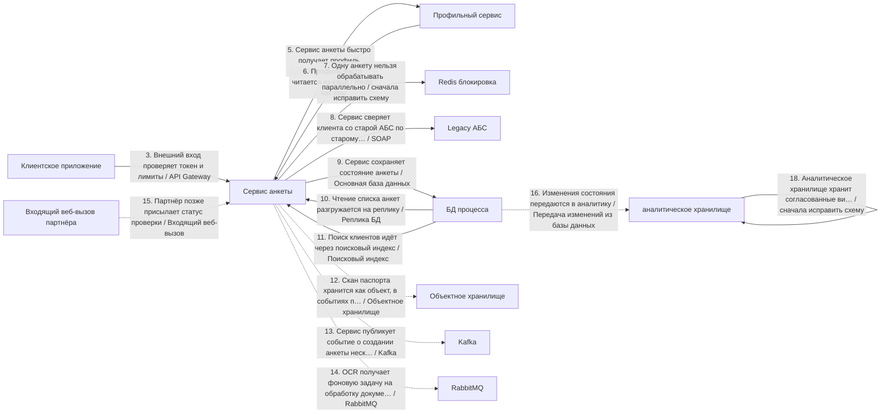
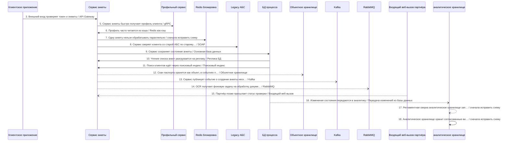
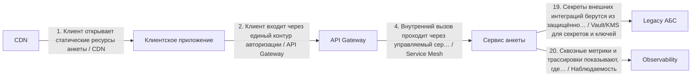

# Архитектурный разбор: Сложный кейс 1: цифровое открытие банковского продукта

## Короткий человеческий вывод

**Итог:** НЕ ГОТОВО: слишком много рисков. **Архитектурная готовность:** 0.0/10. **Готовность к промышленному запуску:** нельзя выпускать без закрытия блокеров.

**Полнота вводных:** 74%. **Надёжность рекомендаций:** средняя.

**Масштаб процесса:** 20 взаимодействий, из них 15 в основной цепочке и 5 сквозных контролей. Участников: 20.

**Бизнес-цель:** Клиент открывает продукт через приложение, процесс должен проверять старый контур, документы, статус партнёра и аналитику.
**Основная сущность:** ClientApplication. Деньги: да. Регуляторика: да. Клиентский сценарий: да.

**Как читать оценку:** низкая оценка не означает, что все выбранные технологии неправильные. Она означает, что до запуска есть блокеры: не закрыты гарантии доставки, восстановления, безопасности, сверки или эксплуатации.

## Что блокирует запуск

| Приоритет | Проблема | Где проявляется | Что сделать |
|---|---|---|---|
| Высокий | Замена legacy-системы описана без плана переключения. | Весь процесс | Используйте strangler-подход: параллельный прогон со сверкой старого и нового контура, поэтапное переключение трафика по процентам или сегментам, критерии переключения и план отката с сохранением данных, накопленных в новом контуре. |
| Высокий | Входящий веб-вызов должен проходить проверку подлинности. | Шаг 15 «Партнёр позже присылает статус проверки» | Проверяйте HMAC или подпись провайдера до любой бизнес-обработки; секрет храните в защищённом хранилище и предусмотрите его ротацию. |
| Высокий | В регуляторном процессе не описан аудиторский след. | Весь процесс | Ведите неизменяемый журнал операций с политикой срока хранения и сохраняйте evidence на каждый значимый переход статуса. |
| Высокий | В процессе есть слишком длинная синхронная цепочка: 10 блокирующих шага подряд. | Клиент открывает статические ресурсы анкеты → Клиент входит через единый контур авторизации → Внешний вход проверяет токен и лимиты → Внутренний вызов проходит через управляемый сервисный контур → Сервис анкеты быстро получает профиль клиента → Профиль часто читается из кэша → Одну анкету нельзя обрабатывать параллельно → Сервис сверяет клиента со старой АБС по старому контракту → Сервис сохраняет состояние анкеты → Поиск клиентов идёт через поисковый индекс | Разорвите цепочку: после первого подтверждённого шага переводите дальнейшую обработку в события или очередь, а клиенту возвращайте идентификатор отслеживания и понятную статусную модель процесса. |
| Высокий | Дочерний вызов может ждать дольше, чем родительский шаг. | 8 «Сервис сверяет клиента со старой АБС по старому контракту» (800мс) → 9 «Сервис сохраняет состояние анкеты» (800мс) | Таймауты должны строго убывать вниз по цепочке: дочерний таймаут должен быть меньше родительского с учётом сетевых накладных; общий бюджет времени распределяйте от целевого времени ответа сверху вниз. |
| Высокий | Повторы в синхронной цепочке усиливают друг друга. | «Клиент открывает статические ресурсы анкеты» → «Клиент входит через единый контур авторизации» → «Внешний вход проверяет токен и лимиты» → «Внутренний вызов проходит через управляемый сервисный контур» → «Сервис анкеты быстро получает профиль клиента» → «Профиль часто читается из кэша» → «Одну анкету нельзя обрабатывать параллельно» → «Сервис сверяет клиента со старой АБС по старому контракту» → «Сервис сохраняет состояние анкеты» → «Поиск клиентов идёт через поисковый индекс» | Задайте единый бюджет повторов на весь запрос (общий предельный срок ожидания), предохранитель внешнего вызова на каждом звене и экспоненциальная увеличением паузы между повторами со случайным разбросом; не повторяйте вызовы, которые уже не успеют уложиться в целевое время ответа. |
| Высокий | Высоконагруженный поток не имеет контролей приёма потока. | Пик 6000 RPS: «Сервис публикует событие о создании анкеты нескольким потребителям», «OCR получает фоновую задачу на обработку документа» | Используйте партиционирование по ключу и контроль горячих партиций; учитывайте время события и контрольную отметку загрузки с политикой обработки запоздалых событий; настройте обратное давление и алерты на лаг и пропускную способность. |
| Высокий | аналитическое хранилище или аналитика находятся в операционном основной поток. | Шаг 18 «Аналитическое хранилище хранит согласованные витрины» → аналитическое хранилище | Сделайте шаг non-blocking: используйте CDC, ETL или событие после фиксации результата в операционной системе. |
| Информация | Ещё 9 менее приоритетных замечаний | См. приложение с полным чек-листом | Разобрать после закрытия основных блокеров |

## Рекомендуемый порядок действий

1. Закрыть безопасность входящих вызовов: подпись, окно времени, защита от повторов и дедупликация.
2. Добавить сверку ожидаемых и фактических данных и процедуру восстановления расхождений.
3. Для асинхронных участков описать лимит повторов, очередь ошибок, владельца разбора и повторную обработку.
4. Разорвать длинные синхронные цепочки: вернуть идентификатор отслеживания и вынести хвост обработки в очередь или событие.
5. Пересчитать бюджет таймаутов сверху вниз: дочерний вызов должен завершаться раньше родительского.
6. Описать план перехода со старого контура: параллельный прогон, критерии переключения и откат.
7. Для высоконагруженного потока описать партиционирование, горячие ключи, обратное давление и алерты на лаг.
8. После исправлений повторить архитектурную проверку и зафиксировать принятые компромиссы в ADR.

## Проверка логики схемы

Перед подбором стека нужно исправить следующие противоречия в схеме:

- **Шаг 7 «Одну анкету нельзя обрабатывать параллельно»**: Источник и получатель совпадают. Скорее всего, потерян реальный участник связи.
- **Шаг 17 «Регламентная сверка аналитическое хранилище запускается пачкой по расписанию»**: Источник и получатель совпадают. Скорее всего, потерян реальный участник связи.
- **Шаг 18 «Аналитическое хранилище хранит согласованные витрины»**: Источник и получатель совпадают. Скорее всего, потерян реальный участник связи.

## Почему выбраны технологии и способы взаимодействия

### Объяснение по шагам

Решения ниже сгруппированы по смыслу. В основной цепочке показано, **кто с кем взаимодействует и каким способом**. Сквозные вещи — аудит, безопасность, авторизация, наблюдаемость, секреты — вынесены отдельно и не смешиваются с бизнес-потоком.

Для каждого решения указано: **Почему выбрано**, **Почему не другой вариант**, **Обязательные условия**, **Почему предлагается именно так** и **Почему нельзя просто не делать**.

### API и онлайн-взаимодействие

### Шаг 3. Внешний вход проверяет токен и лимиты

**Что:** шаг 3 — «Внешний вход проверяет токен и лимиты». Основной способ взаимодействия: API Gateway.
**Где:** связь идёт от «Клиентское приложение» к «Сервис анкеты». Исполнитель: «API Gateway». Выполняется после: сквозной контроль 2 «Клиент входит через единый контур авторизации».
**Почему:** Нужен как единая внешняя точка входа: авторизация, лимиты запросов, маршрутизация, версия API и защита периметра.
**Почему не другой вариант:** Прямой вызов внутреннего сервиса раскрывает внутреннюю структуру и размазывает безопасность по сервисам. Брокеры не являются публичным входом для клиентского API.
**Что проверить перед выпуском:** Нужны проверка токена, лимиты запросов, трассировка, единая модель ошибок и запрет обхода шлюза.

### Шаг 5. Сервис анкеты быстро получает профиль клиента

**Что:** шаг 5 — «Сервис анкеты быстро получает профиль клиента». Основной способ взаимодействия: gRPC.
**Где:** связь идёт от «Сервис анкеты» к «Профильный сервис». Исполнитель: «Профильный сервис». Выполняется после: сквозной контроль 4 «Внутренний вызов проходит через управляемый сервисный контур».
**Почему:** Подходит для быстрого внутреннего вызова между сервисами при стабильном контракте и требовании низкой задержки.
**Почему не другой вариант:** REST проще для внешних потребителей. Kafka/RabbitMQ не подходят, если вызывающий сервис должен получить ответ сразу.
**Что проверить перед выпуском:** Нужны общий срок ожидания, контракт Protobuf, совместимость версий, повторные попытки только для безопасных операций и обработка недоступности сервиса.

### Шаг 8. Сервис сверяет клиента со старой АБС по старому контракту

**Что:** шаг 8 — «Сервис сверяет клиента со старой АБС по старому контракту». Основной способ взаимодействия: SOAP.
**Где:** связь идёт от «Сервис анкеты» к «Legacy АБС». Исполнитель: «Сервис анкеты». Выполняется после: шаг 7 «Одну анкету нельзя обрабатывать параллельно».
**Почему:** Подходит для старых корпоративных систем, если уже есть WSDL/XSD-контракт, XML-сообщения и регламент обмена через SOAP.
**Почему не другой вариант:** REST/gRPC проще для новых API, но могут быть невозможны без доработки старой системы. Брокер сообщений не заменит существующий синхронный SOAP-вызов.
**Что проверить перед выпуском:** Нужны версии XSD, описание SOAP Fault, таймауты, логирование исходного XML, маскирование чувствительных данных и регламент повторов.

### Шаг 15. Партнёр позже присылает статус проверки

**Что:** шаг 15 — «Партнёр позже присылает статус проверки». Основной способ взаимодействия: Входящий веб-вызов.
**Где:** связь идёт от «Входящий веб-вызов партнёра» к «Сервис анкеты». Исполнитель: «API Gateway». Выполняется после: шаг 13 «Сервис публикует событие о создании анкеты нескольким потребителям».
**Почему:** Подходит, когда внешняя система сама присылает результат или статус в наш HTTP эндпоинт.
**Почему не другой вариант:** Kafka/RabbitMQ нельзя требовать от партнёра, если он работает через HTTP. Периодический опрос хуже, потому что создаёт лишнюю нагрузку и задержку.
**Служебные компоненты:** Для позднего входящего результата нужна таблица входящих сообщений: она защищает от дублей и повторной доставки. API Gateway используется как точка входа для входящего вызова: он проверяет периметр, лимиты, трассировку и маршрутизирует запрос во внутренний сервис.
**Что проверить перед выпуском:** Нужны подпись запроса, защита от повторов, окно времени, дедупликация и безопасное логирование без ПДн.

### Асинхронный обмен

### Шаг 13. Сервис публикует событие о создании анкеты нескольким потребителям

**Что:** шаг 13 — «Сервис публикует событие о создании анкеты нескольким потребителям». Основной способ взаимодействия: Kafka.
**Где:** связь идёт от «Сервис анкеты» к «Kafka». Исполнитель: «Сервис анкеты». Выполняется после: шаг 9 «Сервис сохраняет состояние анкеты».
**Почему:** Подходит для потока событий, высокой нагрузки, повторной обработки, хранения истории событий и рассылки нескольким потребителям.
**Почему не другой вариант:** REST не подходит, если потребителей несколько и результат не нужен немедленно. RabbitMQ проще для очереди задач, но хуже как долговременный журнал событий. Redis Streams легче, но обычно слабее для критичного журнал событий.
**Служебные компоненты:** Если перед публикацией меняется состояние в БД, нужна таблица исходящих сообщений: изменение состояния и подготовка сообщения должны быть атомарными. Нужна сверка полноты между источником и аналитическим контуром: количество записей, ключи, контрольные суммы и отчёт расхождений.
**Что проверить перед выпуском:** Нужны топик, ключ партиционирования, группа потребителей, срок хранения, очередь ошибок или карантин и инструкция повторной обработки.

### Шаг 14. OCR получает фоновую задачу на обработку документа

**Что:** шаг 14 — «OCR получает фоновую задачу на обработку документа». Основной способ взаимодействия: RabbitMQ.
**Где:** связь идёт от «Сервис анкеты» к «RabbitMQ». Исполнитель: «Сервис анкеты». Выполняется после: шаг 12 «Скан паспорта хранится как объект, в событиях передаётся ссылка».
**Почему:** Подходит для очереди задач, маршрутизации, подтверждения обработки, ограниченного числа обработчиков и сценариев очереди задач.
**Почему не другой вариант:** Kafka лучше для журнала событий, повторной обработки и большого числа независимых потребителей. REST не выравнивает нагрузку между обработчиками. очередь Redis проще, но слабее для критичных процессов.
**Что проверить перед выпуском:** Нужны exchange, ключ маршрутизации, очередь, подтверждение обработки, обменник очереди ошибок, предварительная выдача сообщений обработчику и лимит повторов.

### Данные и чтение

### Шаг 6. Профиль часто читается из кэша

**Что:** шаг 6 — «Профиль часто читается из кэша». Основной способ взаимодействия: Redis как кэш.
**Где:** связь идёт от «Профильный сервис» к «Сервис анкеты». Исполнитель: «Redis кэш». Выполняется после: шаг 5 «Сервис анкеты быстро получает профиль клиента».
**Почему:** Подходит для ускорения чтения часто используемых данных, если потеря кэша не разрушает бизнес-состояние.
**Почему не другой вариант:** БД остаётся источником истины. Kafka/RabbitMQ не ускоряют чтение текущего состояния. Redis lock нужен для блокировки, а не для чтения данных.
**Что проверить перед выпуском:** Нужны TTL, инвалидация, защита от лавины обращений к источнику и запасной сценарий чтения из БД/источника.

### Шаг 9. Сервис сохраняет состояние анкеты

**Что:** шаг 9 — «Сервис сохраняет состояние анкеты». Основной способ взаимодействия: Основная база данных.
**Где:** связь идёт от «Сервис анкеты» к «БД процесса». Исполнитель: «Сервис анкеты». Выполняется после: шаг 8 «Сервис сверяет клиента со старой АБС по старому контракту».
**Почему:** Подходит для фиксации состояния процесса, статусов, ключей идемпотентности, истории и технического журнала шагов.
**Почему не другой вариант:** Redis не должен быть источником истины. Kafka/RabbitMQ передают сообщения, но не заменяют надёжную операционную запись. Аналитическое хранилище не подходит для оперативной транзакции.
**Что проверить перед выпуском:** Нужны транзакции, уникальные индексы, версия записи или optimistic locking, сроки хранения и план очистки технических таблиц.

### Шаг 10. Чтение списка анкет разгружается на реплику

**Что:** шаг 10 — «Чтение списка анкет разгружается на реплику». Основной способ взаимодействия: Реплика БД.
**Где:** связь идёт от «БД процесса» к «Сервис анкеты». Исполнитель: «Реплика чтения». Выполняется после: шаг 9 «Сервис сохраняет состояние анкеты».
**Почему:** Подходит, если чтений много и нужно разгрузить основную БД без изменения модели записи.
**Почему не другой вариант:** Кэш быстрее, но может устаревать и требует инвалидации. Шардирование сложнее и нужно, когда уже не хватает разделения по нагрузке/объёму.
**Что проверить перед выпуском:** Нужны контроль задержки репликации, маршрутизация read-only запросов, запасной сценарий на основную БД и запрет операций записи в реплику.

### Шаг 11. Поиск клиентов идёт через поисковый индекс

**Что:** шаг 11 — «Поиск клиентов идёт через поисковый индекс». Основной способ взаимодействия: Поисковый индекс.
**Где:** связь идёт от «БД процесса» к «Сервис анкеты». Исполнитель: «Поисковый индекс». Выполняется после: шаг 9 «Сервис сохраняет состояние анкеты».
**Почему:** Подходит для полнотекстового поиска, фильтрации по многим полям и быстрых пользовательских выборок.
**Почему не другой вариант:** БД может быть источником истины, но не всегда удобна для полнотекстового поиска. Redis ускоряет чтение по ключу, но не заменяет поисковый индекс.
**Что проверить перед выпуском:** Нужны переиндексация, контроль отставания индекса, правила актуализации и понятная свежесть данных для пользователя.

### Аналитика и загрузки

### Шаг 16. Изменения состояния передаются в аналитику

**Что:** шаг 16 — «Изменения состояния передаются в аналитику». Основной способ взаимодействия: Передача изменений из базы данных.
**Где:** связь идёт от «БД процесса» к «аналитическое хранилище». Исполнитель: «аналитическое хранилище». Выполняется после: шаг 9 «Сервис сохраняет состояние анкеты».
**Почему:** Подходит, когда данные уже зафиксированы в операционной БД и их нужно передавать в аналитический контур без замедления основного процесса.
**Почему не другой вариант:** Прямая запись в аналитическое хранилище из бизнес-сервиса связывает операционный процесс с аналитикой. Batch проще, но даёт большую задержку. Событие из приложения требует строгой дисциплины таблицы исходящих сообщений.
**Служебные компоненты:** Нужна сверка полноты между источником и аналитическим контуром: количество записей, ключи, контрольные суммы и отчёт расхождений.
**Что проверить перед выпуском:** Нужны контроль позиции чтения, контроль отставания, совместимость схем, повторная синхронизация и сверка полноты.

### Файлы и доставка контента

### Шаг 12. Скан паспорта хранится как объект, в событиях передаётся ссылка

**Что:** шаг 12 — «Скан паспорта хранится как объект, в событиях передаётся ссылка». Основной способ взаимодействия: Объектное хранилище.
**Где:** связь идёт от «Сервис анкеты» к «Объектное хранилище». Исполнитель: «Сервис анкеты». Выполняется после: шаг 9 «Сервис сохраняет состояние анкеты».
**Почему:** Подходит для хранения больших файлов, документов, сканов и вложений, когда в сообщениях нужно передавать только ссылку.
**Почему не другой вариант:** БД не стоит нагружать большими бинарными файлами. Kafka/RabbitMQ не должны переносить тяжёлые документы. File/SFTP могут быть транспортом, но не обязательно удобным хранилищем.
**Что проверить перед выпуском:** Нужны права доступа, срок хранения, шифрование, антивирусная проверка и запрет публичных ссылок без срока действия.

### Прочее

### Шаг 7. Одну анкету нельзя обрабатывать параллельно

**Что:** шаг 7 — «Одну анкету нельзя обрабатывать параллельно». Основной способ взаимодействия: сначала исправить схему.
**Где:** связь идёт от «Сервис анкеты» к «Сервис анкеты». Исполнитель: «Redis блокировка». Выполняется после: шаг 6 «Профиль часто читается из кэша».
**Почему:** Источник и получатель совпадают. Скорее всего, потерян реальный участник связи.
**Почему не другой вариант:** Выбор gRPC, REST, брокера или БД поверх некорректной связи создаст ложное ощущение готовой архитектуры.
**Что проверить перед выпуском:** Верните шаг на этап проектирования связей, исправьте источник, получателя и смысл действия, затем повторно запустите проверку и подбор стека.

### Шаг 17. Регламентная сверка аналитическое хранилище запускается пачкой по расписанию

**Что:** шаг 17 — «Регламентная сверка аналитическое хранилище запускается пачкой по расписанию». Основной способ взаимодействия: сначала исправить схему.
**Где:** связь идёт от «аналитическое хранилище» к «аналитическое хранилище». Исполнитель: «аналитическое хранилище». Выполняется после: шаг 16 «Изменения состояния передаются в аналитику».
**Почему:** Источник и получатель совпадают. Скорее всего, потерян реальный участник связи.
**Почему не другой вариант:** Выбор gRPC, REST, брокера или БД поверх некорректной связи создаст ложное ощущение готовой архитектуры.
**Что проверить перед выпуском:** Верните шаг на этап проектирования связей, исправьте источник, получателя и смысл действия, затем повторно запустите проверку и подбор стека.

### Шаг 18. Аналитическое хранилище хранит согласованные витрины

**Что:** шаг 18 — «Аналитическое хранилище хранит согласованные витрины». Основной способ взаимодействия: сначала исправить схему.
**Где:** связь идёт от «аналитическое хранилище» к «аналитическое хранилище». Исполнитель: «аналитическое хранилище». Выполняется после: шаг 17 «Регламентная сверка аналитическое хранилище запускается пачкой по расписанию».
**Почему:** Источник и получатель совпадают. Скорее всего, потерян реальный участник связи.
**Почему не другой вариант:** Выбор gRPC, REST, брокера или БД поверх некорректной связи создаст ложное ощущение готовой архитектуры.
**Что проверить перед выпуском:** Верните шаг на этап проектирования связей, исправьте источник, получателя и смысл действия, затем повторно запустите проверку и подбор стека.

## Сквозные контроли и служебные компоненты

Эти элементы не являются отдельными бизнес-шагами. Они применяются к процессу как контроль безопасности, эксплуатации, аудита или инфраструктуры.

### Контроль 1. Клиент открывает статические ресурсы анкеты

**Назначение:** CDN.
**Где применяется:** «CDN» → «Клиентское приложение» или ко всему процессу.
**Зачем нужен:** Подходит для быстрой раздачи статических файлов или публичных/полупубличных вложений пользователям в разных регионах.
**Что проверить:** Нужны правила кэширования, очистка кэша, срок жизни ссылки, приватный доступ, защита от утечки и стратегия обновления файлов.

### Контроль 2. Клиент входит через единый контур авторизации

**Назначение:** API Gateway.
**Где применяется:** «Клиентское приложение» → «API Gateway» или ко всему процессу.
**Зачем нужен:** Нужен как единая внешняя точка входа: авторизация, лимиты запросов, маршрутизация, версия API и защита периметра.
**Что проверить:** Нужны проверка токена, лимиты запросов, трассировка, единая модель ошибок и запрет обхода шлюза.

### Контроль 4. Внутренний вызов проходит через управляемый сервисный контур

**Назначение:** Service Mesh.
**Где применяется:** «API Gateway» → «Сервис анкеты» или ко всему процессу.
**Зачем нужен:** Подходит для управления внутренними вызовами: взаимная TLS-аутентификация, политики трафика, ретраи, трассировка и постепенное переключение версий.
**Что проверить:** Нужны владельцы mesh-политик, лимиты повторных попыток, mTLS, наблюдаемость, правила пробного включения на малой доле/разделение трафика и план аварийного обхода.

### Контроль 19. Секреты внешних интеграций берутся из защищённого хранилища

**Назначение:** Vault/KMS для секретов и ключей.
**Где применяется:** «Сервис анкеты» → «Legacy АБС» или ко всему процессу.
**Зачем нужен:** Подходит, когда нужно безопасно хранить пароли, ключи подписи, сертификаты и секреты интеграций.
**Что проверить:** Нужны политики доступа, ротация ключей, аудит чтения секретов, шифрование, разграничение окружений и аварийные процедуры.

### Контроль 20. Сквозные метрики и трассировки показывают, где зависла анкета

**Назначение:** Наблюдаемость.
**Где применяется:** «Сервис анкеты» → «Observability» или ко всему процессу.
**Зачем нужен:** Подходит, чтобы видеть, где завис процесс: метрики, логи, трассировки, алерты и бизнес-события по состояниям.
**Что проверить:** Нужны идентификатор сквозной связи, метрики задержки и ошибок, трассировка, алерты по очередям/лагу/ошибкам, дашборды и инструкции разбора.

## Контрольные проверки готовности к промышленному запуску

| Область | Статус | Что важно |
|---|---|---|
| Контракт | Блокирует выпуск | Каждое событие содержит стандартную обёртку события. |
| Надёжность | Требует проверки | Для асинхронной обработки задан лимит попыток и очередь ошибок или карантин. |
| Целостность данных | Блокирует выпуск | При записи в БД и публикации события используется таблица исходящих сообщений. |
| Наблюдаемость | Проходит | Явных проблем не найдено. |
| Безопасность | Блокирует выпуск | Входящий веб-вызов или обратный вызов проходит проверку подписи. |
| Производительность | Требует проверки | Для нагрузки описаны пропускная способность, обратное давление и отставание потребителей. |
| Эксплуатация и внедрение | Проходит | Явных проблем не найдено. |

## Какие вводные нужно уточнить

| Приоритет | Область | Что уточнить | Почему важно |
|---|---|---|---|
| high | Надёжность | Куда попадает сообщение после исчерпания попыток? | Без очередь ошибок/карантина poison message может потеряться или бесконечно крутиться. |
| medium | Эксплуатация | Какой срок хранения у топиков, таблиц исходящих и входящих сообщений и журналов? | Без политики хранения растёт стоимость и ухудшается восстановление/аудит. |
| medium | целевое время ответа | Какой целевое время ответа и таймаут для пользовательского или системного ответа? | Без целевое время ответа невозможно распределить бюджет таймаутов и понять, где нужна async-граница. |
| Информация | Владение | Кто владельцы систем, контрактов и алертов? | Без владельцев неясны ответственность и эскалация. |

## Краткая сводка по стеку

| Технология / способ | Где применяется |
|---|---:|
| сначала исправить схему | 3 |
| API Gateway | 1 |
| gRPC | 1 |
| Kafka | 1 |
| RabbitMQ | 1 |
| Redis как кэш | 1 |
| SOAP | 1 |
| Входящий веб-вызов | 1 |
| Объектное хранилище | 1 |
| Основная база данных | 1 |
| Передача изменений из базы данных | 1 |
| Поисковый индекс | 1 |
| Реплика БД | 1 |

<details>
<summary>Приложение A. Полная таблица по всем шагам</summary>

| Шаг | Связь | Основной способ | Что проверить |
|---|---|---|---|
| 3. Внешний вход проверяет токен и лимиты | Клиентское приложение → Сервис анкеты. Исполнитель: API Gateway | API Gateway | Нужны проверка токена, лимиты запросов, трассировка, единая модель ошибок и запрет обхода шлюза. |
| 5. Сервис анкеты быстро получает профиль клиента | Сервис анкеты → Профильный сервис. Исполнитель: Профильный сервис | gRPC | Нужны общий срок ожидания, контракт Protobuf, совместимость версий, повторные попытки только для безопасных операций и обработка недоступности сервиса. |
| 6. Профиль часто читается из кэша | Профильный сервис → Сервис анкеты. Исполнитель: Redis кэш | Redis как кэш | Нужны TTL, инвалидация, защита от лавины обращений к источнику и запасной сценарий чтения из БД/источника. |
| 7. Одну анкету нельзя обрабатывать параллельно | Сервис анкеты → Сервис анкеты. Исполнитель: Redis блокировка | сначала исправить схему | Верните шаг на этап проектирования связей, исправьте источник, получателя и смысл действия, затем повторно запустите проверку и подбор стека. |
| 8. Сервис сверяет клиента со старой АБС по старому контракту | Сервис анкеты → Legacy АБС. Исполнитель: Сервис анкеты | SOAP | Нужны версии XSD, описание SOAP Fault, таймауты, логирование исходного XML, маскирование чувствительных данных и регламент повторов. |
| 9. Сервис сохраняет состояние анкеты | Сервис анкеты → БД процесса. Исполнитель: Сервис анкеты | Основная база данных | Нужны транзакции, уникальные индексы, версия записи или optimistic locking, сроки хранения и план очистки технических таблиц. |
| 10. Чтение списка анкет разгружается на реплику | БД процесса → Сервис анкеты. Исполнитель: Реплика чтения | Реплика БД | Нужны контроль задержки репликации, маршрутизация read-only запросов, запасной сценарий на основную БД и запрет операций записи в реплику. |
| 11. Поиск клиентов идёт через поисковый индекс | БД процесса → Сервис анкеты. Исполнитель: Поисковый индекс | Поисковый индекс | Нужны переиндексация, контроль отставания индекса, правила актуализации и понятная свежесть данных для пользователя. |
| 12. Скан паспорта хранится как объект, в событиях передаётся ссылка | Сервис анкеты → Объектное хранилище. Исполнитель: Сервис анкеты | Объектное хранилище | Нужны права доступа, срок хранения, шифрование, антивирусная проверка и запрет публичных ссылок без срока действия. |
| 13. Сервис публикует событие о создании анкеты нескольким потребителям | Сервис анкеты → Kafka. Исполнитель: Сервис анкеты | Kafka | Нужны топик, ключ партиционирования, группа потребителей, срок хранения, очередь ошибок или карантин и инструкция повторной обработки. |
| 14. OCR получает фоновую задачу на обработку документа | Сервис анкеты → RabbitMQ. Исполнитель: Сервис анкеты | RabbitMQ | Нужны exchange, ключ маршрутизации, очередь, подтверждение обработки, обменник очереди ошибок, предварительная выдача сообщений обработчику и лимит повторов. |
| 15. Партнёр позже присылает статус проверки | Входящий веб-вызов партнёра → Сервис анкеты. Исполнитель: API Gateway | Входящий веб-вызов | Нужны подпись запроса, защита от повторов, окно времени, дедупликация и безопасное логирование без ПДн. |
| 16. Изменения состояния передаются в аналитику | БД процесса → аналитическое хранилище. Исполнитель: аналитическое хранилище | Передача изменений из базы данных | Нужны контроль позиции чтения, контроль отставания, совместимость схем, повторная синхронизация и сверка полноты. |
| 17. Регламентная сверка аналитическое хранилище запускается пачкой по расписанию | аналитическое хранилище → аналитическое хранилище. Исполнитель: аналитическое хранилище | сначала исправить схему | Верните шаг на этап проектирования связей, исправьте источник, получателя и смысл действия, затем повторно запустите проверку и подбор стека. |
| 18. Аналитическое хранилище хранит согласованные витрины | аналитическое хранилище → аналитическое хранилище. Исполнитель: аналитическое хранилище | сначала исправить схему | Верните шаг на этап проектирования связей, исправьте источник, получателя и смысл действия, затем повторно запустите проверку и подбор стека. |

</details>

<details>
<summary>Приложение B. Найденные риски и слабые места</summary>

## Найденные риски и слабые места

### Высокий риск

#### Замена legacy-системы описана без плана переключения.

**Что:** найден риск «Замена legacy-системы описана без плана переключения.». затронуто мест: 1.
**Затронутые места:** Весь процесс.
**Почему это важно:** Миграция — это не просто «включили новое»: без параллельного прогона и плана отката первый серьёзный дефект нового контура может остановить бизнес.
**Что нужно сделать:** Используйте strangler-подход: параллельный прогон со сверкой старого и нового контура, поэтапное переключение трафика по процентам или сегментам, критерии переключения и план отката с сохранением данных, накопленных в новом контуре.

#### Входящий веб-вызов должен проходить проверку подлинности.

**Что:** найден риск «Входящий веб-вызов должен проходить проверку подлинности.». затронуто мест: 1.
**Затронутые места:** Шаг 15 «Партнёр позже присылает статус проверки».
**Почему это важно:** Входящий веб-вызов является публичной точкой входа: без проверки подписи любой внешний отправитель может подделать бизнес-событие обычным POST-запросом.
**Что нужно сделать:** Проверяйте HMAC или подпись провайдера до любой бизнес-обработки; секрет храните в защищённом хранилище и предусмотрите его ротацию.

#### В регуляторном процессе не описан аудиторский след.

**Что:** найден риск «В регуляторном процессе не описан аудиторский след.». затронуто мест: 1.
**Затронутые места:** Весь процесс.
**Почему это важно:** Юридически значимые шаги требуют доказуемой истории: кто, что, когда и на каком основании выполнил.
**Что нужно сделать:** Ведите неизменяемый журнал операций с политикой срока хранения и сохраняйте evidence на каждый значимый переход статуса.

#### В процессе есть слишком длинная синхронная цепочка: 10 блокирующих шага подряд.

**Что:** найден риск «В процессе есть слишком длинная синхронная цепочка: 10 блокирующих шага подряд.». затронуто мест: 1.
**Затронутые места:** Клиент открывает статические ресурсы анкеты → Клиент входит через единый контур авторизации → Внешний вход проверяет токен и лимиты → Внутренний вызов проходит через управляемый сервисный контур → Сервис анкеты быстро получает профиль клиента → Профиль часто читается из кэша → Одну анкету нельзя обрабатывать параллельно → Сервис сверяет клиента со старой АБС по старому контракту → Сервис сохраняет состояние анкеты → Поиск клиентов идёт через поисковый индекс.
**Почему это важно:** Каждое синхронное звено увеличивает вероятность отказа и добавляет задержку к общему времени ответа; если откажет любое звено, весь пользовательский или системный запрос завершится ошибкой.
**Что нужно сделать:** Разорвите цепочку: после первого подтверждённого шага переводите дальнейшую обработку в события или очередь, а клиенту возвращайте идентификатор отслеживания и понятную статусную модель процесса.

#### Дочерний вызов может ждать дольше, чем родительский шаг.

**Что:** найден риск «Дочерний вызов может ждать дольше, чем родительский шаг.». затронуто мест: 1.
**Затронутые места:** 8 «Сервис сверяет клиента со старой АБС по старому контракту» (800мс) → 9 «Сервис сохраняет состояние анкеты» (800мс).
**Почему это важно:** Родительский шаг завершится по таймауту раньше, чем ответит дочерний вызов; в результате выполненная работа будет потрачена впустую, а запись может «осиротеть»: она есть в БД дочерней системы, но родитель уже считает операцию отказавшей.
**Что нужно сделать:** Таймауты должны строго убывать вниз по цепочке: дочерний таймаут должен быть меньше родительского с учётом сетевых накладных; общий бюджет времени распределяйте от целевого времени ответа сверху вниз.

#### Повторы в синхронной цепочке усиливают друг друга.

**Что:** найден риск «Повторы в синхронной цепочке усиливают друг друга.». затронуто мест: 1.
**Затронутые места:** «Клиент открывает статические ресурсы анкеты» → «Клиент входит через единый контур авторизации» → «Внешний вход проверяет токен и лимиты» → «Внутренний вызов проходит через управляемый сервисный контур» → «Сервис анкеты быстро получает профиль клиента» → «Профиль часто читается из кэша» → «Одну анкету нельзя обрабатывать параллельно» → «Сервис сверяет клиента со старой АБС по старому контракту» → «Сервис сохраняет состояние анкеты» → «Поиск клиентов идёт через поисковый индекс».
**Почему это важно:** Несколько звеньев с автоматическими повторами друг за другом перемножают количество попыток (N×M×…): при деградации это создаёт шторм повторных попыток и лавинообразный рост нагрузки в самый плохой момент.
**Что нужно сделать:** Задайте единый бюджет повторов на весь запрос (общий предельный срок ожидания), предохранитель внешнего вызова на каждом звене и экспоненциальная увеличением паузы между повторами со случайным разбросом; не повторяйте вызовы, которые уже не успеют уложиться в целевое время ответа.

#### Высоконагруженный поток не имеет контролей приёма потока.

**Что:** найден риск «Высоконагруженный поток не имеет контролей приёма потока.». затронуто мест: 1.
**Затронутые места:** Пик 6000 RPS: «Сервис публикует событие о создании анкеты нескольким потребителям», «OCR получает фоновую задачу на обработку документа».
**Почему это важно:** На таком потоке неизбежны out-of-order события, опоздавшие события, горячие партиции и всплески нагрузки, которые потребитель может не обработать вовремя.
**Что нужно сделать:** Используйте партиционирование по ключу и контроль горячих партиций; учитывайте время события и контрольную отметку загрузки с политикой обработки запоздалых событий; настройте обратное давление и алерты на лаг и пропускную способность.

#### аналитическое хранилище или аналитика находятся в операционном основной поток.

**Что:** найден риск «аналитическое хранилище или аналитика находятся в операционном основной поток.». затронуто мест: 1.
**Затронутые места:** Шаг 18 «Аналитическое хранилище хранит согласованные витрины» → аналитическое хранилище.
**Почему это важно:** Аналитическое хранилище обычно не обеспечивает операционный целевое время ответа: его деградация не должна останавливать основной бизнес-процесс.
**Что нужно сделать:** Сделайте шаг non-blocking: используйте CDC, ETL или событие после фиксации результата в операционной системе.

#### Система одновременно пишет в БД и публикует событие без таблицы исходящих сообщений.

**Что:** найден риск «Система одновременно пишет в БД и публикует событие без таблицы исходящих сообщений.». затронуто мест: 1.
**Затронутые места:** Сервис анкеты: «Сервис публикует событие о создании анкеты нескольким потребителям», «OCR получает фоновую задачу на обработку документа».
**Почему это важно:** Запись в БД и публикация события являются двумя несвязанными операциями: при сбое между ними событие может потеряться или, наоборот, появиться без записи в БД.
**Что нужно сделать:** Используйте транзакционную таблицу исходящих сообщений: событие записывается в той же транзакции, что и агрегат, а отдельный публикатор читает таблицу исходящих сообщений и публикует событие с повторными попытками.

### Средний риск

#### Событие не содержит обязательную обёртку события.

**Что:** найден риск «Событие не содержит обязательную обёртку события.». затронуто мест: 1.
**Затронутые места:** «Сервис публикует событие о создании анкеты нескольким потребителям», «OCR получает фоновую задачу на обработку документа».
**Почему это важно:** Событие можно доставить, но его сложно дедуплицировать, трассировать, версионировать и восстанавливать после инцидента: не хватает типа события, версии события и времени возникновения события, идентификатор агрегата.
**Что нужно сделать:** Зафиксируйте единую обёртку события: идентификатор события, тип события, версия события, идентификатор агрегата или entityId, сквозной идентификатор или идентификатор трассировки, время возникновения события, производитель события и тело сообщения.

#### Дочерний вызов может ждать дольше, чем родительский шаг.

**Что:** найден риск «Дочерний вызов может ждать дольше, чем родительский шаг.». затронуто мест: 10.
**Затронутые места:** Затронуто мест: 10.
**Почему это важно:** Родительский шаг завершится по таймауту раньше, чем ответит дочерний вызов; в результате выполненная работа будет потрачена впустую.
**Что нужно сделать:** Таймауты должны строго убывать вниз по цепочке: дочерний таймаут должен быть меньше родительского с учётом сетевых накладных; общий бюджет времени распределяйте от целевого времени ответа сверху вниз.

#### Для CDC-потока не описаны обязательные контроли.

**Что:** найден риск «Для CDC-потока не описаны обязательные контроли.». затронуто мест: 1.
**Затронутые места:** Шаг 16 «Изменения состояния передаются в аналитику» (аналитическое хранилище).
**Почему это важно:** CDC может незаметно сломаться на пропусках позиций, удалениях и эволюции схемы источника, из-за чего проекция тихо расходится с источником истины.
**Что нужно сделать:** Используйте LSN или контрольную отметку загрузки с контролем пропусков (gap detection); добавьте обработку delete-событий, политику эволюции схемы, идемпотентную проекцию, регулярную сверку и повторная обработка за выбранный период.

#### Для порядка событий в рамках сущности не задан ключ партиционирования.

**Что:** найден риск «Для порядка событий в рамках сущности не задан ключ партиционирования.». затронуто мест: 1.
**Затронутые места:** «Сервис публикует событие о создании анкеты нескольким потребителям», «OCR получает фоновую задачу на обработку документа».
**Почему это важно:** Без ключ партиционирования события одной сущности могут разойтись по разным партициям и быть обработаны в неправильном порядке.
**Что нужно сделать:** Партиционируйте события по entityId и явно укажите этот ключ во входных данных шага.

### Информация

#### Концентрация критического пути в одной системе

**Что:** найден риск «Концентрация критического пути в одной системе». затронуто мест: 1.
**Затронутые места:** Сервис анкеты: 2 блокирующих шага.
**Почему это важно:** Система — единая точка отказа сценария.
**Что нужно сделать:** Проверить её HA/DR-план; рассмотреть деградацию сценария при её отказе.

#### Для клиентского API не зафиксирована модель ошибок.

**Что:** найден риск «Для клиентского API не зафиксирована модель ошибок.». затронуто мест: 1.
**Затронутые места:** «Сервис анкеты быстро получает профиль клиента», «Сервис сверяет клиента со старой АБС по старому контракту».
**Почему это важно:** Без контракта ошибок фронт, клиент и поддержка будут по-разному трактовать отказы, таймаут, дубли и промежуточные состояния.
**Что нужно сделать:** Опишите errorCode, userMessage, technicalMessage для логов, повторяемые, идентификатор сквозной связи, сопоставление 4xx/5xx/gRPC status и примеры ошибок.

#### Для критичной системы не указан владелец.

**Что:** найден риск «Для критичной системы не указан владелец.». затронуто мест: 13.
**Затронутые места:** Затронуто мест: 13.
**Почему это важно:** При инциденте будет непонятно, кто отвечает за целевое время ответа, контракт, лимиты, повторная обработка и согласование изменений.
**Что нужно сделать:** Зафиксируйте владельца системы или команды, канал поддержки, SLO и порядок эскалации.

#### Для служебных таблиц не описана политика роста и очистки.

**Что:** найден риск «Для служебных таблиц не описана политика роста и очистки.». затронуто мест: 1.
**Затронутые места:** таблица исходящих сообщений, Inbox, журнал проводок и журнал шагов.
**Почему это важно:** Эти таблицы пополняются на каждое событие; без архивации и партиционирования они со временем ухудшат latency запросов и существенно раздуют БД.
**Что нужно сделать:** Добавьте партиционирование по времени, архивацию или перенос в холодное хранилище, а также очистку опубликованных записей таблицы исходящих сообщений; контролируйте размер таблиц и время запросов к ним.


</details>

<details>
<summary>Приложение C. Сценарная основа для дальнейшей разработки</summary>

## Сценарная основа для дальнейшей разработки

Этот раздел нужен не для выбора технологий, а для постановки на разработку и тестирование: какой поток считается успешным, какие есть альтернативы, что происходит при ошибках и как проверять готовность.

### Важное замечание по сценарию

Текущая схема похожа не на один линейный happy path, а на карту множества интеграционных возможностей. Поэтому отчёт не строит искусственный сценарий из всех шагов подряд. Сначала нужно выбрать конкретный бизнес-поток, а ниже использовать сценарные блоки как основу для детализации.

### Сценарные блоки по типам взаимодействий

| Блок | Что входит | Ожидаемый результат | Что обязательно проверить |
|---|---|---|---|
| API и онлайн-взаимодействие | шаг 3: Клиентское приложение → Сервис анкеты — Внешний вход проверяет токен и лимиты (API Gateway); шаг 5: Сервис анкеты → Профильный сервис — Сервис анкеты быстро получает профиль клиента (gRPC); шаг 8: Сервис анкеты → Legacy АБС — Сервис сверяет клиента со старой АБС по старому контракту (SOAP); ещё 1 | входящий или внутренний запрос получает быстрый ответ либо идентификатор отслеживания для дальнейшего отслеживания | Нужны проверка токена, лимиты запросов, трассировка, единая модель ошибок и запрет обхода шлюза; Нужны общий срок ожидания, контракт Protobuf, совместимость версий, повторные попытки только для безопасных операций и обработка недоступности сервиса; ещё 2 |
| Асинхронный обмен | шаг 13: Сервис анкеты → Kafka — Сервис публикует событие о создании анкеты нескольким потребителям (Kafka); шаг 14: Сервис анкеты → RabbitMQ — OCR получает фоновую задачу на обработку документа (RabbitMQ) | нагрузка выровнена через брокер, сообщение не теряется, есть повторная обработка и очередь ошибок | Нужны топик, ключ партиционирования, группа потребителей, срок хранения, очередь ошибок или карантин и инструкция повторной обработки; Нужны exchange, ключ маршрутизации, очередь, подтверждение обработки, обменник очереди ошибок, предварительная выдача сообщений обработчику и лимит повторов |
| Данные и чтение | шаг 6: Профильный сервис → Сервис анкеты — Профиль часто читается из кэша (Redis как кэш); шаг 9: Сервис анкеты → БД процесса — Сервис сохраняет состояние анкеты (Основная база данных); шаг 10: БД процесса → Сервис анкеты — Чтение списка анкет разгружается на реплику (Реплика БД); ещё 1 | основная сущность, справочники или проекции сохранены без дублей и потерянных обновлений | Нужны TTL, инвалидация, защита от лавины обращений к источнику и запасной сценарий чтения из БД/источника; Нужны транзакции, уникальные индексы, версия записи или optimistic locking, сроки хранения и план очистки технических таблиц; ещё 2 |
| Аналитика и загрузки | шаг 16: БД процесса → аналитическое хранилище — Изменения состояния передаются в аналитику (Передача изменений из базы данных) | данные попадают в аналитический контур с контролем полноты и возможностью сверки | Нужны контроль позиции чтения, контроль отставания, совместимость схем, повторная синхронизация и сверка полноты |
| Файлы и доставка контента | шаг 12: Сервис анкеты → Объектное хранилище — Скан паспорта хранится как объект, в событиях передаётся ссылка (Объектное хранилище) | файлы, документы и статический контент передаются с контролем доступа, размера и целостности | Нужны права доступа, срок хранения, шифрование, антивирусная проверка и запрет публичных ссылок без срока действия |
| Прочее | шаг 7: Сервис анкеты → Сервис анкеты — Одну анкету нельзя обрабатывать параллельно (сначала исправить схему); шаг 17: аналитическое хранилище → аналитическое хранилище — Регламентная сверка аналитическое хранилище запускается пачкой по расписанию (сначала исправить схему); шаг 18: аналитическое хранилище → аналитическое хранилище — Аналитическое хранилище хранит согласованные витрины (сначала исправить схему) | дополнительные взаимодействия описаны отдельно и требуют ручного уточнения владельцев и результата | Верните шаг на этап проектирования связей, исправьте источник, получателя и смысл действия, затем повторно запустите проверку и подбор стека; Верните шаг на этап проектирования связей, исправьте источник, получателя и смысл действия, затем повторно запустите проверку и подбор стека; ещё 1 |

### Сквозные сценарии контроля

| Контроль | Где применяется | Ожидаемый результат |
|---|---|---|
| Клиент открывает статические ресурсы анкеты | CDN → Клиентское приложение или весь процесс | контроль работает сквозно и не меняет порядок бизнес-шагов |
| Клиент входит через единый контур авторизации | Клиентское приложение → API Gateway или весь процесс | контроль работает сквозно и не меняет порядок бизнес-шагов |
| Внутренний вызов проходит через управляемый сервисный контур | API Gateway → Сервис анкеты или весь процесс | контроль работает сквозно и не меняет порядок бизнес-шагов |
| Секреты внешних интеграций берутся из защищённого хранилища | Сервис анкеты → Legacy АБС или весь процесс | контроль работает сквозно и не меняет порядок бизнес-шагов |
| Сквозные метрики и трассировки показывают, где зависла анкета | Сервис анкеты → Observability или весь процесс | контроль работает сквозно и не меняет порядок бизнес-шагов |

### Альтернативные сценарии

#### Асинхронное принятие заявки без ожидания финального результата

**Когда возникает:** Хвост процесса занимает больше допустимого времени ответа или зависит от внешних систем.
**Как должен пройти сценарий:**
1. Система принимает запрос и создаёт идентификатор отслеживания.
2. Клиенту или вызывающей системе возвращается подтверждение приёма.
3. Дальнейшая обработка идёт через событие/очередь.
4. Статус процесса обновляется после каждого значимого шага.
**Ожидаемый результат:** Пользователь или потребитель видит промежуточный статус, а не зависший запрос.
**Обязательные проверки:** идентификатор отслеживания обязателен; GET /status или событие статуса; финальные статусы должны быть согласованы.

#### Повторная доставка или повторный запрос

**Когда возникает:** Сеть оборвалась, производитель события отправил событие повторно или потребитель переобработал сообщение.
**Как должен пройти сценарий:**
1. Система получает тот же ключ идемпотентности/идентификатор события/бизнес-ключ.
2. Выполняется попытка вставки ключа в таблицу входящих сообщений для защиты от дублей или поиск существующей операции.
3. Если ключ уже обработан, система возвращает прежний результат без повторного изменения бизнес-состояния.
**Ожидаемый результат:** Повтор не создаёт дубль операции, документа, проводки или статуса.
**Обязательные проверки:** UNIQUE-индекс на ключ идемпотентности; фиксация позиции чтения только после успешной обработки; тест дубля обязателен.

#### Ошибка обработки сообщения

**Когда возникает:** потребитель события получил сообщение, но бизнес-обработка завершилась ошибкой.
**Как должен пройти сценарий:**
1. потребитель события выполняет ограниченные повторные попытки с увеличением паузы между повторами.
2. После исчерпания попыток сообщение попадает в очередь ошибок или карантин.
3. Создаётся алерт и задача на разбор.
4. После исправления причины выполняется повторная обработка.
**Ожидаемый результат:** Сообщение не теряется и не крутится бесконечно.
**Обязательные проверки:** максимальное число попыток; очередь ошибок/карантин; инструкция повторной обработки; идемпотентность повторной обработки.

#### Расхождение данных между источником истины и потребителем

**Когда возникает:** Техническая доставка прошла не полностью, повторная обработка была пропущена или потребитель отстал.
**Как должен пройти сценарий:**
1. Регламентная сверка сравнивает ожидаемые и фактические состояния.
2. Найденные расхождения попадают в отчёт.
3. Безопасные расхождения восстанавливаются автоматически.
4. Опасные расхождения уходят на ручной разбор.
**Ожидаемый результат:** Бизнес видит не только техническую доставку, но и фактическую полноту процесса.
**Обязательные проверки:** регулярная сверка; отчёт расхождений; владелец ручного разбора; аудит исправлений.

#### Поздний результат от внешней системы

**Когда возникает:** Партнёр завершает обработку после исходного запроса и присылает статус отдельно.
**Как должен пройти сценарий:**
1. принять входящий вызов.
2. проверить подпись и окно времени.
3. найти исходную операцию.
4. проверить событие на дубль.
5. обновить статус.
**Ожидаемый результат:** поздний результат применён один раз и связан с исходным процессом.
**Обязательные проверки:** подпись запроса; providerEventId + providerCode; Inbox; история статусов.

#### Асинхронная обработка без ожидания финального результата

**Когда возникает:** Часть процесса длится дольше допустимого времени ответа или зависит от очереди/брокера.
**Как должен пройти сценарий:**
1. создать идентификатор отслеживания.
2. зафиксировать статус PROCESSING.
3. передать сообщение в брокер.
4. обновлять статус по мере обработки.
**Ожидаемый результат:** вызывающая сторона не висит в ожидании, а видит отслеживаемый статус.
**Обязательные проверки:** ключ идемпотентности; очередь ошибок; повторная обработка; метрики отставания.

#### Повторная загрузка или сверка аналитических данных

**Когда возникает:** Найдены расхождения между источником и аналитическим контуром либо загрузка завершилась частично.
**Как должен пройти сценарий:**
1. сравнить ожидаемые и фактические данные.
2. выделить расхождения.
3. безопасно перезапустить период или идентификатор пакета.
4. зафиксировать результат сверки.
**Ожидаемый результат:** аналитический контур восстановлен без повторного применения уже обработанных данных.
**Обязательные проверки:** идентификатор пакета; контрольные суммы; журнал загрузки; отчёт расхождений.

### Ошибочные сценарии и восстановление

| Ошибка | Где возникает | Как система должна восстановиться |
|---|---|---|
| аналитическое хранилище или аналитика находятся в операционном основной поток. | Шаг 18 «Аналитическое хранилище хранит согласованные витрины» → аналитическое хранилище | Сделайте шаг non-blocking: используйте CDC, ETL или событие после фиксации результата в операционной системе. |
| Система одновременно пишет в БД и публикует событие без таблицы исходящих сообщений. | Сервис анкеты: «Сервис публикует событие о создании анкеты нескольким потребителям», «OCR получает фоновую задачу на обработку документа» | Используйте транзакционную таблицу исходящих сообщений: событие записывается в той же транзакции, что и агрегат, а отдельный публикатор читает таблицу исходящих сообщений и публикует событие с повторными попытками. |
| Входящий веб-вызов должен проходить проверку подлинности. | Шаг 15 «Партнёр позже присылает статус проверки» | Проверяйте HMAC или подпись провайдера до любой бизнес-обработки; секрет храните в защищённом хранилище и предусмотрите его ротацию. |
| Замена legacy-системы описана без плана переключения. | Весь процесс | Используйте strangler-подход: параллельный прогон со сверкой старого и нового контура, поэтапное переключение трафика по процентам или сегментам, критерии переключения и план отката с сохранением данных, накопленных в новом контуре. |
| В регуляторном процессе не описан аудиторский след. | Весь процесс | Ведите неизменяемый журнал операций с политикой срока хранения и сохраняйте evidence на каждый значимый переход статуса. |
| Повторы в синхронной цепочке усиливают друг друга. | «Клиент открывает статические ресурсы анкеты» → «Клиент входит через единый контур авторизации» → «Внешний вход проверяет токен и лимиты» → «Внутренний вызов проходит через управляемый сервисный контур» → «Сервис анкеты быстро получает профиль клиента» → «Профиль часто читается из кэша» → «Одну анкету нельзя обрабатывать параллельно» → «Сервис сверяет клиента со старой АБС по старому контракту» → «Сервис сохраняет состояние анкеты» → «Поиск клиентов идёт через поисковый индекс» | Задайте единый бюджет повторов на весь запрос (общий предельный срок ожидания), предохранитель внешнего вызова на каждом звене и экспоненциальная увеличением паузы между повторами со случайным разбросом; не повторяйте вызовы, которые уже не успеют уложиться в целевое время ответа. |
| Высоконагруженный поток не имеет контролей приёма потока. | Пик 6000 RPS: «Сервис публикует событие о создании анкеты нескольким потребителям», «OCR получает фоновую задачу на обработку документа» | Используйте партиционирование по ключу и контроль горячих партиций; учитывайте время события и контрольную отметку загрузки с политикой обработки запоздалых событий; настройте обратное давление и алерты на лаг и пропускную способность. |
| В процессе есть слишком длинная синхронная цепочка: 10 блокирующих шага подряд. | Клиент открывает статические ресурсы анкеты → Клиент входит через единый контур авторизации → Внешний вход проверяет токен и лимиты → Внутренний вызов проходит через управляемый сервисный контур → Сервис анкеты быстро получает профиль клиента → Профиль часто читается из кэша → Одну анкету нельзя обрабатывать параллельно → Сервис сверяет клиента со старой АБС по старому контракту → Сервис сохраняет состояние анкеты → Поиск клиентов идёт через поисковый индекс | Разорвите цепочку: после первого подтверждённого шага переводите дальнейшую обработку в события или очередь, а клиенту возвращайте идентификатор отслеживания и понятную статусную модель процесса. |
| Дочерний вызов может ждать дольше, чем родительский шаг. | 8 «Сервис сверяет клиента со старой АБС по старому контракту» (800мс) → 9 «Сервис сохраняет состояние анкеты» (800мс) | Таймауты должны строго убывать вниз по цепочке: дочерний таймаут должен быть меньше родительского с учётом сетевых накладных; общий бюджет времени распределяйте от целевого времени ответа сверху вниз. |

### Критерии приёмки сценариев

- основной сценарий проходит до финального статуса без ручного вмешательства.
- повторный запрос или повторное событие не создаёт дубль бизнес-операции.
- таймаут внешней системы переводит процесс в понятный статус и создаёт алерт.
- сообщение после исчерпания попыток попадает в очередь ошибок или карантин.
- по идентификатору сквозной связи можно найти все шаги процесса.
- Основной успешный сценарий проходит от первого шага до финального статуса без ручного вмешательства.
- Каждый отказ из error-flow переводит процесс в понятный статус и оставляет запись в журнале.
- Повторный запрос или повторное событие не создаёт дубль бизнес-операции.
- По сквозной идентификатор / идентификатор отслеживания можно найти все шаги одного процесса в логах и БД.

</details>

<details>
<summary>Приложение D. Артефакты для постановки и выпуска</summary>

## Варианты архитектурного решения

1. **Вариант A — минимально допустимый фикс** — срок короткий и нельзя сильно менять архитектуру.
2. **Вариант B — промышленный запуск-компромисс** — нужен рабочий промышленный запуск-вариант для типовой корпоративной интеграции.
3. **Вариант C — целевая архитектура** — поток критичен, регуляторен, денежный или станет платформенным.

## Готовность к выпуску

- Все критичные и высокие находки закрыты или приняты в ADR как осознанный риск.
- Идемпотентность и обработка дублей покрыты автотестами.
- очередь ошибок, повторная обработка и инструкция разбора проверены на тестовом контуре.
- Метрики, алерты и идентификатор сквозной связи видны в логах/трейсах.
- Контрактные тесты производитель события↔потребитель проходят в CI.
- Нагрузочный тест подтверждает целевое время ответа и допустимое отставание обработки.
- Аудиторский журнал неизменяемый проверен.
- Сверка даёт отчёт расхождений.

## Черновик контракта события

- **идентификатор события:** UUID, уникальный идентификатор события
- **тип события:** доменный тип события
- **версия события:** версия схемы
- **идентификатор агрегата:** идентификатор сущности ClientApplication
- **идентификатор сквозной связи:** сквозная трассировка процесса
- **время возникновения события:** момент бизнес-события
- **производитель события:** система-источник
- **тело сообщения:** только необходимые доменные поля без лишних ПДн

## Чек-лист проверок и тестов

- Основной успешный сценарий: процесс проходит все шаги до финального статуса.
- Отказ шага 1 «Клиент открывает статические ресурсы анкеты»: таймаут/5xx — процесс не зависает, статус и алерт корректны.
- Отказ шага 2 «Клиент входит через единый контур авторизации»: таймаут/5xx — процесс не зависает, статус и алерт корректны.
- Отказ шага 3 «Внешний вход проверяет токен и лимиты»: таймаут/5xx — процесс не зависает, статус и алерт корректны.
- Отказ шага 4 «Внутренний вызов проходит через управляемый сервисный контур»: таймаут/5xx — процесс не зависает, статус и алерт корректны.
- Отказ шага 5 «Сервис анкеты быстро получает профиль клиента»: таймаут/5xx — процесс не зависает, статус и алерт корректны.
- Отказ шага 6 «Профиль часто читается из кэша»: таймаут/5xx — процесс не зависает, статус и алерт корректны.
- Отказ шага 7 «Одну анкету нельзя обрабатывать параллельно»: таймаут/5xx — процесс не зависает, статус и алерт корректны.
- Отказ шага 8 «Сервис сверяет клиента со старой АБС по старому контракту»: таймаут/5xx — процесс не зависает, статус и алерт корректны.
- Отказ шага 9 «Сервис сохраняет состояние анкеты»: таймаут/5xx — процесс не зависает, статус и алерт корректны.
- Отказ шага 10 «Чтение списка анкет разгружается на реплику»: таймаут/5xx — процесс не зависает, статус и алерт корректны.
- Отказ шага 11 «Поиск клиентов идёт через поисковый индекс»: таймаут/5xx — процесс не зависает, статус и алерт корректны.
- Отказ шага 18 «Аналитическое хранилище хранит согласованные витрины»: таймаут/5xx — процесс не зависает, статус и алерт корректны.
- Отказ шага 19 «Секреты внешних интеграций берутся из защищённого хранилища»: таймаут/5xx — процесс не зависает, статус и алерт корректны.
- Отказ шага 20 «Сквозные метрики и трассировки показывают, где зависла анкета»: таймаут/5xx — процесс не зависает, статус и алерт корректны.
- Регресс на «аналитическое хранилище или аналитика находятся в операционном основной поток.»: Сделайте шаг non-blocking: используйте CDC, ETL или событие после фиксации результата в операционной системе.
- Регресс на «Система одновременно пишет в БД и публикует событие без таблицы исходящих сообщений.»: Используйте транзакционную таблицу исходящих сообщений: событие записывается в той же транзакции, что и агрегат, а отдельный публикатор читает таблицу исходящих сообщений и публикует событие с повторными попытками.
- Регресс на «Входящий веб-вызов должен проходить проверку подлинности.»: Проверяйте HMAC или подпись провайдера до любой бизнес-обработки; секрет храните в защищённом хранилище и предусмотрите его ротацию.
- Регресс на «Замена legacy-системы описана без плана переключения.»: Используйте strangler-подход: параллельный прогон со сверкой старого и нового контура, поэтапное переключение трафика по процентам или сегментам, критерии переключения и план отката с сохранением данных, накопленных в новом контуре.
- Регресс на «В регуляторном процессе не описан аудиторский след.»: Ведите неизменяемый журнал операций с политикой срока хранения и сохраняйте evidence на каждый значимый переход статуса.
- Регресс на «Повторы в синхронной цепочке усиливают друг друга.»: Задайте единый бюджет повторов на весь запрос (общий предельный срок ожидания), предохранитель внешнего вызова на каждом звене и экспоненциальная увеличением паузы между повторами со случайным разбросом; не повторяйте вызовы, которые уже не успеют уложиться в целевое время ответа.
- Регресс на «Высоконагруженный поток не имеет контролей приёма потока.»: Используйте партиционирование по ключу и контроль горячих партиций; учитывайте время события и контрольную отметку загрузки с политикой обработки запоздалых событий; настройте обратное давление и алерты на лаг и пропускную способность.
- Регресс на «В процессе есть слишком длинная синхронная цепочка: 10 блокирующих шага подряд.»: Разорвите цепочку: после первого подтверждённого шага переводите дальнейшую обработку в события или очередь, а клиенту возвращайте идентификатор отслеживания и понятную статусную модель процесса.
- Регресс на «Дочерний вызов может ждать дольше, чем родительский шаг.»: Таймауты должны строго убывать вниз по цепочке: дочерний таймаут должен быть меньше родительского с учётом сетевых накладных; общий бюджет времени распределяйте от целевого времени ответа сверху вниз.
- Дубль события/запроса с тем же ключом обрабатывается ровно один раз.
- Ядовитое сообщение уходит в очередь ошибок после N попыток; повторная обработка восстанавливает обработку.
- Сверка: сумма проводок журнал проводок сходится с агрегатом баланса.

## SQL-черновик хранения

```sql
CREATE TABLE clientapplication (
 id uuid PRIMARY KEY DEFAULT gen_random_uuid(),
 businessId uuid NOT NULL,
 идентификатор события uuid UNIQUE,
 идентификатор сквозной связи uuid,
 status text NOT NULL,
 версия статуса integer NOT NULL,
 status text NOT NULL,
 created_at timestamptz NOT NULL DEFAULT now(),
 updated_at timestamptz NOT NULL DEFAULT now()
);

CREATE INDEX idx_clientapplication_businessId ON clientapplication (businessId);

CREATE INDEX idx_clientapplication_идентификатор сквозной связи ON clientapplication (идентификатор сквозной связи);

CREATE TABLE clientapplication_step_log (
 id bigserial PRIMARY KEY,
 clientapplication_id uuid NOT NULL,
 step text NOT NULL,
 status text NOT NULL,
 details jsonb,
 occurred_at timestamptz NOT NULL DEFAULT now()
);

CREATE INDEX idx_clientapplication_step_log_ref ON clientapplication_step_log (clientapplication_id);

CREATE TABLE outbox (
 id bigserial PRIMARY KEY,
 aggregate_id uuid NOT NULL,
 event_type text NOT NULL,
 тело сообщения jsonb NOT NULL,
 created_at timestamptz NOT NULL DEFAULT now(),
 published_at timestamptz
);

CREATE INDEX idx_outbox_unpublished ON outbox (id) WHERE published_at IS NULL;

CREATE TABLE inbox (
 provider_event_id text PRIMARY KEY,
 received_at timestamptz NOT NULL DEFAULT now(),
 тело сообщения jsonb NOT NULL,
 processed_at timestamptz
);

CREATE TABLE журнал проводок (
 id bigserial PRIMARY KEY,
 account_id uuid NOT NULL,
 operation_id text NOT NULL UNIQUE,
 amount numeric(18,2) NOT NULL,
 kind text NOT NULL,
 created_at timestamptz NOT NULL DEFAULT now()
);

CREATE INDEX idx_журнал проводок_account ON журнал проводок (account_id);
```

## Диаграммы процесса

Диаграммы строятся по фактической связи «кто → кому». Исполнитель шага не подставляется внутрь маршрута, поэтому схема не должна создавать ложные цепочки вида «источник → исполнитель → получатель».

### Основная схема взаимодействий



### Последовательность основной цепочки



### Сквозные контроли

Эта схема показывает аудит, авторизацию, секреты, маскирование, наблюдаемость и другие сквозные элементы отдельно от бизнес-цепочки.



</details>

<details>
<summary>Приложение E. Обязательный архитектурный чек-лист</summary>

| Область | Статус | Что проверяется | Как закрыть |
|---|---|---|---|
| Безопасность | Блокирует выпуск | Входящий веб-вызов или обратный вызов проходит проверку подписи. | Используйте HMAC, JWT или mTLS, окно защиты от повторной доставки и ротацию секретов. |
| Внедрение | Блокирует выпуск | Для внедрения описаны переключение, откат и управляемый флаг включения. | Опишите параллельный прогон, сверку, поэтапное включение и критерии отката. |
| Контракт | Блокирует выпуск | Для клиентского API описана модель ошибок. | Опишите errorCode, повторяемые, userMessage, technicalMessage и сопоставление HTTP/gRPC. |
| Контракт | Блокирует выпуск | Каждое событие содержит стандартную обёртку события. | Стандартизируйте обязательную обёртку события: идентификатор события, тип события, версия события, идентификатор агрегата, время возникновения события и идентификатор сквозной связи. |
| Целостность | Блокирует выпуск | При записи в БД и публикации события используется таблица исходящих сообщений. | Используйте транзакционную таблицу исходящих сообщений: запись события должна выполняться в одной транзакции с изменением агрегата. |
| Целостность | Блокирует выпуск | Требование к порядку событий и ключу партиционирования явно зафиксировано. | Уточните требование к порядку; для порядка внутри одной сущности используйте ключ партиционирования = entityId. |
| Эксплуатация | Блокирует выпуск | Для служебных таблиц и топиков задан срок хранения и архивирование. | Добавьте партиционирование, TTL, архив, регламентную очистку и мониторинг размера. |
| Надёжность | Требует проверки | Для асинхронной обработки задан лимит попыток и очередь ошибок или карантин. | Настройте увеличение паузы между повторами, максимальное число попыток, очередь ошибок, алерт и владельца ручного разбора. |
| Производительность | Требует проверки | Для нагрузки описаны пропускная способность, обратное давление и отставание потребителей. | Проведите нагрузочный тест, задайте лимиты, механизм обратного давления, партиции и алерты на отставание потребителей. |
| Безопасность | Проверено | Для ПДн и чувствительных полей описаны маскирование и срок хранения. | Минимизируйте тело сообщения, маскируйте логи, настройте TTL или удаление и роли доступа. |
| Данные | Проверено | Ключ поиска и ключ идемпотентности имеют правильную область уникальности. | Опишите составной ключ и используйте его одинаково в SELECT, UPDATE, UPSERT, уникальном индексе, таблице входящих сообщений, таблице исходящих сообщений и процедуре повторной обработки. Примеры: requestId + operationType + targetSystem + tenantId; operUid + operationType + targetSystem; providerEventId + providerCode. |
| Контракт | Проверено | Для каждого события или API зафиксирована единая схема и версия. | Используйте реестр схем событий, JSON Schema, Avro или Protobuf и добавьте контрактные тесты со стороны потребителя. |
| Наблюдаемость | Проверено | CorrelationId или traceId проходит через всю цепочку. | Передавайте W3C traceparent или идентификатор сквозной связи в запросах, событиях и логах. |
| Наблюдаемость | Проверено | Для процесса настроены метрики, алерты и дашборды. | Добавьте бизнесовые и технические метрики, алерты и владельцев реакции. |
| Наблюдаемость | Проверено | Для процесса описана статусная модель и история переходов. | Опишите статусы, status_history или step_log, а также финальные и промежуточные состояния. |
| Надёжность | Проверено | Повторные попытки не создают дубли бизнес-операций. | Используйте operationId или ключ идемпотентности с уникальным индексом; для входящих событий добавьте таблицу входящих сообщений для защиты от дублей. |
| Надёжность | Проверено | Для внешних блокирующих вызовов описаны предохранитель внешнего вызова и деградация. | Добавьте таймаут, предохранитель внешнего вызова, запасной сценарий, изоляция ресурса и очередь выравнивания нагрузки. |
| Надёжность | Проверено | Для каждого блокирующего вызова задан таймаут. | Задайте таймаут на каждом шаге и общий предельный срок ожидания, рассчитанный от целевого времени ответа. |
| Надёжность | Проверено | После исправления ошибки есть понятная процедура повторной обработки. | Опишите ручную и пакетную повторную обработку, требования к идемпотентности и права доступа на запуск. |
| Производительность | Проверено | Заявленное целевое время ответа сходится с критическим путём. | Разорвите цепочку, распараллельте независимые шаги, добавьте кэш или уменьшите таймаут. |
| Целостность | Проверено | Для входящих событий и для входящего веб-вызова используется таблица входящих сообщений для защиты от дублей или другой механизм защиты от дублей. | Используйте таблицу входящих сообщений для защиты от дублей с уникальным идентификатор события и фиксируйте позицию чтения только после успешной обработки. |
| Целостность | Проверено | Для процесса предусмотрена сверка. | Реализуйте сверку ожидаемых и фактических данных, отчёт расхождений, безопасное авто-восстановление и ручной разбор. |
| Целостность | Проверено | У основной сущности есть владелец и единственный писатель. | Назначьте system of record; остальные системы должны отправлять команды или события. |

</details>

<details>
<summary>Приложение F. Матрица деталей, которые нельзя забыть</summary>

Матрица деталей: применимо инвариантов из каталога v7.1 — 124 из 125; блокируют выпуск — 11, требуют внимания — 30, нужно уточнить — 45, уже выглядит закрытым — 53.

| Область | Статус | Что проверить | Почему важно | Как закрыть |
|---|---|---|---|---|
| аналитическое хранилище и витрины | Блокирует выпуск | — | аналитическое хранилище обычно не рассчитан на операционный целевое время ответа. | — |
| Асинхронность и брокеры | Блокирует выпуск | — | Без правильного ключа события одной сущности могут прийти out-of-order. | — |
| Безопасность | Блокирует выпуск | — | Интеграция часто случайно уносит ПДн в логи, очередь ошибок, таблицу исходящих сообщений и аналитические витрины и тестовые стенды. | — |
| Внешние зависимости | Блокирует выпуск | — | Иначе любой может подделать обратный вызов. | — |
| Комплаенс и аудит | Блокирует выпуск | — | Регуляторика и спорные операции требуют доказуемой истории. | — |
| Контракт | Блокирует выпуск | — | Сервис может формально принимать JSON, но ломаться на изменении enum, nullable-поля, даты, валюты или статуса. | — |
| Контракты | Блокирует выпуск | — | Без стандартной обёртки событие трудно дедуплицировать, трассировать, версионировать и переигрывать. | — |
| Контракты | Блокирует выпуск | — | Без модели ошибок потребители неправильно повторяют запросы и показывают пользователю неясные сообщения. | — |
| Порядок и конкуренция | Блокирует выпуск | — | Лишнее требование глобального порядка убивает масштабирование, а отсутствие порядка внутри одной сущности ломает статусные переходы. | — |
| Производительность | Блокирует выпуск | — | Лаг превращает почти real-time процесс в пакетную обработку. | — |
| Целостность данных | Блокирует выпуск | — | Без таблицы исходящих сообщений событие может потеряться или появиться без записи. | — |
| Асинхронность и брокеры | Требует проверки | — | Иначе poison message теряется или бесконечно крутится. | — |
| Асинхронность и брокеры | Требует проверки | — | Commit до обработки приводит к потере сообщения при падении. | — |
| Асинхронность и брокеры | Требует проверки | — | Горячая партиция ограничит пропускная способность всего потока. | — |
| Асинхронность и брокеры | Требует проверки | — | Если срок хранения меньше окна восстановления, повторная обработка из брокера невозможна. | — |
| Асинхронность и брокеры | Требует проверки | — | Повтор валидационной ошибки создаёт шум и лаг. | — |
| Безопасность | Требует проверки | — | Без политики срока хранения данные остаются навсегда во вспомогательных местах. | — |
| Безопасность | Требует проверки | — | Подписанный, но старый обратный вызов может быть переиспользован. | — |
| Безопасность | Требует проверки | — | Неротируемый секрет превращает утечку в постоянный доступ. | — |
| Безопасность | Требует проверки | — | Тело интеграционного сообщения может содержать неожиданные структуры, SQL/JSON injection и слишком глубокие объекты. | — |
| Внедрение | Требует проверки | — | Даже хорошая целевая архитектура может сломать промышленный запуск при переходе без параллельного прогона старого и нового контура, откат и миграции незавершённых процессов. | — |
| Внешние зависимости | Требует проверки | — | Нельзя обещать клиенту лучше, чем позволяет критический внешний путь. | — |
| Восстановление | Требует проверки | — | очередь ошибок без инструкции разбора и безопасной повторной обработки — это не восстановление, а склад ошибок. | — |
| Восстановление | Требует проверки | — | Доставка с гарантией «минимум один раз» не гарантирует бизнесовую полноту. Сообщение могло попасть в очередь ошибок, быть пропущено, обработаться частично или устареть. | — |
| Идентичность и ключи | Требует проверки | — | Если ключ идемпотентности отличается от ключа поиска или уникального индекса, повтор может не создать дубль технически, но восстановить или обновить не ту бизнес-запись. | — |
| Идентичность и ключи | Требует проверки | — | Без сопоставления невозможно расследовать ошибки внешней системы и безопасно повторять запросы. | — |
| Комплаенс и аудит | Требует проверки | — | Перезапись баланса не объясняет происхождение денег. | — |
| Комплаенс и аудит | Требует проверки | — | Исправление отчётности без журнала создаёт юридический риск. | — |
| Комплаенс и аудит | Требует проверки | — | Часть данных нужно удалить, а часть сохранить как evidence. | — |
| Наблюдаемость | Требует проверки | — | Без сквозной трассировки даже правильный процесс невозможно поддерживать в режиме инцидента. | — |
| Наблюдаемость | Требует проверки | — | очередь ошибок без алертов превращается в кладбище событий. | — |
| Производительность | Требует проверки | — | Система падает на всплесках, а не на среднем значении. | — |
| Производительность | Требует проверки | — | Без явной политики перегрузка распространяется по цепочке. | — |
| Производительность | Требует проверки | — | Нагрузочный тест без отказов не показывает устойчивость. | — |
| Синхронные API | Требует проверки | — | Иначе деградация партнёра истощит ваши потоки. | — |
| Синхронные API | Требует проверки | — | Один медленный партнёр может занять весь пул обработчиков. | — |
| Статусы и сценарии | Требует проверки | — | Если альтернативы не описаны, команда реализует только основной успешный сценарий, а ошибки начнут всплывать на тестировании или в промышленный запуск. | — |
| Тестирование | Требует проверки | — | Дубли являются нормой для at-least-once. | — |
| Тестирование | Требует проверки | — | Внешние отказы должны быть штатным сценарием. | — |
| Тестирование | Требует проверки | — | Восстановление часто ломается, если его не проверять. | — |
| Тестирование | Требует проверки | — | Короткий тест не показывает утечки, рост лагов и таблиц. | — |
| аналитическое хранилище и витрины | Не указано | — | Ошибки трансформаций требуют переобработки периода. | — |
| аналитическое хранилище и витрины | Не указано | — | Поздние события иначе попадают не в тот период. | — |
| аналитическое хранилище и витрины | Не указано | — | Потребитель должен понимать, что читает проекцию, а не источник истины. | — |
| Асинхронность и брокеры | Не указано | — | Rolling deployment создаёт период разных версий производителя и потребителя события. | — |
| Асинхронность и брокеры | Не указано | — | Циклы событий создают лавину сообщений и дубли. | — |
| Безопасность | Не указано | — | Файл легко скопировать, потерять или подменить. | — |
| Бизнес и границы | Не указано | — | Без финала команда реализует шаги, но не понимает, когда процесс действительно завершён. | — |
| Бизнес и границы | Не указано | — | Без границ ответственности спорные ошибки будут перекладываться между командами. | — |
| Бизнес и границы | Не указано | — | Необязательные обогащения часто случайно попадают в критический путь и ломают целевое время ответа. | — |
| Внедрение и миграция | Не указано | — | Без плана переключения можно потерять незавершённые процессы. | — |
| Внедрение и миграция | Не указано | — | Незавершённые процессы часто ломаются при смене контракта или маршрута. | — |
| Внедрение и миграция | Не указано | — | В промышленный запуск версии обновляются не мгновенно. | — |
| Внедрение и миграция | Не указано | — | Откат приложения не откатывает схему БД и события. | — |
| Внедрение и миграция | Не указано | — | Жёсткие миграции создают простой и аварии при откате. | — |
| Идентичность и ключи | Не указано | — | Одинаковый id может быть допустим в разных типах операций, клиентах/tenant, провайдерах или целевых системах. | — |
| Идентичность и ключи | Не указано | — | Если ключи отличаются, повторная попытка может не создать дубль, но обновить не ту запись. | — |
| Идентичность и ключи | Не указано | — | Проверка в коде без уникального индекса проигрывает гонку при параллельных запросах. | — |
| Контракт | Не указано | — | Ошибки с временем редко видны на основной успешный сценарий, но ломают целевое время ответа, сверки, регуляторные отчёты, повторную обработку и расследование инцидентов. | — |
| Контракты | Не указано | — | Неявный null часто ломает потребителей сильнее, чем отсутствие нового поля. | — |
| Контракты | Не указано | — | decimal/float, копейки/рубли и разные режимы округления создают финансовые расхождения. | — |
| Контракты | Не указано | — | Ошибки времени ломают целевое время ответа, сортировку, сверки и регуляторные отчёты. | — |
| Контракты | Не указано | — | Большие тело сообщения ухудшают latency, storage, broker пропускная способность и очередь ошибок/повторная обработка. | — |
| Наблюдаемость | Не указано | — | Свободный текст плохо ищется и агрегируется. | — |
| Синхронные API | Не указано | — | Без таймаута поток может зависнуть бесконечно. | — |
| Синхронные API | Не указано | — | Без лимитов повторная попытка усиливает аварию зависимости. | — |
| Синхронные API | Не указано | — | Клиент не знает, выполнилась ли операция, и может повторить запрос. | — |
| Синхронные API | Не указано | — | Большие тела создают нехватку памяти, медленные запросы и сетевые таймауты. | — |
| Синхронные API | Не указано | — | Пользователь не должен видеть технический таймаут вместо статуса обработки. | — |
| Сценарии и статусы | Не указано | — | Без пошагового сценария разработчики додумывают разные варианты реализации. | — |
| Сценарии и статусы | Не указано | — | Запоздалые события могут испортить уже финализированный процесс. | — |
| Сценарии и статусы | Не указано | — | Cancel почти всегда отличается от failed и rejected. | — |
| Тестирование | Не указано | — | Без сквозной проверки интеграция может быть “зелёной” по частям и сломанной целиком. | — |
| Тестирование | Не указано | — | На потоке порядок не всегда гарантирован. | — |
| Тестирование | Не указано | — | Изменение обязательного поля часто не ловится unit-тестами. | — |
| Тестирование | Не указано | — | Откат часто ломается из-за несовместимых данных. | — |
| Файлы и batch | Не указано | — | Файлы часто обрываются, приходят повторно или частично. | — |
| Файлы и batch | Не указано | — | Повтор batch может задублировать данные или пропустить период. | — |
| Целостность данных | Не указано | — | Несколько писателей создают потерянные обновления и расхождения. | — |
| Целостность данных | Не указано | — | Частично выполненная распределённая операция оставляет разные системы в разных состояниях. | — |
| Целостность данных | Не указано | — | После события потребитель может ещё не обновить модель для чтения. | — |
| Целостность данных | Не указано | — | Последнее состояние не объясняет, почему и где процесс сломался. | — |
| Целостность данных | Не указано | — | Физическое удаление ломает аудит, сверки и повторную обработку. | — |
| Целостность данных | Не указано | — | Раннее событие может привести потребителя к чтению ещё несуществующих данных. | — |
| Эксплуатация | Не указано | — | Без инструкции разбора время восстановления зависит от конкретного человека. | — |
| Эксплуатация | Не указано | — | Алерт без владельца — это шум. | — |
| аналитическое хранилище и витрины | Проверено | — | Технический экспорт не гарантирует бизнесовую полноту. | — |
| Асинхронность и брокеры | Проверено | — | Повторная обработка часто запускается после инцидента и может умножить ущерб. | — |
| Асинхронность и брокеры | Проверено | — | Без обратного давления отставание обработки и очереди растут до отказа. | — |
| Асинхронность и брокеры | Проверено | — | Позднее событие может откатить корректный статус. | — |
| Асинхронность и брокеры | Проверено | — | Неизвестные потребители усложняют изменение контракта. | — |
| Безопасность | Проверено | — | Интеграции часто становятся обходным путём авторизации. | — |
| Безопасность | Проверено | — | Технические хранилища часто менее защищены, чем основная БД. | — |
| Безопасность | Проверено | — | Аналитический контур часто имеет больше пользователей. | — |
| Бизнес и границы | Проверено | — | От инициатора зависит целевое время ответа, ошибки, права доступа, UX и требования к статусам. | — |
| Бизнес и границы | Проверено | — | Путаница command/event приводит к неверной идемпотентности, ответственности и повторной обработке. | — |
| Бизнес и границы | Проверено | — | Технически успешный процесс может нарушить бизнес-ограничение: двойное списание, неверный статус, повторная отправка. | — |
| Бизнес и границы | Проверено | — | Без владельца ручной разбор становится бесконечным зависанием в промежуточном состоянии. | — |
| Бизнес и границы | Проверено | — | Асинхронная архитектура всегда создаёт окно рассогласования, которое нужно согласовать с бизнесом. | — |
| Внедрение и миграция | Проверено | — | Без параллельной проверки ошибки проявятся только после переключения. | — |
| Внешние зависимости | Проверено | — | Внешняя система вне вашего контроля. | — |
| Внешние зависимости | Проверено | — | Пики нагрузки превратятся в 429 и массовые отказы. | — |
| Внешние зависимости | Проверено | — | Повтор без проверки может создать дубль во внешней системе. | — |
| Внешние зависимости | Проверено | — | Провайдеры часто отправляют обратный вызов повторно. | — |
| Идентичность и ключи | Проверено | — | Большая часть тонких ошибок возникает не из-за протокола, а из-за неверного ключа поиска: одинаковый id в разных типах операций, клиентах/tenant, системах или подоперациях начинает склеивать разные записи. | — |
| Идентичность и ключи | Проверено | — | Провайдеры часто гарантируют уникальность только внутри своей системы или договора. | — |
| Идентичность и ключи | Проверено | — | Одно и то же событие и одна и та же сущность имеют разный жизненный цикл. | — |
| Идентичность и ключи | Проверено | — | Один идентификатор сквозной связи может объединять несколько разных операций внутри одного процесса. | — |
| Идентичность и ключи | Проверено | — | Изменение поля-части ключа ломает ссылки, повторная обработка и аудит. | — |
| Идентичность и ключи | Проверено | — | Повторная обработка по неполному ключу может переиграть не ту подоперацию. | — |
| Комплаенс и аудит | Проверено | — | Без происхождение данных нельзя объяснить расхождение отчёта. | — |
| Комплаенс и аудит | Проверено | — | Повторная обработка — это фактически повторное выполнение бизнес-операции. | — |
| Контракты | Проверено | — | Потребители ломаются не только от удаления поля, но и от изменения enum, nullable, формата даты. | — |
| Контракты | Проверено | — | Добавление нового значения enum может сломать старого потребителя. | — |
| Контракты | Проверено | — | Без change process новое поле или статус может сломать промышленный запуск. | — |
| Контракты | Проверено | — | Event-as-command смешивает ответственность и приводит к непредсказуемым side effects. | — |
| Наблюдаемость | Проверено | — | Без трассировки incident response становится ручным поиском. | — |
| Наблюдаемость | Проверено | — | CPU и latency не показывают, что бизнес-процесс застрял. | — |
| Наблюдаемость | Проверено | — | Lag — главный сигнал деградации потоковой обработки. | — |
| Наблюдаемость | Проверено | — | Без разреза по партнёру непонятно, кто деградирует. | — |
| Порядок и конкуренция | Проверено | — | На реальных брокерах и входящий веб-вызов дубли — нормальное поведение, а не исключение. | — |
| Производительность | Проверено | — | Неверный индекс на высоком RPS превращает БД в bottleneck. | — |
| Производительность | Проверено | — | Служебные таблицы незаметно становятся самыми большими. | — |
| Производительность | Проверено | — | Горячий рассылка в несколько веток создаёт высокий latency и отказоустойчивость худшей зависимости. | — |
| Производительность | Проверено | — | Мало партиций ограничивает пропускная способность, слишком много усложняет эксплуатацию. | — |
| Синхронные API | Проверено | — | Без лимитов один потребитель может перегрузить сервис. | — |
| Статусы и сценарии | Проверено | — | Без статусов поддержка не понимает, где застряла заявка, а разработка не знает, какой результат должен быть у альтернативных сценариев. | — |
| Сценарии и статусы | Проверено | — | Большинство инцидентов на промышленном запуске живут не в основном успешном сценарии. | — |
| Сценарии и статусы | Проверено | — | Без статусов процесс выглядит как пропавшая заявка. | — |
| Сценарии и статусы | Проверено | — | Это классический источник дублей и спорных состояний. | — |
| Сценарии и статусы | Проверено | — | Без возраст статуса процесс может зависнуть навсегда. | — |
| Сценарии и статусы | Проверено | — | Ручное исправление без аудита ломает расследование и сверки. | — |
| Тестирование | Проверено | — | Гонка данных не виден на одиночном тесте. | — |
| Тестирование | Проверено | — | Основной успешный сценарий не доказывает безопасность. | — |
| Целостность данных | Проверено | — | Несколько писателей создают гонки, потерянные обновления и расхождения между сервисами. | — |
| Целостность данных | Проверено | — | Даже при правильном ключе два обработчика могут одновременно прочитать старое состояние и перезаписать результат друг друга. | — |
| Целостность данных | Проверено | — | Доставка с гарантией «минимум один раз» означает нормальные дубли. | — |
| Целостность данных | Проверено | — | Параллельные обработчики могут перезаписать результат друг друга. | — |
| Целостность данных | Проверено | — | Неверная кардинальность приводит к дублям, потерянным данным и сложным миграциям. | — |

</details>

<!-- Совместимость: Обязательный архитектурный чек-лист; Матрица деталей, которые нельзя забыть; Контрольные проверки готовности к промышленному запуску -->