# Архитектурный разбор: Сложный кейс 1: цифровое открытие банковского продукта

**Итоговый вывод:** НЕ ГОТОВО: слишком много рисков Оценка архитектурной готовности: 0.0/10. Найдено классов рисков: критичных — 0, высоких — 9, средних — 4. Всего отдельных срабатываний правил: 38.
**Готовность к промышленному запуску:** нельзя выпускать без закрытия блокеров. **Полнота вводных: 74%. Надёжность рекомендаций: средняя.**

## Короткий человеческий вывод

**Что:** Процесс «Сложный кейс 1: цифровое открытие банковского продукта» описан как цепочка из 20 взаимодействий между 20 участниками. Система оценила архитектурную готовность как 0.0/10: НЕ ГОТОВО: слишком много рисков.
**Где:** Основные проблемные места: аналитическое хранилище или аналитика находятся в операционном основной поток — в зоне: Шаг 18 «Аналитическое хранилище хранит согласованные витрины» → аналитическое хранилище; Система одновременно пишет в БД и публикует событие без таблицы исходящих сообщений — в зоне: Сервис анкеты: «Сервис публикует событие о создании анкеты нескольким потребителям», «OCR получает фоновую задачу на обработку документа»; Входящий веб-вызов должен проходить проверку подлинности — в зоне: Шаг 15 «Партнёр позже присылает статус проверки».
**Почему:** Эти места важны, потому что именно там выше риск потери данных, дублей, зависания статуса, неуправляемых повторных попыток или непонятного восстановления после сбоя.

**Что делать дальше:** сначала проверьте проблемные места из этого вывода, затем уточните недостающие вводные, после этого согласуйте стек по каждой связи и только потом переводите решение в постановку на разработку.

**Бизнес-цель:** Клиент открывает продукт через приложение, процесс должен проверять старый контур, документы, статус партнёра и аналитику.
**Основная сущность:** ClientApplication. Деньги: прямой финансовый риск. Регуляторика: да. Клиентский сценарий: да.

## Почему выбраны технологии и способы взаимодействия

Ниже каждое решение описано по схеме «что / где / почему». Сначала читайте карточки: они объясняют решение человеческим языком. Таблица после карточек нужна как сжатая проверочная версия для архитектурного ревью.

### Объяснение по шагам

#### Шаг 1. Клиент открывает статические ресурсы анкеты

**Что:** шаг 1 — «Клиент открывает статические ресурсы анкеты». Основной способ взаимодействия: CDN.
**Где:** связь идёт от «CDN» к «Клиентское приложение». Исполнитель шага: «CDN». Шаг выполняется после: начало процесса или внешний запуск. Характер связи: результат нужен сразу или в рамках текущего шага.
**Почему:** Подходит для быстрой раздачи статических файлов или публичных/полупубличных вложений пользователям в разных регионах.
**Почему не другой вариант:** объектное хранилище хранит файл, но не ускоряет доставку по географии. API-сервис не должен сам отдавать тяжёлую статику под высокой нагрузкой.
**Что проверить перед выпуском:** Нужны cache-control, purge, срок жизни ссылки, приватный доступ, защита от утечки и стратегия обновления файлов.

#### Шаг 2. Клиент входит через единый контур авторизации

**Что:** шаг 2 — «Клиент входит через единый контур авторизации». Основной способ взаимодействия: API Gateway.
**Где:** связь идёт от «Клиентское приложение» к «API Gateway». Исполнитель шага: «Сервис авторизации». Шаг выполняется после: шаг 1 «Клиент открывает статические ресурсы анкеты». Характер связи: результат нужен сразу или в рамках текущего шага.
**Важное исправление:** В исходных данных шаг имел канал «auth_oidc», но по смыслу связи между участниками основной способ должен быть «API Gateway». Явно выбранная платформа или направление связи имеют приоритет над старым автоподбором.
**Почему:** Нужен как единая внешняя точка входа: авторизация, лимиты запросов, маршрутизация, версия API и защита периметра.
**Почему не другой вариант:** Прямой вызов внутреннего сервиса раскрывает внутреннюю структуру и размазывает безопасность по сервисам. Брокеры не являются публичным входом для клиентского API.
**Что проверить перед выпуском:** Нужны проверка токена, лимиты запросов, трассировка, единая модель ошибок и запрет обхода шлюза.

#### Шаг 3. Внешний вход проверяет токен и лимиты

**Что:** шаг 3 — «Внешний вход проверяет токен и лимиты». Основной способ взаимодействия: API Gateway.
**Где:** связь идёт от «Клиентское приложение» к «Сервис анкеты». Исполнитель шага: «API Gateway». Шаг выполняется после: шаг 2 «Клиент входит через единый контур авторизации». Характер связи: результат нужен сразу или в рамках текущего шага.
**Почему:** Нужен как единая внешняя точка входа: авторизация, лимиты запросов, маршрутизация, версия API и защита периметра.
**Почему не другой вариант:** Прямой вызов внутреннего сервиса раскрывает внутреннюю структуру и размазывает безопасность по сервисам. Брокеры не являются публичным входом для клиентского API.
**Что проверить перед выпуском:** Нужны проверка токена, лимиты запросов, трассировка, единая модель ошибок и запрет обхода шлюза.

#### Шаг 4. Внутренний вызов проходит через управляемый сервисный контур

**Что:** шаг 4 — «Внутренний вызов проходит через управляемый сервисный контур». Основной способ взаимодействия: Service Mesh.
**Где:** связь идёт от «API Gateway» к «Сервис анкеты». Исполнитель шага: «Service Mesh». Шаг выполняется после: шаг 3 «Внешний вход проверяет токен и лимиты». Характер связи: результат нужен сразу или в рамках текущего шага.
**Почему:** Подходит для управления внутренними вызовами: взаимная TLS-аутентификация, политики трафика, ретраи, трассировка и постепенное переключение версий.
**Почему не другой вариант:** API Gateway закрывает внешний периметр, но не управляет всем внутренним service-to-service трафиком. Ручная настройка в каждом сервисе быстро расходится.
**Что проверить перед выпуском:** Нужны владельцы mesh-политик, лимиты повторная попытка, mTLS, наблюдаемость, правила пробное включение на малой доле/traffic split и план аварийного обхода.

#### Шаг 5. Сервис анкеты быстро получает профиль клиента

**Что:** шаг 5 — «Сервис анкеты быстро получает профиль клиента». Основной способ взаимодействия: gRPC.
**Где:** связь идёт от «Сервис анкеты» к «Профильный сервис». Исполнитель шага: «Профильный сервис». Шаг выполняется после: шаг 4 «Внутренний вызов проходит через управляемый сервисный контур». Характер связи: результат нужен сразу или в рамках текущего шага.
**Почему:** Подходит для быстрого внутреннего вызова между сервисами при стабильном контракте и требовании низкой задержки.
**Почему не другой вариант:** REST проще для внешних потребителей. Kafka/RabbitMQ не подходят, если вызывающий сервис должен получить ответ сразу.
**Что проверить перед выпуском:** Нужны общий срок ожидания, контракт Protobuf, совместимость версий, retries только для безопасных операций и обработка недоступности сервиса.

#### Шаг 6. Профиль часто читается из кэша

**Что:** шаг 6 — «Профиль часто читается из кэша». Основной способ взаимодействия: Redis как кэш.
**Где:** связь идёт от «Профильный сервис» к «Сервис анкеты». Исполнитель шага: «Redis кэш». Шаг выполняется после: шаг 5 «Сервис анкеты быстро получает профиль клиента». Характер связи: результат нужен сразу или в рамках текущего шага.
**Почему:** Подходит для ускорения чтения часто используемых данных, если потеря кэша не разрушает бизнес-состояние.
**Почему не другой вариант:** БД остаётся источником истины. Kafka/RabbitMQ не ускоряют чтение текущего состояния. Redis lock нужен для блокировки, а не для чтения данных.
**Что проверить перед выпуском:** Нужны TTL, инвалидация, защита от лавины обращений к источнику и запасной сценарий чтения из БД/источника.

#### Шаг 7. Одну анкету нельзя обрабатывать параллельно

**Что:** шаг 7 — «Одну анкету нельзя обрабатывать параллельно». Основной способ взаимодействия: Redis как распределённая блокировка.
**Где:** связь идёт от «Сервис анкеты» к «Сервис анкеты». Исполнитель шага: «Redis блокировка». Шаг выполняется после: шаг 6 «Профиль часто читается из кэша». Характер связи: результат нужен сразу или в рамках текущего шага.
**Почему:** Подходит для короткой защиты критической секции, когда нельзя параллельно выполнять операцию по одной сущности.
**Почему не другой вариант:** Кэш Redis не решает взаимное исключение. БД-lock может быть надёжнее для финансовой записи, но дороже и сильнее нагружает БД. Kafka сама по себе не блокирует критическую секцию.
**Что проверить перед выпуском:** Нужны TTL, защитный токен блокировки, безопасное освобождение и обработка зависшего процесса.

#### Шаг 8. Сервис сверяет клиента со старой АБС по старому контракту

**Что:** шаг 8 — «Сервис сверяет клиента со старой АБС по старому контракту». Основной способ взаимодействия: SOAP.
**Где:** связь идёт от «Сервис анкеты» к «Legacy АБС». Исполнитель шага: «Сервис анкеты». Шаг выполняется после: шаг 7 «Одну анкету нельзя обрабатывать параллельно». Характер связи: результат нужен сразу или в рамках текущего шага.
**Почему:** Подходит для старых корпоративных систем, если уже есть WSDL/XSD-контракт, XML-сообщения и регламент обмена через SOAP.
**Почему не другой вариант:** REST/gRPC проще для новых API, но могут быть невозможны без доработки старой системы. Брокер сообщений не заменит существующий синхронный SOAP-вызов.
**Что проверить перед выпуском:** Нужны версии XSD, описание SOAP Fault, таймауты, логирование исходного XML, маскирование чувствительных данных и регламент повторов.

#### Шаг 9. Сервис сохраняет состояние анкеты

**Что:** шаг 9 — «Сервис сохраняет состояние анкеты». Основной способ взаимодействия: Основная база данных.
**Где:** связь идёт от «Сервис анкеты» к «БД процесса». Исполнитель шага: «Сервис анкеты». Шаг выполняется после: шаг 8 «Сервис сверяет клиента со старой АБС по старому контракту». Характер связи: результат нужен сразу или в рамках текущего шага.
**Почему:** Подходит для фиксации состояния процесса, статусов, ключей идемпотентности, истории и технического журнала шагов.
**Почему не другой вариант:** Redis не должен быть источником истины. Kafka/RabbitMQ передают сообщения, но не заменяют надёжную операционную запись. аналитическое хранилище не подходит для оперативной транзакции.
**Что проверить перед выпуском:** Нужны транзакции, уникальные индексы, версия записи или optimistic locking, сроки хранения и план очистки технических таблиц.

#### Шаг 10. Чтение списка анкет разгружается на реплику

**Что:** шаг 10 — «Чтение списка анкет разгружается на реплику». Основной способ взаимодействия: Реплика базы данных для чтения.
**Где:** связь идёт от «БД процесса» к «Сервис анкеты». Исполнитель шага: «Реплика чтения». Шаг выполняется после: шаг 9 «Сервис сохраняет состояние анкеты». Характер связи: результат нужен сразу или в рамках текущего шага.
**Почему:** Подходит, если чтений много и нужно разгрузить основную БД без изменения модели записи.
**Почему не другой вариант:** Кэш быстрее, но может устаревать и требует инвалидации. Шардирование сложнее и нужно, когда уже не хватает разделения по нагрузке/объёму.
**Что проверить перед выпуском:** Нужны контроль задержки репликации, маршрутизация read-only запросов, запасной сценарий на основную БД и запрет операций записи в реплику.

#### Шаг 11. Поиск клиентов идёт через поисковый индекс

**Что:** шаг 11 — «Поиск клиентов идёт через поисковый индекс». Основной способ взаимодействия: Поисковый индекс.
**Где:** связь идёт от «БД процесса» к «Сервис анкеты». Исполнитель шага: «Поисковый индекс». Шаг выполняется после: шаг 9 «Сервис сохраняет состояние анкеты». Характер связи: результат нужен сразу или в рамках текущего шага.
**Почему:** Подходит для полнотекстового поиска, фильтрации по многим полям и быстрых пользовательских выборок.
**Почему не другой вариант:** БД может быть источником истины, но не всегда удобна для полнотекстового поиска. Redis ускоряет чтение по ключу, но не заменяет поисковый индекс.
**Что проверить перед выпуском:** Нужны переиндексация, контроль отставания индекса, правила актуализации и понятная свежесть данных для пользователя.

#### Шаг 12. Скан паспорта хранится как объект, в событиях передаётся ссылка

**Что:** шаг 12 — «Скан паспорта хранится как объект, в событиях передаётся ссылка». Основной способ взаимодействия: Объектное хранилище.
**Где:** связь идёт от «Сервис анкеты» к «Объектное хранилище». Исполнитель шага: «Сервис анкеты». Шаг выполняется после: шаг 9 «Сервис сохраняет состояние анкеты». Характер связи: результат может прийти позже или обрабатывается отдельно.
**Почему:** Подходит для хранения больших файлов, документов, сканов и вложений, когда в сообщениях нужно передавать только ссылку.
**Почему не другой вариант:** БД не стоит нагружать большими бинарными файлами. Kafka/RabbitMQ не должны переносить тяжёлые документы. File/SFTP могут быть транспортом, но не обязательно удобным хранилищем.
**Что проверить перед выпуском:** Нужны права доступа, срок хранения, шифрование, антивирусная проверка и запрет публичных ссылок без срока действия.

#### Шаг 13. Сервис публикует событие о создании анкеты нескольким потребителям

**Что:** шаг 13 — «Сервис публикует событие о создании анкеты нескольким потребителям». Основной способ взаимодействия: Kafka.
**Где:** связь идёт от «Сервис анкеты» к «Kafka». Исполнитель шага: «Сервис анкеты». Шаг выполняется после: шаг 9 «Сервис сохраняет состояние анкеты». Характер связи: результат может прийти позже или обрабатывается отдельно.
**Почему:** Подходит для потока событий, высокой нагрузки, повторной обработки, хранения истории событий и рассылки нескольким потребителям.
**Почему не другой вариант:** REST не подходит, если потребителей несколько и результат не нужен немедленно. RabbitMQ проще для очереди задач, но хуже как долговременный журнал событий. Redis Streams легче, но обычно слабее для критичного event log.
**Что проверить перед выпуском:** Нужны topic, ключ партиционирования, группа потребителей, срок хранения, очередь ошибочных сообщений или карантин и инструкция повторной обработки.

#### Шаг 14. OCR получает фоновую задачу на обработку документа

**Что:** шаг 14 — «OCR получает фоновую задачу на обработку документа». Основной способ взаимодействия: RabbitMQ.
**Где:** связь идёт от «Сервис анкеты» к «RabbitMQ». Исполнитель шага: «Сервис анкеты». Шаг выполняется после: шаг 12 «Скан паспорта хранится как объект, в событиях передаётся ссылка». Характер связи: результат может прийти позже или обрабатывается отдельно.
**Почему:** Подходит для очереди задач, маршрутизации, подтверждения обработки, ограниченного числа worker-ов и сценариев task queue.
**Почему не другой вариант:** Kafka лучше для event log, повторная обработка и большого числа независимых потребителей. REST не выравнивает нагрузку между worker-ами. Redis queue проще, но слабее для критичных процессов.
**Что проверить перед выпуском:** Нужны exchange, маршрутизация key, очередь, подтверждение обработки, dead-letter exchange, предварительная выдача сообщений обработчику и лимит повторов.

#### Шаг 15. Партнёр позже присылает статус проверки

**Что:** шаг 15 — «Партнёр позже присылает статус проверки». Основной способ взаимодействия: API Gateway.
**Где:** связь идёт от «Входящий веб-вызов партнёра» к «Сервис анкеты». Исполнитель шага: «API Gateway». Шаг выполняется после: шаг 13 «Сервис публикует событие о создании анкеты нескольким потребителям». Характер связи: результат может прийти позже или обрабатывается отдельно.
**Важное исправление:** В исходных данных шаг имел канал «входящий веб-вызов», но по смыслу связи между участниками основной способ должен быть «API Gateway». Явно выбранная платформа или направление связи имеют приоритет над старым автоподбором.
**Почему:** Нужен как единая внешняя точка входа: авторизация, лимиты запросов, маршрутизация, версия API и защита периметра.
**Почему не другой вариант:** Прямой вызов внутреннего сервиса раскрывает внутреннюю структуру и размазывает безопасность по сервисам. Брокеры не являются публичным входом для клиентского API.
**Что проверить перед выпуском:** Нужны проверка токена, лимиты запросов, трассировка, единая модель ошибок и запрет обхода шлюза.

#### Шаг 16. Изменения состояния передаются в аналитику

**Что:** шаг 16 — «Изменения состояния передаются в аналитику». Основной способ взаимодействия: Аналитическое хранилище.
**Где:** связь идёт от «БД процесса» к «аналитическое хранилище». Исполнитель шага: «аналитическое хранилище». Шаг выполняется после: шаг 9 «Сервис сохраняет состояние анкеты». Характер связи: результат может прийти позже или обрабатывается отдельно.
**Важное исправление:** В исходных данных шаг имел канал «cdc», но по смыслу связи между участниками основной способ должен быть «Аналитическое хранилище». Явно выбранная платформа или направление связи имеют приоритет над старым автоподбором.
**Почему:** Подходит как слой согласованных витрин и отчётности, когда данные нужны аналитикам, регуляторным отчётам или управленческим показателям.
**Почему не другой вариант:** Операционная БД не должна становиться местом тяжёлых отчётов. Data Lake хранит сырьё шире, но без модели витрин отчётность будет менее управляемой.
**Служебные компоненты:** Нужна сверка полноты: источник и аналитический контур должны регулярно сравнивать количество, ключи и контрольные суммы.
**Что проверить перед выпуском:** Нужны модель данных, расписание загрузки, контроль полноты, lineage, владельцы витрин и сверка с источниками.

#### Шаг 17. Регламентная сверка аналитическое хранилище запускается пачкой по расписанию

**Что:** шаг 17 — «Регламентная сверка аналитическое хранилище запускается пачкой по расписанию». Основной способ взаимодействия: Аналитическое хранилище.
**Где:** связь идёт от «аналитическое хранилище» к «аналитическое хранилище». Исполнитель шага: «аналитическое хранилище». Шаг выполняется после: шаг 16 «Изменения состояния передаются в аналитику». Характер связи: результат может прийти позже или обрабатывается отдельно.
**Важное исправление:** В исходных данных шаг имел канал «batch», но по смыслу связи между участниками основной способ должен быть «Аналитическое хранилище». Явно выбранная платформа или направление связи имеют приоритет над старым автоподбором.
**Почему:** Подходит как слой согласованных витрин и отчётности, когда данные нужны аналитикам, регуляторным отчётам или управленческим показателям.
**Почему не другой вариант:** Операционная БД не должна становиться местом тяжёлых отчётов. Data Lake хранит сырьё шире, но без модели витрин отчётность будет менее управляемой.
**Служебные компоненты:** Нужна сверка полноты: источник и аналитический контур должны регулярно сравнивать количество, ключи и контрольные суммы.
**Что проверить перед выпуском:** Нужны модель данных, расписание загрузки, контроль полноты, lineage, владельцы витрин и сверка с источниками.

#### Шаг 18. Аналитическое хранилище хранит согласованные витрины

**Что:** шаг 18 — «Аналитическое хранилище хранит согласованные витрины». Основной способ взаимодействия: Аналитическое хранилище.
**Где:** связь идёт от «аналитическое хранилище» к «аналитическое хранилище». Исполнитель шага: «аналитическое хранилище». Шаг выполняется после: шаг 17 «Регламентная сверка аналитическое хранилище запускается пачкой по расписанию». Характер связи: результат нужен сразу или в рамках текущего шага.
**Почему:** Подходит как слой согласованных витрин и отчётности, когда данные нужны аналитикам, регуляторным отчётам или управленческим показателям.
**Почему не другой вариант:** Операционная БД не должна становиться местом тяжёлых отчётов. Data Lake хранит сырьё шире, но без модели витрин отчётность будет менее управляемой.
**Служебные компоненты:** Нужна сверка полноты: источник и аналитический контур должны регулярно сравнивать количество, ключи и контрольные суммы.
**Что проверить перед выпуском:** Нужны модель данных, расписание загрузки, контроль полноты, lineage, владельцы витрин и сверка с источниками.

#### Шаг 19. Секреты внешних интеграций берутся из защищённого хранилища

**Что:** шаг 19 — «Секреты внешних интеграций берутся из защищённого хранилища». Основной способ взаимодействия: Vault/KMS для секретов и ключей.
**Где:** связь идёт от «Сервис анкеты» к «Legacy АБС». Исполнитель шага: «Vault/KMS». Шаг выполняется после: шаг 8 «Сервис сверяет клиента со старой АБС по старому контракту». Характер связи: результат нужен сразу или в рамках текущего шага.
**Почему:** Подходит, когда нужно безопасно хранить пароли, ключи подписи, сертификаты и секреты интеграций.
**Почему не другой вариант:** Хранение секретов в конфигурации или БД повышает риск утечки. OAuth2/OIDC решает идентификацию, но не хранение технических секретов.
**Что проверить перед выпуском:** Нужны политики доступа, ротация ключей, аудит чтения секретов, шифрование, разграничение окружений и emergency-процедуры.

#### Шаг 20. Сквозные метрики и трассировки показывают, где зависла анкета

**Что:** шаг 20 — «Сквозные метрики и трассировки показывают, где зависла анкета». Основной способ взаимодействия: Наблюдаемость.
**Где:** связь идёт от «Сервис анкеты» к «Observability». Исполнитель шага: «Observability». Шаг выполняется после: шаг 15 «Партнёр позже присылает статус проверки». Характер связи: результат нужен сразу или в рамках текущего шага.
**Почему:** Подходит, чтобы видеть, где завис процесс: метрики, логи, трассировки, алерты и бизнес-события по состояниям.
**Почему не другой вариант:** Обычные логи без корреляции не показывают сквозной процесс. Брокер/БД сами по себе не дают ответа, где именно потерялся запрос.
**Что проверить перед выпуском:** Нужны идентификатор сквозной связи, метрики задержки и ошибок, трассировка, алерты по очередям/лагу/ошибкам, дашборды и инструкции разбора.

### Таблица для быстрой проверки

| Шаг | Технология / способ | Почему выбрано | Почему не другой вариант | Обязательные условия |
|---|---|---|---|---|
| 1. Клиент открывает статические ресурсы анкеты. Маршрут: CDN → CDN → Клиентское приложение. | CDN | Подходит для быстрой раздачи статических файлов или публичных/полупубличных вложений пользователям в разных регионах. | объектное хранилище хранит файл, но не ускоряет доставку по географии. API-сервис не должен сам отдавать тяжёлую статику под высокой нагрузкой. | Нужны cache-control, purge, срок жизни ссылки, приватный доступ, защита от утечки и стратегия обновления файлов. |
| 2. Клиент входит через единый контур авторизации. Маршрут: Клиентское приложение → Сервис авторизации → API Gateway. | API Gateway | Нужен как единая внешняя точка входа: авторизация, лимиты запросов, маршрутизация, версия API и защита периметра. | Прямой вызов внутреннего сервиса раскрывает внутреннюю структуру и размазывает безопасность по сервисам. Брокеры не являются публичным входом для клиентского API. | Нужны проверка токена, лимиты запросов, трассировка, единая модель ошибок и запрет обхода шлюза. |
| 3. Внешний вход проверяет токен и лимиты. Маршрут: Клиентское приложение → API Gateway → Сервис анкеты. | API Gateway | Нужен как единая внешняя точка входа: авторизация, лимиты запросов, маршрутизация, версия API и защита периметра. | Прямой вызов внутреннего сервиса раскрывает внутреннюю структуру и размазывает безопасность по сервисам. Брокеры не являются публичным входом для клиентского API. | Нужны проверка токена, лимиты запросов, трассировка, единая модель ошибок и запрет обхода шлюза. |
| 4. Внутренний вызов проходит через управляемый сервисный контур. Маршрут: API Gateway → Service Mesh → Сервис анкеты. | Service Mesh | Подходит для управления внутренними вызовами: взаимная TLS-аутентификация, политики трафика, ретраи, трассировка и постепенное переключение версий. | API Gateway закрывает внешний периметр, но не управляет всем внутренним service-to-service трафиком. Ручная настройка в каждом сервисе быстро расходится. | Нужны владельцы mesh-политик, лимиты повторная попытка, mTLS, наблюдаемость, правила пробное включение на малой доле/traffic split и план аварийного обхода. |
| 5. Сервис анкеты быстро получает профиль клиента. Маршрут: Сервис анкеты → Профильный сервис → Профильный сервис. | gRPC | Подходит для быстрого внутреннего вызова между сервисами при стабильном контракте и требовании низкой задержки. | REST проще для внешних потребителей. Kafka/RabbitMQ не подходят, если вызывающий сервис должен получить ответ сразу. | Нужны общий срок ожидания, контракт Protobuf, совместимость версий, retries только для безопасных операций и обработка недоступности сервиса. |
| 6. Профиль часто читается из кэша. Маршрут: Профильный сервис → Redis кэш → Сервис анкеты. | Redis как кэш | Подходит для ускорения чтения часто используемых данных, если потеря кэша не разрушает бизнес-состояние. | БД остаётся источником истины. Kafka/RabbitMQ не ускоряют чтение текущего состояния. Redis lock нужен для блокировки, а не для чтения данных. | Нужны TTL, инвалидация, защита от лавины обращений к источнику и запасной сценарий чтения из БД/источника. |
| 7. Одну анкету нельзя обрабатывать параллельно. Маршрут: Сервис анкеты → Redis блокировка → Сервис анкеты. | Redis как распределённая блокировка | Подходит для короткой защиты критической секции, когда нельзя параллельно выполнять операцию по одной сущности. | Кэш Redis не решает взаимное исключение. БД-lock может быть надёжнее для финансовой записи, но дороже и сильнее нагружает БД. Kafka сама по себе не блокирует критическую секцию. | Нужны TTL, защитный токен блокировки, безопасное освобождение и обработка зависшего процесса. |
| 8. Сервис сверяет клиента со старой АБС по старому контракту. Маршрут: Сервис анкеты → Сервис анкеты → Legacy АБС. | SOAP | Подходит для старых корпоративных систем, если уже есть WSDL/XSD-контракт, XML-сообщения и регламент обмена через SOAP. | REST/gRPC проще для новых API, но могут быть невозможны без доработки старой системы. Брокер сообщений не заменит существующий синхронный SOAP-вызов. | Нужны версии XSD, описание SOAP Fault, таймауты, логирование исходного XML, маскирование чувствительных данных и регламент повторов. |
| 9. Сервис сохраняет состояние анкеты. Маршрут: Сервис анкеты → Сервис анкеты → БД процесса. | Основная база данных | Подходит для фиксации состояния процесса, статусов, ключей идемпотентности, истории и технического журнала шагов. | Redis не должен быть источником истины. Kafka/RabbitMQ передают сообщения, но не заменяют надёжную операционную запись. аналитическое хранилище не подходит для оперативной транзакции. | Нужны транзакции, уникальные индексы, версия записи или optimistic locking, сроки хранения и план очистки технических таблиц. |
| 10. Чтение списка анкет разгружается на реплику. Маршрут: БД процесса → Реплика чтения → Сервис анкеты. | Реплика базы данных для чтения | Подходит, если чтений много и нужно разгрузить основную БД без изменения модели записи. | Кэш быстрее, но может устаревать и требует инвалидации. Шардирование сложнее и нужно, когда уже не хватает разделения по нагрузке/объёму. | Нужны контроль задержки репликации, маршрутизация read-only запросов, запасной сценарий на основную БД и запрет операций записи в реплику. |
| 11. Поиск клиентов идёт через поисковый индекс. Маршрут: БД процесса → Поисковый индекс → Сервис анкеты. | Поисковый индекс | Подходит для полнотекстового поиска, фильтрации по многим полям и быстрых пользовательских выборок. | БД может быть источником истины, но не всегда удобна для полнотекстового поиска. Redis ускоряет чтение по ключу, но не заменяет поисковый индекс. | Нужны переиндексация, контроль отставания индекса, правила актуализации и понятная свежесть данных для пользователя. |
| 12. Скан паспорта хранится как объект, в событиях передаётся ссылка. Маршрут: Сервис анкеты → Сервис анкеты → Объектное хранилище. | Объектное хранилище | Подходит для хранения больших файлов, документов, сканов и вложений, когда в сообщениях нужно передавать только ссылку. | БД не стоит нагружать большими бинарными файлами. Kafka/RabbitMQ не должны переносить тяжёлые документы. File/SFTP могут быть транспортом, но не обязательно удобным хранилищем. | Нужны права доступа, срок хранения, шифрование, антивирусная проверка и запрет публичных ссылок без срока действия. |
| 13. Сервис публикует событие о создании анкеты нескольким потребителям. Маршрут: Сервис анкеты → Сервис анкеты → Kafka. | Kafka | Подходит для потока событий, высокой нагрузки, повторной обработки, хранения истории событий и рассылки нескольким потребителям. | REST не подходит, если потребителей несколько и результат не нужен немедленно. RabbitMQ проще для очереди задач, но хуже как долговременный журнал событий. Redis Streams легче, но обычно слабее для критичного event log. | Нужны topic, ключ партиционирования, группа потребителей, срок хранения, очередь ошибочных сообщений или карантин и инструкция повторной обработки. |
| 14. OCR получает фоновую задачу на обработку документа. Маршрут: Сервис анкеты → Сервис анкеты → RabbitMQ. | RabbitMQ | Подходит для очереди задач, маршрутизации, подтверждения обработки, ограниченного числа worker-ов и сценариев task queue. | Kafka лучше для event log, повторная обработка и большого числа независимых потребителей. REST не выравнивает нагрузку между worker-ами. Redis queue проще, но слабее для критичных процессов. | Нужны exchange, маршрутизация key, очередь, подтверждение обработки, dead-letter exchange, предварительная выдача сообщений обработчику и лимит повторов. |
| 15. Партнёр позже присылает статус проверки. Маршрут: Входящий веб-вызов партнёра → API Gateway → Сервис анкеты. | API Gateway | Нужен как единая внешняя точка входа: авторизация, лимиты запросов, маршрутизация, версия API и защита периметра. | Прямой вызов внутреннего сервиса раскрывает внутреннюю структуру и размазывает безопасность по сервисам. Брокеры не являются публичным входом для клиентского API. | Нужны проверка токена, лимиты запросов, трассировка, единая модель ошибок и запрет обхода шлюза. |
| 16. Изменения состояния передаются в аналитику. Маршрут: БД процесса → аналитическое хранилище → аналитическое хранилище. | Аналитическое хранилище | Подходит как слой согласованных витрин и отчётности, когда данные нужны аналитикам, регуляторным отчётам или управленческим показателям. | Операционная БД не должна становиться местом тяжёлых отчётов. Data Lake хранит сырьё шире, но без модели витрин отчётность будет менее управляемой. | Нужны модель данных, расписание загрузки, контроль полноты, lineage, владельцы витрин и сверка с источниками. |
| 17. Регламентная сверка аналитическое хранилище запускается пачкой по расписанию. Маршрут: аналитическое хранилище → аналитическое хранилище → аналитическое хранилище. | Аналитическое хранилище | Подходит как слой согласованных витрин и отчётности, когда данные нужны аналитикам, регуляторным отчётам или управленческим показателям. | Операционная БД не должна становиться местом тяжёлых отчётов. Data Lake хранит сырьё шире, но без модели витрин отчётность будет менее управляемой. | Нужны модель данных, расписание загрузки, контроль полноты, lineage, владельцы витрин и сверка с источниками. |
| 18. Аналитическое хранилище хранит согласованные витрины. Маршрут: аналитическое хранилище → аналитическое хранилище → аналитическое хранилище. | Аналитическое хранилище | Подходит как слой согласованных витрин и отчётности, когда данные нужны аналитикам, регуляторным отчётам или управленческим показателям. | Операционная БД не должна становиться местом тяжёлых отчётов. Data Lake хранит сырьё шире, но без модели витрин отчётность будет менее управляемой. | Нужны модель данных, расписание загрузки, контроль полноты, lineage, владельцы витрин и сверка с источниками. |
| 19. Секреты внешних интеграций берутся из защищённого хранилища. Маршрут: Сервис анкеты → Vault/KMS → Legacy АБС. | Vault/KMS для секретов и ключей | Подходит, когда нужно безопасно хранить пароли, ключи подписи, сертификаты и секреты интеграций. | Хранение секретов в конфигурации или БД повышает риск утечки. OAuth2/OIDC решает идентификацию, но не хранение технических секретов. | Нужны политики доступа, ротация ключей, аудит чтения секретов, шифрование, разграничение окружений и emergency-процедуры. |
| 20. Сквозные метрики и трассировки показывают, где зависла анкета. Маршрут: Сервис анкеты → Observability → Observability. | Наблюдаемость | Подходит, чтобы видеть, где завис процесс: метрики, логи, трассировки, алерты и бизнес-события по состояниям. | Обычные логи без корреляции не показывают сквозной процесс. Брокер/БД сами по себе не дают ответа, где именно потерялся запрос. | Нужны идентификатор сквозной связи, метрики задержки и ошибок, трассировка, алерты по очередям/лагу/ошибкам, дашборды и инструкции разбора. |

## Как читать предложенное решение

Если в отчёте предлагается технология, паттерн или изменение процесса, рядом должно быть объяснение: какую проблему оно закрывает, почему простой вариант недостаточен и какие проверки нужны перед промышленным запуском. Если команда выбирает другой стек, она должна сохранить те же гарантии: идемпотентность, восстановление, наблюдаемость, контроль дублей, безопасность входящих вызовов и понятный план отката.

## Контрольные проверки готовности к промышленному запуску

| Проверка | Статус | Что мешает выпуску | Что нужно уточнить |
|---|---|---|---|
| Контракт | Блокирует выпуск | Каждое событие содержит стандартную обёртку события | — |
| Надёжность | Требует проверки | — | Для асинхронной обработки задан лимит попыток и очередь ошибочных сообщений или карантин |
| Целостность данных | Блокирует выпуск | При записи в БД и публикации события используется таблица исходящих сообщений | — |
| Наблюдаемость | Проходит | — | — |
| Безопасность | Блокирует выпуск | Входящий веб-вызов или обратный вызов проходит проверку подписи | — |
| Производительность | Требует проверки | — | Для нагрузки описаны пропускная способность, обратное давление и отставание потребителей |
| Эксплуатация и внедрение | Проходит | — | — |

## Какие вводные нужно уточнить

| Приоритет | Область | Что нужно уточнить | Почему это важно |
|---|---|---|---|
| high | Надёжность | Куда попадает сообщение после исчерпания попыток? | Без очередь ошибочных сообщений/карантина poison message может потеряться или бесконечно крутиться. |
| medium | Эксплуатация | Какой срок хранения у топиков, outbox/inbox и журналов? | Без политики хранения растёт стоимость и ухудшается восстановление/аудит. |
| medium | требование к времени ответа | Какой целевой требование к времени ответа/таймаут для пользовательского или системного ответа? | Без требование к времени ответа невозможно распределить бюджет таймаутов и понять, где нужна async-граница. |
| info | Владение | Кто владельцы систем, контрактов и алертов? | Без владельцев неясны ответственность и эскалация. |

## Обязательный архитектурный чек-лист

| Область | Статус | Что проверяется | Как закрыть пункт |
|---|---|---|---|
| Контракт | Проверено | Для каждого события или API зафиксирована единая схема и версия. Для каждого REST/API или события должны быть владелец, версия, правила совместимости и примеры тела сообщения. | Используйте реестр схем событий, JSON Schema, Avro или Protobuf и добавьте контрактные тесты со стороны потребителя. |
| Контракт | Блокирует выпуск | Каждое событие содержит стандартную обёртку события. Событие должно позволять дедупликацию, трассировку, повторную обработку и безопасную эволюцию схемы. | Стандартизируйте обязательную обёртку события: идентификатор события, тип события, версия события, идентификатор агрегата, время возникновения события и идентификатор сквозной связи. |
| Контракт | Блокирует выпуск | Для клиентского API описана модель ошибок. Фронт, клиент и поддержка должны одинаково понимать повторяемые и неповторяемые ошибки, статусы и идентификатор сквозной связи. | Опишите errorCode, повторяемые, userMessage, technicalMessage и mapping HTTP/gRPC. |
| Данные | Проверено | Ключ поиска и ключ идемпотентности имеют правильную область уникальности. Если один технический идентификатор используется в разных типах операций, tenant, провайдерах или целевых системах, поиск, update, dedup и повторная обработка должны учитывать эту область уникальности. | Опишите составной ключ и используйте его одинаково в SELECT, UPDATE, UPSERT, UNIQUE-индексе, таблица входящих сообщений для дедупликации, таблица исходящих сообщений и повторная обработка. Примеры: requestId + operationType + targetSystem + tenantId; operUid + operationType + targetSystem; providerEventId + providerCode. |
| Надёжность | Проверено | Для каждого блокирующего вызова задан timeout. Ни один рабочий поток не должен ждать внешний или внутренний вызов бесконечно. | Задайте timeout на каждом шаге и общий deadline, рассчитанный от требование к времени ответа. |
| Надёжность | Проверено | Повторная попытка не создаёт дубли бизнес-операций. Каждый повторная попытка, который может привести к записи, должен иметь ключ идемпотентности или natural key. | Используйте operationId или ключ идемпотентности с unique index; для входящих событий добавьте таблица входящих сообщений для дедупликации. |
| Надёжность | Требует проверки | Для асинхронной обработки задан лимит попыток и очередь ошибочных сообщений или карантин. Poison message не должен теряться и не должен бесконечно возвращаться в обработку. | Настройте увеличивающаяся пауза между повторами, max attempts, очередь ошибочных сообщений, алерт и владельца ручного разбора. |
| Надёжность | Проверено | После исправления ошибки есть понятная повторная обработка-процедура. Команда должна понимать, как безопасно переиграть очередь ошибочных сообщений, период или конкретную сущность. | Опишите ручной и пакетный повторная обработка, требования к идемпотентности и права доступа на запуск. |
| Надёжность | Проверено | Для внешних блокирующих вызовов описаны предохранитель внешнего вызова и деградация. Отказ партнёра не должен бесконтрольно приводить к отказу всего сценария. | Добавьте timeout, предохранитель внешнего вызова, запасной сценарий, bulkhead и очередь выравнивания нагрузки. |
| Целостность | Блокирует выпуск | При записи в БД и публикации события используется таблица исходящих сообщений. Событие не должно теряться и не должно появляться без соответствующей записи в БД. | Записывайте Transactional таблица исходящих сообщений в одной транзакции с изменением агрегата. |
| Целостность | Проверено | Для входящих событий и для входящего веб-вызова используется таблица входящих сообщений для дедупликации или дедупликация. Повторная доставка не должна менять состояние второй раз. | Используйте таблица входящих сообщений для дедупликации table с уникальным идентификатор события и коммитьте offset только после успешной обработки. |
| Целостность | Проверено | У основной сущности есть владелец и единственный писатель. Должно быть понятно, какая система имеет право менять состояние основной сущности. | Назначьте system of record; остальные системы должны отправлять команды или события. |
| Целостность | Блокирует выпуск | Требование к порядку событий и ключу партиционирования явно зафиксировано. Если порядок важен, события одной сущности должны попадать в одну партицию. | Уточните требование к порядку; для per-entity ordering используйте ключ партиционирования = entityId. |
| Целостность | Проверено | Для процесса предусмотрена reconciliation-сверка. Должен быть способ доказать полноту обработки и восстановить найденные расхождения. | Реализуйте expected/actual сверку, отчёт расхождений, безопасное авто-восстановление и ручной разбор. |
| Наблюдаемость | Проверено | CorrelationId или идентификатор трассировки проходит через всю цепочку. Инцидент должен собираться по логам всех систем без ручного угадывания связей. | Передавайте W3C traceparent или идентификатор сквозной связи в запросах, событиях и логах. |
| Наблюдаемость | Проверено | Для процесса настроены метрики, алерты и дашборды. Для процесса должны быть SLO и метрики latency, error rate, отставание обработки, очередь ошибочных сообщений и status aging. | Добавьте бизнесовые и технические метрики, алерты и владельцев реакции. |
| Наблюдаемость | Проверено | Для процесса описана статусная модель и история переходов. Поддержка должна видеть, где застряла сущность и почему это произошло. | Опишите статусы, status_history или step_log, а также финальные и промежуточные состояния. |
| Безопасность | Блокирует выпуск | Входящий веб-вызов или обратный вызов проходит проверку подписи. Внешний вход нельзя подделать простым POST-запросом. | Используйте HMAC, JWT или mTLS, повторная обработка-window и ротацию секретов. |
| Безопасность | Проверено | Для ПДн и чувствительных полей описаны маскирование и срок хранения. ПДн не должны попадать в логи, события и аналитическое хранилище без явной политики. | Минимизируйте тело сообщения, маскируйте логи, настройте TTL или удаление и роли доступа. |
| Производительность | Проверено | Заявленный требование к времени ответа сходится с критическим путём. Сумма таймаутов и ожидаемая latency не должны превышать обещанный требование к времени ответа. | Разорвите цепочку, распараллельте независимые шаги, добавьте кэш или уменьшите timeout. |
| Производительность | Требует проверки | Для нагрузки описаны пропускная способность, обратное давление и отставание потребителей. Пиковая нагрузка не должна ронять партнёра, брокер, consumer или БД. | Проведите нагрузочный тест, задайте лимиты, backpressure, партиции и алерты на отставание потребителей. |
| Эксплуатация | Блокирует выпуск | Для служебных таблиц и топиков задан срок хранения и архивирование. таблица исходящих сообщений, таблица входящих сообщений для дедупликации, ledger и логи не должны расти бесконечно. | Добавьте партиционирование, TTL, архив, cleanup job и мониторинг размера. |
| Внедрение | Блокирует выпуск | Для внедрения описаны переключение, откат и управляемый флаг включения. У команды должен быть безопасный план включения и отката. | Опишите parallel run, сверку, поэтапное включение и критерии отката. |

## Матрица деталей, которые нельзя забыть

Матрица деталей: применимо инвариантов из каталога v7.1 — 124 из 125; блокируют выпуск — 11, требуют внимания — 30, нужно уточнить — 45, уже выглядит закрытым — 53.

| Область | Статус | Что проверить | Почему это важно | Как закрыть |
|---|---|---|---|---|
| Идентичность и ключи | Проверено | Область уникальности каждого идентификатора должна быть явной. Какие поля однозначно определяют бизнес-операцию, подоперацию, внешний запрос, событие, повторная обработка и запись в БД? | Большая часть тонких ошибок возникает не из-за протокола, а из-за неверного ключа поиска: одинаковый id в разных типах операций, tenant, системах или подоперациях начинает склеивать разные записи. | Для каждого id зафиксируйте scope: global, per-process, per-operationType, per-targetSystem, per-tenant или per-provider. Затем проверьте одинаковость ключа в SELECT, UPDATE, UPSERT, UNIQUE, таблица входящих сообщений для дедупликации, таблица исходящих сообщений, очередь ошибочных сообщений и повторная обработка. Примеры: operUid + operationType + targetSystem; providerEventId + providerCode; requestId + sourceSystem + tenantId. |
| Идентичность и ключи | Требует проверки | Повторная обработка должна использовать тот же ключ, что и бизнес-операция. Одинаковый ли ключ используется для идемпотентности, дедупликации входящих сообщений, повторного запуска и поиска существующей операции? | Если idempotency key отличается от ключа поиска или уникального индекса, повтор может не создать дубль технически, но восстановить или обновить не ту бизнес-запись. | Составьте таблицу соответствия: businessKey, ключ идемпотентности, lookupKey, uniqueIndex, повторная обработкаKey. Несовпадения должны быть явно обоснованы. |
| Контракт | Блокирует выпуск | Контракт должен описывать не только поля, но и их смысл. Для каждого поля указаны обязательность, формат, источник, владелец, допустимые значения, обратная совместимость и правила изменения? | Сервис может формально принимать JSON, но ломаться на изменении enum, nullable-поля, даты, валюты или статуса. | Добавьте schema/version, examples, required/optional, enum lifecycle, compatibility rules, контрактные тесты producer↔consumer. Примеры: версия события; время возникновения события с timezone; statusReason; currency/amount precision. |
| Контракт | Не указано | Время события должно быть однозначным. Где фиксируется время факта, время публикации, время обработки и timezone? | Ошибки с временем редко видны на happy path, но ломают требование к времени ответа, сверки, регуляторные отчёты, повторную обработку и расследование инцидентов. | Разделите время возникновения события, producedAt, processedAt. Используйте UTC/offset и явно опишите, какое поле используется для сортировки, требование к времени ответа и отчётности. |
| Статусы и сценарии | Проверено | Процесс должен иметь явную статусную модель. Какие статусы промежуточные, какие финальные, какие ошибочные, а из каких разрешён повтор? | Без статусов поддержка не понимает, где застряла заявка, а разработка не знает, какой результат должен быть у альтернативных сценариев. | Опишите state machine: allowed transitions, terminal statuses, повторяемые statuses, ручной разбор, cancellation, timeout и reconciliation statuses. |
| Статусы и сценарии | Требует проверки | У каждого альтернативного сценария должен быть ожидаемый результат. Что происходит при частичном успехе, отказе внешней системы, дубле, out-of-order событии, ручном исправлении и отмене процесса? | Если альтернативы не описаны, команда реализует только happy path, а ошибки начнут всплывать на тестировании или в промышленный запуск. | Для каждого шага заведите минимум: success, validation error, timeout, попытки исчерпаны, duplicate, stale/out-of-order, manual correction. |
| Целостность данных | Проверено | У каждой бизнес-сущности должен быть владелец и единственный писатель. Кто имеет право менять основную сущность, а кто только отправляет команду или читает проекцию? | Несколько писателей создают гонки, потерянные обновления и расхождения между сервисами. | Назначьте system of record. Для остальных систем используйте команды, события, модель для чтения или reconciliation. |
| Целостность данных | Проверено | Нужно проверить потерянные обновления и конкурентные изменения. Есть ли version/revision/optimistic locking для обновления одной записи несколькими запросами или обработчиками? | Даже при правильном ключе два обработчика могут одновременно прочитать старое состояние и перезаписать результат друг друга. | Для изменяемых записей добавьте version/revision, optimistic locking, compare-and-set или сериализацию команд на уровне владельца сущности. |
| Восстановление | Требует проверки | Для каждой ошибки должен быть понятный маршрут восстановления. После исчерпания повторная попытка куда попадает запись, кто получает алерт, как выполняется повторная обработка и как понять, что процесс восстановился? | очередь ошибочных сообщений без инструкция разбора и повторная обработка — это не восстановление, а склад ошибок. | Опишите max attempts, очередь ошибочных сообщений/карантин ошибок, ownership, alert, повторная обработка command, idempotent повторная обработка, reconciliation после повторная обработка. |
| Восстановление | Требует проверки | Техническая доставка должна проверяться бизнесовой сверкой. Как система доказывает, что все сущности дошли до финального состояния и данные не разошлись между источником и потребителями? | At-least-once доставка не гарантирует бизнесовую полноту. Сообщение могло попасть в очередь ошибочных сообщений, быть пропущено, обработаться частично или устареть. | Добавьте reconciliation: expected vs actual, отчёт расхождений, автоматическое довосстановление, ручной разбор и аудит исправлений. |
| Порядок и конкуренция | Блокирует выпуск | Порядок событий должен быть задан только там, где он действительно нужен. Нужно ли обрабатывать события строго по сущности, глобально или порядок вообще не важен? | Лишнее требование глобального порядка убивает масштабирование, а отсутствие per-entity ordering ломает статусные переходы. | Опишите ключ партиционирования, stale-event policy, sequence/version, обработку out-of-order и правила игнорирования устаревших событий. |
| Порядок и конкуренция | Проверено | Дубли и устаревшие события должны быть частью сценария. Что происходит, если одно и то же событие пришло дважды, пришло после финального статуса или пришло старее текущей версии сущности? | На реальных брокерах и входящий веб-вызов дубли — нормальное поведение, а не исключение. | Добавьте таблица входящих сообщений для дедупликации/dedup, sequence/version check, terminal-state guard и тесты duplicate/stale/out-of-order. |
| Безопасность | Блокирует выпуск | Чувствительные данные должны иметь правила хранения и отображения. Какие поля являются ПДн/секретами, где они логируются, как маскируются, сколько хранятся и кто имеет доступ? | Интеграция часто случайно уносит ПДн в логи, очередь ошибочных сообщений, outbox, аналитические витрины и тестовые стенды. | Опишите классификацию полей, маскирование логов, encryption at rest/in transit, срок хранения, права доступа, очистку очередь ошибочных сообщений и запрет чувствительных данных в технических ошибках. |
| Наблюдаемость | Требует проверки | У поддержки должен быть способ найти весь процесс по одному идентификатору. По какому идентификатор отслеживания/идентификатор сквозной связи оператор, аналитик или разработчик найдёт все шаги, события, внешние вызовы и ошибки? | Без сквозной трассировки даже правильный процесс невозможно поддерживать в incident mode. | Пробросьте идентификатор сквозной связи/идентификатор трассировки, заведите status history, business metrics, technical metrics, dashboard, alert rules и инструкция разбора. |
| Внедрение | Требует проверки | Для изменения существующей интеграции нужен план перехода. Как будет выполнен переключение, что происходит со старыми сообщениями, как откатиться и как проверяется совместимость? | Даже хорошая целевая архитектура может сломать промышленный запуск при переходе без параллельный прогон старого и нового контура, откат и миграции незавершённых процессов. | Опишите управляемый флаг включения, параллельный прогон старого и нового контура/shadow, дозагрузка исторических данных, миграцию старых статусов, откат criteria, freeze window и совместимость контрактов. |
| Бизнес и границы | Не указано | У процесса должен быть явно определён успешный финал. Что считается успешным завершением процесса и какой результат видит потребитель? | Без финала команда реализует шаги, но не понимает, когда процесс действительно завершён. | Опишите финальный бизнес-результат, финальные статусы, владельца результата и критерий готовности. Примеры: финальный статус COMPLETED; создана операция в системе-получателе. |
| Бизнес и границы | Не указано | Границы ответственности систем должны быть зафиксированы. Какая система владеет процессом, данными, контрактом и ошибками? | Без границ ответственности спорные ошибки будут перекладываться между командами. | Назначьте владельца процесса, владельца каждой системы, владельца контракта и правила эскалации. |
| Бизнес и границы | Не указано | Процесс должен разделять обязательные и необязательные шаги. Какие шаги блокируют бизнес-результат, а какие могут быть выполнены позже? | Необязательные обогащения часто случайно попадают в критический путь и ломают требование к времени ответа. | Для каждого шага укажите mandatory/optional и допустимую деградацию. |
| Бизнес и границы | Проверено | Должен быть понятен инициатор и потребитель результата. Кто запускает процесс и кто использует результат: клиент, оператор, система, batch или регулятор? | От инициатора зависит требование к времени ответа, ошибки, права доступа, UX и требования к статусам. | Укажите actor, channel, expected response и способ получения финального результата. |
| Бизнес и границы | Проверено | Нужно отличать команду от события. Шаг просит систему что-то сделать или только сообщает о уже случившемся факте? | Путаница command/event приводит к неверной идемпотентности, ответственности и повторной обработке. | Команды называйте в повелительном стиле, события — в прошедшем времени; зафиксируйте владельца команды и владельца факта. |
| Бизнес и границы | Проверено | Нужно фиксировать бизнес-инварианты, которые нельзя нарушать. Какие условия должны быть истинны всегда, даже при повторная попытка, сбоях и ручных исправлениях? | Технически успешный процесс может нарушить бизнес-ограничение: двойное списание, неверный статус, повторная отправка. | Составьте список invariants: не более одной активной операции, сумма проводок сходится, финальный статус не откатывается без компенсации. |
| Бизнес и границы | Проверено | Процесс должен иметь owner ручных решений. Кто принимает решение при спорном статусе, конфликте данных или частичном отказе? | Без владельца ручной разбор становится бесконечным зависанием в промежуточном состоянии. | Опишите роли поддержки, back-office, технического владельца и требование к времени ответа ручного разбора. |
| Бизнес и границы | Проверено | Нужно определить допустимый уровень eventual consistency. Сколько времени разные системы могут видеть разные состояния одной сущности? | Асинхронная архитектура всегда создаёт окно рассогласования, которое нужно согласовать с бизнесом. | Укажите freshness/требование к времени ответа согласованности для потребителей, витрин и статусов. |
| Идентичность и ключи | Не указано | Каждый идентификатор должен иметь область уникальности. Где именно уникален requestId, operationId, externalId или providerEventId? | Одинаковый id может быть допустим в разных типах операций, tenant, провайдерах или целевых системах. | Зафиксируйте scope: global, per-source, per-provider, per-operationType, per-targetSystem, per-tenant, per-process. Примеры: operUid + operationType + targetSystem; providerEventId + providerCode. |
| Идентичность и ключи | Не указано | Business key, lookup key и idempotency key должны быть согласованы. Одинаковые ли поля используются для поиска, upsert, дедупликации и повторная обработка? | Если ключи отличаются, повторная попытка может не создать дубль, но обновить не ту запись. | Составьте таблицу соответствия businessKey / lookupKey / ключ идемпотентности / повторная обработкаKey / uniqueIndex. |
| Идентичность и ключи | Проверено | Внешний идентификатор не должен считаться глобально уникальным без доказательства. От какого источника пришёл externalId и может ли он пересекаться с другим источником? | Провайдеры часто гарантируют уникальность только внутри своей системы или договора. | Добавьте sourceSystem/providerCode в составной ключ и в контракт события. |
| Идентичность и ключи | Проверено | EventId должен отличаться от идентификатор агрегата. Есть ли отдельный идентификатор события для дедупликации события и идентификатор агрегата для бизнес-сущности? | Одно и то же событие и одна и та же сущность имеют разный жизненный цикл. | В обёртка события заведите идентификатор события, идентификатор агрегата/entityId и идентификатор сквозной связи как разные поля. |
| Идентичность и ключи | Проверено | CorrelationId не должен использоваться как ключ идемпотентности. CorrelationId нужен для трассировки или для дедупликации? | Один идентификатор сквозной связи может объединять несколько разных операций внутри одного процесса. | Используйте идентификатор сквозной связи для поиска цепочки, а operationId/ключ идемпотентности — для защиты от дублей. |
| Идентичность и ключи | Не указано | Уникальный индекс должен соответствовать бизнес-уникальности. Какие поля реально запрещают создать дубль операции? | Проверка в коде без уникального индекса проигрывает гонку при параллельных запросах. | Добавьте UNIQUE/partial UNIQUE индекс на бизнес-ключ или idempotency key. |
| Идентичность и ключи | Проверено | Ключи не должны зависеть от изменяемых полей. Есть ли в ключе поля, которые могут быть исправлены, нормализованы или переименованы? | Изменение поля-части ключа ломает ссылки, повторная обработка и аудит. | Используйте стабильные идентификаторы; изменяемые атрибуты храните отдельно. |
| Идентичность и ключи | Требует проверки | Должен быть mapping внутренних и внешних идентификаторов. Где хранится связь internalId ↔ externalId и что происходит при повторной регистрации? | Без mapping невозможно расследовать ошибки внешней системы и безопасно повторять запросы. | Заведите таблицу mapping с sourceSystem, externalId, internalId, status, timestamps. |
| Идентичность и ключи | Проверено | Повторная обработка должен использовать тот же scope, что и обычная обработка. По каким ключам выбирается запись для повторной обработки? | Повторная обработка по неполному ключу может переиграть не ту подоперацию. | Используйте тот же составной ключ, что в таблица входящих сообщений для дедупликации/таблица исходящих сообщений/уникальном индексе. |
| Контракты | Блокирует выпуск | Каждое событие должно иметь стандартный envelope. Есть ли идентификатор события, тип события, версия события, идентификатор агрегата, идентификатор сквозной связи, время возникновения события и producer? | Без envelope событие трудно дедуплицировать, трассировать, версионировать и переигрывать. | Утвердите единый envelope для всех событий и контрактные тесты. |
| Контракты | Проверено | Событийный контракт должен иметь версию и правила совместимости. Какие изменения считаются backward-compatible и кто проверяет совместимость? | Потребители ломаются не только от удаления поля, но и от изменения enum, nullable, формата даты. | Используйте реестр схем событий/JSON Schema/Avro/Protobuf, версионирование и compatibility checks. |
| Контракты | Блокирует выпуск | API должен иметь контракт ошибок. Какие errorCode, повторяемые, userMessage и technicalMessage возвращаются? | Без модели ошибок потребители неправильно повторяют запросы и показывают пользователю неясные сообщения. | Опишите Problem+JSON/gRPC status, бизнес-коды ошибок, повторяемые и идентификатор сквозной связи. |
| Контракты | Не указано | Контракт должен описывать nullable и обязательность полей. Какие поля required, optional, nullable и когда они появляются? | Неявный null часто ломает потребителей сильнее, чем отсутствие нового поля. | Зафиксируйте required/optional/nullable, значения по умолчанию и миграционный период. |
| Контракты | Проверено | Enum должен иметь жизненный цикл. Что делает потребитель при неизвестном enum/status/type? | Добавление нового значения enum может сломать старого потребителя. | Опишите unknown/default handling, deprecated values и контрактные тесты. |
| Контракты | Не указано | Денежные и количественные поля должны иметь точность и единицы измерения. Какая валюта, масштаб, округление и единица измерения используются? | decimal/float, копейки/рубли и разные rounding modes создают финансовые расхождения. | Используйте decimal/numeric, amount+currency, scale, rounding mode и тесты границ. |
| Контракты | Не указано | Время в контракте должно быть однозначным. Какие поля означают факт, публикацию, получение и обработку; какая timezone? | Ошибки времени ломают требование к времени ответа, сортировку, сверки и регуляторные отчёты. | Разделите время возникновения события, producedAt, receivedAt, processedAt; используйте UTC/offset. |
| Контракты | Проверено | Контракт должен иметь владельца и процесс изменения. Кто согласует изменение контракта и как уведомляются потребители? | Без change process новое поле или статус может сломать промышленный запуск. | Назначьте owner, approval flow, changelog, deprecation policy и consumer notification. |
| Контракты | Проверено | Событие должно быть фактом, а не скрытой командой. Название события описывает уже произошедший факт? | Event-as-command смешивает ответственность и приводит к непредсказуемым side effects. | Именуйте события в прошедшем времени: StatusChanged, PaymentReserved; команды — отдельно. |
| Контракты | Не указано | Payload должен иметь ограничения размера. Какой максимальный размер запроса, ответа и события? | Большие тело сообщения ухудшают latency, storage, broker throughput и очередь ошибочных сообщений/повторная обработка. | Зафиксируйте max size, compression, ссылку на объектное хранилище для больших документов. |
| Сценарии и статусы | Не указано | Happy path должен быть описан пошагово. Какие действия выполняются, кто вызывает кого и какой результат каждого шага? | Без пошагового сценария разработчики додумывают разные варианты реализации. | Сформируйте основной поток: actor, action, input, output, status, side effects. |
| Сценарии и статусы | Проверено | Для каждого шага должен быть error-flow. Что происходит при validation error, timeout, 4xx/5xx, duplicate, conflict и попытки исчерпаны? | Большинство промышленный запуск-инцидентов живут не в happy path. | На каждый шаг добавьте таблицу ошибок: причина, статус процесса, повторная попытка, компенсация, алерт. |
| Сценарии и статусы | Проверено | Асинхронный процесс должен иметь промежуточные и финальные статусы. Какие статусы видит клиент/потребитель, пока обработка не завершена? | Без статусов процесс выглядит как пропавшая заявка. | Опишите state machine с terminal/повторяемые/manual statuses. |
| Сценарии и статусы | Не указано | Финальный статус должен быть защищён от случайного отката. Можно ли событием или повторная попытка перевести COMPLETED/REJECTED обратно в PROCESSING? | Запоздалые события могут испортить уже финализированный процесс. | Добавьте terminal-state guard и правила допустимых переходов. |
| Сценарии и статусы | Не указано | Отмена процесса должна быть отдельным сценарием. Что происходит, если пользователь, оператор или система отменяет процесс? | Cancel почти всегда отличается от failed и rejected. | Опишите CANCEL_REQUESTED/CANCELLED, компенсации, запрет отмены после финального статуса. |
| Сценарии и статусы | Проверено | Частичный успех внешней операции должен быть описан. Что делать, если внешняя система выполнила действие, но ответ потерялся? | Это классический источник дублей и спорных состояний. | Используйте idempotency key, status inquiry API, reconciliation и ручной разбор. |
| Сценарии и статусы | Проверено | Должен быть сценарий “зависло в промежуточном статусе”. Как найти и восстановить сущность, которая слишком долго находится в PROCESSING? | Без status aging процесс может зависнуть навсегда. | Добавьте требование к времени ответа по статусам, job поиска зависших, алерт и восстановление action. |
| Сценарии и статусы | Проверено | Ручное исправление должно оставлять след. Что происходит, если оператор вручную меняет статус или данные? | Ручное исправление без аудита ломает расследование и сверки. | Логируйте actor, reason, old/new value, timestamp и идентификатор сквозной связи. |
| Целостность данных | Не указано | У сущности должен быть system of record. Какая система является источником истины и кто имеет право менять состояние? | Несколько писателей создают потерянные обновления и расхождения. | Назначьте владельца записи; остальные системы отправляют команды или читают проекции. |
| Целостность данных | Блокирует выпуск | Запись и публикация события должны быть атомарно связаны. Есть ли таблица исходящих сообщений при изменении БД и отправке события? | Без таблица исходящих сообщений событие может потеряться или появиться без записи. | Используйте Transactional таблица исходящих сообщений и publisher с повторная попытка. |
| Целостность данных | Проверено | Входящее событие должно дедуплицироваться до бизнес-обработки. Есть ли таблица входящих сообщений для дедупликации/unique key перед изменением состояния? | At-least-once доставка означает нормальные дубли. | Сначала вставьте ключ в таблица входящих сообщений для дедупликации, затем выполняйте бизнес-логику. |
| Целостность данных | Проверено | Конкурентные обновления должны быть защищены. Есть ли version/revision/optimistic locking или сериализация команд? | Параллельные обработчики могут перезаписать результат друг друга. | Используйте optimistic locking, compare-and-set или serial execution по ключу. |
| Целостность данных | Не указано | Операция должна быть либо атомарной, либо компенсируемой. Что происходит, если сбой случился между двумя пишущими шагами? | Частично выполненная распределённая операция оставляет разные системы в разных состояниях. | Опишите Saga, компенсации, повторная попытка policy и ручное восстановление. |
| Целостность данных | Не указано | Read-your-writes после async-записи должен быть явно запрещён или обеспечен. Есть ли запрос, который сразу читает результат ещё не обработанного события? | После события потребитель может ещё не обновить модель для чтения. | Возвращайте идентификатор отслеживания/status или используйте синхронную запись в источник истины. |
| Целостность данных | Не указано | Должна быть история изменений статуса. Можно ли восстановить последовательность переходов по сущности? | Последнее состояние не объясняет, почему и где процесс сломался. | Добавьте status_history/step_log с actor, reason, old/new status, timestamp. |
| Целостность данных | Проверено | Схема БД должна соответствовать кардинальности связей. Где один-к-одному, один-ко-многим и многие-ко-многим? | Неверная кардинальность приводит к дублям, потерянным данным и сложным миграциям. | Зафиксируйте ER-модель, FK/unique constraints и правила удаления. |
| Целостность данных | Не указано | Удаление должно быть логическим или аудируемым там, где нужен след. Можно ли физически удалять запись или нужен soft delete? | Физическое удаление ломает аудит, сверки и повторная обработка. | Используйте deleted_at/status + срок хранения policy; физическую очистку делайте регламентно. |
| Целостность данных | Не указано | Событие должно публиковаться после фиксации факта. Событие сообщает о состоянии, которое уже сохранено? | Раннее событие может привести потребителя к чтению ещё несуществующих данных. | Публикуйте из таблица исходящих сообщений после commit; избегайте event before commit. |
| Асинхронность и брокеры | Требует проверки | Async-шаг должен иметь очередь ошибочных сообщений или карантин. Куда попадает сообщение после исчерпания попыток? | Иначе poison message теряется или бесконечно крутится. | Настройте max attempts, увеличивающаяся пауза между повторами, очередь ошибочных сообщений/карантин ошибок, owner и alert. |
| Асинхронность и брокеры | Проверено | Повторная обработка должен быть безопасным и идемпотентным. Можно ли повторно обработать очередь ошибочных сообщений, период или конкретную сущность без дублей? | Повторная обработка часто запускается после инцидента и может умножить ущерб. | Опишите повторная обработка command, права запуска, dry-run, idempotency и reconciliation после повторная обработка. |
| Асинхронность и брокеры | Требует проверки | Offset должен коммититься только после успешной обработки. Когда consumer фиксирует offset? | Commit до обработки приводит к потере сообщения при падении. | Коммитьте после транзакционной обработки или используйте outbox/inbox в sink. |
| Асинхронность и брокеры | Блокирует выпуск | Partition key должен соответствовать требованию порядка. По какому ключу партиционируются события? | Без правильного ключа события одной сущности могут прийти out-of-order. | Используйте entityId/идентификатор агрегата как ключ партиционирования там, где нужен per-entity ordering. |
| Асинхронность и брокеры | Требует проверки | Нужно учитывать hot partitions. Может ли один ключ получить непропорционально много событий? | Горячая партиция ограничит throughput всего потока. | Измеряйте распределение ключей, используйте salting/шардирование там, где порядок не критичен. |
| Асинхронность и брокеры | Проверено | Потребитель должен иметь backpressure. Что происходит, если downstream БД или API стал медленным? | Без backpressure отставание обработки и очереди растут до отказа. | Ограничьте concurrency, настройте лимит запросов, предохранитель внешнего вызова и pause/resume consumption. |
| Асинхронность и брокеры | Проверено | Late events должны иметь политику обработки. Что делать с событием, пришедшим после более нового состояния? | Позднее событие может откатить корректный статус. | Используйте sequence/version/event time и stale-event policy. |
| Асинхронность и брокеры | Не указано | Consumer должен быть готов к неизвестной версии события. Что делает потребитель с новой/старой версией? | Rolling deployment создаёт период разных версий producer/consumer. | Поддерживайте обратная совместимость и unknown-field tolerant parsing. |
| Асинхронность и брокеры | Требует проверки | Retention топика должен покрывать время восстановления. Сколько хранится сообщение и можно ли восстановиться после простоя? | Если срок хранения меньше окна восстановления, повторная обработка из брокера невозможен. | Укажите срок хранения по топикам, очередь ошибочных сообщений и outbox/inbox. |
| Асинхронность и брокеры | Требует проверки | Нужно различать повторяемые и неповторяемые ошибки. Какие ошибки повторяются, а какие сразу уходят в reject/manual? | Повтор валидационной ошибки создаёт шум и лаг. | Классифицируйте validation/business/technical errors и разные маршруты обработки. |
| Асинхронность и брокеры | Проверено | Событие должно иметь owner-потребителей или явную модель подписки. Кто является обязательным потребителем события и кто может подписываться свободно? | Неизвестные потребители усложняют изменение контракта. | Ведите каталог producer/consumer, требование к времени ответа доставки и compatibility matrix. |
| Асинхронность и брокеры | Не указано | Event storm должен быть ограничен. Может ли одно событие породить каскад событий и циклическую обработку? | Циклы событий создают лавину сообщений и дубли. | Опишите causationId, дедупликацию, запрет циклов и лимиты рассылка в несколько веток. |
| Синхронные API | Не указано | Каждый блокирующий вызов должен иметь timeout. Какой timeout и общий deadline у вызова? | Без timeout поток может зависнуть бесконечно. | Распределите timeout budget от пользовательского требование к времени ответа и задайте deadline propagation. |
| Синхронные API | Не указано | Повторная попытка синхронного API должен быть ограничен и безопасен. Какие HTTP/gRPC ошибки повторяются и сколько раз? | Без лимитов повторная попытка усиливает аварию зависимости. | Используйте capped повторная попытка, exponential увеличивающаяся пауза между повторами, случайный разброс паузы и idempotency key. |
| Синхронные API | Требует проверки | Для внешнего вызова нужен предохранитель внешнего вызова. Когда система перестаёт ходить во внешнюю зависимость? | Иначе деградация партнёра истощит ваши потоки. | Настройте closed/open/half-open, запасной сценарий и метрики breaker state. |
| Синхронные API | Требует проверки | Для внешнего вызова нужен bulkhead. Изолирован ли пул потоков/соединений внешней зависимости? | Один медленный партнёр может занять весь worker pool. | Выделите отдельный connection/thread pool и лимиты concurrency. |
| Синхронные API | Не указано | API должен быть идемпотентен для повторяемых команд. Что происходит при повторе POST/command после timeout? | Клиент не знает, выполнилась ли операция, и может повторить запрос. | Добавьте Idempotency-Key, operationId и status inquiry. |
| Синхронные API | Проверено | Нужна политика лимит запросовing. Как ограничиваются клиенты, системы и внешние вызовы? | Без лимитов один потребитель может перегрузить сервис. | Добавьте per-client/per-tenant limits, 429 contract и увеличивающаяся пауза между повторами. |
| Синхронные API | Не указано | Нужно ограничение размера запроса и ответа. Какой max body size и что делать с большими документами? | Большие тела создают OOM, медленные запросы и сетевые таймауты. | Валидируйте размер, используйте streaming/объектное хранилище для файлов. |
| Синхронные API | Не указано | Клиентский ответ должен быть понятным при async-обработке. Что возвращается клиенту, если финальный результат будет позже? | Пользователь не должен видеть технический timeout вместо статуса обработки. | Возвращайте 202/идентификатор отслеживания/status endpoint и понятные userMessage. |
| Внешние зависимости | Проверено | Должен быть known-degradation сценарий. Что показываем или делаем при отказе внешней системы? | Внешняя система вне вашего контроля. | Опишите запасной сценарий, cache/stale data, очередь на повтор, ручной разбор. |
| Внешние зависимости | Проверено | Нужно учитывать лимиты запросов и квоты партнёра. Какие лимиты у провайдера и как они мониторятся? | Пики нагрузки превратятся в 429 и массовые отказы. | Добавьте client-side limiter, очередь, увеличивающаяся пауза между повторами, квоты и алерты. |
| Внешние зависимости | Проверено | Нужно status inquiry для неизвестного результата внешней операции. Как узнать, выполнилась ли операция, если ответ потерялся? | Повтор без проверки может создать дубль во внешней системе. | Используйте idempotency key и отдельный запрос статуса по external operation id. |
| Внешние зависимости | Блокирует выпуск | Входящий веб-вызов должен проверять подпись до бизнес-логики. Как проверяется подлинность отправителя? | Иначе любой может подделать обратный вызов. | Проверяйте HMAC/JWT/mTLS, timestamp, nonce и повторная обработка window. |
| Внешние зависимости | Проверено | Входящий веб-вызов должен иметь защиту от повторной доставки. Как обрабатывается повторный обратный вызов с тем же providerEventId? | Провайдеры часто отправляют обратный вызов повторно. | Используйте таблица входящих сообщений для дедупликации с providerEventId+providerCode и идемпотентную обработку. |
| Файлы и batch | Не указано | Файловый обмен должен иметь контроль полноты. Как понять, что файл полный, не повреждён и обработан один раз? | Файлы часто обрываются, приходят повторно или частично. | Используйте manifest, контрольная сумма, file marker, atomic rename и idempotent import. |
| Файлы и batch | Не указано | Batch должен иметь окно запуска и rerun policy. Когда batch стартует, что делать при частичном падении и повторном запуске? | Повтор batch может задублировать данные или пропустить период. | Опишите batch window, контрольная отметка загрузки, checkpoint, rerun и reconciliation. |
| Внешние зависимости | Требует проверки | Договорные требование к времени ответа внешней системы должны быть отделены от вашего требование к времени ответа. Какой требование к времени ответа партнёра и как он влияет на ваш SLO? | Нельзя обещать клиенту лучше, чем позволяет критический внешний путь. | Согласуйте SLO, error budget, graceful degradation и статусный async flow. |
| Производительность | Требует проверки | Нужен расчёт peak load, а не только average. Какой пик RPS, burst, размер тело сообщения и длительность пика? | Система падает на всплесках, а не на среднем значении. | Укажите avg/peak RPS, burst, тело сообщения size, concurrency и capacity margin. |
| Производительность | Блокирует выпуск | Нужно оценить отставание потребителей. Какой допустимый отставание обработки и сколько времени нужно на догон после простоя? | Лаг превращает near-real-time процесс в batch. | Считайте throughput producer/consumer, partitions, processing time и восстановление time. |
| Производительность | Требует проверки | Нужны backpressure и shedding. Что происходит при перегрузке: очередь, отказ, деградация или сброс необязательной работы? | Без явной политики перегрузка распространяется по цепочке. | Опишите queue limits, лимит запросов, предохранитель внешнего вызова, graceful degradation и shed optional work. |
| Производительность | Проверено | Индексы должны соответствовать реальным запросам. Какие SELECT/UPDATE выполняются на горячем пути? | Неверный индекс на высоком RPS превращает БД в bottleneck. | Сопоставьте lookup keys с индексами, проверьте EXPLAIN и нагрузочный тест. |
| Производительность | Проверено | Нужно контролировать рост таблиц. Как растут entity, outbox, inbox, audit, очередь ошибочных сообщений и step_log? | Служебные таблицы незаметно становятся самыми большими. | Опишите срок хранения, partitioning, archiving, vacuum/cleanup и monitoring size. |
| Производительность | Проверено | Горячее чтение должно иметь кэш или модель для чтения. Читает ли быстрый API несколько источников на каждом запросе? | Горячий рассылка в несколько веток создаёт высокий latency и отказоустойчивость худшей зависимости. | Используйте cache/модель для чтения/materialized view и freshness contract. |
| Производительность | Требует проверки | Нужно тестировать деградацию, а не только happy throughput. Что происходит при падении БД, росте latency внешней системы и переполнении очередь ошибочных сообщений? | Нагрузочный тест без отказов не показывает устойчивость. | Добавьте soak, spike, stress, failover, chaos и повторная обработка-load tests. |
| Производительность | Проверено | Количество партиций должно соответствовать параллелизму и ordering. Сколько партиций нужно и почему? | Мало партиций ограничивает throughput, слишком много усложняет эксплуатацию. | Рассчитайте partitions по target throughput, consumer concurrency и ordering key. |
| Безопасность | Проверено | Все входы должны быть аутентифицированы и авторизованы. Кто имеет право вызвать API, отправить событие или загрузить файл? | Интеграции часто становятся обходным путём авторизации. | Используйте mTLS/OAuth/JWT/service accounts, ACL topics, RBAC и least privilege. |
| Безопасность | Проверено | ПДн и секреты не должны попадать в логи, очередь ошибочных сообщений и ошибки. Какие поля маскируются и где запрещены полностью? | Технические хранилища часто менее защищены, чем основная БД. | Классифицируйте поля, маскируйте логи, очищайте очередь ошибочных сообщений/outbox, не возвращайте секреты в errorMessage. |
| Безопасность | Требует проверки | Должна быть политика срок хранения для чувствительных данных. Сколько хранить ПДн в основной БД, логах, outbox, inbox, аналитическое хранилище и бэкапах? | Без срок хранения данные остаются навсегда во вспомогательных местах. | Опишите TTL, archive, deletion, anonymization и исключения для аудита. |
| Безопасность | Требует проверки | Нужна защита от повторная обработка-атак. Можно ли повторить старый запрос/входящий веб-вызов и снова применить операцию? | Подписанный, но старый обратный вызов может быть переиспользован. | Проверяйте timestamp, nonce, signature и idempotency window. |
| Безопасность | Требует проверки | Секреты интеграций должны ротироваться. Как ротируются API keys, HMAC secrets, certificates и service tokens? | Неротируемый секрет превращает утечку в постоянный доступ. | Используйте secret manager, версии секретов, overlap window и инструкция разбора ротации. |
| Безопасность | Проверено | аналитическое хранилище/витрина не должны расширять доступ к ПДн. Кто видит данные после выгрузки в аналитику? | Аналитический контур часто имеет больше пользователей. | Минимизируйте поля, обезличивайте, применяйте RBAC/ABAC и audit queries. |
| Безопасность | Не указано | Файлы должны шифроваться и проверяться. Как шифруется файл, кто имеет доступ и как проверяется целостность? | Файл легко скопировать, потерять или подменить. | Используйте encryption, signature/контрольная сумма, secure transport и lifecycle cleanup. |
| Безопасность | Требует проверки | Должна быть защита от injection и schema poisoning. Валидируются ли входные поля до бизнес-логики? | Интеграционный тело сообщения может содержать неожиданные структуры, SQL/JSON injection и слишком глубокие объекты. | Используйте schema validation, allow-list полей, limits на глубину/размер и parameterized queries. |
| Наблюдаемость | Проверено | CorrelationId должен проходить через всю цепочку. Можно ли по одному id найти API-запрос, события, записи БД, внешние вызовы и очередь ошибочных сообщений? | Без трассировки incident response становится ручным поиском. | Пробрасывайте идентификатор сквозной связи/traceparent во все логи, события, headers и таблицы. |
| Наблюдаемость | Проверено | Нужны бизнес-метрики, а не только технические. Сколько процессов создано, завершено, зависло, отклонено и восстановлено? | CPU и latency не показывают, что бизнес-процесс застрял. | Добавьте metrics: created/completed/failed/stuck/status_age/повторная обработкаed/reconciled. |
| Наблюдаемость | Требует проверки | Нужны метрики очередь ошибочных сообщений, повторная попытка и повторная обработка. Сколько сообщений в очередь ошибочных сообщений, как долго они там лежат и кто отвечает? | очередь ошибочных сообщений без алертов превращается в кладбище событий. | Мониторьте очередь ошибочных сообщений count/age, повторная попытка count, повторная обработка success/failure и owner alerts. |
| Наблюдаемость | Проверено | Нужен отставание потребителей per topic/partition/group. Как быстро потребители отстают и догоняют? | Lag — главный сигнал деградации потоковой обработки. | Добавьте отставание обработки dashboard, alert thresholds и инструкция разбора масштабирования. |
| Наблюдаемость | Проверено | Нужно отдельно мониторить внешние зависимости. Какой latency, error rate, timeout rate и breaker state у каждого партнёра? | Без разреза по партнёру непонятно, кто деградирует. | Метрики по dependencyName: latency p95/p99, 4xx/5xx, timeout, 429, breaker. |
| Наблюдаемость | Не указано | Логи должны быть структурированными. Есть ли единые поля log для processId, operationId, status, errorCode? | Свободный текст плохо ищется и агрегируется. | Используйте JSON logs и единый logging contract. |
| Эксплуатация | Не указано | Должен быть инструкция разбора инцидентов. Что делает поддержка при росте очередь ошибочных сообщений, зависших статусах, падении внешней системы? | Без инструкция разбора время восстановления зависит от конкретного человека. | Опишите диагностику, команды повторная обработка, откат, escalation и коммуникации. |
| Эксплуатация | Не указано | Алерты должны иметь владельца и порог. Кто получает алерт и какой порог считается нарушением? | Алерт без владельца — это шум. | Для каждого alert укажите owner, severity, threshold, action и silence policy. |
| Комплаенс и аудит | Блокирует выпуск | Юридически значимые действия должны иметь append-only audit trail. Можно ли доказать кто, что, когда и почему сделал? | Регуляторика и спорные операции требуют доказуемой истории. | Пишите append-only audit/event log с actor, reason, тело сообщения hash, timestamp. |
| Комплаенс и аудит | Требует проверки | Финансовые изменения должны быть журналом проводок. Есть ли ledger вместо перезаписи баланса? | Перезапись баланса не объясняет происхождение денег. | Используйте append-only ledger, immutable operationId и reconciliation. |
| Комплаенс и аудит | Проверено | Регуляторная витрина должна иметь lineage. Из каких источников и версий данных собрана отчётность? | Без lineage нельзя объяснить расхождение отчёта. | Храните source, extraction time, transformation version, контрольная сумма и report period. |
| Комплаенс и аудит | Требует проверки | Нужно управлять исправлениями отчётных данных. Как корректируются уже отправленные данные? | Исправление отчётности без журнала создаёт юридический риск. | Используйте correction records, versioned reports и audit reason. |
| Комплаенс и аудит | Проверено | Должны быть права доступа на ручной повторная обработка и исправления. Кто может переиграть сообщение или изменить статус? | Повторная обработка — это фактически повторное выполнение бизнес-операции. | Ограничьте права, логируйте действия и требуйте reason/approval для опасных операций. |
| Комплаенс и аудит | Требует проверки | Нужно учитывать хранение доказательств после удаления ПДн. Как совместить право на удаление и обязательный аудит? | Часть данных нужно удалить, а часть сохранить как evidence. | Разделите ПДн и audit hash/evidence, применяйте anonymization и legal hold. |
| Внедрение и миграция | Не указано | Переход со старой системы должен иметь переключение plan. Когда переключаем трафик и какие критерии успеха? | Без переключение можно потерять незавершённые процессы. | Опишите управляемый флаг включенияs, migration window, freeze, smoke tests и откат criteria. |
| Внедрение и миграция | Проверено | Нужен параллельный прогон старого и нового контура или shadow mode для рискованных миграций. Как сравниваются старый и новый путь до переключения? | Без параллельной проверки ошибки проявятся только после переключение. | Запустите shadow/параллельный прогон старого и нового контура, сравните результаты и заведите diff report. |
| Внедрение и миграция | Не указано | Старые незавершённые процессы должны быть мигрированы или добиты старым путём. Что делать с заявками в PROCESSING на момент релиза? | In-flight процессы часто ломаются при смене контракта или маршрута. | Опишите migration of in-flight, compatibility layer или drain old flow. |
| Внедрение и миграция | Не указано | Контракт должен поддерживать rolling deployment. Могут ли старая и новая версии producer/consumer работать одновременно? | В промышленный запуск версии обновляются не мгновенно. | Сначала добавляйте optional fields, затем обновляйте consumers, потом делайте required. |
| Внедрение и миграция | Не указано | Нужен откат, который не ломает данные. Можно ли откатить код, если данные уже изменились новой версией? | Откат приложения не откатывает схему БД и события. | Используйте expand-contract migrations, reversible changes, управляемый флаг включенияs и data compatibility. |
| Внедрение и миграция | Не указано | Миграции БД должны быть backward-compatible. Не сломает ли новая схема старый код? | Жёсткие миграции создают downtime и аварии при откат. | Применяйте expand → migrate → contract, nullable first, дозагрузка исторических данных, then enforce. |
| аналитическое хранилище и витрины | Блокирует выпуск | аналитическое хранилище не должен находиться в основной поток. Останавливает ли аналитика операционный процесс? | аналитическое хранилище обычно не рассчитан на операционный требование к времени ответа. | Выгружайте через CDC/ETL после фиксации операции. |
| аналитическое хранилище и витрины | Проверено | Выгрузка должна иметь контроль полноты. Как понять, что все изменения за период попали в витрину? | Технический экспорт не гарантирует бизнесовую полноту. | Используйте контрольная отметка загрузки, counts, контрольная суммаs, reconciliation и отчёт расхождений. |
| аналитическое хранилище и витрины | Не указано | Нужен повторная обработка/дозагрузка исторических данных за период. Можно ли пересобрать витрину за день/месяц после исправления ошибки? | Ошибки трансформаций требуют переобработки периода. | Храните raw layer, versioned transformations и дозагрузка исторических данных procedure. |
| аналитическое хранилище и витрины | Не указано | Нужно разделять event time и load time. Отчёт строится по времени события или времени загрузки? | Поздние события иначе попадают не в тот период. | Храните время возникновения события, loadedAt, businessDate и правила late data. |
| аналитическое хранилище и витрины | Не указано | Read-model должен иметь freshness contract. Насколько данные могут отставать от источника? | Потребитель должен понимать, что читает проекцию, а не источник истины. | Показывайте lastUpdatedAt, отставание обработки и требование к времени ответа свежести. |
| Тестирование | Не указано | Нужен тест happy path. Проверяется ли полный основной сценарий от входа до финального статуса? | Без сквозной проверки интеграция может быть “зелёной” по частям и сломанной целиком. | Добавьте E2E тест с проверкой статуса, данных, событий и журналов. |
| Тестирование | Требует проверки | Нужен тест дубля сообщения. Что происходит при повторной доставке одного события? | Дубли являются нормой для at-least-once. | Добавьте тест duplicate event/request и проверку отсутствия дубля бизнес-записи. |
| Тестирование | Не указано | Нужен тест out-of-order/stale события. Что происходит, если старое событие пришло после нового? | На потоке порядок не всегда гарантирован. | Тестируйте sequence/version и terminal-state guard. |
| Тестирование | Требует проверки | Нужен тест timeout внешней системы. Что происходит при timeout, 5xx и 429? | Внешние отказы должны быть штатным сценарием. | Добавьте contract/mock tests для timeout/5xx/429 и проверку запасной сценарий. |
| Тестирование | Требует проверки | Нужен тест очередь ошибочных сообщений и повторная обработка. Можно ли безопасно восстановить сообщение из очередь ошибочных сообщений? | Восстановление часто ломается, если его не проверять. | Автоматизируйте сценарий poison message → очередь ошибочных сообщений → fix → повторная обработка → reconciliation. |
| Тестирование | Проверено | Нужен тест конкурентных запросов. Что происходит при двух параллельных операциях по одной сущности? | Race condition не виден на одиночном тесте. | Добавьте concurrent test на unique/locking/idempotency. |
| Тестирование | Не указано | Нужны контрактные тесты. Проверяется ли соответствие producer/consumer или client/server контракту? | Изменение обязательного поля часто не ловится unit-тестами. | Добавьте consumer-driven contracts, schema compatibility и negative tests. |
| Тестирование | Требует проверки | Нужен нагрузочный и soak-тест. Система выдерживает длительный поток и пики? | Короткий тест не показывает утечки, рост лагов и таблиц. | Проведите load, stress, spike, soak и восстановление tests. |
| Тестирование | Проверено | Нужны негативные тесты безопасности. Проверяются ли неверная подпись, чужой tenant, истёкший токен, превышение размера? | Happy path не доказывает безопасность. | Добавьте negative security tests для auth, signature, ACL, PII leakage и input limits. |
| Тестирование | Не указано | Нужно тестировать откат и совместимость версий. Проверен ли откат после частичной миграции? | Rollback часто ломается из-за несовместимых данных. | Тестируйте rolling deploy, old/new compatibility, управляемый флаг включения off и data откат plan. |

## Варианты архитектурного решения

### Вариант A — минимально допустимый фикс

Этот вариант подходит, когда срок короткий и нельзя сильно менять архитектуру.
Оценка варианта: стоимость — низкая; надёжность — средняя; риск — средний или высокий, если оставить блокеры.
Почему предлагается именно так: Этот вариант выбран как быстрый способ снизить самые опасные риски без полной перестройки процесса.
Почему это не универсальный ответ: Он не является целевой архитектурой: часть технического долга останется, поэтому его нельзя считать финальным решением для высокой нагрузки или регуляторного сценария.

В вариант нужно включить следующие изменения:
- Добавьте идентификатор события и сделайте consumer идемпотентным.
- Настройте очередь ошибочных сообщений с алертом и владельцем разбора.
- Опишите ручной повторная обработка после исправления ошибки.
- Зафиксируйте контракт события с версией и правилами совместимости.
- Добавьте Transactional таблица исходящих сообщений на стороне producer.
- Возвращайте идентификатор отслеживания и предоставьте GET /status для проверки прогресса.
- Сохраняйте историю статусов процесса.
- Ведите append-only audit/evidence для юридически значимых шагов.
- Настройте регулярную reconciliation-сверку.

Перед внедрением обязательно закрыть блокеры из раздела «Найденные риски». Количество классов блокеров: 6.

Не считать целевым решением: это набор страховок, чтобы не выпускать опасный поток.

### Вариант B — промышленный запуск-компромисс

Этот вариант подходит, когда нужен рабочий промышленный запуск-вариант для типовой корпоративной интеграции.
Оценка варианта: стоимость — средняя; надёжность — высокая; риск — низкий, если закрыты контрольные проверки готовности.
Почему предлагается именно так: Этот вариант выбран как баланс между сроками, стоимостью и уровнем надёжности.
Почему это не универсальный ответ: Он хуже целевого варианта по запасу прочности, но безопаснее минимального исправления, если закрыть явно перечисленные ограничения.

В вариант нужно включить следующие изменения:
- Добавьте идентификатор события и сделайте consumer идемпотентным.
- Настройте очередь ошибочных сообщений с алертом и владельцем разбора.
- Опишите ручной повторная обработка после исправления ошибки.
- Зафиксируйте контракт события с версией и правилами совместимости.
- Добавьте Transactional таблица исходящих сообщений на стороне producer.
- Возвращайте идентификатор отслеживания и предоставьте GET /status для проверки прогресса.
- Сохраняйте историю статусов процесса.
- Ведите append-only audit/evidence для юридически значимых шагов.
- Настройте регулярную reconciliation-сверку.
- Добавьте метрики latency, error rate, отставание обработки, очередь ошибочных сообщений и status aging.
- Добавьте контрактные тесты между producer и consumer.
- Проведите нагрузочный тест на пиковом профиле.

Перед внедрением обязательно закрыть блокеры из раздела «Найденные риски». Количество классов блокеров: 6.

Можно выпускать после прохождения контрольные проверки готовности и регрессионных тестов.

### Вариант C — целевая архитектура

Этот вариант подходит, когда поток критичен, регуляторен, денежный или станет платформенным.
Оценка варианта: стоимость — высокая; надёжность — очень высокая; риск — низкий, но выше стоимость сопровождения.
Почему предлагается именно так: Этот вариант выбран как более устойчивое решение для промышленной эксплуатации, где важны восстановление, наблюдаемость и управляемое внедрение.
Почему это не универсальный ответ: Он дороже минимального варианта, но снижает риск скрытых дублей, потери событий, ручных аварийных исправлений и неуправляемого отката.

В вариант нужно включить следующие изменения:
- Добавьте идентификатор события и сделайте consumer идемпотентным.
- Настройте очередь ошибочных сообщений с алертом и владельцем разбора.
- Опишите ручной повторная обработка после исправления ошибки.
- Зафиксируйте контракт события с версией и правилами совместимости.
- Добавьте Transactional таблица исходящих сообщений на стороне producer.
- Возвращайте идентификатор отслеживания и предоставьте GET /status для проверки прогресса.
- Сохраняйте историю статусов процесса.
- Ведите append-only audit/evidence для юридически значимых шагов.
- Настройте регулярную reconciliation-сверку.
- Добавьте метрики latency, error rate, отставание обработки, очередь ошибочных сообщений и status aging.
- Добавьте контрактные тесты между producer и consumer.
- Проведите нагрузочный тест на пиковом профиле.
- Внедрите schema registry с compatibility rules.
- Автоматизируйте повторная обработка по периоду или конкретной сущности.
- Подготовьте SLO-дашборд и инструкция разбора инцидентов.
- Добавьте chaos/failure-тесты для критичных зависимостей.

Перед внедрением обязательно закрыть блокеры из раздела «Найденные риски». Количество классов блокеров: 6.

Требует дисциплины эксплуатации: владельцы, инструкция разбора, SLO и регулярные сверки.

## Сценарная основа для дальнейшей разработки

**Рекомендуемая статусная модель:** CREATED, VALIDATING, WAITING_EXTERNAL, SAVED, SENT, PROCESSING, COMPLETED, FAILED, NEEDS_MANUAL_REVIEW.

### Основной сценарий

1. **CDN: Клиент открывает статические ресурсы анкеты**
   - Что происходит: Система «CDN» выполняет действие «Клиент открывает статические ресурсы анкеты». Способ взаимодействия: CDN — быстрая выдача статического контента.
   - Способ взаимодействия: CDN — быстрая выдача статического контента.
   - Зависимость: старт процесса.
   - Результат: Результат шага фиксируется в статусе процесса или в журнале шагов; не меняет основную сущность.
   - Контроли: шаг блокирующий: следующий шаг ждёт результат; таймаут: 800 мс; повторная попытка: автоматически; идемпотентность: по ключу.
   - При ошибке: повторная попытка с лимитом, дедупликация, журнал ошибок, ручной разбор
2. **Сервис авторизации: Клиент входит через единый контур авторизации**
   - Что происходит: Система «Сервис авторизации» выполняет действие «Клиент входит через единый контур авторизации». Способ взаимодействия: OAuth2/OIDC — единая авторизация.
   - Способ взаимодействия: OAuth2/OIDC — единая авторизация.
   - Зависимость: 1.
   - Результат: Результат шага фиксируется в статусе процесса или в журнале шагов; не меняет основную сущность.
   - Контроли: шаг блокирующий: следующий шаг ждёт результат; таймаут: 800 мс; повторная попытка: автоматически; идемпотентность: по ключу.
   - При ошибке: повторная попытка с лимитом, дедупликация, журнал ошибок, ручной разбор
3. **API Gateway: Внешний вход проверяет токен и лимиты**
   - Что происходит: Система «API Gateway» выполняет действие «Внешний вход проверяет токен и лимиты». Способ взаимодействия: API Gateway — единый внешний вход.
   - Способ взаимодействия: API Gateway — единый внешний вход.
   - Зависимость: 2.
   - Результат: Результат шага фиксируется в статусе процесса или в журнале шагов; не меняет основную сущность.
   - Контроли: шаг блокирующий: следующий шаг ждёт результат; таймаут: 800 мс; повторная попытка: автоматически; идемпотентность: по ключу.
   - При ошибке: повторная попытка с лимитом, дедупликация, журнал ошибок, ручной разбор
4. **Service Mesh: Внутренний вызов проходит через управляемый сервисный контур**
   - Что происходит: Система «Service Mesh» выполняет действие «Внутренний вызов проходит через управляемый сервисный контур». Способ взаимодействия: Service Mesh — управление внутренними вызовами.
   - Способ взаимодействия: Service Mesh — управление внутренними вызовами.
   - Зависимость: 3.
   - Результат: Результат шага фиксируется в статусе процесса или в журнале шагов; не меняет основную сущность.
   - Контроли: шаг блокирующий: следующий шаг ждёт результат; таймаут: 800 мс; повторная попытка: автоматически; идемпотентность: по ключу.
   - При ошибке: повторная попытка с лимитом, дедупликация, журнал ошибок, ручной разбор
5. **Профильный сервис: Сервис анкеты быстро получает профиль клиента**
   - Что происходит: Система «Профильный сервис» выполняет действие «Сервис анкеты быстро получает профиль клиента». Способ взаимодействия: gRPC — быстрый внутренний вызов.
   - Способ взаимодействия: gRPC — быстрый внутренний вызов.
   - Зависимость: 4.
   - Результат: Результат шага фиксируется в статусе процесса или в журнале шагов; не меняет основную сущность.
   - Контроли: шаг блокирующий: следующий шаг ждёт результат; таймаут: 800 мс; повторная попытка: автоматически; идемпотентность: по ключу.
   - При ошибке: повторная попытка с лимитом, дедупликация, журнал ошибок, ручной разбор
6. **Redis кэш: Профиль часто читается из кэша**
   - Что происходит: Система «Redis кэш» выполняет действие «Профиль часто читается из кэша». Способ взаимодействия: Redis — кэш для быстрого чтения.
   - Способ взаимодействия: Redis — кэш для быстрого чтения.
   - Зависимость: 5.
   - Результат: Результат шага фиксируется в статусе процесса или в журнале шагов; не меняет основную сущность.
   - Контроли: шаг блокирующий: следующий шаг ждёт результат; таймаут: 800 мс; повторная попытка: автоматически; идемпотентность: по ключу.
   - При ошибке: повторная попытка с лимитом, дедупликация, журнал ошибок, ручной разбор
7. **Redis блокировка: Одну анкету нельзя обрабатывать параллельно**
   - Что происходит: Система «Redis блокировка» выполняет действие «Одну анкету нельзя обрабатывать параллельно». Способ взаимодействия: Redis — распределённая блокировка.
   - Способ взаимодействия: Redis — распределённая блокировка.
   - Зависимость: 6.
   - Результат: Результат шага фиксируется в статусе процесса или в журнале шагов; не меняет основную сущность.
   - Контроли: шаг блокирующий: следующий шаг ждёт результат; таймаут: 800 мс; повторная попытка: автоматически; идемпотентность: по ключу.
   - При ошибке: повторная попытка с лимитом, дедупликация, журнал ошибок, ручной разбор
8. **Сервис анкеты: Сервис сверяет клиента со старой АБС по старому контракту**
   - Что происходит: Система «Сервис анкеты» выполняет действие «Сервис сверяет клиента со старой АБС по старому контракту». Способ взаимодействия: SOAP — старый или внешний контракт.
   - Способ взаимодействия: SOAP — старый или внешний контракт.
   - Зависимость: 7.
   - Результат: Результат шага фиксируется в статусе процесса или в журнале шагов; не меняет основную сущность.
   - Контроли: шаг блокирующий: следующий шаг ждёт результат; таймаут: 800 мс; повторная попытка: автоматически; идемпотентность: по ключу.
   - При ошибке: повторная попытка с лимитом, дедупликация, журнал ошибок, ручной разбор
9. **Сервис анкеты: Сервис сохраняет состояние анкеты**
   - Что происходит: Система «Сервис анкеты» выполняет действие «Сервис сохраняет состояние анкеты». Способ взаимодействия: БД — основная база данных.
   - Способ взаимодействия: БД — основная база данных.
   - Зависимость: 8.
   - Результат: Результат шага фиксируется в статусе процесса или в журнале шагов; меняет состояние основной сущности.
   - Контроли: шаг блокирующий: следующий шаг ждёт результат; таймаут: 800 мс; повторная попытка: автоматически; идемпотентность: по ключу.
   - При ошибке: повторная попытка с лимитом, дедупликация, журнал ошибок, ручной разбор
10. **Реплика чтения: Чтение списка анкет разгружается на реплику**
   - Что происходит: Система «Реплика чтения» выполняет действие «Чтение списка анкет разгружается на реплику». Способ взаимодействия: Реплика БД — масштабирование чтения.
   - Способ взаимодействия: Реплика БД — масштабирование чтения.
   - Зависимость: 9.
   - Результат: Результат шага фиксируется в статусе процесса или в журнале шагов; не меняет основную сущность.
   - Контроли: шаг блокирующий: следующий шаг ждёт результат; таймаут: 800 мс; повторная попытка: автоматически; идемпотентность: по ключу.
   - При ошибке: повторная попытка с лимитом, дедупликация, журнал ошибок, ручной разбор
11. **Поисковый индекс: Поиск клиентов идёт через поисковый индекс**
   - Что происходит: Система «Поисковый индекс» выполняет действие «Поиск клиентов идёт через поисковый индекс». Способ взаимодействия: Поисковый индекс.
   - Способ взаимодействия: Поисковый индекс.
   - Зависимость: 9.
   - Результат: Результат шага фиксируется в статусе процесса или в журнале шагов; не меняет основную сущность.
   - Контроли: шаг блокирующий: следующий шаг ждёт результат; таймаут: 800 мс; повторная попытка: автоматически; идемпотентность: по ключу.
   - При ошибке: повторная попытка с лимитом, дедупликация, журнал ошибок, ручной разбор
12. **Сервис анкеты: Скан паспорта хранится как объект, в событиях передаётся ссылка**
   - Что происходит: Система «Сервис анкеты» выполняет действие «Скан паспорта хранится как объект, в событиях передаётся ссылка». Способ взаимодействия: Объектное хранилище.
   - Способ взаимодействия: Объектное хранилище.
   - Зависимость: 9.
   - Результат: Результат шага фиксируется в статусе процесса или в журнале шагов; не меняет основную сущность.
   - Контроли: шаг асинхронный: процесс продолжается через событие/очередь; повторная попытка: автоматически; идемпотентность: по ключу.
   - При ошибке: повторная попытка с лимитом, дедупликация, журнал ошибок, ручной разбор
13. **Сервис анкеты: Сервис публикует событие о создании анкеты нескольким потребителям**
   - Что происходит: Система «Сервис анкеты» выполняет действие «Сервис публикует событие о создании анкеты нескольким потребителям». Способ взаимодействия: Kafka — поток событий.
   - Способ взаимодействия: Kafka — поток событий.
   - Зависимость: 9.
   - Результат: Результат шага фиксируется в статусе процесса или в журнале шагов; не меняет основную сущность.
   - Контроли: шаг асинхронный: процесс продолжается через событие/очередь; повторная попытка: автоматически; идемпотентность: по ключу.
   - При ошибке: повторная попытка с лимитом, дедупликация, журнал ошибок, ручной разбор
14. **Сервис анкеты: OCR получает фоновую задачу на обработку документа**
   - Что происходит: Система «Сервис анкеты» выполняет действие «OCR получает фоновую задачу на обработку документа». Способ взаимодействия: RabbitMQ — очередь задач.
   - Способ взаимодействия: RabbitMQ — очередь задач.
   - Зависимость: 12.
   - Результат: Результат шага фиксируется в статусе процесса или в журнале шагов; не меняет основную сущность.
   - Контроли: шаг асинхронный: процесс продолжается через событие/очередь; повторная попытка: автоматически; идемпотентность: по ключу.
   - При ошибке: повторная попытка с лимитом, дедупликация, журнал ошибок, ручной разбор
15. **API Gateway: Партнёр позже присылает статус проверки**
   - Что происходит: Система «API Gateway» выполняет действие «Партнёр позже присылает статус проверки». Способ взаимодействия: Входящий веб-вызов.
   - Способ взаимодействия: Входящий веб-вызов.
   - Зависимость: 13.
   - Результат: Результат шага фиксируется в статусе процесса или в журнале шагов; не меняет основную сущность.
   - Контроли: шаг асинхронный: процесс продолжается через событие/очередь; повторная попытка: автоматически; идемпотентность: по ключу.
   - При ошибке: повторная попытка с лимитом, дедупликация, журнал ошибок, ручной разбор
16. **аналитическое хранилище: Изменения состояния передаются в аналитику**
   - Что происходит: Система «аналитическое хранилище» выполняет действие «Изменения состояния передаются в аналитику». Способ взаимодействия: CDC — передача изменений из БД.
   - Способ взаимодействия: CDC — передача изменений из БД.
   - Зависимость: 9.
   - Результат: Результат шага фиксируется в статусе процесса или в журнале шагов; не меняет основную сущность.
   - Контроли: шаг асинхронный: процесс продолжается через событие/очередь; повторная попытка: автоматически; идемпотентность: по ключу.
   - При ошибке: повторная попытка с лимитом, дедупликация, журнал ошибок, ручной разбор
17. **аналитическое хранилище: Регламентная сверка аналитическое хранилище запускается пачкой по расписанию**
   - Что происходит: Система «аналитическое хранилище» выполняет действие «Регламентная сверка аналитическое хранилище запускается пачкой по расписанию». Способ взаимодействия: Пакетная обработка по расписанию.
   - Способ взаимодействия: Пакетная обработка по расписанию.
   - Зависимость: 16.
   - Результат: Результат шага фиксируется в статусе процесса или в журнале шагов; не меняет основную сущность.
   - Контроли: шаг асинхронный: процесс продолжается через событие/очередь; повторная попытка: автоматически; идемпотентность: по ключу.
   - При ошибке: повторная попытка с лимитом, дедупликация, журнал ошибок, ручной разбор
18. **аналитическое хранилище: Аналитическое хранилище хранит согласованные витрины**
   - Что происходит: Система «аналитическое хранилище» выполняет действие «Аналитическое хранилище хранит согласованные витрины». Способ взаимодействия: Data Warehouse — аналитическое хранилище.
   - Способ взаимодействия: Data Warehouse — аналитическое хранилище.
   - Зависимость: 17.
   - Результат: Результат шага фиксируется в статусе процесса или в журнале шагов; не меняет основную сущность.
   - Контроли: шаг блокирующий: следующий шаг ждёт результат; таймаут: 800 мс; повторная попытка: автоматически; идемпотентность: по ключу.
   - При ошибке: повторная попытка с лимитом, дедупликация, журнал ошибок, ручной разбор
19. **Vault/KMS: Секреты внешних интеграций берутся из защищённого хранилища**
   - Что происходит: Система «Vault/KMS» выполняет действие «Секреты внешних интеграций берутся из защищённого хранилища». Способ взаимодействия: Vault/KMS — секреты и ключи.
   - Способ взаимодействия: Vault/KMS — секреты и ключи.
   - Зависимость: 8.
   - Результат: Результат шага фиксируется в статусе процесса или в журнале шагов; не меняет основную сущность.
   - Контроли: шаг блокирующий: следующий шаг ждёт результат; таймаут: 800 мс; повторная попытка: автоматически; идемпотентность: по ключу.
   - При ошибке: повторная попытка с лимитом, дедупликация, журнал ошибок, ручной разбор
20. **Observability: Сквозные метрики и трассировки показывают, где зависла анкета**
   - Что происходит: Система «Observability» выполняет действие «Сквозные метрики и трассировки показывают, где зависла анкета». Способ взаимодействия: Наблюдаемость — метрики, логи, трассировки.
   - Способ взаимодействия: Наблюдаемость — метрики, логи, трассировки.
   - Зависимость: 15.
   - Результат: Результат шага фиксируется в статусе процесса или в журнале шагов; не меняет основную сущность.
   - Контроли: шаг блокирующий: следующий шаг ждёт результат; таймаут: 800 мс; повторная попытка: автоматически; идемпотентность: по ключу.
   - При ошибке: повторная попытка с лимитом, дедупликация, журнал ошибок, ручной разбор

### Альтернативные сценарии

1. **Асинхронное принятие заявки без ожидания финального результата**
   - Когда возникает: Хвост процесса занимает больше допустимого времени ответа или зависит от внешних систем.
   - Система принимает запрос и создаёт идентификатор отслеживания.
   - Клиенту или вызывающей системе возвращается подтверждение приёма.
   - Дальнейшая обработка идёт через событие/очередь.
   - Статус процесса обновляется после каждого значимого шага.
   - Ожидаемый результат: Пользователь или потребитель видит промежуточный статус, а не зависший запрос.
   - Обязательные контроли: идентификатор отслеживания обязателен; GET /status или событие статуса; финальные статусы должны быть согласованы.

2. **Повторная доставка или повторный запрос**
   - Когда возникает: Сеть оборвалась, producer отправил событие повторно или consumer переобработал сообщение.
   - Система получает тот же ключ идемпотентности/идентификатор события/бизнес-ключ.
   - Выполняется попытка вставки ключа в таблица входящих сообщений для дедупликации или поиск существующей операции.
   - Если ключ уже обработан, система возвращает прежний результат без повторного изменения бизнес-состояния.
   - Ожидаемый результат: Повтор не создаёт дубль операции, документа, проводки или статуса.
   - Обязательные контроли: UNIQUE-индекс на ключ идемпотентности; commit offset только после успешной обработки; тест дубля обязателен.

3. **Ошибка обработки сообщения**
   - Когда возникает: Consumer получил сообщение, но бизнес-обработка завершилась ошибкой.
   - Consumer выполняет ограниченный повторная попытка с увеличивающаяся пауза между повторами.
   - После исчерпания попыток сообщение попадает в очередь ошибочных сообщений или карантин.
   - Создаётся алерт и задача на разбор.
   - После исправления причины выполняется повторная обработка.
   - Ожидаемый результат: Сообщение не теряется и не крутится бесконечно.
   - Обязательные контроли: max attempts; очередь ошибочных сообщений/карантин; инструкция разбора повторная обработка; идемпотентность повторная обработка.

4. **Расхождение данных между источником истины и потребителем**
   - Когда возникает: Техническая доставка прошла не полностью, повторная обработка был пропущен или потребитель отстал.
   - Reconciliation job сравнивает expected и actual состояния.
   - Найденные расхождения попадают в отчёт.
   - Безопасные расхождения восстанавливаются автоматически.
   - Опасные расхождения уходят на ручной разбор.
   - Ожидаемый результат: Бизнес видит не только техническую доставку, но и фактическую полноту процесса.
   - Обязательные контроли: регулярная сверка; отчёт расхождений; owner ручного разбора; аудит исправлений.

### Ошибочные сценарии, которые нужно учесть

1. **аналитическое хранилище или аналитика находятся в операционном основной поток.** — Шаг 18 «Аналитическое хранилище хранит согласованные витрины» → аналитическое хранилище.
   - Что может пойти не так: Аналитическое хранилище обычно не обеспечивает операционный требование к времени ответа: его деградация не должна останавливать основной бизнес-процесс.
   - Как должно обрабатываться: Сделайте шаг non-blocking: используйте CDC, ETL или событие после фиксации результата в операционной системе.
2. **Система одновременно пишет в БД и публикует событие без таблицы исходящих сообщений.** — Сервис анкеты: «Сервис публикует событие о создании анкеты нескольким потребителям», «OCR получает фоновую задачу на обработку документа».
   - Что может пойти не так: Запись в БД и публикация события являются двумя несвязанными операциями: при сбое между ними событие может потеряться или, наоборот, появиться без записи в БД.
   - Как должно обрабатываться: Используйте Transactional таблица исходящих сообщений: событие записывается в той же транзакции, что и агрегат, а отдельный publisher вычитывает outbox и публикует событие с повторная попытка.
3. **Входящий веб-вызов должен проходить проверку подлинности.** — Шаг 15 «Партнёр позже присылает статус проверки».
   - Что может пойти не так: Входящий веб-вызов является публичной точкой входа: без проверки подписи любой внешний отправитель может подделать бизнес-событие обычным POST-запросом.
   - Как должно обрабатываться: Проверяйте HMAC или подпись провайдера до любой бизнес-обработки; секрет храните в защищённом хранилище и предусмотрите его ротацию.
4. **Замена legacy-системы описана без плана переключения.** — Весь процесс.
   - Что может пойти не так: Миграция — это не просто «включили новое»: без parallel run и плана отката первый серьёзный дефект нового контура может остановить бизнес.
   - Как должно обрабатываться: Используйте strangler-подход: parallel run со сверкой старого и нового контура, поэтапное переключение трафика по процентам или сегментам, критерии переключение и план отката с сохранением данных, накопленных в новом контуре.
5. **В регуляторном процессе не описан аудиторский след.** — Весь процесс.
   - Что может пойти не так: Юридически значимые шаги требуют доказуемой истории: кто, что, когда и на каком основании выполнил.
   - Как должно обрабатываться: Ведите append-only журнал операций с срок хранения-политикой и сохраняйте evidence на каждый значимый переход статуса.
6. **Повторы в синхронной цепочке усиливают друг друга.** — «Клиент открывает статические ресурсы анкеты» → «Клиент входит через единый контур авторизации» → «Внешний вход проверяет токен и лимиты» → «Внутренний вызов проходит через управляемый сервисный контур» → «Сервис анкеты быстро получает профиль клиента» → «Профиль часто читается из кэша» → «Одну анкету нельзя обрабатывать параллельно» → «Сервис сверяет клиента со старой АБС по старому контракту» → «Сервис сохраняет состояние анкеты» → «Поиск клиентов идёт через поисковый индекс».
   - Что может пойти не так: Несколько звеньев с auto-повторная попытка друг за другом перемножают количество попыток (N×M×…): при деградации это создаёт повторная попытка-шторм и thundering herd в самый плохой момент.
   - Как должно обрабатываться: Задайте единый бюджет повторов на весь запрос (global deadline), предохранитель внешнего вызова на каждом звене и экспоненциальный увеличивающаяся пауза между повторами с случайный разброс паузы; не повторяйте вызовы, которые уже не успеют уложиться в требование к времени ответа.
7. **Высоконагруженный поток не имеет контролей ingestion.** — Пик 6000 RPS: «Сервис публикует событие о создании анкеты нескольким потребителям», «OCR получает фоновую задачу на обработку документа».
   - Что может пойти не так: На таком потоке неизбежны out-of-order события, опоздавшие события, горячие партиции и всплески нагрузки, которые потребитель может не обработать вовремя.
   - Как должно обрабатываться: Используйте партиционирование по ключу и контроль горячих партиций; учитывайте event-time и контрольная отметка загрузки с политикой late events; настройте backpressure и алертинг на лаг и пропускную способность.
8. **В процессе есть слишком длинная синхронная цепочка: 10 блокирующих шага подряд.** — Клиент открывает статические ресурсы анкеты → Клиент входит через единый контур авторизации → Внешний вход проверяет токен и лимиты → Внутренний вызов проходит через управляемый сервисный контур → Сервис анкеты быстро получает профиль клиента → Профиль часто читается из кэша → Одну анкету нельзя обрабатывать параллельно → Сервис сверяет клиента со старой АБС по старому контракту → Сервис сохраняет состояние анкеты → Поиск клиентов идёт через поисковый индекс.
   - Что может пойти не так: Каждое синхронное звено увеличивает вероятность отказа и добавляет задержку к общему времени ответа; если откажет любое звено, весь пользовательский или системный запрос завершится ошибкой.
   - Как должно обрабатываться: Разорвите цепочку: после первого подтверждённого шага переводите дальнейшую обработку в события или очередь, а клиенту возвращайте идентификатор отслеживания и понятную статусную модель процесса.
9. **Дочерний вызов может ждать дольше, чем родительский шаг.** — 8 «Сервис сверяет клиента со старой АБС по старому контракту» (800мс) → 9 «Сервис сохраняет состояние анкеты» (800мс).
   - Что может пойти не так: Родительский шаг завершится по таймауту раньше, чем ответит дочерний вызов; в результате выполненная работа будет потрачена впустую, а запись может «осиротеть»: она есть в БД дочерней системы, но родитель уже считает операцию отказавшей.
   - Как должно обрабатываться: Таймауты должны строго убывать вниз по цепочке: дочерний timeout должен быть меньше родительского с учётом сетевых накладных; общий бюджет времени распределяйте от требование к времени ответа сверху вниз.

### Что перенести в постановку на разработку

- Зафиксировать основной happy path и финальные статусы процесса.
- Описать альтернативные сценарии и ошибки из этого раздела в постановке или в use case.
- Для каждого шага определить владельца, контракт, timeout, повторная попытка, идемпотентность и восстановление.
- Добавить таблицу журнала шагов/status history, чтобы поддержка видела, где остановился процесс.
- Описать очередь ошибочных сообщений, повторная обработка и правила повторной обработки для каждого асинхронного шага.

### Критерии приёмки

- Happy path проходит от первого шага до финального статуса без ручного вмешательства.
- Каждый отказ из error-flow переводит процесс в понятный статус и оставляет запись в журнале.
- Повторный запрос или повторное событие не создаёт дубль бизнес-операции.
- По идентификатор сквозной связи/идентификатор отслеживания можно найти все шаги одного процесса в логах и БД.

## Карта процесса и последовательность взаимодействий

```mermaid
flowchart LR
  U([Инициатор])
  CDN["CDN"]
  Сервис_авторизации["Сервис авторизации"]
  API_Gateway["API Gateway"]
  Service_Mesh["Service Mesh"]
  Профильный_сервис["Профильный сервис"]
  Redis_кэш["Redis кэш"]
  Redis_блокировка["Redis блокировка"]
  Сервис_анкеты["Сервис анкеты"]
  Реплика_чтения[("Реплика чтения")]
  Поисковый_индекс["Поисковый индекс"]
  DWH["DWH"]
  Vault_KMS["Vault/KMS"]
  Observability["Observability"]
  U -->|1. CDN — быстрая выдача статического контента| CDN
  CDN -->|2. OAuth2/OIDC — единая авторизация| Сервис_авторизации
  Сервис_авторизации -->|3. API Gateway — единый внешний вход| API_Gateway
  API_Gateway -->|4. Service Mesh — управление внутренними вызовами| Service_Mesh
  Service_Mesh -->|5. gRPC — быстрый внутренний вызов| Профильный_сервис
  Профильный_сервис -->|6. Redis — кэш для быстрого чтения| Redis_кэш
  Redis_кэш -->|7. Redis — распределённая блокировка| Redis_блокировка
  Redis_блокировка -->|8. SOAP — старый или внешний контракт| Сервис_анкеты
  Сервис_анкеты -->|9. БД — основная база данных| Сервис_анкеты
  Сервис_анкеты -->|10. Реплика БД — масштабирование чтения| Реплика_чтения
  Сервис_анкеты -->|11. Поисковый индекс| Поисковый_индекс
  Сервис_анкеты -.->|12. Объектное хранилище| Сервис_анкеты
  Сервис_анкеты -.->|13. Kafka — поток событий| Сервис_анкеты
  Сервис_анкеты -.->|14. RabbitMQ — очередь задач| Сервис_анкеты
  Сервис_анкеты -.->|15. Входящий веб-вызов| API_Gateway
  Сервис_анкеты -.->|16. CDC — передача изменений из БД| DWH
  DWH -.->|17. Пакетная обработка по расписанию| DWH
  DWH -->|18. Data Warehouse — аналитическое хранилище| DWH
  Сервис_анкеты -->|19. Vault/KMS — секреты и ключи| Vault_KMS
  API_Gateway -->|20. Наблюдаемость — метрики, логи, трассировки| Observability
```

```mermaid
sequenceDiagram
  participant U as Инициатор
  participant CDN as CDN
  participant Сервис_авторизации as Сервис авторизации
  participant API_Gateway as API Gateway
  participant Service_Mesh as Service Mesh
  participant Профильный_сервис as Профильный сервис
  participant Redis_кэш as Redis кэш
  participant Redis_блокировка as Redis блокировка
  participant Сервис_анкеты as Сервис анкеты
  participant Реплика_чтения as Реплика чтения
  participant Поисковый_индекс as Поисковый индекс
  participant DWH as DWH
  participant Vault_KMS as Vault/KMS
  participant Observability as Observability
  U->>CDN: 1. Клиент открывает статические ресурсы анкеты [CDN — быстрая выдача статического контента]
  CDN->>Сервис_авторизации: 2. Клиент входит через единый контур авторизации [OAuth2/OIDC — единая авторизация]
  Сервис_авторизации->>API_Gateway: 3. Внешний вход проверяет токен и лимиты [API Gateway — единый внешний вход]
  API_Gateway->>Service_Mesh: 4. Внутренний вызов проходит через управляемый сервисный контур [Service Mesh — управление внутренними вызовами]
  Service_Mesh->>Профильный_сервис: 5. Сервис анкеты быстро получает профиль клиента [gRPC — быстрый внутренний вызов]
  Профильный_сервис->>Redis_кэш: 6. Профиль часто читается из кэша [Redis — кэш для быстрого чтения]
  Redis_кэш->>Redis_блокировка: 7. Одну анкету нельзя обрабатывать параллельно [Redis — распределённая блокировка]
  Redis_блокировка->>Сервис_анкеты: 8. Сервис сверяет клиента со старой АБС по старому контракту [SOAP — старый или внешний контракт]
  Сервис_анкеты->>Сервис_анкеты: 9. Сервис сохраняет состояние анкеты [БД — основная база данных]
  Сервис_анкеты->>Реплика_чтения: 10. Чтение списка анкет разгружается на реплику [Реплика БД — масштабирование чтения]
  Сервис_анкеты->>Поисковый_индекс: 11. Поиск клиентов идёт через поисковый индекс [Поисковый индекс]
  Сервис_анкеты--)Сервис_анкеты: 12. Скан паспорта хранится как объект, в событиях передаётся ссылка [Объектное хранилище]
  Сервис_анкеты--)Сервис_анкеты: 13. Сервис публикует событие о создании анкеты нескольким потребителям [Kafka — поток событий]
  Сервис_анкеты--)Сервис_анкеты: 14. OCR получает фоновую задачу на обработку документа [RabbitMQ — очередь задач]
  Сервис_анкеты--)API_Gateway: 15. Партнёр позже присылает статус проверки [Входящий веб-вызов]
  Сервис_анкеты--)DWH: 16. Изменения состояния передаются в аналитику [CDC — передача изменений из БД]
  DWH--)DWH: 17. Регламентная сверка аналитическое хранилище запускается пачкой по расписанию [Пакетная обработка по расписанию]
  DWH->>DWH: 18. Аналитическое хранилище хранит согласованные витрины [Data Warehouse — аналитическое хранилище]
  Сервис_анкеты->>Vault_KMS: 19. Секреты внешних интеграций берутся из защищённого хранилища [Vault/KMS — секреты и ключи]
  API_Gateway->>Observability: 20. Сквозные метрики и трассировки показывают, где зависла анкета [Наблюдаемость — метрики, логи, трассировки]
```





## Найденные риски и слабые места

Риски ниже тоже описаны по схеме «что / где / почему / что сделать», чтобы их можно было сразу перенести в обсуждение с командой или в постановку.

### Высокий риск

- **Что:** аналитическое хранилище или аналитика находятся в операционном основной поток.
  **Где:** Шаг 18 «Аналитическое хранилище хранит согласованные витрины» → аналитическое хранилище.
  **Почему важно:** Аналитическое хранилище обычно не обеспечивает операционный требование к времени ответа: его деградация не должна останавливать основной бизнес-процесс.
  **Что нужно сделать:** Сделайте шаг non-blocking: используйте CDC, ETL или событие после фиксации результата в операционной системе.

- **Что:** Система одновременно пишет в БД и публикует событие без таблицы исходящих сообщений.
  **Где:** Сервис анкеты: «Сервис публикует событие о создании анкеты нескольким потребителям», «OCR получает фоновую задачу на обработку документа».
  **Почему важно:** Запись в БД и публикация события являются двумя несвязанными операциями: при сбое между ними событие может потеряться или, наоборот, появиться без записи в БД.
  **Что нужно сделать:** Используйте Transactional таблица исходящих сообщений: событие записывается в той же транзакции, что и агрегат, а отдельный publisher вычитывает outbox и публикует событие с повторная попытка.

- **Что:** Входящий веб-вызов должен проходить проверку подлинности.
  **Где:** Шаг 15 «Партнёр позже присылает статус проверки».
  **Почему важно:** Входящий веб-вызов является публичной точкой входа: без проверки подписи любой внешний отправитель может подделать бизнес-событие обычным POST-запросом.
  **Что нужно сделать:** Проверяйте HMAC или подпись провайдера до любой бизнес-обработки; секрет храните в защищённом хранилище и предусмотрите его ротацию.

- **Что:** Замена legacy-системы описана без плана переключения.
  **Где:** Весь процесс.
  **Почему важно:** Миграция — это не просто «включили новое»: без parallel run и плана отката первый серьёзный дефект нового контура может остановить бизнес.
  **Что нужно сделать:** Используйте strangler-подход: parallel run со сверкой старого и нового контура, поэтапное переключение трафика по процентам или сегментам, критерии переключение и план отката с сохранением данных, накопленных в новом контуре.

- **Что:** В регуляторном процессе не описан аудиторский след.
  **Где:** Весь процесс.
  **Почему важно:** Юридически значимые шаги требуют доказуемой истории: кто, что, когда и на каком основании выполнил.
  **Что нужно сделать:** Ведите append-only журнал операций с срок хранения-политикой и сохраняйте evidence на каждый значимый переход статуса.

- **Что:** Повторы в синхронной цепочке усиливают друг друга.
  **Где:** «Клиент открывает статические ресурсы анкеты» → «Клиент входит через единый контур авторизации» → «Внешний вход проверяет токен и лимиты» → «Внутренний вызов проходит через управляемый сервисный контур» → «Сервис анкеты быстро получает профиль клиента» → «Профиль часто читается из кэша» → «Одну анкету нельзя обрабатывать параллельно» → «Сервис сверяет клиента со старой АБС по старому контракту» → «Сервис сохраняет состояние анкеты» → «Поиск клиентов идёт через поисковый индекс».
  **Почему важно:** Несколько звеньев с auto-повторная попытка друг за другом перемножают количество попыток (N×M×…): при деградации это создаёт повторная попытка-шторм и thundering herd в самый плохой момент.
  **Что нужно сделать:** Задайте единый бюджет повторов на весь запрос (global deadline), предохранитель внешнего вызова на каждом звене и экспоненциальный увеличивающаяся пауза между повторами с случайный разброс паузы; не повторяйте вызовы, которые уже не успеют уложиться в требование к времени ответа.

- **Что:** Высоконагруженный поток не имеет контролей ingestion.
  **Где:** Пик 6000 RPS: «Сервис публикует событие о создании анкеты нескольким потребителям», «OCR получает фоновую задачу на обработку документа».
  **Почему важно:** На таком потоке неизбежны out-of-order события, опоздавшие события, горячие партиции и всплески нагрузки, которые потребитель может не обработать вовремя.
  **Что нужно сделать:** Используйте партиционирование по ключу и контроль горячих партиций; учитывайте event-time и контрольная отметка загрузки с политикой late events; настройте backpressure и алертинг на лаг и пропускную способность.

- **Что:** В процессе есть слишком длинная синхронная цепочка: 10 блокирующих шага подряд.
  **Где:** Клиент открывает статические ресурсы анкеты → Клиент входит через единый контур авторизации → Внешний вход проверяет токен и лимиты → Внутренний вызов проходит через управляемый сервисный контур → Сервис анкеты быстро получает профиль клиента → Профиль часто читается из кэша → Одну анкету нельзя обрабатывать параллельно → Сервис сверяет клиента со старой АБС по старому контракту → Сервис сохраняет состояние анкеты → Поиск клиентов идёт через поисковый индекс.
  **Почему важно:** Каждое синхронное звено увеличивает вероятность отказа и добавляет задержку к общему времени ответа; если откажет любое звено, весь пользовательский или системный запрос завершится ошибкой.
  **Что нужно сделать:** Разорвите цепочку: после первого подтверждённого шага переводите дальнейшую обработку в события или очередь, а клиенту возвращайте идентификатор отслеживания и понятную статусную модель процесса.

- **Что:** Дочерний вызов может ждать дольше, чем родительский шаг.
  **Где:** 8 «Сервис сверяет клиента со старой АБС по старому контракту» (800мс) → 9 «Сервис сохраняет состояние анкеты» (800мс).
  **Почему важно:** Родительский шаг завершится по таймауту раньше, чем ответит дочерний вызов; в результате выполненная работа будет потрачена впустую, а запись может «осиротеть»: она есть в БД дочерней системы, но родитель уже считает операцию отказавшей.
  **Что нужно сделать:** Таймауты должны строго убывать вниз по цепочке: дочерний timeout должен быть меньше родительского с учётом сетевых накладных; общий бюджет времени распределяйте от требование к времени ответа сверху вниз.

### Средний риск

- **Что:** Для CDC-потока не описаны обязательные контроли.
  **Где:** Шаг 16 «Изменения состояния передаются в аналитику» (аналитическое хранилище).
  **Почему важно:** CDC может незаметно сломаться на пропусках позиций, удалениях и эволюции схемы источника, из-за чего проекция тихо расходится с источником истины.
  **Что нужно сделать:** Используйте LSN или контрольная отметка загрузки с контролем пропусков (gap detection); добавьте обработку delete-событий, политику эволюции схемы, идемпотентную проекцию, регулярную reconciliation-сверку и повторная обработка за период.

- **Что:** Событие не содержит обязательную обёртка события.
  **Где:** «Сервис публикует событие о создании анкеты нескольким потребителям», «OCR получает фоновую задачу на обработку документа».
  **Почему важно:** Событие можно доставить, но его сложно дедуплицировать, трассировать, версионировать и восстанавливать после инцидента: не хватает тип события, версия события, время возникновения события, идентификатор агрегата.
  **Что нужно сделать:** Зафиксируйте единый обёртка события: идентификатор события, тип события, версия события, идентификатор агрегата или entityId, идентификатор сквозной связи/идентификатор трассировки, время возникновения события, producer и тело сообщения.

- **Что:** Для порядка событий в рамках сущности не задан ключ партиционирования.
  **Где:** «Сервис публикует событие о создании анкеты нескольким потребителям», «OCR получает фоновую задачу на обработку документа».
  **Почему важно:** Без ключ партиционирования события одной сущности могут разойтись по разным партициям и быть обработаны в неправильном порядке.
  **Что нужно сделать:** Партиционируйте события по entityId и явно укажите этот ключ во входных данных шага.

- **Что:** Дочерний вызов может ждать дольше, чем родительский шаг. (затронуто мест: 10)
  **Где:** Затронуто мест: 10. 1 «Клиент открывает статические ресурсы анкеты» (800мс) → 2 «Клиент входит через единый контур авторизации» (800мс); 2 «Клиент входит через единый контур авторизации» (800мс) → 3 «Внешний вход проверяет токен и лимиты» (800мс); 3 «Внешний вход проверяет токен и лимиты» (800мс) → 4 «Внутренний вызов проходит через управляемый сервисный контур» (800мс); 4 «Внутренний вызов проходит через управляемый сервисный контур» (800мс) → 5 «Сервис анкеты быстро получает профиль клиента» (800мс); 5 «Сервис анкеты быстро получает профиль клиента» (800мс) → 6 «Профиль часто читается из кэша» (800мс); 6 «Профиль часто читается из кэша» (800мс) → 7 «Одну анкету нельзя обрабатывать параллельно» (800мс); 7 «Одну анкету нельзя обрабатывать параллельно» (800мс) → 8 «Сервис сверяет клиента со старой АБС по старому контракту» (800мс); 9 «Сервис сохраняет состояние анкеты» (800мс) → 10 «Чтение списка анкет разгружается на реплику» (800мс); 9 «Сервис сохраняет состояние анкеты» (800мс) → 11 «Поиск клиентов идёт через поисковый индекс» (800мс); 8 «Сервис сверяет клиента со старой АБС по старому контракту» (800мс) → 19 «Секреты внешних интеграций берутся из защищённого хранилища» (800мс).
  **Почему важно:** Родительский шаг завершится по таймауту раньше, чем ответит дочерний вызов; в результате выполненная работа будет потрачена впустую.
  **Что нужно сделать:** Таймауты должны строго убывать вниз по цепочке: дочерний timeout должен быть меньше родительского с учётом сетевых накладных; общий бюджет времени распределяйте от требование к времени ответа сверху вниз.
Затронутые места:
- 1 «Клиент открывает статические ресурсы анкеты» (800мс) → 2 «Клиент входит через единый контур авторизации» (800мс)
- 2 «Клиент входит через единый контур авторизации» (800мс) → 3 «Внешний вход проверяет токен и лимиты» (800мс)
- 3 «Внешний вход проверяет токен и лимиты» (800мс) → 4 «Внутренний вызов проходит через управляемый сервисный контур» (800мс)
- 4 «Внутренний вызов проходит через управляемый сервисный контур» (800мс) → 5 «Сервис анкеты быстро получает профиль клиента» (800мс)
- 5 «Сервис анкеты быстро получает профиль клиента» (800мс) → 6 «Профиль часто читается из кэша» (800мс)
- 6 «Профиль часто читается из кэша» (800мс) → 7 «Одну анкету нельзя обрабатывать параллельно» (800мс)
- 7 «Одну анкету нельзя обрабатывать параллельно» (800мс) → 8 «Сервис сверяет клиента со старой АБС по старому контракту» (800мс)
- 9 «Сервис сохраняет состояние анкеты» (800мс) → 10 «Чтение списка анкет разгружается на реплику» (800мс)
- 9 «Сервис сохраняет состояние анкеты» (800мс) → 11 «Поиск клиентов идёт через поисковый индекс» (800мс)
- 8 «Сервис сверяет клиента со старой АБС по старому контракту» (800мс) → 19 «Секреты внешних интеграций берутся из защищённого хранилища» (800мс)

### На заметку

- **Что:** Для клиентского API не зафиксирована модель ошибок.
  **Где:** «Сервис анкеты быстро получает профиль клиента», «Сервис сверяет клиента со старой АБС по старому контракту».
  **Почему важно:** Без контракта ошибок фронт, клиент и поддержка будут по-разному трактовать отказы, timeout, дубли и промежуточные состояния.
  **Что нужно сделать:** Опишите errorCode, userMessage, technicalMessage для логов, повторяемые, идентификатор сквозной связи, mapping 4xx/5xx/gRPC status и примеры ошибок.

- **Что:** Для критичной системы не указан владелец. (затронуто мест: 13)
  **Где:** Затронуто мест: 13. CDN; API Gateway; Сервис авторизации; Service Mesh; Сервис анкеты; Профильный сервис; Реплика чтения; Redis кэш; Redis блокировка; Поисковый индекс; аналитическое хранилище; Observability; ещё 1.
  **Почему важно:** При инциденте будет непонятно, кто отвечает за требование к времени ответа, контракт, лимиты, повторная обработка и согласование изменений.
  **Что нужно сделать:** Зафиксируйте владельца системы или команды, канал поддержки, SLO и порядок эскалации.
Затронутые места:
- CDN
- API Gateway
- Сервис авторизации
- Service Mesh
- Сервис анкеты
- Профильный сервис
- Реплика чтения
- Redis кэш
- Redis блокировка
- Поисковый индекс
- аналитическое хранилище
- Observability
- Vault/KMS

- **Что:** Концентрация критического пути в одной системе.
  **Где:** Сервис анкеты: 2 блокирующих шага.
  **Почему важно:** Система — единая точка отказа сценария.
  **Что нужно сделать:** Проверить её HA/DR-план; рассмотреть деградацию сценария при её отказе.

- **Что:** Для служебных таблиц не описана политика роста и очистки.
  **Где:** outbox, inbox, ledger + журнал шагов.
  **Почему важно:** Эти таблицы пополняются на каждое событие; без архивации и партиционирования они со временем ухудшат latency запросов и существенно раздуют БД.
  **Что нужно сделать:** Добавьте партиционирование по времени, архивацию или перенос в холодное хранилище, а также очистку опубликованных outbox-записей; контролируйте размер таблиц и время запросов к ним.

## Рекомендуемые архитектурные паттерны

**Transactional таблица исходящих сообщений.**

Почему предлагается: Гарантирует, что событие публикуется тогда и только тогда, когда зафиксирована запись в БД. Паттерн нужен, чтобы запись в БД и отправка сообщения не расходились между собой.

Почему нельзя просто не делать: Без него возможна ситуация: данные уже записаны, а событие не отправилось, или событие ушло без надёжной фиксации данных.

Обязательные контроли для паттерна: outbox-таблица в транзакции записи; publisher с повторная попытка и метрикой лага; очистка/архив outbox.

**Повторная попытка → очередь ошибочных сообщений → Повторная обработка.**

Почему предлагается: Асинхронные шаги обязаны переживать сбои потребителя без потери сообщений. Паттерн предлагается, потому что он закрывает один или несколько найденных рисков в этой цепочке.

Почему нельзя просто не делать: Если его не применять, нужно явно описать другой механизм с теми же гарантиями.

Обязательные контроли для паттерна: повторная попытка с экспоненциальным увеличивающаяся пауза между повторами и лимитом попыток; очередь ошибочных сообщений/карантин с алертом; персистентность брокера/очереди (переживает рестарт); процедура повторная обработка после починки.

**Идемпотентный потребитель.**

Почему предлагается: At-least-once доставка означает дубли; потребитель обязан их гасить. Паттерн нужен, потому что повторная доставка сообщения или обратного вызова является нормальным сценарием.

Почему нельзя просто не делать: Без него дубль может повторно изменить статус, создать вторую операцию или испортить историю процесса.

Обязательные контроли для паттерна: ключ дедупликации (идентификатор события); уникальный индекс/таблица входящих сообщений для дедупликации; commit offset после обработки.

**TrackingId + статусная модель.**

Почему предлагается: Клиент получает мгновенное подтверждение и наблюдаемый прогресс вместо ожидания всей цепочки. Паттерн предлагается, потому что он закрывает один или несколько найденных рисков в этой цепочке.

Почему нельзя просто не делать: Если его не применять, нужно явно описать другой механизм с теми же гарантиями.

Обязательные контроли для паттерна: идентификатор отслеживания в ответе приёма; GET /status; финальные статусы и таймаут процесса.

**Append-only Ledger + единый писатель.**

Почему предлагается: Финансовое состояние — это журнал проводок, а не перезаписываемый баланс. Паттерн предлагается, потому что он закрывает один или несколько найденных рисков в этой цепочке.

Почему нельзя просто не делать: Если его не применять, нужно явно описать другой механизм с теми же гарантиями.

Обязательные контроли для паттерна: single writer per account; operationId-идемпотентность; reconciliation-сверка; процедура ручной корректировки.

**Saga (оркестрация).**

Почему предлагается: Распределённая операция требует управляемых компенсаций вместо распределённых транзакций. Паттерн нужен, когда операция состоит из нескольких систем и не может быть закрыта одной общей транзакцией.

Почему нельзя просто не делать: Обычная транзакция БД не работает между внешними системами; поэтому нужны состояния, компенсации и ручной разбор спорных случаев.

Обязательные контроли для паттерна: компенсация на каждый пишущий шаг; политика повторная попытка → compensation → manual; таймаут всего процесса.

**CDC/ETL в аналитический контур.**

Почему предлагается: Аналитика питается изменениями данных, не участвуя в операционном пути. Паттерн предлагается, потому что он закрывает один или несколько найденных рисков в этой цепочке.

Почему нельзя просто не делать: Если его не применять, нужно явно описать другой механизм с теми же гарантиями.

Обязательные контроли для паттерна: CDC или инкрементальный экспорт; reconciliation-сверка полноты; повторная обработка за период.

## Предлагаемая структура базы данных

В проекте могут понадобиться следующие таблицы: clientapplication, clientapplication_step_log, outbox, inbox, ledger.

```sql
CREATE TABLE clientapplication (
  id uuid PRIMARY KEY DEFAULT gen_random_uuid(),
  businessId uuid NOT NULL,
  eventId uuid UNIQUE,
  correlationId uuid,
  status text NOT NULL,
  statusVersion integer NOT NULL,
  status text NOT NULL,
  created_at timestamptz NOT NULL DEFAULT now(),
  updated_at timestamptz NOT NULL DEFAULT now()
);

CREATE INDEX idx_clientapplication_businessId ON clientapplication (businessId);

CREATE INDEX idx_clientapplication_correlationId ON clientapplication (correlationId);

CREATE TABLE clientapplication_step_log (
  id bigserial PRIMARY KEY,
  clientapplication_id uuid NOT NULL,
  step text NOT NULL,
  status text NOT NULL,
  details jsonb,
  occurred_at timestamptz NOT NULL DEFAULT now()
);

CREATE INDEX idx_clientapplication_step_log_ref ON clientapplication_step_log (clientapplication_id);

CREATE TABLE outbox (
  id bigserial PRIMARY KEY,
  aggregate_id uuid NOT NULL,
  event_type text NOT NULL,
  payload jsonb NOT NULL,
  created_at timestamptz NOT NULL DEFAULT now(),
  published_at timestamptz
);

CREATE INDEX idx_outbox_unpublished ON outbox (id) WHERE published_at IS NULL;

CREATE TABLE inbox (
  provider_event_id text PRIMARY KEY,
  received_at timestamptz NOT NULL DEFAULT now(),
  payload jsonb NOT NULL,
  processed_at timestamptz
);

CREATE TABLE ledger (
  id bigserial PRIMARY KEY,
  account_id uuid NOT NULL,
  operation_id text NOT NULL UNIQUE,
  amount numeric(18,2) NOT NULL,
  kind text NOT NULL,
  created_at timestamptz NOT NULL DEFAULT now()
);

CREATE INDEX idx_ledger_account ON ledger (account_id);
```

## Готовность к началу разработки

- Бизнес-цель и финальные статусы согласованы.
- Источник истины и владелец основной сущности определены.
- Контракты API и events описаны с примерами и версиями.
- требование к времени ответа, нагрузка, пиковый профиль и лимиты запросов зафиксированы.
- Ошибочные сценарии и ручное восстановление согласованы.

## Готовность к выпуску

- Все critical и high находки закрыты или приняты в ADR как осознанный риск.
- Идемпотентность и обработка дублей покрыты автотестами.
- очередь ошибочных сообщений, повторная обработка и инструкция разбора проверены на тестовом контуре.
- Метрики, алерты и идентификатор сквозной связи видны в логах/трейсах.
- Контрактные тесты producer↔consumer проходят в CI.
- Нагрузочный тест подтверждает требование к времени ответа и допустимый отставание обработки.
- Аудиторский журнал append-only проверен.
- Reconciliation-сверка даёт отчёт расхождений.

## Мониторинг и эксплуатационные метрики

- Измеряйте latency p50, p95 и p99 по каждому блокирующему шагу.
- Измеряйте error rate и timeout rate по внешним вызовам.
- Отслеживайте отставание потребителей и queue depth.
- Отслеживайте очередь ошибочных сообщений count и возраст самого старого сообщения.
- Отслеживайте повторная попытка count и повторная попытка exhaustion.
- Отслеживайте status aging: сколько сущностей зависло в промежуточном статусе.
- Отслеживайте outbox unpublished count и возраст самой старой неопубликованной записи.
- Отслеживайте reconciliation mismatches.

## Черновик контракта события

```json
{
  "eventId": "UUID, уникальный идентификатор события",
  "eventType": "доменный тип события",
  "eventVersion": "версия схемы",
  "aggregateId": "идентификатор сущности ClientApplication",
  "correlationId": "сквозная трассировка процесса",
  "occurredAt": "момент бизнес-события",
  "producer": "система-источник",
  "payload": "только необходимые доменные поля без лишних ПДн"
}
```

## Чек-лист проверок и тестов

1. Happy path: процесс проходит все шаги до финального статуса.
2. Отказ шага 1 «Клиент открывает статические ресурсы анкеты»: таймаут/5xx — процесс не зависает, статус и алерт корректны.
3. Отказ шага 2 «Клиент входит через единый контур авторизации»: таймаут/5xx — процесс не зависает, статус и алерт корректны.
4. Отказ шага 3 «Внешний вход проверяет токен и лимиты»: таймаут/5xx — процесс не зависает, статус и алерт корректны.
5. Отказ шага 4 «Внутренний вызов проходит через управляемый сервисный контур»: таймаут/5xx — процесс не зависает, статус и алерт корректны.
6. Отказ шага 5 «Сервис анкеты быстро получает профиль клиента»: таймаут/5xx — процесс не зависает, статус и алерт корректны.
7. Отказ шага 6 «Профиль часто читается из кэша»: таймаут/5xx — процесс не зависает, статус и алерт корректны.
8. Отказ шага 7 «Одну анкету нельзя обрабатывать параллельно»: таймаут/5xx — процесс не зависает, статус и алерт корректны.
9. Отказ шага 8 «Сервис сверяет клиента со старой АБС по старому контракту»: таймаут/5xx — процесс не зависает, статус и алерт корректны.
10. Отказ шага 9 «Сервис сохраняет состояние анкеты»: таймаут/5xx — процесс не зависает, статус и алерт корректны.
11. Отказ шага 10 «Чтение списка анкет разгружается на реплику»: таймаут/5xx — процесс не зависает, статус и алерт корректны.
12. Отказ шага 11 «Поиск клиентов идёт через поисковый индекс»: таймаут/5xx — процесс не зависает, статус и алерт корректны.
13. Отказ шага 18 «Аналитическое хранилище хранит согласованные витрины»: таймаут/5xx — процесс не зависает, статус и алерт корректны.
14. Отказ шага 19 «Секреты внешних интеграций берутся из защищённого хранилища»: таймаут/5xx — процесс не зависает, статус и алерт корректны.
15. Отказ шага 20 «Сквозные метрики и трассировки показывают, где зависла анкета»: таймаут/5xx — процесс не зависает, статус и алерт корректны.
16. Регресс на «аналитическое хранилище или аналитика находятся в операционном основной поток.»: Сделайте шаг non-blocking: используйте CDC, ETL или событие после фиксации результата в операционной системе.
17. Регресс на «Система одновременно пишет в БД и публикует событие без таблицы исходящих сообщений.»: Используйте Transactional таблица исходящих сообщений: событие записывается в той же транзакции, что и агрегат, а отдельный publisher вычитывает outbox и публикует событие с повторная попытка.
18. Регресс на «Входящий веб-вызов должен проходить проверку подлинности.»: Проверяйте HMAC или подпись провайдера до любой бизнес-обработки; секрет храните в защищённом хранилище и предусмотрите его ротацию.
19. Регресс на «Замена legacy-системы описана без плана переключения.»: Используйте strangler-подход: parallel run со сверкой старого и нового контура, поэтапное переключение трафика по процентам или сегментам, критерии переключение и план отката с сохранением данных, накопленных в новом контуре.
20. Регресс на «В регуляторном процессе не описан аудиторский след.»: Ведите append-only журнал операций с срок хранения-политикой и сохраняйте evidence на каждый значимый переход статуса.
21. Регресс на «Повторы в синхронной цепочке усиливают друг друга.»: Задайте единый бюджет повторов на весь запрос (global deadline), предохранитель внешнего вызова на каждом звене и экспоненциальный увеличивающаяся пауза между повторами с случайный разброс паузы; не повторяйте вызовы, которые уже не успеют уложиться в требование к времени ответа.
22. Регресс на «Высоконагруженный поток не имеет контролей ingestion.»: Используйте партиционирование по ключу и контроль горячих партиций; учитывайте event-time и контрольная отметка загрузки с политикой late events; настройте backpressure и алертинг на лаг и пропускную способность.
23. Регресс на «В процессе есть слишком длинная синхронная цепочка: 10 блокирующих шага подряд.»: Разорвите цепочку: после первого подтверждённого шага переводите дальнейшую обработку в события или очередь, а клиенту возвращайте идентификатор отслеживания и понятную статусную модель процесса.
24. Регресс на «Дочерний вызов может ждать дольше, чем родительский шаг.»: Таймауты должны строго убывать вниз по цепочке: дочерний timeout должен быть меньше родительского с учётом сетевых накладных; общий бюджет времени распределяйте от требование к времени ответа сверху вниз.
25. Дубль события/запроса с тем же ключом обрабатывается ровно один раз.
26. Ядовитое сообщение уходит в очередь ошибочных сообщений после N попыток; повторная обработка восстанавливает обработку.
27. Reconciliation: сумма проводок ledger сходится с агрегатом баланса.

## План внедрения и безопасного вывода в промышленную эксплуатацию

**Этап 1 — обязательный минимум перед разработкой:** закройте все критичные и высокие классы рисков, а также проваленные контрольные проверки готовности — аналитическое хранилище или аналитика находятся в операционном основной поток.; Система одновременно пишет в БД и публикует событие без таблицы исходящих сообщений.; Входящий веб-вызов должен проходить проверку подлинности.; Замена legacy-системы описана без плана переключения.; В регуляторном процессе не описан аудиторский след.; Повторы в синхронной цепочке усиливают друг друга.; Высоконагруженный поток не имеет контролей ingestion.; В процессе есть слишком длинная синхронная цепочка: 10 блокирующих шага подряд.; Дочерний вызов может ждать дольше, чем родительский шаг..

**Этап 2 — усиление перед промышленным запуском:** закройте пункты со статусами «не указано» и «требует проверки» чек-листа: контракты, наблюдаемость, повторная обработка, срок хранения, сверка, нагрузочный тест.

**Этап 3 — эксплуатация:** подготовьте инструкцию разбора инцидентов, регулярную сверку, обучение поддержки и проверку повторной обработки и отката на регламентной основе.
