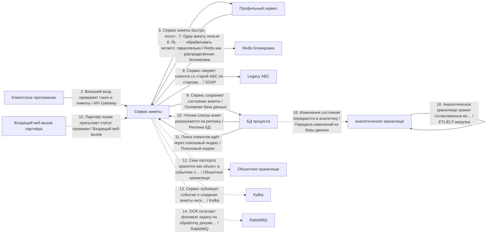
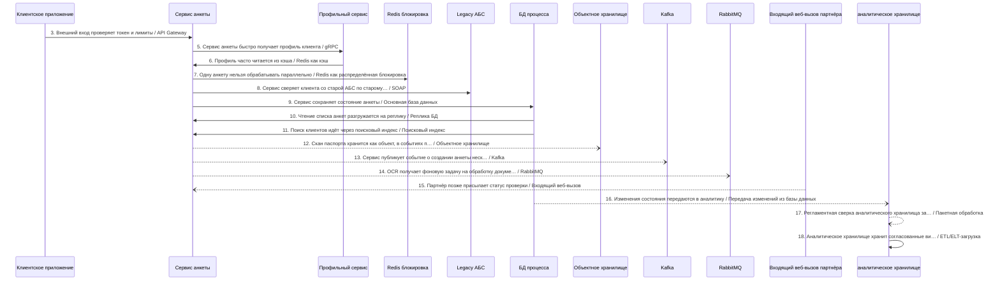
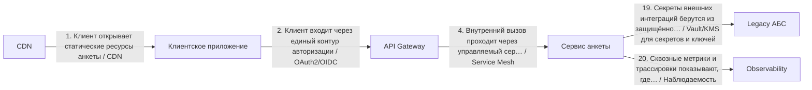

# Архитектурный разбор: Сложный кейс 1: цифровое открытие банковского продукта

## Короткий человеческий вывод

**Итог:** НЕ ГОТОВО: слишком много рисков. **Архитектурная готовность:** 0.0/10. **Готовность к промышленному запуску:** нельзя выпускать без закрытия блокеров.

**Полнота вводных:** 68%. **Надёжность рекомендаций:** средняя.

**Масштаб процесса:** 20 взаимодействий, из них 15 в основной цепочке и 5 сквозных контролей. Участников: 20.

**Бизнес-цель:** Клиент открывает продукт через приложение, процесс должен проверять старый контур, документы, статус партнёра и аналитику.
**Основная сущность:** ClientApplication. Деньги: да. Регуляторика: да. Клиентский сценарий: да.

**Как читать оценку:** низкая оценка не означает, что все выбранные технологии неправильные. Она означает, что до запуска есть блокеры: не закрыты гарантии доставки, восстановления, безопасности, сверки или эксплуатации.

## Что блокирует запуск

| Приоритет | Проблема | Где проявляется | Что сделать |
|---|---|---|---|
| Высокий | Замена legacy-системы описана без плана переключения. | Весь процесс | Используйте strangler-подход: параллельный прогон со сверкой старого и нового контура, поэтапное переключение трафика по процентам или сегментам, критерии переключения и план отката с сохранением данных, накопленных в новом контуре. |
| Высокий | Входящий веб-вызов должен проходить проверку подлинности. | Шаг 15 «Партнёр позже присылает статус проверки» | Проверяйте HMAC или подпись провайдера до любой бизнес-обработки; секрет храните в защищённом хранилище и предусмотрите его ротацию. |
| Высокий | В регуляторном процессе не описан аудиторский след. | Весь процесс | Ведите неизменяемый журнал операций с политикой срока хранения и сохраняйте evidence на каждый значимый переход статуса. |
| Высокий | В процессе есть слишком длинная синхронная цепочка: 10 блокирующих шага подряд. | Клиент открывает статические ресурсы анкеты → Клиент входит через единый контур авторизации → Внешний вход проверяет токен и лимиты → Внутренний вызов проходит через управляемый сервисный контур → Сервис анкеты быстро получает профиль клиента → Профиль часто читается из кэша → Одну анкету нельзя обрабатывать параллельно → Сервис сверяет клиента со старой АБС по старому контракту → Сервис сохраняет состояние анкеты → Поиск клиентов идёт через поисковый индекс | Разорвите цепочку: после первого подтверждённого шага переводите дальнейшую обработку в события или очередь, а клиенту возвращайте идентификатор отслеживания и понятную статусную модель процесса. |
| Высокий | Дочерний вызов может ждать дольше, чем родительский шаг. | 8 «Сервис сверяет клиента со старой АБС по старому контракту» (800мс) → 9 «Сервис сохраняет состояние анкеты» (800мс) | Таймауты должны строго убывать вниз по цепочке: дочерний таймаут должен быть меньше родительского с учётом сетевых накладных; общий бюджет времени распределяйте от целевого времени ответа сверху вниз. |
| Высокий | Повторы в синхронной цепочке усиливают друг друга. | «Клиент открывает статические ресурсы анкеты» → «Клиент входит через единый контур авторизации» → «Внешний вход проверяет токен и лимиты» → «Внутренний вызов проходит через управляемый сервисный контур» → «Сервис анкеты быстро получает профиль клиента» → «Профиль часто читается из кэша» → «Одну анкету нельзя обрабатывать параллельно» → «Сервис сверяет клиента со старой АБС по старому контракту» → «Сервис сохраняет состояние анкеты» → «Поиск клиентов идёт через поисковый индекс» | Задайте единый бюджет повторов на весь запрос (общий предельный срок ожидания), предохранитель внешнего вызова на каждом звене и экспоненциальное увеличение паузы между повторами со случайным разбросом; не повторяйте вызовы, которые уже не успеют уложиться в целевое время ответа. |
| Высокий | Процесс блокируется на вызове внешней системы. | Затронуто мест: 3 | Настройте таймаут, предохранитель внешнего вызова и запасной сценарий-ответ; если бизнес-сценарий позволяет, переведите шаг в асинхронную обработку через очередь с компенсацией. |
| Высокий | Высоконагруженный поток не имеет контролей приёма потока. | Пик 6000 RPS: «Сервис публикует событие о создании анкеты нескольким потребителям», «OCR получает фоновую задачу на обработку документа» | Используйте партиционирование по ключу и контроль горячих партиций; учитывайте время события и контрольную отметку загрузки с политикой обработки запоздалых событий; настройте обратное давление и алерты на лаг и пропускную способность. |
| Информация | Ещё 10 менее приоритетных замечаний | См. приложение с полным чек-листом | Разобрать после закрытия основных блокеров |

## Рекомендуемый порядок действий

1. Закрыть безопасность входящих вызовов: подпись, окно времени, защита от повторов и дедупликация.
2. Добавить сверку ожидаемых и фактических данных и процедуру восстановления расхождений.
3. Для асинхронных участков описать лимит повторов, очередь ошибок, владельца разбора и повторную обработку.
4. Разорвать длинные синхронные цепочки: вернуть идентификатор отслеживания и вынести хвост обработки в очередь или событие.
5. Пересчитать бюджет таймаутов сверху вниз: дочерний вызов должен завершаться раньше родительского.
6. Описать план перехода со старого контура: параллельный прогон, критерии переключения и откат.
7. Для высоконагруженного потока описать партиционирование, горячие ключи, обратное давление и алерты на лаг.
8. После исправлений повторить архитектурную проверку и зафиксировать принятые компромиссы в ADR.

## Проверка логики схемы

Схема не содержит очевидных противоречий между названием связи, участниками и выбранным основным способом взаимодействия.

## Почему выбраны технологии и способы взаимодействия

### Объяснение по шагам

Решения ниже сгруппированы по смыслу. В основной цепочке показано, **кто с кем взаимодействует и каким способом**. Сквозные вещи — аудит, безопасность, авторизация, наблюдаемость, секреты — вынесены отдельно и не смешиваются с бизнес-потоком.

Для каждого решения указано: **Почему выбрано**, **Почему не другой вариант**, **Обязательные условия**, **Почему предлагается именно так** и **Почему нельзя просто не делать**.

### API и онлайн-взаимодействие

### Шаг 3. Внешний вход проверяет токен и лимиты

**Что:** шаг 3 — «Внешний вход проверяет токен и лимиты». Основной способ взаимодействия: API Gateway.
**Где:** связь идёт от «Клиентское приложение» к «Сервис анкеты». Исполнитель: «API Gateway». Выполняется после: сквозной контроль 2 «Клиент входит через единый контур авторизации».
**Почему:** Нужен как единая внешняя точка входа: авторизация, лимиты запросов, маршрутизация, версия API и защита периметра.
**Почему не другой вариант:** Прямой вызов внутреннего сервиса раскрывает внутреннюю структуру и размазывает безопасность по сервисам. Брокеры не являются публичным входом для клиентского API.
**Что проверить перед выпуском:** Нужны проверка токена, лимиты запросов, трассировка, единая модель ошибок и запрет обхода шлюза.

### Шаг 5. Сервис анкеты быстро получает профиль клиента

**Что:** шаг 5 — «Сервис анкеты быстро получает профиль клиента». Основной способ взаимодействия: gRPC.
**Где:** связь идёт от «Сервис анкеты» к «Профильный сервис». Исполнитель: «Профильный сервис». Выполняется после: сквозной контроль 4 «Внутренний вызов проходит через управляемый сервисный контур».
**Почему:** Подходит для быстрого внутреннего вызова между сервисами при стабильном контракте и требовании низкой задержки.
**Почему не другой вариант:** REST проще для внешних потребителей. Kafka/RabbitMQ не подходят, если вызывающий сервис должен получить ответ сразу.
**Что проверить перед выпуском:** Нужны общий срок ожидания, контракт Protobuf, совместимость версий, повторные попытки только для безопасных операций и обработка недоступности сервиса.

### Шаг 8. Сервис сверяет клиента со старой АБС по старому контракту

**Что:** шаг 8 — «Сервис сверяет клиента со старой АБС по старому контракту». Основной способ взаимодействия: SOAP.
**Где:** связь идёт от «Сервис анкеты» к «Legacy АБС». Исполнитель: «Сервис анкеты». Выполняется после: шаг 7 «Одну анкету нельзя обрабатывать параллельно».
**Почему:** Подходит для старых корпоративных систем, если уже есть WSDL/XSD-контракт, XML-сообщения и регламент обмена через SOAP.
**Почему не другой вариант:** REST/gRPC проще для новых API, но могут быть невозможны без доработки старой системы. Брокер сообщений не заменит существующий синхронный SOAP-вызов.
**Что проверить перед выпуском:** Нужны версии XSD, описание SOAP Fault, таймауты, логирование исходного XML, маскирование чувствительных данных и регламент повторов.

### Шаг 15. Партнёр позже присылает статус проверки

**Что:** шаг 15 — «Партнёр позже присылает статус проверки». Основной способ взаимодействия: Входящий веб-вызов.
**Где:** связь идёт от «Входящий веб-вызов партнёра» к «Сервис анкеты». Исполнитель: «API Gateway». Выполняется после: шаг 13 «Сервис публикует событие о создании анкеты нескольким потребителям».
**Почему:** Подходит, когда внешняя система сама присылает результат или статус в наш HTTP эндпоинт.
**Почему не другой вариант:** Kafka/RabbitMQ нельзя требовать от партнёра, если он работает через HTTP. Периодический опрос хуже, потому что создаёт лишнюю нагрузку и задержку.
**Служебные компоненты:** Для позднего входящего результата нужна таблица входящих сообщений: она защищает от дублей и повторной доставки. API Gateway используется как точка входа для входящего вызова: он проверяет периметр, лимиты, трассировку и маршрутизирует запрос во внутренний сервис.
**Что проверить перед выпуском:** Нужны подпись запроса, защита от повторов, окно времени, дедупликация и безопасное логирование без ПДн.

### Асинхронный обмен

### Шаг 13. Сервис публикует событие о создании анкеты нескольким потребителям

**Что:** шаг 13 — «Сервис публикует событие о создании анкеты нескольким потребителям». Основной способ взаимодействия: Kafka.
**Где:** связь идёт от «Сервис анкеты» к «Kafka». Исполнитель: «Сервис анкеты». Выполняется после: шаг 9 «Сервис сохраняет состояние анкеты».
**Почему:** Подходит для потока событий, высокой нагрузки, повторной обработки, хранения истории событий и рассылки нескольким потребителям.
**Почему не другой вариант:** REST не подходит, если потребителей несколько и результат не нужен немедленно. RabbitMQ проще для очереди задач, но хуже как долговременный журнал событий. Redis Streams легче, но обычно слабее для критичного журнала событий.
**Служебные компоненты:** Если перед публикацией меняется состояние в БД, нужна таблица исходящих сообщений: изменение состояния и подготовка сообщения должны быть атомарными. Нужна сверка полноты между источником и аналитическим контуром: количество записей, ключи, контрольные суммы и отчёт расхождений.
**Что проверить перед выпуском:** Нужны топик, ключ партиционирования, группа потребителей, срок хранения, очередь ошибок или карантин и инструкция повторной обработки.

### Шаг 14. OCR получает фоновую задачу на обработку документа

**Что:** шаг 14 — «OCR получает фоновую задачу на обработку документа». Основной способ взаимодействия: RabbitMQ.
**Где:** связь идёт от «Сервис анкеты» к «RabbitMQ». Исполнитель: «Сервис анкеты». Выполняется после: шаг 12 «Скан паспорта хранится как объект, в событиях передаётся ссылка».
**Почему:** Подходит для очереди задач, маршрутизации, подтверждения обработки, ограниченного числа обработчиков и сценариев очереди задач.
**Почему не другой вариант:** Kafka лучше для журнала событий, повторной обработки и большого числа независимых потребителей. REST не выравнивает нагрузку между обработчиками. очередь Redis проще, но слабее для критичных процессов.
**Что проверить перед выпуском:** Нужны exchange, ключ маршрутизации, очередь, подтверждение обработки, обменник очереди ошибок, предварительная выдача сообщений обработчику и лимит повторов.

### Данные и чтение

### Шаг 6. Профиль часто читается из кэша

**Что:** шаг 6 — «Профиль часто читается из кэша». Основной способ взаимодействия: Redis как кэш.
**Где:** связь идёт от «Профильный сервис» к «Сервис анкеты». Исполнитель: «Redis кэш». Выполняется после: шаг 5 «Сервис анкеты быстро получает профиль клиента».
**Почему:** Подходит для ускорения чтения часто используемых данных, если потеря кэша не разрушает бизнес-состояние.
**Почему не другой вариант:** БД остаётся источником истины. Kafka/RabbitMQ не ускоряют чтение текущего состояния. Redis lock нужен для блокировки, а не для чтения данных.
**Что проверить перед выпуском:** Нужны TTL, инвалидация, защита от лавины обращений к источнику и запасной сценарий чтения из БД/источника.

### Шаг 7. Одну анкету нельзя обрабатывать параллельно

**Что:** шаг 7 — «Одну анкету нельзя обрабатывать параллельно». Основной способ взаимодействия: Redis как распределённая блокировка.
**Где:** связь идёт от «Сервис анкеты» к «Сервис анкеты». Исполнитель: «Redis блокировка». Выполняется после: шаг 6 «Профиль часто читается из кэша».
**Почему:** Подходит для короткой защиты критической секции, когда нельзя параллельно выполнять операцию по одной сущности.
**Почему не другой вариант:** Кэш Redis не решает взаимное исключение. БД-lock может быть надёжнее для финансовой записи, но дороже и сильнее нагружает БД. Kafka сама по себе не блокирует критическую секцию.
**Что проверить перед выпуском:** Нужны TTL, защитный токен блокировки, безопасное освобождение и обработка зависшего процесса.

### Шаг 9. Сервис сохраняет состояние анкеты

**Что:** шаг 9 — «Сервис сохраняет состояние анкеты». Основной способ взаимодействия: Основная база данных.
**Где:** связь идёт от «Сервис анкеты» к «БД процесса». Исполнитель: «Сервис анкеты». Выполняется после: шаг 8 «Сервис сверяет клиента со старой АБС по старому контракту».
**Почему:** Подходит для фиксации состояния процесса, статусов, ключей идемпотентности, истории и технического журнала шагов.
**Почему не другой вариант:** Redis не должен быть источником истины. Kafka/RabbitMQ передают сообщения, но не заменяют надёжную операционную запись. Аналитическое хранилище не подходит для оперативной транзакции.
**Что проверить перед выпуском:** Нужны транзакции, уникальные индексы, версия записи или optimistic locking, сроки хранения и план очистки технических таблиц.

### Шаг 10. Чтение списка анкет разгружается на реплику

**Что:** шаг 10 — «Чтение списка анкет разгружается на реплику». Основной способ взаимодействия: Реплика БД.
**Где:** связь идёт от «БД процесса» к «Сервис анкеты». Исполнитель: «Реплика чтения». Выполняется после: шаг 9 «Сервис сохраняет состояние анкеты».
**Почему:** Подходит, если чтений много и нужно разгрузить основную БД без изменения модели записи.
**Почему не другой вариант:** Кэш быстрее, но может устаревать и требует инвалидации. Шардирование сложнее и нужно, когда уже не хватает разделения по нагрузке/объёму.
**Что проверить перед выпуском:** Нужны контроль задержки репликации, маршрутизация read-only запросов, запасной сценарий на основную БД и запрет операций записи в реплику.

### Шаг 11. Поиск клиентов идёт через поисковый индекс

**Что:** шаг 11 — «Поиск клиентов идёт через поисковый индекс». Основной способ взаимодействия: Поисковый индекс.
**Где:** связь идёт от «БД процесса» к «Сервис анкеты». Исполнитель: «Поисковый индекс». Выполняется после: шаг 9 «Сервис сохраняет состояние анкеты».
**Почему:** Подходит для полнотекстового поиска, фильтрации по многим полям и быстрых пользовательских выборок.
**Почему не другой вариант:** БД может быть источником истины, но не всегда удобна для полнотекстового поиска. Redis ускоряет чтение по ключу, но не заменяет поисковый индекс.
**Что проверить перед выпуском:** Нужны переиндексация, контроль отставания индекса, правила актуализации и понятная свежесть данных для пользователя.

### Аналитика и загрузки

### Шаг 16. Изменения состояния передаются в аналитику

**Что:** шаг 16 — «Изменения состояния передаются в аналитику». Основной способ взаимодействия: Передача изменений из базы данных.
**Где:** связь идёт от «БД процесса» к «аналитическое хранилище». Исполнитель: «аналитическое хранилище». Выполняется после: шаг 9 «Сервис сохраняет состояние анкеты».
**Почему:** Подходит, когда данные уже зафиксированы в операционной БД и их нужно передавать в аналитический контур без замедления основного процесса.
**Почему не другой вариант:** Прямая запись в аналитическое хранилище из бизнес-сервиса связывает операционный процесс с аналитикой. Batch проще, но даёт большую задержку. Событие из приложения требует строгой дисциплины таблицы исходящих сообщений.
**Служебные компоненты:** Нужна сверка полноты между источником и аналитическим контуром: количество записей, ключи, контрольные суммы и отчёт расхождений.
**Что проверить перед выпуском:** Нужны контроль позиции чтения, контроль отставания, совместимость схем, повторная синхронизация и сверка полноты.

### Шаг 17. Регламентная сверка аналитического хранилища запускается пачкой по расписанию

**Что:** шаг 17 — «Регламентная сверка аналитического хранилища запускается пачкой по расписанию». Основной способ взаимодействия: Пакетная обработка.
**Где:** связь идёт от «аналитическое хранилище» к «аналитическое хранилище». Исполнитель: «аналитическое хранилище». Выполняется после: шаг 16 «Изменения состояния передаются в аналитику».
**Почему:** Подходит для обработки по расписанию, сверки, загрузки периода или массовой операции, где допустима задержка.
**Почему не другой вариант:** REST/gRPC не подходят для больших периодических объёмов. Kafka хороша для потока событий, но не всегда удобна для регламентной сверки периода.
**Служебные компоненты:** Нужна сверка полноты между источником и аналитическим контуром: количество записей, ключи, контрольные суммы и отчёт расхождений.
**Что проверить перед выпуском:** Нужны идентификатор задания, контрольную отметку загрузки, контроль количества записей, повторный запуск периода и отчёт расхождений.

### Шаг 18. Аналитическое хранилище хранит согласованные витрины

**Что:** шаг 18 — «Аналитическое хранилище хранит согласованные витрины». Основной способ взаимодействия: ETL/ELT-загрузка.
**Где:** связь идёт от «аналитическое хранилище» к «аналитическое хранилище». Исполнитель: «аналитическое хранилище». Выполняется после: шаг 17 «Регламентная сверка аналитического хранилища запускается пачкой по расписанию».
**Почему:** Подходит для передачи данных в аналитический контур с преобразованием, контролем качества и подготовкой витрин.
**Почему не другой вариант:** Операционная БД является источником данных, но не способом доставки в аналитику. Прямая запись сервиса в аналитическое хранилище повышает связанность. CDC лучше для передачи изменений почти в реальном времени, Batch — для регламентной периодической загрузки.
**Служебные компоненты:** Нужна сверка полноты между источником и аналитическим контуром: количество записей, ключи, контрольные суммы и отчёт расхождений.
**Что проверить перед выпуском:** Нужны правила преобразования, контроль количества записей, журнал загрузки, карантин ошибок, повторный запуск периода и сверка с источником.

### Файлы и доставка контента

### Шаг 12. Скан паспорта хранится как объект, в событиях передаётся ссылка

**Что:** шаг 12 — «Скан паспорта хранится как объект, в событиях передаётся ссылка». Основной способ взаимодействия: Объектное хранилище.
**Где:** связь идёт от «Сервис анкеты» к «Объектное хранилище». Исполнитель: «Сервис анкеты». Выполняется после: шаг 9 «Сервис сохраняет состояние анкеты».
**Почему:** Подходит для хранения больших файлов, документов, сканов и вложений, когда в сообщениях нужно передавать только ссылку.
**Почему не другой вариант:** БД не стоит нагружать большими бинарными файлами. Kafka/RabbitMQ не должны переносить тяжёлые документы. File/SFTP могут быть транспортом, но не обязательно удобным хранилищем.
**Что проверить перед выпуском:** Нужны права доступа, срок хранения, шифрование, антивирусная проверка и запрет публичных ссылок без срока действия.

## Сквозные контроли и служебные компоненты

Эти элементы не являются отдельными бизнес-шагами. Они применяются к процессу как контроль безопасности, эксплуатации, аудита или инфраструктуры.

### Контроль 1. Клиент открывает статические ресурсы анкеты

**Назначение:** CDN.
**Где применяется:** «CDN» → «Клиентское приложение» или ко всему процессу.
**Зачем нужен:** Подходит для быстрой раздачи статических файлов или публичных/полупубличных вложений пользователям в разных регионах.
**Что проверить:** Нужны правила кэширования, очистка кэша, срок жизни ссылки, приватный доступ, защита от утечки и стратегия обновления файлов.

### Контроль 2. Клиент входит через единый контур авторизации

**Назначение:** OAuth2/OIDC.
**Где применяется:** «Клиентское приложение» → «API Gateway» или ко всему процессу.
**Зачем нужен:** Подходит для единой авторизации пользователей, сервисов или партнёров с токенами, правами доступа и централизованной проверкой доступа.
**Что проверить:** Нужны права доступа и атрибуты токена, срок жизни токена, правила обновления токенов, аудит входа, ротация ключей и проверка прав на уровне действий.

### Контроль 4. Внутренний вызов проходит через управляемый сервисный контур

**Назначение:** Service Mesh.
**Где применяется:** «API Gateway» → «Сервис анкеты» или ко всему процессу.
**Зачем нужен:** Подходит для управления внутренними вызовами: взаимная TLS-аутентификация, политики трафика, ретраи, трассировка и постепенное переключение версий.
**Что проверить:** Нужны владельцы mesh-политик, лимиты повторных попыток, mTLS, наблюдаемость, правила пробного включения на малой доле/разделение трафика и план аварийного обхода.

### Контроль 19. Секреты внешних интеграций берутся из защищённого хранилища

**Назначение:** Vault/KMS для секретов и ключей.
**Где применяется:** «Сервис анкеты» → «Legacy АБС» или ко всему процессу.
**Зачем нужен:** Подходит, когда нужно безопасно хранить пароли, ключи подписи, сертификаты и секреты интеграций.
**Что проверить:** Нужны политики доступа, ротация ключей, аудит чтения секретов, шифрование, разграничение окружений и аварийные процедуры.

### Контроль 20. Сквозные метрики и трассировки показывают, где зависла анкета

**Назначение:** Наблюдаемость.
**Где применяется:** «Сервис анкеты» → «Observability» или ко всему процессу.
**Зачем нужен:** Подходит, чтобы видеть, где завис процесс: метрики, логи, трассировки, алерты и бизнес-события по состояниям.
**Что проверить:** Нужны идентификатор сквозной связи, метрики задержки и ошибок, трассировка, алерты по очередям/лагу/ошибкам, дашборды и инструкции разбора.

## Контрольные проверки готовности к промышленному запуску

| Область | Статус | Что важно |
|---|---|---|
| Контракт | Блокирует выпуск | Каждое событие содержит стандартную обёртку события. |
| Надёжность | Блокирует выпуск | Для внешних блокирующих вызовов описаны предохранитель внешнего вызова и деградация.; Для асинхронной обработки задан лимит попыток и очередь ошибок или карантин. |
| Целостность данных | Блокирует выпуск | При записи в БД и публикации события используется таблица исходящих сообщений. |
| Наблюдаемость | Проходит | Явных проблем не найдено. |
| Безопасность | Блокирует выпуск | Входящий веб-вызов или обратный вызов проходит проверку подписи. |
| Производительность | Требует проверки | Для нагрузки описаны пропускная способность, обратное давление и отставание потребителей. |
| Эксплуатация и внедрение | Проходит | Явных проблем не найдено. |

## Какие вводные нужно уточнить

| Приоритет | Область | Что уточнить | Почему важно |
|---|---|---|---|
| high | Надёжность | Куда попадает сообщение после исчерпания попыток? | Без очереди ошибок/карантина poison message может потеряться или бесконечно крутиться. |
| medium | Данные | Какой natural/бизнес-ключ или operationId уникально определяет операцию? | Без уникального ключа сложно гарантировать dedup и повторную обработку без дублей. |
| medium | Эксплуатация | Какой срок хранения у топиков, таблиц исходящих и входящих сообщений и журналов? | Без политики хранения растёт стоимость и ухудшается восстановление/аудит. |
| medium | целевое время ответа | Какое целевое время ответа и таймаут для пользовательского или системного ответа? | Без целевого времени ответа невозможно распределить бюджет таймаутов и понять, где нужна async-граница. |
| Информация | Владение | Кто владельцы систем, контрактов и алертов? | Без владельцев неясны ответственность и эскалация. |

## Краткая сводка по стеку

| Технология / способ | Где применяется |
|---|---:|
| API Gateway | 1 |
| ETL/ELT-загрузка | 1 |
| gRPC | 1 |
| Kafka | 1 |
| RabbitMQ | 1 |
| Redis как кэш | 1 |
| Redis как распределённая блокировка | 1 |
| SOAP | 1 |
| Входящий веб-вызов | 1 |
| Объектное хранилище | 1 |
| Основная база данных | 1 |
| Пакетная обработка | 1 |
| Передача изменений из базы данных | 1 |
| Поисковый индекс | 1 |
| Реплика БД | 1 |

<details>
<summary>Приложение A. Полная таблица по всем шагам</summary>

| Шаг | Связь | Основной способ | Что проверить |
|---|---|---|---|
| 3. Внешний вход проверяет токен и лимиты | Клиентское приложение → Сервис анкеты. Исполнитель: API Gateway | API Gateway | Нужны проверка токена, лимиты запросов, трассировка, единая модель ошибок и запрет обхода шлюза. |
| 5. Сервис анкеты быстро получает профиль клиента | Сервис анкеты → Профильный сервис. Исполнитель: Профильный сервис | gRPC | Нужны общий срок ожидания, контракт Protobuf, совместимость версий, повторные попытки только для безопасных операций и обработка недоступности сервиса. |
| 6. Профиль часто читается из кэша | Профильный сервис → Сервис анкеты. Исполнитель: Redis кэш | Redis как кэш | Нужны TTL, инвалидация, защита от лавины обращений к источнику и запасной сценарий чтения из БД/источника. |
| 7. Одну анкету нельзя обрабатывать параллельно | Сервис анкеты → Redis блокировка. Исполнитель: Redis блокировка | Redis как распределённая блокировка | Нужны TTL, защитный токен блокировки, безопасное освобождение и обработка зависшего процесса. |
| 8. Сервис сверяет клиента со старой АБС по старому контракту | Сервис анкеты → Legacy АБС. Исполнитель: Сервис анкеты | SOAP | Нужны версии XSD, описание SOAP Fault, таймауты, логирование исходного XML, маскирование чувствительных данных и регламент повторов. |
| 9. Сервис сохраняет состояние анкеты | Сервис анкеты → БД процесса. Исполнитель: Сервис анкеты | Основная база данных | Нужны транзакции, уникальные индексы, версия записи или optimistic locking, сроки хранения и план очистки технических таблиц. |
| 10. Чтение списка анкет разгружается на реплику | БД процесса → Сервис анкеты. Исполнитель: Реплика чтения | Реплика БД | Нужны контроль задержки репликации, маршрутизация read-only запросов, запасной сценарий на основную БД и запрет операций записи в реплику. |
| 11. Поиск клиентов идёт через поисковый индекс | БД процесса → Сервис анкеты. Исполнитель: Поисковый индекс | Поисковый индекс | Нужны переиндексация, контроль отставания индекса, правила актуализации и понятная свежесть данных для пользователя. |
| 12. Скан паспорта хранится как объект, в событиях передаётся ссылка | Сервис анкеты → Объектное хранилище. Исполнитель: Сервис анкеты | Объектное хранилище | Нужны права доступа, срок хранения, шифрование, антивирусная проверка и запрет публичных ссылок без срока действия. |
| 13. Сервис публикует событие о создании анкеты нескольким потребителям | Сервис анкеты → Kafka. Исполнитель: Сервис анкеты | Kafka | Нужны топик, ключ партиционирования, группа потребителей, срок хранения, очередь ошибок или карантин и инструкция повторной обработки. |
| 14. OCR получает фоновую задачу на обработку документа | Сервис анкеты → RabbitMQ. Исполнитель: Сервис анкеты | RabbitMQ | Нужны exchange, ключ маршрутизации, очередь, подтверждение обработки, обменник очереди ошибок, предварительная выдача сообщений обработчику и лимит повторов. |
| 15. Партнёр позже присылает статус проверки | Входящий веб-вызов партнёра → Сервис анкеты. Исполнитель: API Gateway | Входящий веб-вызов | Нужны подпись запроса, защита от повторов, окно времени, дедупликация и безопасное логирование без ПДн. |
| 16. Изменения состояния передаются в аналитику | БД процесса → аналитическое хранилище. Исполнитель: аналитическое хранилище | Передача изменений из базы данных | Нужны контроль позиции чтения, контроль отставания, совместимость схем, повторная синхронизация и сверка полноты. |
| 17. Регламентная сверка аналитического хранилища запускается пачкой по расписанию | аналитическое хранилище → аналитическое хранилище. Исполнитель: аналитическое хранилище | Пакетная обработка | Нужны идентификатор задания, контрольную отметку загрузки, контроль количества записей, повторный запуск периода и отчёт расхождений. |
| 18. Аналитическое хранилище хранит согласованные витрины | аналитическое хранилище → аналитическое хранилище. Исполнитель: аналитическое хранилище | ETL/ELT-загрузка | Нужны правила преобразования, контроль количества записей, журнал загрузки, карантин ошибок, повторный запуск периода и сверка с источником. |

</details>

<details>
<summary>Приложение B. Найденные риски и слабые места</summary>

## Найденные риски и слабые места

### Высокий риск

#### Замена legacy-системы описана без плана переключения.

**Что:** найден риск «Замена legacy-системы описана без плана переключения.». затронуто мест: 1.
**Затронутые места:** Весь процесс.
**Почему это важно:** Миграция — это не просто «включили новое»: без параллельного прогона и плана отката первый серьёзный дефект нового контура может остановить бизнес.
**Что нужно сделать:** Используйте strangler-подход: параллельный прогон со сверкой старого и нового контура, поэтапное переключение трафика по процентам или сегментам, критерии переключения и план отката с сохранением данных, накопленных в новом контуре.

#### Входящий веб-вызов должен проходить проверку подлинности.

**Что:** найден риск «Входящий веб-вызов должен проходить проверку подлинности.». затронуто мест: 1.
**Затронутые места:** Шаг 15 «Партнёр позже присылает статус проверки».
**Почему это важно:** Входящий веб-вызов является публичной точкой входа: без проверки подписи любой внешний отправитель может подделать бизнес-событие обычным POST-запросом.
**Что нужно сделать:** Проверяйте HMAC или подпись провайдера до любой бизнес-обработки; секрет храните в защищённом хранилище и предусмотрите его ротацию.

#### В регуляторном процессе не описан аудиторский след.

**Что:** найден риск «В регуляторном процессе не описан аудиторский след.». затронуто мест: 1.
**Затронутые места:** Весь процесс.
**Почему это важно:** Юридически значимые шаги требуют доказуемой истории: кто, что, когда и на каком основании выполнил.
**Что нужно сделать:** Ведите неизменяемый журнал операций с политикой срока хранения и сохраняйте evidence на каждый значимый переход статуса.

#### В процессе есть слишком длинная синхронная цепочка: 10 блокирующих шага подряд.

**Что:** найден риск «В процессе есть слишком длинная синхронная цепочка: 10 блокирующих шага подряд.». затронуто мест: 1.
**Затронутые места:** Клиент открывает статические ресурсы анкеты → Клиент входит через единый контур авторизации → Внешний вход проверяет токен и лимиты → Внутренний вызов проходит через управляемый сервисный контур → Сервис анкеты быстро получает профиль клиента → Профиль часто читается из кэша → Одну анкету нельзя обрабатывать параллельно → Сервис сверяет клиента со старой АБС по старому контракту → Сервис сохраняет состояние анкеты → Поиск клиентов идёт через поисковый индекс.
**Почему это важно:** Каждое синхронное звено увеличивает вероятность отказа и добавляет задержку к общему времени ответа; если откажет любое звено, весь пользовательский или системный запрос завершится ошибкой.
**Что нужно сделать:** Разорвите цепочку: после первого подтверждённого шага переводите дальнейшую обработку в события или очередь, а клиенту возвращайте идентификатор отслеживания и понятную статусную модель процесса.

#### Дочерний вызов может ждать дольше, чем родительский шаг.

**Что:** найден риск «Дочерний вызов может ждать дольше, чем родительский шаг.». затронуто мест: 1.
**Затронутые места:** 8 «Сервис сверяет клиента со старой АБС по старому контракту» (800мс) → 9 «Сервис сохраняет состояние анкеты» (800мс).
**Почему это важно:** Родительский шаг завершится по таймауту раньше, чем ответит дочерний вызов; в результате выполненная работа будет потрачена впустую, а запись может «осиротеть»: она есть в БД дочерней системы, но родитель уже считает операцию отказавшей.
**Что нужно сделать:** Таймауты должны строго убывать вниз по цепочке: дочерний таймаут должен быть меньше родительского с учётом сетевых накладных; общий бюджет времени распределяйте от целевого времени ответа сверху вниз.

#### Повторы в синхронной цепочке усиливают друг друга.

**Что:** найден риск «Повторы в синхронной цепочке усиливают друг друга.». затронуто мест: 1.
**Затронутые места:** «Клиент открывает статические ресурсы анкеты» → «Клиент входит через единый контур авторизации» → «Внешний вход проверяет токен и лимиты» → «Внутренний вызов проходит через управляемый сервисный контур» → «Сервис анкеты быстро получает профиль клиента» → «Профиль часто читается из кэша» → «Одну анкету нельзя обрабатывать параллельно» → «Сервис сверяет клиента со старой АБС по старому контракту» → «Сервис сохраняет состояние анкеты» → «Поиск клиентов идёт через поисковый индекс».
**Почему это важно:** Несколько звеньев с автоматическими повторами друг за другом перемножают количество попыток (N×M×…): при деградации это создаёт шторм повторных попыток и лавинообразный рост нагрузки в самый плохой момент.
**Что нужно сделать:** Задайте единый бюджет повторов на весь запрос (общий предельный срок ожидания), предохранитель внешнего вызова на каждом звене и экспоненциальное увеличение паузы между повторами со случайным разбросом; не повторяйте вызовы, которые уже не успеют уложиться в целевое время ответа.

#### Процесс блокируется на вызове внешней системы.

**Что:** найден риск «Процесс блокируется на вызове внешней системы.». затронуто мест: 3.
**Затронутые места:** Затронуто мест: 3.
**Почему это важно:** Внешняя система находится вне вашего контроля: её деградация напрямую ухудшает ваше целевое время ответа и может исчерпать пул рабочих потоков.
**Что нужно сделать:** Настройте таймаут, предохранитель внешнего вызова и запасной сценарий-ответ; если бизнес-сценарий позволяет, переведите шаг в асинхронную обработку через очередь с компенсацией.

#### Высоконагруженный поток не имеет контролей приёма потока.

**Что:** найден риск «Высоконагруженный поток не имеет контролей приёма потока.». затронуто мест: 1.
**Затронутые места:** Пик 6000 RPS: «Сервис публикует событие о создании анкеты нескольким потребителям», «OCR получает фоновую задачу на обработку документа».
**Почему это важно:** На таком потоке неизбежны out-of-order события, опоздавшие события, горячие партиции и всплески нагрузки, которые потребитель может не обработать вовремя.
**Что нужно сделать:** Используйте партиционирование по ключу и контроль горячих партиций; учитывайте время события и контрольную отметку загрузки с политикой обработки запоздалых событий; настройте обратное давление и алерты на лаг и пропускную способность.

#### аналитическое хранилище или аналитика находятся в операционном основном потоке.

**Что:** найден риск «аналитическое хранилище или аналитика находятся в операционном основном потоке.». затронуто мест: 1.
**Затронутые места:** Шаг 18 «Аналитическое хранилище хранит согласованные витрины» → аналитическое хранилище.
**Почему это важно:** Аналитическое хранилище обычно не обеспечивает операционный целевое время ответа: его деградация не должна останавливать основной бизнес-процесс.
**Что нужно сделать:** Сделайте шаг non-blocking: используйте CDC, ETL или событие после фиксации результата в операционной системе.

#### Система одновременно пишет в БД и публикует событие без таблицы исходящих сообщений.

**Что:** найден риск «Система одновременно пишет в БД и публикует событие без таблицы исходящих сообщений.». затронуто мест: 1.
**Затронутые места:** Сервис анкеты: «Сервис публикует событие о создании анкеты нескольким потребителям», «OCR получает фоновую задачу на обработку документа».
**Почему это важно:** Запись в БД и публикация события являются двумя несвязанными операциями: при сбое между ними событие может потеряться или, наоборот, появиться без записи в БД.
**Что нужно сделать:** Используйте транзакционную таблицу исходящих сообщений: событие записывается в той же транзакции, что и агрегат, а отдельный публикатор читает таблицу исходящих сообщений и публикует событие с повторными попытками.

### Средний риск

#### Событие не содержит обязательную обёртку события.

**Что:** найден риск «Событие не содержит обязательную обёртку события.». затронуто мест: 1.
**Затронутые места:** «Сервис публикует событие о создании анкеты нескольким потребителям», «OCR получает фоновую задачу на обработку документа».
**Почему это важно:** Событие можно доставить, но его сложно дедуплицировать, трассировать, версионировать и восстанавливать после инцидента: не хватает типа события, версии события и времени возникновения события, идентификатор агрегата.
**Что нужно сделать:** Зафиксируйте единую обёртку события: идентификатор события, тип события, версия события, идентификатор агрегата или entityId, сквозной идентификатор или идентификатор трассировки, время возникновения события, производитель события и тело сообщения.

#### Дочерний вызов может ждать дольше, чем родительский шаг.

**Что:** найден риск «Дочерний вызов может ждать дольше, чем родительский шаг.». затронуто мест: 10.
**Затронутые места:** Затронуто мест: 10.
**Почему это важно:** Родительский шаг завершится по таймауту раньше, чем ответит дочерний вызов; в результате выполненная работа будет потрачена впустую.
**Что нужно сделать:** Таймауты должны строго убывать вниз по цепочке: дочерний таймаут должен быть меньше родительского с учётом сетевых накладных; общий бюджет времени распределяйте от целевого времени ответа сверху вниз.

#### Для CDC-потока не описаны обязательные контроли.

**Что:** найден риск «Для CDC-потока не описаны обязательные контроли.». затронуто мест: 1.
**Затронутые места:** Шаг 16 «Изменения состояния передаются в аналитику» (аналитическое хранилище).
**Почему это важно:** CDC может незаметно сломаться на пропусках позиций, удалениях и эволюции схемы источника, из-за чего проекция тихо расходится с источником истины.
**Что нужно сделать:** Используйте LSN или контрольную отметку загрузки с контролем пропусков (gap detection); добавьте обработку delete-событий, политику эволюции схемы, идемпотентную проекцию, регулярную сверку и повторная обработка за выбранный период.

#### Для порядка событий в рамках сущности не задан ключ партиционирования.

**Что:** найден риск «Для порядка событий в рамках сущности не задан ключ партиционирования.». затронуто мест: 1.
**Затронутые места:** «Сервис публикует событие о создании анкеты нескольким потребителям», «OCR получает фоновую задачу на обработку документа».
**Почему это важно:** Без ключ партиционирования события одной сущности могут разойтись по разным партициям и быть обработаны в неправильном порядке.
**Что нужно сделать:** Партиционируйте события по entityId и явно укажите этот ключ во входных данных шага.

### Информация

#### Концентрация критического пути в одной системе

**Что:** найден риск «Концентрация критического пути в одной системе». затронуто мест: 1.
**Затронутые места:** Сервис анкеты: 2 блокирующих шага.
**Почему это важно:** Система — единая точка отказа сценария.
**Что нужно сделать:** Проверить её HA/DR-план; рассмотреть деградацию сценария при её отказе.

#### Для клиентского API не зафиксирована модель ошибок.

**Что:** найден риск «Для клиентского API не зафиксирована модель ошибок.». затронуто мест: 1.
**Затронутые места:** «Сервис анкеты быстро получает профиль клиента», «Сервис сверяет клиента со старой АБС по старому контракту».
**Почему это важно:** Без контракта ошибок фронт, клиент и поддержка будут по-разному трактовать отказы, таймаут, дубли и промежуточные состояния.
**Что нужно сделать:** Опишите errorCode, userMessage, technicalMessage для логов, повторяемые, идентификатор сквозной связи, сопоставление 4xx/5xx/gRPC status и примеры ошибок.

#### Для критичной системы не указан владелец.

**Что:** найден риск «Для критичной системы не указан владелец.». затронуто мест: 13.
**Затронутые места:** Затронуто мест: 13.
**Почему это важно:** При инциденте будет непонятно, кто отвечает за целевое время ответа, контракт, лимиты, повторная обработка и согласование изменений.
**Что нужно сделать:** Зафиксируйте владельца системы или команды, канал поддержки, SLO и порядок эскалации.

#### Для служебных таблиц не описана политика роста и очистки.

**Что:** найден риск «Для служебных таблиц не описана политика роста и очистки.». затронуто мест: 1.
**Затронутые места:** таблица исходящих сообщений, таблица входящих сообщений, журнал проводок и журнал шагов.
**Почему это важно:** Эти таблицы пополняются на каждое событие; без архивации и партиционирования они со временем ухудшат latency запросов и существенно раздуют БД.
**Что нужно сделать:** Добавьте партиционирование по времени, архивацию или перенос в холодное хранилище, а также очистку опубликованных записей таблицы исходящих сообщений; контролируйте размер таблиц и время запросов к ним.


</details>

<details>
<summary>Приложение C. Сценарная основа для дальнейшей разработки</summary>

## Сценарная основа для дальнейшей разработки

Этот раздел нужен не для выбора технологий, а для постановки на разработку и тестирование: какой поток считается успешным, какие есть альтернативы, что происходит при ошибках и как проверять готовность.

### Важное замечание по сценарию

Текущая схема похожа не на один линейный happy path, а на карту множества интеграционных возможностей. Поэтому отчёт не строит искусственный сценарий из всех шагов подряд. Сначала нужно выбрать конкретный бизнес-поток, а ниже использовать сценарные блоки как основу для детализации.

### Сценарные блоки по типам взаимодействий

| Блок | Что входит | Ожидаемый результат | Что обязательно проверить |
|---|---|---|---|
| API и онлайн-взаимодействие | шаг 3: Клиентское приложение → Сервис анкеты — Внешний вход проверяет токен и лимиты (API Gateway); шаг 5: Сервис анкеты → Профильный сервис — Сервис анкеты быстро получает профиль клиента (gRPC); шаг 8: Сервис анкеты → Legacy АБС — Сервис сверяет клиента со старой АБС по старому контракту (SOAP); ещё 1 | входящий или внутренний запрос получает быстрый ответ либо идентификатор отслеживания для дальнейшего отслеживания | Нужны проверка токена, лимиты запросов, трассировка, единая модель ошибок и запрет обхода шлюза; Нужны общий срок ожидания, контракт Protobuf, совместимость версий, повторные попытки только для безопасных операций и обработка недоступности сервиса; ещё 2 |
| Асинхронный обмен | шаг 13: Сервис анкеты → Kafka — Сервис публикует событие о создании анкеты нескольким потребителям (Kafka); шаг 14: Сервис анкеты → RabbitMQ — OCR получает фоновую задачу на обработку документа (RabbitMQ) | нагрузка выровнена через брокер, сообщение не теряется, есть повторная обработка и очередь ошибок | Нужны топик, ключ партиционирования, группа потребителей, срок хранения, очередь ошибок или карантин и инструкция повторной обработки; Нужны exchange, ключ маршрутизации, очередь, подтверждение обработки, обменник очереди ошибок, предварительная выдача сообщений обработчику и лимит повторов |
| Данные и чтение | шаг 6: Профильный сервис → Сервис анкеты — Профиль часто читается из кэша (Redis как кэш); шаг 7: Сервис анкеты → Redis блокировка — Одну анкету нельзя обрабатывать параллельно (Redis как распределённая блокировка); шаг 9: Сервис анкеты → БД процесса — Сервис сохраняет состояние анкеты (Основная база данных); ещё 2 | основная сущность, справочники или проекции сохранены без дублей и потерянных обновлений | Нужны TTL, инвалидация, защита от лавины обращений к источнику и запасной сценарий чтения из БД/источника; Нужны TTL, защитный токен блокировки, безопасное освобождение и обработка зависшего процесса; ещё 3 |
| Аналитика и загрузки | шаг 16: БД процесса → аналитическое хранилище — Изменения состояния передаются в аналитику (Передача изменений из базы данных); шаг 17: аналитическое хранилище → аналитическое хранилище — Регламентная сверка аналитического хранилища запускается пачкой по расписанию (Пакетная обработка); шаг 18: аналитическое хранилище → аналитическое хранилище — Аналитическое хранилище хранит согласованные витрины (ETL/ELT-загрузка) | данные попадают в аналитический контур с контролем полноты и возможностью сверки | Нужны контроль позиции чтения, контроль отставания, совместимость схем, повторная синхронизация и сверка полноты; Нужны идентификатор задания, контрольную отметку загрузки, контроль количества записей, повторный запуск периода и отчёт расхождений; ещё 1 |
| Файлы и доставка контента | шаг 12: Сервис анкеты → Объектное хранилище — Скан паспорта хранится как объект, в событиях передаётся ссылка (Объектное хранилище) | файлы, документы и статический контент передаются с контролем доступа, размера и целостности | Нужны права доступа, срок хранения, шифрование, антивирусная проверка и запрет публичных ссылок без срока действия |

### Сквозные сценарии контроля

| Контроль | Где применяется | Ожидаемый результат |
|---|---|---|
| Клиент открывает статические ресурсы анкеты | CDN → Клиентское приложение; при необходимости применяется ко всему процессу | контроль работает сквозно и не меняет порядок бизнес-шагов |
| Клиент входит через единый контур авторизации | Клиентское приложение → API Gateway; при необходимости применяется ко всему процессу | контроль работает сквозно и не меняет порядок бизнес-шагов |
| Внутренний вызов проходит через управляемый сервисный контур | API Gateway → Сервис анкеты; при необходимости применяется ко всему процессу | контроль работает сквозно и не меняет порядок бизнес-шагов |
| Секреты внешних интеграций берутся из защищённого хранилища | Сервис анкеты → Legacy АБС; при необходимости применяется ко всему процессу | контроль работает сквозно и не меняет порядок бизнес-шагов |
| Сквозные метрики и трассировки показывают, где зависла анкета | Сервис анкеты → Observability; при необходимости применяется ко всему процессу | контроль работает сквозно и не меняет порядок бизнес-шагов |

### Альтернативные сценарии

#### Асинхронное принятие заявки без ожидания финального результата

**Когда возникает:** Хвост процесса занимает больше допустимого времени ответа или зависит от внешних систем.
**Как должен пройти сценарий:**
1. Система принимает запрос и создаёт идентификатор отслеживания.
2. Клиенту или вызывающей системе возвращается подтверждение приёма.
3. Дальнейшая обработка идёт через событие/очередь.
4. Статус процесса обновляется после каждого значимого шага.
**Ожидаемый результат:** Пользователь или потребитель видит промежуточный статус, а не зависший запрос.
**Обязательные проверки:** идентификатор отслеживания обязателен; GET /status или событие статуса; финальные статусы должны быть согласованы.

#### Повторная доставка или повторный запрос

**Когда возникает:** Сеть оборвалась, производитель события отправил событие повторно или потребитель переобработал сообщение.
**Как должен пройти сценарий:**
1. Система получает тот же ключ идемпотентности/идентификатор события/бизнес-ключ.
2. Выполняется попытка вставки ключа в таблицу входящих сообщений для защиты от дублей или поиск существующей операции.
3. Если ключ уже обработан, система возвращает прежний результат без повторного изменения бизнес-состояния.
**Ожидаемый результат:** Повтор не создаёт дубль операции, документа, проводки или статуса.
**Обязательные проверки:** UNIQUE-индекс на ключ идемпотентности; фиксация позиции чтения только после успешной обработки; тест дубля обязателен.

#### Внешняя система недоступна или отвечает медленно

**Когда возникает:** Внешняя зависимость вернула таймаут, 5xx, 429 или стала нестабильной.
**Как должен пройти сценарий:**
1. Вызов завершается по таймаут, а не висит бесконечно.
2. Circuit breaker ограничивает новые попытки.
3. Если операция критична, она переводится в статус ожидания или ручного разбора.
4. Если данные необязательны, используется запасной сценарий или частичный ответ.
**Ожидаемый результат:** Отказ партнёра не приводит к каскадному отказу всего процесса.
**Обязательные проверки:** таймаут на каждый внешний вызов; предохранитель внешнего вызова; запасной сценарий/очередь/ручной разбор; алерт владельцу зависимости.

#### Ошибка обработки сообщения

**Когда возникает:** потребитель события получил сообщение, но бизнес-обработка завершилась ошибкой.
**Как должен пройти сценарий:**
1. потребитель события выполняет ограниченные повторные попытки с увеличение паузы между повторами.
2. После исчерпания попыток сообщение попадает в очередь ошибок или карантин.
3. Создаётся алерт и задача на разбор.
4. После исправления причины выполняется повторная обработка.
**Ожидаемый результат:** Сообщение не теряется и не крутится бесконечно.
**Обязательные проверки:** максимальное число попыток; очередь ошибок/карантин; инструкция повторной обработки; идемпотентность повторной обработки.

#### Расхождение данных между источником истины и потребителем

**Когда возникает:** Техническая доставка прошла не полностью, повторная обработка былааааааа пропущена или потребитель отстал.
**Как должен пройти сценарий:**
1. Регламентная сверка сравнивает ожидаемые и фактические состояния.
2. Найденные расхождения попадают в отчёт.
3. Безопасные расхождения восстанавливаются автоматически.
4. Опасные расхождения уходят на ручной разбор.
**Ожидаемый результат:** Бизнес видит не только техническую доставку, но и фактическую полноту процесса.
**Обязательные проверки:** регулярная сверка; отчёт расхождений; владелец ручного разбора; аудит исправлений.

#### Поздний результат от внешней системы

**Когда возникает:** Партнёр завершает обработку после исходного запроса и присылает статус отдельно.
**Как должен пройти сценарий:**
1. принять входящий вызов.
2. проверить подпись и окно времени.
3. найти исходную операцию.
4. защититься от дублей.
5. обновить статус.
**Ожидаемый результат:** поздний результат применён один раз и связан с исходным процессом.
**Обязательные проверки:** подпись запроса; providerEventId + providerCode; таблица входящих сообщений; история статусов.

#### Асинхронная обработка без ожидания финального результата

**Когда возникает:** Часть процесса длится дольше допустимого времени ответа или зависит от очереди/брокера.
**Как должен пройти сценарий:**
1. создать идентификатор отслеживания.
2. зафиксировать статус PROCESSING.
3. передать сообщение в брокер.
4. обновлять статус по мере обработки.
**Ожидаемый результат:** вызывающая сторона не висит в ожидании, а видит отслеживаемый статус.
**Обязательные проверки:** ключ идемпотентности; очередь ошибок; повторная обработка; метрики отставания.

#### Повторная загрузка или сверка аналитических данных

**Когда возникает:** Найдены расхождения между источником и аналитическим контуром либо загрузка завершилась частично.
**Как должен пройти сценарий:**
1. сравнить ожидаемые и фактические данные.
2. выделить расхождения.
3. безопасно перезапустить период или идентификатор пакета.
4. зафиксировать результат сверки.
**Ожидаемый результат:** аналитический контур восстановлен без повторного применения уже обработанных данных.
**Обязательные проверки:** идентификатор пакета; контрольные суммы; журнал загрузки; отчёт расхождений.

### Ошибочные сценарии и восстановление

| Ошибка | Где возникает | Как система должна восстановиться |
|---|---|---|
| аналитическое хранилище или аналитика находятся в операционном основном потоке. | Шаг 18 «Аналитическое хранилище хранит согласованные витрины» → аналитическое хранилище | Сделайте шаг non-blocking: используйте CDC, ETL или событие после фиксации результата в операционной системе. |
| Система одновременно пишет в БД и публикует событие без таблицы исходящих сообщений. | Сервис анкеты: «Сервис публикует событие о создании анкеты нескольким потребителям», «OCR получает фоновую задачу на обработку документа» | Используйте транзакционную таблицу исходящих сообщений: событие записывается в той же транзакции, что и агрегат, а отдельный публикатор читает таблицу исходящих сообщений и публикует событие с повторными попытками. |
| Процесс блокируется на вызове внешней системы. | Затронуто мест: 3. Шаг 1 «Клиент открывает статические ресурсы анкеты» → Клиентское приложение; Шаг 8 «Сервис сверяет клиента со старой АБС по старому контракту» → Legacy АБС; Шаг 19 «Секреты внешних интеграций берутся из защищённого хранилища» → Legacy АБС | Настройте таймаут, предохранитель внешнего вызова и запасной сценарий-ответ; если бизнес-сценарий позволяет, переведите шаг в асинхронную обработку через очередь с компенсацией. |
| Входящий веб-вызов должен проходить проверку подлинности. | Шаг 15 «Партнёр позже присылает статус проверки» | Проверяйте HMAC или подпись провайдера до любой бизнес-обработки; секрет храните в защищённом хранилище и предусмотрите его ротацию. |
| Замена legacy-системы описана без плана переключения. | Весь процесс | Используйте strangler-подход: параллельный прогон со сверкой старого и нового контура, поэтапное переключение трафика по процентам или сегментам, критерии переключения и план отката с сохранением данных, накопленных в новом контуре. |
| В регуляторном процессе не описан аудиторский след. | Весь процесс | Ведите неизменяемый журнал операций с политикой срока хранения и сохраняйте evidence на каждый значимый переход статуса. |
| Повторы в синхронной цепочке усиливают друг друга. | «Клиент открывает статические ресурсы анкеты» → «Клиент входит через единый контур авторизации» → «Внешний вход проверяет токен и лимиты» → «Внутренний вызов проходит через управляемый сервисный контур» → «Сервис анкеты быстро получает профиль клиента» → «Профиль часто читается из кэша» → «Одну анкету нельзя обрабатывать параллельно» → «Сервис сверяет клиента со старой АБС по старому контракту» → «Сервис сохраняет состояние анкеты» → «Поиск клиентов идёт через поисковый индекс» | Задайте единый бюджет повторов на весь запрос (общий предельный срок ожидания), предохранитель внешнего вызова на каждом звене и экспоненциальное увеличение паузы между повторами со случайным разбросом; не повторяйте вызовы, которые уже не успеют уложиться в целевое время ответа. |
| Высоконагруженный поток не имеет контролей приёма потока. | Пик 6000 RPS: «Сервис публикует событие о создании анкеты нескольким потребителям», «OCR получает фоновую задачу на обработку документа» | Используйте партиционирование по ключу и контроль горячих партиций; учитывайте время события и контрольную отметку загрузки с политикой обработки запоздалых событий; настройте обратное давление и алерты на лаг и пропускную способность. |
| В процессе есть слишком длинная синхронная цепочка: 10 блокирующих шага подряд. | Клиент открывает статические ресурсы анкеты → Клиент входит через единый контур авторизации → Внешний вход проверяет токен и лимиты → Внутренний вызов проходит через управляемый сервисный контур → Сервис анкеты быстро получает профиль клиента → Профиль часто читается из кэша → Одну анкету нельзя обрабатывать параллельно → Сервис сверяет клиента со старой АБС по старому контракту → Сервис сохраняет состояние анкеты → Поиск клиентов идёт через поисковый индекс | Разорвите цепочку: после первого подтверждённого шага переводите дальнейшую обработку в события или очередь, а клиенту возвращайте идентификатор отслеживания и понятную статусную модель процесса. |
| Дочерний вызов может ждать дольше, чем родительский шаг. | 8 «Сервис сверяет клиента со старой АБС по старому контракту» (800мс) → 9 «Сервис сохраняет состояние анкеты» (800мс) | Таймауты должны строго убывать вниз по цепочке: дочерний таймаут должен быть меньше родительского с учётом сетевых накладных; общий бюджет времени распределяйте от целевого времени ответа сверху вниз. |

### Критерии приёмки сценариев

- основной сценарий проходит до финального статуса без ручного вмешательства.
- повторный запрос или повторное событие не создаёт дубль бизнес-операции.
- таймаут внешней системы переводит процесс в понятный статус и создаёт алерт.
- сообщение после исчерпания попыток попадает в очередь ошибок или карантин.
- по идентификатору сквозной связи можно найти все шаги процесса.
- Основной успешный сценарий проходит от первого шага до финального статуса без ручного вмешательства.
- Каждый отказ из error-flow переводит процесс в понятный статус и оставляет запись в журнале.
- По сквозной идентификатор / идентификатор отслеживания можно найти все шаги одного процесса в логах и БД.

</details>

<details>
<summary>Приложение D. Артефакты для постановки и выпуска</summary>

## Варианты архитектурного решения

1. **Вариант A — минимально допустимый фикс** — срок короткий и нельзя сильно менять архитектуру.
2. **Вариант B — промышленный запуск-компромисс** — нужен рабочий вариант промышленного запуска для типовой корпоративной интеграции.
3. **Вариант C — целевая архитектура** — поток критичен, регуляторен, денежный или станет платформенным.

## Готовность к выпуску

- Все критичные и высокие находки закрыты или приняты в ADR как осознанный риск.
- Идемпотентность и обработка дублей покрыты автотестами.
- очередь ошибок, повторная обработка и инструкция разбора проверены на тестовом контуре.
- Метрики, алерты и идентификатор сквозной связи видны в логах/трейсах.
- Контрактные тесты производитель события↔потребитель проходят в CI.
- Нагрузочный тест подтверждает целевое время ответа и допустимое отставание обработки.
- Аудиторский журнал неизменяемый проверен.
- Сверка даёт отчёт расхождений.

## Черновик контракта события

- **идентификатор события:** UUID, уникальный идентификатор события
- **тип события:** доменный тип события
- **версия события:** версия схемы
- **идентификатор агрегата:** идентификатор сущности ClientApplication
- **идентификатор сквозной связи:** сквозная трассировка процесса
- **время возникновения события:** момент бизнес-события
- **производитель события:** система-источник
- **тело сообщения:** только необходимые доменные поля без лишних ПДн

## Чек-лист проверок и тестов

- Основной успешный сценарий: процесс проходит все шаги до финального статуса.
- Отказ шага 1 «Клиент открывает статические ресурсы анкеты»: таймаут/5xx — процесс не зависает, статус и алерт корректны.
- Отказ шага 2 «Клиент входит через единый контур авторизации»: таймаут/5xx — процесс не зависает, статус и алерт корректны.
- Отказ шага 3 «Внешний вход проверяет токен и лимиты»: таймаут/5xx — процесс не зависает, статус и алерт корректны.
- Отказ шага 4 «Внутренний вызов проходит через управляемый сервисный контур»: таймаут/5xx — процесс не зависает, статус и алерт корректны.
- Отказ шага 5 «Сервис анкеты быстро получает профиль клиента»: таймаут/5xx — процесс не зависает, статус и алерт корректны.
- Отказ шага 6 «Профиль часто читается из кэша»: таймаут/5xx — процесс не зависает, статус и алерт корректны.
- Отказ шага 7 «Одну анкету нельзя обрабатывать параллельно»: таймаут/5xx — процесс не зависает, статус и алерт корректны.
- Отказ шага 8 «Сервис сверяет клиента со старой АБС по старому контракту»: таймаут/5xx — процесс не зависает, статус и алерт корректны.
- Отказ шага 9 «Сервис сохраняет состояние анкеты»: таймаут/5xx — процесс не зависает, статус и алерт корректны.
- Отказ шага 10 «Чтение списка анкет разгружается на реплику»: таймаут/5xx — процесс не зависает, статус и алерт корректны.
- Отказ шага 11 «Поиск клиентов идёт через поисковый индекс»: таймаут/5xx — процесс не зависает, статус и алерт корректны.
- Отказ шага 18 «Аналитическое хранилище хранит согласованные витрины»: таймаут/5xx — процесс не зависает, статус и алерт корректны.
- Отказ шага 19 «Секреты внешних интеграций берутся из защищённого хранилища»: таймаут/5xx — процесс не зависает, статус и алерт корректны.
- Отказ шага 20 «Сквозные метрики и трассировки показывают, где зависла анкета»: таймаут/5xx — процесс не зависает, статус и алерт корректны.
- Регресс на «аналитическое хранилище или аналитика находятся в операционном основном потоке.»: Сделайте шаг non-blocking: используйте CDC, ETL или событие после фиксации результата в операционной системе.
- Регресс на «Система одновременно пишет в БД и публикует событие без таблицы исходящих сообщений.»: Используйте транзакционную таблицу исходящих сообщений: событие записывается в той же транзакции, что и агрегат, а отдельный публикатор читает таблицу исходящих сообщений и публикует событие с повторными попытками.
- Регресс на «Процесс блокируется на вызове внешней системы.»: Настройте таймаут, предохранитель внешнего вызова и запасной сценарий-ответ; если бизнес-сценарий позволяет, переведите шаг в асинхронную обработку через очередь с компенсацией. Затронуто мест: 3.
- Регресс на «Входящий веб-вызов должен проходить проверку подлинности.»: Проверяйте HMAC или подпись провайдера до любой бизнес-обработки; секрет храните в защищённом хранилище и предусмотрите его ротацию.
- Регресс на «Замена legacy-системы описана без плана переключения.»: Используйте strangler-подход: параллельный прогон со сверкой старого и нового контура, поэтапное переключение трафика по процентам или сегментам, критерии переключения и план отката с сохранением данных, накопленных в новом контуре.
- Регресс на «В регуляторном процессе не описан аудиторский след.»: Ведите неизменяемый журнал операций с политикой срока хранения и сохраняйте evidence на каждый значимый переход статуса.
- Регресс на «Повторы в синхронной цепочке усиливают друг друга.»: Задайте единый бюджет повторов на весь запрос (общий предельный срок ожидания), предохранитель внешнего вызова на каждом звене и экспоненциальное увеличение паузы между повторами со случайным разбросом; не повторяйте вызовы, которые уже не успеют уложиться в целевое время ответа.
- Регресс на «Высоконагруженный поток не имеет контролей приёма потока.»: Используйте партиционирование по ключу и контроль горячих партиций; учитывайте время события и контрольную отметку загрузки с политикой обработки запоздалых событий; настройте обратное давление и алерты на лаг и пропускную способность.
- Регресс на «В процессе есть слишком длинная синхронная цепочка: 10 блокирующих шага подряд.»: Разорвите цепочку: после первого подтверждённого шага переводите дальнейшую обработку в события или очередь, а клиенту возвращайте идентификатор отслеживания и понятную статусную модель процесса.
- Регресс на «Дочерний вызов может ждать дольше, чем родительский шаг.»: Таймауты должны строго убывать вниз по цепочке: дочерний таймаут должен быть меньше родительского с учётом сетевых накладных; общий бюджет времени распределяйте от целевого времени ответа сверху вниз.
- Дубль события/запроса с тем же ключом обрабатывается ровно один раз.
- Ядовитое сообщение уходит в очередь ошибок после N попыток; повторная обработка восстанавливает обработку.
- Сверка: сумма проводок журнал проводок сходится с агрегатом баланса.

## SQL-черновик хранения

```sql
CREATE TABLE entity (
    id uuid PRIMARY KEY DEFAULT gen_random_uuid(),
    business_id text NOT NULL,
    event_id uuid UNIQUE,
    correlation_id uuid NOT NULL,
    status text NOT NULL,
    created_at timestamptz NOT NULL DEFAULT now(),
    updated_at timestamptz NOT NULL DEFAULT now()
);

CREATE INDEX idx_entity_business_id ON entity (business_id);
CREATE INDEX idx_entity_correlation_id ON entity (correlation_id);

CREATE TABLE entity_step_log (
    id bigserial PRIMARY KEY,
    entity_id uuid NOT NULL REFERENCES entity(id),
    step_name text NOT NULL,
    status text NOT NULL,
    details jsonb,
    occurred_at timestamptz NOT NULL DEFAULT now()
);

CREATE INDEX idx_entity_step_log_entity_id ON entity_step_log (entity_id);

CREATE TABLE outbox (
    id bigserial PRIMARY KEY,
    aggregate_id uuid NOT NULL,
    event_type text NOT NULL,
    event_body jsonb NOT NULL,
    created_at timestamptz NOT NULL DEFAULT now(),
    published_at timestamptz
);

CREATE INDEX idx_outbox_unpublished ON outbox (id) WHERE published_at IS NULL;

CREATE TABLE inbox_dedup (
    event_id uuid PRIMARY KEY,
    source_system text NOT NULL,
    received_at timestamptz NOT NULL DEFAULT now(),
    processed_at timestamptz
);
```

## Диаграммы процесса

Диаграммы строятся по фактической связи «кто → кому». Исполнитель шага не подставляется внутрь маршрута, поэтому схема не должна создавать ложные цепочки вида «источник → исполнитель → получатель».

### Основная схема взаимодействий



### Последовательность основной цепочки



### Сквозные контроли

Эта схема показывает аудит, авторизацию, секреты, маскирование, наблюдаемость и другие сквозные элементы отдельно от бизнес-цепочки.



</details>

<details>
<summary>Приложение E. Обязательный архитектурный чек-лист</summary>

| Область | Статус | Что проверяется | Как закрыть |
|---|---|---|---|
| Безопасность | Блокирует выпуск | Входящий веб-вызов или обратный вызов проходит проверку подписи. | Используйте HMAC, JWT или mTLS, окно защиты от повторной доставки и ротацию секретов. |
| Внедрение | Блокирует выпуск | Для внедрения описаны переключение, откат и управляемый флаг включения. | Опишите параллельный прогон, сверку, поэтапное включение и критерии отката. |
| Контракт | Блокирует выпуск | Для клиентского API описана модель ошибок. | Опишите errorCode, повторяемые, userMessage, technicalMessage и сопоставление HTTP/gRPC. |
| Контракт | Блокирует выпуск | Каждое событие содержит стандартную обёртку события. | Стандартизируйте обязательную обёртку события: идентификатор события, тип события, версия события, идентификатор агрегата, время возникновения события и идентификатор сквозной связи. |
| Надёжность | Блокирует выпуск | Для внешних блокирующих вызовов описаны предохранитель внешнего вызова и деградация. | Добавьте таймаут, предохранитель внешнего вызова, запасной сценарий, изоляция ресурса и очередь выравнивания нагрузки. |
| Целостность | Блокирует выпуск | При записи в БД и публикации события используется таблица исходящих сообщений. | Используйте транзакционную таблицу исходящих сообщений: запись события должна выполняться в одной транзакции с изменением агрегата. |
| Целостность | Блокирует выпуск | Требование к порядку событий и ключу партиционирования явно зафиксировано. | Уточните требование к порядку; для порядка внутри одной сущности используйте ключ партиционирования = entityId. |
| Эксплуатация | Блокирует выпуск | Для служебных таблиц и топиков задан срок хранения и архивирование. | Добавьте партиционирование, TTL, архив, регламентную очистку и мониторинг размера. |
| Надёжность | Требует проверки | Для асинхронной обработки задан лимит попыток и очередь ошибок или карантин. | Настройте увеличение паузы между повторами, максимальное число попыток, очередь ошибок, алерт и владельца ручного разбора. |
| Производительность | Требует проверки | Для нагрузки описаны пропускная способность, обратное давление и отставание потребителей. | Проведите нагрузочный тест, задайте лимиты, механизм обратного давления, партиции и алерты на отставание потребителей. |
| Безопасность | Проверено | Для ПДн и чувствительных полей описаны маскирование и срок хранения. | Минимизируйте тело сообщения, маскируйте логи, настройте TTL или удаление и роли доступа. |
| Данные | Проверено | Ключ поиска и ключ идемпотентности имеют правильную область уникальности. | Опишите составной ключ и используйте его одинаково в SELECT, UPDATE, UPSERT, уникальном индексе, таблице входящих сообщений, таблице исходящих сообщений и процедуре повторной обработки. Примеры: requestId + operationType + targetSystem + tenantId; operUid + operationType + targetSystem; providerEventId + providerCode. |
| Контракт | Проверено | Для каждого события или API зафиксирована единая схема и версия. | Используйте реестр схем событий, JSON Schema, Avro или Protobuf и добавьте контрактные тесты со стороны потребителя. |
| Наблюдаемость | Проверено | CorrelationId или traceId проходит через всю цепочку. | Передавайте W3C traceparent или идентификатор сквозной связи в запросах, событиях и логах. |
| Наблюдаемость | Проверено | Для процесса настроены метрики, алерты и дашборды. | Добавьте бизнесовые и технические метрики, алерты и владельцев реакции. |
| Наблюдаемость | Проверено | Для процесса описана статусная модель и история переходов. | Опишите статусы, status_history или step_log, а также финальные и промежуточные состояния. |
| Надёжность | Проверено | Повторные попытки не создают дубли бизнес-операций. | Используйте operationId или ключ идемпотентности с уникальным индексом; для входящих событий добавьте таблицу входящих сообщений для защиты от дублей. |
| Надёжность | Проверено | Для каждого блокирующего вызова задан таймаут. | Задайте таймаут на каждом шаге и общий предельный срок ожидания, рассчитанный от целевого времени ответа. |
| Надёжность | Проверено | После исправления ошибки есть понятная процедура повторной обработки. | Опишите ручную и пакетную повторную обработку, требования к идемпотентности и права доступа на запуск. |
| Производительность | Проверено | Заявленное целевое время ответа сходится с критическим путём. | Разорвите цепочку, распараллельте независимые шаги, добавьте кэш или уменьшите таймаут. |
| Целостность | Проверено | Для входящих событий и для входящего веб-вызова используется таблица входящих сообщений для защиты от дублей или другой механизм защиты от дублей. | Используйте таблицу входящих сообщений для защиты от дублей с уникальным идентификатор события и фиксируйте позицию чтения только после успешной обработки. |
| Целостность | Проверено | Для процесса предусмотрена сверка. | Реализуйте сверку ожидаемых и фактических данных, отчёт расхождений, безопасное авто-восстановление и ручной разбор. |
| Целостность | Проверено | У основной сущности есть владелец и единственный писатель. | Назначьте system of record; остальные системы должны отправлять команды или события. |

</details>

<details>
<summary>Приложение F. Матрица деталей, которые нельзя забыть</summary>

Матрица деталей: применимо инвариантов из каталога v7.1 — 124 из 125; блокируют выпуск — 12, требуют внимания — 29, нужно уточнить — 42, уже выглядит закрытым — 56.

| Область | Статус | Что проверить | Почему важно | Как закрыть |
|---|---|---|---|---|
| аналитическое хранилище и витрины | Блокирует выпуск | аналитическое хранилище не должен находиться в основной поток. | аналитическое хранилище обычно не рассчитаноооооооо на операционный целевое время ответа. | Выгружайте через CDC/ETL после фиксации операции. |
| Асинхронность и брокеры | Блокирует выпуск | Partition key должен соответствовать требованию порядка. | Без правильного ключа события одной сущности могут прийти out-of-order. | Используйте entityId/идентификатор агрегата как ключ партиционирования там, где нужен порядок внутри одной сущности. |
| Безопасность | Блокирует выпуск | Чувствительные данные должны иметь правила хранения и отображения. | Интеграция часто случайно уносит ПДн в логи, очередь ошибок, таблицу исходящих сообщений и аналитические витрины и тестовые стенды. | Опишите классификацию полей, маскирование логов, encryption at rest/in transit, срок хранения, права доступа, очистку очередь ошибок и запрет чувствительных данных в технических ошибках. |
| Внешние зависимости | Блокирует выпуск | Входящий веб-вызов должен проверять подпись до бизнес-логики. | Иначе любой может подделать обратный вызов. | Проверяйте HMAC/JWT/mTLS, timestamp, nonce и повторная обработка window. |
| Комплаенс и аудит | Блокирует выпуск | Юридически значимые действия должны иметь неизменяемый audit trail. | Регуляторика и спорные операции требуют доказуемой истории. | Пишите неизменяемый audit/журнал событий с actor, reason, тело сообщения hash, timestamp. |
| Контракт | Блокирует выпуск | Контракт должен описывать не только поля, но и их смысл. | Сервис может формально принимать JSON, но ломаться на изменении enum, nullable-поля, даты, валюты или статуса. | Добавьте schema/version, examples, required/optional, enum lifecycle, compatibility rules, контрактные тесты производитель события↔потребитель. |
| Контракты | Блокирует выпуск | API должен иметь контракт ошибок. | Без модели ошибок потребители неправильно повторяют запросы и показывают пользователю неясные сообщения. | Опишите Problem JSON/gRPC status, бизнес-коды ошибок, повторяемые и идентификатор сквозной связи. |
| Контракты | Блокирует выпуск | Каждое событие должно иметь стандартный envelope. | Без стандартной обёртки событие трудно дедуплицировать, трассировать, версионировать и переигрывать. | Утвердите единый envelope для всех событий и контрактные тесты. |
| Порядок и конкуренция | Блокирует выпуск | Порядок событий должен быть задан только там, где он действительно нужен. | Лишнее требование глобального порядка убивает масштабирование, а отсутствие порядка внутри одной сущности ломает статусные переходы. | Опишите ключ партиционирования, правила обработки устаревших событий, sequence/version, обработку out-of-order и правила игнорирования устаревших событий. |
| Производительность | Блокирует выпуск | Нужно оценить отставание потребителей. | Лаг превращает почти real-time процесс в пакетную обработку. | Считайте пропускная способность производителя и потребителя события, partitions, processing time и восстановление time. |
| Синхронные API | Блокирует выпуск | Для внешнего вызова нужен предохранитель внешнего вызова. | Иначе деградация партнёра истощит ваши потоки. | Настройте закрыт / открыт / пробный режим, запасной сценарий и метрики breaker state. |
| Целостность данных | Блокирует выпуск | Запись и публикация события должны быть атомарно связаны. | Без таблицы исходящих сообщений событие может потеряться или появиться без записи. | Используйте транзакционную таблицу исходящих сообщений и публикатор с повторная попытка. |
| Асинхронность и брокеры | Требует проверки | Async-шаг должен иметь очередь ошибок или карантин. | Иначе poison message теряется или бесконечно крутится. | Настройте максимальное число попыток, увеличение паузы между повторами, очередь ошибок или карантин, владельца и алерт. |
| Асинхронность и брокеры | Требует проверки | Offset должен коммититься только после успешной обработки. | Commit до обработки приводит к потере сообщения при падении. | Коммитьте после транзакционной обработки или используйте таблицы исходящих/входящих сообщений на стороне получателя. |
| Асинхронность и брокеры | Требует проверки | Retention топика должен покрывать время восстановления. | Если срок хранения меньше окна восстановления, повторная обработка из брокера невозможна. | Укажите срок хранения по топикам, очередь ошибок и таблиц исходящих и входящих сообщений. |
| Асинхронность и брокеры | Требует проверки | Нужно различать повторяемые и неповторяемые ошибки. | Повтор валидационной ошибки создаёт шум и лаг. | Классифицируйте валидационные, бизнесовые и технические ошибки и разные маршруты обработки. |
| Асинхронность и брокеры | Требует проверки | Нужно учитывать горячие партиции. | Горячая партиция ограничит пропускную способность всего потока. | Измеряйте распределение ключей, используйте salting/шардирование там, где порядок не критичен. |
| Безопасность | Требует проверки | Должна быть защита от injection и schema poisoning. | Тело интеграционного сообщения может содержать неожиданные структуры, SQL/JSON injection и слишком глубокие объекты. | Используйте schema validation, белый список полей, лимиты глубины и размера и параметризованные запросы. |
| Безопасность | Требует проверки | Должна быть политика срок хранения для чувствительных данных. | Без политики срока хранения данные остаются навсегда во вспомогательных местах. | Опишите TTL, archive, deletion, anonymization и исключения для аудита. |
| Безопасность | Требует проверки | Нужна защита от повторная обработка-атак. | Подписанный, но старый обратный вызов может быть переиспользован. | Проверяйте время запроса, одноразовый номер и подпись и окно идемпотентности. |
| Безопасность | Требует проверки | Секреты интеграций должны ротироваться. | Неротируемый секрет превращает утечку в постоянный доступ. | Используйте хранилище секретов, версии секретов, период совместной работы старого и нового секрета и инструкция разбора ротации. |
| Внедрение | Требует проверки | Для изменения существующей интеграции нужен план перехода. | Даже хорошая целевая архитектура может сломать промышленный запуск при переходе без параллельного прогона старого и нового контура, откат и миграции незавершённых процессов. | Опишите управляемый флаг включения, параллельный прогон старого и нового контура/теневой прогон, дозагрузка исторических данных, миграцию старых статусов, откат criteria, окно заморозки и совместимость контрактов. |
| Внешние зависимости | Требует проверки | Договорное целевое время ответа внешней системы должны быть отделены от вашего целевого времени ответа. | Нельзя обещать клиенту лучше, чем позволяет критический внешний путь. | Согласуйте SLO, бюджет ошибок и управляемую деградацию и асинхронный поток со статусами. |
| Восстановление | Требует проверки | Для каждой ошибки должен быть понятный маршрут восстановления. | очередь ошибок без инструкции разбора и безопасной повторной обработки — это не восстановление, а склад ошибок. | Опишите максимальное число попыток, очередь ошибок или карантин, владельца, алерт, команду повторной обработки, идемпотентная повторная обработка, сверка после повторной обработки. |
| Восстановление | Требует проверки | Техническая доставка должна проверяться бизнесовой сверкой. | Доставка с гарантией «минимум один раз» не гарантирует бизнесовую полноту. Сообщение могло попасть в очередь ошибок, быть пропущено, обработаться частично или устареть. | Добавьте сверка: ожидаемые и фактические данные, отчёт расхождений, автоматическое довосстановление, ручной разбор и аудит исправлений. |
| Идентичность и ключи | Требует проверки | Должен быть сопоставление внутренних и внешних идентификаторов. | Без сопоставления невозможно расследовать ошибки внешней системы и безопасно повторять запросы. | Заведите таблицу сопоставление с sourceSystem, externalId, internalId, status, timestamps. |
| Идентичность и ключи | Требует проверки | Повторная обработка должна использовать тот же ключ, что и бизнес-операция. | Если ключ идемпотентности отличается от ключа поиска или уникального индекса, повтор может не создать дубль технически, но восстановить или обновить не ту бизнес-запись. | Составьте таблицу соответствия: business key, ключ идемпотентности, lookup key, unique index, ключ повторной обработки. Несовпадения должны быть явно обоснованы. |
| Комплаенс и аудит | Требует проверки | Нужно управлять исправлениями отчётных данных. | Исправление отчётности без журнала создаёт юридический риск. | Используйте correction records, versioned reports и audit reason. |
| Комплаенс и аудит | Требует проверки | Нужно учитывать хранение доказательств после удаления ПДн. | Часть данных нужно удалить, а часть сохранить как evidence. | Разделите ПДн и audit hash/evidence, применяйте anonymization и legal hold. |
| Комплаенс и аудит | Требует проверки | Финансовые изменения должны быть журналом проводок. | Перезапись баланса не объясняет происхождение денег. | Используйте неизменяемый журнал проводок, immutable operationId и сверка. |
| Наблюдаемость | Требует проверки | Нужны метрики очередь ошибок, повторная попытка и повторная обработка. | очередь ошибок без алертов превращается в кладбище событий. | Мониторьте количество сообщений в очереди ошибок/age, количество повторных попыток, успешные и неуспешные повторные обработки и алерты владельцу. |
| Наблюдаемость | Требует проверки | У поддержки должен быть способ найти весь процесс по одному идентификатору. | Без сквозной трассировки даже правильный процесс невозможно поддерживать в режиме инцидента. | Пробросьте сквозной идентификатор или traceId, заведите status history, business metrics, technical metrics, dashboard, alert rules и инструкция разбора. |
| Производительность | Требует проверки | Нужен расчёт peak load, а не только average. | Система падает на всплесках, а не на среднем значении. | Укажите avg/peak RPS, burst, тело сообщения size, concurrency и capacity margin. |
| Производительность | Требует проверки | Нужно тестировать деградацию, а не только happy пропускная способность. | Нагрузочный тест без отказов не показывает устойчивость. | Добавьте soak, spike, stress, failover, chaos и повторная обработка-load tests. |
| Производительность | Требует проверки | Нужны обратное давление и shedding. | Без явной политики перегрузка распространяется по цепочке. | Опишите queue limits, лимиты запросов, предохранитель внешнего вызова, graceful degradation и shed optional work. |
| Синхронные API | Требует проверки | Для внешнего вызова нужен изоляция ресурса. | Один медленный партнёр может занять весь пул обработчиков. | Выделите отдельный пул соединений и потоков и лимиты concurrency. |
| Статусы и сценарии | Требует проверки | У каждого альтернативного сценария должен быть ожидаемый результат. | Если альтернативы не описаны, команда реализует только основной успешный сценарий, а ошибки начнут всплывать на тестировании или при промышленном запуске. | Для каждого шага заведите минимум: успех, ошибка валидации, таймаут, попытки исчерпаны, дубль, устаревшее событие или нарушение порядка, ручное исправление. |
| Тестирование | Требует проверки | Нужен нагрузочный и soak-тест. | Короткий тест не показывает утечки, рост лагов и таблиц. | Проведите load, stress, spike, soak и восстановление tests. |
| Тестирование | Требует проверки | Нужен тест очередь ошибок и повторная обработка. | Восстановление часто ломается, если его не проверять. | Автоматизируйте сценарий poison message → очередь ошибок → fix → повторная обработка → сверка. |
| Тестирование | Требует проверки | Нужен тест таймаут внешней системы. | Внешние отказы должны быть штатным сценарием. | Добавьте contract/mock tests для таймаут/5xx/429 и проверку запасной сценарий. |
| Тестирование | Требует проверки | Нужен тест дубля сообщения. | Дубли являются нормой для at-least-once. | Добавьте тест duplicate event/request и проверку отсутствия дубля бизнес-записи. |
| аналитическое хранилище и витрины | Не указано | Read-model должен иметь freshness contract. | Потребитель должен понимать, что читает проекцию, а не источник истины. | Показывайте lastUpdatedAt, отставание обработки и целевое время ответа свежести. |
| аналитическое хранилище и витрины | Не указано | Нужен повторная обработка/дозагрузка исторических данных за период. | Ошибки трансформаций требуют переобработки периода. | Храните raw layer, versioned transformations и дозагрузка исторических данных procedure. |
| аналитическое хранилище и витрины | Не указано | Нужно разделять event time и load time. | Поздние события иначе попадают не в тот период. | Храните время возникновения события, loadedAt, businessDate и правила late data. |
| Асинхронность и брокеры | Не указано | потребитель события должен быть готов к неизвестной версии события. | Rolling deployment создаёт период разных версий производителя и потребителя события. | Поддерживайте обратная совместимость и устойчивый разбор неизвестных полей. |
| Асинхронность и брокеры | Не указано | Event storm должен быть ограничен. | Циклы событий создают лавину сообщений и дубли. | Опишите causationId, дедупликацию, запрет циклов и лимиты рассылка в несколько веток. |
| Безопасность | Не указано | Файлы должны шифроваться и проверяться. | Файл легко скопировать, потерять или подменить. | Используйте encryption, signature/контрольная сумма, secure transport и lifecycle cleanup. |
| Бизнес и границы | Не указано | Границы ответственности систем должны быть зафиксированы. | Без границ ответственности спорные ошибки будут перекладываться между командами. | Назначьте владельца процесса, владельца каждой системы, владельца контракта и правила эскалации. |
| Бизнес и границы | Не указано | Процесс должен разделять обязательные и необязательные шаги. | Необязательные обогащения часто случайно попадают в критический путь и ломают целевое время ответа. | Для каждого шага укажите mandatory/optional и допустимую деградацию. |
| Бизнес и границы | Не указано | У процесса должен быть явно определён успешный финал. | Без финала команда реализует шаги, но не понимает, когда процесс действительно завершён. | Опишите финальный бизнес-результат, финальные статусы, владельца результата и критерий готовности. |
| Внедрение и миграция | Не указано | Контракт должен поддерживать rolling deployment. | В промышленный запуск версии обновляются не мгновенно. | Сначала добавляйте optional fields, затем обновляйте потребительs, потом делайте required. |
| Внедрение и миграция | Не указано | Миграции БД должны быть backward-compatible. | Жёсткие миграции создают простой и аварии при откате. | Применяйте expand → migrate → contract, nullable first, дозагрузка исторических данных, then enforce. |
| Внедрение и миграция | Не указано | Нужен откат, который не ломает данные. | Откат приложения не откатывает схему БД и события. | Используйте expand-contract migrations, reversible changes, управляемый флаг включенияs и data compatibility. |
| Внедрение и миграция | Не указано | Переход со старой системы должен иметь переключение plan. | Без плана переключения можно потерять незавершённые процессы. | Опишите управляемый флаг включенияs, migration window, freeze, smoke tests и откат criteria. |
| Внедрение и миграция | Не указано | Старые незавершённые процессы должны быть мигрированы или добиты старым путём. | Незавершённые процессы часто ломаются при смене контракта или маршрута. | Опишите migration of in-flight, compatibility layer или drain old flow. |
| Идентичность и ключи | Не указано | Каждый идентификатор должен иметь область уникальности. | Одинаковый id может быть допустим в разных типах операций, клиентах/tenant, провайдерах или целевых системах. | Зафиксируйте scope: global, per-source, per-provider, per-operationType, per-targetSystem, per-tenant, per-process. |
| Контракт | Не указано | Время события должно быть однозначным. | Ошибки с временем редко видны на основной успешный сценарий, но ломают целевое время ответа, сверки, регуляторные отчёты, повторную обработку и расследование инцидентов. | Разделите время возникновения события, producedAt, processedAt. Используйте UTC/позиция чтения и явно опишите, какое поле используется для сортировки, целевое время ответа и отчётности. |
| Контракты | Не указано | Тело сообщения должен иметь ограничения размера. | Большие тело сообщения ухудшают latency, storage, broker пропускная способность и очередь ошибок/повторная обработка. | Зафиксируйте max size, compression, ссылку на объектное хранилище для больших документов. |
| Контракты | Не указано | Время в контракте должно быть однозначным. | Ошибки времени ломают целевое время ответа, сортировку, сверки и регуляторные отчёты. | Разделите время возникновения события, producedAt, receivedAt, processedAt; используйте UTC/позиция чтения. |
| Контракты | Не указано | Денежные и количественные поля должны иметь точность и единицы измерения. | decimal/float, копейки/рубли и разные режимы округления создают финансовые расхождения. | Используйте decimal/numeric, amount+currency, scale, rounding mode и тесты границ. |
| Наблюдаемость | Не указано | Логи должны быть структурированными. | Свободный текст плохо ищется и агрегируется. | Используйте структурированные JSON-логи и единый logging contract. |
| Синхронные API | Не указано | API должен быть идемпотентен для повторяемых команд. | Клиент не знает, выполнилась ли операция, и может повторить запрос. | Добавьте Idempotency-Key, operationId и запрос статуса. |
| Синхронные API | Не указано | Повторная попытка синхронного API должен быть ограничен и безопасен. | Без лимитов повторная попытка усиливает аварию зависимости. | Используйте capped повторная попытка, exponential увеличение паузы между повторами, случайный разброс паузы и ключ идемпотентности. |
| Синхронные API | Не указано | Каждый блокирующий вызов должен иметь таймаут. | Без таймаута поток может зависнуть бесконечно. | Распределите бюджет таймаутов от пользовательского целевое время ответа и задайте передачу общего предельного срока ожидания. |
| Синхронные API | Не указано | Клиентский ответ должен быть понятным при async-обработке. | Пользователь не должен видеть технический таймаут вместо статуса обработки. | Возвращайте 202/идентификатор отслеживания/status эндпоинт и понятные userMessage. |
| Синхронные API | Не указано | Нужно ограничение размера запроса и ответа. | Большие тела создают нехватку памяти, медленные запросы и сетевые таймауты. | Валидируйте размер, используйте streaming/объектное хранилище для файлов. |
| Сценарии и статусы | Не указано | Основной успешный сценарий должен быть описан пошагово. | Без пошагового сценария разработчики додумывают разные варианты реализации. | Сформируйте основной поток: actor, action, input, output, status, side effects. |
| Сценарии и статусы | Не указано | Отмена процесса должна быть отдельным сценарием. | Cancel почти всегда отличается от failed и rejected. | Опишите CANCEL_REQUESTED или CANCELLED, компенсации, запрет отмены после финального статуса. |
| Сценарии и статусы | Не указано | Финальный статус должен быть защищён от случайного отката. | Запоздалые события могут испортить уже финализированный процесс. | Добавьте terminal-state guard и правила допустимых переходов. |
| Тестирование | Не указано | Нужен тест основной успешный сценарий. | Без сквозной проверки интеграция может быть “зелёной” по частям и сломанной целиком. | Добавьте E2E тест с проверкой статуса, данных, событий и журналов. |
| Тестирование | Не указано | Нужен тест out-of-order/stale события. | На потоке порядок не всегда гарантирован. | Тестируйте sequence/version и terminal-state guard. |
| Тестирование | Не указано | Нужно тестировать откат и совместимость версий. | Откат часто ломается из-за несовместимых данных. | Тестируйте rolling deploy, old/new compatibility, управляемый флаг включения off и data откат plan. |
| Тестирование | Не указано | Нужны контрактные тесты. | Изменение обязательного поля часто не ловится unit-тестами. | Добавьте потребитель-driven contracts, schema compatibility и negative tests. |
| Файлы и batch | Не указано | Batch должен иметь окно запуска и rerun policy. | Повтор batch может задублировать данные или пропустить период. | Опишите batch window, контрольную отметку загрузки, checkpoint, rerun и сверка. |
| Файлы и batch | Не указано | Файловый обмен должен иметь контроль полноты. | Файлы часто обрываются, приходят повторно или частично. | Используйте manifest, контрольная сумма, file marker, atomic rename и idempotent import. |
| Целостность данных | Не указано | Read-your-writes после async-записи должен быть явно запрещён или обеспечен. | После события потребитель может ещё не обновить модель для чтения. | Возвращайте идентификатор отслеживания/status или используйте синхронную запись в источник истины. |
| Целостность данных | Не указано | Должна быть история изменений статуса. | Последнее состояние не объясняет, почему и где процесс сломался. | Добавьте status_history/step_log с actor, reason, old/new status, timestamp. |
| Целостность данных | Не указано | Операция должна быть либо атомарной, либо компенсируемой. | Частично выполненная распределённая операция оставляет разные системы в разных состояниях. | Опишите Saga, компенсации, политика повторных попыток и ручное восстановление. |
| Целостность данных | Не указано | Событие должно публиковаться после фиксации факта. | Раннее событие может привести потребителя к чтению ещё несуществующих данных. | Публикуйте из таблица исходящих сообщений после commit; избегайте event before commit. |
| Целостность данных | Не указано | У сущности должен быть system of record. | Несколько писателей создают потерянные обновления и расхождения. | Назначьте владельца записи; остальные системы отправляют команды или читают проекции. |

Показаны первые 80 пунктов из 139. Остальные лучше разбирать в отдельном рабочем чек-листе.

</details>

<!-- Совместимость: Обязательный архитектурный чек-лист; Матрица деталей, которые нельзя забыть; Контрольные проверки готовности к промышленному запуску -->