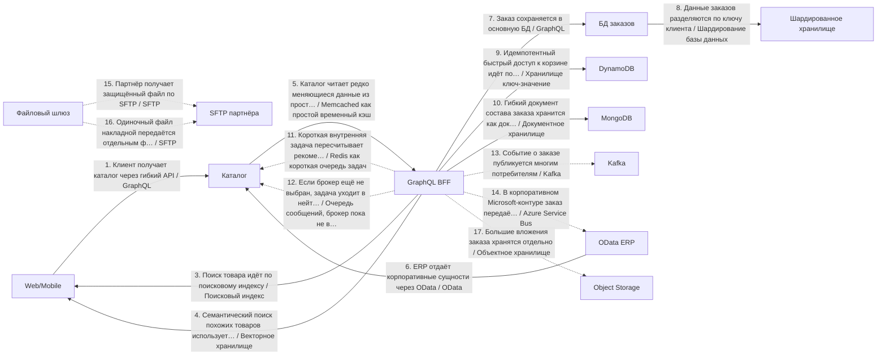
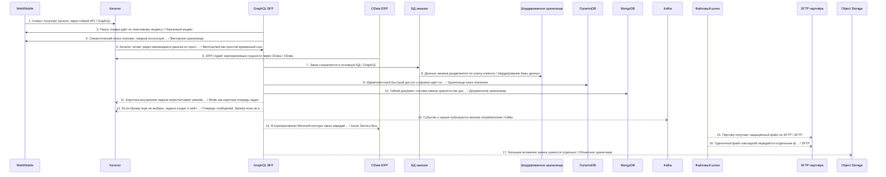
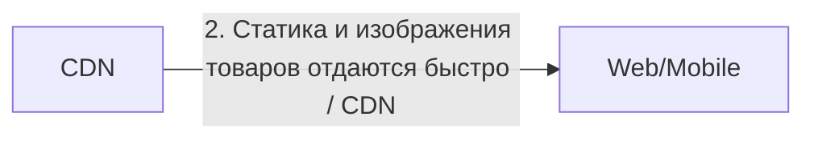

# Архитектурный разбор: Сложный кейс 3: заказ в e-commerce с каталогом, ERP и партнёрами

## Короткий человеческий вывод

**Итог:** НЕ ГОТОВО: есть блокирующие риски. **Архитектурная готовность:** 0.0/10. **Готовность к промышленному запуску:** нельзя выпускать без закрытия блокеров.

**Полнота вводных:** 50%. **Надёжность рекомендаций:** низкая.

**Масштаб процесса:** 17 взаимодействий, из них 16 в основной цепочке и 1 сквозных контролей. Участников: 20.

**Бизнес-цель:** Клиент создаёт заказ, нужны каталог, поиск, ERP, партнёрский файл, события и масштабирование хранения.
**Основная сущность:** Order. Деньги: да. Регуляторика: да. Клиентский сценарий: да.

**Как читать оценку:** низкая оценка не означает, что все выбранные технологии неправильные. Она означает, что до запуска есть блокеры: не закрыты гарантии доставки, восстановления, безопасности, сверки или эксплуатации.

## Что блокирует запуск

| Приоритет | Проблема | Где проявляется | Что сделать |
|---|---|---|---|
| Критический | Финансовую сущность изменяют несколько систем одновременно. | GraphQL BFF, Шардированное хранилище | Назначьте единственного писателя для счёта или шарда и ведите неизменяемый журнал проводок; остальные системы должны отправлять команды, а не менять финансовое состояние напрямую. |
| Высокий | Замена legacy-системы описана без плана переключения. | Весь процесс | Используйте strangler-подход: параллельный прогон со сверкой старого и нового контура, поэтапное переключение трафика по процентам или сегментам, критерии переключения и план отката с сохранением данных, накопленных в новом контуре. |
| Высокий | В регуляторном процессе не описан аудиторский след. | Весь процесс | Ведите неизменяемый журнал операций с политикой срока хранения и сохраняйте evidence на каждый значимый переход статуса. |
| Высокий | В процессе есть слишком длинная синхронная цепочка: 3 блокирующих шага подряд. | Клиент получает каталог через гибкий API → Заказ сохраняется в основную БД → Гибкий документ состава заказа хранится как документ | Разорвите цепочку: после первого подтверждённого шага переводите дальнейшую обработку в события или очередь, а клиенту возвращайте идентификатор отслеживания и понятную статусную модель процесса. |
| Высокий | Дочерний вызов может ждать дольше, чем родительский шаг. | Затронуто мест: 2 | Таймауты должны строго убывать вниз по цепочке: дочерний таймаут должен быть меньше родительского с учётом сетевых накладных; общий бюджет времени распределяйте от целевого времени ответа сверху вниз. |
| Высокий | Повторы в синхронной цепочке усиливают друг друга. | «Клиент получает каталог через гибкий API» → «Заказ сохраняется в основную БД» → «Гибкий документ состава заказа хранится как документ» | Задайте единый бюджет повторов на весь запрос (общий предельный срок ожидания), предохранитель внешнего вызова на каждом звене и экспоненциальное увеличение паузы между повторами со случайным разбросом; не повторяйте вызовы, которые уже не успеют уложиться в целевое время ответа. |
| Высокий | Процесс блокируется на вызове внешней системы. | Затронуто мест: 3 | Настройте таймаут, предохранитель внешнего вызова и запасной сценарий-ответ; если бизнес-сценарий позволяет, переведите шаг в асинхронную обработку через очередь с компенсацией. |
| Высокий | Высоконагруженный поток не имеет контролей приёма потока. | Пик 6000 RPS: «Короткая внутренняя задача пересчитывает рекомендации», «Если брокер ещё не выбран, задача уходит в нейтральную очередь», «Событие о заказе публикуется многим потребителям» | Используйте партиционирование по ключу и контроль горячих партиций; учитывайте время события и контрольную отметку загрузки с политикой обработки запоздалых событий; настройте обратное давление и алерты на лаг и пропускную способность. |
| Информация | Ещё 12 менее приоритетных замечаний | См. приложение с полным чек-листом | Разобрать после закрытия основных блокеров |

## Рекомендуемый порядок действий

1. Назначить единственного владельца финансовой сущности и запретить прямую запись из остальных систем.
2. Добавить сверку ожидаемых и фактических данных и процедуру восстановления расхождений.
3. Для асинхронных участков описать лимит повторов, очередь ошибок, владельца разбора и повторную обработку.
4. Разорвать длинные синхронные цепочки: вернуть идентификатор отслеживания и вынести хвост обработки в очередь или событие.
5. Пересчитать бюджет таймаутов сверху вниз: дочерний вызов должен завершаться раньше родительского.
6. Описать план перехода со старого контура: параллельный прогон, критерии переключения и откат.
7. Для высоконагруженного потока описать партиционирование, горячие ключи, обратное давление и алерты на лаг.
8. После исправлений повторить архитектурную проверку и зафиксировать принятые компромиссы в ADR.

## Проверка логики схемы

Схема не содержит очевидных противоречий между названием связи, участниками и выбранным основным способом взаимодействия.

## Почему выбраны технологии и способы взаимодействия

### Объяснение по шагам

Решения ниже сгруппированы по смыслу. В основной цепочке показано, **кто с кем взаимодействует и каким способом**. Сквозные вещи — аудит, безопасность, авторизация, наблюдаемость, секреты — вынесены отдельно и не смешиваются с бизнес-потоком.

Для каждого решения указано: **Почему выбрано**, **Почему не другой вариант**, **Обязательные условия**, **Почему предлагается именно так** и **Почему нельзя просто не делать**.

### API и онлайн-взаимодействие

### Шаг 1. Клиент получает каталог через гибкий API

**Что:** шаг 1 — «Клиент получает каталог через гибкий API». Основной способ взаимодействия: GraphQL.
**Где:** связь идёт от «Web/Mobile» к «Каталог». Исполнитель: «GraphQL BFF». Выполняется после: начало процесса или внешний запуск.
**Почему:** Подходит для гибкого чтения, когда разные клиенты хотят получать разные наборы полей и не нужен отдельный REST-метод под каждую форму экрана.
**Почему не другой вариант:** REST проще для стабильных команд и фиксированных ресурсов. GraphQL хуже, если нет контроля сложности запроса и прав на уровне полей.
**Что проверить перед выпуском:** Нужны авторизация полей, лимит глубины/сложности запроса, пагинация, защита от тяжёлых запросов и понятный контракт схемы.

### Шаг 6. ERP отдаёт корпоративные сущности через OData

**Что:** шаг 6 — «ERP отдаёт корпоративные сущности через OData». Основной способ взаимодействия: OData.
**Где:** связь идёт от «Каталог» к «Каталог». Исполнитель: «OData ERP». Выполняется после: шаг 1 «Клиент получает каталог через гибкий API».
**Почему:** Подходит для корпоративного API по сущностям, где нужны стандартные фильтры, сортировка, выбор полей и интеграция с enterprise-инструментами.
**Почему не другой вариант:** REST проще для произвольных команд. GraphQL гибче для клиентских экранов, но хуже вписывается в контур, где уже принят OData-подход к сущностям.
**Что проверить перед выпуском:** Нужны ограничения фильтров, права на поля, лимит размера ответа, версионирование сущностей и аудит доступа.

### Шаг 7. Заказ сохраняется в основную БД

**Что:** шаг 7 — «Заказ сохраняется в основную БД». Основной способ взаимодействия: GraphQL.
**Где:** связь идёт от «GraphQL BFF» к «БД заказов». Исполнитель: «GraphQL BFF». Выполняется после: шаг 1 «Клиент получает каталог через гибкий API».
**Почему:** Подходит для гибкого чтения, когда разные клиенты хотят получать разные наборы полей и не нужен отдельный REST-метод под каждую форму экрана.
**Почему не другой вариант:** REST проще для стабильных команд и фиксированных ресурсов. GraphQL хуже, если нет контроля сложности запроса и прав на уровне полей.
**Служебные компоненты:** БД процесса нужна как служебный компонент: она фиксирует состояние, ключ идемпотентности и историю шага.
**Что проверить перед выпуском:** Нужны авторизация полей, лимит глубины/сложности запроса, пагинация, защита от тяжёлых запросов и понятный контракт схемы.

### Асинхронный обмен

### Шаг 11. Короткая внутренняя задача пересчитывает рекомендации

**Что:** шаг 11 — «Короткая внутренняя задача пересчитывает рекомендации». Основной способ взаимодействия: Redis как короткая очередь задач.
**Где:** связь идёт от «GraphQL BFF» к «Каталог». Исполнитель: «очередь Redis». Выполняется после: шаг 7 «Заказ сохраняется в основную БД».
**Почему:** Подходит для простых фоновых задач с коротким сроком жизни, где допустимы ограничения Redis.
**Почему не другой вариант:** RabbitMQ надёжнее для критичных очередь задач. Kafka лучше подходит для событий и повторной обработки. БД-таблица проще, но хуже по производительности очереди.
**Что проверить перед выпуском:** Нужны TTL, повторные попытки, обработка зависших задач и понимание риска потери при неверной настройке сохранность данных.

### Шаг 12. Если брокер ещё не выбран, задача уходит в нейтральную очередь

**Что:** шаг 12 — «Если брокер ещё не выбран, задача уходит в нейтральную очередь». Основной способ взаимодействия: Очередь сообщений, брокер пока не выбран.
**Где:** связь идёт от «GraphQL BFF» к «Каталог». Исполнитель: «Generic queue». Выполняется после: шаг 7 «Заказ сохраняется в основную БД».
**Почему:** Подходит как нейтральное решение, когда известно, что нужна асинхронная очередь, но конкретный брокер ещё не утверждён.
**Почему не другой вариант:** REST не подходит для отложенной обработки. Kafka/RabbitMQ/Redis выбираются позже по требованиям: журнал событий, маршрутизация, надёжность, нагрузка и стоимость эксплуатации.
**Что проверить перед выпуском:** Нужно отдельно выбрать брокер, определить модель подтверждения, лимит повторов, очередь ошибок и владельца разбора.

### Шаг 13. Событие о заказе публикуется многим потребителям

**Что:** шаг 13 — «Событие о заказе публикуется многим потребителям». Основной способ взаимодействия: Kafka.
**Где:** связь идёт от «GraphQL BFF» к «Kafka». Исполнитель: «Kafka». Выполняется после: шаг 7 «Заказ сохраняется в основную БД».
**Почему:** Подходит для потока событий, высокой нагрузки, повторной обработки, хранения истории событий и рассылки нескольким потребителям.
**Почему не другой вариант:** REST не подходит, если потребителей несколько и результат не нужен немедленно. RabbitMQ проще для очереди задач, но хуже как долговременный журнал событий. Redis Streams легче, но обычно слабее для критичного журнала событий.
**Служебные компоненты:** Если перед публикацией меняется состояние в БД, нужна таблица исходящих сообщений: изменение состояния и подготовка сообщения должны быть атомарными. Нужна сверка полноты между источником и аналитическим контуром: количество записей, ключи, контрольные суммы и отчёт расхождений.
**Что проверить перед выпуском:** Нужны топик, ключ партиционирования, группа потребителей, срок хранения, очередь ошибок или карантин и инструкция повторной обработки.

### Шаг 14. В корпоративном Microsoft-контуре заказ передаётся в очередь

**Что:** шаг 14 — «В корпоративном Microsoft-контуре заказ передаётся в очередь». Основной способ взаимодействия: Azure Service Bus.
**Где:** связь идёт от «GraphQL BFF» к «OData ERP». Исполнитель: «Azure Service Bus». Выполняется после: шаг 13 «Событие о заказе публикуется многим потребителям».
**Почему:** Подходит для управляемой очереди/топика в Microsoft Azure, особенно если уже используется Azure AD, Logic Apps или корпоративный Microsoft-контур.
**Почему не другой вариант:** RabbitMQ/Kafka требуют отдельного сопровождения. AWS SNS/SQS или Google Pub/Sub выбираются в других облаках. очередь Redis слабее для критичной enterprise-очереди.
**Что проверить перед выпуском:** Нужно пространство имён, очередь, топик или подписка, очередь ошибок, срок блокировки сообщения, политика повторных попыток, ролевая модель доступа и мониторинг.

### Данные и чтение

### Шаг 3. Поиск товара идёт по поисковому индексу

**Что:** шаг 3 — «Поиск товара идёт по поисковому индексу». Основной способ взаимодействия: Поисковый индекс.
**Где:** связь идёт от «GraphQL BFF» к «Web/Mobile». Исполнитель: «Search index». Выполняется после: шаг 1 «Клиент получает каталог через гибкий API».
**Почему:** Подходит для полнотекстового поиска, фильтрации по многим полям и быстрых пользовательских выборок.
**Почему не другой вариант:** БД может быть источником истины, но не всегда удобна для полнотекстового поиска. Redis ускоряет чтение по ключу, но не заменяет поисковый индекс.
**Что проверить перед выпуском:** Нужны переиндексация, контроль отставания индекса, правила актуализации и понятная свежесть данных для пользователя.

### Шаг 4. Семантический поиск похожих товаров использует векторы

**Что:** шаг 4 — «Семантический поиск похожих товаров использует векторы». Основной способ взаимодействия: Векторное хранилище.
**Где:** связь идёт от «GraphQL BFF» к «Web/Mobile». Исполнитель: «Векторный поиск». Выполняется после: шаг 1 «Клиент получает каталог через гибкий API».
**Почему:** Подходит для семантического поиска по текстам, похожих документов, эмбеддингов и сценариев поиска по смыслу.
**Почему не другой вариант:** Обычный search лучше для точных фильтров и полнотекста. Реляционная БД не предназначена как основной движок similarity search.
**Что проверить перед выпуском:** Нужны модель эмбеддингов, версия векторов, переиндексация, контроль качества поиска и правила доступа к исходным текстам.

### Шаг 5. Каталог читает редко меняющиеся данные из простого временного кэша

**Что:** шаг 5 — «Каталог читает редко меняющиеся данные из простого временного кэша». Основной способ взаимодействия: Memcached как простой временный кэш.
**Где:** связь идёт от «Каталог» к «GraphQL BFF». Исполнитель: «Memcached». Выполняется после: шаг 1 «Клиент получает каталог через гибкий API».
**Почему:** Подходит для простого временного кэша без сложных структур, когда нужна высокая скорость чтения и допустима потеря кэша.
**Почему не другой вариант:** Redis богаче по структурам данных и сценариям блокировок/streams. БД остаётся источником истины, но не должна держать весь горячий read-трафик.
**Что проверить перед выпуском:** Нужны TTL, стратегия инвалидации, запасной сценарий к источнику, лимит размера значений и защита от лавины одновременных обращений к источнику данных.

### Шаг 8. Данные заказов разделяются по ключу клиента

**Что:** шаг 8 — «Данные заказов разделяются по ключу клиента». Основной способ взаимодействия: Шардирование базы данных.
**Где:** связь идёт от «БД заказов» к «Шардированное хранилище». Исполнитель: «Шардированное хранилище». Выполняется после: шаг 7 «Заказ сохраняется в основную БД».
**Почему:** Подходит, когда объём данных или запись по одному хранилищу уже не масштабируется и есть естественный ключ разделения.
**Почему не другой вариант:** Реплика чтения разгружает только нагрузку на чтение. Кэш не решает рост записи и объёма. Шардирование нельзя вводить без ключа доступа и стратегии ребалансировки.
**Служебные компоненты:** БД процесса нужна как служебный компонент: она фиксирует состояние, ключ идемпотентности и историю шага.
**Что проверить перед выпуском:** Нужны ключ шардинга, правила ребалансировки, ограничения межшардовых запросов, миграция данных и тесты горячих ключей.

### Шаг 9. Идемпотентный быстрый доступ к корзине идёт по ключу

**Что:** шаг 9 — «Идемпотентный быстрый доступ к корзине идёт по ключу». Основной способ взаимодействия: Хранилище ключ-значение.
**Где:** связь идёт от «GraphQL BFF» к «GraphQL BFF». Исполнитель: «DynamoDB». Выполняется после: шаг 7 «Заказ сохраняется в основную БД».
**Почему:** Подходит для быстрого доступа по ключу в управляемом key-value/NoSQL-хранилище с предсказуемыми сценариями доступа.
**Почему не другой вариант:** Реляционная БД лучше для сложных связей и транзакционных запросов. Cassandra чаще выбирается для самостоятельно сопровождаемой распределённой модели. Redis не источник истины для долговременных бизнес-данных.
**Что проверить перед выпуском:** Нужен ключ партиционирования, ключ сортировки, условная запись, TTL, лимиты пропускной способности и защита от горячих ключей.

### Шаг 10. Гибкий документ состава заказа хранится как документ

**Что:** шаг 10 — «Гибкий документ состава заказа хранится как документ». Основной способ взаимодействия: Документное хранилище.
**Где:** связь идёт от «GraphQL BFF» к «GraphQL BFF». Исполнитель: «MongoDB». Выполняется после: шаг 7 «Заказ сохраняется в основную БД».
**Почему:** Подходит для гибких документов и меняющейся структуры, когда сущность удобнее хранить как документ, а не как набор жёстких таблиц.
**Почему не другой вариант:** Реляционная БД лучше для строгих связей, транзакций и отчётности по нормализованной модели. Key-value проще, но хуже для сложного документа и индексов по полям.
**Что проверить перед выпуском:** Нужны схема документа, индексы, правила миграции структуры, лимит размера документа и стратегия консистентности.

### Файлы и доставка контента

### Шаг 15. Партнёр получает защищённый файл по SFTP

**Что:** шаг 15 — «Партнёр получает защищённый файл по SFTP». Основной способ взаимодействия: SFTP.
**Где:** связь идёт от «Файловый шлюз» к «SFTP партнёра». Исполнитель: «SFTP партнёра». Выполняется после: шаг 13 «Событие о заказе публикуется многим потребителям».
**Почему:** Подходит для защищённого файлового обмена с legacy или внешним контрагентом, когда API недоступен или запрещён регламентом.
**Почему не другой вариант:** REST/gRPC удобнее для оперативных запросов, но не подходят, если партнёр работает только файлами. Kafka/RabbitMQ обычно не доступны между организациями без отдельного соглашения.
**Служебные компоненты:** Если партнёр вернёт результат позже, нужен отдельный входящий шаг: партнёр присылает статус в сервис процесса с подписью и дедупликацией.
**Что проверить перед выпуском:** Нужны имя файла, контрольная сумма, идентификатор пакета, журнал загрузки, карантин ошибок и повторная обработка файла.

### Шаг 16. Одиночный файл накладной передаётся отдельным файлом

**Что:** шаг 16 — «Одиночный файл накладной передаётся отдельным файлом». Основной способ взаимодействия: SFTP.
**Где:** связь идёт от «Файловый шлюз» к «SFTP партнёра». Исполнитель: «Файловый шлюз». Выполняется после: шаг 13 «Событие о заказе публикуется многим потребителям».
**Почему:** Подходит для защищённого файлового обмена с legacy или внешним контрагентом, когда API недоступен или запрещён регламентом.
**Почему не другой вариант:** REST/gRPC удобнее для оперативных запросов, но не подходят, если партнёр работает только файлами. Kafka/RabbitMQ обычно не доступны между организациями без отдельного соглашения.
**Служебные компоненты:** Если партнёр вернёт результат позже, нужен отдельный входящий шаг: партнёр присылает статус в сервис процесса с подписью и дедупликацией.
**Что проверить перед выпуском:** Нужны имя файла, контрольная сумма, идентификатор пакета, журнал загрузки, карантин ошибок и повторная обработка файла.

### Шаг 17. Большие вложения заказа хранятся отдельно

**Что:** шаг 17 — «Большие вложения заказа хранятся отдельно». Основной способ взаимодействия: Объектное хранилище.
**Где:** связь идёт от «GraphQL BFF» к «Object Storage». Исполнитель: «Object Storage». Выполняется после: шаг 7 «Заказ сохраняется в основную БД».
**Почему:** Подходит для хранения больших файлов, документов, сканов и вложений, когда в сообщениях нужно передавать только ссылку.
**Почему не другой вариант:** БД не стоит нагружать большими бинарными файлами. Kafka/RabbitMQ не должны переносить тяжёлые документы. File/SFTP могут быть транспортом, но не обязательно удобным хранилищем.
**Что проверить перед выпуском:** Нужны права доступа, срок хранения, шифрование, антивирусная проверка и запрет публичных ссылок без срока действия.

## Сквозные контроли и служебные компоненты

Эти элементы не являются отдельными бизнес-шагами. Они применяются к процессу как контроль безопасности, эксплуатации, аудита или инфраструктуры.

### Контроль 2. Статика и изображения товаров отдаются быстро

**Назначение:** CDN.
**Где применяется:** «CDN» → «Web/Mobile» или ко всему процессу.
**Зачем нужен:** Подходит для быстрой раздачи статических файлов или публичных/полупубличных вложений пользователям в разных регионах.
**Что проверить:** Нужны правила кэширования, очистка кэша, срок жизни ссылки, приватный доступ, защита от утечки и стратегия обновления файлов.

## Контрольные проверки готовности к промышленному запуску

| Область | Статус | Что важно |
|---|---|---|
| Контракт | Блокирует выпуск | Каждое событие содержит стандартную обёртку события.; Для клиентского API описана модель ошибок. |
| Надёжность | Блокирует выпуск | Для внешних блокирующих вызовов описаны предохранитель внешнего вызова и деградация.; Для асинхронной обработки задан лимит попыток и очередь ошибок или карантин.; После исправления ошибки есть понятная процедура повторной обработки. |
| Целостность данных | Блокирует выпуск | Для процесса предусмотрена сверка.; У основной сущности есть владелец и единственный писатель. |
| Наблюдаемость | Блокирует выпуск | Для процесса настроены метрики, алерты и дашборды. |
| Безопасность | Проходит | Явных проблем не найдено. |
| Производительность | Требует проверки | Для нагрузки описаны пропускная способность, обратное давление и отставание потребителей. |
| Эксплуатация и внедрение | Проходит | Явных проблем не найдено. |

## Какие вводные нужно уточнить

| Приоритет | Область | Что уточнить | Почему важно |
|---|---|---|---|
| high | Надёжность | Куда попадает сообщение после исчерпания попыток? | Без очереди ошибок/карантина poison message может потеряться или бесконечно крутиться. |
| high | Восстановление | Как выполнить повторную обработку после исправления ошибки? | очередь ошибок сама по себе не восстанавливает бизнес-процесс. |
| medium | Данные | Какой natural/бизнес-ключ или operationId уникально определяет операцию? | Без уникального ключа сложно гарантировать dedup и повторную обработку без дублей. |
| medium | Внешние системы | Какие лимиты запросов у внешних систем и что делать при 429/лимите? | Без лимитов нельзя оценить пиковую нагрузку и обратное давление. |
| medium | целевое время ответа | Какое целевое время ответа и таймаут для пользовательского или системного ответа? | Без целевого времени ответа невозможно распределить бюджет таймаутов и понять, где нужна async-граница. |
| medium | Сверка | Как сверяются расхождения между источником истины и потребителями? | Техническая доставка не гарантирует бизнесовую полноту и согласованность. |
| Информация | Владение | Кто владельцы систем, контрактов и алертов? | Без владельцев неясны ответственность и эскалация. |

## Краткая сводка по стеку

| Технология / способ | Где применяется |
|---|---:|
| GraphQL | 2 |
| SFTP | 2 |
| Azure Service Bus | 1 |
| Kafka | 1 |
| Memcached как простой временный кэш | 1 |
| OData | 1 |
| Redis как короткая очередь задач | 1 |
| Векторное хранилище | 1 |
| Документное хранилище | 1 |
| Объектное хранилище | 1 |
| Очередь сообщений, брокер пока не выбран | 1 |
| Поисковый индекс | 1 |
| Хранилище ключ-значение | 1 |
| Шардирование базы данных | 1 |

<details>
<summary>Приложение A. Полная таблица по всем шагам</summary>

| Шаг | Связь | Основной способ | Что проверить |
|---|---|---|---|
| 1. Клиент получает каталог через гибкий API | Web/Mobile → Каталог. Исполнитель: GraphQL BFF | GraphQL | Нужны авторизация полей, лимит глубины/сложности запроса, пагинация, защита от тяжёлых запросов и понятный контракт схемы. |
| 3. Поиск товара идёт по поисковому индексу | GraphQL BFF → Web/Mobile. Исполнитель: Search index | Поисковый индекс | Нужны переиндексация, контроль отставания индекса, правила актуализации и понятная свежесть данных для пользователя. |
| 4. Семантический поиск похожих товаров использует векторы | GraphQL BFF → Web/Mobile. Исполнитель: Векторный поиск | Векторное хранилище | Нужны модель эмбеддингов, версия векторов, переиндексация, контроль качества поиска и правила доступа к исходным текстам. |
| 5. Каталог читает редко меняющиеся данные из простого временного кэша | Каталог → GraphQL BFF. Исполнитель: Memcached | Memcached как простой временный кэш | Нужны TTL, стратегия инвалидации, запасной сценарий к источнику, лимит размера значений и защита от лавины одновременных обращений к источнику данных. |
| 6. ERP отдаёт корпоративные сущности через OData | OData ERP → Каталог. Исполнитель: OData ERP | OData | Нужны ограничения фильтров, права на поля, лимит размера ответа, версионирование сущностей и аудит доступа. |
| 7. Заказ сохраняется в основную БД | GraphQL BFF → БД заказов. Исполнитель: GraphQL BFF | GraphQL | Нужны авторизация полей, лимит глубины/сложности запроса, пагинация, защита от тяжёлых запросов и понятный контракт схемы. |
| 8. Данные заказов разделяются по ключу клиента | БД заказов → Шардированное хранилище. Исполнитель: Шардированное хранилище | Шардирование базы данных | Нужны ключ шардинга, правила ребалансировки, ограничения межшардовых запросов, миграция данных и тесты горячих ключей. |
| 9. Идемпотентный быстрый доступ к корзине идёт по ключу | GraphQL BFF → DynamoDB. Исполнитель: DynamoDB | Хранилище ключ-значение | Нужен ключ партиционирования, ключ сортировки, условная запись, TTL, лимиты пропускной способности и защита от горячих ключей. |
| 10. Гибкий документ состава заказа хранится как документ | GraphQL BFF → MongoDB. Исполнитель: MongoDB | Документное хранилище | Нужны схема документа, индексы, правила миграции структуры, лимит размера документа и стратегия консистентности. |
| 11. Короткая внутренняя задача пересчитывает рекомендации | GraphQL BFF → Каталог. Исполнитель: очередь Redis | Redis как короткая очередь задач | Нужны TTL, повторные попытки, обработка зависших задач и понимание риска потери при неверной настройке сохранность данных. |
| 12. Если брокер ещё не выбран, задача уходит в нейтральную очередь | GraphQL BFF → Каталог. Исполнитель: Generic queue | Очередь сообщений, брокер пока не выбран | Нужно отдельно выбрать брокер, определить модель подтверждения, лимит повторов, очередь ошибок и владельца разбора. |
| 13. Событие о заказе публикуется многим потребителям | GraphQL BFF → Kafka. Исполнитель: Kafka | Kafka | Нужны топик, ключ партиционирования, группа потребителей, срок хранения, очередь ошибок или карантин и инструкция повторной обработки. |
| 14. В корпоративном Microsoft-контуре заказ передаётся в очередь | GraphQL BFF → OData ERP. Исполнитель: Azure Service Bus | Azure Service Bus | Нужно пространство имён, очередь, топик или подписка, очередь ошибок, срок блокировки сообщения, политика повторных попыток, ролевая модель доступа и мониторинг. |
| 15. Партнёр получает защищённый файл по SFTP | Файловый шлюз → SFTP партнёра. Исполнитель: SFTP партнёра | SFTP | Нужны имя файла, контрольная сумма, идентификатор пакета, журнал загрузки, карантин ошибок и повторная обработка файла. |
| 16. Одиночный файл накладной передаётся отдельным файлом | Файловый шлюз → SFTP партнёра. Исполнитель: Файловый шлюз | SFTP | Нужны имя файла, контрольная сумма, идентификатор пакета, журнал загрузки, карантин ошибок и повторная обработка файла. |
| 17. Большие вложения заказа хранятся отдельно | GraphQL BFF → Object Storage. Исполнитель: Object Storage | Объектное хранилище | Нужны права доступа, срок хранения, шифрование, антивирусная проверка и запрет публичных ссылок без срока действия. |

</details>

<details>
<summary>Приложение B. Найденные риски и слабые места</summary>

## Найденные риски и слабые места

### Критично

#### Финансовую сущность изменяют несколько систем одновременно.

**Что:** найден риск «Финансовую сущность изменяют несколько систем одновременно.». затронуто мест: 1.
**Затронутые места:** GraphQL BFF, Шардированное хранилище.
**Почему это важно:** Несколько писателей баланса или лимита без единого владельца данных — это прямой путь к расхождениям, двойному списанию и сложным инцидентам.
**Что нужно сделать:** Назначьте единственного писателя для счёта или шарда и ведите неизменяемый журнал проводок; остальные системы должны отправлять команды, а не менять финансовое состояние напрямую.

### Высокий риск

#### Замена legacy-системы описана без плана переключения.

**Что:** найден риск «Замена legacy-системы описана без плана переключения.». затронуто мест: 1.
**Затронутые места:** Весь процесс.
**Почему это важно:** Миграция — это не просто «включили новое»: без параллельного прогона и плана отката первый серьёзный дефект нового контура может остановить бизнес.
**Что нужно сделать:** Используйте strangler-подход: параллельный прогон со сверкой старого и нового контура, поэтапное переключение трафика по процентам или сегментам, критерии переключения и план отката с сохранением данных, накопленных в новом контуре.

#### В регуляторном процессе не описан аудиторский след.

**Что:** найден риск «В регуляторном процессе не описан аудиторский след.». затронуто мест: 1.
**Затронутые места:** Весь процесс.
**Почему это важно:** Юридически значимые шаги требуют доказуемой истории: кто, что, когда и на каком основании выполнил.
**Что нужно сделать:** Ведите неизменяемый журнал операций с политикой срока хранения и сохраняйте evidence на каждый значимый переход статуса.

#### В процессе есть слишком длинная синхронная цепочка: 3 блокирующих шага подряд.

**Что:** найден риск «В процессе есть слишком длинная синхронная цепочка: 3 блокирующих шага подряд.». затронуто мест: 1.
**Затронутые места:** Клиент получает каталог через гибкий API → Заказ сохраняется в основную БД → Гибкий документ состава заказа хранится как документ.
**Почему это важно:** Каждое синхронное звено увеличивает вероятность отказа и добавляет задержку к общему времени ответа; если откажет любое звено, весь пользовательский или системный запрос завершится ошибкой.
**Что нужно сделать:** Разорвите цепочку: после первого подтверждённого шага переводите дальнейшую обработку в события или очередь, а клиенту возвращайте идентификатор отслеживания и понятную статусную модель процесса.

#### Дочерний вызов может ждать дольше, чем родительский шаг.

**Что:** найден риск «Дочерний вызов может ждать дольше, чем родительский шаг.». затронуто мест: 2.
**Затронутые места:** Затронуто мест: 2.
**Почему это важно:** Родительский шаг завершится по таймауту раньше, чем ответит дочерний вызов; в результате выполненная работа будет потрачена впустую, а запись может «осиротеть»: она есть в БД дочерней системы, но родитель уже считает операцию отказавшей.
**Что нужно сделать:** Таймауты должны строго убывать вниз по цепочке: дочерний таймаут должен быть меньше родительского с учётом сетевых накладных; общий бюджет времени распределяйте от целевого времени ответа сверху вниз.

#### Повторы в синхронной цепочке усиливают друг друга.

**Что:** найден риск «Повторы в синхронной цепочке усиливают друг друга.». затронуто мест: 1.
**Затронутые места:** «Клиент получает каталог через гибкий API» → «Заказ сохраняется в основную БД» → «Гибкий документ состава заказа хранится как документ».
**Почему это важно:** Несколько звеньев с автоматическими повторами друг за другом перемножают количество попыток (N×M×…): при деградации это создаёт шторм повторных попыток и лавинообразный рост нагрузки в самый плохой момент.
**Что нужно сделать:** Задайте единый бюджет повторов на весь запрос (общий предельный срок ожидания), предохранитель внешнего вызова на каждом звене и экспоненциальное увеличение паузы между повторами со случайным разбросом; не повторяйте вызовы, которые уже не успеют уложиться в целевое время ответа.

#### Процесс блокируется на вызове внешней системы.

**Что:** найден риск «Процесс блокируется на вызове внешней системы.». затронуто мест: 3.
**Затронутые места:** Затронуто мест: 3.
**Почему это важно:** Внешняя система находится вне вашего контроля: её деградация напрямую ухудшает ваше целевое время ответа и может исчерпать пул рабочих потоков.
**Что нужно сделать:** Настройте таймаут, предохранитель внешнего вызова и запасной сценарий-ответ; если бизнес-сценарий позволяет, переведите шаг в асинхронную обработку через очередь с компенсацией.

#### Высоконагруженный поток не имеет контролей приёма потока.

**Что:** найден риск «Высоконагруженный поток не имеет контролей приёма потока.». затронуто мест: 1.
**Затронутые места:** Пик 6000 RPS: «Короткая внутренняя задача пересчитывает рекомендации», «Если брокер ещё не выбран, задача уходит в нейтральную очередь», «Событие о заказе публикуется многим потребителям».
**Почему это важно:** На таком потоке неизбежны out-of-order события, опоздавшие события, горячие партиции и всплески нагрузки, которые потребитель может не обработать вовремя.
**Что нужно сделать:** Используйте партиционирование по ключу и контроль горячих партиций; учитывайте время события и контрольную отметку загрузки с политикой обработки запоздалых событий; настройте обратное давление и алерты на лаг и пропускную способность.

#### Важный асинхронный процесс не имеет сверки.

**Что:** найден риск «Важный асинхронный процесс не имеет сверки.». затронуто мест: 1.
**Затронутые места:** Весь процесс.
**Почему это важно:** Повторная попытка и очередь ошибок закрывают технические сбои, но не доказывают, что все бизнес-сущности дошли до финального состояния и что банк, партнёр или витрина не разошлись по данным.
**Что нужно сделать:** Добавьте регулярную сверку источника истины с потребителями: ожидаемые и фактические данные, отчёт расхождений, автоматическое довосстановление там, где это безопасно, и ручной разбор.

### Средний риск

#### Источник синхронно вызывает несколько потребителей.

**Что:** найден риск «Источник синхронно вызывает несколько потребителей.». затронуто мест: 2.
**Затронутые места:** Затронуто мест: 2.
**Почему это важно:** Один источник синхронно оповещает многих потребителей: добавление нового потребителя требует доработки источника, а отказ любого потребителя замедляет весь сценарий.
**Что нужно сделать:** Публикуйте одно событие через таблица исходящих сообщений, а потребители пусть подписываются на него самостоятельно.

#### Событие не содержит обязательную обёртку события.

**Что:** найден риск «Событие не содержит обязательную обёртку события.». затронуто мест: 1.
**Затронутые места:** «Короткая внутренняя задача пересчитывает рекомендации», «Если брокер ещё не выбран, задача уходит в нейтральную очередь», «Событие о заказе публикуется многим потребителям».
**Почему это важно:** Событие можно доставить, но его сложно дедуплицировать, трассировать, версионировать и восстанавливать после инцидента: не хватает типа события, версии события и времени возникновения события, идентификатор агрегата.
**Что нужно сделать:** Зафиксируйте единую обёртку события: идентификатор события, тип события, версия события, идентификатор агрегата или entityId, сквозной идентификатор или идентификатор трассировки, время возникновения события, производитель события и тело сообщения.

#### Для интеграции не описана модель наблюдаемости.

**Что:** найден риск «Для интеграции не описана модель наблюдаемости.». затронуто мест: 1.
**Затронутые места:** Весь процесс.
**Почему это важно:** Даже корректная архитектура станет неуправляемой при промышленном запуске, если нельзя быстро увидеть, где застряла сущность, растёт ли отставание обработки, сколько сообщений находится в очередь ошибок и какой внешний вызов деградирует.
**Что нужно сделать:** Добавьте технические и бизнес-метрики: latency по шагам, success/error rate, отставание потребителей, количество сообщений в очереди ошибок, количество повторных попыток, контроль возраста статуса, traces по идентификатор сквозной связи и алерты по SLO.

#### Дочерний вызов может ждать дольше, чем родительский шаг.

**Что:** найден риск «Дочерний вызов может ждать дольше, чем родительский шаг.». затронуто мест: 7.
**Затронутые места:** Затронуто мест: 7.
**Почему это важно:** Родительский шаг завершится по таймауту раньше, чем ответит дочерний вызов; в результате выполненная работа будет потрачена впустую.
**Что нужно сделать:** Таймауты должны строго убывать вниз по цепочке: дочерний таймаут должен быть меньше родительского с учётом сетевых накладных; общий бюджет времени распределяйте от целевого времени ответа сверху вниз.

#### У зависимости есть лимиты запросов.

**Что:** найден риск «У зависимости есть лимиты запросов.». затронуто мест: 1.
**Затронутые места:** Шаг 15 «Партнёр получает защищённый файл по SFTP» → SFTP партнёра.
**Почему это важно:** Лимиты провайдера могут превратить пик нагрузки в шторм ошибок 429.
**Что нужно сделать:** Добавьте клиентский ограничитель запросов и очередь выравнивания и увеличение паузы между повторами со случайным разбросом.

#### Для потокового потребителя не описаны обязательные контроли.

**Что:** найден риск «Для потокового потребителя не описаны обязательные контроли.». затронуто мест: 1.
**Затронутые места:** Шаг 14 «В корпоративном Microsoft-контуре заказ передаётся в очередь».
**Почему это важно:** Высоконагруженное чтение из брокера без явных контролей опасно: отставание обработки может расти незаметно, а перегрузка будет ронять потребителя.
**Что нужно сделать:** Добавьте метрику отставание потребителей и алерт; настройте обратное давление или ограничение параллелизма; sink должен быть идемпотентным; позиция чтения нужно коммитить только после обработки; если читается общий топик, добавьте filter ratio как отдельную метрику.

#### Горячее чтение идёт в источник без кэша или проекции.

**Что:** найден риск «Горячее чтение идёт в источник без кэша или проекции.». затронуто мест: 1.
**Затронутые места:** Шаг 10 «Гибкий документ состава заказа хранится как документ» → MongoDB.
**Почему это важно:** Частое чтение синхронно обращается к источнику на критическом пути: его нагрузка и latency становятся вашими, а сам источник превращается в узкое место.
**Что нужно сделать:** Добавьте кэш с TTL и инвалидацией или подготовленную проекцию (модель для чтения/CQRS); для статических данных используйте CDN, а в источник обращайтесь только при промахе кэша.

#### Для порядка событий в рамках сущности не задан ключ партиционирования.

**Что:** найден риск «Для порядка событий в рамках сущности не задан ключ партиционирования.». затронуто мест: 1.
**Затронутые места:** «Короткая внутренняя задача пересчитывает рекомендации», «Если брокер ещё не выбран, задача уходит в нейтральную очередь», «Событие о заказе публикуется многим потребителям», «В корпоративном Microsoft-контуре заказ передаётся в очередь».
**Почему это важно:** Без ключ партиционирования события одной сущности могут разойтись по разным партициям и быть обработаны в неправильном порядке.
**Что нужно сделать:** Партиционируйте события по entityId и явно укажите этот ключ во входных данных шага.

### Информация

#### Концентрация критического пути в одной системе

**Что:** найден риск «Концентрация критического пути в одной системе». затронуто мест: 1.
**Затронутые места:** GraphQL BFF: 2 блокирующих шага.
**Почему это важно:** Система — единая точка отказа сценария.
**Что нужно сделать:** Проверить её HA/DR-план; рассмотреть деградацию сценария при её отказе.

#### Для критичной системы не указан владелец.

**Что:** найден риск «Для критичной системы не указан владелец.». затронуто мест: 16.
**Затронутые места:** Затронуто мест: 16.
**Почему это важно:** При инциденте будет непонятно, кто отвечает за целевое время ответа, контракт, лимиты, повторная обработка и согласование изменений.
**Что нужно сделать:** Зафиксируйте владельца системы или команды, канал поддержки, SLO и порядок эскалации.

#### Для служебных таблиц не описана политика роста и очистки.

**Что:** найден риск «Для служебных таблиц не описана политика роста и очистки.». затронуто мест: 1.
**Затронутые места:** outbox, журнал проводок + журнал шагов.
**Почему это важно:** Эти таблицы пополняются на каждое событие; без архивации и партиционирования они со временем ухудшат latency запросов и существенно раздуют БД.
**Что нужно сделать:** Добавьте партиционирование по времени, архивацию или перенос в холодное хранилище, а также очистку опубликованных записей таблицы исходящих сообщений; контролируйте размер таблиц и время запросов к ним.


</details>

<details>
<summary>Приложение C. Сценарная основа для дальнейшей разработки</summary>

## Сценарная основа для дальнейшей разработки

Этот раздел нужен не для выбора технологий, а для постановки на разработку и тестирование: какой поток считается успешным, какие есть альтернативы, что происходит при ошибках и как проверять готовность.

### Основной сценарий

| Шаг | Связь | Что происходит | Ожидаемый результат |
|---|---|---|---|
| 1 | Web/Mobile → Каталог | Клиент получает каталог через гибкий API | получен ответ или понятная ошибка с кодом, таймаутом и идентификатором сквозной связи |
| 3 | GraphQL BFF → Web/Mobile | Поиск товара идёт по поисковому индексу | шаг завершён, результат отражён в статусе процесса или журнале шагов |
| 4 | GraphQL BFF → Web/Mobile | Семантический поиск похожих товаров использует векторы | шаг завершён, результат отражён в статусе процесса или журнале шагов |
| 5 | Каталог → GraphQL BFF | Каталог читает редко меняющиеся данные из простого временного кэша | шаг завершён, результат отражён в статусе процесса или журнале шагов |
| 6 | OData ERP → Каталог | ERP отдаёт корпоративные сущности через OData | получен ответ или понятная ошибка с кодом, таймаутом и идентификатором сквозной связи |
| 7 | GraphQL BFF → БД заказов | Заказ сохраняется в основную БД | получен ответ или понятная ошибка с кодом, таймаутом и идентификатором сквозной связи |
| 8 | БД заказов → Шардированное хранилище | Данные заказов разделяются по ключу клиента | состояние или данные сохранены с защитой от дублей и конкурентных изменений |
| 9 | GraphQL BFF → DynamoDB | Идемпотентный быстрый доступ к корзине идёт по ключу | состояние или данные сохранены с защитой от дублей и конкурентных изменений |
| 10 | GraphQL BFF → MongoDB | Гибкий документ состава заказа хранится как документ | состояние или данные сохранены с защитой от дублей и конкурентных изменений |
| 11 | GraphQL BFF → Каталог | Короткая внутренняя задача пересчитывает рекомендации | сообщение принято в брокер, дальнейшая обработка идёт асинхронно, статус процесса отслеживается отдельно |
| 12 | GraphQL BFF → Каталог | Если брокер ещё не выбран, задача уходит в нейтральную очередь | сообщение принято в брокер, дальнейшая обработка идёт асинхронно, статус процесса отслеживается отдельно |
| 13 | GraphQL BFF → Kafka | Событие о заказе публикуется многим потребителям | сообщение принято в брокер, дальнейшая обработка идёт асинхронно, статус процесса отслеживается отдельно |
| 14 | GraphQL BFF → OData ERP | В корпоративном Microsoft-контуре заказ передаётся в очередь | сообщение принято в брокер, дальнейшая обработка идёт асинхронно, статус процесса отслеживается отдельно |
| 15 | Файловый шлюз → SFTP партнёра | Партнёр получает защищённый файл по SFTP | файл или документ сохранён/передан, контрольная сумма и повторная загрузка обработаны безопасно |
| 16 | Файловый шлюз → SFTP партнёра | Одиночный файл накладной передаётся отдельным файлом | файл или документ сохранён/передан, контрольная сумма и повторная загрузка обработаны безопасно |
| 17 | GraphQL BFF → Object Storage | Большие вложения заказа хранятся отдельно | файл или документ сохранён/передан, контрольная сумма и повторная загрузка обработаны безопасно |

### Альтернативные сценарии

#### Асинхронное принятие заявки без ожидания финального результата

**Когда возникает:** Хвост процесса занимает больше допустимого времени ответа или зависит от внешних систем.
**Как должен пройти сценарий:**
1. Система принимает запрос и создаёт идентификатор отслеживания.
2. Клиенту или вызывающей системе возвращается подтверждение приёма.
3. Дальнейшая обработка идёт через событие/очередь.
4. Статус процесса обновляется после каждого значимого шага.
**Ожидаемый результат:** Пользователь или потребитель видит промежуточный статус, а не зависший запрос.
**Обязательные проверки:** идентификатор отслеживания обязателен; GET /status или событие статуса; финальные статусы должны быть согласованы.

#### Повторная доставка или повторный запрос

**Когда возникает:** Сеть оборвалась, производитель события отправил событие повторно или потребитель переобработал сообщение.
**Как должен пройти сценарий:**
1. Система получает тот же ключ идемпотентности/идентификатор события/бизнес-ключ.
2. Выполняется попытка вставки ключа в таблицу входящих сообщений для защиты от дублей или поиск существующей операции.
3. Если ключ уже обработан, система возвращает прежний результат без повторного изменения бизнес-состояния.
**Ожидаемый результат:** Повтор не создаёт дубль операции, документа, проводки или статуса.
**Обязательные проверки:** UNIQUE-индекс на ключ идемпотентности; фиксация позиции чтения только после успешной обработки; тест дубля обязателен.

#### Внешняя система недоступна или отвечает медленно

**Когда возникает:** Внешняя зависимость вернула таймаут, 5xx, 429 или стала нестабильной.
**Как должен пройти сценарий:**
1. Вызов завершается по таймаут, а не висит бесконечно.
2. Circuit breaker ограничивает новые попытки.
3. Если операция критична, она переводится в статус ожидания или ручного разбора.
4. Если данные необязательны, используется запасной сценарий или частичный ответ.
**Ожидаемый результат:** Отказ партнёра не приводит к каскадному отказу всего процесса.
**Обязательные проверки:** таймаут на каждый внешний вызов; предохранитель внешнего вызова; запасной сценарий/очередь/ручной разбор; алерт владельцу зависимости.

#### Ошибка обработки сообщения

**Когда возникает:** потребитель события получил сообщение, но бизнес-обработка завершилась ошибкой.
**Как должен пройти сценарий:**
1. потребитель события выполняет ограниченные повторные попытки с увеличение паузы между повторами.
2. После исчерпания попыток сообщение попадает в очередь ошибок или карантин.
3. Создаётся алерт и задача на разбор.
4. После исправления причины выполняется повторная обработка.
**Ожидаемый результат:** Сообщение не теряется и не крутится бесконечно.
**Обязательные проверки:** максимальное число попыток; очередь ошибок/карантин; инструкция повторной обработки; идемпотентность повторной обработки.

#### Расхождение данных между источником истины и потребителем

**Когда возникает:** Техническая доставка прошла не полностью, повторная обработка былааааааа пропущена или потребитель отстал.
**Как должен пройти сценарий:**
1. Регламентная сверка сравнивает ожидаемые и фактические состояния.
2. Найденные расхождения попадают в отчёт.
3. Безопасные расхождения восстанавливаются автоматически.
4. Опасные расхождения уходят на ручной разбор.
**Ожидаемый результат:** Бизнес видит не только техническую доставку, но и фактическую полноту процесса.
**Обязательные проверки:** регулярная сверка; отчёт расхождений; владелец ручного разбора; аудит исправлений.

#### Асинхронная обработка без ожидания финального результата

**Когда возникает:** Часть процесса длится дольше допустимого времени ответа или зависит от очереди/брокера.
**Как должен пройти сценарий:**
1. создать идентификатор отслеживания.
2. зафиксировать статус PROCESSING.
3. передать сообщение в брокер.
4. обновлять статус по мере обработки.
**Ожидаемый результат:** вызывающая сторона не висит в ожидании, а видит отслеживаемый статус.
**Обязательные проверки:** ключ идемпотентности; очередь ошибок; повторная обработка; метрики отставания.

### Ошибочные сценарии и восстановление

| Ошибка | Где возникает | Как система должна восстановиться |
|---|---|---|
| Финансовую сущность изменяют несколько систем одновременно. | GraphQL BFF, Шардированное хранилище | Назначьте единственного писателя для счёта или шарда и ведите неизменяемый журнал проводок; остальные системы должны отправлять команды, а не менять финансовое состояние напрямую. |
| Важный асинхронный процесс не имеет сверки. | Весь процесс | Добавьте регулярную сверку источника истины с потребителями: ожидаемые и фактические данные, отчёт расхождений, автоматическое довосстановление там, где это безопасно, и ручной разбор. |
| Процесс блокируется на вызове внешней системы. | Затронуто мест: 3. Шаг 2 «Статика и изображения товаров отдаются быстро» → Web/Mobile; Шаг 3 «Поиск товара идёт по поисковому индексу» → Web/Mobile; Шаг 4 «Семантический поиск похожих товаров использует векторы» → Web/Mobile | Настройте таймаут, предохранитель внешнего вызова и запасной сценарий-ответ; если бизнес-сценарий позволяет, переведите шаг в асинхронную обработку через очередь с компенсацией. |
| Замена legacy-системы описана без плана переключения. | Весь процесс | Используйте strangler-подход: параллельный прогон со сверкой старого и нового контура, поэтапное переключение трафика по процентам или сегментам, критерии переключения и план отката с сохранением данных, накопленных в новом контуре. |
| В регуляторном процессе не описан аудиторский след. | Весь процесс | Ведите неизменяемый журнал операций с политикой срока хранения и сохраняйте evidence на каждый значимый переход статуса. |
| Повторы в синхронной цепочке усиливают друг друга. | «Клиент получает каталог через гибкий API» → «Заказ сохраняется в основную БД» → «Гибкий документ состава заказа хранится как документ» | Задайте единый бюджет повторов на весь запрос (общий предельный срок ожидания), предохранитель внешнего вызова на каждом звене и экспоненциальное увеличение паузы между повторами со случайным разбросом; не повторяйте вызовы, которые уже не успеют уложиться в целевое время ответа. |
| Высоконагруженный поток не имеет контролей приёма потока. | Пик 6000 RPS: «Короткая внутренняя задача пересчитывает рекомендации», «Если брокер ещё не выбран, задача уходит в нейтральную очередь», «Событие о заказе публикуется многим потребителям» | Используйте партиционирование по ключу и контроль горячих партиций; учитывайте время события и контрольную отметку загрузки с политикой обработки запоздалых событий; настройте обратное давление и алерты на лаг и пропускную способность. |
| В процессе есть слишком длинная синхронная цепочка: 3 блокирующих шага подряд. | Клиент получает каталог через гибкий API → Заказ сохраняется в основную БД → Гибкий документ состава заказа хранится как документ | Разорвите цепочку: после первого подтверждённого шага переводите дальнейшую обработку в события или очередь, а клиенту возвращайте идентификатор отслеживания и понятную статусную модель процесса. |
| Дочерний вызов может ждать дольше, чем родительский шаг. | Затронуто мест: 2. 1 «Клиент получает каталог через гибкий API» (800мс) → 7 «Заказ сохраняется в основную БД» (800мс); 7 «Заказ сохраняется в основную БД» (800мс) → 8 «Данные заказов разделяются по ключу клиента» (800мс) | Таймауты должны строго убывать вниз по цепочке: дочерний таймаут должен быть меньше родительского с учётом сетевых накладных; общий бюджет времени распределяйте от целевого времени ответа сверху вниз. |

### Критерии приёмки сценариев

- основной сценарий проходит до финального статуса без ручного вмешательства.
- повторный запрос или повторное событие не создаёт дубль бизнес-операции.
- таймаут внешней системы переводит процесс в понятный статус и создаёт алерт.
- сообщение после исчерпания попыток попадает в очередь ошибок или карантин.
- по идентификатору сквозной связи можно найти все шаги процесса.
- Основной успешный сценарий проходит от первого шага до финального статуса без ручного вмешательства.
- Каждый отказ из error-flow переводит процесс в понятный статус и оставляет запись в журнале.
- По сквозной идентификатор / идентификатор отслеживания можно найти все шаги одного процесса в логах и БД.

</details>

<details>
<summary>Приложение D. Артефакты для постановки и выпуска</summary>

## Варианты архитектурного решения

1. **Вариант A — минимально допустимый фикс** — срок короткий и нельзя сильно менять архитектуру.
2. **Вариант B — промышленный запуск-компромисс** — нужен рабочий вариант промышленного запуска для типовой корпоративной интеграции.
3. **Вариант C — целевая архитектура** — поток критичен, регуляторен, денежный или станет платформенным.

## Готовность к выпуску

- Все критичные и высокие находки закрыты или приняты в ADR как осознанный риск.
- Идемпотентность и обработка дублей покрыты автотестами.
- очередь ошибок, повторная обработка и инструкция разбора проверены на тестовом контуре.
- Метрики, алерты и идентификатор сквозной связи видны в логах/трейсах.
- Контрактные тесты производитель события↔потребитель проходят в CI.
- Нагрузочный тест подтверждает целевое время ответа и допустимое отставание обработки.
- Аудиторский журнал неизменяемый проверен.
- Сверка даёт отчёт расхождений.

## Черновик контракта события

- **идентификатор события:** UUID, уникальный идентификатор события
- **тип события:** доменный тип события
- **версия события:** версия схемы
- **идентификатор агрегата:** идентификатор сущности Order
- **идентификатор сквозной связи:** сквозная трассировка процесса
- **время возникновения события:** момент бизнес-события
- **производитель события:** система-источник
- **тело сообщения:** только необходимые доменные поля без лишних ПДн

## Чек-лист проверок и тестов

- Основной успешный сценарий: процесс проходит все шаги до финального статуса.
- Отказ шага 1 «Клиент получает каталог через гибкий API»: таймаут/5xx — процесс не зависает, статус и алерт корректны.
- Отказ шага 2 «Статика и изображения товаров отдаются быстро»: таймаут/5xx — процесс не зависает, статус и алерт корректны.
- Отказ шага 3 «Поиск товара идёт по поисковому индексу»: таймаут/5xx — процесс не зависает, статус и алерт корректны.
- Отказ шага 4 «Семантический поиск похожих товаров использует векторы»: таймаут/5xx — процесс не зависает, статус и алерт корректны.
- Отказ шага 5 «Каталог читает редко меняющиеся данные из простого временного кэша»: таймаут/5xx — процесс не зависает, статус и алерт корректны.
- Отказ шага 6 «ERP отдаёт корпоративные сущности через OData»: таймаут/5xx — процесс не зависает, статус и алерт корректны.
- Отказ шага 7 «Заказ сохраняется в основную БД»: таймаут/5xx — процесс не зависает, статус и алерт корректны.
- Отказ шага 8 «Данные заказов разделяются по ключу клиента»: таймаут/5xx — процесс не зависает, статус и алерт корректны.
- Отказ шага 9 «Идемпотентный быстрый доступ к корзине идёт по ключу»: таймаут/5xx — процесс не зависает, статус и алерт корректны.
- Отказ шага 10 «Гибкий документ состава заказа хранится как документ»: таймаут/5xx — процесс не зависает, статус и алерт корректны.
- Регресс на «Финансовую сущность изменяют несколько систем одновременно.»: Назначьте единственного писателя для счёта или шарда и ведите неизменяемый журнал проводок; остальные системы должны отправлять команды, а не менять финансовое состояние напрямую.
- Регресс на «Важный асинхронный процесс не имеет сверки.»: Добавьте регулярную сверку источника истины с потребителями: ожидаемые и фактические данные, отчёт расхождений, автоматическое довосстановление там, где это безопасно, и ручной разбор.
- Регресс на «Процесс блокируется на вызове внешней системы.»: Настройте таймаут, предохранитель внешнего вызова и запасной сценарий-ответ; если бизнес-сценарий позволяет, переведите шаг в асинхронную обработку через очередь с компенсацией. Затронуто мест: 3.
- Регресс на «Замена legacy-системы описана без плана переключения.»: Используйте strangler-подход: параллельный прогон со сверкой старого и нового контура, поэтапное переключение трафика по процентам или сегментам, критерии переключения и план отката с сохранением данных, накопленных в новом контуре.
- Регресс на «В регуляторном процессе не описан аудиторский след.»: Ведите неизменяемый журнал операций с политикой срока хранения и сохраняйте evidence на каждый значимый переход статуса.
- Регресс на «Повторы в синхронной цепочке усиливают друг друга.»: Задайте единый бюджет повторов на весь запрос (общий предельный срок ожидания), предохранитель внешнего вызова на каждом звене и экспоненциальное увеличение паузы между повторами со случайным разбросом; не повторяйте вызовы, которые уже не успеют уложиться в целевое время ответа.
- Регресс на «Высоконагруженный поток не имеет контролей приёма потока.»: Используйте партиционирование по ключу и контроль горячих партиций; учитывайте время события и контрольную отметку загрузки с политикой обработки запоздалых событий; настройте обратное давление и алерты на лаг и пропускную способность.
- Регресс на «В процессе есть слишком длинная синхронная цепочка: 3 блокирующих шага подряд.»: Разорвите цепочку: после первого подтверждённого шага переводите дальнейшую обработку в события или очередь, а клиенту возвращайте идентификатор отслеживания и понятную статусную модель процесса.
- Регресс на «Дочерний вызов может ждать дольше, чем родительский шаг.»: Таймауты должны строго убывать вниз по цепочке: дочерний таймаут должен быть меньше родительского с учётом сетевых накладных; общий бюджет времени распределяйте от целевого времени ответа сверху вниз. Затронуто мест: 2.
- Дубль события/запроса с тем же ключом обрабатывается ровно один раз.
- Ядовитое сообщение уходит в очередь ошибок после N попыток; повторная обработка восстанавливает обработку.
- Сверка: сумма проводок журнал проводок сходится с агрегатом баланса.

## SQL-черновик хранения

```sql
CREATE TABLE entity (
    id uuid PRIMARY KEY DEFAULT gen_random_uuid(),
    business_id text NOT NULL,
    event_id uuid UNIQUE,
    correlation_id uuid NOT NULL,
    status text NOT NULL,
    created_at timestamptz NOT NULL DEFAULT now(),
    updated_at timestamptz NOT NULL DEFAULT now()
);

CREATE INDEX idx_entity_business_id ON entity (business_id);
CREATE INDEX idx_entity_correlation_id ON entity (correlation_id);

CREATE TABLE entity_step_log (
    id bigserial PRIMARY KEY,
    entity_id uuid NOT NULL REFERENCES entity(id),
    step_name text NOT NULL,
    status text NOT NULL,
    details jsonb,
    occurred_at timestamptz NOT NULL DEFAULT now()
);

CREATE INDEX idx_entity_step_log_entity_id ON entity_step_log (entity_id);

CREATE TABLE outbox (
    id bigserial PRIMARY KEY,
    aggregate_id uuid NOT NULL,
    event_type text NOT NULL,
    event_body jsonb NOT NULL,
    created_at timestamptz NOT NULL DEFAULT now(),
    published_at timestamptz
);

CREATE INDEX idx_outbox_unpublished ON outbox (id) WHERE published_at IS NULL;

CREATE TABLE inbox_dedup (
    event_id uuid PRIMARY KEY,
    source_system text NOT NULL,
    received_at timestamptz NOT NULL DEFAULT now(),
    processed_at timestamptz
);
```

## Диаграммы процесса

Диаграммы строятся по фактической связи «кто → кому». Исполнитель шага не подставляется внутрь маршрута, поэтому схема не должна создавать ложные цепочки вида «источник → исполнитель → получатель».

### Основная схема взаимодействий



### Последовательность основной цепочки



### Сквозные контроли

Эта схема показывает аудит, авторизацию, секреты, маскирование, наблюдаемость и другие сквозные элементы отдельно от бизнес-цепочки.



</details>

<details>
<summary>Приложение E. Обязательный архитектурный чек-лист</summary>

| Область | Статус | Что проверяется | Как закрыть |
|---|---|---|---|
| Внедрение | Блокирует выпуск | Для внедрения описаны переключение, откат и управляемый флаг включения. | Опишите параллельный прогон, сверку, поэтапное включение и критерии отката. |
| Контракт | Блокирует выпуск | Каждое событие содержит стандартную обёртку события. | Стандартизируйте обязательную обёртку события: идентификатор события, тип события, версия события, идентификатор агрегата, время возникновения события и идентификатор сквозной связи. |
| Наблюдаемость | Блокирует выпуск | Для процесса настроены метрики, алерты и дашборды. | Добавьте бизнесовые и технические метрики, алерты и владельцев реакции. |
| Надёжность | Блокирует выпуск | Для внешних блокирующих вызовов описаны предохранитель внешнего вызова и деградация. | Добавьте таймаут, предохранитель внешнего вызова, запасной сценарий, изоляция ресурса и очередь выравнивания нагрузки. |
| Целостность | Блокирует выпуск | Для процесса предусмотрена сверка. | Реализуйте сверку ожидаемых и фактических данных, отчёт расхождений, безопасное авто-восстановление и ручной разбор. |
| Целостность | Блокирует выпуск | Требование к порядку событий и ключу партиционирования явно зафиксировано. | Уточните требование к порядку; для порядка внутри одной сущности используйте ключ партиционирования = entityId. |
| Эксплуатация | Блокирует выпуск | Для служебных таблиц и топиков задан срок хранения и архивирование. | Добавьте партиционирование, TTL, архив, регламентную очистку и мониторинг размера. |
| Контракт | Требует проверки | Для клиентского API описана модель ошибок. | Опишите errorCode, повторяемые, userMessage, technicalMessage и сопоставление HTTP/gRPC. |
| Надёжность | Требует проверки | Для асинхронной обработки задан лимит попыток и очередь ошибок или карантин. | Настройте увеличение паузы между повторами, максимальное число попыток, очередь ошибок, алерт и владельца ручного разбора. |
| Производительность | Требует проверки | Для нагрузки описаны пропускная способность, обратное давление и отставание потребителей. | Проведите нагрузочный тест, задайте лимиты, механизм обратного давления, партиции и алерты на отставание потребителей. |
| Надёжность | Не указано | После исправления ошибки есть понятная процедура повторной обработки. | Опишите ручную и пакетную повторную обработку, требования к идемпотентности и права доступа на запуск. |
| Целостность | Не указано | У основной сущности есть владелец и единственный писатель. | Назначьте system of record; остальные системы должны отправлять команды или события. |
| Безопасность | Проверено | Входящий веб-вызов или обратный вызов проходит проверку подписи. | Используйте HMAC, JWT или mTLS, окно защиты от повторной доставки и ротацию секретов. |
| Безопасность | Проверено | Для ПДн и чувствительных полей описаны маскирование и срок хранения. | Минимизируйте тело сообщения, маскируйте логи, настройте TTL или удаление и роли доступа. |
| Данные | Проверено | Ключ поиска и ключ идемпотентности имеют правильную область уникальности. | Опишите составной ключ и используйте его одинаково в SELECT, UPDATE, UPSERT, уникальном индексе, таблице входящих сообщений, таблице исходящих сообщений и процедуре повторной обработки. Примеры: requestId + operationType + targetSystem + tenantId; operUid + operationType + targetSystem; providerEventId + providerCode. |
| Контракт | Проверено | Для каждого события или API зафиксирована единая схема и версия. | Используйте реестр схем событий, JSON Schema, Avro или Protobuf и добавьте контрактные тесты со стороны потребителя. |
| Наблюдаемость | Проверено | CorrelationId или traceId проходит через всю цепочку. | Передавайте W3C traceparent или идентификатор сквозной связи в запросах, событиях и логах. |
| Наблюдаемость | Проверено | Для процесса описана статусная модель и история переходов. | Опишите статусы, status_history или step_log, а также финальные и промежуточные состояния. |
| Надёжность | Проверено | Повторные попытки не создают дубли бизнес-операций. | Используйте operationId или ключ идемпотентности с уникальным индексом; для входящих событий добавьте таблицу входящих сообщений для защиты от дублей. |
| Надёжность | Проверено | Для каждого блокирующего вызова задан таймаут. | Задайте таймаут на каждом шаге и общий предельный срок ожидания, рассчитанный от целевого времени ответа. |
| Производительность | Проверено | Заявленное целевое время ответа сходится с критическим путём. | Разорвите цепочку, распараллельте независимые шаги, добавьте кэш или уменьшите таймаут. |
| Целостность | Проверено | Для входящих событий и для входящего веб-вызова используется таблица входящих сообщений для защиты от дублей или другой механизм защиты от дублей. | Используйте таблицу входящих сообщений для защиты от дублей с уникальным идентификатор события и фиксируйте позицию чтения только после успешной обработки. |
| Целостность | Проверено | При записи в БД и публикации события используется таблица исходящих сообщений. | Используйте транзакционную таблицу исходящих сообщений: запись события должна выполняться в одной транзакции с изменением агрегата. |

</details>

<details>
<summary>Приложение F. Матрица деталей, которые нельзя забыть</summary>

Матрица деталей: применимо инвариантов из каталога v7.1 — 117 из 125; блокируют выпуск — 13, требуют внимания — 35, нужно уточнить — 47, уже выглядит закрытым — 37.

| Область | Статус | Что проверить | Почему важно | Как закрыть |
|---|---|---|---|---|
| Асинхронность и брокеры | Блокирует выпуск | Partition key должен соответствовать требованию порядка. | Без правильного ключа события одной сущности могут прийти out-of-order. | Используйте entityId/идентификатор агрегата как ключ партиционирования там, где нужен порядок внутри одной сущности. |
| Безопасность | Блокирует выпуск | Чувствительные данные должны иметь правила хранения и отображения. | Интеграция часто случайно уносит ПДн в логи, очередь ошибок, таблицу исходящих сообщений и аналитические витрины и тестовые стенды. | Опишите классификацию полей, маскирование логов, encryption at rest/in transit, срок хранения, права доступа, очистку очередь ошибок и запрет чувствительных данных в технических ошибках. |
| Восстановление | Блокирует выпуск | Техническая доставка должна проверяться бизнесовой сверкой. | Доставка с гарантией «минимум один раз» не гарантирует бизнесовую полноту. Сообщение могло попасть в очередь ошибок, быть пропущено, обработаться частично или устареть. | Добавьте сверка: ожидаемые и фактические данные, отчёт расхождений, автоматическое довосстановление, ручной разбор и аудит исправлений. |
| Комплаенс и аудит | Блокирует выпуск | Юридически значимые действия должны иметь неизменяемый audit trail. | Регуляторика и спорные операции требуют доказуемой истории. | Пишите неизменяемый audit/журнал событий с actor, reason, тело сообщения hash, timestamp. |
| Контракт | Блокирует выпуск | Контракт должен описывать не только поля, но и их смысл. | Сервис может формально принимать JSON, но ломаться на изменении enum, nullable-поля, даты, валюты или статуса. | Добавьте schema/version, examples, required/optional, enum lifecycle, compatibility rules, контрактные тесты производитель события↔потребитель. |
| Контракты | Блокирует выпуск | Каждое событие должно иметь стандартный envelope. | Без стандартной обёртки событие трудно дедуплицировать, трассировать, версионировать и переигрывать. | Утвердите единый envelope для всех событий и контрактные тесты. |
| Наблюдаемость | Блокирует выпуск | CorrelationId должен проходить через всю цепочку. | Без трассировки incident response становится ручным поиском. | Пробрасывайте идентификатор сквозной связи/traceparent во все логи, события, headers и таблицы. |
| Наблюдаемость | Блокирует выпуск | У поддержки должен быть способ найти весь процесс по одному идентификатору. | Без сквозной трассировки даже правильный процесс невозможно поддерживать в режиме инцидента. | Пробросьте сквозной идентификатор или traceId, заведите status history, business metrics, technical metrics, dashboard, alert rules и инструкция разбора. |
| Порядок и конкуренция | Блокирует выпуск | Порядок событий должен быть задан только там, где он действительно нужен. | Лишнее требование глобального порядка убивает масштабирование, а отсутствие порядка внутри одной сущности ломает статусные переходы. | Опишите ключ партиционирования, правила обработки устаревших событий, sequence/version, обработку out-of-order и правила игнорирования устаревших событий. |
| Производительность | Блокирует выпуск | Нужно оценить отставание потребителей. | Лаг превращает почти real-time процесс в пакетную обработку. | Считайте пропускная способность производителя и потребителя события, partitions, processing time и восстановление time. |
| Синхронные API | Блокирует выпуск | Для внешнего вызова нужен предохранитель внешнего вызова. | Иначе деградация партнёра истощит ваши потоки. | Настройте закрыт / открыт / пробный режим, запасной сценарий и метрики breaker state. |
| Целостность данных | Блокирует выпуск | У каждой бизнес-сущности должен быть владелец и единственный писатель. | Несколько писателей создают гонки, потерянные обновления и расхождения между сервисами. | Назначьте system of record. Для остальных систем используйте команды, события, модель для чтения или сверка. |
| Целостность данных | Блокирует выпуск | У сущности должен быть system of record. | Несколько писателей создают потерянные обновления и расхождения. | Назначьте владельца записи; остальные системы отправляют команды или читают проекции. |
| Асинхронность и брокеры | Требует проверки | Async-шаг должен иметь очередь ошибок или карантин. | Иначе poison message теряется или бесконечно крутится. | Настройте максимальное число попыток, увеличение паузы между повторами, очередь ошибок или карантин, владельца и алерт. |
| Асинхронность и брокеры | Требует проверки | Offset должен коммититься только после успешной обработки. | Commit до обработки приводит к потере сообщения при падении. | Коммитьте после транзакционной обработки или используйте таблицы исходящих/входящих сообщений на стороне получателя. |
| Асинхронность и брокеры | Требует проверки | Повторная обработка должна быть безопасной и идемпотентным. | Повторная обработка часто запускается после инцидента и может умножить ущерб. | Опишите команду повторной обработки, права запуска, пробный запуск без изменений, idempotency и сверка после повторной обработки. |
| Асинхронность и брокеры | Требует проверки | Нужно различать повторяемые и неповторяемые ошибки. | Повтор валидационной ошибки создаёт шум и лаг. | Классифицируйте валидационные, бизнесовые и технические ошибки и разные маршруты обработки. |
| Асинхронность и брокеры | Требует проверки | Нужно учитывать горячие партиции. | Горячая партиция ограничит пропускную способность всего потока. | Измеряйте распределение ключей, используйте salting/шардирование там, где порядок не критичен. |
| Асинхронность и брокеры | Требует проверки | Потребитель должен иметь обратное давление. | Без обратного давления отставание обработки и очереди растут до отказа. | Ограничьте concurrency, настройте лимиты запросов, предохранитель внешнего вызова и pause/resume consumption. |
| Безопасность | Требует проверки | Все входы должны быть аутентифицированы и авторизованы. | Интеграции часто становятся обходным путём авторизации. | Используйте mTLS, OAuth/JWT и сервисные учётные записи, ACL топиков, ролевая модель доступа и минимально необходимые права. |
| Безопасность | Требует проверки | Должна быть защита от injection и schema poisoning. | Тело интеграционного сообщения может содержать неожиданные структуры, SQL/JSON injection и слишком глубокие объекты. | Используйте schema validation, белый список полей, лимиты глубины и размера и параметризованные запросы. |
| Безопасность | Требует проверки | Нужна защита от повторная обработка-атак. | Подписанный, но старый обратный вызов может быть переиспользован. | Проверяйте время запроса, одноразовый номер и подпись и окно идемпотентности. |
| Безопасность | Требует проверки | ПДн и секреты не должны попадать в логи, очередь ошибок и ошибки. | Технические хранилища часто менее защищены, чем основная БД. | Классифицируйте поля, маскируйте логи, очищайте очередь ошибок/outbox, не возвращайте секреты в errorMessage. |
| Безопасность | Требует проверки | Секреты интеграций должны ротироваться. | Неротируемый секрет превращает утечку в постоянный доступ. | Используйте хранилище секретов, версии секретов, период совместной работы старого и нового секрета и инструкция разбора ротации. |
| Внедрение | Требует проверки | Для изменения существующей интеграции нужен план перехода. | Даже хорошая целевая архитектура может сломать промышленный запуск при переходе без параллельного прогона старого и нового контура, откат и миграции незавершённых процессов. | Опишите управляемый флаг включения, параллельный прогон старого и нового контура/теневой прогон, дозагрузка исторических данных, миграцию старых статусов, откат criteria, окно заморозки и совместимость контрактов. |
| Внешние зависимости | Требует проверки | Договорное целевое время ответа внешней системы должны быть отделены от вашего целевого времени ответа. | Нельзя обещать клиенту лучше, чем позволяет критический внешний путь. | Согласуйте SLO, бюджет ошибок и управляемую деградацию и асинхронный поток со статусами. |
| Внешние зависимости | Требует проверки | Нужно запрос статуса для неизвестного результата внешней операции. | Повтор без проверки может создать дубль во внешней системе. | Используйте ключ идемпотентности и отдельный запрос статуса по идентификатору внешней операции. |
| Восстановление | Требует проверки | Для каждой ошибки должен быть понятный маршрут восстановления. | очередь ошибок без инструкции разбора и безопасной повторной обработки — это не восстановление, а склад ошибок. | Опишите максимальное число попыток, очередь ошибок или карантин, владельца, алерт, команду повторной обработки, идемпотентная повторная обработка, сверка после повторной обработки. |
| Идентичность и ключи | Требует проверки | Повторная обработка должна использовать тот же scope, что и обычная обработка. | Повторная обработка по неполному ключу может переиграть не ту подоперацию. | Используйте тот же составной ключ, что в таблицу входящих сообщений для защиты от дублей/таблица исходящих сообщений/уникальном индексе. |
| Идентичность и ключи | Требует проверки | Должен быть сопоставление внутренних и внешних идентификаторов. | Без сопоставления невозможно расследовать ошибки внешней системы и безопасно повторять запросы. | Заведите таблицу сопоставление с sourceSystem, externalId, internalId, status, timestamps. |
| Идентичность и ключи | Требует проверки | Повторная обработка должна использовать тот же ключ, что и бизнес-операция. | Если ключ идемпотентности отличается от ключа поиска или уникального индекса, повтор может не создать дубль технически, но восстановить или обновить не ту бизнес-запись. | Составьте таблицу соответствия: business key, ключ идемпотентности, lookup key, unique index, ключ повторной обработки. Несовпадения должны быть явно обоснованы. |
| Комплаенс и аудит | Требует проверки | Должны быть права доступа на ручной повторная обработка и исправления. | Повторная обработка — это фактически повторное выполнение бизнес-операции. | Ограничьте права, логируйте действия и требуйте reason/approval для опасных операций. |
| Комплаенс и аудит | Требует проверки | Нужно управлять исправлениями отчётных данных. | Исправление отчётности без журнала создаёт юридический риск. | Используйте correction records, versioned reports и audit reason. |
| Комплаенс и аудит | Требует проверки | Нужно учитывать хранение доказательств после удаления ПДн. | Часть данных нужно удалить, а часть сохранить как evidence. | Разделите ПДн и audit hash/evidence, применяйте anonymization и legal hold. |
| Комплаенс и аудит | Требует проверки | Регуляторная витрина должна иметь происхождение данных. | Без происхождение данных нельзя объяснить расхождение отчёта. | Храните source, extraction time, transformation version, контрольная сумма и report period. |
| Комплаенс и аудит | Требует проверки | Финансовые изменения должны быть журналом проводок. | Перезапись баланса не объясняет происхождение денег. | Используйте неизменяемый журнал проводок, immutable operationId и сверка. |
| Наблюдаемость | Требует проверки | Нужны метрики очередь ошибок, повторная попытка и повторная обработка. | очередь ошибок без алертов превращается в кладбище событий. | Мониторьте количество сообщений в очереди ошибок/age, количество повторных попыток, успешные и неуспешные повторные обработки и алерты владельцу. |
| Производительность | Требует проверки | Нужен расчёт peak load, а не только average. | Система падает на всплесках, а не на среднем значении. | Укажите avg/peak RPS, burst, тело сообщения size, concurrency и capacity margin. |
| Производительность | Требует проверки | Нужно тестировать деградацию, а не только happy пропускная способность. | Нагрузочный тест без отказов не показывает устойчивость. | Добавьте soak, spike, stress, failover, chaos и повторная обработка-load tests. |
| Производительность | Требует проверки | Нужны обратное давление и shedding. | Без явной политики перегрузка распространяется по цепочке. | Опишите queue limits, лимиты запросов, предохранитель внешнего вызова, graceful degradation и shed optional work. |
| Синхронные API | Требует проверки | Для внешнего вызова нужен изоляция ресурса. | Один медленный партнёр может занять весь пул обработчиков. | Выделите отдельный пул соединений и потоков и лимиты concurrency. |
| Статусы и сценарии | Требует проверки | У каждого альтернативного сценария должен быть ожидаемый результат. | Если альтернативы не описаны, команда реализует только основной успешный сценарий, а ошибки начнут всплывать на тестировании или при промышленном запуске. | Для каждого шага заведите минимум: успех, ошибка валидации, таймаут, попытки исчерпаны, дубль, устаревшее событие или нарушение порядка, ручное исправление. |
| Сценарии и статусы | Требует проверки | Должен быть сценарий “зависло в промежуточном статусе”. | Без контроль возраста статуса процесс может зависнуть навсегда. | Добавьте целевое время ответа по статусам, job поиска зависших, алерт и восстановление action. |
| Сценарии и статусы | Требует проверки | Частичный успех внешней операции должен быть описан. | Это классический источник дублей и спорных состояний. | Используйте ключ идемпотентности, запрос статуса API, сверка и ручной разбор. |
| Тестирование | Требует проверки | Нужен нагрузочный и soak-тест. | Короткий тест не показывает утечки, рост лагов и таблиц. | Проведите load, stress, spike, soak и восстановление tests. |
| Тестирование | Требует проверки | Нужен тест очередь ошибок и повторная обработка. | Восстановление часто ломается, если его не проверять. | Автоматизируйте сценарий poison message → очередь ошибок → fix → повторная обработка → сверка. |
| Тестирование | Требует проверки | Нужен тест таймаут внешней системы. | Внешние отказы должны быть штатным сценарием. | Добавьте contract/mock tests для таймаут/5xx/429 и проверку запасной сценарий. |
| Тестирование | Требует проверки | Нужны негативные тесты безопасности. | Основной успешный сценарий не доказывает безопасность. | Добавьте negative security tests для аутентификация, signature, ACL, PII leakage и input limits. |
| аналитическое хранилище и витрины | Не указано | Read-model должен иметь freshness contract. | Потребитель должен понимать, что читает проекцию, а не источник истины. | Показывайте lastUpdatedAt, отставание обработки и целевое время ответа свежести. |
| Асинхронность и брокеры | Не указано | потребитель события должен быть готов к неизвестной версии события. | Rolling deployment создаёт период разных версий производителя и потребителя события. | Поддерживайте обратная совместимость и устойчивый разбор неизвестных полей. |
| Асинхронность и брокеры | Не указано | Event storm должен быть ограничен. | Циклы событий создают лавину сообщений и дубли. | Опишите causationId, дедупликацию, запрет циклов и лимиты рассылка в несколько веток. |
| Бизнес и границы | Не указано | Границы ответственности систем должны быть зафиксированы. | Без границ ответственности спорные ошибки будут перекладываться между командами. | Назначьте владельца процесса, владельца каждой системы, владельца контракта и правила эскалации. |
| Бизнес и границы | Не указано | Нужно определить допустимый уровень eventual consistency. | Асинхронная архитектура всегда создаёт окно рассогласования, которое нужно согласовать с бизнесом. | Укажите freshness/целевое время ответа согласованности для потребителей, витрин и статусов. |
| Бизнес и границы | Не указано | Нужно фиксировать бизнес-инварианты, которые нельзя нарушать. | Технически успешный процесс может нарушить бизнес-ограничение: двойное списание, неверный статус, повторная отправка. | Составьте список invariants: не более одной активной операции, сумма проводок сходится, финальный статус не откатывается без компенсации. |
| Бизнес и границы | Не указано | Процесс должен разделять обязательные и необязательные шаги. | Необязательные обогащения часто случайно попадают в критический путь и ломают целевое время ответа. | Для каждого шага укажите mandatory/optional и допустимую деградацию. |
| Бизнес и границы | Не указано | У процесса должен быть явно определён успешный финал. | Без финала команда реализует шаги, но не понимает, когда процесс действительно завершён. | Опишите финальный бизнес-результат, финальные статусы, владельца результата и критерий готовности. |
| Внедрение и миграция | Не указано | Контракт должен поддерживать rolling deployment. | В промышленный запуск версии обновляются не мгновенно. | Сначала добавляйте optional fields, затем обновляйте потребительs, потом делайте required. |
| Внедрение и миграция | Не указано | Миграции БД должны быть backward-compatible. | Жёсткие миграции создают простой и аварии при откате. | Применяйте expand → migrate → contract, nullable first, дозагрузка исторических данных, then enforce. |
| Внедрение и миграция | Не указано | Нужен параллельный прогон старого и нового контура или теневой прогон mode для рискованных миграций. | Без параллельной проверки ошибки проявятся только после переключения. | Запустите теневой прогон/параллельный прогон старого и нового контура, сравните результаты и заведите diff report. |
| Внедрение и миграция | Не указано | Нужен откат, который не ломает данные. | Откат приложения не откатывает схему БД и события. | Используйте expand-contract migrations, reversible changes, управляемый флаг включенияs и data compatibility. |
| Внедрение и миграция | Не указано | Переход со старой системы должен иметь переключение plan. | Без плана переключения можно потерять незавершённые процессы. | Опишите управляемый флаг включенияs, migration window, freeze, smoke tests и откат criteria. |
| Внедрение и миграция | Не указано | Старые незавершённые процессы должны быть мигрированы или добиты старым путём. | Незавершённые процессы часто ломаются при смене контракта или маршрута. | Опишите migration of in-flight, compatibility layer или drain old flow. |
| Идентичность и ключи | Не указано | Внешний идентификатор не должен считаться глобально уникальным без доказательства. | Провайдеры часто гарантируют уникальность только внутри своей системы или договора. | Добавьте sourceSystem и providerCode в составной ключ и в контракт события. |
| Идентичность и ключи | Не указано | Каждый идентификатор должен иметь область уникальности. | Одинаковый id может быть допустим в разных типах операций, клиентах/tenant, провайдерах или целевых системах. | Зафиксируйте scope: global, per-source, per-provider, per-operationType, per-targetSystem, per-tenant, per-process. |
| Контракт | Не указано | Время события должно быть однозначным. | Ошибки с временем редко видны на основной успешный сценарий, но ломают целевое время ответа, сверки, регуляторные отчёты, повторную обработку и расследование инцидентов. | Разделите время возникновения события, producedAt, processedAt. Используйте UTC/позиция чтения и явно опишите, какое поле используется для сортировки, целевое время ответа и отчётности. |
| Контракты | Не указано | API должен иметь контракт ошибок. | Без модели ошибок потребители неправильно повторяют запросы и показывают пользователю неясные сообщения. | Опишите Problem JSON/gRPC status, бизнес-коды ошибок, повторяемые и идентификатор сквозной связи. |
| Контракты | Не указано | Enum должен иметь жизненный цикл. | Добавление нового значения enum может сломать старого потребителя. | Опишите обработку неизвестных значений, deprecated values и контрактные тесты. |
| Контракты | Не указано | Время в контракте должно быть однозначным. | Ошибки времени ломают целевое время ответа, сортировку, сверки и регуляторные отчёты. | Разделите время возникновения события, producedAt, receivedAt, processedAt; используйте UTC/позиция чтения. |
| Контракты | Не указано | Денежные и количественные поля должны иметь точность и единицы измерения. | decimal/float, копейки/рубли и разные режимы округления создают финансовые расхождения. | Используйте decimal/numeric, amount+currency, scale, rounding mode и тесты границ. |
| Контракты | Не указано | Контракт должен иметь владельца и процесс изменения. | Без change process новое поле или статус может сломать промышленный запуск. | Назначьте owner, approval flow, changelog, deprecation policy и потребитель notification. |
| Контракты | Не указано | Событие должно быть фактом, а не скрытой командой. | Event-as-command смешивает ответственность и приводит к непредсказуемым side effects. | Именуйте события в прошедшем времени: StatusChanged, PaymentReserved; команды — отдельно. |
| Наблюдаемость | Не указано | Логи должны быть структурированными. | Свободный текст плохо ищется и агрегируется. | Используйте структурированные JSON-логи и единый logging contract. |
| Наблюдаемость | Не указано | Нужны бизнес-метрики, а не только технические. | CPU и latency не показывают, что бизнес-процесс застрял. | Добавьте metrics: created/completed/failed/stuck/status_age/повторно обработано/reconciled. |
| Синхронные API | Не указано | Повторная попытка синхронного API должен быть ограничен и безопасен. | Без лимитов повторная попытка усиливает аварию зависимости. | Используйте capped повторная попытка, exponential увеличение паузы между повторами, случайный разброс паузы и ключ идемпотентности. |
| Синхронные API | Не указано | Каждый блокирующий вызов должен иметь таймаут. | Без таймаута поток может зависнуть бесконечно. | Распределите бюджет таймаутов от пользовательского целевое время ответа и задайте передачу общего предельного срока ожидания. |
| Синхронные API | Не указано | Клиентский ответ должен быть понятным при async-обработке. | Пользователь не должен видеть технический таймаут вместо статуса обработки. | Возвращайте 202/идентификатор отслеживания/status эндпоинт и понятные userMessage. |
| Синхронные API | Не указано | Нужно ограничение размера запроса и ответа. | Большие тела создают нехватку памяти, медленные запросы и сетевые таймауты. | Валидируйте размер, используйте streaming/объектное хранилище для файлов. |
| Сценарии и статусы | Не указано | Основной успешный сценарий должен быть описан пошагово. | Без пошагового сценария разработчики додумывают разные варианты реализации. | Сформируйте основной поток: actor, action, input, output, status, side effects. |
| Сценарии и статусы | Не указано | Отмена процесса должна быть отдельным сценарием. | Cancel почти всегда отличается от failed и rejected. | Опишите CANCEL_REQUESTED или CANCELLED, компенсации, запрет отмены после финального статуса. |
| Сценарии и статусы | Не указано | Финальный статус должен быть защищён от случайного отката. | Запоздалые события могут испортить уже финализированный процесс. | Добавьте terminal-state guard и правила допустимых переходов. |

Показаны первые 80 пунктов из 132. Остальные лучше разбирать в отдельном рабочем чек-листе.

</details>

<!-- Совместимость: Обязательный архитектурный чек-лист; Матрица деталей, которые нельзя забыть; Контрольные проверки готовности к промышленному запуску -->