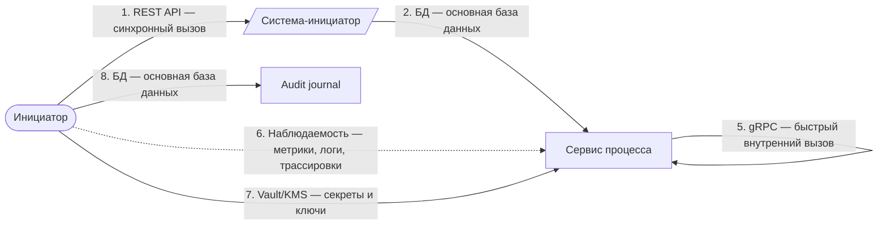
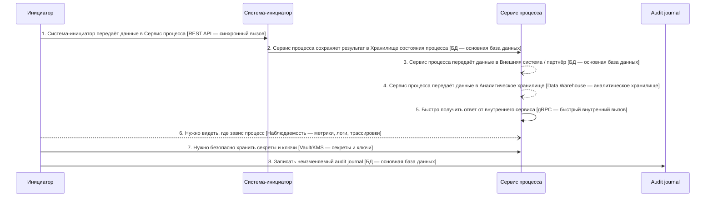

# Архитектурный разбор: v8.6.19 контроль отчёта

**Итоговый вывод:** НЕ ГОТОВО: слишком много рисков Оценка архитектурной готовности: 4.4/10. Найдено классов рисков: критичных — 0, высоких — 3, средних — 4. Всего отдельных срабатываний правил: 7.
**Готовность к промышленному запуску:** нельзя выпускать без закрытия блокеров. **Полнота вводных: 32%. Надёжность рекомендаций: низкая.**

## Короткий человеческий вывод

**Что:** Процесс «v8.6.19 контроль отчёта» описан как цепочка из 8 взаимодействий между 8 участниками. Система оценила архитектурную готовность как 4.4/10: НЕ ГОТОВО: слишком много рисков.
**Где:** Основные проблемные места: Важный асинхронный процесс не имеет сверки — в зоне: Весь процесс; Процесс блокируется на вызове внешней системы — в зоне: Шаг 1 «Система-инициатор передаёт данные в Сервис процесса» → Система-инициатор; Повторы в синхронной цепочке усиливают друг друга — в зоне: «Система-инициатор передаёт данные в Сервис процесса» → «Сервис процесса сохраняет результат в Хранилище состояния процесса».
**Почему:** Эти места важны, потому что именно там выше риск потери данных, дублей, зависания статуса, неуправляемых повторных попыток или непонятного восстановления после сбоя.

**Что делать дальше:** сначала исправьте противоречия в схеме и блокирующие риски, затем уточните недостающие вводные, после этого согласуйте стек по каждой связи и только потом переводите решение в постановку на разработку.

**Основная сущность:** Entity. Деньги: no. Регуляторика: да. Клиентский сценарий: нет.

## Проверка логики схемы

Перед использованием отчёта проверьте эти места: они могут означать ошибку в построении цепочки.

- Шаг 5 «Быстро получить ответ от внутреннего сервиса»: Для быстрого синхронного ответа источник выглядит ошибочным: аналитическое хранилище не должно становиться инициатором gRPC-вызова. Исправьте связь на «Сервис процесса → внутренний сервис» или вынесите аналитическую витрину в отдельную модель для чтения.

## Почему выбраны технологии и способы взаимодействия

### Объяснение по шагам

## Основная цепочка взаимодействий

В этот раздел попадают только бизнес-связи между участниками. Наблюдаемость, аудит, авторизация, секреты и маскирование вынесены ниже как сквозные контроли, чтобы они не искажали порядок процесса.

### Шаг 1. Система-инициатор передаёт данные в Сервис процесса

**Что:** шаг 1 — «Система-инициатор передаёт данные в Сервис процесса». Основной способ взаимодействия: REST API.
**Где:** связь идёт от «Система-инициатор» к «Сервис процесса». Исполнитель: «Система-инициатор». Выполняется после: начало процесса или внешний запуск. Характер связи: результат нужен сразу или в рамках текущего шага.
**Почему:** Подходит для синхронного запроса по HTTP: система отправляет запрос и должна получить ответ в рамках текущего сценария.
**Почему не другой вариант:** SOAP нужен в основном при старом WSDL/XML-контракте. Kafka, RabbitMQ и другие брокеры разрывают сценарий во времени и подходят, когда ответ не нужен сразу.
**Что проверить перед выпуском:** Нужны таймаут, лимит повторных попыток, единая модель ошибок, трассировка и ключ идемпотентности для операций с записью.

### Шаг 2. Сервис процесса сохраняет результат в Хранилище состояния процесса

**Что:** шаг 2 — «Сервис процесса сохраняет результат в Хранилище состояния процесса». Основной способ взаимодействия: Основная база данных.
**Где:** связь идёт от «Сервис процесса» к «Хранилище состояния процесса». Исполнитель: «Сервис процесса». Выполняется после: шаг 1 «Система-инициатор передаёт данные в Сервис процесса». Характер связи: результат нужен сразу или в рамках текущего шага.
**Почему:** Подходит для фиксации состояния процесса, статусов, ключей идемпотентности, истории и технического журнала шагов.
**Почему не другой вариант:** Redis не должен быть источником истины. Kafka/RabbitMQ передают сообщения, но не заменяют надёжную операционную запись. аналитическое хранилище не подходит для оперативной транзакции.
**Что проверить перед выпуском:** Нужны транзакции, уникальные индексы, версия записи или optimistic locking, сроки хранения и план очистки технических таблиц.

### Шаг 3. Сервис процесса передаёт данные в Внешняя система / партнёр

**Что:** шаг 3 — «Сервис процесса передаёт данные в Внешняя система / партнёр». Основной способ взаимодействия: REST API / HTTP-запрос к партнёру.
**Где:** связь идёт от «Сервис процесса» к «Внешняя система / партнёр». Исполнитель: «Сервис процесса». Выполняется после: шаг 2 «Сервис процесса сохраняет результат в Хранилище состояния процесса». Характер связи: результат может прийти позже или обрабатывается отдельно.
**Важное исправление:** В исходных данных шаг имел канал «db», но по смыслу связи основной способ должен быть «REST API». Служебная запись в БД не должна подменять канал взаимодействия с получателем.
**Почему:** Подходит как исходящий запрос к партнёру для передачи данных или запуска внешней обработки. Технический ответ может подтвердить приём, а финальный бизнес-результат должен приходить отдельным входящим шагом.
**Почему не другой вариант:** Обратный вызов не является исходящей отправкой: это отдельный входящий результат от партнёра. БД фиксирует статус процесса, но не передаёт данные партнёру. Брокер нельзя требовать от внешней организации без отдельного соглашения.
**Служебные компоненты:** БД процесса нужна как служебный компонент: она фиксирует состояние, ключ идемпотентности и историю шага. Это служебная запись, а не основной канал связи с получателем. Если партнёр вернёт результат позже, нужен отдельный входящий шаг: партнёр присылает статус в сервис процесса с подписью и дедупликацией.
**Что проверить перед выпуском:** Нужны таймаут, внешний requestId, ключ идемпотентности, ограниченные повторы, проверка неизвестного результата и отдельный входящий обратный вызов или входящий веб-вызов для финального статуса.

### Шаг 4. Сервис процесса передаёт данные в Аналитическое хранилище

**Что:** шаг 4 — «Сервис процесса передаёт данные в Аналитическое хранилище». Основной способ взаимодействия: ETL/ELT-загрузка.
**Где:** связь идёт от «Сервис процесса» к «Аналитическое хранилище». Исполнитель: «Сервис процесса». Выполняется после: шаг 2 «Сервис процесса сохраняет результат в Хранилище состояния процесса». Характер связи: результат может прийти позже или обрабатывается отдельно.
**Важное исправление:** В исходных данных шаг имел канал «data_warehouse», но по смыслу связи основной способ должен быть «ETL/ELT-загрузка». Аналитический контур является получателем данных. Способ доставки нужно выбирать отдельно: CDC, ETL/ELT, Batch или поток событий.
**Почему:** Подходит для передачи данных в аналитический контур с преобразованием, контролем качества и подготовкой витрин.
**Почему не другой вариант:** Операционная БД является источником данных, но не способом доставки в аналитику. Прямая запись сервиса в аналитическое хранилище повышает связанность. CDC лучше для передачи изменений почти в реальном времени, Batch — для регламентной периодической загрузки.
**Служебные компоненты:** Нужна сверка полноты между источником и аналитическим контуром: количество, ключи, контрольные суммы и отчёт расхождений.
**Что проверить перед выпуском:** Нужны правила преобразования, контроль количества записей, журнал загрузки, карантин ошибок, повторный запуск периода и сверка с источником.

### Шаг 5. Быстро получить ответ от внутреннего сервиса

**Статус шага:** требует исправления схемы до утверждения стека. Этот пункт нельзя считать готовым архитектурным решением.
**Что:** шаг 5 — «Быстро получить ответ от внутреннего сервиса». Основной способ взаимодействия: сначала исправить схему.
**Где:** связь идёт от «Аналитическое хранилище» к «Внутренний сервис быстрых ответов». Исполнитель: «Сервис процесса». Выполняется после: шаг 4 «Сервис процесса передаёт данные в Аналитическое хранилище». Характер связи: результат нужен сразу или в рамках текущего шага.
**Почему:** Для быстрого синхронного ответа источник выглядит ошибочным: аналитическое хранилище не должно становиться инициатором gRPC-вызова. Исправьте связь на «Сервис процесса → внутренний сервис» или вынесите аналитическую витрину в отдельную модель для чтения.
**Почему не другой вариант:** Выбор gRPC, REST, брокера или БД поверх некорректной связи создаст ложное ощущение готовой архитектуры.
**Что проверить перед выпуском:** Верните шаг на этап проектирования связей, исправьте источник, получателя и смысл действия, затем повторно запустите проверку и подбор стека.

## Сквозные контроли и служебные компоненты

Эти пункты важны, но они не являются очередными бизнес-шагами. Они применяются поверх процесса или к группе связей.

### Контроль 6. Нужно видеть, где завис процесс

**Что:** контроль «Нужно видеть, где завис процесс». Технический компонент: Наблюдаемость.
**Где:** применяется не как очередной бизнес-шаг, а как сквозной контроль на область: весь процесс. Ответственный исполнитель: «Сервис процесса».
**Почему:** Подходит, чтобы видеть, где завис процесс: метрики, логи, трассировки, алерты и бизнес-события по состояниям.
**Почему не другой вариант:** Обычные логи без корреляции не показывают сквозной процесс. Брокер/БД сами по себе не дают ответа, где именно потерялся запрос.
**Что проверить перед выпуском:** Нужны идентификатор сквозной связи, метрики задержки и ошибок, трассировка, алерты по очередям/лагу/ошибкам, дашборды и инструкции разбора.

### Контроль 7. Нужно безопасно хранить секреты и ключи

**Что:** контроль «Нужно безопасно хранить секреты и ключи». Технический компонент: Vault/KMS для секретов и ключей.
**Где:** применяется не как очередной бизнес-шаг, а как сквозной контроль на область: весь процесс. Ответственный исполнитель: «Сервис процесса».
**Почему:** Подходит, когда нужно безопасно хранить пароли, ключи подписи, сертификаты и секреты интеграций.
**Почему не другой вариант:** Хранение секретов в конфигурации или БД повышает риск утечки. OAuth2/OIDC решает идентификацию, но не хранение технических секретов.
**Что проверить перед выпуском:** Нужны политики доступа, ротация ключей, аудит чтения секретов, шифрование, разграничение окружений и emergency-процедуры.

### Контроль 8. Записать неизменяемый audit journal

**Что:** контроль «Записать неизменяемый audit journal». Технический компонент: неизменяемый журнал аудита.
**Где:** применяется не как очередной бизнес-шаг, а как сквозной контроль на область: связь «Сервис процесса → Audit journal». Ответственный исполнитель: «Audit journal».
**Почему:** Подходит для юридически значимых действий: фиксирует факт, автора, время, причину изменения и связь с процессом без возможности тихо переписать историю.
**Почему не другой вариант:** Обычная операционная БД может хранить записи, но без append-only правил, прав доступа и контроля изменений она не даёт достаточной доказательной базы. Брокер передаёт событие, но не заменяет аудит.
**Что проверить перед выпуском:** Нужны append-only модель, идентификатор сквозной связи, запрет изменения задним числом, срок хранения, разграничение доступа и аудит чтения журнала.

## Таблица решений по основной цепочке

| Шаг | Связь | Основной способ | Почему выбрано | Обязательные условия |
|---|---|---|---|---|
| 1. Система-инициатор передаёт данные в Сервис процесса | Система-инициатор → Сервис процесса. Исполнитель: Система-инициатор. | REST API | Подходит для синхронного запроса по HTTP: система отправляет запрос и должна получить ответ в рамках текущего сценария. | Нужны таймаут, лимит повторных попыток, единая модель ошибок, трассировка и ключ идемпотентности для операций с записью. |
| 2. Сервис процесса сохраняет результат в Хранилище состояния процесса | Сервис процесса → Хранилище состояния процесса. Исполнитель: Сервис процесса. | Основная база данных | Подходит для фиксации состояния процесса, статусов, ключей идемпотентности, истории и технического журнала шагов. | Нужны транзакции, уникальные индексы, версия записи или optimistic locking, сроки хранения и план очистки технических таблиц. |
| 3. Сервис процесса передаёт данные в Внешняя система / партнёр | Сервис процесса → Внешняя система / партнёр. Исполнитель: Сервис процесса. | REST API / HTTP-запрос к партнёру | Подходит как исходящий запрос к партнёру для передачи данных или запуска внешней обработки. Технический ответ может подтвердить приём, а финальный бизнес-результат должен приходить отдельным входящим шагом. | Нужны таймаут, внешний requestId, ключ идемпотентности, ограниченные повторы, проверка неизвестного результата и отдельный входящий обратный вызов или входящий веб-вызов для финального статуса. |
| 4. Сервис процесса передаёт данные в Аналитическое хранилище | Сервис процесса → Аналитическое хранилище. Исполнитель: Сервис процесса. | ETL/ELT-загрузка | Подходит для передачи данных в аналитический контур с преобразованием, контролем качества и подготовкой витрин. | Нужны правила преобразования, контроль количества записей, журнал загрузки, карантин ошибок, повторный запуск периода и сверка с источником. |
| 5. Быстро получить ответ от внутреннего сервиса | Аналитическое хранилище → Внутренний сервис быстрых ответов. Исполнитель: Сервис процесса. | сначала исправить схему | Для быстрого синхронного ответа источник выглядит ошибочным: аналитическое хранилище не должно становиться инициатором gRPC-вызова. Исправьте связь на «Сервис процесса → внутренний сервис» или вынесите аналитическую витрину в отдельную модель для чтения. | Верните шаг на этап проектирования связей, исправьте источник, получателя и смысл действия, затем повторно запустите проверку и подбор стека. |

## Как читать предложенное решение

Почему предлагается именно так: решение выбирается из смысла связи и уточнений пользователя. Почему нельзя просто не делать: без выбранных гарантий процесс может терять данные, создавать дубли или становиться неразбираемым при сбое. В строке «основной способ взаимодействия» указан канал связи между участниками: API, файл, очередь, поток событий, CDC или загрузка в аналитику. БД процесса, таблицы входящих и исходящих сообщений, аудит, секреты и наблюдаемость описываются отдельно как служебные компоненты и сквозные контроли. Они не должны подменять канал связи.

## Контрольные проверки готовности к промышленному запуску

| Проверка | Статус | Что мешает выпуску | Что нужно уточнить |
|---|---|---|---|
| Контракт | Проходит | — | — |
| Надёжность | Блокирует выпуск | Для каждого блокирующего вызова задан таймаут; Для внешних блокирующих вызовов описаны предохранитель внешнего вызова и деградация | Для асинхронной обработки задан лимит попыток и очередь ошибочных сообщений или карантин; После исправления ошибки есть понятная процедура повторной обработки |
| Целостность данных | Блокирует выпуск | Для процесса предусмотрена сверка | — |
| Наблюдаемость | Блокирует выпуск | CorrelationId или traceId проходит через всю цепочку; Для процесса настроены метрики, алерты и дашборды | — |
| Безопасность | Проходит | — | — |
| Производительность | Проходит | — | — |
| Эксплуатация и внедрение | Проходит | — | — |

## Какие вводные нужно уточнить

| Приоритет | Область | Что нужно уточнить | Почему это важно |
|---|---|---|---|
| high | Бизнес | Какая бизнес-цель и что считается успешным финалом процесса? | Без цели невозможно отличить обязательный шаг от необязательной дообработки. |
| medium | Данные | Какие ключевые поля сущности, уникальные ключи и чувствительные данные? | Без полей нельзя проверить идемпотентность, индексы, ПДн и контракт. |
| medium | Данные | Какой natural/бизнес-ключ или operationId уникально определяет операцию? | Без уникального ключа сложно гарантировать dedup и повторную обработку без дублей. |
| high | Трассировка | Какой сквозной сквозной идентификатор / идентификатор отслеживания проходит через все системы? | Без него нельзя расследовать инциденты по распределённой цепочке. |
| medium | Внешние системы | Какие лимиты запросов у внешних систем и что делать при 429/лимите? | Без лимитов нельзя оценить пиковую нагрузку и обратное давление. |
| medium | Отказоустойчивость | Какая деградация допустима при отказе внешней системы? | Иначе отказ партнёра становится отказом вашего сценария. |
| medium | целевое время ответа | Какой целевое время ответа и таймаут для пользовательского или системного ответа? | Без целевое время ответа невозможно распределить бюджет таймаутов и понять, где нужна async-граница. |
| medium | Нагрузка | Какая средняя и пиковая нагрузка, размер события и допустимый лаг? | Без нагрузки нельзя выбрать партиционирование, пул потребителей, БД и лимиты. |
| medium | Сверка | Как сверяются расхождения между источником истины и потребителями? | Техническая доставка не гарантирует бизнесовую полноту и согласованность. |
| info | Владение | Кто владельцы систем, контрактов и алертов? | Без владельцев неясны ответственность и эскалация. |

## Найденные риски и слабые места

Риски описаны по схеме «что / где / почему / что сделать».

### Высокий риск

#### Важный асинхронный процесс не имеет сверки.

**Что:** найден риск «Важный асинхронный процесс не имеет сверки.». затронуто мест: 1
**Где:** Весь процесс.
**Затронутые места:** Весь процесс
**Почему важно:** Повторная попытка и очередь ошибочных сообщений закрывают технические сбои, но не доказывают, что все бизнес-сущности дошли до финального состояния и что банк, партнёр или витрина не разошлись по данным.
**Что нужно сделать:** Добавьте регулярную сверку источника истины с потребителями: expected vs actual, отчёт расхождений, автоматическое довосстановление там, где это безопасно, и ручной разбор.

#### Процесс блокируется на вызове внешней системы.

**Что:** найден риск «Процесс блокируется на вызове внешней системы.». затронуто мест: 1
**Где:** Шаг 1 «Система-инициатор передаёт данные в Сервис процесса» → Система-инициатор.
**Затронутые места:** Шаг 1 «Система-инициатор передаёт данные в Сервис процесса» → Система-инициатор
**Почему важно:** Внешняя система находится вне вашего контроля: её деградация напрямую ухудшает ваше целевое время ответа и может исчерпать пул рабочих потоков.
**Что нужно сделать:** Настройте таймаут, предохранитель внешнего вызова и запасной сценарий-ответ; если бизнес-сценарий позволяет, переведите шаг в асинхронную обработку через очередь с компенсацией.

#### Повторы в синхронной цепочке усиливают друг друга.

**Что:** найден риск «Повторы в синхронной цепочке усиливают друг друга.». затронуто мест: 1
**Где:** «Система-инициатор передаёт данные в Сервис процесса» → «Сервис процесса сохраняет результат в Хранилище состояния процесса».
**Затронутые места:** «Система-инициатор передаёт данные в Сервис процесса» → «Сервис процесса сохраняет результат в Хранилище состояния процесса»
**Почему важно:** Несколько звеньев с автоматическими повторами друг за другом перемножают количество попыток (N×M×…): при деградации это создаёт шторм повторных попыток и лавинообразный рост нагрузки в самый плохой момент.
**Что нужно сделать:** Задайте единый бюджет повторов на весь запрос (общий deadline), предохранитель внешнего вызова на каждом звене и экспоненциальная увеличивающаяся пауза между повторными попытками со случайным разбросом; не повторяйте вызовы, которые уже не успеют уложиться в целевое время ответа.

### Средний риск

#### В блокирующих шагах не задан таймаут.

**Что:** найден риск «В блокирующих шагах не задан таймаут.». затронуто мест: 1
**Где:** 1 «Система-инициатор передаёт данные в Сервис процесса», 2 «Сервис процесса сохраняет результат в Хранилище состояния процесса», 5 «Быстро получить ответ от внутреннего сервиса», 7 «Нужно безопасно хранить секреты и ключи», 8 «Записать неизменяемый audit journal».
**Затронутые места:** 1 «Система-инициатор передаёт данные в Сервис процесса», 2 «Сервис процесса сохраняет результат в Хранилище состояния процесса», 5 «Быстро получить ответ от внутреннего сервиса», 7 «Нужно безопасно хранить секреты и ключи», 8 «Записать неизменяемый audit journal»
**Почему важно:** Без таймаута зависший вызов бесконечно удерживает поток и создаёт каскад ожиданий.
**Что нужно сделать:** Задайте таймаут каждому блокирующему вызову и распределите бюджет времени от целевого времени ответа сверху вниз.

#### Распределённый процесс не имеет сквозного идентификатора.

**Что:** найден риск «Распределённый процесс не имеет сквозного идентификатора.». затронуто мест: 1
**Где:** Весь процесс.
**Затронутые места:** Весь процесс
**Почему важно:** Запрос проходит через несколько систем и асинхронных шагов; без сквозного идентификатора инцидент невозможно собрать по логам разных систем, поэтому расследование будет идти вслепую.
**Что нужно сделать:** Пробрасывайте сквозной идентификатор или идентификатор трассировки через все шаги и тело сообщения событий (W3C traceparent); логируйте его на каждом переходе и связывайте с идентификатором бизнес-процесса.

#### Для интеграции не описана модель наблюдаемости.

**Что:** найден риск «Для интеграции не описана модель наблюдаемости.». затронуто мест: 1
**Где:** Весь процесс.
**Затронутые места:** Весь процесс
**Почему важно:** Даже корректная архитектура станет неуправляемой в промышленный запуск, если нельзя быстро увидеть, где застряла сущность, растёт ли отставание обработки, сколько сообщений находится в очередь ошибочных сообщений и какой внешний вызов деградирует.
**Что нужно сделать:** Добавьте технические и бизнес-метрики: latency по шагам, success/error rate, отставание потребителей, количество сообщений в очереди ошибок, количество повторных попыток, возраст статуса, traces по идентификатор сквозной связи и алерты по SLO.

#### Повторные попытки настроены без лимита попыток и очередь ошибочных сообщений.

**Что:** найден риск «Повторные попытки настроены без лимита попыток и очередь ошибочных сообщений.». затронуто мест: 1
**Где:** Шаг 4 «Сервис процесса передаёт данные в Аналитическое хранилище».
**Затронутые места:** Шаг 4 «Сервис процесса передаёт данные в Аналитическое хранилище»
**Почему важно:** «Ядовитое» сообщение будет снова и снова возвращаться в очередь: это создаст бесконечный цикл ошибок, лишнюю нагрузку на CPU и переполнение очереди.
**Что нужно сделать:** Добавьте счётчик попыток и экспоненциальная увеличивающаяся пауза между повторными попытками; после заданного числа попыток отправляйте сообщение в очередь ошибочных сообщений или карантин с алертом и описанной процедурой повторная обработка.

## Обязательный архитектурный чек-лист

| Область | Статус | Что проверяется | Как закрыть пункт |
|---|---|---|---|
| Контракт | Проверено | Для каждого события или API зафиксирована единая схема и версия. Для каждого REST/API или события должны быть владелец, версия, правила совместимости и примеры тела сообщения. | Используйте реестр схем событий, JSON Schema, Avro или Protobuf и добавьте контрактные тесты со стороны потребителя. |
| Контракт | Проверено | Каждое событие содержит стандартную обёртку события. Событие должно позволять дедупликацию, трассировку, повторную обработку и безопасную эволюцию схемы. | Стандартизируйте обязательную обёртку события: идентификатор события, тип события, версия события, идентификатор агрегата, время возникновения события и идентификатор сквозной связи. |
| Контракт | Проверено | Для клиентского API описана модель ошибок. Фронт, клиент и поддержка должны одинаково понимать повторяемые и неповторяемые ошибки, статусы и идентификатор сквозной связи. | Опишите код ошибки, признак возможности повтора, сообщение пользователю, техническое сообщение для логов и соответствие HTTP/gRPC-статусам. |
| Данные | Не указано | Ключ поиска и ключ идемпотентности имеют правильную область уникальности. Если один технический идентификатор используется в разных типах операций, tenant, провайдерах или целевых системах, поиск, update, dedup и повторная обработка должны учитывать эту область уникальности. | Опишите составной ключ и используйте его одинаково в SELECT, UPDATE, UPSERT, UNIQUE-индексе, таблица входящих сообщений для дедупликации, таблица исходящих сообщений и повторная обработка. Примеры: requestId + operationType + targetSystem + tenantId; operUid + operationType + targetSystem; providerEventId + providerCode. |
| Надёжность | Блокирует выпуск | Для каждого блокирующего вызова задан таймаут. Ни один рабочий поток не должен ждать внешний или внутренний вызов бесконечно. | Задайте таймаут на каждом шаге и общий deadline, рассчитанный от целевого времени ответа. |
| Надёжность | Проверено | Повторные попытки не создают дубли бизнес-операций. Каждая повторная попытка, которая может привести к записи, должна иметь ключ идемпотентности или natural key. | Используйте operationId или ключ идемпотентности с unique index; для входящих событий добавьте таблица входящих сообщений для дедупликации. |
| Надёжность | Требует проверки | Для асинхронной обработки задан лимит попыток и очередь ошибочных сообщений или карантин. Poison message не должен теряться и не должен бесконечно возвращаться в обработку. | Настройте увеличивающаяся пауза между повторными попытками, max attempts, очередь ошибочных сообщений, алерт и владельца ручного разбора. |
| Надёжность | Не указано | После исправления ошибки есть понятная процедура повторной обработки. Команда должна понимать, как безопасно переиграть очередь ошибочных сообщений, период или конкретную сущность. | Опишите ручной и пакетный повторная обработка, требования к идемпотентности и права доступа на запуск. |
| Надёжность | Блокирует выпуск | Для внешних блокирующих вызовов описаны предохранитель внешнего вызова и деградация. Отказ партнёра не должен бесконтрольно приводить к отказу всего сценария. | Добавьте таймаут, предохранитель внешнего вызова, запасной сценарий, bulkhead и очередь выравнивания нагрузки. |
| Целостность | Проверено | При записи в БД и публикации события используется таблица исходящих сообщений. Событие не должно теряться и не должно появляться без соответствующей записи в БД. | Записывайте Transactional таблица исходящих сообщений в одной транзакции с изменением агрегата. |
| Целостность | Проверено | Для входящих событий и для входящего веб-вызова используется таблица входящих сообщений для дедупликации или дедупликация. Повторная доставка не должна менять состояние второй раз. | Используйте таблица входящих сообщений для дедупликации с уникальным идентификатор события и коммитьте offset только после успешной обработки. |
| Целостность | Проверено | У основной сущности есть владелец и единственный писатель. Должно быть понятно, какая система имеет право менять состояние основной сущности. | Назначьте system of record; остальные системы должны отправлять команды или события. |
| Целостность | Проверено | Требование к порядку событий и ключу партиционирования явно зафиксировано. Если порядок важен, события одной сущности должны попадать в одну партицию. | Уточните требование к порядку; для per-entity ordering используйте ключ партиционирования = entityId. |
| Целостность | Блокирует выпуск | Для процесса предусмотрена сверка. Должен быть способ доказать полноту обработки и восстановить найденные расхождения. | Реализуйте expected/actual сверку, отчёт расхождений, безопасное авто-восстановление и ручной разбор. |
| Наблюдаемость | Блокирует выпуск | CorrelationId или traceId проходит через всю цепочку. Инцидент должен собираться по логам всех систем без ручного угадывания связей. | Передавайте W3C traceparent или идентификатор сквозной связи в запросах, событиях и логах. |
| Наблюдаемость | Блокирует выпуск | Для процесса настроены метрики, алерты и дашборды. Для процесса должны быть SLO и метрики latency, error rate, отставание обработки, очередь ошибочных сообщений и возраст статуса. | Добавьте бизнесовые и технические метрики, алерты и владельцев реакции. |
| Наблюдаемость | Проверено | Для процесса описана статусная модель и история переходов. Поддержка должна видеть, где застряла сущность и почему это произошло. | Опишите статусы, status_history или step_log, а также финальные и промежуточные состояния. |
| Безопасность | Проверено | Входящий веб-вызов или обратный вызов проходит проверку подписи. Внешний вход нельзя подделать простым POST-запросом. | Используйте HMAC, JWT или mTLS, повторная обработка-window и ротацию секретов. |
| Безопасность | Проверено | Для ПДн и чувствительных полей описаны маскирование и срок хранения. ПДн не должны попадать в логи, события и аналитическое хранилище без явной политики. | Минимизируйте тело сообщения, маскируйте логи, настройте TTL или удаление и роли доступа. |
| Производительность | Проверено | Заявленный целевое время ответа сходится с критическим путём. Сумма таймаутов и ожидаемая latency не должны превышать обещанный целевое время ответа. | Разорвите цепочку, распараллельте независимые шаги, добавьте кэш или уменьшите таймаут. |
| Производительность | Проверено | Для нагрузки описаны пропускная способность, обратное давление и отставание потребителей. Пиковая нагрузка не должна ронять партнёра, брокер, consumer или БД. | Проведите нагрузочный тест, задайте лимиты, обратное давление, партиции и алерты на отставание потребителей. |
| Эксплуатация | Проверено | Для служебных таблиц и топиков задан срок хранения и архивирование. таблица исходящих сообщений, таблица входящих сообщений для дедупликации, журнал проводок и логи не должны расти бесконечно. | Добавьте партиционирование, TTL, архив, cleanup job и мониторинг размера. |
| Внедрение | Проверено | Для внедрения описаны переключение, откат и управляемый флаг включения. У команды должен быть безопасный план включения и отката. | Опишите parallel run, сверку, поэтапное включение и критерии отката. |

## Карта процесса и последовательность взаимодействий





## Сценарная основа для дальнейшей разработки

### Основной сценарий

1. **Система-инициатор: Система-инициатор передаёт данные в Сервис процесса** (бизнес-шаг)
   - Что происходит: Система «Система-инициатор» выполняет действие «Система-инициатор передаёт данные в Сервис процесса». Способ взаимодействия: REST API — синхронный вызов.
   - Способ взаимодействия: REST API — синхронный вызов.
   - Зависимость: старт процесса.
   - Результат: Результат шага фиксируется в статусе процесса или в журнале шагов; не меняет основную сущность.
   - При ошибке: Если зависимость вернула таймаут, 5xx или 429, завершить ожидание по заданному таймаут, записать техническую причину и не держать поток бесконечно. Повторять вызов можно только при подтверждённой идемпотентности; иначе нужна ручная проверка или компенсация. Для внешней системы нужны предохранитель внешнего вызова, увеличивающаяся пауза между повторными попытками со случайным разбросом, лимит параллелизма и сценарий деградации или отложенной обработки.
2. **Сервис процесса: Сервис процесса сохраняет результат в Хранилище состояния процесса** (бизнес-шаг)
   - Что происходит: Система «Сервис процесса» выполняет действие «Сервис процесса сохраняет результат в Хранилище состояния процесса». Способ взаимодействия: БД — основная база данных.
   - Способ взаимодействия: БД — основная база данных.
   - Зависимость: 1.
   - Результат: Результат шага фиксируется в статусе процесса или в журнале шагов; меняет состояние основной сущности.
   - При ошибке: При ошибке записи транзакция должна откатиться целиком. Для повторного запуска используется UNIQUE-индекс или optimistic locking, чтобы не создать дубль. Конфликт версии или уникальности должен обрабатываться как известный сценарий: вернуть существующий результат, повторить чтение или отправить на ручную сверку. История статусов или step_log должна показать, на каком изменении остановился процесс.
3. **Сервис процесса: Сервис процесса передаёт данные в Внешняя система / партнёр** (бизнес-шаг)
   - Что происходит: Система «Сервис процесса» выполняет действие «Сервис процесса передаёт данные в Внешняя система / партнёр». Способ взаимодействия: БД — основная база данных.
   - Способ взаимодействия: БД — основная база данных.
   - Зависимость: 2.
   - Результат: Результат шага фиксируется в статусе процесса или в журнале шагов; меняет состояние основной сущности.
   - При ошибке: При ошибке записи транзакция должна откатиться целиком. Для повторного запуска используется UNIQUE-индекс или optimistic locking, чтобы не создать дубль. Конфликт версии или уникальности должен обрабатываться как известный сценарий: вернуть существующий результат, повторить чтение или отправить на ручную сверку. История статусов или step_log должна показать, на каком изменении остановился процесс.
4. **Сервис процесса: Сервис процесса передаёт данные в Аналитическое хранилище** (бизнес-шаг)
   - Что происходит: Система «Сервис процесса» выполняет действие «Сервис процесса передаёт данные в Аналитическое хранилище». Способ взаимодействия: Data Warehouse — аналитическое хранилище.
   - Способ взаимодействия: Data Warehouse — аналитическое хранилище.
   - Зависимость: 2.
   - Результат: Результат шага фиксируется в статусе процесса или в журнале шагов; не меняет основную сущность.
   - При ошибке: Для файла или batch-нaгрузки нужны контрольная сумма/control totals, идентификатор пакета, журнал принятых строк и карантин ошибок. Повторная загрузка того же идентификатор пакета не должна применять строки повторно. Частично обработанный batch должен иметь resume/reprocess-процедуру и отчёт по принятым, отклонённым и спорным записям.
5. **Сервис процесса: Быстро получить ответ от внутреннего сервиса** (бизнес-шаг)
   - Что происходит: Система «Сервис процесса» выполняет действие «Быстро получить ответ от внутреннего сервиса». Способ взаимодействия: gRPC — быстрый внутренний вызов.
   - Способ взаимодействия: gRPC — быстрый внутренний вызов.
   - Зависимость: 4.
   - Результат: Результат шага фиксируется в статусе процесса или в журнале шагов; не меняет основную сущность.
   - При ошибке: Если вызов завершился таймаут, 5xx или сетевой ошибкой, процесс должен перейти в явный технический статус, а не зависнуть без результата. Повторять вызов можно только при подтверждённой идемпотентности; иначе нужна ручная проверка или компенсация. Для 4xx/валидационной ошибки нужен доменный отказ; для 5xx — техническая ошибка с возможностью безопасного повтора.
6. **Сервис процесса: Нужно видеть, где завис процесс** (сквозной контроль)
   - Что происходит: Система «Сервис процесса» выполняет действие «Нужно видеть, где завис процесс». Способ взаимодействия: Наблюдаемость — метрики, логи, трассировки.
   - Способ взаимодействия: Наблюдаемость — метрики, логи, трассировки.
   - Зависимость: старт процесса.
   - Результат: Результат шага фиксируется в статусе процесса или в журнале шагов; не меняет основную сущность.
   - При ошибке: Нужно явно описать поведение при ошибке для этого шага: какой статус выставляется, кто владелец разбора, как выполняется безопасный повтор и как исключается дубль.
7. **Сервис процесса: Нужно безопасно хранить секреты и ключи** (сквозной контроль)
   - Что происходит: Система «Сервис процесса» выполняет действие «Нужно безопасно хранить секреты и ключи». Способ взаимодействия: Vault/KMS — секреты и ключи.
   - Способ взаимодействия: Vault/KMS — секреты и ключи.
   - Зависимость: старт процесса.
   - Результат: Результат шага фиксируется в статусе процесса или в журнале шагов; не меняет основную сущность.
   - При ошибке: Если вызов завершился таймаут, 5xx или сетевой ошибкой, процесс должен перейти в явный технический статус, а не зависнуть без результата. Повторять вызов можно только при подтверждённой идемпотентности; иначе нужна ручная проверка или компенсация. Для 4xx/валидационной ошибки нужен доменный отказ; для 5xx — техническая ошибка с возможностью безопасного повтора.
8. **Audit journal: Записать неизменяемый audit journal** (сквозной контроль)
   - Что происходит: Система «Audit journal» выполняет действие «Записать неизменяемый audit journal». Способ взаимодействия: БД — основная база данных.
   - Способ взаимодействия: БД — основная база данных.
   - Зависимость: старт процесса.
   - Результат: Результат шага фиксируется в статусе процесса или в журнале шагов; не меняет основную сущность.
   - При ошибке: При ошибке записи транзакция должна откатиться целиком. Для повторного запуска используется UNIQUE-индекс или optimistic locking, чтобы не создать дубль. Конфликт версии или уникальности должен обрабатываться как известный сценарий: вернуть существующий результат, повторить чтение или отправить на ручную сверку.

### Альтернативные сценарии

1. **Асинхронное принятие заявки без ожидания финального результата**
   - Когда возникает: Хвост процесса занимает больше допустимого времени ответа или зависит от внешних систем.
   - Ожидаемый результат: Пользователь или потребитель видит промежуточный статус, а не зависший запрос.
2. **Повторная доставка или повторный запрос**
   - Когда возникает: Сеть оборвалась, producer отправил событие повторно или consumer переобработал сообщение.
   - Ожидаемый результат: Повтор не создаёт дубль операции, документа, проводки или статуса.
3. **Внешняя система недоступна или отвечает медленно**
   - Когда возникает: Внешняя зависимость вернула таймаут, 5xx, 429 или стала нестабильной.
   - Ожидаемый результат: Отказ партнёра не приводит к каскадному отказу всего процесса.
4. **Расхождение данных между источником истины и потребителем**
   - Когда возникает: Техническая доставка прошла не полностью, повторная обработка был пропущен или потребитель отстал.
   - Ожидаемый результат: Бизнес видит не только техническую доставку, но и фактическую полноту процесса.

## Варианты архитектурного решения

### Вариант A — минимально допустимый фикс
Почему предлагается именно так: срок короткий и нельзя сильно менять архитектуру.
Почему нельзя просто не делать: Он не является целевой архитектурой: часть технического долга останется, поэтому его нельзя считать финальным решением для высокой нагрузки или регуляторного сценария.
Что изменить:
- Добавьте идентификатор события и сделайте consumer идемпотентным.
- Настройте очередь ошибочных сообщений с алертом и владельцем разбора.
- Опишите ручной повторная обработка после исправления ошибки.
- Зафиксируйте контракт события с версией и правилами совместимости.
- Настройте таймаут и предохранитель внешнего вызова для внешней системы.
- Опишите запасной сценарий или деградацию при отказе внешней системы.
- Ведите append-only audit/evidence для юридически значимых шагов.
- Настройте регулярную сверка-сверку.

### Вариант B — промышленный запуск-компромисс
Почему предлагается именно так: нужен рабочий промышленный запуск-вариант для типовой корпоративной интеграции.
Почему нельзя просто не делать: Он хуже целевого варианта по запасу прочности, но безопаснее минимального исправления, если закрыть явно перечисленные ограничения.
Что изменить:
- Добавьте идентификатор события и сделайте consumer идемпотентным.
- Настройте очередь ошибочных сообщений с алертом и владельцем разбора.
- Опишите ручной повторная обработка после исправления ошибки.
- Зафиксируйте контракт события с версией и правилами совместимости.
- Настройте таймаут и предохранитель внешнего вызова для внешней системы.
- Опишите запасной сценарий или деградацию при отказе внешней системы.
- Ведите append-only audit/evidence для юридически значимых шагов.
- Настройте регулярную сверка-сверку.
- Добавьте метрики latency, error rate, отставание обработки, очередь ошибочных сообщений и возраст статуса.
- Добавьте контрактные тесты между producer и consumer.
- Проведите нагрузочный тест на пиковом профиле.

### Вариант C — целевая архитектура
Почему предлагается именно так: поток критичен, регуляторен, денежный или станет платформенным.
Почему нельзя просто не делать: Он дороже минимального варианта, но снижает риск скрытых дублей, потери событий, ручных аварийных исправлений и неуправляемого отката.
Что изменить:
- Добавьте идентификатор события и сделайте consumer идемпотентным.
- Настройте очередь ошибочных сообщений с алертом и владельцем разбора.
- Опишите ручной повторная обработка после исправления ошибки.
- Зафиксируйте контракт события с версией и правилами совместимости.
- Настройте таймаут и предохранитель внешнего вызова для внешней системы.
- Опишите запасной сценарий или деградацию при отказе внешней системы.
- Ведите append-only audit/evidence для юридически значимых шагов.
- Настройте регулярную сверка-сверку.
- Добавьте метрики latency, error rate, отставание обработки, очередь ошибочных сообщений и возраст статуса.
- Добавьте контрактные тесты между producer и consumer.
- Проведите нагрузочный тест на пиковом профиле.
- Внедрите schema registry с compatibility rules.
- Автоматизируйте повторная обработка по периоду или конкретной сущности.
- Подготовьте SLO-дашборд и инструкция разбора инцидентов.
- Добавьте chaos/failure-тесты для критичных зависимостей.

## Матрица деталей, которые нельзя забыть

Матрица деталей: применимо инвариантов из каталога v7.1 — 90 из 125; блокируют выпуск — 8, требуют внимания — 29, нужно уточнить — 52, уже выглядит закрытым — 16.

| Область | Статус | Что проверить | Почему это важно | Как закрыть |
|---|---|---|---|---|
| Идентичность и ключи | Не указано | Область уникальности каждого идентификатора должна быть явной. Какие поля однозначно определяют бизнес-операцию, подоперацию, внешний запрос, событие, повторная обработка и запись в БД? | Большая часть тонких ошибок возникает не из-за протокола, а из-за неверного ключа поиска: одинаковый id в разных типах операций, tenant, системах или подоперациях начинает склеивать разные записи. | Для каждого id зафиксируйте scope: global, per-process, per-operationType, per-targetSystem, per-tenant или per-provider. Затем проверьте одинаковость ключа в SELECT, UPDATE, UPSERT, UNIQUE, таблица входящих сообщений для дедупликации, таблица исходящих сообщений, очередь ошибочных сообщений и повторная обработка. Примеры: operUid + operationType + targetSystem; providerEventId + providerCode; requestId + sourceSystem + tenantId. |
| Идентичность и ключи | Требует проверки | Повторная обработка должна использовать тот же ключ, что и бизнес-операция. Одинаковый ли ключ используется для идемпотентности, дедупликации входящих сообщений, повторного запуска и поиска существующей операции? | Если idempotency key отличается от ключа поиска или уникального индекса, повтор может не создать дубль технически, но восстановить или обновить не ту бизнес-запись. | Составьте таблицу соответствия: businessKey, ключ идемпотентности, lookupKey, uniqueIndex, повторная обработкаKey. Несовпадения должны быть явно обоснованы. |
| Контракт | Проверено | Контракт должен описывать не только поля, но и их смысл. Для каждого поля указаны обязательность, формат, источник, владелец, допустимые значения, обратная совместимость и правила изменения? | Сервис может формально принимать JSON, но ломаться на изменении enum, nullable-поля, даты, валюты или статуса. | Добавьте schema/version, examples, required/optional, enum lifecycle, compatibility rules, контрактные тесты producer↔consumer. Примеры: версия события; время возникновения события с timezone; statusReason; currency/amount precision. |
| Контракт | Проверено | Время события должно быть однозначным. Где фиксируется время факта, время публикации, время обработки и timezone? | Ошибки с временем редко видны на основной успешный сценарий, но ломают целевое время ответа, сверки, регуляторные отчёты, повторную обработку и расследование инцидентов. | Разделите время возникновения события, producedAt, processedAt. Используйте UTC/offset и явно опишите, какое поле используется для сортировки, целевое время ответа и отчётности. |
| Статусы и сценарии | Проверено | Процесс должен иметь явную статусную модель. Какие статусы промежуточные, какие финальные, какие ошибочные, а из каких разрешён повтор? | Без статусов поддержка не понимает, где застряла заявка, а разработка не знает, какой результат должен быть у альтернативных сценариев. | Опишите state machine: allowed transitions, terminal statuses, повторяемые statuses, ручной разбор, cancellation, таймаут и сверка statuses. |
| Статусы и сценарии | Требует проверки | У каждого альтернативного сценария должен быть ожидаемый результат. Что происходит при частичном успехе, отказе внешней системы, дубле, out-of-order событии, ручном исправлении и отмене процесса? | Если альтернативы не описаны, команда реализует только основной успешный сценарий, а ошибки начнут всплывать на тестировании или в промышленный запуск. | Для каждого шага заведите минимум: success, validation error, таймаут, попытки исчерпаны, duplicate, stale/out-of-order, ручной correction. |
| Целостность данных | Проверено | У каждой бизнес-сущности должен быть владелец и единственный писатель. Кто имеет право менять основную сущность, а кто только отправляет команду или читает проекцию? | Несколько писателей создают гонки, потерянные обновления и расхождения между сервисами. | Назначьте system of record. Для остальных систем используйте команды, события, модель для чтения или сверка. |
| Целостность данных | Не указано | Нужно проверить потерянные обновления и конкурентные изменения. Есть ли version/revision/optimistic locking для обновления одной записи несколькими запросами или обработчиками? | Даже при правильном ключе два обработчика могут одновременно прочитать старое состояние и перезаписать результат друг друга. | Для изменяемых записей добавьте version/revision, optimistic locking, compare-and-set или сериализацию команд на уровне владельца сущности. |
| Восстановление | Блокирует выпуск | Для каждой ошибки должен быть понятный маршрут восстановления. После исчерпания повторная попытка куда попадает запись, кто получает алерт, как выполняется повторная обработка и как понять, что процесс восстановился? | очередь ошибочных сообщений без инструкция разбора и повторная обработка — это не восстановление, а склад ошибок. | Опишите max attempts, очередь ошибочных сообщений/карантин ошибок, ownership, alert, команда повторной обработки, идемпотентная повторная обработка, сверка после повторной обработки. |
| Восстановление | Блокирует выпуск | Техническая доставка должна проверяться бизнесовой сверкой. Как система доказывает, что все сущности дошли до финального состояния и данные не разошлись между источником и потребителями? | At-least-once доставка не гарантирует бизнесовую полноту. Сообщение могло попасть в очередь ошибочных сообщений, быть пропущено, обработаться частично или устареть. | Добавьте сверка: expected vs actual, отчёт расхождений, автоматическое довосстановление, ручной разбор и аудит исправлений. |
| Порядок и конкуренция | Проверено | Порядок событий должен быть задан только там, где он действительно нужен. Нужно ли обрабатывать события строго по сущности, глобально или порядок вообще не важен? | Лишнее требование глобального порядка убивает масштабирование, а отсутствие per-entity ordering ломает статусные переходы. | Опишите ключ партиционирования, stale-event policy, sequence/version, обработку out-of-order и правила игнорирования устаревших событий. |
| Порядок и конкуренция | Проверено | Дубли и устаревшие события должны быть частью сценария. Что происходит, если одно и то же событие пришло дважды, пришло после финального статуса или пришло старее текущей версии сущности? | На реальных брокерах и входящий веб-вызов дубли — нормальное поведение, а не исключение. | Добавьте таблица входящих сообщений для дедупликации/dedup, sequence/version check, terminal-state guard и тесты duplicate/stale/out-of-order. |
| Безопасность | Блокирует выпуск | Чувствительные данные должны иметь правила хранения и отображения. Какие поля являются ПДн/секретами, где они логируются, как маскируются, сколько хранятся и кто имеет доступ? | Интеграция часто случайно уносит ПДн в логи, очередь ошибочных сообщений, outbox, аналитические витрины и тестовые стенды. | Опишите классификацию полей, маскирование логов, encryption at rest/in transit, срок хранения, права доступа, очистку очередь ошибочных сообщений и запрет чувствительных данных в технических ошибках. |
| Наблюдаемость | Блокирует выпуск | У поддержки должен быть способ найти весь процесс по одному идентификатору. По какому идентификатор отслеживания/идентификатор сквозной связи оператор, аналитик или разработчик найдёт все шаги, события, внешние вызовы и ошибки? | Без сквозной трассировки даже правильный процесс невозможно поддерживать в incident mode. | Пробросьте сквозной идентификатор / идентификатор трассировки, заведите status history, business metrics, technical metrics, dashboard, alert rules и инструкция разбора. |
| Внедрение | Проверено | Для изменения существующей интеграции нужен план перехода. Как будет выполнен переключение, что происходит со старыми сообщениями, как откатиться и как проверяется совместимость? | Даже хорошая целевая архитектура может сломать промышленный запуск при переходе без параллельный прогон старого и нового контура, откат и миграции незавершённых процессов. | Опишите управляемый флаг включения, параллельный прогон старого и нового контура/shadow, дозагрузка исторических данных, миграцию старых статусов, откат criteria, freeze window и совместимость контрактов. |
| Бизнес и границы | Проверено | У процесса должен быть явно определён успешный финал. Что считается успешным завершением процесса и какой результат видит потребитель? | Без финала команда реализует шаги, но не понимает, когда процесс действительно завершён. | Опишите финальный бизнес-результат, финальные статусы, владельца результата и критерий готовности. Примеры: финальный статус COMPLETED; создана операция в системе-получателе. |
| Бизнес и границы | Не указано | Границы ответственности систем должны быть зафиксированы. Какая система владеет процессом, данными, контрактом и ошибками? | Без границ ответственности спорные ошибки будут перекладываться между командами. | Назначьте владельца процесса, владельца каждой системы, владельца контракта и правила эскалации. |
| Бизнес и границы | Не указано | Процесс должен разделять обязательные и необязательные шаги. Какие шаги блокируют бизнес-результат, а какие могут быть выполнены позже? | Необязательные обогащения часто случайно попадают в критический путь и ломают целевое время ответа. | Для каждого шага укажите mandatory/optional и допустимую деградацию. |
| Бизнес и границы | Проверено | Должен быть понятен инициатор и потребитель результата. Кто запускает процесс и кто использует результат: клиент, оператор, система, batch или регулятор? | От инициатора зависит целевое время ответа, ошибки, права доступа, UX и требования к статусам. | Укажите actor, channel, expected response и способ получения финального результата. |
| Бизнес и границы | Не указано | Нужно отличать команду от события. Шаг просит систему что-то сделать или только сообщает о уже случившемся факте? | Путаница command/event приводит к неверной идемпотентности, ответственности и повторной обработке. | Команды называйте в повелительном стиле, события — в прошедшем времени; зафиксируйте владельца команды и владельца факта. |
| Бизнес и границы | Не указано | Нужно фиксировать бизнес-инварианты, которые нельзя нарушать. Какие условия должны быть истинны всегда, даже при повторная попытка, сбоях и ручных исправлениях? | Технически успешный процесс может нарушить бизнес-ограничение: двойное списание, неверный статус, повторная отправка. | Составьте список invariants: не более одной активной операции, сумма проводок сходится, финальный статус не откатывается без компенсации. |
| Бизнес и границы | Не указано | Процесс должен иметь owner ручных решений. Кто принимает решение при спорном статусе, конфликте данных или частичном отказе? | Без владельца ручной разбор становится бесконечным зависанием в промежуточном состоянии. | Опишите роли поддержки, back-office, технического владельца и целевое время ответа ручного разбора. |
| Бизнес и границы | Не указано | Нужно определить допустимый уровень eventual consistency. Сколько времени разные системы могут видеть разные состояния одной сущности? | Асинхронная архитектура всегда создаёт окно рассогласования, которое нужно согласовать с бизнесом. | Укажите freshness/целевое время ответа согласованности для потребителей, витрин и статусов. |
| Идентичность и ключи | Не указано | Каждый идентификатор должен иметь область уникальности. Где именно уникален requestId, operationId, externalId или providerEventId? | Одинаковый id может быть допустим в разных типах операций, tenant, провайдерах или целевых системах. | Зафиксируйте scope: global, per-source, per-provider, per-operationType, per-targetSystem, per-tenant, per-process. Примеры: operUid + operationType + targetSystem; providerEventId + providerCode. |
| Идентичность и ключи | Не указано | Business key, lookup key и idempotency key должны быть согласованы. Одинаковые ли поля используются для поиска, upsert, дедупликации и повторная обработка? | Если ключи отличаются, повторная попытка может не создать дубль, но обновить не ту запись. | Составьте таблицу соответствия businessKey / lookupKey / ключ идемпотентности / повторная обработкаKey / uniqueIndex. |
| Идентичность и ключи | Не указано | Внешний идентификатор не должен считаться глобально уникальным без доказательства. От какого источника пришёл externalId и может ли он пересекаться с другим источником? | Провайдеры часто гарантируют уникальность только внутри своей системы или договора. | Добавьте sourceSystem/providerCode в составной ключ и в контракт события. |
| Идентичность и ключи | Не указано | CorrelationId не должен использоваться как ключ идемпотентности. CorrelationId нужен для трассировки или для дедупликации? | Один идентификатор сквозной связи может объединять несколько разных операций внутри одного процесса. | Используйте идентификатор сквозной связи для поиска цепочки, а operationId/ключ идемпотентности — для защиты от дублей. |
| Идентичность и ключи | Не указано | Уникальный индекс должен соответствовать бизнес-уникальности. Какие поля реально запрещают создать дубль операции? | Проверка в коде без уникального индекса проигрывает гонку при параллельных запросах. | Добавьте UNIQUE/partial UNIQUE индекс на бизнес-ключ или idempotency key. |
| Идентичность и ключи | Проверено | Ключи не должны зависеть от изменяемых полей. Есть ли в ключе поля, которые могут быть исправлены, нормализованы или переименованы? | Изменение поля-части ключа ломает ссылки, повторная обработка и аудит. | Используйте стабильные идентификаторы; изменяемые атрибуты храните отдельно. |
| Идентичность и ключи | Требует проверки | Должен быть mapping внутренних и внешних идентификаторов. Где хранится связь internalId ↔ externalId и что происходит при повторной регистрации? | Без mapping невозможно расследовать ошибки внешней системы и безопасно повторять запросы. | Заведите таблицу mapping с sourceSystem, externalId, internalId, status, timestamps. |
| Идентичность и ключи | Требует проверки | Повторная обработка должна использовать тот же scope, что и обычная обработка. По каким ключам выбирается запись для повторной обработки? | Повторная обработка по неполному ключу может переиграть не ту подоперацию. | Используйте тот же составной ключ, что в таблица входящих сообщений для дедупликации/таблица исходящих сообщений/уникальном индексе. |
| Контракты | Не указано | API должен иметь контракт ошибок. Какие errorCode, повторяемые, userMessage и technicalMessage возвращаются? | Без модели ошибок потребители неправильно повторяют запросы и показывают пользователю неясные сообщения. | Опишите Problem+JSON/gRPC status, бизнес-коды ошибок, повторяемые и идентификатор сквозной связи. |
| Контракты | Не указано | Контракт должен описывать nullable и обязательность полей. Какие поля required, optional, nullable и когда они появляются? | Неявный null часто ломает потребителей сильнее, чем отсутствие нового поля. | Зафиксируйте required/optional/nullable, значения по умолчанию и миграционный период. |
| Контракты | Не указано | Enum должен иметь жизненный цикл. Что делает потребитель при неизвестном enum/status/type? | Добавление нового значения enum может сломать старого потребителя. | Опишите unknown/default handling, deprecated values и контрактные тесты. |
| Контракты | Не указано | Денежные и количественные поля должны иметь точность и единицы измерения. Какая валюта, масштаб, округление и единица измерения используются? | decimal/float, копейки/рубли и разные rounding modes создают финансовые расхождения. | Используйте decimal/numeric, amount+currency, scale, rounding mode и тесты границ. |
| Контракты | Не указано | Время в контракте должно быть однозначным. Какие поля означают факт, публикацию, получение и обработку; какая timezone? | Ошибки времени ломают целевое время ответа, сортировку, сверки и регуляторные отчёты. | Разделите время возникновения события, producedAt, receivedAt, processedAt; используйте UTC/offset. |
| Контракты | Не указано | Контракт должен иметь владельца и процесс изменения. Кто согласует изменение контракта и как уведомляются потребители? | Без change process новое поле или статус может сломать промышленный запуск. | Назначьте owner, approval flow, changelog, deprecation policy и consumer notification. |
| Контракты | Не указано | Тело сообщения должен иметь ограничения размера. Какой максимальный размер запроса, ответа и события? | Большие тело сообщения ухудшают latency, storage, broker throughput и очередь ошибочных сообщений/повторная обработка. | Зафиксируйте max size, compression, ссылку на объектное хранилище для больших документов. |
| Сценарии и статусы | Не указано | Основной успешный сценарий должен быть описан пошагово. Какие действия выполняются, кто вызывает кого и какой результат каждого шага? | Без пошагового сценария разработчики додумывают разные варианты реализации. | Сформируйте основной поток: actor, action, input, output, status, side effects. |
| Сценарии и статусы | Не указано | Для каждого шага должен быть error-flow. Что происходит при validation error, таймаут, 4xx/5xx, duplicate, conflict и попытки исчерпаны? | Большинство инцидентов на промышленном запуске живут не в основной успешный сценарий. | На каждый шаг добавьте таблицу ошибок: причина, статус процесса, повторная попытка, компенсация, алерт. |

## Готовность к выпуску

**Готово к разработке:**
- Бизнес-цель и финальные статусы согласованы.
- Источник истины и владелец основной сущности определены.
- Контракты API и события описаны с примерами и версиями.
- целевое время ответа, нагрузка, пиковый профиль и лимиты запросов зафиксированы.
- Ошибочные сценарии и ручное восстановление согласованы.

**Готово к выпуску:**
- Все критичные и высокие находки закрыты или приняты в ADR как осознанный риск.
- Идемпотентность и обработка дублей покрыты автотестами.
- очередь ошибочных сообщений, повторная обработка и инструкция разбора проверены на тестовом контуре.
- Метрики, алерты и идентификатор сквозной связи видны в логах/трейсах.
- Контрактные тесты producer↔consumer проходят в CI.
- Нагрузочный тест подтверждает целевое время ответа и допустимое отставание обработки.
- Аудиторский журнал append-only проверен.
- Сверка даёт отчёт расхождений.

## Черновик контракта события

- **идентификатор события:** UUID, уникальный идентификатор события
- **тип события:** доменный тип события
- **версия события:** версия схемы
- **идентификатор агрегата:** идентификатор сущности Entity
- **идентификатор сквозной связи:** сквозная трассировка процесса
- **время возникновения события:** момент бизнес-события
- **producer:** система-источник
- **тело сообщения:** только необходимые доменные поля без лишних ПДн

## Структура хранения

```sql
CREATE TABLE entity (
  id uuid PRIMARY KEY DEFAULT gen_random_uuid(),
  status text NOT NULL,
  created_at timestamptz NOT NULL DEFAULT now(),
  updated_at timestamptz NOT NULL DEFAULT now()
);

CREATE TABLE entity_step_log (
  id bigserial PRIMARY KEY,
  entity_id uuid NOT NULL,
  step text NOT NULL,
  status text NOT NULL,
  details jsonb,
  occurred_at timestamptz NOT NULL DEFAULT now()
);

CREATE INDEX idx_entity_step_log_ref ON entity_step_log (entity_id);
```

## Чек-лист проверок и тестов

- Основной успешный сценарий: процесс проходит все шаги до финального статуса.
- Отказ шага 1 «Система-инициатор передаёт данные в Сервис процесса»: таймаут/5xx — процесс не зависает, статус и алерт корректны.
- Отказ шага 2 «Сервис процесса сохраняет результат в Хранилище состояния процесса»: таймаут/5xx — процесс не зависает, статус и алерт корректны.
- Отказ шага 5 «Быстро получить ответ от внутреннего сервиса»: таймаут/5xx — процесс не зависает, статус и алерт корректны.
- Отказ шага 7 «Нужно безопасно хранить секреты и ключи»: таймаут/5xx — процесс не зависает, статус и алерт корректны.
- Отказ шага 8 «Записать неизменяемый audit journal»: таймаут/5xx — процесс не зависает, статус и алерт корректны.
- Регресс на «Важный асинхронный процесс не имеет сверки.»: Добавьте регулярную сверку источника истины с потребителями: expected vs actual, отчёт расхождений, автоматическое довосстановление там, где это безопасно, и ручной разбор.
- Регресс на «Процесс блокируется на вызове внешней системы.»: Настройте таймаут, предохранитель внешнего вызова и запасной сценарий-ответ; если бизнес-сценарий позволяет, переведите шаг в асинхронную обработку через очередь с компенсацией.
- Регресс на «Повторы в синхронной цепочке усиливают друг друга.»: Задайте единый бюджет повторов на весь запрос (общий deadline), предохранитель внешнего вызова на каждом звене и экспоненциальная увеличивающаяся пауза между повторными попытками со случайным разбросом; не повторяйте вызовы, которые уже не успеют уложиться в целевое время ответа.
- Дубль события/запроса с тем же ключом обрабатывается ровно один раз.
- Ядовитое сообщение уходит в очередь ошибочных сообщений после N попыток; повторная обработка восстанавливает обработку.

## Итог

Этот отчёт нужно читать как архитектурный черновик: он отделяет бизнес-цепочку от служебных компонентов и сквозных контролей, показывает основной канал связи по каждой связи и явно указывает, что нужно проверить перед промышленным запуском.