# Архитектурный разбор: Ультра-кейс: сквозная заявка с оплатой, legacy, событиями, файлами, аналитическое хранилище и ручным разбором

**Итоговый вывод:** НЕ ГОТОВО: есть блокирующие риски Оценка архитектурной готовности: 0.0/10. Найдено классов рисков: критичных — 2, высоких — 6, средних — 11. Всего отдельных срабатываний правил: 37.
**Готовность к промышленному запуску:** нельзя выпускать без закрытия блокеров. **Полнота вводных: 100%. Надёжность рекомендаций: высокая.**

**Бизнес-цель:** Проверить, как конструктор подбирает полный стек от входящего запроса до аналитического хранилища, обратный вызов, файлов, очередей и ручного разбора.
**Основная сущность:** агрегат заявки, платежа и обращения. Деньги: прямой финансовый риск. Регуляторика: да. Клиентский сценарий: да.
**Требование ко времени ответа:** 2000 мс; бюджет таймаутов критического пути: 1100 мс.

## Почему выбраны технологии и способы взаимодействия

В этом разделе каждая технология объясняется не как отдельный термин, а как решение для конкретного шага процесса: почему она подходит, почему не выбран другой способ и какие условия обязательны, чтобы решение было безопасным.

| Шаг | Технология / способ | Почему выбрано | Почему не другой вариант | Обязательные условия |
|---|---|---|---|---|
| 1. API Gateway принимает внешний запрос: auth, лимит запросов, маршрутизация. Маршрут: Клиентский канал / Mobile app → API Gateway → BFF / Orchestrator. | API Gateway | нужен единый внешний вход, авторизация, лимит запросов, маршрутизация и версионирование API. Нужен как единая внешняя точка входа: авторизация, лимит запросов, маршрутизация, версия API и защита периметра. | Прямой вызов внутреннего сервиса хуже, потому что наружу утекают внутренние адреса, правила безопасности и разные модели ошибок. Kafka/RabbitMQ не подходят как публичный клиентский вход. | Нужны проверка токена, лимиты, трассировка, единая ошибка для клиента и запрет обхода gateway. |
| 2. Внутренний быстрый gRPC вызов Profile service для customer context. Маршрут: BFF / Orchestrator → BFF / Orchestrator → Profile service. | gRPC | быстрый внутренний синхронный вызов при стабильном контракте и низкой задержке. Подходит для быстрого внутреннего вызова между сервисами при стабильном контракте и требовании низкой задержки. | REST проще для внешних интеграций, но менее строгий и обычно тяжелее для внутренних высокочастотных вызовов. Kafka/RabbitMQ здесь не нужны, если результат требуется сразу. | Нужны общий срок ожидания, контракт Protobuf, совместимость версий и понятная обработка недоступности сервиса. |
| 3. Прочитать лимиты и тарифы из Redis cache с TTL кэширование с чтением из источника при промахе. Маршрут: BFF / Orchestrator → BFF / Orchestrator → Redis. | Redis как кэш | шаг похож на кэширование или быстрый чтение через кэш/кэширование с чтением из источника при промахе. Redis подходит как ускоритель чтения, но не как источник истины. Подходит для ускорения чтения часто используемых данных, если потеря кэша не разрушает бизнес-состояние. | БД остаётся источником истины. Kafka/RabbitMQ не являются кэшем. Redis lock нужен для блокировки, а не для чтения данных. | Нужны TTL, инвалидация, защита от лавины обращений к источнику и запасной сценарий чтения из БД/источника. |
| 4. Проверить предложение в Search index / OpenSearch модель для чтения. Маршрут: BFF / Orchestrator → BFF / Orchestrator → Search index. | Поисковый индекс | шаг строит поисковый индекс или модель для чтения. Нужны async indexing, перестроение индекса и контроль отставание обработки. Подходит для быстрого поиска и чтения проекции, если это не единственный источник истины. | БД может быть источником истины, но не всегда удобна для полнотекстового поиска. Redis cache ускоряет чтение по ключу, но не заменяет поисковый индекс. | Нужны переиндексация, контроль отставания индекса и понятная свежесть данных. |
| 5. Взять distributed Redis lock перед созданием заявки. Маршрут: BFF / Orchestrator → BFF / Orchestrator → Redis. | Redis как распределённая блокировка | шаг требует распределённой блокировки/защиты от параллельного выполнения. Нужны TTL и защитный токен блокировки. Подходит для короткой защиты критической секции, когда нельзя параллельно выполнять операцию по одной сущности. | Кэш Redis не решает проблему взаимного исключения. БД-lock может быть надёжнее, но дороже и сильнее нагружает БД. Kafka не гарантирует блокировку критической секции сама по себе. | Нужны TTL, защитный токен блокировки, безопасное освобождение и обработка случая, когда процесс завис после получения lock. |
| 6. Сохранить заявку, статус и audit journal в БД / OLTP. Маршрут: BFF / Orchestrator → BFF / Orchestrator → БД заявок / OLTP. | Основная база данных | шаг сохраняет или обновляет состояние, поэтому основной канал — запись в БД / OLTP. Подходит для фиксации состояния процесса, статусов, ключей идемпотентности, истории и технического журнала шагов. | Redis не должен быть источником истины. Kafka/RabbitMQ передают сообщения, но не заменяют надёжную фиксацию состояния. аналитическое хранилище не подходит для операционной записи. | Нужны транзакции, уникальные индексы, версия записи или optimistic locking, срок хранения служебных таблиц. |
| 7. Вызвать legacy SOAP WSDL core для проверки договора. Маршрут: BFF / Orchestrator → BFF / Orchestrator → Legacy SOAP core. | SOAP | legacy/enterprise-интеграция, где уже есть SOAP/WSDL-контракт. Если legacy реально работает через SOAP/SFTP/ESB — переопределите в экспертном блоке. Подходит для старых или внешних корпоративных систем, где уже существует WSDL/XSD-контракт и его нельзя быстро заменить. | REST/gRPC были бы проще и современнее, но могут быть невозможны из-за legacy-контракта. Kafka/RabbitMQ не заменяют синхронный legacy-вызов без перестройки процесса. | Нужны описание SOAP Fault, версии схем, таймауты, повторные попытки только для безопасных операций и журналирование исходного запроса. |
| 8. ESB шина маршрутизирует запрос в ERP и трансформирует формат. Маршрут: BFF / Orchestrator → ESB / интеграционная шина → Legacy SOAP core. | Интеграционная шина ESB | enterprise/legacy ландшафт с маршрутизацией, трансформациями и централизованной интеграционной шиной. Подходит, когда нужно связать несколько корпоративных или старых систем, выполнить маршрутизацию и преобразование форматов. | Прямые REST-вызовы увеличат связанность между системами. Kafka хороша для событий, но не всегда заменяет маршрутизацию и трансформации в enterprise-контуре. | Нужны владелец маршрутов, версии трансформаций, трассировка, идемпотентность и контроль ошибок преобразования. |
| 9. Вызвать внешний REST антифрод и получить score. Маршрут: BFF / Orchestrator → BFF / Orchestrator → Антифрод REST provider. | REST API | шаг похож на синхронный запрос/команду во внешнюю систему; при позднем результате модель добавит статус ожидания и восстановление. Подходит для понятного синхронного запроса, когда вызывающей стороне нужен ответ в рамках текущего сценария. | Kafka/RabbitMQ не выбираются по умолчанию, потому что они разрывают сценарий во времени и требуют отдельной модели статусов. Redis не подходит как транспорт бизнес-команд. Batch/File слишком медленные для оперативного ответа. | Нужны таймаут, единая модель ошибок, ограничение повторных попыток и ключ идемпотентности для операций с записью. |
| 10. Сведение веток: принять решение после legacy, ESB и антифрода. Маршрут: BFF / Orchestrator → BFF / Orchestrator → БД заявок / OLTP. | Основная база данных | шаг сохраняет или обновляет состояние, поэтому основной канал — запись в БД / OLTP. Подходит для фиксации состояния процесса, статусов, ключей идемпотентности, истории и технического журнала шагов. | Redis не должен быть источником истины. Kafka/RabbitMQ передают сообщения, но не заменяют надёжную фиксацию состояния. аналитическое хранилище не подходит для операционной записи. | Нужны транзакции, уникальные индексы, версия записи или optimistic locking, срок хранения служебных таблиц. |
| 11. Опубликовать событие для повторная обработка, рассылка в несколько веток и порядка по ключу в Kafka. Маршрут: БД заявок / OLTP → BFF / Orchestrator → Kafka. | Kafka | нужен durable event-stream, повторная обработка, порядок по ключу, рассылка в несколько веток на нескольких потребителей или высокая потоковая нагрузка. Подходит для потока событий, высокой нагрузки, повторной обработки, хранения истории событий и рассылки нескольким потребителям. | REST не подходит, если потребителей несколько и результат не нужен немедленно. RabbitMQ проще для очереди задач, но хуже как долговременный журнал событий с повторным чтением. Redis Streams легче, но обычно слабее для критичного event log. | Нужны topic, ключ партиционирования, группа потребителей, срок хранения, очередь ошибочных сообщений или карантин и инструкция повторной обработки. |
| 12. Отправить команду на генерацию документов в RabbitMQ worker queue маршрутизация DLX. Маршрут: BFF / Orchestrator → BFF / Orchestrator → RabbitMQ. | RabbitMQ | нужна рабочая очередь/команды, маршрутизация, повторная попытка, очередь ошибочных сообщений и конкурирующие consumer-ы без обязательного event-log/повторная обработка как в Kafka. Подходит для очереди задач, маршрутизации, подтверждения обработки, ограниченного числа worker-ов и сценариев task queue. | Kafka лучше для event log, повторная обработка и большого числа независимых потребителей. REST не подходит для выравнивания нагрузки между worker-ами. Redis queue проще, но менее надёжна для критичных процессов. | Нужны exchange, маршрутизация key, очередь, подтверждение обработки, dead-letter exchange, предварительная выдача сообщений обработчику и лимит повторов. |
| 13. Отправить событие в Redis Streams группа потребителей для near realtime статуса. Маршрут: BFF / Orchestrator → BFF / Orchestrator → Redis Streams. | Redis Streams | нужен лёгкий stream/группа потребителей с быстрым latency, но с меньшей долговременной event-log моделью, чем Kafka. Подходит для лёгкого потока событий или задач внутри контура, когда уже используется Redis и требования к долговременному хранению ниже, чем у Kafka. | Kafka надёжнее для долгого event log и масштабной повторной обработки. RabbitMQ удобнее для сложной маршрутизации задач. Redis cache не является очередью событий. | Нужны группа потребителей, контроль pending entries, политика обрезки stream и понимание настроек сохранности Redis. |
| 14. Поставить короткую фоновую задачу в Redis queue для push-уведомления. Маршрут: BFF / Orchestrator → BFF / Orchestrator → Redis queue. | Redis как короткая очередь задач | нужна простая короткоживущая очередь/фоновые задачи. Для критичных событий лучше RabbitMQ/Kafka. Подходит для простых фоновых задач с коротким сроком жизни, где допустимы ограничения Redis. | RabbitMQ надёжнее для критичных task queue. Kafka лучше для событий и повторная обработка. БД-таблица проще, но хуже по производительности очереди. | Нужны TTL, повторные попытки, обработка зависших задач и понимание риска потери при неверной настройке persistence. |
| 15. Отправить задачу в очередь увеличивающаяся пауза между повторамиice без выбора брокера. Маршрут: BFF / Orchestrator → BFF / Orchestrator → Очередь увеличивающаяся пауза между повторамиice. | Очередь сообщений, брокер пока не выбран | нужен асинхронный буфер, но конкретный брокер пока не выбран; уточните Kafka/RabbitMQ/Redis Streams по требованиям. Подходит как нейтральное решение, когда известно, что нужна асинхронная очередь, но конкретный брокер ещё не утверждён. | REST не подходит для отложенной обработки. Kafka/RabbitMQ/Redis выбираются позже по требованиям: event log, маршрутизация, надёжность, нагрузка и стоимость эксплуатации. | Нужно отдельно выбрать брокер, определить модель подтверждения, лимит повторов, очередь ошибок и владельца разбора. |
| 16. Принять обратный вызов со статусом оплаты от платёжного провайдера. Маршрут: Платёжный провайдер → BFF / Orchestrator → БД заявок / OLTP. | Обратный вызов | внешняя система сама возвращает результат позже, нужен входящий обратный вызов или входящий веб-вызов. Если внешний партнёр не умеет обратный вызов или входящий веб-вызов, замените на polling, RabbitMQ/Kafka или промежуточную очередь в экспертном блоке. Подходит для позднего результата от внешней системы, когда исходный запрос уже завершён, а финальный статус приходит отдельно. | Синхронный REST хуже, если внешний процесс долгий. Kafka/RabbitMQ подходят внутри нашего контура, но не всегда доступны партнёру. Batch слишком медленный для оперативного статуса. | Нужны внешний requestId, подпись, дедупликация, статусная модель и ручной разбор неизвестных статусов. Так как шаг влияет на бизнес-сущность, дополнительно нужен ключ идемпотентности и фиксация статуса обработки. |
| 17. Принять входящий веб-вызов от службы доставки со статусом отгрузки. Маршрут: Служба доставки → BFF / Orchestrator → БД заявок / OLTP. | Входящий веб-вызов | внешняя система сама возвращает результат позже, нужен входящий обратный вызов или входящий веб-вызов. Если внешний партнёр не умеет входящий веб-вызов, замените на обратный вызов/polling или очередь в экспертном блоке. Подходит, когда внешняя система сама присылает результат или статус в наш endpoint. | Kafka/RabbitMQ нельзя требовать от внешнего партнёра, если он работает через HTTP обратный вызов. Polling хуже, потому что создаёт лишнюю нагрузку и задержку. | Нужны подпись запроса, защита от повторов, окно времени, дедупликация и безопасное логирование без ПДн. Так как шаг влияет на бизнес-сущность, дополнительно нужен ключ идемпотентности и фиксация статуса обработки. |
| 18. Сохранить большой PDF-документ в объектное хранилище S3 MinIO. Маршрут: BFF / Orchestrator → BFF / Orchestrator → объектное хранилище. | Объектное хранилище | большие файлы/документы лучше передавать ссылкой на объектное хранилище, а не класть в API/очередь. Подходит для хранения больших файлов, документов, сканов и вложений, когда в сообщениях нужно передавать только ссылку. | БД не стоит нагружать большими бинарными файлами. Kafka/RabbitMQ не должны переносить тяжёлые документы. File/SFTP могут быть транспортом, но не обязательно удобным хранилищем. | Нужны права доступа, срок хранения, шифрование, антивирусная проверка и запрет публичных ссылок без срока действия. |
| 19. Обработать файл заявления клиента из upload area. Маршрут: File storage / upload area → BFF / Orchestrator → БД заявок / OLTP. | Файловая передача | это пакетная, файловая, аналитическое хранилище или сверочная операция без ожидания онлайн-ответа. Подходит для пакетной передачи документов или больших наборов данных, когда процесс не требует мгновенного ответа. | REST неудобен для больших файлов и массовой загрузки. Kafka не должна переносить тяжёлые документы внутри события. объектное хранилище лучше для хранения больших файлов, а file — для факта передачи. | Нужны контрольная сумма, размер, тип файла, антивирусная проверка, карантин и журнал строк/документов. Так как шаг влияет на бизнес-сущность, дополнительно нужен ключ идемпотентности и фиксация статуса обработки. |
| 20. Передать ночной реестр в банк-партнёр по SFTP. Маршрут: БД заявок / OLTP → BFF / Orchestrator → Банк-партнёр SFTP. | SFTP | партнёрский/legacy файловый обмен. Нужны контрольная сумма, protocol file, карантин ошибок и reprocess. Подходит для файлового обмена с legacy или внешним контрагентом, когда API недоступен или запрещён регламентом. | REST/gRPC удобнее для оперативных запросов, но не подходят, если партнёр работает только файлами. Kafka/RabbitMQ обычно не доступны между организациями без отдельного соглашения. | Нужны имя файла, контрольная сумма, идентификатор пакета, журнал загрузки, карантин ошибок и повторная обработка файла. |
| 21. CDC-пайплайн забирает изменения из БД в аналитическое хранилище. Маршрут: БД заявок / OLTP → CDC-пайплайн → аналитическое хранилище / audit mart. | Передача изменений из базы данных | это передача изменений в аналитику без нагрузки на основной поток, поэтому нужен CDC. Подходит для передачи зафиксированных изменений из операционной БД в аналитику или витрины без участия основного пользовательского потока. | Прямые записи из сервиса в аналитическое хранилище создают сильную связанность и риск замедлить бизнес-операцию. Batch может быть проще, но даёт большую задержку. Kafka из приложения требует отдельной outbox-дисциплины. | Нужны контроль позиции чтения, контроль отставания, совместимость схем, повторная синхронизация и сверка полноты. |
| 22. Запустить batch по расписанию и reconciliation сверку аналитическое хранилище. Маршрут: аналитическое хранилище / audit mart → аналитическое хранилище / audit mart → аналитическое хранилище / audit mart. | Пакетная обработка | это пакетная, файловая, аналитическое хранилище или сверочная операция без ожидания онлайн-ответа. Подходит для обработки по расписанию, сверки, загрузки периода или массовой операции, где допустима задержка. | REST/gRPC не подходят для больших периодических объёмов. Kafka хороша для потока событий, но не всегда удобна для регламентной сверки периода. | Нужны идентификатор задания, контрольная отметка загрузки, контроль количества записей, повторный запуск периода и отчёт расхождений. |
| 23. Оператор выполняет ручной разбор спорной заявки. Маршрут: БД заявок / OLTP → Операторский увеличивающаяся пауза между повторамиice → БД заявок / OLTP. | Основная база данных | шаг сохраняет или обновляет состояние, поэтому основной канал — запись в БД / OLTP. Подходит для фиксации состояния процесса, статусов, ключей идемпотентности, истории и технического журнала шагов. | Redis не должен быть источником истины. Kafka/RabbitMQ передают сообщения, но не заменяют надёжную фиксацию состояния. аналитическое хранилище не подходит для операционной записи. | Нужны транзакции, уникальные индексы, версия записи или optimistic locking, срок хранения служебных таблиц. |

## Как читать предложенное решение

Если в отчёте предлагается технология, паттерн или изменение процесса, рядом должно быть объяснение: какую проблему оно закрывает, почему простой вариант недостаточен и какие проверки нужны перед промышленным запуском. Если команда выбирает другой стек, она должна сохранить те же гарантии: идемпотентность, восстановление, наблюдаемость, контроль дублей, безопасность входящих вызовов и понятный план отката.

## Контрольные проверки готовности к промышленному запуску

| Проверка | Статус | Что мешает выпуску | Что нужно уточнить |
|---|---|---|---|
| Контракт | Блокирует выпуск | Каждое событие содержит стандартную обёртку события | — |
| Надёжность | Проходит | — | — |
| Целостность данных | Требует проверки | — | У основной сущности есть владелец и единственный писатель |
| Наблюдаемость | Блокирует выпуск | CorrelationId или идентификатор трассировки проходит через всю цепочку | — |
| Безопасность | Блокирует выпуск | Входящий веб-вызов или обратный вызов проходит проверку подписи; Для ПДн и чувствительных полей описаны маскирование и срок хранения | — |
| Производительность | Блокирует выпуск | Для нагрузки описаны пропускная способность, обратное давление и отставание потребителей | — |
| Эксплуатация и внедрение | Проходит | — | — |

## Какие вводные нужно уточнить

Критичных пропусков во вводных не найдено. При этом архитектурное ревью и согласование контрактов всё равно нужны.

## Обязательный архитектурный чек-лист

| Область | Статус | Что проверяется | Как закрыть пункт |
|---|---|---|---|
| Контракт | Проверено | Для каждого события или API зафиксирована единая схема и версия. Для каждого REST/API или события должны быть владелец, версия, правила совместимости и примеры тела сообщения. | Используйте реестр схем событий, JSON Schema, Avro или Protobuf и добавьте контрактные тесты со стороны потребителя. |
| Контракт | Блокирует выпуск | Каждое событие содержит стандартную обёртку события. Событие должно позволять дедупликацию, трассировку, повторную обработку и безопасную эволюцию схемы. | Стандартизируйте обязательную обёртку события: идентификатор события, тип события, версия события, идентификатор агрегата, время возникновения события и идентификатор сквозной связи. |
| Контракт | Блокирует выпуск | Для клиентского API описана модель ошибок. Фронт, клиент и поддержка должны одинаково понимать повторяемые и неповторяемые ошибки, статусы и идентификатор сквозной связи. | Опишите errorCode, повторяемые, userMessage, technicalMessage и mapping HTTP/gRPC. |
| Данные | Блокирует выпуск | Ключ поиска и ключ идемпотентности имеют правильную область уникальности. Если один технический идентификатор используется в разных типах операций, tenant, провайдерах или целевых системах, поиск, update, dedup и повторная обработка должны учитывать эту область уникальности. | Опишите составной ключ и используйте его одинаково в SELECT, UPDATE, UPSERT, UNIQUE-индексе, таблица входящих сообщений для дедупликации, таблица исходящих сообщений и повторная обработка. Примеры: requestId + operationType + targetSystem + tenantId; operUid + operationType + targetSystem; providerEventId + providerCode. |
| Надёжность | Проверено | Для каждого блокирующего вызова задан timeout. Ни один рабочий поток не должен ждать внешний или внутренний вызов бесконечно. | Задайте timeout на каждом шаге и общий deadline, рассчитанный от требование ко времени ответа. |
| Надёжность | Проверено | Повторная попытка не создаёт дубли бизнес-операций. Каждый повторная попытка, который может привести к записи, должен иметь ключ идемпотентности или natural key. | Используйте operationId или ключ идемпотентности с unique index; для входящих событий добавьте таблица входящих сообщений для дедупликации. |
| Надёжность | Проверено | Для асинхронной обработки задан лимит попыток и очередь ошибочных сообщений или карантин. Poison message не должен теряться и не должен бесконечно возвращаться в обработку. | Настройте увеличивающаяся пауза между повторами, max attempts, очередь ошибочных сообщений, алерт и владельца ручного разбора. |
| Надёжность | Проверено | После исправления ошибки есть понятная повторная обработка-процедура. Команда должна понимать, как безопасно переиграть очередь ошибочных сообщений, период или конкретную сущность. | Опишите ручной и пакетный повторная обработка, требования к идемпотентности и права доступа на запуск. |
| Надёжность | Проверено | Для внешних блокирующих вызовов описаны предохранитель внешнего вызова и деградация. Отказ партнёра не должен бесконтрольно приводить к отказу всего сценария. | Добавьте timeout, предохранитель внешнего вызова, запасной сценарий, bulkhead и очередь выравнивания нагрузки. |
| Целостность | Проверено | При записи в БД и публикации события используется таблица исходящих сообщений. Событие не должно теряться и не должно появляться без соответствующей записи в БД. | Записывайте Transactional таблица исходящих сообщений в одной транзакции с изменением агрегата. |
| Целостность | Проверено | Для входящих событий и входящий веб-вызов используется таблица входящих сообщений для дедупликации или дедупликация. Повторная доставка не должна менять состояние второй раз. | Используйте таблица входящих сообщений для дедупликации table с уникальным идентификатор события и коммитьте offset только после успешной обработки. |
| Целостность | Не указано | У основной сущности есть владелец и единственный писатель. Должно быть понятно, какая система имеет право менять состояние основной сущности. | Назначьте system of record; остальные системы должны отправлять команды или события. |
| Целостность | Блокирует выпуск | Требование к порядку событий и ключу партиционирования явно зафиксировано. Если порядок важен, события одной сущности должны попадать в одну партицию. | Уточните требование к порядку; для per-entity ordering используйте ключ партиционирования = entityId. |
| Целостность | Проверено | Для процесса предусмотрена reconciliation-сверка. Должен быть способ доказать полноту обработки и восстановить найденные расхождения. | Реализуйте expected/actual сверку, отчёт расхождений, безопасное авто-восстановление и ручной разбор. |
| Наблюдаемость | Блокирует выпуск | CorrelationId или идентификатор трассировки проходит через всю цепочку. Инцидент должен собираться по логам всех систем без ручного угадывания связей. | Передавайте W3C traceparent или идентификатор сквозной связи в запросах, событиях и логах. |
| Наблюдаемость | Проверено | Для процесса настроены метрики, алерты и дашборды. Для процесса должны быть SLO и метрики latency, error rate, отставание обработки, очередь ошибочных сообщений и status aging. | Добавьте бизнесовые и технические метрики, алерты и владельцев реакции. |
| Наблюдаемость | Проверено | Для процесса описана статусная модель и история переходов. Поддержка должна видеть, где застряла сущность и почему это произошло. | Опишите статусы, status_history или step_log, а также финальные и промежуточные состояния. |
| Безопасность | Блокирует выпуск | Входящий веб-вызов или обратный вызов проходит проверку подписи. Внешний вход нельзя подделать простым POST-запросом. | Используйте HMAC, JWT или mTLS, повторная обработка-window и ротацию секретов. |
| Безопасность | Блокирует выпуск | Для ПДн и чувствительных полей описаны маскирование и срок хранения. ПДн не должны попадать в логи, события и аналитическое хранилище без явной политики. | Минимизируйте тело сообщения, маскируйте логи, настройте TTL или удаление и роли доступа. |
| Производительность | Проверено | Заявленный требование ко времени ответа сходится с критическим путём. Сумма таймаутов и ожидаемая latency не должны превышать обещанный требование ко времени ответа. | Разорвите цепочку, распараллельте независимые шаги, добавьте кэш или уменьшите timeout. |
| Производительность | Блокирует выпуск | Для нагрузки описаны пропускная способность, обратное давление и отставание потребителей. Пиковая нагрузка не должна ронять партнёра, брокер, consumer или БД. | Проведите нагрузочный тест, задайте лимиты, backpressure, партиции и алерты на отставание потребителей. |
| Эксплуатация | Проверено | Для служебных таблиц и топиков задан срок хранения и архивирование. таблица исходящих сообщений, таблица входящих сообщений для дедупликации, ledger и логи не должны расти бесконечно. | Добавьте партиционирование, TTL, архив, cleanup job и мониторинг размера. |
| Внедрение | Блокирует выпуск | Для внедрения описаны переключение, откат и управляемый флаг включения. У команды должен быть безопасный план включения и отката. | Опишите parallel run, сверку, поэтапное включение и критерии отката. |

## Матрица деталей, которые нельзя забыть

Матрица деталей: применимо инвариантов из каталога v7.1 — 125 из 125; блокируют выпуск — 15, требуют внимания — 17, нужно уточнить — 25, уже выглядит закрытым — 83.

| Область | Статус | Что проверить | Почему это важно | Как закрыть |
|---|---|---|---|---|
| Идентичность и ключи | Блокирует выпуск | Область уникальности каждого идентификатора должна быть явной. Какие поля однозначно определяют бизнес-операцию, подоперацию, внешний запрос, событие, повторная обработка и запись в БД? | Большая часть тонких ошибок возникает не из-за протокола, а из-за неверного ключа поиска: одинаковый id в разных типах операций, tenant, системах или подоперациях начинает склеивать разные записи. | Для каждого id зафиксируйте scope: global, per-process, per-operationType, per-targetSystem, per-tenant или per-provider. Затем проверьте одинаковость ключа в SELECT, UPDATE, UPSERT, UNIQUE, таблица входящих сообщений для дедупликации, таблица исходящих сообщений, очередь ошибочных сообщений и повторная обработка. Примеры: operUid + operationType + targetSystem; providerEventId + providerCode; requestId + sourceSystem + tenantId. |
| Идентичность и ключи | Требует проверки | Повторная обработка должна использовать тот же ключ, что и бизнес-операция. Одинаковый ли ключ используется для идемпотентности, дедупликации входящих сообщений, повторного запуска и поиска существующей операции? | Если idempotency key отличается от ключа поиска или уникального индекса, повтор может не создать дубль технически, но восстановить или обновить не ту бизнес-запись. | Составьте таблицу соответствия: businessKey, ключ идемпотентности, lookupKey, uniqueIndex, повторная обработкаKey. Несовпадения должны быть явно обоснованы. |
| Контракт | Блокирует выпуск | Контракт должен описывать не только поля, но и их смысл. Для каждого поля указаны обязательность, формат, источник, владелец, допустимые значения, обратная совместимость и правила изменения? | Сервис может формально принимать JSON, но ломаться на изменении enum, nullable-поля, даты, валюты или статуса. | Добавьте schema/version, examples, required/optional, enum lifecycle, compatibility rules, контрактные тесты producer↔consumer. Примеры: версия события; время возникновения события с timezone; statusReason; currency/amount precision. |
| Контракт | Проверено | Время события должно быть однозначным. Где фиксируется время факта, время публикации, время обработки и timezone? | Ошибки с временем редко видны на happy path, но ломают требование ко времени ответа, сверки, регуляторные отчёты, повторную обработку и расследование инцидентов. | Разделите время возникновения события, producedAt, processedAt. Используйте UTC/offset и явно опишите, какое поле используется для сортировки, требование ко времени ответа и отчётности. |
| Статусы и сценарии | Проверено | Процесс должен иметь явную статусную модель. Какие статусы промежуточные, какие финальные, какие ошибочные, а из каких разрешён повтор? | Без статусов поддержка не понимает, где застряла заявка, а разработка не знает, какой результат должен быть у альтернативных сценариев. | Опишите state machine: allowed transitions, terminal statuses, повторяемые statuses, ручной разбор, cancellation, timeout и reconciliation statuses. |
| Статусы и сценарии | Требует проверки | У каждого альтернативного сценария должен быть ожидаемый результат. Что происходит при частичном успехе, отказе внешней системы, дубле, out-of-order событии, ручном исправлении и отмене процесса? | Если альтернативы не описаны, команда реализует только happy path, а ошибки начнут всплывать на тестировании или в промышленный запуск. | Для каждого шага заведите минимум: success, validation error, timeout, повторная попытка exhausted, duplicate, stale/out-of-order, manual correction. |
| Целостность данных | Блокирует выпуск | У каждой бизнес-сущности должен быть владелец и единственный писатель. Кто имеет право менять основную сущность, а кто только отправляет команду или читает проекцию? | Несколько писателей создают гонки, потерянные обновления и расхождения между сервисами. | Назначьте system of record. Для остальных систем используйте команды, события, модель для чтения или reconciliation. |
| Целостность данных | Проверено | Нужно проверить потерянные обновления и конкурентные изменения. Есть ли version/revision/optimistic locking для обновления одной записи несколькими запросами или обработчиками? | Даже при правильном ключе два обработчика могут одновременно прочитать старое состояние и перезаписать результат друг друга. | Для изменяемых записей добавьте version/revision, optimistic locking, compare-and-set или сериализацию команд на уровне владельца сущности. |
| Восстановление | Блокирует выпуск | Для каждой ошибки должен быть понятный маршрут восстановления. После исчерпания повторная попытка куда попадает запись, кто получает алерт, как выполняется повторная обработка и как понять, что процесс восстановился? | очередь ошибочных сообщений без инструкция разбора и повторная обработка — это не восстановление, а склад ошибок. | Опишите max attempts, очередь ошибочных сообщений/карантин ошибок, ownership, alert, повторная обработка command, idempotent повторная обработка, reconciliation после повторная обработка. |
| Восстановление | Требует проверки | Техническая доставка должна проверяться бизнесовой сверкой. Как система доказывает, что все сущности дошли до финального состояния и данные не разошлись между источником и потребителями? | At-least-once доставка не гарантирует бизнесовую полноту. Сообщение могло попасть в очередь ошибочных сообщений, быть пропущено, обработаться частично или устареть. | Добавьте reconciliation: expected vs actual, отчёт расхождений, автоматическое довосстановление, ручной разбор и аудит исправлений. |
| Порядок и конкуренция | Блокирует выпуск | Порядок событий должен быть задан только там, где он действительно нужен. Нужно ли обрабатывать события строго по сущности, глобально или порядок вообще не важен? | Лишнее требование глобального порядка убивает масштабирование, а отсутствие per-entity ordering ломает статусные переходы. | Опишите ключ партиционирования, stale-event policy, sequence/version, обработку out-of-order и правила игнорирования устаревших событий. |
| Порядок и конкуренция | Проверено | Дубли и устаревшие события должны быть частью сценария. Что происходит, если одно и то же событие пришло дважды, пришло после финального статуса или пришло старее текущей версии сущности? | На реальных брокерах и входящий веб-вызов дубли — нормальное поведение, а не исключение. | Добавьте таблица входящих сообщений для дедупликации/dedup, sequence/version check, terminal-state guard и тесты duplicate/stale/out-of-order. |
| Безопасность | Требует проверки | Чувствительные данные должны иметь правила хранения и отображения. Какие поля являются ПДн/секретами, где они логируются, как маскируются, сколько хранятся и кто имеет доступ? | Интеграция часто случайно уносит ПДн в логи, очередь ошибочных сообщений, outbox, аналитические витрины и тестовые стенды. | Опишите классификацию полей, маскирование логов, encryption at rest/in transit, срок хранения, права доступа, очистку очередь ошибочных сообщений и запрет чувствительных данных в технических ошибках. |
| Наблюдаемость | Блокирует выпуск | У поддержки должен быть способ найти весь процесс по одному идентификатору. По какому идентификатор отслеживания/идентификатор сквозной связи оператор, аналитик или разработчик найдёт все шаги, события, внешние вызовы и ошибки? | Без сквозной трассировки даже правильный процесс невозможно поддерживать в incident mode. | Пробросьте идентификатор сквозной связи/идентификатор трассировки, заведите status history, business metrics, technical metrics, dashboard, alert rules и инструкция разбора. |
| Внедрение | Требует проверки | Для изменения существующей интеграции нужен план перехода. Как будет выполнен переключение, что происходит со старыми сообщениями, как откатиться и как проверяется совместимость? | Даже хорошая целевая архитектура может сломать промышленный запуск при переходе без параллельный прогон старого и нового контура, откат и миграции незавершённых процессов. | Опишите управляемый флаг включения, параллельный прогон старого и нового контура/shadow, дозагрузка исторических данных, миграцию старых статусов, откат criteria, freeze window и совместимость контрактов. |
| Бизнес и границы | Не указано | У процесса должен быть явно определён успешный финал. Что считается успешным завершением процесса и какой результат видит потребитель? | Без финала команда реализует шаги, но не понимает, когда процесс действительно завершён. | Опишите финальный бизнес-результат, финальные статусы, владельца результата и критерий готовности. Примеры: финальный статус COMPLETED; создана операция в системе-получателе. |
| Бизнес и границы | Не указано | Границы ответственности систем должны быть зафиксированы. Какая система владеет процессом, данными, контрактом и ошибками? | Без границ ответственности спорные ошибки будут перекладываться между командами. | Назначьте владельца процесса, владельца каждой системы, владельца контракта и правила эскалации. |
| Бизнес и границы | Проверено | Процесс должен разделять обязательные и необязательные шаги. Какие шаги блокируют бизнес-результат, а какие могут быть выполнены позже? | Необязательные обогащения часто случайно попадают в критический путь и ломают требование ко времени ответа. | Для каждого шага укажите mandatory/optional и допустимую деградацию. |
| Бизнес и границы | Проверено | Должен быть понятен инициатор и потребитель результата. Кто запускает процесс и кто использует результат: клиент, оператор, система, batch или регулятор? | От инициатора зависит требование ко времени ответа, ошибки, права доступа, UX и требования к статусам. | Укажите actor, channel, expected response и способ получения финального результата. |
| Бизнес и границы | Проверено | Нужно отличать команду от события. Шаг просит систему что-то сделать или только сообщает о уже случившемся факте? | Путаница command/event приводит к неверной идемпотентности, ответственности и повторной обработке. | Команды называйте в повелительном стиле, события — в прошедшем времени; зафиксируйте владельца команды и владельца факта. |
| Бизнес и границы | Не указано | Нужно фиксировать бизнес-инварианты, которые нельзя нарушать. Какие условия должны быть истинны всегда, даже при повторная попытка, сбоях и ручных исправлениях? | Технически успешный процесс может нарушить бизнес-ограничение: двойное списание, неверный статус, повторная отправка. | Составьте список invariants: не более одной активной операции, сумма проводок сходится, финальный статус не откатывается без компенсации. |
| Бизнес и границы | Проверено | Процесс должен иметь owner ручных решений. Кто принимает решение при спорном статусе, конфликте данных или частичном отказе? | Без владельца ручной разбор становится бесконечным зависанием в промежуточном состоянии. | Опишите роли поддержки, back-office, технического владельца и требование ко времени ответа ручного разбора. |
| Бизнес и границы | Не указано | Нужно определить допустимый уровень eventual consistency. Сколько времени разные системы могут видеть разные состояния одной сущности? | Асинхронная архитектура всегда создаёт окно рассогласования, которое нужно согласовать с бизнесом. | Укажите freshness/требование ко времени ответа согласованности для потребителей, витрин и статусов. |
| Идентичность и ключи | Блокирует выпуск | Каждый идентификатор должен иметь область уникальности. Где именно уникален requestId, operationId, externalId или providerEventId? | Одинаковый id может быть допустим в разных типах операций, tenant, провайдерах или целевых системах. | Зафиксируйте scope: global, per-source, per-provider, per-operationType, per-targetSystem, per-tenant, per-process. Примеры: operUid + operationType + targetSystem; providerEventId + providerCode. |
| Идентичность и ключи | Проверено | Business key, lookup key и idempotency key должны быть согласованы. Одинаковые ли поля используются для поиска, upsert, дедупликации и повторная обработка? | Если ключи отличаются, повторная попытка может не создать дубль, но обновить не ту запись. | Составьте таблицу соответствия businessKey / lookupKey / ключ идемпотентности / повторная обработкаKey / uniqueIndex. |
| Идентичность и ключи | Проверено | Внешний идентификатор не должен считаться глобально уникальным без доказательства. От какого источника пришёл externalId и может ли он пересекаться с другим источником? | Провайдеры часто гарантируют уникальность только внутри своей системы или договора. | Добавьте sourceSystem/providerCode в составной ключ и в контракт события. |
| Идентичность и ключи | Не указано | В multi-tenant контуре ключи должны включать tenant scope. Используется ли tenantId во всех SELECT, UPDATE, UNIQUE, кешах и событиях? | Без tenantId возможна утечка данных и пересечение записей разных клиентов. | Включите tenantId в ключи, индексы, ACL, логи и метрики. |
| Идентичность и ключи | Проверено | EventId должен отличаться от идентификатор агрегата. Есть ли отдельный идентификатор события для дедупликации события и идентификатор агрегата для бизнес-сущности? | Одно и то же событие и одна и та же сущность имеют разный жизненный цикл. | В обёртка события заведите идентификатор события, идентификатор агрегата/entityId и идентификатор сквозной связи как разные поля. |
| Идентичность и ключи | Проверено | CorrelationId не должен использоваться как ключ идемпотентности. CorrelationId нужен для трассировки или для дедупликации? | Один идентификатор сквозной связи может объединять несколько разных операций внутри одного процесса. | Используйте идентификатор сквозной связи для поиска цепочки, а operationId/ключ идемпотентности — для защиты от дублей. |
| Идентичность и ключи | Проверено | Уникальный индекс должен соответствовать бизнес-уникальности. Какие поля реально запрещают создать дубль операции? | Проверка в коде без уникального индекса проигрывает гонку при параллельных запросах. | Добавьте UNIQUE/partial UNIQUE индекс на бизнес-ключ или idempotency key. |
| Идентичность и ключи | Не указано | Ключи не должны зависеть от изменяемых полей. Есть ли в ключе поля, которые могут быть исправлены, нормализованы или переименованы? | Изменение поля-части ключа ломает ссылки, повторная обработка и аудит. | Используйте стабильные идентификаторы; изменяемые атрибуты храните отдельно. |
| Идентичность и ключи | Требует проверки | Должен быть mapping внутренних и внешних идентификаторов. Где хранится связь internalId ↔ externalId и что происходит при повторной регистрации? | Без mapping невозможно расследовать ошибки внешней системы и безопасно повторять запросы. | Заведите таблицу mapping с sourceSystem, externalId, internalId, status, timestamps. |
| Идентичность и ключи | Проверено | Повторная обработка должен использовать тот же scope, что и обычная обработка. По каким ключам выбирается запись для повторной обработки? | Повторная обработка по неполному ключу может переиграть не ту подоперацию. | Используйте тот же составной ключ, что в таблица входящих сообщений для дедупликации/таблица исходящих сообщений/уникальном индексе. |
| Контракты | Блокирует выпуск | Каждое событие должно иметь стандартный envelope. Есть ли идентификатор события, тип события, версия события, идентификатор агрегата, идентификатор сквозной связи, время возникновения события и producer? | Без envelope событие трудно дедуплицировать, трассировать, версионировать и переигрывать. | Утвердите единый envelope для всех событий и контрактные тесты. |
| Контракты | Проверено | Событийный контракт должен иметь версию и правила совместимости. Какие изменения считаются backward-compatible и кто проверяет совместимость? | Потребители ломаются не только от удаления поля, но и от изменения enum, nullable, формата даты. | Используйте реестр схем событий/JSON Schema/Avro/Protobuf, версионирование и compatibility checks. |
| Контракты | Блокирует выпуск | API должен иметь контракт ошибок. Какие errorCode, повторяемые, userMessage и technicalMessage возвращаются? | Без модели ошибок потребители неправильно повторяют запросы и показывают пользователю неясные сообщения. | Опишите Problem+JSON/gRPC status, бизнес-коды ошибок, повторяемые и идентификатор сквозной связи. |
| Контракты | Не указано | Контракт должен описывать nullable и обязательность полей. Какие поля required, optional, nullable и когда они появляются? | Неявный null часто ломает потребителей сильнее, чем отсутствие нового поля. | Зафиксируйте required/optional/nullable, значения по умолчанию и миграционный период. |
| Контракты | Проверено | Enum должен иметь жизненный цикл. Что делает потребитель при неизвестном enum/status/type? | Добавление нового значения enum может сломать старого потребителя. | Опишите unknown/default handling, deprecated values и контрактные тесты. |
| Контракты | Проверено | Денежные и количественные поля должны иметь точность и единицы измерения. Какая валюта, масштаб, округление и единица измерения используются? | decimal/float, копейки/рубли и разные rounding modes создают финансовые расхождения. | Используйте decimal/numeric, amount+currency, scale, rounding mode и тесты границ. |
| Контракты | Не указано | Время в контракте должно быть однозначным. Какие поля означают факт, публикацию, получение и обработку; какая timezone? | Ошибки времени ломают требование ко времени ответа, сортировку, сверки и регуляторные отчёты. | Разделите время возникновения события, producedAt, receivedAt, processedAt; используйте UTC/offset. |
| Контракты | Проверено | Контракт должен иметь владельца и процесс изменения. Кто согласует изменение контракта и как уведомляются потребители? | Без change process новое поле или статус может сломать промышленный запуск. | Назначьте owner, approval flow, changelog, deprecation policy и consumer notification. |
| Контракты | Проверено | Событие должно быть фактом, а не скрытой командой. Название события описывает уже произошедший факт? | Event-as-command смешивает ответственность и приводит к непредсказуемым side effects. | Именуйте события в прошедшем времени: StatusChanged, PaymentReserved; команды — отдельно. |
| Контракты | Проверено | Payload должен иметь ограничения размера. Какой максимальный размер запроса, ответа и события? | Большие тело сообщения ухудшают latency, storage, broker throughput и очередь ошибочных сообщений/повторная обработка. | Зафиксируйте max size, compression, ссылку на объектное хранилище для больших документов. |
| Сценарии и статусы | Не указано | Happy path должен быть описан пошагово. Какие действия выполняются, кто вызывает кого и какой результат каждого шага? | Без пошагового сценария разработчики додумывают разные варианты реализации. | Сформируйте основной поток: actor, action, input, output, status, side effects. |
| Сценарии и статусы | Проверено | Для каждого шага должен быть error-flow. Что происходит при validation error, timeout, 4xx/5xx, duplicate, conflict и повторная попытка exhausted? | Большинство промышленный запуск-инцидентов живут не в happy path. | На каждый шаг добавьте таблицу ошибок: причина, статус процесса, повторная попытка, компенсация, алерт. |
| Сценарии и статусы | Проверено | Асинхронный процесс должен иметь промежуточные и финальные статусы. Какие статусы видит клиент/потребитель, пока обработка не завершена? | Без статусов процесс выглядит как пропавшая заявка. | Опишите state machine с terminal/повторяемые/manual statuses. |
| Сценарии и статусы | Не указано | Финальный статус должен быть защищён от случайного отката. Можно ли событием или повторная попытка перевести COMPLETED/REJECTED обратно в PROCESSING? | Запоздалые события могут испортить уже финализированный процесс. | Добавьте terminal-state guard и правила допустимых переходов. |
| Сценарии и статусы | Не указано | Отмена процесса должна быть отдельным сценарием. Что происходит, если пользователь, оператор или система отменяет процесс? | Cancel почти всегда отличается от failed и rejected. | Опишите CANCEL_REQUESTED/CANCELLED, компенсации, запрет отмены после финального статуса. |
| Сценарии и статусы | Проверено | Частичный успех внешней операции должен быть описан. Что делать, если внешняя система выполнила действие, но ответ потерялся? | Это классический источник дублей и спорных состояний. | Используйте idempotency key, status inquiry API, reconciliation и ручной разбор. |
| Сценарии и статусы | Требует проверки | Должен быть сценарий “зависло в промежуточном статусе”. Как найти и восстановить сущность, которая слишком долго находится в PROCESSING? | Без status aging процесс может зависнуть навсегда. | Добавьте требование ко времени ответа по статусам, job поиска зависших, алерт и восстановление action. |
| Сценарии и статусы | Проверено | Ручное исправление должно оставлять след. Что происходит, если оператор вручную меняет статус или данные? | Ручное исправление без аудита ломает расследование и сверки. | Логируйте actor, reason, old/new value, timestamp и идентификатор сквозной связи. |
| Целостность данных | Блокирует выпуск | У сущности должен быть system of record. Какая система является источником истины и кто имеет право менять состояние? | Несколько писателей создают потерянные обновления и расхождения. | Назначьте владельца записи; остальные системы отправляют команды или читают проекции. |
| Целостность данных | Проверено | Запись и публикация события должны быть атомарно связаны. Есть ли таблица исходящих сообщений при изменении БД и отправке события? | Без таблица исходящих сообщений событие может потеряться или появиться без записи. | Используйте Transactional таблица исходящих сообщений и publisher с повторная попытка. |
| Целостность данных | Проверено | Входящее событие должно дедуплицироваться до бизнес-обработки. Есть ли таблица входящих сообщений для дедупликации/unique key перед изменением состояния? | At-least-once доставка означает нормальные дубли. | Сначала вставьте ключ в таблица входящих сообщений для дедупликации, затем выполняйте бизнес-логику. |
| Целостность данных | Проверено | Конкурентные обновления должны быть защищены. Есть ли version/revision/optimistic locking или сериализация команд? | Параллельные обработчики могут перезаписать результат друг друга. | Используйте optimistic locking, compare-and-set или serial execution по ключу. |
| Целостность данных | Не указано | Операция должна быть либо атомарной, либо компенсируемой. Что происходит, если сбой случился между двумя пишущими шагами? | Частично выполненная распределённая операция оставляет разные системы в разных состояниях. | Опишите Saga, компенсации, повторная попытка policy и ручное восстановление. |
| Целостность данных | Не указано | Read-your-writes после async-записи должен быть явно запрещён или обеспечен. Есть ли запрос, который сразу читает результат ещё не обработанного события? | После события потребитель может ещё не обновить модель для чтения. | Возвращайте идентификатор отслеживания/status или используйте синхронную запись в источник истины. |
| Целостность данных | Не указано | Должна быть история изменений статуса. Можно ли восстановить последовательность переходов по сущности? | Последнее состояние не объясняет, почему и где процесс сломался. | Добавьте status_history/step_log с actor, reason, old/new status, timestamp. |
| Целостность данных | Проверено | Схема БД должна соответствовать кардинальности связей. Где один-к-одному, один-ко-многим и многие-ко-многим? | Неверная кардинальность приводит к дублям, потерянным данным и сложным миграциям. | Зафиксируйте ER-модель, FK/unique constraints и правила удаления. |
| Целостность данных | Проверено | Удаление должно быть логическим или аудируемым там, где нужен след. Можно ли физически удалять запись или нужен soft delete? | Физическое удаление ломает аудит, сверки и повторная обработка. | Используйте deleted_at/status + срок хранения policy; физическую очистку делайте регламентно. |
| Целостность данных | Проверено | Событие должно публиковаться после фиксации факта. Событие сообщает о состоянии, которое уже сохранено? | Раннее событие может привести потребителя к чтению ещё несуществующих данных. | Публикуйте из таблица исходящих сообщений после commit; избегайте event before commit. |
| Асинхронность и брокеры | Блокирует выпуск | Async-шаг должен иметь очередь ошибочных сообщений или карантин. Куда попадает сообщение после исчерпания попыток? | Иначе poison message теряется или бесконечно крутится. | Настройте max attempts, увеличивающаяся пауза между повторами, очередь ошибочных сообщений/карантин ошибок, owner и alert. |
| Асинхронность и брокеры | Проверено | Повторная обработка должен быть безопасным и идемпотентным. Можно ли повторно обработать очередь ошибочных сообщений, период или конкретную сущность без дублей? | Повторная обработка часто запускается после инцидента и может умножить ущерб. | Опишите повторная обработка command, права запуска, dry-run, idempotency и reconciliation после повторная обработка. |
| Асинхронность и брокеры | Проверено | Offset должен коммититься только после успешной обработки. Когда consumer фиксирует offset? | Commit до обработки приводит к потере сообщения при падении. | Коммитьте после транзакционной обработки или используйте outbox/inbox в sink. |
| Асинхронность и брокеры | Блокирует выпуск | Partition key должен соответствовать требованию порядка. По какому ключу партиционируются события? | Без правильного ключа события одной сущности могут прийти out-of-order. | Используйте entityId/идентификатор агрегата как ключ партиционирования там, где нужен per-entity ordering. |
| Асинхронность и брокеры | Требует проверки | Нужно учитывать hot partitions. Может ли один ключ получить непропорционально много событий? | Горячая партиция ограничит throughput всего потока. | Измеряйте распределение ключей, используйте salting/шардирование там, где порядок не критичен. |
| Асинхронность и брокеры | Проверено | Потребитель должен иметь backpressure. Что происходит, если downstream БД или API стал медленным? | Без backpressure отставание обработки и очереди растут до отказа. | Ограничьте concurrency, настройте лимит запросов, предохранитель внешнего вызова и pause/resume consumption. |
| Асинхронность и брокеры | Проверено | Late events должны иметь политику обработки. Что делать с событием, пришедшим после более нового состояния? | Позднее событие может откатить корректный статус. | Используйте sequence/version/event time и stale-event policy. |
| Асинхронность и брокеры | Не указано | Consumer должен быть готов к неизвестной версии события. Что делает потребитель с новой/старой версией? | Rolling deployment создаёт период разных версий producer/consumer. | Поддерживайте обратная совместимость и unknown-field tolerant parsing. |
| Асинхронность и брокеры | Проверено | Retention топика должен покрывать время восстановления. Сколько хранится сообщение и можно ли восстановиться после простоя? | Если срок хранения меньше окна восстановления, повторная обработка из брокера невозможен. | Укажите срок хранения по топикам, очередь ошибочных сообщений и outbox/inbox. |
| Асинхронность и брокеры | Требует проверки | Нужно различать повторяемые и неповторяемые ошибки. Какие ошибки повторяются, а какие сразу уходят в reject/manual? | Повтор валидационной ошибки создаёт шум и лаг. | Классифицируйте validation/business/technical errors и разные маршруты обработки. |
| Асинхронность и брокеры | Проверено | Событие должно иметь owner-потребителей или явную модель подписки. Кто является обязательным потребителем события и кто может подписываться свободно? | Неизвестные потребители усложняют изменение контракта. | Ведите каталог producer/consumer, требование ко времени ответа доставки и compatibility matrix. |
| Асинхронность и брокеры | Проверено | Event storm должен быть ограничен. Может ли одно событие породить каскад событий и циклическую обработку? | Циклы событий создают лавину сообщений и дубли. | Опишите causationId, дедупликацию, запрет циклов и лимиты рассылка в несколько веток. |
| Синхронные API | Проверено | Каждый блокирующий вызов должен иметь timeout. Какой timeout и общий deadline у вызова? | Без timeout поток может зависнуть бесконечно. | Распределите timeout budget от пользовательского требование ко времени ответа и задайте deadline propagation. |
| Синхронные API | Проверено | Повторная попытка синхронного API должен быть ограничен и безопасен. Какие HTTP/gRPC ошибки повторяются и сколько раз? | Без лимитов повторная попытка усиливает аварию зависимости. | Используйте capped повторная попытка, exponential увеличивающаяся пауза между повторами, случайный разброс паузы и idempotency key. |
| Синхронные API | Блокирует выпуск | Для внешнего вызова нужен предохранитель внешнего вызова. Когда система перестаёт ходить во внешнюю зависимость? | Иначе деградация партнёра истощит ваши потоки. | Настройте closed/open/half-open, запасной сценарий и метрики breaker state. |
| Синхронные API | Требует проверки | Для внешнего вызова нужен bulkhead. Изолирован ли пул потоков/соединений внешней зависимости? | Один медленный партнёр может занять весь worker pool. | Выделите отдельный connection/thread pool и лимиты concurrency. |
| Синхронные API | Проверено | API должен быть идемпотентен для повторяемых команд. Что происходит при повторе POST/command после timeout? | Клиент не знает, выполнилась ли операция, и может повторить запрос. | Добавьте Idempotency-Key, operationId и status inquiry. |
| Синхронные API | Проверено | Нужна политика лимит запросовing. Как ограничиваются клиенты, системы и внешние вызовы? | Без лимитов один потребитель может перегрузить сервис. | Добавьте per-client/per-tenant limits, 429 contract и увеличивающаяся пауза между повторами. |
| Синхронные API | Не указано | Нужно ограничение размера запроса и ответа. Какой max body size и что делать с большими документами? | Большие тела создают OOM, медленные запросы и сетевые таймауты. | Валидируйте размер, используйте streaming/объектное хранилище для файлов. |
| Синхронные API | Проверено | Клиентский ответ должен быть понятным при async-обработке. Что возвращается клиенту, если финальный результат будет позже? | Пользователь не должен видеть технический timeout вместо статуса обработки. | Возвращайте 202/идентификатор отслеживания/status endpoint и понятные userMessage. |
| Внешние зависимости | Проверено | Должен быть known-degradation сценарий. Что показываем или делаем при отказе внешней системы? | Внешняя система вне вашего контроля. | Опишите запасной сценарий, cache/stale data, очередь на повтор, ручной разбор. |
| Внешние зависимости | Проверено | Нужно учитывать лимит запросовs и квоты партнёра. Какие лимиты у провайдера и как они мониторятся? | Пики нагрузки превратятся в 429 и массовые отказы. | Добавьте client-side limiter, очередь, увеличивающаяся пауза между повторами, квоты и алерты. |
| Внешние зависимости | Проверено | Нужно status inquiry для неизвестного результата внешней операции. Как узнать, выполнилась ли операция, если ответ потерялся? | Повтор без проверки может создать дубль во внешней системе. | Используйте idempotency key и отдельный запрос статуса по external operation id. |
| Внешние зависимости | Блокирует выпуск | Входящий веб-вызов должен проверять подпись до бизнес-логики. Как проверяется подлинность отправителя? | Иначе любой может подделать обратный вызов. | Проверяйте HMAC/JWT/mTLS, timestamp, nonce и повторная обработка window. |
| Внешние зависимости | Проверено | Входящий веб-вызов должен иметь защиту от повторной доставки. Как обрабатывается повторный обратный вызов с тем же providerEventId? | Провайдеры часто отправляют обратный вызов повторно. | Используйте таблица входящих сообщений для дедупликации с providerEventId+providerCode и идемпотентную обработку. |
| Файлы и batch | Проверено | Файловый обмен должен иметь контроль полноты. Как понять, что файл полный, не повреждён и обработан один раз? | Файлы часто обрываются, приходят повторно или частично. | Используйте manifest, контрольная сумма, file marker, atomic rename и idempotent import. |
| Файлы и batch | Проверено | Batch должен иметь окно запуска и rerun policy. Когда batch стартует, что делать при частичном падении и повторном запуске? | Повтор batch может задублировать данные или пропустить период. | Опишите batch window, контрольная отметка загрузки, checkpoint, rerun и reconciliation. |
| Внешние зависимости | Проверено | Договорные требование ко времени ответа внешней системы должны быть отделены от вашего требование ко времени ответа. Какой требование ко времени ответа партнёра и как он влияет на ваш SLO? | Нельзя обещать клиенту лучше, чем позволяет критический внешний путь. | Согласуйте SLO, error budget, graceful degradation и статусный async flow. |
| Производительность | Требует проверки | Нужен расчёт peak load, а не только average. Какой пик RPS, burst, размер тело сообщения и длительность пика? | Система падает на всплесках, а не на среднем значении. | Укажите avg/peak RPS, burst, тело сообщения size, concurrency и capacity margin. |
| Производительность | Проверено | Нужно оценить отставание потребителей. Какой допустимый отставание обработки и сколько времени нужно на догон после простоя? | Лаг превращает near-real-time процесс в batch. | Считайте throughput producer/consumer, partitions, processing time и восстановление time. |
| Производительность | Проверено | Нужны backpressure и shedding. Что происходит при перегрузке: очередь, отказ, деградация или сброс необязательной работы? | Без явной политики перегрузка распространяется по цепочке. | Опишите queue limits, лимит запросов, предохранитель внешнего вызова, graceful degradation и shed optional work. |
| Производительность | Проверено | Индексы должны соответствовать реальным запросам. Какие SELECT/UPDATE выполняются на горячем пути? | Неверный индекс на высоком RPS превращает БД в bottleneck. | Сопоставьте lookup keys с индексами, проверьте EXPLAIN и нагрузочный тест. |
| Производительность | Проверено | Нужно контролировать рост таблиц. Как растут entity, outbox, inbox, audit, очередь ошибочных сообщений и step_log? | Служебные таблицы незаметно становятся самыми большими. | Опишите срок хранения, partitioning, archiving, vacuum/cleanup и monitoring size. |
| Производительность | Проверено | Горячее чтение должно иметь кэш или модель для чтения. Читает ли быстрый API несколько источников на каждом запросе? | Горячий рассылка в несколько веток создаёт высокий latency и отказоустойчивость худшей зависимости. | Используйте cache/модель для чтения/materialized view и freshness contract. |
| Производительность | Требует проверки | Нужно тестировать деградацию, а не только happy throughput. Что происходит при падении БД, росте latency внешней системы и переполнении очередь ошибочных сообщений? | Нагрузочный тест без отказов не показывает устойчивость. | Добавьте soak, spike, stress, failover, chaos и повторная обработка-load tests. |
| Производительность | Проверено | Количество партиций должно соответствовать параллелизму и ordering. Сколько партиций нужно и почему? | Мало партиций ограничивает throughput, слишком много усложняет эксплуатацию. | Рассчитайте partitions по target throughput, consumer concurrency и ordering key. |
| Безопасность | Проверено | Все входы должны быть аутентифицированы и авторизованы. Кто имеет право вызвать API, отправить событие или загрузить файл? | Интеграции часто становятся обходным путём авторизации. | Используйте mTLS/OAuth/JWT/service accounts, ACL topics, RBAC и least privilege. |
| Безопасность | Проверено | ПДн и секреты не должны попадать в логи, очередь ошибочных сообщений и ошибки. Какие поля маскируются и где запрещены полностью? | Технические хранилища часто менее защищены, чем основная БД. | Классифицируйте поля, маскируйте логи, очищайте очередь ошибочных сообщений/outbox, не возвращайте секреты в errorMessage. |
| Безопасность | Проверено | Должна быть политика срок хранения для чувствительных данных. Сколько хранить ПДн в основной БД, логах, outbox, inbox, аналитическое хранилище и бэкапах? | Без срок хранения данные остаются навсегда во вспомогательных местах. | Опишите TTL, archive, deletion, anonymization и исключения для аудита. |
| Безопасность | Проверено | Нужна защита от повторная обработка-атак. Можно ли повторить старый запрос/входящий веб-вызов и снова применить операцию? | Подписанный, но старый обратный вызов может быть переиспользован. | Проверяйте timestamp, nonce, signature и idempotency window. |
| Безопасность | Требует проверки | Секреты интеграций должны ротироваться. Как ротируются API keys, HMAC secrets, certificates и service tokens? | Неротируемый секрет превращает утечку в постоянный доступ. | Используйте secret manager, версии секретов, overlap window и инструкция разбора ротации. |
| Безопасность | Проверено | аналитическое хранилище/витрина не должны расширять доступ к ПДн. Кто видит данные после выгрузки в аналитику? | Аналитический контур часто имеет больше пользователей. | Минимизируйте поля, обезличивайте, применяйте RBAC/ABAC и audit queries. |
| Безопасность | Проверено | Файлы должны шифроваться и проверяться. Как шифруется файл, кто имеет доступ и как проверяется целостность? | Файл легко скопировать, потерять или подменить. | Используйте encryption, signature/контрольная сумма, secure transport и lifecycle cleanup. |
| Безопасность | Проверено | Должна быть защита от injection и schema poisoning. Валидируются ли входные поля до бизнес-логики? | Интеграционный тело сообщения может содержать неожиданные структуры, SQL/JSON injection и слишком глубокие объекты. | Используйте schema validation, allow-list полей, limits на глубину/размер и parameterized queries. |
| Наблюдаемость | Блокирует выпуск | CorrelationId должен проходить через всю цепочку. Можно ли по одному id найти API-запрос, события, записи БД, внешние вызовы и очередь ошибочных сообщений? | Без трассировки incident response становится ручным поиском. | Пробрасывайте идентификатор сквозной связи/traceparent во все логи, события, headers и таблицы. |
| Наблюдаемость | Не указано | Нужны бизнес-метрики, а не только технические. Сколько процессов создано, завершено, зависло, отклонено и восстановлено? | CPU и latency не показывают, что бизнес-процесс застрял. | Добавьте metrics: created/completed/failed/stuck/status_age/повторная обработкаed/reconciled. |
| Наблюдаемость | Проверено | Нужны метрики очередь ошибочных сообщений, повторная попытка и повторная обработка. Сколько сообщений в очередь ошибочных сообщений, как долго они там лежат и кто отвечает? | очередь ошибочных сообщений без алертов превращается в кладбище событий. | Мониторьте очередь ошибочных сообщений count/age, повторная попытка count, повторная обработка success/failure и owner alerts. |
| Наблюдаемость | Проверено | Нужен отставание потребителей per topic/partition/group. Как быстро потребители отстают и догоняют? | Lag — главный сигнал деградации потоковой обработки. | Добавьте отставание обработки dashboard, alert thresholds и инструкция разбора масштабирования. |
| Наблюдаемость | Проверено | Нужно отдельно мониторить внешние зависимости. Какой latency, error rate, timeout rate и breaker state у каждого партнёра? | Без разреза по партнёру непонятно, кто деградирует. | Метрики по dependencyName: latency p95/p99, 4xx/5xx, timeout, 429, breaker. |
| Наблюдаемость | Проверено | Логи должны быть структурированными. Есть ли единые поля log для processId, operationId, status, errorCode? | Свободный текст плохо ищется и агрегируется. | Используйте JSON logs и единый logging contract. |
| Эксплуатация | Не указано | Должен быть инструкция разбора инцидентов. Что делает поддержка при росте очередь ошибочных сообщений, зависших статусах, падении внешней системы? | Без инструкция разбора время восстановления зависит от конкретного человека. | Опишите диагностику, команды повторная обработка, откат, escalation и коммуникации. |
| Эксплуатация | Не указано | Алерты должны иметь владельца и порог. Кто получает алерт и какой порог считается нарушением? | Алерт без владельца — это шум. | Для каждого alert укажите owner, severity, threshold, action и silence policy. |
| Комплаенс и аудит | Проверено | Юридически значимые действия должны иметь append-only audit trail. Можно ли доказать кто, что, когда и почему сделал? | Регуляторика и спорные операции требуют доказуемой истории. | Пишите append-only audit/event log с actor, reason, тело сообщения hash, timestamp. |
| Комплаенс и аудит | Требует проверки | Финансовые изменения должны быть журналом проводок. Есть ли ledger вместо перезаписи баланса? | Перезапись баланса не объясняет происхождение денег. | Используйте append-only ledger, immutable operationId и reconciliation. |
| Комплаенс и аудит | Проверено | Регуляторная витрина должна иметь lineage. Из каких источников и версий данных собрана отчётность? | Без lineage нельзя объяснить расхождение отчёта. | Храните source, extraction time, transformation version, контрольная сумма и report period. |
| Комплаенс и аудит | Проверено | Нужно управлять исправлениями отчётных данных. Как корректируются уже отправленные данные? | Исправление отчётности без журнала создаёт юридический риск. | Используйте correction records, versioned reports и audit reason. |
| Комплаенс и аудит | Проверено | Должны быть права доступа на ручной повторная обработка и исправления. Кто может переиграть сообщение или изменить статус? | Повторная обработка — это фактически повторное выполнение бизнес-операции. | Ограничьте права, логируйте действия и требуйте reason/approval для опасных операций. |
| Комплаенс и аудит | Требует проверки | Нужно учитывать хранение доказательств после удаления ПДн. Как совместить право на удаление и обязательный аудит? | Часть данных нужно удалить, а часть сохранить как evidence. | Разделите ПДн и audit hash/evidence, применяйте anonymization и legal hold. |
| Внедрение и миграция | Не указано | Переход со старой системы должен иметь переключение plan. Когда переключаем трафик и какие критерии успеха? | Без переключение можно потерять незавершённые процессы. | Опишите управляемый флаг включенияs, migration window, freeze, smoke tests и откат criteria. |
| Внедрение и миграция | Не указано | Нужен параллельный прогон старого и нового контура или shadow mode для рискованных миграций. Как сравниваются старый и новый путь до переключения? | Без параллельной проверки ошибки проявятся только после переключение. | Запустите shadow/параллельный прогон старого и нового контура, сравните результаты и заведите diff report. |
| Внедрение и миграция | Проверено | Старые незавершённые процессы должны быть мигрированы или добиты старым путём. Что делать с заявками в PROCESSING на момент релиза? | In-flight процессы часто ломаются при смене контракта или маршрута. | Опишите migration of in-flight, compatibility layer или drain old flow. |
| Внедрение и миграция | Не указано | Контракт должен поддерживать rolling deployment. Могут ли старая и новая версии producer/consumer работать одновременно? | В промышленный запуск версии обновляются не мгновенно. | Сначала добавляйте optional fields, затем обновляйте consumers, потом делайте required. |
| Внедрение и миграция | Не указано | Нужен откат, который не ломает данные. Можно ли откатить код, если данные уже изменились новой версией? | Откат приложения не откатывает схему БД и события. | Используйте expand-contract migrations, reversible changes, управляемый флаг включенияs и data compatibility. |
| Внедрение и миграция | Проверено | Миграции БД должны быть backward-compatible. Не сломает ли новая схема старый код? | Жёсткие миграции создают downtime и аварии при откат. | Применяйте expand → migrate → contract, nullable first, дозагрузка исторических данных, then enforce. |
| аналитическое хранилище и витрины | Проверено | аналитическое хранилище не должен находиться в основной поток. Останавливает ли аналитика операционный процесс? | аналитическое хранилище обычно не рассчитан на операционный требование ко времени ответа. | Выгружайте через CDC/ETL после фиксации операции. |
| аналитическое хранилище и витрины | Проверено | Выгрузка должна иметь контроль полноты. Как понять, что все изменения за период попали в витрину? | Технический экспорт не гарантирует бизнесовую полноту. | Используйте контрольная отметка загрузки, counts, контрольная суммаs, reconciliation и отчёт расхождений. |
| аналитическое хранилище и витрины | Проверено | Нужен повторная обработка/дозагрузка исторических данных за период. Можно ли пересобрать витрину за день/месяц после исправления ошибки? | Ошибки трансформаций требуют переобработки периода. | Храните raw layer, versioned transformations и дозагрузка исторических данных procedure. |
| аналитическое хранилище и витрины | Проверено | Нужно разделять event time и load time. Отчёт строится по времени события или времени загрузки? | Поздние события иначе попадают не в тот период. | Храните время возникновения события, loadedAt, businessDate и правила late data. |
| аналитическое хранилище и витрины | Проверено | Read-model должен иметь freshness contract. Насколько данные могут отставать от источника? | Потребитель должен понимать, что читает проекцию, а не источник истины. | Показывайте lastUpdatedAt, отставание обработки и требование ко времени ответа свежести. |
| Тестирование | Проверено | Нужен тест happy path. Проверяется ли полный основной сценарий от входа до финального статуса? | Без сквозной проверки интеграция может быть “зелёной” по частям и сломанной целиком. | Добавьте E2E тест с проверкой статуса, данных, событий и журналов. |
| Тестирование | Требует проверки | Нужен тест дубля сообщения. Что происходит при повторной доставке одного события? | Дубли являются нормой для at-least-once. | Добавьте тест duplicate event/request и проверку отсутствия дубля бизнес-записи. |
| Тестирование | Не указано | Нужен тест out-of-order/stale события. Что происходит, если старое событие пришло после нового? | На потоке порядок не всегда гарантирован. | Тестируйте sequence/version и terminal-state guard. |
| Тестирование | Проверено | Нужен тест timeout внешней системы. Что происходит при timeout, 5xx и 429? | Внешние отказы должны быть штатным сценарием. | Добавьте contract/mock tests для timeout/5xx/429 и проверку запасной сценарий. |
| Тестирование | Проверено | Нужен тест очередь ошибочных сообщений и повторная обработка. Можно ли безопасно восстановить сообщение из очередь ошибочных сообщений? | Восстановление часто ломается, если его не проверять. | Автоматизируйте сценарий poison message → очередь ошибочных сообщений → fix → повторная обработка → reconciliation. |
| Тестирование | Проверено | Нужен тест конкурентных запросов. Что происходит при двух параллельных операциях по одной сущности? | Race condition не виден на одиночном тесте. | Добавьте concurrent test на unique/locking/idempotency. |
| Тестирование | Проверено | Нужны контрактные тесты. Проверяется ли соответствие producer/consumer или client/server контракту? | Изменение обязательного поля часто не ловится unit-тестами. | Добавьте consumer-driven contracts, schema compatibility и negative tests. |
| Тестирование | Требует проверки | Нужен нагрузочный и soak-тест. Система выдерживает длительный поток и пики? | Короткий тест не показывает утечки, рост лагов и таблиц. | Проведите load, stress, spike, soak и восстановление tests. |
| Тестирование | Проверено | Нужны негативные тесты безопасности. Проверяются ли неверная подпись, чужой tenant, истёкший токен, превышение размера? | Happy path не доказывает безопасность. | Добавьте negative security tests для auth, signature, ACL, PII leakage и input limits. |
| Тестирование | Не указано | Нужно тестировать откат и совместимость версий. Проверен ли откат после частичной миграции? | Rollback часто ломается из-за несовместимых данных. | Тестируйте rolling deploy, old/new compatibility, управляемый флаг включения off и data откат plan. |

## Варианты архитектурного решения

### Вариант A — минимально допустимый фикс

Этот вариант подходит, когда срок короткий и нельзя сильно менять архитектуру.
Оценка варианта: стоимость — низкая; надёжность — средняя; риск — средний или высокий, если оставить блокеры.
Почему предлагается именно так: Этот вариант выбран как быстрый способ снизить самые опасные риски без полной перестройки процесса.
Почему это не универсальный ответ: Он не является целевой архитектурой: часть технического долга останется, поэтому его нельзя считать финальным решением для высокой нагрузки или регуляторного сценария.

В вариант нужно включить следующие изменения:
- Добавьте идентификатор события и сделайте consumer идемпотентным.
- Настройте очередь ошибочных сообщений с алертом и владельцем разбора.
- Опишите ручной повторная обработка после исправления ошибки.
- Зафиксируйте контракт события с версией и правилами совместимости.
- Добавьте Transactional таблица исходящих сообщений на стороне producer.
- Возвращайте идентификатор отслеживания и предоставьте GET /status для проверки прогресса.
- Сохраняйте историю статусов процесса.
- Ведите append-only audit/evidence для юридически значимых шагов.
- Настройте регулярную reconciliation-сверку.

Перед внедрением обязательно закрыть блокеры из раздела «Найденные риски». Количество классов блокеров: 6.

Не считать целевым решением: это набор страховок, чтобы не выпускать опасный поток.

### Вариант B — промышленный запуск-компромисс

Этот вариант подходит, когда нужен рабочий промышленный запуск-вариант для типовой корпоративной интеграции.
Оценка варианта: стоимость — средняя; надёжность — высокая; риск — низкий, если закрыты контрольные проверки готовности.
Почему предлагается именно так: Этот вариант выбран как баланс между сроками, стоимостью и уровнем надёжности.
Почему это не универсальный ответ: Он хуже целевого варианта по запасу прочности, но безопаснее минимального исправления, если закрыть явно перечисленные ограничения.

В вариант нужно включить следующие изменения:
- Добавьте идентификатор события и сделайте consumer идемпотентным.
- Настройте очередь ошибочных сообщений с алертом и владельцем разбора.
- Опишите ручной повторная обработка после исправления ошибки.
- Зафиксируйте контракт события с версией и правилами совместимости.
- Добавьте Transactional таблица исходящих сообщений на стороне producer.
- Возвращайте идентификатор отслеживания и предоставьте GET /status для проверки прогресса.
- Сохраняйте историю статусов процесса.
- Ведите append-only audit/evidence для юридически значимых шагов.
- Настройте регулярную reconciliation-сверку.
- Добавьте метрики latency, error rate, отставание обработки, очередь ошибочных сообщений и status aging.
- Добавьте контрактные тесты между producer и consumer.
- Проведите нагрузочный тест на пиковом профиле.

Перед внедрением обязательно закрыть блокеры из раздела «Найденные риски». Количество классов блокеров: 6.

Можно выпускать после прохождения контрольные проверки готовности и регрессионных тестов.

### Вариант C — целевая архитектура

Этот вариант подходит, когда поток критичен, регуляторен, денежный или станет платформенным.
Оценка варианта: стоимость — высокая; надёжность — очень высокая; риск — низкий, но выше стоимость сопровождения.
Почему предлагается именно так: Этот вариант выбран как более устойчивое решение для промышленной эксплуатации, где важны восстановление, наблюдаемость и управляемое внедрение.
Почему это не универсальный ответ: Он дороже минимального варианта, но снижает риск скрытых дублей, потери событий, ручных аварийных исправлений и неуправляемого отката.

В вариант нужно включить следующие изменения:
- Добавьте идентификатор события и сделайте consumer идемпотентным.
- Настройте очередь ошибочных сообщений с алертом и владельцем разбора.
- Опишите ручной повторная обработка после исправления ошибки.
- Зафиксируйте контракт события с версией и правилами совместимости.
- Добавьте Transactional таблица исходящих сообщений на стороне producer.
- Возвращайте идентификатор отслеживания и предоставьте GET /status для проверки прогресса.
- Сохраняйте историю статусов процесса.
- Ведите append-only audit/evidence для юридически значимых шагов.
- Настройте регулярную reconciliation-сверку.
- Добавьте метрики latency, error rate, отставание обработки, очередь ошибочных сообщений и status aging.
- Добавьте контрактные тесты между producer и consumer.
- Проведите нагрузочный тест на пиковом профиле.
- Внедрите schema registry с compatibility rules.
- Автоматизируйте повторная обработка по периоду или конкретной сущности.
- Подготовьте SLO-дашборд и инструкция разбора инцидентов.
- Добавьте chaos/failure-тесты для критичных зависимостей.

Перед внедрением обязательно закрыть блокеры из раздела «Найденные риски». Количество классов блокеров: 6.

Требует дисциплины эксплуатации: владельцы, инструкция разбора, SLO и регулярные сверки.

## Сценарная основа для дальнейшей разработки

**Рекомендуемая статусная модель:** DRAFT, CREATED, LOCKED, SAVED, LEGACY_CHECKED, FRAUD_CHECKED, DECIDED, EVENT_PUBLISHED, DOC_GENERATION_REQUESTED, PAYMENT_PENDING, PAID, DELIVERY_UPDATED, FILE_PROCESSED, SFTP_SENT, аналитическое хранилище_RECONCILED, NEEDS_MANUAL_REVIEW, FAILED.

### Основной сценарий

1. **API Gateway: API Gateway принимает внешний запрос: auth, лимит запросов, маршрутизация**
   - Что происходит: Система «API Gateway» выполняет действие «API Gateway принимает внешний запрос: auth, лимит запросов, маршрутизация». Способ взаимодействия: единый внешний вход через API Gateway.
   - Способ взаимодействия: единый внешний вход через API Gateway.
   - Почему выбран такой способ: Выбрано автоматически: нужен единый внешний вход, авторизация, лимит запросов, маршрутизация и версионирование API.
   - Зависимость: старт процесса.
   - Результат: Результат шага фиксируется в статусе процесса или в журнале шагов; не меняет основную сущность.
   - Контроли: шаг блокирующий: следующий шаг ждёт результат; таймаут: 500 мс; повторная попытка: автоматически; идемпотентность: по ключу.
   - При ошибке: gateway auth лимит запросов JWT mTLS
2. **BFF / Orchestrator: Внутренний быстрый gRPC вызов Profile service для customer context**
   - Что происходит: Система «BFF / Orchestrator» выполняет действие «Внутренний быстрый gRPC вызов Profile service для customer context». Способ взаимодействия: быстрый внутренний вызов по gRPC.
   - Способ взаимодействия: быстрый внутренний вызов по gRPC.
   - Почему выбран такой способ: Выбрано автоматически: быстрый внутренний синхронный вызов при стабильном контракте и низкой задержке.
   - Зависимость: 1.
   - Результат: Результат шага фиксируется в статусе процесса или в журнале шагов; не меняет основную сущность.
   - Контроли: шаг блокирующий: следующий шаг ждёт результат; таймаут: 500 мс; повторная попытка: автоматически; идемпотентность: по ключу.
   - При ошибке: deadline, повторная попытка budget, запасной сценарий to cached profile
3. **BFF / Orchestrator: Прочитать лимиты и тарифы из Redis cache с TTL кэширование с чтением из источника при промахе**
   - Что происходит: Система «BFF / Orchestrator» выполняет действие «Прочитать лимиты и тарифы из Redis cache с TTL кэширование с чтением из источника при промахе». Способ взаимодействия: кэш Redis для ускорения чтения.
   - Способ взаимодействия: кэш Redis для ускорения чтения.
   - Почему выбран такой способ: Выбрано автоматически: шаг похож на кэширование или быстрый чтение через кэш/кэширование с чтением из источника при промахе. Redis подходит как ускоритель чтения, но не как источник истины.
   - Зависимость: 2.
   - Результат: Результат шага фиксируется в статусе процесса или в журнале шагов; не меняет основную сущность.
   - Контроли: шаг блокирующий: следующий шаг ждёт результат; таймаут: 50 мс; идемпотентность: по бизнес-ключу.
   - При ошибке: TTL кэширование с чтением из источника при промахе, запасной сценарий to источник истины, stampede protection
4. **BFF / Orchestrator: Проверить предложение в Search index / OpenSearch модель для чтения**
   - Что происходит: Система «BFF / Orchestrator» выполняет действие «Проверить предложение в Search index / OpenSearch модель для чтения». Способ взаимодействия: поисковый индекс.
   - Способ взаимодействия: поисковый индекс.
   - Почему выбран такой способ: Выбрано автоматически: шаг строит поисковый индекс или модель для чтения. Нужны async indexing, перестроение индекса и контроль отставание обработки.
   - Зависимость: 3.
   - Результат: Результат шага фиксируется в статусе процесса или в журнале шагов; не меняет основную сущность.
   - Контроли: шаг асинхронный: процесс продолжается через событие/очередь; повторная попытка: автоматически; идемпотентность: по бизнес-ключу.
   - При ошибке: async indexing отставание обработки accepted, запасной сценарий to DB query
5. **BFF / Orchestrator: Взять distributed Redis lock перед созданием заявки**
   - Что происходит: Система «BFF / Orchestrator» выполняет действие «Взять distributed Redis lock перед созданием заявки». Способ взаимодействия: распределённая блокировка Redis.
   - Способ взаимодействия: распределённая блокировка Redis.
   - Почему выбран такой способ: Выбрано автоматически: шаг требует распределённой блокировки/защиты от параллельного выполнения. Нужны TTL и защитный токен блокировки.
   - Зависимость: 4.
   - Результат: Результат шага фиксируется в статусе процесса или в журнале шагов; не меняет основную сущность.
   - Контроли: шаг блокирующий: следующий шаг ждёт результат; таймаут: 100 мс; повторная попытка: вручную; идемпотентность: по ключу.
   - При ошибке: Redis lock TTL, защитный токен блокировки, release-on-finally
6. **BFF / Orchestrator: Сохранить заявку, статус и audit journal в БД / OLTP**
   - Что происходит: Система «BFF / Orchestrator» выполняет действие «Сохранить заявку, статус и audit journal в БД / OLTP». Способ взаимодействия: запись или чтение из основной базы данных.
   - Способ взаимодействия: запись или чтение из основной базы данных.
   - Почему выбран такой способ: Выбрано автоматически: шаг сохраняет или обновляет состояние, поэтому основной канал — запись в БД / OLTP.
   - Зависимость: 5.
   - Результат: Результат шага фиксируется в статусе процесса или в журнале шагов; меняет состояние основной сущности.
   - Контроли: шаг блокирующий: следующий шаг ждёт результат; таймаут: 200 мс; идемпотентность: по бизнес-ключу.
   - При ошибке: transaction, UNIQUE requestId, optimistic locking, audit journal
7. **BFF / Orchestrator: Вызвать legacy SOAP WSDL core для проверки договора**
   - Что происходит: Система «BFF / Orchestrator» выполняет действие «Вызвать legacy SOAP WSDL core для проверки договора». Способ взаимодействия: вызов старой или внешней системы по SOAP.
   - Способ взаимодействия: вызов старой или внешней системы по SOAP.
   - Почему выбран такой способ: Выбрано автоматически: legacy/enterprise-интеграция, где уже есть SOAP/WSDL-контракт. Если legacy реально работает через SOAP/SFTP/ESB — переопределите в экспертном блоке.
   - Зависимость: 6.
   - Результат: Результат шага фиксируется в статусе процесса или в журнале шагов; не меняет основную сущность.
   - Контроли: шаг блокирующий: следующий шаг ждёт результат; таймаут: 500 мс; повторная попытка: автоматически; идемпотентность: по ключу.
   - При ошибке: SOAP WSDL adapter, timeout, предохранитель внешнего вызова, status inquiry
8. **ESB / интеграционная шина: ESB шина маршрутизирует запрос в ERP и трансформирует формат**
   - Что происходит: Система «ESB / интеграционная шина» выполняет действие «ESB шина маршрутизирует запрос в ERP и трансформирует формат». Способ взаимодействия: интеграционная шина ESB.
   - Способ взаимодействия: интеграционная шина ESB.
   - Почему выбран такой способ: Выбрано автоматически: enterprise/legacy ландшафт с маршрутизацией, трансформациями и централизованной интеграционной шиной.
   - Зависимость: 6.
   - Результат: Результат шага фиксируется в статусе процесса или в журнале шагов; не меняет основную сущность.
   - Контроли: шаг блокирующий: следующий шаг ждёт результат; таймаут: 500 мс; повторная попытка: автоматически; идемпотентность: по ключу.
   - При ошибке: ESB transformation, route повторная попытка, canonical model, идентификатор сквозной связи
9. **BFF / Orchestrator: Вызвать внешний REST антифрод и получить score**
   - Что происходит: Система «BFF / Orchestrator» выполняет действие «Вызвать внешний REST антифрод и получить score». Способ взаимодействия: синхронный вызов по REST API.
   - Способ взаимодействия: синхронный вызов по REST API.
   - Почему выбран такой способ: Выбрано автоматически: шаг похож на синхронный запрос/команду во внешнюю систему; при позднем результате модель добавит статус ожидания и восстановление.
   - Зависимость: 6.
   - Результат: Результат шага фиксируется в статусе процесса или в журнале шагов; не меняет основную сущность.
   - Контроли: шаг блокирующий: следующий шаг ждёт результат; таймаут: 500 мс; повторная попытка: автоматически; идемпотентность: по ключу.
   - При ошибке: timeout, предохранитель внешнего вызова, запасной сценарий to ручной разбор, ключ идемпотентности
10. **BFF / Orchestrator: Сведение веток: принять решение после legacy, ESB и антифрода**
   - Что происходит: Система «BFF / Orchestrator» выполняет действие «Сведение веток: принять решение после legacy, ESB и антифрода». Способ взаимодействия: запись или чтение из основной базы данных.
   - Способ взаимодействия: запись или чтение из основной базы данных.
   - Почему выбран такой способ: Выбрано автоматически: шаг сохраняет или обновляет состояние, поэтому основной канал — запись в БД / OLTP.
   - Зависимость: 7, 8, 9.
   - Результат: Результат шага фиксируется в статусе процесса или в журнале шагов; меняет состояние основной сущности.
   - Контроли: шаг блокирующий: следующий шаг ждёт результат; таймаут: 200 мс; идемпотентность: по бизнес-ключу.
   - При ошибке: сведение веток window, timeout, NEEDS_MANUAL_REVIEW, decision audit
11. **BFF / Orchestrator: Опубликовать событие для повторная обработка, рассылка в несколько веток и порядка по ключу в Kafka**
   - Что происходит: Система «BFF / Orchestrator» выполняет действие «Опубликовать событие для повторная обработка, рассылка в несколько веток и порядка по ключу в Kafka». Способ взаимодействия: поток событий Kafka.
   - Способ взаимодействия: поток событий Kafka.
   - Почему выбран такой способ: Выбрано автоматически: нужен durable event-stream, повторная обработка, порядок по ключу, рассылка в несколько веток на нескольких потребителей или высокая потоковая нагрузка.
   - Зависимость: 10.
   - Результат: Результат шага фиксируется в статусе процесса или в журнале шагов; не меняет основную сущность.
   - Контроли: шаг асинхронный: процесс продолжается через событие/очередь; повторная попытка: автоматически; идемпотентность: по ключу.
   - При ошибке: Transactional таблица исходящих сообщений, schema registry, очередь ошибочных сообщений, повторная обработка, ключ партиционирования=requestId
12. **BFF / Orchestrator: Отправить команду на генерацию документов в RabbitMQ worker queue маршрутизация DLX**
   - Что происходит: Система «BFF / Orchestrator» выполняет действие «Отправить команду на генерацию документов в RabbitMQ worker queue маршрутизация DLX». Способ взаимодействия: очередь задач RabbitMQ.
   - Способ взаимодействия: очередь задач RabbitMQ.
   - Почему выбран такой способ: Выбрано автоматически: нужна рабочая очередь/команды, маршрутизация, повторная попытка, очередь ошибочных сообщений и конкурирующие consumer-ы без обязательного event-log/повторная обработка как в Kafka.
   - Зависимость: 11.
   - Результат: Результат шага фиксируется в статусе процесса или в журнале шагов; не меняет основную сущность.
   - Контроли: шаг асинхронный: процесс продолжается через событие/очередь; повторная попытка: автоматически; идемпотентность: по ключу.
   - При ошибке: rabbit DLX, маршрутизация key, предварительная выдача сообщений обработчику, повторная попытка limit, карантинная очередь
13. **BFF / Orchestrator: Отправить событие в Redis Streams группа потребителей для near realtime статуса**
   - Что происходит: Система «BFF / Orchestrator» выполняет действие «Отправить событие в Redis Streams группа потребителей для near realtime статуса». Способ взаимодействия: поток Redis Streams.
   - Способ взаимодействия: поток Redis Streams.
   - Почему выбран такой способ: Выбрано автоматически: нужен лёгкий stream/группа потребителей с быстрым latency, но с меньшей долговременной event-log моделью, чем Kafka.
   - Зависимость: 11.
   - Результат: Результат шага фиксируется в статусе процесса или в журнале шагов; не меняет основную сущность.
   - Контроли: шаг асинхронный: процесс продолжается через событие/очередь; повторная попытка: автоматически; идемпотентность: по ключу.
   - При ошибке: Redis Streams группа потребителей, pending entries, trim policy
14. **BFF / Orchestrator: Поставить короткую фоновую задачу в Redis queue для push-уведомления**
   - Что происходит: Система «BFF / Orchestrator» выполняет действие «Поставить короткую фоновую задачу в Redis queue для push-уведомления». Способ взаимодействия: короткая очередь задач Redis.
   - Способ взаимодействия: короткая очередь задач Redis.
   - Почему выбран такой способ: Выбрано автоматически: нужна простая короткоживущая очередь/фоновые задачи. Для критичных событий лучше RabbitMQ/Kafka.
   - Зависимость: 11.
   - Результат: Результат шага фиксируется в статусе процесса или в журнале шагов; не меняет основную сущность.
   - Контроли: шаг асинхронный: процесс продолжается через событие/очередь; повторная попытка: автоматически; идемпотентность: по ключу.
   - При ошибке: Redis queue TTL, повторная попытка later, non-critical notification
15. **BFF / Orchestrator: Отправить задачу в очередь увеличивающаяся пауза между повторамиice без выбора брокера**
   - Что происходит: Система «BFF / Orchestrator» выполняет действие «Отправить задачу в очередь увеличивающаяся пауза между повторамиice без выбора брокера». Способ взаимодействия: очередь сообщений, брокер пока не выбран.
   - Способ взаимодействия: очередь сообщений, брокер пока не выбран.
   - Почему выбран такой способ: Выбрано автоматически: нужен асинхронный буфер, но конкретный брокер пока не выбран; уточните Kafka/RabbitMQ/Redis Streams по требованиям.
   - Зависимость: 11.
   - Результат: Результат шага фиксируется в статусе процесса или в журнале шагов; не меняет основную сущность.
   - Контроли: шаг асинхронный: процесс продолжается через событие/очередь; повторная попытка: автоматически; идемпотентность: по ключу.
   - При ошибке: generic очередь, очередь ошибочных сообщений, ручной разбор, уточнить брокер
16. **BFF / Orchestrator: Принять обратный вызов со статусом оплаты от платёжного провайдера**
   - Что происходит: Система «BFF / Orchestrator» выполняет действие «Принять обратный вызов со статусом оплаты от платёжного провайдера». Способ взаимодействия: обратный вызов от внешней системы.
   - Способ взаимодействия: обратный вызов от внешней системы.
   - Почему выбран такой способ: Выбрано автоматически: внешняя система сама возвращает результат позже, нужен входящий обратный вызов или входящий веб-вызов. Если внешний партнёр не умеет обратный вызов или входящий веб-вызов, замените на polling, RabbitMQ/Kafka или промежуточную очередь в экспертном блоке.
   - Зависимость: 11.
   - Результат: Результат шага фиксируется в статусе процесса или в журнале шагов; меняет состояние основной сущности.
   - Контроли: шаг асинхронный: процесс продолжается через событие/очередь; повторная попытка: автоматически; идемпотентность: по ключу.
   - При ошибке: HMAC подпись, время запроса и одноразовый номер, таблица входящих сообщений для дедупликации-дедупликация, повтор обратный вызов
17. **BFF / Orchestrator: Принять входящий веб-вызов от службы доставки со статусом отгрузки**
   - Что происходит: Система «BFF / Orchestrator» выполняет действие «Принять входящий веб-вызов от службы доставки со статусом отгрузки». Способ взаимодействия: входящий веб-вызов от внешней системы.
   - Способ взаимодействия: входящий веб-вызов от внешней системы.
   - Почему выбран такой способ: Выбрано автоматически: внешняя система сама возвращает результат позже, нужен входящий обратный вызов или входящий веб-вызов. Если внешний партнёр не умеет входящий веб-вызов, замените на обратный вызов/polling или очередь в экспертном блоке.
   - Зависимость: 11.
   - Результат: Результат шага фиксируется в статусе процесса или в журнале шагов; меняет состояние основной сущности.
   - Контроли: шаг асинхронный: процесс продолжается через событие/очередь; повторная попытка: автоматически; идемпотентность: по ключу.
   - При ошибке: HMAC подпись входящий веб-вызов, время запроса и одноразовый номер, таблица входящих сообщений для дедупликации-дедупликация
18. **BFF / Orchestrator: Сохранить большой PDF-документ в объектное хранилище S3 MinIO**
   - Что происходит: Система «BFF / Orchestrator» выполняет действие «Сохранить большой PDF-документ в объектное хранилище S3 MinIO». Способ взаимодействия: объектное хранилище для файлов.
   - Способ взаимодействия: объектное хранилище для файлов.
   - Почему выбран такой способ: Выбрано автоматически: большие файлы/документы лучше передавать ссылкой на объектное хранилище, а не класть в API/очередь.
   - Зависимость: 12.
   - Результат: Результат шага фиксируется в статусе процесса или в журнале шагов; не меняет основную сущность.
   - Контроли: шаг асинхронный: процесс продолжается через событие/очередь; повторная попытка: вручную; идемпотентность: по бизнес-ключу.
   - При ошибке: объектное хранилище S3 MinIO, контрольная сумма, virus scan, pre-signed URL
19. **BFF / Orchestrator: Обработать файл заявления клиента из upload area**
   - Что происходит: Система «BFF / Orchestrator» выполняет действие «Обработать файл заявления клиента из upload area». Способ взаимодействия: файловая передача.
   - Способ взаимодействия: файловая передача.
   - Почему выбран такой способ: Выбрано автоматически: это пакетная, файловая, аналитическое хранилище или сверочная операция без ожидания онлайн-ответа.
   - Зависимость: 18.
   - Результат: Результат шага фиксируется в статусе процесса или в журнале шагов; меняет состояние основной сущности.
   - Контроли: шаг асинхронный: процесс продолжается через событие/очередь; повторная попытка: вручную; идемпотентность: по бизнес-ключу.
   - При ошибке: file validation, контрольная сумма, карантин ошибок, reprocess
20. **BFF / Orchestrator: Передать ночной реестр в банк-партнёр по SFTP**
   - Что происходит: Система «BFF / Orchestrator» выполняет действие «Передать ночной реестр в банк-партнёр по SFTP». Способ взаимодействия: файловый обмен по SFTP.
   - Способ взаимодействия: файловый обмен по SFTP.
   - Почему выбран такой способ: Выбрано автоматически: партнёрский/legacy файловый обмен. Нужны контрольная сумма, protocol file, карантин ошибок и reprocess.
   - Зависимость: 19.
   - Результат: Результат шага фиксируется в статусе процесса или в журнале шагов; не меняет основную сущность.
   - Контроли: шаг асинхронный: процесс продолжается через событие/очередь; повторная попытка: вручную; идемпотентность: по бизнес-ключу.
   - При ошибке: SFTP контрольная сумма, control totals, resend window, protocol file
21. **CDC-пайплайн: CDC-пайплайн забирает изменения из БД в аналитическое хранилище**
   - Что происходит: Система «CDC-пайплайн» выполняет действие «CDC-пайплайн забирает изменения из БД в аналитическое хранилище». Способ взаимодействия: передача изменений из базы данных в аналитику.
   - Способ взаимодействия: передача изменений из базы данных в аналитику.
   - Почему выбран такой способ: Выбрано автоматически: это передача изменений в аналитику без нагрузки на основной поток, поэтому нужен CDC.
   - Зависимость: 19.
   - Результат: Результат шага фиксируется в статусе процесса или в журнале шагов; не меняет основную сущность.
   - Контроли: шаг асинхронный: процесс продолжается через событие/очередь; повторная попытка: автоматически; идемпотентность: по бизнес-ключу.
   - При ошибке: offset/LSN, контрольная отметка загрузки, повторная обработка/повторная синхронизация, дозагрузка исторических данных
22. **аналитическое хранилище / audit mart: Запустить batch по расписанию и reconciliation сверку аналитическое хранилище**
   - Что происходит: Система «аналитическое хранилище / audit mart» выполняет действие «Запустить batch по расписанию и reconciliation сверку аналитическое хранилище». Способ взаимодействия: пакетная обработка по расписанию.
   - Способ взаимодействия: пакетная обработка по расписанию.
   - Почему выбран такой способ: Выбрано автоматически: это пакетная, файловая, аналитическое хранилище или сверочная операция без ожидания онлайн-ответа.
   - Зависимость: 21.
   - Результат: Результат шага фиксируется в статусе процесса или в журнале шагов; не меняет основную сущность.
   - Контроли: шаг асинхронный: процесс продолжается через событие/очередь; повторная попытка: вручную; идемпотентность: по бизнес-ключу.
   - При ошибке: идентификатор пакета, контроль количества записей, контрольная сумма, reconciliation report, gap detection
23. **Операторский увеличивающаяся пауза между повторамиice: Оператор выполняет ручной разбор спорной заявки**
   - Что происходит: Система «Операторский увеличивающаяся пауза между повторамиice» выполняет действие «Оператор выполняет ручной разбор спорной заявки». Способ взаимодействия: запись или чтение из основной базы данных.
   - Способ взаимодействия: запись или чтение из основной базы данных.
   - Почему выбран такой способ: Выбрано автоматически: шаг сохраняет или обновляет состояние, поэтому основной канал — запись в БД / OLTP.
   - Зависимость: 10, 16, 17, 22.
   - Результат: Результат шага фиксируется в статусе процесса или в журнале шагов; меняет состояние основной сущности.
   - Контроли: шаг блокирующий: следующий шаг ждёт результат; таймаут: 200 мс; идемпотентность: по бизнес-ключу.
   - При ошибке: ручной разбор, correction journal, maker-checker, требование ко времени ответа на разбор

### Альтернативные сценарии

1. **Асинхронное принятие заявки без ожидания финального результата**
   - Когда возникает: Хвост процесса занимает больше допустимого времени ответа или зависит от внешних систем.
   - Система принимает запрос и создаёт идентификатор отслеживания.
   - Клиенту или вызывающей системе возвращается подтверждение приёма.
   - Дальнейшая обработка идёт через событие/очередь.
   - Статус процесса обновляется после каждого значимого шага.
   - Ожидаемый результат: Пользователь или потребитель видит промежуточный статус, а не зависший запрос.
   - Обязательные контроли: идентификатор отслеживания обязателен; GET /status или событие статуса; финальные статусы должны быть согласованы.

2. **Повторная доставка или повторный запрос**
   - Когда возникает: Сеть оборвалась, producer отправил событие повторно или consumer переобработал сообщение.
   - Система получает тот же ключ идемпотентности/идентификатор события/бизнес-ключ.
   - Выполняется попытка вставки ключа в таблица входящих сообщений для дедупликации или поиск существующей операции.
   - Если ключ уже обработан, система возвращает прежний результат без повторного изменения бизнес-состояния.
   - Ожидаемый результат: Повтор не создаёт дубль операции, документа, проводки или статуса.
   - Обязательные контроли: UNIQUE-индекс на ключ идемпотентности; commit offset только после успешной обработки; тест дубля обязателен.

3. **Ошибка обработки сообщения**
   - Когда возникает: Consumer получил сообщение, но бизнес-обработка завершилась ошибкой.
   - Consumer выполняет ограниченный повторная попытка с увеличивающаяся пауза между повторами.
   - После исчерпания попыток сообщение попадает в очередь ошибочных сообщений или карантин.
   - Создаётся алерт и задача на разбор.
   - После исправления причины выполняется повторная обработка.
   - Ожидаемый результат: Сообщение не теряется и не крутится бесконечно.
   - Обязательные контроли: max attempts; очередь ошибочных сообщений/карантин; инструкция разбора повторная обработка; идемпотентность повторная обработка.

4. **Расхождение данных между источником истины и потребителем**
   - Когда возникает: Техническая доставка прошла не полностью, повторная обработка был пропущен или потребитель отстал.
   - Reconciliation job сравнивает expected и actual состояния.
   - Найденные расхождения попадают в отчёт.
   - Безопасные расхождения восстанавливаются автоматически.
   - Опасные расхождения уходят на ручной разбор.
   - Ожидаемый результат: Бизнес видит не только техническую доставку, но и фактическую полноту процесса.
   - Обязательные контроли: регулярная сверка; отчёт расхождений; owner ручного разбора; аудит исправлений.

### Ошибочные сценарии, которые нужно учесть

1. **Пиковая нагрузка превышает лимит запросов зависимости** — Затронуто мест: 5. BFF / Orchestrator: пик 2000 RPS > лимит 1000 RPS; ESB / интеграционная шина: пик 2000 RPS > лимит 300 RPS; CDC-пайплайн: пик 2000 RPS > лимит 1000 RPS; аналитическое хранилище / audit mart: пик 2000 RPS > лимит 200 RPS; Операторский увеличивающаяся пауза между повторамиice: пик 2000 RPS > лимит 200 RPS. Затронуто мест: 5
   - Что может пойти не так: В пик каждый запрос сверх лимита получит 429/отказ — это шторм ошибок ровно в момент максимума бизнеса.
   - Как должно обрабатываться: Очередь выравнивания нагрузки перед зависимостью; клиентский лимит запросовer; увеличивающаяся пауза между повторами с случайный разброс паузы; договориться о повышении лимита или деградация (кэш/отложенная проверка).
2. **Финансовую сущность изменяют несколько систем одновременно.** — BFF / Orchestrator, Операторский увеличивающаяся пауза между повторамиice.
   - Что может пойти не так: Несколько писателей баланса или лимита без единого владельца данных — это прямой путь к расхождениям, двойному списанию и сложным инцидентам.
   - Как должно обрабатываться: Назначьте единственного писателя для счёта или шарда и ведите append-only ledger; остальные системы должны отправлять команды, а не менять финансовое состояние напрямую.
3. **Агрегация ветвей выполняется без политики частичного отказа.** — Шаг 23 «Оператор выполняет ручной разбор спорной заявки» ждёт 4 ветвей: BFF / Orchestrator, BFF / Orchestrator, BFF / Orchestrator, аналитическое хранилище / audit mart.
   - Что может пойти не так: Сведение веток синхронно ждёт несколько ветвей, среди которых есть внешние или асинхронные зависимости: одна медленная или упавшая ветвь может заблокировать или уронить весь агрегат поскольку латентность определяется самой медленной ветвью.
   - Как должно обрабатываться: Задайте timeout на каждую ветвь и частичный ответ: отдавайте собранные данные и помечайте недостающие блоки; используйте деградацию вместо полного отказа и кэш последних значений ветвей.
4. **Входящий входящий веб-вызов должен проходить проверку подлинности.** — Затронуто мест: 2. Шаг 16 «Принять обратный вызов со статусом оплаты от платёжного провайдера»; Шаг 17 «Принять входящий веб-вызов от службы доставки со статусом отгрузки». Затронуто мест: 2
   - Что может пойти не так: Входящий входящий веб-вызов является публичной точкой входа: без проверки подписи любой внешний отправитель может подделать бизнес-событие обычным POST-запросом.
   - Как должно обрабатываться: Проверяйте HMAC или подпись провайдера до любой бизнес-обработки; секрет храните в защищённом хранилище и предусмотрите его ротацию.
5. **Замена legacy-системы описана без плана переключения.** — Весь процесс.
   - Что может пойти не так: Миграция — это не просто «включили новое»: без parallel run и плана отката первый серьёзный дефект нового контура может остановить бизнес.
   - Как должно обрабатываться: Используйте strangler-подход: parallel run со сверкой старого и нового контура, поэтапное переключение трафика по процентам или сегментам, критерии переключение и план отката с сохранением данных, накопленных в новом контуре.
6. **В multi-tenant потоке не предусмотрена изоляция нагрузки.** — Общая очередь/topic.
   - Что может пойти не так: Один крупный tenant может занять общий пул потребителей и создать отставание обработки для всех остальных клиентов, то есть возникнет эффект noisy neighbor.
   - Как должно обрабатываться: Добавьте tenant-квоты и fair scheduling; партиционируйте данные по tenantId; для крупных tenant выделите отдельные пулы и отслеживайте отставание обработки per tenant.
7. **В процессе есть слишком длинная синхронная цепочка: 5 блокирующих шага подряд.** — Взять distributed Redis lock перед созданием заявки → Сохранить заявку, статус и audit journal в БД / OLTP → Вызвать legacy SOAP WSDL core для проверки договора → Сведение веток: принять решение после legacy, ESB и антифрода → Оператор выполняет ручной разбор спорной заявки.
   - Что может пойти не так: Каждое синхронное звено увеличивает вероятность отказа и добавляет задержку к общему времени ответа; если откажет любое звено, весь пользовательский или системный запрос завершится ошибкой.
   - Как должно обрабатываться: Разорвите цепочку: после первого подтверждённого шага переводите дальнейшую обработку в события или очередь, а клиенту возвращайте идентификатор отслеживания и понятную статусную модель процесса.
8. **Дочерний вызов может ждать дольше, чем родительский шаг.** — Затронуто мест: 2. 5 «Взять distributed Redis lock перед созданием заявки» (100мс) → 6 «Сохранить заявку, статус и audit journal в БД / OLTP» (200мс); 10 «Сведение веток: принять решение после legacy, ESB и антифрода» (200мс) → 23 «Оператор выполняет ручной разбор спорной заявки» (200мс). Затронуто мест: 2
   - Что может пойти не так: Родительский шаг завершится по таймауту раньше, чем ответит дочерний вызов; в результате выполненная работа будет потрачена впустую, а запись может «осиротеть»: она есть в БД дочерней системы, но родитель уже считает операцию отказавшей.
   - Как должно обрабатываться: Таймауты должны строго убывать вниз по цепочке: дочерний timeout должен быть меньше родительского с учётом сетевых накладных; общий бюджет времени распределяйте от требование ко времени ответа сверху вниз.

### Что перенести в постановку на разработку

- Зафиксировать основной happy path и финальные статусы процесса.
- Описать альтернативные сценарии и ошибки из этого раздела в постановке или в use case.
- Для каждого шага определить владельца, контракт, timeout, повторная попытка, идемпотентность и восстановление.
- Добавить таблицу журнала шагов/status history, чтобы поддержка видела, где остановился процесс.
- Описать очередь ошибочных сообщений, повторная обработка и правила повторной обработки для каждого асинхронного шага.

### Критерии приёмки

- Happy path проходит от первого шага до финального статуса без ручного вмешательства.
- Каждый отказ из error-flow переводит процесс в понятный статус и оставляет запись в журнале.
- Повторный запрос или повторное событие не создаёт дубль бизнес-операции.
- По идентификатор сквозной связи/идентификатор отслеживания можно найти все шаги одного процесса в логах и БД.

## Карта процесса и последовательность взаимодействий

```mermaid
flowchart LR
  U([Инициатор])
  API_Gateway["API Gateway"]
  BFF_Orchestrator["BFF / Orchestrator"]
  ESB_интеграционная_шина["ESB / интеграционная шина"]
  CDC_пайплайн["CDC-пайплайн"]
  DWH_audit_mart["DWH / audit mart"]
  Операторский_backoffice["Операторский backoffice"]
  U -->|1. единый внешний вход через API Gateway| API_Gateway
  API_Gateway -->|2. быстрый внутренний вызов по gRPC| BFF_Orchestrator
  BFF_Orchestrator -->|3. кэш Redis для ускорения чтения| BFF_Orchestrator
  BFF_Orchestrator -.->|4. поисковый индекс| BFF_Orchestrator
  BFF_Orchestrator -->|5. распределённая блокировка Redis| BFF_Orchestrator
  BFF_Orchestrator -->|6. запись или чтение из основной базы данных| BFF_Orchestrator
  BFF_Orchestrator -->|7. вызов старой или внешней системы по SOAP| BFF_Orchestrator
  BFF_Orchestrator -->|8. интеграционная шина ESB| ESB_интеграционная_шина
  BFF_Orchestrator -->|9. синхронный вызов по REST API| BFF_Orchestrator
  BFF_Orchestrator -->|10. запись или чтение из основной базы данных| BFF_Orchestrator
  ESB_интеграционная_шина -->|10. запись или чтение из основной базы данных| BFF_Orchestrator
  BFF_Orchestrator -->|10. запись или чтение из основной базы данных| BFF_Orchestrator
  BFF_Orchestrator -.->|11. поток событий Kafka| BFF_Orchestrator
  BFF_Orchestrator -.->|12. очередь задач RabbitMQ| BFF_Orchestrator
  BFF_Orchestrator -.->|13. поток Redis Streams| BFF_Orchestrator
  BFF_Orchestrator -.->|14. короткая очередь задач Redis| BFF_Orchestrator
  BFF_Orchestrator -.->|15. очередь сообщений, брокер пока не выбран| BFF_Orchestrator
  BFF_Orchestrator -.->|16. обратный вызов от внешней системы| BFF_Orchestrator
  BFF_Orchestrator -.->|17. входящий веб-вызов от внешней системы| BFF_Orchestrator
  BFF_Orchestrator -.->|18. объектное хранилище для файлов| BFF_Orchestrator
  BFF_Orchestrator -.->|19. файловая передача| BFF_Orchestrator
  BFF_Orchestrator -.->|20. файловый обмен по SFTP| BFF_Orchestrator
  BFF_Orchestrator -.->|21. передача изменений из базы данных в аналитику| CDC_пайплайн
  CDC_пайплайн -.->|22. пакетная обработка по расписанию| DWH_audit_mart
  BFF_Orchestrator -->|23. запись или чтение из основной базы данных| Операторский_backoffice
  BFF_Orchestrator -->|23. запись или чтение из основной базы данных| Операторский_backoffice
  BFF_Orchestrator -->|23. запись или чтение из основной базы данных| Операторский_backoffice
  DWH_audit_mart -->|23. запись или чтение из основной базы данных| Операторский_backoffice
```

```mermaid
sequenceDiagram
  participant U as Инициатор
  participant API_Gateway as API Gateway
  participant BFF_Orchestrator as BFF / Orchestrator
  participant ESB_интеграционная_шина as ESB / интеграционная шина
  participant CDC_пайплайн as CDC-пайплайн
  participant DWH_audit_mart as DWH / audit mart
  participant Операторский_backoffice as Операторский backoffice
  U->>API_Gateway: 1. API Gateway принимает внешний запрос: auth, лимит запросов, маршрутизация [единый внешний вход через API Gateway]
  API_Gateway->>BFF_Orchestrator: 2. Внутренний быстрый gRPC вызов Profile service для customer context [быстрый внутренний вызов по gRPC]
  BFF_Orchestrator->>BFF_Orchestrator: 3. Прочитать лимиты и тарифы из Redis cache с TTL кэширование с чтением из источника при промахе [кэш Redis для ускорения чтения]
  BFF_Orchestrator--)BFF_Orchestrator: 4. Проверить предложение в Search index / OpenSearch модель для чтения [поисковый индекс]
  BFF_Orchestrator->>BFF_Orchestrator: 5. Взять distributed Redis lock перед созданием заявки [распределённая блокировка Redis]
  BFF_Orchestrator->>BFF_Orchestrator: 6. Сохранить заявку, статус и audit journal в БД / OLTP [запись или чтение из основной базы данных]
  BFF_Orchestrator->>BFF_Orchestrator: 7. Вызвать legacy SOAP WSDL core для проверки договора [вызов старой или внешней системы по SOAP]
  BFF_Orchestrator->>ESB_интеграционная_шина: 8. ESB шина маршрутизирует запрос в ERP и трансформирует формат [интеграционная шина ESB]
  BFF_Orchestrator->>BFF_Orchestrator: 9. Вызвать внешний REST антифрод и получить score [синхронный вызов по REST API]
  BFF_Orchestrator->>BFF_Orchestrator: 10. Сведение веток: принять решение после legacy, ESB и антифрода [запись или чтение из основной базы данных]
  ESB_интеграционная_шина->>BFF_Orchestrator: 10. Сведение веток: принять решение после legacy, ESB и антифрода [запись или чтение из основной базы данных]
  BFF_Orchestrator->>BFF_Orchestrator: 10. Сведение веток: принять решение после legacy, ESB и антифрода [запись или чтение из основной базы данных]
  BFF_Orchestrator--)BFF_Orchestrator: 11. Опубликовать событие для повторная обработка, рассылка в несколько веток и порядка по ключу в Kafka [поток событий Kafka]
  BFF_Orchestrator--)BFF_Orchestrator: 12. Отправить команду на генерацию документов в RabbitMQ worker queue маршрутизация DLX [очередь задач RabbitMQ]
  BFF_Orchestrator--)BFF_Orchestrator: 13. Отправить событие в Redis Streams группа потребителей для near realtime статуса [поток Redis Streams]
  BFF_Orchestrator--)BFF_Orchestrator: 14. Поставить короткую фоновую задачу в Redis queue для push-уведомления [короткая очередь задач Redis]
  BFF_Orchestrator--)BFF_Orchestrator: 15. Отправить задачу в очередь увеличивающаяся пауза между повторамиice без выбора брокера [очередь сообщений, брокер пока не выбран]
  BFF_Orchestrator--)BFF_Orchestrator: 16. Принять обратный вызов со статусом оплаты от платёжного провайдера [обратный вызов от внешней системы]
  BFF_Orchestrator--)BFF_Orchestrator: 17. Принять входящий веб-вызов от службы доставки со статусом отгрузки [входящий веб-вызов от внешней системы]
  BFF_Orchestrator--)BFF_Orchestrator: 18. Сохранить большой PDF-документ в объектное хранилище S3 MinIO [объектное хранилище для файлов]
  BFF_Orchestrator--)BFF_Orchestrator: 19. Обработать файл заявления клиента из upload area [файловая передача]
  BFF_Orchestrator--)BFF_Orchestrator: 20. Передать ночной реестр в банк-партнёр по SFTP [файловый обмен по SFTP]
  BFF_Orchestrator--)CDC_пайплайн: 21. CDC-пайплайн забирает изменения из БД в аналитическое хранилище [передача изменений из базы данных в аналитику]
  CDC_пайплайн--)DWH_audit_mart: 22. Запустить batch по расписанию и reconciliation сверку аналитическое хранилище [пакетная обработка по расписанию]
  BFF_Orchestrator->>Операторский_backoffice: 23. Оператор выполняет ручной разбор спорной заявки [запись или чтение из основной базы данных]
  BFF_Orchestrator->>Операторский_backoffice: 23. Оператор выполняет ручной разбор спорной заявки [запись или чтение из основной базы данных]
  BFF_Orchestrator->>Операторский_backoffice: 23. Оператор выполняет ручной разбор спорной заявки [запись или чтение из основной базы данных]
  DWH_audit_mart->>Операторский_backoffice: 23. Оператор выполняет ручной разбор спорной заявки [запись или чтение из основной базы данных]
```





## Найденные риски и слабые места

### Критично

**Пиковая нагрузка превышает лимит запросов зависимости** (затронуто мест: 5) — Затронуто мест: 5. BFF / Orchestrator: пик 2000 RPS > лимит 1000 RPS; ESB / интеграционная шина: пик 2000 RPS > лимит 300 RPS; CDC-пайплайн: пик 2000 RPS > лимит 1000 RPS; аналитическое хранилище / audit mart: пик 2000 RPS > лимит 200 RPS; Операторский увеличивающаяся пауза между повторамиice: пик 2000 RPS > лимит 200 RPS

Почему это важно: В пик каждый запрос сверх лимита получит 429/отказ — это шторм ошибок ровно в момент максимума бизнеса.

Что нужно сделать: Очередь выравнивания нагрузки перед зависимостью; клиентский лимит запросовer; увеличивающаяся пауза между повторами с случайный разброс паузы; договориться о повышении лимита или деградация (кэш/отложенная проверка).

Затронутые места:
- BFF / Orchestrator: пик 2000 RPS > лимит 1000 RPS
- ESB / интеграционная шина: пик 2000 RPS > лимит 300 RPS
- CDC-пайплайн: пик 2000 RPS > лимит 1000 RPS
- аналитическое хранилище / audit mart: пик 2000 RPS > лимит 200 RPS
- Операторский увеличивающаяся пауза между повторамиice: пик 2000 RPS > лимит 200 RPS

**Финансовую сущность изменяют несколько систем одновременно.** — BFF / Orchestrator, Операторский увеличивающаяся пауза между повторамиice

Почему это важно: Несколько писателей баланса или лимита без единого владельца данных — это прямой путь к расхождениям, двойному списанию и сложным инцидентам.

Что нужно сделать: Назначьте единственного писателя для счёта или шарда и ведите append-only ledger; остальные системы должны отправлять команды, а не менять финансовое состояние напрямую.

### Высокий риск

**Агрегация ветвей выполняется без политики частичного отказа.** — Шаг 23 «Оператор выполняет ручной разбор спорной заявки» ждёт 4 ветвей: BFF / Orchestrator, BFF / Orchestrator, BFF / Orchestrator, аналитическое хранилище / audit mart

Почему это важно: Сведение веток синхронно ждёт несколько ветвей, среди которых есть внешние или асинхронные зависимости: одна медленная или упавшая ветвь может заблокировать или уронить весь агрегат поскольку латентность определяется самой медленной ветвью.

Что нужно сделать: Задайте timeout на каждую ветвь и частичный ответ: отдавайте собранные данные и помечайте недостающие блоки; используйте деградацию вместо полного отказа и кэш последних значений ветвей.

**Входящий входящий веб-вызов должен проходить проверку подлинности.** (затронуто мест: 2) — Затронуто мест: 2. Шаг 16 «Принять обратный вызов со статусом оплаты от платёжного провайдера»; Шаг 17 «Принять входящий веб-вызов от службы доставки со статусом отгрузки»

Почему это важно: Входящий входящий веб-вызов является публичной точкой входа: без проверки подписи любой внешний отправитель может подделать бизнес-событие обычным POST-запросом.

Что нужно сделать: Проверяйте HMAC или подпись провайдера до любой бизнес-обработки; секрет храните в защищённом хранилище и предусмотрите его ротацию.

Затронутые места:
- Шаг 16 «Принять обратный вызов со статусом оплаты от платёжного провайдера»
- Шаг 17 «Принять входящий веб-вызов от службы доставки со статусом отгрузки»

**Замена legacy-системы описана без плана переключения.** — Весь процесс

Почему это важно: Миграция — это не просто «включили новое»: без parallel run и плана отката первый серьёзный дефект нового контура может остановить бизнес.

Что нужно сделать: Используйте strangler-подход: parallel run со сверкой старого и нового контура, поэтапное переключение трафика по процентам или сегментам, критерии переключение и план отката с сохранением данных, накопленных в новом контуре.

**В multi-tenant потоке не предусмотрена изоляция нагрузки.** — Общая очередь/topic

Почему это важно: Один крупный tenant может занять общий пул потребителей и создать отставание обработки для всех остальных клиентов, то есть возникнет эффект noisy neighbor.

Что нужно сделать: Добавьте tenant-квоты и fair scheduling; партиционируйте данные по tenantId; для крупных tenant выделите отдельные пулы и отслеживайте отставание обработки per tenant.

**В процессе есть слишком длинная синхронная цепочка: 5 блокирующих шага подряд.** — Взять distributed Redis lock перед созданием заявки → Сохранить заявку, статус и audit journal в БД / OLTP → Вызвать legacy SOAP WSDL core для проверки договора → Сведение веток: принять решение после legacy, ESB и антифрода → Оператор выполняет ручной разбор спорной заявки

Почему это важно: Каждое синхронное звено увеличивает вероятность отказа и добавляет задержку к общему времени ответа; если откажет любое звено, весь пользовательский или системный запрос завершится ошибкой.

Что нужно сделать: Разорвите цепочку: после первого подтверждённого шага переводите дальнейшую обработку в события или очередь, а клиенту возвращайте идентификатор отслеживания и понятную статусную модель процесса.

**Дочерний вызов может ждать дольше, чем родительский шаг.** (затронуто мест: 2) — Затронуто мест: 2. 5 «Взять distributed Redis lock перед созданием заявки» (100мс) → 6 «Сохранить заявку, статус и audit journal в БД / OLTP» (200мс); 10 «Сведение веток: принять решение после legacy, ESB и антифрода» (200мс) → 23 «Оператор выполняет ручной разбор спорной заявки» (200мс)

Почему это важно: Родительский шаг завершится по таймауту раньше, чем ответит дочерний вызов; в результате выполненная работа будет потрачена впустую, а запись может «осиротеть»: она есть в БД дочерней системы, но родитель уже считает операцию отказавшей.

Что нужно сделать: Таймауты должны строго убывать вниз по цепочке: дочерний timeout должен быть меньше родительского с учётом сетевых накладных; общий бюджет времени распределяйте от требование ко времени ответа сверху вниз.

Затронутые места:
- 5 «Взять distributed Redis lock перед созданием заявки» (100мс) → 6 «Сохранить заявку, статус и audit journal в БД / OLTP» (200мс)
- 10 «Сведение веток: принять решение после legacy, ESB и антифрода» (200мс) → 23 «Оператор выполняет ручной разбор спорной заявки» (200мс)

### Средний риск

**Для CDC-потока не описаны обязательные контроли.** — Шаг 21 «CDC-пайплайн забирает изменения из БД в аналитическое хранилище» (CDC-пайплайн)

Почему это важно: CDC может незаметно сломаться на пропусках позиций, удалениях и эволюции схемы источника, из-за чего проекция тихо расходится с источником истины.

Что нужно сделать: Используйте LSN или контрольная отметка загрузки с контролем пропусков (gap detection); добавьте обработку delete-событий, политику эволюции схемы, идемпотентную проекцию, регулярную reconciliation-сверку и повторная обработка за период.

**Событие не содержит обязательную обёртка события.** — «Опубликовать событие для повторная обработка, рассылка в несколько веток и порядка по ключу в Kafka», «Отправить команду на генерацию документов в RabbitMQ worker queue маршрутизация DLX», «Отправить событие в Redis Streams группа потребителей для near realtime статуса»

Почему это важно: Событие можно доставить, но его сложно дедуплицировать, трассировать, версионировать и восстанавливать после инцидента: не хватает идентификатор события, тип события, версия события, время возникновения события, идентификатор агрегата.

Что нужно сделать: Зафиксируйте единый обёртка события: идентификатор события, тип события, версия события, идентификатор агрегата или entityId, идентификатор сквозной связи/идентификатор трассировки, время возникновения события, producer и тело сообщения.

**Источник синхронно вызывает несколько потребителей.** — Шаг 6 «Сохранить заявку, статус и audit journal в БД / OLTP» → 3 вызовов

Почему это важно: Один источник синхронно оповещает многих потребителей: добавление нового потребителя требует доработки источника, а отказ любого потребителя замедляет весь сценарий.

Что нужно сделать: Публикуйте одно событие через таблица исходящих сообщений, а потребители пусть подписываются на него самостоятельно.

**У идентификатора не зафиксирована область уникальности.** — Ключи поиска и обновления

Почему это важно: Один и тот же идентификатор может быть уникален только внутри конкретного типа операции, целевой системы, tenant, процесса или источника. Если использовать его как глобальный ключ, разные записи могут перезаписать друг друга, повторная обработка может восстановить не ту операцию, а дедупликация может ошибочно отфильтровать корректное событие.

Что нужно сделать: Для каждого идентификатора укажите scope уникальности. Проверьте, что SELECT, UPDATE, UPSERT, уникальные индексы, таблица входящих сообщений для дедупликации, таблица исходящих сообщений и повторная обработка используют одинаковый составной ключ: например requestId + operationType + targetSystem + tenantId или processId.

**Распределённый процесс не имеет сквозного идентификатор сквозной связи.** — Весь процесс

Почему это важно: Запрос проходит через несколько систем и асинхронных шагов; без сквозного идентификатора инцидент невозможно собрать по логам разных систем, поэтому расследование будет идти вслепую.

Что нужно сделать: Пробрасывайте идентификатор сквозной связи или идентификатор трассировки через все шаги и тело сообщения событий (W3C traceparent); логируйте его на каждом переходе и связывайте с идентификатор отслеживания бизнес-процесса.

**Для порядка событий в рамках сущности не задан ключ партиционирования.** — «Опубликовать событие для повторная обработка, рассылка в несколько веток и порядка по ключу в Kafka», «Отправить команду на генерацию документов в RabbitMQ worker queue маршрутизация DLX», «Отправить событие в Redis Streams группа потребителей для near realtime статуса», «Поставить короткую фоновую задачу в Redis queue для push-уведомления», «Отправить задачу в очередь увеличивающаяся пауза между повторамиice без выбора брокера»

Почему это важно: Без ключ партиционирования события одной сущности могут разойтись по разным партициям и быть обработаны в неправильном порядке.

Что нужно сделать: Партиционируйте события по entityId и явно укажите этот ключ во входных данных шага.

**Повторная попытка настроен без лимита попыток и очередь ошибочных сообщений.** (затронуто мест: 6) — Затронуто мест: 6. Шаг 12 «Отправить команду на генерацию документов в RabbitMQ worker queue маршрутизация DLX»; Шаг 13 «Отправить событие в Redis Streams группа потребителей для near realtime статуса»; Шаг 14 «Поставить короткую фоновую задачу в Redis queue для push-уведомления»; Шаг 16 «Принять обратный вызов со статусом оплаты от платёжного провайдера»; Шаг 17 «Принять входящий веб-вызов от службы доставки со статусом отгрузки»; Шаг 21 «CDC-пайплайн забирает изменения из БД в аналитическое хранилище»

Почему это важно: «Ядовитое» сообщение будет снова и снова возвращаться в очередь: это создаст бесконечный цикл ошибок, лишнюю нагрузку на CPU и переполнение очереди.

Что нужно сделать: Добавьте счётчик попыток и экспоненциальный увеличивающаяся пауза между повторами; после заданного числа попыток отправляйте сообщение в очередь ошибочных сообщений или карантин с алертом и описанной процедурой повторная обработка.

Затронутые места:
- Шаг 12 «Отправить команду на генерацию документов в RabbitMQ worker queue маршрутизация DLX»
- Шаг 13 «Отправить событие в Redis Streams группа потребителей для near realtime статуса»
- Шаг 14 «Поставить короткую фоновую задачу в Redis queue для push-уведомления»
- Шаг 16 «Принять обратный вызов со статусом оплаты от платёжного провайдера»
- Шаг 17 «Принять входящий веб-вызов от службы доставки со статусом отгрузки»
- Шаг 21 «CDC-пайплайн забирает изменения из БД в аналитическое хранилище»

**Клиент читает результат сразу после асинхронной записи.** (затронуто мест: 3) — Затронуто мест: 3. Шаг 16 «Принять обратный вызов со статусом оплаты от платёжного провайдера» пишет асинхронно, далее синхронный шаг; Шаг 17 «Принять входящий веб-вызов от службы доставки со статусом отгрузки» пишет асинхронно, далее синхронный шаг; Шаг 19 «Обработать файл заявления клиента из upload area» пишет асинхронно, далее синхронный шаг

Почему это важно: В одном клиентском сценарии запись выполняется асинхронно, а чтение — синхронно: клиент может не увидеть только что сделанное изменение из-за окна консистентности.

Что нужно сделать: Либо подтверждайте запись синхронно до ответа, либо используйте optimistic UI и статус «в обработке»; также можно читать из той же модели или реплики, куда была выполнена запись.

Затронутые места:
- Шаг 16 «Принять обратный вызов со статусом оплаты от платёжного провайдера» пишет асинхронно, далее синхронный шаг
- Шаг 17 «Принять входящий веб-вызов от службы доставки со статусом отгрузки» пишет асинхронно, далее синхронный шаг
- Шаг 19 «Обработать файл заявления клиента из upload area» пишет асинхронно, далее синхронный шаг

**Для чувствительных данных не описана политика жизненного цикла.** — Поля: customerId, passport

Почему это важно: ПДн и чувствительные поля могут разойтись по логам, событиям и копиям данных; без политики хранения и удаления это создаёт юридический и операционный риск.

Что нужно сделать: Опишите срок хранения-политику и процедуру удаления по запросу; включите маскирование в логах и событиях; ограничьте доступ; не включайте такие поля в тело сообщения событий без явной необходимости.

**Дочерний вызов может ждать дольше, чем родительский шаг.** (затронуто мест: 4) — Затронуто мест: 4. 1 «API Gateway принимает внешний запрос: auth, лимит запросов, маршрутизация» (500мс) → 2 «Внутренний быстрый gRPC вызов Profile service для customer context» (500мс); 6 «Сохранить заявку, статус и audit journal в БД / OLTP» (200мс) → 7 «Вызвать legacy SOAP WSDL core для проверки договора» (500мс); 6 «Сохранить заявку, статус и audit journal в БД / OLTP» (200мс) → 8 «ESB шина маршрутизирует запрос в ERP и трансформирует формат» (500мс); 6 «Сохранить заявку, статус и audit journal в БД / OLTP» (200мс) → 9 «Вызвать внешний REST антифрод и получить score» (500мс)

Почему это важно: Родительский шаг завершится по таймауту раньше, чем ответит дочерний вызов; в результате выполненная работа будет потрачена впустую.

Что нужно сделать: Таймауты должны строго убывать вниз по цепочке: дочерний timeout должен быть меньше родительского с учётом сетевых накладных; общий бюджет времени распределяйте от требование ко времени ответа сверху вниз.

Затронутые места:
- 1 «API Gateway принимает внешний запрос: auth, лимит запросов, маршрутизация» (500мс) → 2 «Внутренний быстрый gRPC вызов Profile service для customer context» (500мс)
- 6 «Сохранить заявку, статус и audit journal в БД / OLTP» (200мс) → 7 «Вызвать legacy SOAP WSDL core для проверки договора» (500мс)
- 6 «Сохранить заявку, статус и audit journal в БД / OLTP» (200мс) → 8 «ESB шина маршрутизирует запрос в ERP и трансформирует формат» (500мс)
- 6 «Сохранить заявку, статус и audit journal в БД / OLTP» (200мс) → 9 «Вызвать внешний REST антифрод и получить score» (500мс)

**У зависимости есть лимит запросов.** — Шаг 8 «ESB шина маршрутизирует запрос в ERP и трансформирует формат» → ESB / интеграционная шина

Почему это важно: Лимиты провайдера могут превратить пик нагрузки в шторм ошибок 429.

Что нужно сделать: Добавьте клиентский лимит запросовer, очередь выравнивания и увеличивающаяся пауза между повторами с случайный разброс паузы.

### На заметку

**Для клиентского API не зафиксирована модель ошибок.** — «Внутренний быстрый gRPC вызов Profile service для customer context», «Вызвать legacy SOAP WSDL core для проверки договора», «Вызвать внешний REST антифрод и получить score»

Почему это важно: Без контракта ошибок фронт, клиент и поддержка будут по-разному трактовать отказы, timeout, дубли и промежуточные состояния.

Что нужно сделать: Опишите errorCode, userMessage, technicalMessage для логов, повторяемые, идентификатор сквозной связи, mapping 4xx/5xx/gRPC status и примеры ошибок.

**Концентрация критического пути в одной системе** — BFF / Orchestrator: 3 блокирующих шага

Почему это важно: Система — единая точка отказа сценария.

Что нужно сделать: Проверить её HA/DR-план; рассмотреть деградацию сценария при её отказе.

## Рекомендуемые архитектурные паттерны

**Transactional таблица исходящих сообщений.**

Почему предлагается: Гарантирует, что событие публикуется тогда и только тогда, когда зафиксирована запись в БД. Паттерн нужен, чтобы запись в БД и отправка сообщения не расходились между собой.

Почему нельзя просто не делать: Без него возможна ситуация: данные уже записаны, а событие не отправилось, или событие ушло без надёжной фиксации данных.

Обязательные контроли для паттерна: outbox-таблица в транзакции записи; publisher с повторная попытка и метрикой лага; очистка/архив outbox.

**Повторная попытка → очередь ошибочных сообщений → Повторная обработка.**

Почему предлагается: Асинхронные шаги обязаны переживать сбои потребителя без потери сообщений. Паттерн предлагается, потому что он закрывает один или несколько найденных рисков в этой цепочке.

Почему нельзя просто не делать: Если его не применять, нужно явно описать другой механизм с теми же гарантиями.

Обязательные контроли для паттерна: повторная попытка с экспоненциальным увеличивающаяся пауза между повторами и лимитом попыток; очередь ошибочных сообщений/карантин с алертом; персистентность брокера/очереди (переживает рестарт); процедура повторная обработка после починки.

**Идемпотентный потребитель.**

Почему предлагается: At-least-once доставка означает дубли; потребитель обязан их гасить. Паттерн нужен, потому что повторная доставка сообщения или обратного вызова является нормальным сценарием.

Почему нельзя просто не делать: Без него дубль может повторно изменить статус, создать вторую операцию или испортить историю процесса.

Обязательные контроли для паттерна: ключ дедупликации (идентификатор события); уникальный индекс/таблица входящих сообщений для дедупликации; commit offset после обработки.

**TrackingId + статусная модель.**

Почему предлагается: Клиент получает мгновенное подтверждение и наблюдаемый прогресс вместо ожидания всей цепочки. Паттерн предлагается, потому что он закрывает один или несколько найденных рисков в этой цепочке.

Почему нельзя просто не делать: Если его не применять, нужно явно описать другой механизм с теми же гарантиями.

Обязательные контроли для паттерна: идентификатор отслеживания в ответе приёма; GET /status; финальные статусы и таймаут процесса.

**Предохранитель внешнего вызова + деградация.**

Почему предлагается: Изолирует ваш сервис от деградации внешних зависимостей. Паттерн нужен, чтобы отказ внешнего сервиса не ронял весь процесс и не создавал лавину повторов.

Почему нельзя просто не делать: Без него система будет продолжать давить на деградирующую зависимость и ухудшать аварию.

Обязательные контроли для паттерна: таймаут на вызов; breaker с half-open; запасной сценарий: stale-ответ или очередь.

**Aggregator + частичный ответ.**

Почему предлагается: Сборка из нескольких ветвей должна переживать отказ или задержку отдельной ветви. Паттерн предлагается, потому что он закрывает один или несколько найденных рисков в этой цепочке.

Почему нельзя просто не делать: Если его не применять, нужно явно описать другой механизм с теми же гарантиями.

Обязательные контроли для паттерна: таймаут на каждую ветвь; частичный ответ с пометкой недостающего; деградация вместо полного отказа; кэш последних значений ветвей.

**Append-only Ledger + единый писатель.**

Почему предлагается: Финансовое состояние — это журнал проводок, а не перезаписываемый баланс. Паттерн предлагается, потому что он закрывает один или несколько найденных рисков в этой цепочке.

Почему нельзя просто не делать: Если его не применять, нужно явно описать другой механизм с теми же гарантиями.

Обязательные контроли для паттерна: single writer per account; operationId-идемпотентность; reconciliation-сверка; процедура ручной корректировки.

**Saga (оркестрация).**

Почему предлагается: Распределённая операция требует управляемых компенсаций вместо распределённых транзакций. Паттерн нужен, когда операция состоит из нескольких систем и не может быть закрыта одной общей транзакцией.

Почему нельзя просто не делать: Обычная транзакция БД не работает между внешними системами; поэтому нужны состояния, компенсации и ручной разбор спорных случаев.

Обязательные контроли для паттерна: компенсация на каждый пишущий шаг; политика повторная попытка → compensation → manual; таймаут всего процесса.

**Read-model / API Composition.**

Почему предлагается: Горячее чтение нельзя вешать на цепочку исходных систем — нужна подготовленная проекция. Паттерн предлагается, потому что он закрывает один или несколько найденных рисков в этой цепочке.

Почему нельзя просто не делать: Если его не применять, нужно явно описать другой механизм с теми же гарантиями.

Обязательные контроли для паттерна: проекция обновляется событиями; freshness/«данные на момент»; частичный ответ при отказе источника.

**CDC/ETL в аналитический контур.**

Почему предлагается: Аналитика питается изменениями данных, не участвуя в операционном пути. Паттерн предлагается, потому что он закрывает один или несколько найденных рисков в этой цепочке.

Почему нельзя просто не делать: Если его не применять, нужно явно описать другой механизм с теми же гарантиями.

Обязательные контроли для паттерна: CDC или инкрементальный экспорт; reconciliation-сверка полноты; повторная обработка за период.

## Предлагаемая структура базы данных

В проекте могут понадобиться следующие таблицы: application_payment_claim_aggregate, application_payment_claim_aggregate_step_log, outbox, inbox, ledger.

```sql
CREATE TABLE application_payment_claim_aggregate (
  id uuid PRIMARY KEY DEFAULT gen_random_uuid(),
  requestId text NOT NULL UNIQUE,
  applicationId text NOT NULL,
  paymentId text,
  providerEventId text UNIQUE,
  documentId text,
  amount numeric(18,2) NOT NULL,
  customerId text NOT NULL,
  passport text,
  statusVersion integer NOT NULL,
  correlationId text NOT NULL,
  status text NOT NULL,
  created_at timestamptz NOT NULL DEFAULT now(),
  updated_at timestamptz NOT NULL DEFAULT now()
);

CREATE INDEX idx_application_payment_claim_aggregate_applicationId ON application_payment_claim_aggregate (applicationId);

CREATE INDEX idx_application_payment_claim_aggregate_paymentId ON application_payment_claim_aggregate (paymentId);

CREATE INDEX idx_application_payment_claim_aggregate_documentId ON application_payment_claim_aggregate (documentId);

CREATE INDEX idx_application_payment_claim_aggregate_customerId ON application_payment_claim_aggregate (customerId);

CREATE INDEX idx_application_payment_claim_aggregate_statusVersion ON application_payment_claim_aggregate (statusVersion);

CREATE INDEX idx_application_payment_claim_aggregate_correlationId ON application_payment_claim_aggregate (correlationId);

CREATE TABLE application_payment_claim_aggregate_step_log (
  id bigserial PRIMARY KEY,
  application_payment_claim_aggregate_id uuid NOT NULL,
  step text NOT NULL,
  status text NOT NULL,
  details jsonb,
  occurred_at timestamptz NOT NULL DEFAULT now()
);

CREATE INDEX idx_application_payment_claim_aggregate_step_log_ref ON application_payment_claim_aggregate_step_log (application_payment_claim_aggregate_id);

CREATE TABLE outbox (
  id bigserial PRIMARY KEY,
  aggregate_id uuid NOT NULL,
  event_type text NOT NULL,
  payload jsonb NOT NULL,
  created_at timestamptz NOT NULL DEFAULT now(),
  published_at timestamptz
);

CREATE INDEX idx_outbox_unpublished ON outbox (id) WHERE published_at IS NULL;

CREATE TABLE inbox (
  provider_event_id text PRIMARY KEY,
  received_at timestamptz NOT NULL DEFAULT now(),
  payload jsonb NOT NULL,
  processed_at timestamptz
);

CREATE TABLE ledger (
  id bigserial PRIMARY KEY,
  account_id uuid NOT NULL,
  operation_id text NOT NULL UNIQUE,
  amount numeric(18,2) NOT NULL,
  kind text NOT NULL,
  created_at timestamptz NOT NULL DEFAULT now()
);

CREATE INDEX idx_ledger_account ON ledger (account_id);
```

## Готовность к началу разработки

- Бизнес-цель и финальные статусы согласованы.
- Источник истины и владелец основной сущности определены.
- Контракты API и events описаны с примерами и версиями.
- требование ко времени ответа, нагрузка, пиковый профиль и лимит запросовs зафиксированы.
- Ошибочные сценарии и ручное восстановление согласованы.

## Готовность к выпуску

- Все critical и high находки закрыты или приняты в ADR как осознанный риск.
- Идемпотентность и обработка дублей покрыты автотестами.
- очередь ошибочных сообщений, повторная обработка и инструкция разбора проверены на тестовом контуре.
- Метрики, алерты и идентификатор сквозной связи видны в логах/трейсах.
- Контрактные тесты producer↔consumer проходят в CI.
- Нагрузочный тест подтверждает требование ко времени ответа и допустимый отставание обработки.
- Аудиторский журнал append-only проверен.
- Reconciliation-сверка даёт отчёт расхождений.

## Мониторинг и эксплуатационные метрики

- Измеряйте latency p50, p95 и p99 по каждому блокирующему шагу.
- Измеряйте error rate и timeout rate по внешним вызовам.
- Отслеживайте отставание потребителей и queue depth.
- Отслеживайте очередь ошибочных сообщений count и возраст самого старого сообщения.
- Отслеживайте повторная попытка count и повторная попытка exhaustion.
- Отслеживайте status aging: сколько сущностей зависло в промежуточном статусе.
- Отслеживайте outbox unpublished count и возраст самой старой неопубликованной записи.
- Отслеживайте reconciliation mismatches.

## Черновик контракта события

```json
{
  "eventId": "UUID, уникальный идентификатор события",
  "eventType": "доменный тип события",
  "eventVersion": "версия схемы",
  "aggregateId": "идентификатор сущности Application / Payment / Claim aggregate",
  "correlationId": "сквозная трассировка процесса",
  "occurredAt": "момент бизнес-события",
  "producer": "система-источник",
  "payload": "только необходимые доменные поля без лишних ПДн"
}
```

## Чек-лист проверок и тестов

1. Happy path: процесс проходит все шаги до финального статуса.
2. Отказ шага 1 «API Gateway принимает внешний запрос: auth, лимит запросов, маршрутизация»: таймаут/5xx — процесс не зависает, статус и алерт корректны.
3. Отказ шага 2 «Внутренний быстрый gRPC вызов Profile service для customer context»: таймаут/5xx — процесс не зависает, статус и алерт корректны.
4. Отказ шага 3 «Прочитать лимиты и тарифы из Redis cache с TTL кэширование с чтением из источника при промахе»: таймаут/5xx — процесс не зависает, статус и алерт корректны.
5. Отказ шага 5 «Взять distributed Redis lock перед созданием заявки»: таймаут/5xx — процесс не зависает, статус и алерт корректны.
6. Отказ шага 6 «Сохранить заявку, статус и audit journal в БД / OLTP»: таймаут/5xx — процесс не зависает, статус и алерт корректны.
7. Отказ шага 7 «Вызвать legacy SOAP WSDL core для проверки договора»: таймаут/5xx — процесс не зависает, статус и алерт корректны.
8. Отказ шага 8 «ESB шина маршрутизирует запрос в ERP и трансформирует формат»: таймаут/5xx — процесс не зависает, статус и алерт корректны.
9. Отказ шага 9 «Вызвать внешний REST антифрод и получить score»: таймаут/5xx — процесс не зависает, статус и алерт корректны.
10. Отказ шага 10 «Сведение веток: принять решение после legacy, ESB и антифрода»: таймаут/5xx — процесс не зависает, статус и алерт корректны.
11. Отказ шага 23 «Оператор выполняет ручной разбор спорной заявки»: таймаут/5xx — процесс не зависает, статус и алерт корректны.
12. Регресс на «Пиковая нагрузка превышает лимит запросов зависимости»: Очередь выравнивания нагрузки перед зависимостью; клиентский лимит запросовer; увеличивающаяся пауза между повторами с случайный разброс паузы; договориться о повышении лимита или деградация (кэш/отложенная проверка). Затронуто мест: 5.
13. Регресс на «Финансовую сущность изменяют несколько систем одновременно.»: Назначьте единственного писателя для счёта или шарда и ведите append-only ledger; остальные системы должны отправлять команды, а не менять финансовое состояние напрямую.
14. Регресс на «Агрегация ветвей выполняется без политики частичного отказа.»: Задайте timeout на каждую ветвь и частичный ответ: отдавайте собранные данные и помечайте недостающие блоки; используйте деградацию вместо полного отказа и кэш последних значений ветвей.
15. Регресс на «Входящий входящий веб-вызов должен проходить проверку подлинности.»: Проверяйте HMAC или подпись провайдера до любой бизнес-обработки; секрет храните в защищённом хранилище и предусмотрите его ротацию. Затронуто мест: 2.
16. Регресс на «Замена legacy-системы описана без плана переключения.»: Используйте strangler-подход: parallel run со сверкой старого и нового контура, поэтапное переключение трафика по процентам или сегментам, критерии переключение и план отката с сохранением данных, накопленных в новом контуре.
17. Регресс на «В multi-tenant потоке не предусмотрена изоляция нагрузки.»: Добавьте tenant-квоты и fair scheduling; партиционируйте данные по tenantId; для крупных tenant выделите отдельные пулы и отслеживайте отставание обработки per tenant.
18. Регресс на «В процессе есть слишком длинная синхронная цепочка: 5 блокирующих шага подряд.»: Разорвите цепочку: после первого подтверждённого шага переводите дальнейшую обработку в события или очередь, а клиенту возвращайте идентификатор отслеживания и понятную статусную модель процесса.
19. Регресс на «Дочерний вызов может ждать дольше, чем родительский шаг.»: Таймауты должны строго убывать вниз по цепочке: дочерний timeout должен быть меньше родительского с учётом сетевых накладных; общий бюджет времени распределяйте от требование ко времени ответа сверху вниз. Затронуто мест: 2.
20. Дубль события/запроса с тем же ключом обрабатывается ровно один раз.
21. Ядовитое сообщение уходит в очередь ошибочных сообщений после N попыток; повторная обработка восстанавливает обработку.
22. Reconciliation: сумма проводок ledger сходится с агрегатом баланса.

## План внедрения и безопасного вывода в промышленную эксплуатацию

**Этап 1 — обязательный минимум перед разработкой:** закройте все критичные и высокие классы рисков, а также проваленные контрольные проверки готовности — Пиковая нагрузка превышает лимит запросов зависимости; Финансовую сущность изменяют несколько систем одновременно.; Агрегация ветвей выполняется без политики частичного отказа.; Входящий входящий веб-вызов должен проходить проверку подлинности.; Замена legacy-системы описана без плана переключения.; В multi-tenant потоке не предусмотрена изоляция нагрузки.; В процессе есть слишком длинная синхронная цепочка: 5 блокирующих шага подряд.; Дочерний вызов может ждать дольше, чем родительский шаг..

**Этап 2 — усиление перед промышленным запуском:** закройте пункты со статусами «не указано» и «требует проверки» чек-листа: контракты, наблюдаемость, повторная обработка, срок хранения, сверка, нагрузочный тест.

**Этап 3 — эксплуатация:** подготовьте инструкцию разбора инцидентов, регулярную сверку, обучение поддержки и проверку повторной обработки и отката на регламентной основе.
