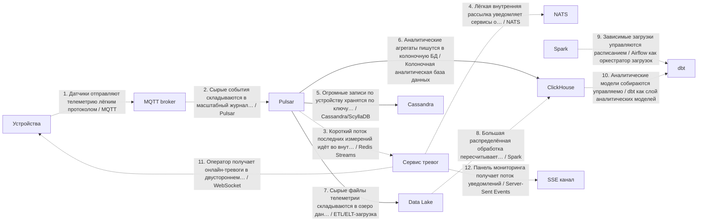
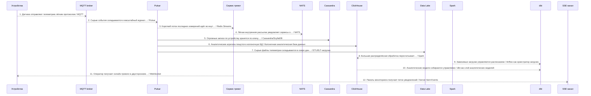
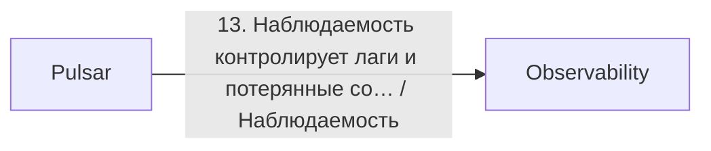

# Архитектурный разбор: Сложный кейс 2: IoT-телеметрия и онлайн-тревоги

## Короткий человеческий вывод

**Итог:** НЕ ГОТОВО: слишком много рисков. **Архитектурная готовность:** 3.7/10. **Готовность к промышленному запуску:** нельзя выпускать без закрытия блокеров.

**Полнота вводных:** 56%. **Надёжность рекомендаций:** низкая.

**Масштаб процесса:** 13 взаимодействий, из них 12 в основной цепочке и 1 сквозных контролей. Участников: 15.

**Бизнес-цель:** Датчики присылают события, нужны быстрые тревоги, хранение истории, аналитика и онлайн-каналы.
**Основная сущность:** DeviceTelemetry. Деньги: нет. Регуляторика: нет. Клиентский сценарий: да.

**Как читать оценку:** низкая оценка не означает, что все выбранные технологии неправильные. Она означает, что до запуска есть блокеры: не закрыты гарантии доставки, восстановления, безопасности, сверки или эксплуатации.

## Что блокирует запуск

| Приоритет | Проблема | Где проявляется | Что сделать |
|---|---|---|---|
| Высокий | Замена legacy-системы описана без плана переключения. | Весь процесс | Используйте strangler-подход: параллельный прогон со сверкой старого и нового контура, поэтапное переключение трафика по процентам или сегментам, критерии переключения и план отката с сохранением данных, накопленных в новом контуре. |
| Высокий | Высоконагруженный поток не имеет контролей приёма потока. | Пик 6000 RPS: «Датчики отправляют телеметрию лёгким протоколом», «Сырые события складываются в масштабный журнал событий», «Короткий поток последних измерений идёт во внутренние обработчики» | Используйте партиционирование по ключу и контроль горячих партиций; учитывайте время события и контрольную отметку загрузки с политикой обработки запоздалых событий; настройте обратное давление и алерты на лаг и пропускную способность. |
| Высокий | аналитическое хранилище или аналитика находятся в операционном основном потоке. | Затронуто мест: 2 | Сделайте шаг non-blocking: используйте CDC, ETL или событие после фиксации результата в операционной системе. |
| Средний | Событие не содержит обязательную обёртку события. | «Датчики отправляют телеметрию лёгким протоколом» | Зафиксируйте единую обёртку события: идентификатор события, тип события, версия события, идентификатор агрегата или entityId, сквозной идентификатор или идентификатор трассировки, время возникновения события, производитель события и тело сообщения. |
| Средний | У зависимости есть лимиты запросов. | Затронуто мест: 2 | Добавьте клиентский ограничитель запросов и очередь выравнивания и увеличение паузы между повторами со случайным разбросом. |
| Средний | Для потокового потребителя не описаны обязательные контроли. | Затронуто мест: 3 | Добавьте метрику отставание потребителей и алерт; настройте обратное давление или ограничение параллелизма; sink должен быть идемпотентным; позиция чтения нужно коммитить только после обработки; если читается общий топик, добавьте filter ratio как отдельную метрику. |
| Средний | Важный асинхронный процесс не имеет сверки. | Весь процесс | Добавьте регулярную сверку источника истины с потребителями: ожидаемые и фактические данные, отчёт расхождений, автоматическое довосстановление там, где это безопасно, и ручной разбор. |
| Средний | Для порядка событий в рамках сущности не задан ключ партиционирования. | «Датчики отправляют телеметрию лёгким протоколом», «Сырые события складываются в масштабный журнал событий», «Короткий поток последних измерений идёт во внутренние обработчики», «Лёгкая внутренняя рассылка уведомляет сервисы о тревоге» | Партиционируйте события по entityId и явно укажите этот ключ во входных данных шага. |
| Информация | Ещё 2 менее приоритетных замечаний | См. приложение с полным чек-листом | Разобрать после закрытия основных блокеров |

## Рекомендуемый порядок действий

1. Зафиксировать ключ идемпотентности и уникальный индекс для повторных запросов, событий и повторной обработки.
2. Добавить сверку ожидаемых и фактических данных и процедуру восстановления расхождений.
3. Для асинхронных участков описать лимит повторов, очередь ошибок, владельца разбора и повторную обработку.
4. Описать план перехода со старого контура: параллельный прогон, критерии переключения и откат.
5. Для высоконагруженного потока описать партиционирование, горячие ключи, обратное давление и алерты на лаг.
6. После исправлений повторить архитектурную проверку и зафиксировать принятые компромиссы в ADR.

## Проверка логики схемы

Схема не содержит очевидных противоречий между названием связи, участниками и выбранным основным способом взаимодействия.

## Почему выбраны технологии и способы взаимодействия

### Объяснение по шагам

Решения ниже сгруппированы по смыслу. В основной цепочке показано, **кто с кем взаимодействует и каким способом**. Сквозные вещи — аудит, безопасность, авторизация, наблюдаемость, секреты — вынесены отдельно и не смешиваются с бизнес-потоком.

Для каждого решения указано: **Почему выбрано**, **Почему не другой вариант**, **Обязательные условия**, **Почему предлагается именно так** и **Почему нельзя просто не делать**.

### API и онлайн-взаимодействие

### Шаг 11. Оператор получает онлайн-тревоги в двустороннем канале

**Что:** шаг 11 — «Оператор получает онлайн-тревоги в двустороннем канале». Основной способ взаимодействия: WebSocket.
**Где:** связь идёт от «Сервис тревог» к «Устройства». Исполнитель: «WebSocket канал». Выполняется после: шаг 4 «Лёгкая внутренняя рассылка уведомляет сервисы о тревоге».
**Почему:** Подходит для двустороннего онлайн-канала, где сервер и клиент обмениваются сообщениями в рамках открытого соединения.
**Почему не другой вариант:** SSE проще для однонаправленных уведомлений от сервера клиенту. REST требует частых опросов. Kafka/RabbitMQ не являются клиентским онлайн-каналом.
**Что проверить перед выпуском:** Нужны heartbeat, переподключение, лимит соединений, авторизация сессии, обратное давление и стратегия доставки пропущенных сообщений.

### Шаг 12. Панель мониторинга получает поток уведомлений

**Что:** шаг 12 — «Панель мониторинга получает поток уведомлений». Основной способ взаимодействия: Server-Sent Events.
**Где:** связь идёт от «Сервис тревог» к «SSE канал». Исполнитель: «SSE канал». Выполняется после: шаг 4 «Лёгкая внутренняя рассылка уведомляет сервисы о тревоге».
**Почему:** Подходит для однонаправленного потока уведомлений от сервера клиенту поверх HTTP, когда клиенту не нужно отправлять сообщения назад по тому же каналу.
**Почему не другой вариант:** WebSocket нужен для двустороннего обмена. REST периодический опрос создаёт лишнюю нагрузку. Брокер сообщений может быть внутри, но не заменяет клиентский поток.
**Что проверить перед выпуском:** Нужны Last-Event-ID, переподключение, лимит соединений, контроль частоты событий и запасной сценарий для клиентов без поддержки SSE.

### Асинхронный обмен

### Шаг 1. Датчики отправляют телеметрию лёгким протоколом

**Что:** шаг 1 — «Датчики отправляют телеметрию лёгким протоколом». Основной способ взаимодействия: MQTT.
**Где:** связь идёт от «Устройства» к «MQTT broker». Исполнитель: «MQTT broker». Выполняется после: начало процесса или внешний запуск.
**Почему:** Подходит для устройств, датчиков и IoT-сценариев, где важны лёгкий протокол, темы сообщений и разные уровни гарантии доставки.
**Почему не другой вариант:** REST тяжелее для частых сообщений от устройств. Kafka может принять поток дальше внутри платформы, но не всегда удобна как протокол подключения устройств.
**Что проверить перед выпуском:** Нужны топик-структура, QoS, идентификация устройства, контроль повторов, управление сессиями и защита канала.

### Шаг 2. Сырые события складываются в масштабный журнал событий

**Что:** шаг 2 — «Сырые события складываются в масштабный журнал событий». Основной способ взаимодействия: Pulsar.
**Где:** связь идёт от «MQTT broker» к «Pulsar». Исполнитель: «Pulsar». Выполняется после: шаг 1 «Датчики отправляют телеметрию лёгким протоколом».
**Почему:** Подходит для масштабного потока событий, когда нужны независимое хранение, много подписок, разделение хранения и вычисления или сложная многоклиентская модель.
**Почему не другой вариант:** Kafka чаще проще найти в командах и инфраструктуре. RabbitMQ лучше для очереди задач. Pulsar стоит выбирать, когда его преимущества реально нужны и команда умеет его сопровождать.
**Служебные компоненты:** Нужна сверка полноты между источником и аналитическим контуром: количество записей, ключи, контрольные суммы и отчёт расхождений.
**Что проверить перед выпуском:** Нужны клиент/tenant, пространство имён и топик, срок хранения, накопление очереди, тип подписки, ключ порядка, мониторинг накопления очереди и план эксплуатации BookKeeper/хранилища.

### Шаг 3. Короткий поток последних измерений идёт во внутренние обработчики

**Что:** шаг 3 — «Короткий поток последних измерений идёт во внутренние обработчики». Основной способ взаимодействия: Redis Streams.
**Где:** связь идёт от «Pulsar» к «Сервис тревог». Исполнитель: «Redis Streams». Выполняется после: шаг 2 «Сырые события складываются в масштабный журнал событий».
**Почему:** Подходит для лёгкого потока событий или задач внутри контура, когда уже используется Redis и требования к долговременному хранению ниже, чем у Kafka.
**Почему не другой вариант:** Kafka надёжнее для долгого журнал событий и масштабной повторной обработки. RabbitMQ удобнее для сложной маршрутизации задач. Redis cache не является очередью событий.
**Что проверить перед выпуском:** Нужны группа потребителей, контроль зависшие сообщения, политика обрезки stream и понимание настроек сохранности Redis.

### Шаг 4. Лёгкая внутренняя рассылка уведомляет сервисы о тревоге

**Что:** шаг 4 — «Лёгкая внутренняя рассылка уведомляет сервисы о тревоге». Основной способ взаимодействия: NATS.
**Где:** связь идёт от «Сервис тревог» к «Сервис тревог». Исполнитель: «NATS». Выполняется после: шаг 3 «Короткий поток последних измерений идёт во внутренние обработчики».
**Почему:** Подходит для лёгкой внутренней рассылки сообщений с малой задержкой, когда нужна простая pub/sub-модель без тяжёлого брокера.
**Почему не другой вариант:** Kafka лучше для долговременного журнала и повторная обработка. RabbitMQ лучше для надёжной очереди задач. NATS выбирается, когда важна простота и скорость, а не длительное хранение событий.
**Что проверить перед выпуском:** Нужны правила именования subject-ов, правила подписки, допустимость потерь/JetStream при необходимости, мониторинг и ограничения размера сообщений.

### Данные и чтение

### Шаг 5. Огромные записи по устройству хранятся по ключу устройства

**Что:** шаг 5 — «Огромные записи по устройству хранятся по ключу устройства». Основной способ взаимодействия: Cassandra/ScyllaDB.
**Где:** связь идёт от «Pulsar» к «Cassandra». Исполнитель: «Cassandra». Выполняется после: шаг 2 «Сырые события складываются в масштабный журнал событий».
**Почему:** Подходит для очень больших распределённых записей по ключу, высокой записи и предсказуемых запросов по ключу партиционирования.
**Почему не другой вариант:** Реляционная БД проще для транзакций и ad-hoc запросов. MongoDB удобнее для документов. Cassandra плоха, если заранее неизвестны ключи доступа.
**Служебные компоненты:** БД процесса нужна как служебный компонент: она фиксирует состояние, ключ идемпотентности и историю шага.
**Что проверить перед выпуском:** Нужен ключ партиционирования, ключ кластеризации, уровень консистентности, TTL, процедуры восстановления и уплотнения данных и проверка горячих партиций.

### Аналитика и загрузки

### Шаг 6. Аналитические агрегаты пишутся в колоночную БД

**Что:** шаг 6 — «Аналитические агрегаты пишутся в колоночную БД». Основной способ взаимодействия: Колоночная аналитическая база данных.
**Где:** связь идёт от «Pulsar» к «ClickHouse». Исполнитель: «ClickHouse». Выполняется после: шаг 2 «Сырые события складываются в масштабный журнал событий».
**Почему:** Подходит для быстрой аналитики по большим таблицам, агрегаций, витрин и отчётов по событиям.
**Почему не другой вариант:** Операционная БД не должна выполнять тяжёлую аналитику. аналитическое хранилище шире по назначению, но ClickHouse удобен для быстрых аналитических запросов и логовых витрин.
**Служебные компоненты:** Нужна сверка полноты между источником и аналитическим контуром: количество записей, ключи, контрольные суммы и отчёт расхождений.
**Что проверить перед выпуском:** Нужны партиционирование, ключ сортировки, контроль свежести, политика хранения и сверка с источником.

### Шаг 7. Сырые файлы телеметрии складываются в озеро данных

**Что:** шаг 7 — «Сырые файлы телеметрии складываются в озеро данных». Основной способ взаимодействия: ETL/ELT-загрузка.
**Где:** связь идёт от «Pulsar» к «Data Lake». Исполнитель: «Data Lake». Выполняется после: шаг 2 «Сырые события складываются в масштабный журнал событий».
**Почему:** Подходит для передачи данных в аналитический контур с преобразованием, контролем качества и подготовкой витрин.
**Почему не другой вариант:** Операционная БД является источником данных, но не способом доставки в аналитику. Прямая запись сервиса в аналитическое хранилище повышает связанность. CDC лучше для передачи изменений почти в реальном времени, Batch — для регламентной периодической загрузки.
**Служебные компоненты:** Нужна сверка полноты между источником и аналитическим контуром: количество записей, ключи, контрольные суммы и отчёт расхождений.
**Что проверить перед выпуском:** Нужны правила преобразования, контроль количества записей, журнал загрузки, карантин ошибок, повторный запуск периода и сверка с источником.

### Шаг 8. Большая распределённая обработка пересчитывает историю

**Что:** шаг 8 — «Большая распределённая обработка пересчитывает историю». Основной способ взаимодействия: Spark.
**Где:** связь идёт от «Data Lake» к «ClickHouse». Исполнитель: «Spark». Выполняется после: шаг 7 «Сырые файлы телеметрии складываются в озеро данных».
**Почему:** Подходит для большой распределённой обработки данных: тяжёлые преобразования, агрегации, пересчёты истории и обработка больших файлов.
**Почему не другой вариант:** Обычный batch проще для малых объёмов. ClickHouse/аналитическое хранилище лучше для запросов по уже подготовленным данным. Spark нужен именно для распределённого вычисления.
**Служебные компоненты:** Нужна сверка полноты между источником и аналитическим контуром: количество записей, ключи, контрольные суммы и отчёт расхождений.
**Что проверить перед выпуском:** Нужны партиционирование, checkpoint, контроль shuffle, повторный запуск, ресурсы кластера и контроль качества результата.

### Шаг 9. Зависимые загрузки управляются расписанием

**Что:** шаг 9 — «Зависимые загрузки управляются расписанием». Основной способ взаимодействия: Airflow как оркестратор загрузок.
**Где:** связь идёт от «Spark» к «dbt». Исполнитель: «Airflow». Выполняется после: шаг 8 «Большая распределённая обработка пересчитывает историю».
**Почему:** Подходит для управления зависимыми заданиями: загрузки, проверки, преобразования, ожидания файлов и повторные запуски.
**Почему не другой вариант:** Один batch-скрипт проще, но быстро становится неуправляемым при зависимостях и целевое время ответа. Kafka не решает расписание и DAG-зависимости загрузок.
**Служебные компоненты:** Нужна сверка полноты между источником и аналитическим контуром: количество записей, ключи, контрольные суммы и отчёт расхождений.
**Что проверить перед выпуском:** Нужен DAG, расписание, политика повторных попыток, целевое время ответа, алерты, дозагрузка исторических данных или повторный запуск и правила обработки частично выполненных загрузок.

### Шаг 10. Аналитические модели собираются управляемо

**Что:** шаг 10 — «Аналитические модели собираются управляемо». Основной способ взаимодействия: dbt как слой аналитических моделей.
**Где:** связь идёт от «ClickHouse» к «ClickHouse». Исполнитель: «dbt». Выполняется после: шаг 9 «Зависимые загрузки управляются расписанием».
**Почему:** Подходит для управляемых SQL-моделей, тестов качества, происхождение данных и прозрачной сборки аналитических витрин.
**Почему не другой вариант:** ETL-инструмент шире по загрузке данных, но dbt удобен для трансформаций внутри хранилища. Ручные SQL-скрипты хуже сопровождаются и тестируются.
**Служебные компоненты:** Нужна сверка полноты между источником и аналитическим контуром: количество записей, ключи, контрольные суммы и отчёт расхождений.
**Что проверить перед выпуском:** Нужны модели, тесты, проверки свежести данных, документация, происхождение данных, окружения и правила релиза.

## Сквозные контроли и служебные компоненты

Эти элементы не являются отдельными бизнес-шагами. Они применяются к процессу как контроль безопасности, эксплуатации, аудита или инфраструктуры.

### Контроль 13. Наблюдаемость контролирует лаги и потерянные сообщения

**Назначение:** Наблюдаемость.
**Где применяется:** «Pulsar» → «Observability» или ко всему процессу.
**Зачем нужен:** Подходит, чтобы видеть, где завис процесс: метрики, логи, трассировки, алерты и бизнес-события по состояниям.
**Что проверить:** Нужны идентификатор сквозной связи, метрики задержки и ошибок, трассировка, алерты по очередям/лагу/ошибкам, дашборды и инструкции разбора.

## Контрольные проверки готовности к промышленному запуску

| Область | Статус | Что важно |
|---|---|---|
| Контракт | Блокирует выпуск | Каждое событие содержит стандартную обёртку события.; Для клиентского API описана модель ошибок. |
| Надёжность | Требует проверки | Для асинхронной обработки задан лимит попыток и очередь ошибок или карантин. |
| Целостность данных | Блокирует выпуск | Для процесса предусмотрена сверка. |
| Наблюдаемость | Проходит | Явных проблем не найдено. |
| Безопасность | Проходит | Явных проблем не найдено. |
| Производительность | Требует проверки | Для нагрузки описаны пропускная способность, обратное давление и отставание потребителей. |
| Эксплуатация и внедрение | Проходит | Явных проблем не найдено. |

## Какие вводные нужно уточнить

| Приоритет | Область | Что уточнить | Почему важно |
|---|---|---|---|
| high | Надёжность | Куда попадает сообщение после исчерпания попыток? | Без очереди ошибок/карантина poison message может потеряться или бесконечно крутиться. |
| medium | Данные | Какой natural/бизнес-ключ или operationId уникально определяет операцию? | Без уникального ключа сложно гарантировать dedup и повторную обработку без дублей. |
| medium | Внешние системы | Какие лимиты запросов у внешних систем и что делать при 429/лимите? | Без лимитов нельзя оценить пиковую нагрузку и обратное давление. |
| medium | Отказоустойчивость | Какая деградация допустима при отказе внешней системы? | Иначе отказ партнёра становится отказом вашего сценария. |
| medium | целевое время ответа | Какое целевое время ответа и таймаут для пользовательского или системного ответа? | Без целевого времени ответа невозможно распределить бюджет таймаутов и понять, где нужна async-граница. |
| medium | Сверка | Как сверяются расхождения между источником истины и потребителями? | Техническая доставка не гарантирует бизнесовую полноту и согласованность. |
| Информация | Владение | Кто владельцы систем, контрактов и алертов? | Без владельцев неясны ответственность и эскалация. |

## Краткая сводка по стеку

| Технология / способ | Где применяется |
|---|---:|
| Airflow как оркестратор загрузок | 1 |
| Cassandra/ScyllaDB | 1 |
| dbt как слой аналитических моделей | 1 |
| ETL/ELT-загрузка | 1 |
| MQTT | 1 |
| NATS | 1 |
| Pulsar | 1 |
| Redis Streams | 1 |
| Server-Sent Events | 1 |
| Spark | 1 |
| WebSocket | 1 |
| Колоночная аналитическая база данных | 1 |

<details>
<summary>Приложение A. Полная таблица по всем шагам</summary>

| Шаг | Связь | Основной способ | Что проверить |
|---|---|---|---|
| 1. Датчики отправляют телеметрию лёгким протоколом | Устройства → MQTT broker. Исполнитель: MQTT broker | MQTT | Нужны топик-структура, QoS, идентификация устройства, контроль повторов, управление сессиями и защита канала. |
| 2. Сырые события складываются в масштабный журнал событий | MQTT broker → Pulsar. Исполнитель: Pulsar | Pulsar | Нужны клиент/tenant, пространство имён и топик, срок хранения, накопление очереди, тип подписки, ключ порядка, мониторинг накопления очереди и план эксплуатации BookKeeper/хранилища. |
| 3. Короткий поток последних измерений идёт во внутренние обработчики | Pulsar → Сервис тревог. Исполнитель: Redis Streams | Redis Streams | Нужны группа потребителей, контроль зависшие сообщения, политика обрезки stream и понимание настроек сохранности Redis. |
| 4. Лёгкая внутренняя рассылка уведомляет сервисы о тревоге | Сервис тревог → NATS. Исполнитель: NATS | NATS | Нужны правила именования subject-ов, правила подписки, допустимость потерь/JetStream при необходимости, мониторинг и ограничения размера сообщений. |
| 5. Огромные записи по устройству хранятся по ключу устройства | Pulsar → Cassandra. Исполнитель: Cassandra | Cassandra/ScyllaDB | Нужен ключ партиционирования, ключ кластеризации, уровень консистентности, TTL, процедуры восстановления и уплотнения данных и проверка горячих партиций. |
| 6. Аналитические агрегаты пишутся в колоночную БД | Pulsar → ClickHouse. Исполнитель: ClickHouse | Колоночная аналитическая база данных | Нужны партиционирование, ключ сортировки, контроль свежести, политика хранения и сверка с источником. |
| 7. Сырые файлы телеметрии складываются в озеро данных | Pulsar → Data Lake. Исполнитель: Data Lake | ETL/ELT-загрузка | Нужны правила преобразования, контроль количества записей, журнал загрузки, карантин ошибок, повторный запуск периода и сверка с источником. |
| 8. Большая распределённая обработка пересчитывает историю | Data Lake → ClickHouse. Исполнитель: Spark | Spark | Нужны партиционирование, checkpoint, контроль shuffle, повторный запуск, ресурсы кластера и контроль качества результата. |
| 9. Зависимые загрузки управляются расписанием | Spark → dbt. Исполнитель: Airflow | Airflow как оркестратор загрузок | Нужен DAG, расписание, политика повторных попыток, целевое время ответа, алерты, дозагрузка исторических данных или повторный запуск и правила обработки частично выполненных загрузок. |
| 10. Аналитические модели собираются управляемо | ClickHouse → dbt. Исполнитель: dbt | dbt как слой аналитических моделей | Нужны модели, тесты, проверки свежести данных, документация, происхождение данных, окружения и правила релиза. |
| 11. Оператор получает онлайн-тревоги в двустороннем канале | Сервис тревог → Устройства. Исполнитель: WebSocket канал | WebSocket | Нужны heartbeat, переподключение, лимит соединений, авторизация сессии, обратное давление и стратегия доставки пропущенных сообщений. |
| 12. Панель мониторинга получает поток уведомлений | Сервис тревог → SSE канал. Исполнитель: SSE канал | Server-Sent Events | Нужны Last-Event-ID, переподключение, лимит соединений, контроль частоты событий и запасной сценарий для клиентов без поддержки SSE. |

</details>

<details>
<summary>Приложение B. Найденные риски и слабые места</summary>

## Найденные риски и слабые места

### Высокий риск

#### Замена legacy-системы описана без плана переключения.

**Что:** найден риск «Замена legacy-системы описана без плана переключения.». затронуто мест: 1.
**Затронутые места:** Весь процесс.
**Почему это важно:** Миграция — это не просто «включили новое»: без параллельного прогона и плана отката первый серьёзный дефект нового контура может остановить бизнес.
**Что нужно сделать:** Используйте strangler-подход: параллельный прогон со сверкой старого и нового контура, поэтапное переключение трафика по процентам или сегментам, критерии переключения и план отката с сохранением данных, накопленных в новом контуре.

#### Высоконагруженный поток не имеет контролей приёма потока.

**Что:** найден риск «Высоконагруженный поток не имеет контролей приёма потока.». затронуто мест: 1.
**Затронутые места:** Пик 6000 RPS: «Датчики отправляют телеметрию лёгким протоколом», «Сырые события складываются в масштабный журнал событий», «Короткий поток последних измерений идёт во внутренние обработчики».
**Почему это важно:** На таком потоке неизбежны out-of-order события, опоздавшие события, горячие партиции и всплески нагрузки, которые потребитель может не обработать вовремя.
**Что нужно сделать:** Используйте партиционирование по ключу и контроль горячих партиций; учитывайте время события и контрольную отметку загрузки с политикой обработки запоздалых событий; настройте обратное давление и алерты на лаг и пропускную способность.

#### аналитическое хранилище или аналитика находятся в операционном основном потоке.

**Что:** найден риск «аналитическое хранилище или аналитика находятся в операционном основном потоке.». затронуто мест: 2.
**Затронутые места:** Затронуто мест: 2.
**Почему это важно:** Аналитическое хранилище обычно не обеспечивает операционный целевое время ответа: его деградация не должна останавливать основной бизнес-процесс.
**Что нужно сделать:** Сделайте шаг non-blocking: используйте CDC, ETL или событие после фиксации результата в операционной системе.

### Средний риск

#### Событие не содержит обязательную обёртку события.

**Что:** найден риск «Событие не содержит обязательную обёртку события.». затронуто мест: 1.
**Затронутые места:** «Датчики отправляют телеметрию лёгким протоколом».
**Почему это важно:** Событие можно доставить, но его сложно дедуплицировать, трассировать, версионировать и восстанавливать после инцидента: не хватает типа события, версии события и времени возникновения события, идентификатор агрегата.
**Что нужно сделать:** Зафиксируйте единую обёртку события: идентификатор события, тип события, версия события, идентификатор агрегата или entityId, сквозной идентификатор или идентификатор трассировки, время возникновения события, производитель события и тело сообщения.

#### У зависимости есть лимиты запросов.

**Что:** найден риск «У зависимости есть лимиты запросов.». затронуто мест: 2.
**Затронутые места:** Затронуто мест: 2.
**Почему это важно:** Лимиты провайдера могут превратить пик нагрузки в шторм ошибок 429.
**Что нужно сделать:** Добавьте клиентский ограничитель запросов и очередь выравнивания и увеличение паузы между повторами со случайным разбросом.

#### Для потокового потребителя не описаны обязательные контроли.

**Что:** найден риск «Для потокового потребителя не описаны обязательные контроли.». затронуто мест: 3.
**Затронутые места:** Затронуто мест: 3.
**Почему это важно:** Высоконагруженное чтение из брокера без явных контролей опасно: отставание обработки может расти незаметно, а перегрузка будет ронять потребителя.
**Что нужно сделать:** Добавьте метрику отставание потребителей и алерт; настройте обратное давление или ограничение параллелизма; sink должен быть идемпотентным; позиция чтения нужно коммитить только после обработки; если читается общий топик, добавьте filter ratio как отдельную метрику.

#### Важный асинхронный процесс не имеет сверки.

**Что:** найден риск «Важный асинхронный процесс не имеет сверки.». затронуто мест: 1.
**Затронутые места:** Весь процесс.
**Почему это важно:** Повторная попытка и очередь ошибок закрывают технические сбои, но не доказывают, что все бизнес-сущности дошли до финального состояния и что банк, партнёр или витрина не разошлись по данным.
**Что нужно сделать:** Добавьте регулярную сверку источника истины с потребителями: ожидаемые и фактические данные, отчёт расхождений, автоматическое довосстановление там, где это безопасно, и ручной разбор.

#### Для порядка событий в рамках сущности не задан ключ партиционирования.

**Что:** найден риск «Для порядка событий в рамках сущности не задан ключ партиционирования.». затронуто мест: 1.
**Затронутые места:** «Датчики отправляют телеметрию лёгким протоколом», «Сырые события складываются в масштабный журнал событий», «Короткий поток последних измерений идёт во внутренние обработчики», «Лёгкая внутренняя рассылка уведомляет сервисы о тревоге».
**Почему это важно:** Без ключ партиционирования события одной сущности могут разойтись по разным партициям и быть обработаны в неправильном порядке.
**Что нужно сделать:** Партиционируйте события по entityId и явно укажите этот ключ во входных данных шага.

### Информация

#### Для критичной системы не указан владелец.

**Что:** найден риск «Для критичной системы не указан владелец.». затронуто мест: 13.
**Затронутые места:** Затронуто мест: 13.
**Почему это важно:** При инциденте будет непонятно, кто отвечает за целевое время ответа, контракт, лимиты, повторная обработка и согласование изменений.
**Что нужно сделать:** Зафиксируйте владельца системы или команды, канал поддержки, SLO и порядок эскалации.

#### Для служебных таблиц не описана политика роста и очистки.

**Что:** найден риск «Для служебных таблиц не описана политика роста и очистки.». затронуто мест: 1.
**Затронутые места:** outbox + журнал шагов.
**Почему это важно:** Эти таблицы пополняются на каждое событие; без архивации и партиционирования они со временем ухудшат latency запросов и существенно раздуют БД.
**Что нужно сделать:** Добавьте партиционирование по времени, архивацию или перенос в холодное хранилище, а также очистку опубликованных записей таблицы исходящих сообщений; контролируйте размер таблиц и время запросов к ним.


</details>

<details>
<summary>Приложение C. Сценарная основа для дальнейшей разработки</summary>

## Сценарная основа для дальнейшей разработки

Этот раздел нужен не для выбора технологий, а для постановки на разработку и тестирование: какой поток считается успешным, какие есть альтернативы, что происходит при ошибках и как проверять готовность.

### Основной сценарий

| Шаг | Связь | Что происходит | Ожидаемый результат |
|---|---|---|---|
| 1 | Устройства → MQTT broker | Датчики отправляют телеметрию лёгким протоколом | сообщение принято в брокер, дальнейшая обработка идёт асинхронно, статус процесса отслеживается отдельно |
| 2 | MQTT broker → Pulsar | Сырые события складываются в масштабный журнал событий | сообщение принято в брокер, дальнейшая обработка идёт асинхронно, статус процесса отслеживается отдельно |
| 3 | Pulsar → Сервис тревог | Короткий поток последних измерений идёт во внутренние обработчики | сообщение принято в брокер, дальнейшая обработка идёт асинхронно, статус процесса отслеживается отдельно |
| 4 | Сервис тревог → NATS | Лёгкая внутренняя рассылка уведомляет сервисы о тревоге | сообщение принято в брокер, дальнейшая обработка идёт асинхронно, статус процесса отслеживается отдельно |
| 5 | Pulsar → Cassandra | Огромные записи по устройству хранятся по ключу устройства | состояние или данные сохранены с защитой от дублей и конкурентных изменений |
| 6 | Pulsar → ClickHouse | Аналитические агрегаты пишутся в колоночную БД | данные доставлены в аналитический контур, полнота загрузки подтверждается сверкой |
| 7 | Pulsar → Data Lake | Сырые файлы телеметрии складываются в озеро данных | данные доставлены в аналитический контур, полнота загрузки подтверждается сверкой |
| 8 | Data Lake → ClickHouse | Большая распределённая обработка пересчитывает историю | данные доставлены в аналитический контур, полнота загрузки подтверждается сверкой |
| 9 | Spark → dbt | Зависимые загрузки управляются расписанием | данные доставлены в аналитический контур, полнота загрузки подтверждается сверкой |
| 10 | ClickHouse → dbt | Аналитические модели собираются управляемо | данные доставлены в аналитический контур, полнота загрузки подтверждается сверкой |
| 11 | Сервис тревог → Устройства | Оператор получает онлайн-тревоги в двустороннем канале | шаг завершён, результат отражён в статусе процесса или журнале шагов |
| 12 | Сервис тревог → SSE канал | Панель мониторинга получает поток уведомлений | шаг завершён, результат отражён в статусе процесса или журнале шагов |

### Альтернативные сценарии

#### Асинхронное принятие заявки без ожидания финального результата

**Когда возникает:** Хвост процесса занимает больше допустимого времени ответа или зависит от внешних систем.
**Как должен пройти сценарий:**
1. Система принимает запрос и создаёт идентификатор отслеживания.
2. Клиенту или вызывающей системе возвращается подтверждение приёма.
3. Дальнейшая обработка идёт через событие/очередь.
4. Статус процесса обновляется после каждого значимого шага.
**Ожидаемый результат:** Пользователь или потребитель видит промежуточный статус, а не зависший запрос.
**Обязательные проверки:** идентификатор отслеживания обязателен; GET /status или событие статуса; финальные статусы должны быть согласованы.

#### Повторная доставка или повторный запрос

**Когда возникает:** Сеть оборвалась, производитель события отправил событие повторно или потребитель переобработал сообщение.
**Как должен пройти сценарий:**
1. Система получает тот же ключ идемпотентности/идентификатор события/бизнес-ключ.
2. Выполняется попытка вставки ключа в таблицу входящих сообщений для защиты от дублей или поиск существующей операции.
3. Если ключ уже обработан, система возвращает прежний результат без повторного изменения бизнес-состояния.
**Ожидаемый результат:** Повтор не создаёт дубль операции, документа, проводки или статуса.
**Обязательные проверки:** UNIQUE-индекс на ключ идемпотентности; фиксация позиции чтения только после успешной обработки; тест дубля обязателен.

#### Расхождение данных между источником истины и потребителем

**Когда возникает:** Техническая доставка прошла не полностью, повторная обработка былааа пропущена или потребитель отстал.
**Как должен пройти сценарий:**
1. Регламентная сверка сравнивает ожидаемые и фактические состояния.
2. Найденные расхождения попадают в отчёт.
3. Безопасные расхождения восстанавливаются автоматически.
4. Опасные расхождения уходят на ручной разбор.
**Ожидаемый результат:** Бизнес видит не только техническую доставку, но и фактическую полноту процесса.
**Обязательные проверки:** регулярная сверка; отчёт расхождений; владелец ручного разбора; аудит исправлений.

#### Асинхронная обработка без ожидания финального результата

**Когда возникает:** Часть процесса длится дольше допустимого времени ответа или зависит от очереди/брокера.
**Как должен пройти сценарий:**
1. создать идентификатор отслеживания.
2. зафиксировать статус PROCESSING.
3. передать сообщение в брокер.
4. обновлять статус по мере обработки.
**Ожидаемый результат:** вызывающая сторона не висит в ожидании, а видит отслеживаемый статус.
**Обязательные проверки:** ключ идемпотентности; очередь ошибок; повторная обработка; метрики отставания.

#### Повторная загрузка или сверка аналитических данных

**Когда возникает:** Найдены расхождения между источником и аналитическим контуром либо загрузка завершилась частично.
**Как должен пройти сценарий:**
1. сравнить ожидаемые и фактические данные.
2. выделить расхождения.
3. безопасно перезапустить период или идентификатор пакета.
4. зафиксировать результат сверки.
**Ожидаемый результат:** аналитический контур восстановлен без повторного применения уже обработанных данных.
**Обязательные проверки:** идентификатор пакета; контрольные суммы; журнал загрузки; отчёт расхождений.

### Ошибочные сценарии и восстановление

| Ошибка | Где возникает | Как система должна восстановиться |
|---|---|---|
| аналитическое хранилище или аналитика находятся в операционном основном потоке. | Затронуто мест: 2. Шаг 6 «Аналитические агрегаты пишутся в колоночную БД» → ClickHouse; Шаг 7 «Сырые файлы телеметрии складываются в озеро данных» → Data Lake | Сделайте шаг non-blocking: используйте CDC, ETL или событие после фиксации результата в операционной системе. |
| Замена legacy-системы описана без плана переключения. | Весь процесс | Используйте strangler-подход: параллельный прогон со сверкой старого и нового контура, поэтапное переключение трафика по процентам или сегментам, критерии переключения и план отката с сохранением данных, накопленных в новом контуре. |
| Высоконагруженный поток не имеет контролей приёма потока. | Пик 6000 RPS: «Датчики отправляют телеметрию лёгким протоколом», «Сырые события складываются в масштабный журнал событий», «Короткий поток последних измерений идёт во внутренние обработчики» | Используйте партиционирование по ключу и контроль горячих партиций; учитывайте время события и контрольную отметку загрузки с политикой обработки запоздалых событий; настройте обратное давление и алерты на лаг и пропускную способность. |

### Критерии приёмки сценариев

- основной сценарий проходит до финального статуса без ручного вмешательства.
- повторный запрос или повторное событие не создаёт дубль бизнес-операции.
- таймаут внешней системы переводит процесс в понятный статус и создаёт алерт.
- сообщение после исчерпания попыток попадает в очередь ошибок или карантин.
- по идентификатору сквозной связи можно найти все шаги процесса.
- Основной успешный сценарий проходит от первого шага до финального статуса без ручного вмешательства.
- Каждый отказ из error-flow переводит процесс в понятный статус и оставляет запись в журнале.
- По сквозной идентификатор / идентификатор отслеживания можно найти все шаги одного процесса в логах и БД.

</details>

<details>
<summary>Приложение D. Артефакты для постановки и выпуска</summary>

## Варианты архитектурного решения

1. **Вариант A — минимально допустимый фикс** — срок короткий и нельзя сильно менять архитектуру.
2. **Вариант B — промышленный запуск-компромисс** — нужен рабочий вариант промышленного запуска для типовой корпоративной интеграции.
3. **Вариант C — целевая архитектура** — поток критичен, регуляторен, денежный или станет платформенным.

## Готовность к выпуску

- Все критичные и высокие находки закрыты или приняты в ADR как осознанный риск.
- Идемпотентность и обработка дублей покрыты автотестами.
- очередь ошибок, повторная обработка и инструкция разбора проверены на тестовом контуре.
- Метрики, алерты и идентификатор сквозной связи видны в логах/трейсах.
- Контрактные тесты производитель события↔потребитель проходят в CI.
- Нагрузочный тест подтверждает целевое время ответа и допустимое отставание обработки.

## Черновик контракта события

- **идентификатор события:** UUID, уникальный идентификатор события
- **тип события:** доменный тип события
- **версия события:** версия схемы
- **идентификатор агрегата:** идентификатор сущности DeviceTelemetry
- **идентификатор сквозной связи:** сквозная трассировка процесса
- **время возникновения события:** момент бизнес-события
- **производитель события:** система-источник
- **тело сообщения:** только необходимые доменные поля без лишних ПДн

## Чек-лист проверок и тестов

- Основной успешный сценарий: процесс проходит все шаги до финального статуса.
- Отказ шага 5 «Огромные записи по устройству хранятся по ключу устройства»: таймаут/5xx — процесс не зависает, статус и алерт корректны.
- Отказ шага 6 «Аналитические агрегаты пишутся в колоночную БД»: таймаут/5xx — процесс не зависает, статус и алерт корректны.
- Отказ шага 7 «Сырые файлы телеметрии складываются в озеро данных»: таймаут/5xx — процесс не зависает, статус и алерт корректны.
- Отказ шага 13 «Наблюдаемость контролирует лаги и потерянные сообщения»: таймаут/5xx — процесс не зависает, статус и алерт корректны.
- Регресс на «аналитическое хранилище или аналитика находятся в операционном основном потоке.»: Сделайте шаг non-blocking: используйте CDC, ETL или событие после фиксации результата в операционной системе. Затронуто мест: 2.
- Регресс на «Замена legacy-системы описана без плана переключения.»: Используйте strangler-подход: параллельный прогон со сверкой старого и нового контура, поэтапное переключение трафика по процентам или сегментам, критерии переключения и план отката с сохранением данных, накопленных в новом контуре.
- Регресс на «Высоконагруженный поток не имеет контролей приёма потока.»: Используйте партиционирование по ключу и контроль горячих партиций; учитывайте время события и контрольную отметку загрузки с политикой обработки запоздалых событий; настройте обратное давление и алерты на лаг и пропускную способность.
- Дубль события/запроса с тем же ключом обрабатывается ровно один раз.
- Ядовитое сообщение уходит в очередь ошибок после N попыток; повторная обработка восстанавливает обработку.

## SQL-черновик хранения

```sql
CREATE TABLE entity (
    id uuid PRIMARY KEY DEFAULT gen_random_uuid(),
    business_id text NOT NULL,
    event_id uuid UNIQUE,
    correlation_id uuid NOT NULL,
    status text NOT NULL,
    created_at timestamptz NOT NULL DEFAULT now(),
    updated_at timestamptz NOT NULL DEFAULT now()
);

CREATE INDEX idx_entity_business_id ON entity (business_id);
CREATE INDEX idx_entity_correlation_id ON entity (correlation_id);

CREATE TABLE entity_step_log (
    id bigserial PRIMARY KEY,
    entity_id uuid NOT NULL REFERENCES entity(id),
    step_name text NOT NULL,
    status text NOT NULL,
    details jsonb,
    occurred_at timestamptz NOT NULL DEFAULT now()
);

CREATE INDEX idx_entity_step_log_entity_id ON entity_step_log (entity_id);

CREATE TABLE outbox (
    id bigserial PRIMARY KEY,
    aggregate_id uuid NOT NULL,
    event_type text NOT NULL,
    event_body jsonb NOT NULL,
    created_at timestamptz NOT NULL DEFAULT now(),
    published_at timestamptz
);

CREATE INDEX idx_outbox_unpublished ON outbox (id) WHERE published_at IS NULL;

CREATE TABLE inbox_dedup (
    event_id uuid PRIMARY KEY,
    source_system text NOT NULL,
    received_at timestamptz NOT NULL DEFAULT now(),
    processed_at timestamptz
);
```

## Диаграммы процесса

Диаграммы строятся по фактической связи «кто → кому». Исполнитель шага не подставляется внутрь маршрута, поэтому схема не должна создавать ложные цепочки вида «источник → исполнитель → получатель».

### Основная схема взаимодействий



### Последовательность основной цепочки



### Сквозные контроли

Эта схема показывает аудит, авторизацию, секреты, маскирование, наблюдаемость и другие сквозные элементы отдельно от бизнес-цепочки.



</details>

<details>
<summary>Приложение E. Обязательный архитектурный чек-лист</summary>

| Область | Статус | Что проверяется | Как закрыть |
|---|---|---|---|
| Внедрение | Блокирует выпуск | Для внедрения описаны переключение, откат и управляемый флаг включения. | Опишите параллельный прогон, сверку, поэтапное включение и критерии отката. |
| Контракт | Блокирует выпуск | Каждое событие содержит стандартную обёртку события. | Стандартизируйте обязательную обёртку события: идентификатор события, тип события, версия события, идентификатор агрегата, время возникновения события и идентификатор сквозной связи. |
| Целостность | Блокирует выпуск | Для процесса предусмотрена сверка. | Реализуйте сверку ожидаемых и фактических данных, отчёт расхождений, безопасное авто-восстановление и ручной разбор. |
| Целостность | Блокирует выпуск | Требование к порядку событий и ключу партиционирования явно зафиксировано. | Уточните требование к порядку; для порядка внутри одной сущности используйте ключ партиционирования = entityId. |
| Эксплуатация | Блокирует выпуск | Для служебных таблиц и топиков задан срок хранения и архивирование. | Добавьте партиционирование, TTL, архив, регламентную очистку и мониторинг размера. |
| Контракт | Требует проверки | Для клиентского API описана модель ошибок. | Опишите errorCode, повторяемые, userMessage, technicalMessage и сопоставление HTTP/gRPC. |
| Надёжность | Требует проверки | Для асинхронной обработки задан лимит попыток и очередь ошибок или карантин. | Настройте увеличение паузы между повторами, максимальное число попыток, очередь ошибок, алерт и владельца ручного разбора. |
| Производительность | Требует проверки | Для нагрузки описаны пропускная способность, обратное давление и отставание потребителей. | Проведите нагрузочный тест, задайте лимиты, механизм обратного давления, партиции и алерты на отставание потребителей. |
| Безопасность | Проверено | Входящий веб-вызов или обратный вызов проходит проверку подписи. | Используйте HMAC, JWT или mTLS, окно защиты от повторной доставки и ротацию секретов. |
| Безопасность | Проверено | Для ПДн и чувствительных полей описаны маскирование и срок хранения. | Минимизируйте тело сообщения, маскируйте логи, настройте TTL или удаление и роли доступа. |
| Данные | Проверено | Ключ поиска и ключ идемпотентности имеют правильную область уникальности. | Опишите составной ключ и используйте его одинаково в SELECT, UPDATE, UPSERT, уникальном индексе, таблице входящих сообщений, таблице исходящих сообщений и процедуре повторной обработки. Примеры: requestId + operationType + targetSystem + tenantId; operUid + operationType + targetSystem; providerEventId + providerCode. |
| Контракт | Проверено | Для каждого события или API зафиксирована единая схема и версия. | Используйте реестр схем событий, JSON Schema, Avro или Protobuf и добавьте контрактные тесты со стороны потребителя. |
| Наблюдаемость | Проверено | CorrelationId или traceId проходит через всю цепочку. | Передавайте W3C traceparent или идентификатор сквозной связи в запросах, событиях и логах. |
| Наблюдаемость | Проверено | Для процесса настроены метрики, алерты и дашборды. | Добавьте бизнесовые и технические метрики, алерты и владельцев реакции. |
| Наблюдаемость | Проверено | Для процесса описана статусная модель и история переходов. | Опишите статусы, status_history или step_log, а также финальные и промежуточные состояния. |
| Надёжность | Проверено | Повторные попытки не создают дубли бизнес-операций. | Используйте operationId или ключ идемпотентности с уникальным индексом; для входящих событий добавьте таблицу входящих сообщений для защиты от дублей. |
| Надёжность | Проверено | Для внешних блокирующих вызовов описаны предохранитель внешнего вызова и деградация. | Добавьте таймаут, предохранитель внешнего вызова, запасной сценарий, изоляция ресурса и очередь выравнивания нагрузки. |
| Надёжность | Проверено | Для каждого блокирующего вызова задан таймаут. | Задайте таймаут на каждом шаге и общий предельный срок ожидания, рассчитанный от целевого времени ответа. |
| Надёжность | Проверено | После исправления ошибки есть понятная процедура повторной обработки. | Опишите ручную и пакетную повторную обработку, требования к идемпотентности и права доступа на запуск. |
| Производительность | Проверено | Заявленное целевое время ответа сходится с критическим путём. | Разорвите цепочку, распараллельте независимые шаги, добавьте кэш или уменьшите таймаут. |
| Целостность | Проверено | Для входящих событий и для входящего веб-вызова используется таблица входящих сообщений для защиты от дублей или другой механизм защиты от дублей. | Используйте таблицу входящих сообщений для защиты от дублей с уникальным идентификатор события и фиксируйте позицию чтения только после успешной обработки. |
| Целостность | Проверено | При записи в БД и публикации события используется таблица исходящих сообщений. | Используйте транзакционную таблицу исходящих сообщений: запись события должна выполняться в одной транзакции с изменением агрегата. |
| Целостность | Проверено | У основной сущности есть владелец и единственный писатель. | Назначьте system of record; остальные системы должны отправлять команды или события. |

</details>

<details>
<summary>Приложение F. Матрица деталей, которые нельзя забыть</summary>

Матрица деталей: применимо инвариантов из каталога v7.1 — 108 из 125; блокируют выпуск — 8, требуют внимания — 29, нужно уточнить — 50, уже выглядит закрытым — 36.

| Область | Статус | Что проверить | Почему важно | Как закрыть |
|---|---|---|---|---|
| аналитическое хранилище и витрины | Блокирует выпуск | аналитическое хранилище не должен находиться в основной поток. | аналитическое хранилище обычно не рассчитаноооо на операционный целевое время ответа. | Выгружайте через CDC/ETL после фиксации операции. |
| Безопасность | Блокирует выпуск | Чувствительные данные должны иметь правила хранения и отображения. | Интеграция часто случайно уносит ПДн в логи, очередь ошибок, таблицу исходящих сообщений и аналитические витрины и тестовые стенды. | Опишите классификацию полей, маскирование логов, encryption at rest/in transit, срок хранения, права доступа, очистку очередь ошибок и запрет чувствительных данных в технических ошибках. |
| Восстановление | Блокирует выпуск | Техническая доставка должна проверяться бизнесовой сверкой. | Доставка с гарантией «минимум один раз» не гарантирует бизнесовую полноту. Сообщение могло попасть в очередь ошибок, быть пропущено, обработаться частично или устареть. | Добавьте сверка: ожидаемые и фактические данные, отчёт расхождений, автоматическое довосстановление, ручной разбор и аудит исправлений. |
| Контракт | Блокирует выпуск | Контракт должен описывать не только поля, но и их смысл. | Сервис может формально принимать JSON, но ломаться на изменении enum, nullable-поля, даты, валюты или статуса. | Добавьте schema/version, examples, required/optional, enum lifecycle, compatibility rules, контрактные тесты производитель события↔потребитель. |
| Контракты | Блокирует выпуск | Каждое событие должно иметь стандартный envelope. | Без стандартной обёртки событие трудно дедуплицировать, трассировать, версионировать и переигрывать. | Утвердите единый envelope для всех событий и контрактные тесты. |
| Порядок и конкуренция | Блокирует выпуск | Порядок событий должен быть задан только там, где он действительно нужен. | Лишнее требование глобального порядка убивает масштабирование, а отсутствие порядка внутри одной сущности ломает статусные переходы. | Опишите ключ партиционирования, правила обработки устаревших событий, sequence/version, обработку out-of-order и правила игнорирования устаревших событий. |
| Производительность | Блокирует выпуск | Нужно оценить отставание потребителей. | Лаг превращает почти real-time процесс в пакетную обработку. | Считайте пропускная способность производителя и потребителя события, partitions, processing time и восстановление time. |
| Синхронные API | Блокирует выпуск | Для внешнего вызова нужен предохранитель внешнего вызова. | Иначе деградация партнёра истощит ваши потоки. | Настройте закрыт / открыт / пробный режим, запасной сценарий и метрики breaker state. |
| Асинхронность и брокеры | Требует проверки | Async-шаг должен иметь очередь ошибок или карантин. | Иначе poison message теряется или бесконечно крутится. | Настройте максимальное число попыток, увеличение паузы между повторами, очередь ошибок или карантин, владельца и алерт. |
| Асинхронность и брокеры | Требует проверки | Нужно различать повторяемые и неповторяемые ошибки. | Повтор валидационной ошибки создаёт шум и лаг. | Классифицируйте валидационные, бизнесовые и технические ошибки и разные маршруты обработки. |
| Асинхронность и брокеры | Требует проверки | Потребитель должен иметь обратное давление. | Без обратного давления отставание обработки и очереди растут до отказа. | Ограничьте concurrency, настройте лимиты запросов, предохранитель внешнего вызова и pause/resume consumption. |
| Безопасность | Требует проверки | Все входы должны быть аутентифицированы и авторизованы. | Интеграции часто становятся обходным путём авторизации. | Используйте mTLS, OAuth/JWT и сервисные учётные записи, ACL топиков, ролевая модель доступа и минимально необходимые права. |
| Безопасность | Требует проверки | Должна быть защита от injection и schema poisoning. | Тело интеграционного сообщения может содержать неожиданные структуры, SQL/JSON injection и слишком глубокие объекты. | Используйте schema validation, белый список полей, лимиты глубины и размера и параметризованные запросы. |
| Безопасность | Требует проверки | Нужна защита от повторная обработка-атак. | Подписанный, но старый обратный вызов может быть переиспользован. | Проверяйте время запроса, одноразовый номер и подпись и окно идемпотентности. |
| Безопасность | Требует проверки | ПДн и секреты не должны попадать в логи, очередь ошибок и ошибки. | Технические хранилища часто менее защищены, чем основная БД. | Классифицируйте поля, маскируйте логи, очищайте очередь ошибок/outbox, не возвращайте секреты в errorMessage. |
| Безопасность | Требует проверки | Секреты интеграций должны ротироваться. | Неротируемый секрет превращает утечку в постоянный доступ. | Используйте хранилище секретов, версии секретов, период совместной работы старого и нового секрета и инструкция разбора ротации. |
| Внедрение | Требует проверки | Для изменения существующей интеграции нужен план перехода. | Даже хорошая целевая архитектура может сломать промышленный запуск при переходе без параллельного прогона старого и нового контура, откат и миграции незавершённых процессов. | Опишите управляемый флаг включения, параллельный прогон старого и нового контура/теневой прогон, дозагрузка исторических данных, миграцию старых статусов, откат criteria, окно заморозки и совместимость контрактов. |
| Внешние зависимости | Требует проверки | Входящий веб-вызов должен проверять подпись до бизнес-логики. | Иначе любой может подделать обратный вызов. | Проверяйте HMAC/JWT/mTLS, timestamp, nonce и повторная обработка window. |
| Внешние зависимости | Требует проверки | Договорное целевое время ответа внешней системы должны быть отделены от вашего целевого времени ответа. | Нельзя обещать клиенту лучше, чем позволяет критический внешний путь. | Согласуйте SLO, бюджет ошибок и управляемую деградацию и асинхронный поток со статусами. |
| Внешние зависимости | Требует проверки | Должен быть known-degradation сценарий. | Внешняя система вне вашего контроля. | Опишите запасной сценарий, кэш или устаревшие данные как режим деградации, очередь на повтор, ручной разбор. |
| Внешние зависимости | Требует проверки | Нужно запрос статуса для неизвестного результата внешней операции. | Повтор без проверки может создать дубль во внешней системе. | Используйте ключ идемпотентности и отдельный запрос статуса по идентификатору внешней операции. |
| Восстановление | Требует проверки | Для каждой ошибки должен быть понятный маршрут восстановления. | очередь ошибок без инструкции разбора и безопасной повторной обработки — это не восстановление, а склад ошибок. | Опишите максимальное число попыток, очередь ошибок или карантин, владельца, алерт, команду повторной обработки, идемпотентная повторная обработка, сверка после повторной обработки. |
| Идентичность и ключи | Требует проверки | Должен быть сопоставление внутренних и внешних идентификаторов. | Без сопоставления невозможно расследовать ошибки внешней системы и безопасно повторять запросы. | Заведите таблицу сопоставление с sourceSystem, externalId, internalId, status, timestamps. |
| Идентичность и ключи | Требует проверки | Повторная обработка должна использовать тот же ключ, что и бизнес-операция. | Если ключ идемпотентности отличается от ключа поиска или уникального индекса, повтор может не создать дубль технически, но восстановить или обновить не ту бизнес-запись. | Составьте таблицу соответствия: business key, ключ идемпотентности, lookup key, unique index, ключ повторной обработки. Несовпадения должны быть явно обоснованы. |
| Наблюдаемость | Требует проверки | Нужны метрики очередь ошибок, повторная попытка и повторная обработка. | очередь ошибок без алертов превращается в кладбище событий. | Мониторьте количество сообщений в очереди ошибок/age, количество повторных попыток, успешные и неуспешные повторные обработки и алерты владельцу. |
| Наблюдаемость | Требует проверки | У поддержки должен быть способ найти весь процесс по одному идентификатору. | Без сквозной трассировки даже правильный процесс невозможно поддерживать в режиме инцидента. | Пробросьте сквозной идентификатор или traceId, заведите status history, business metrics, technical metrics, dashboard, alert rules и инструкция разбора. |
| Производительность | Требует проверки | Нужен расчёт peak load, а не только average. | Система падает на всплесках, а не на среднем значении. | Укажите avg/peak RPS, burst, тело сообщения size, concurrency и capacity margin. |
| Производительность | Требует проверки | Нужно тестировать деградацию, а не только happy пропускная способность. | Нагрузочный тест без отказов не показывает устойчивость. | Добавьте soak, spike, stress, failover, chaos и повторная обработка-load tests. |
| Производительность | Требует проверки | Нужны обратное давление и shedding. | Без явной политики перегрузка распространяется по цепочке. | Опишите queue limits, лимиты запросов, предохранитель внешнего вызова, graceful degradation и shed optional work. |
| Синхронные API | Требует проверки | Для внешнего вызова нужен изоляция ресурса. | Один медленный партнёр может занять весь пул обработчиков. | Выделите отдельный пул соединений и потоков и лимиты concurrency. |
| Статусы и сценарии | Требует проверки | У каждого альтернативного сценария должен быть ожидаемый результат. | Если альтернативы не описаны, команда реализует только основной успешный сценарий, а ошибки начнут всплывать на тестировании или при промышленном запуске. | Для каждого шага заведите минимум: успех, ошибка валидации, таймаут, попытки исчерпаны, дубль, устаревшее событие или нарушение порядка, ручное исправление. |
| Сценарии и статусы | Требует проверки | Частичный успех внешней операции должен быть описан. | Это классический источник дублей и спорных состояний. | Используйте ключ идемпотентности, запрос статуса API, сверка и ручной разбор. |
| Тестирование | Требует проверки | Нужен нагрузочный и soak-тест. | Короткий тест не показывает утечки, рост лагов и таблиц. | Проведите load, stress, spike, soak и восстановление tests. |
| Тестирование | Требует проверки | Нужен тест очередь ошибок и повторная обработка. | Восстановление часто ломается, если его не проверять. | Автоматизируйте сценарий poison message → очередь ошибок → fix → повторная обработка → сверка. |
| Тестирование | Требует проверки | Нужен тест таймаут внешней системы. | Внешние отказы должны быть штатным сценарием. | Добавьте contract/mock tests для таймаут/5xx/429 и проверку запасной сценарий. |
| Тестирование | Требует проверки | Нужен тест дубля сообщения. | Дубли являются нормой для at-least-once. | Добавьте тест duplicate event/request и проверку отсутствия дубля бизнес-записи. |
| Тестирование | Требует проверки | Нужны негативные тесты безопасности. | Основной успешный сценарий не доказывает безопасность. | Добавьте negative security tests для аутентификация, signature, ACL, PII leakage и input limits. |
| аналитическое хранилище и витрины | Не указано | Read-model должен иметь freshness contract. | Потребитель должен понимать, что читает проекцию, а не источник истины. | Показывайте lastUpdatedAt, отставание обработки и целевое время ответа свежести. |
| аналитическое хранилище и витрины | Не указано | Выгрузка должна иметь контроль полноты. | Технический экспорт не гарантирует бизнесовую полноту. | Используйте контрольную отметку загрузки, counts, контрольная суммаs, сверка и отчёт расхождений. |
| аналитическое хранилище и витрины | Не указано | Нужен повторная обработка/дозагрузка исторических данных за период. | Ошибки трансформаций требуют переобработки периода. | Храните raw layer, versioned transformations и дозагрузка исторических данных procedure. |
| аналитическое хранилище и витрины | Не указано | Нужно разделять event time и load time. | Поздние события иначе попадают не в тот период. | Храните время возникновения события, loadedAt, businessDate и правила late data. |
| Асинхронность и брокеры | Не указано | потребитель события должен быть готов к неизвестной версии события. | Rolling deployment создаёт период разных версий производителя и потребителя события. | Поддерживайте обратная совместимость и устойчивый разбор неизвестных полей. |
| Асинхронность и брокеры | Не указано | Event storm должен быть ограничен. | Циклы событий создают лавину сообщений и дубли. | Опишите causationId, дедупликацию, запрет циклов и лимиты рассылка в несколько веток. |
| Асинхронность и брокеры | Не указано | Событие должно иметь владельцев потребителей или явную модель подписки. | Неизвестные потребители усложняют изменение контракта. | Ведите каталог производителя и потребителя события, целевое время доставки и compatibility matrix. |
| Безопасность | Не указано | аналитическое хранилище/витрина не должны расширять доступ к ПДн. | Аналитический контур часто имеет больше пользователей. | Минимизируйте поля, обезличивайте, применяйте ролевая модель доступа/ABAC и audit queries. |
| Безопасность | Не указано | Файлы должны шифроваться и проверяться. | Файл легко скопировать, потерять или подменить. | Используйте encryption, signature/контрольная сумма, secure transport и lifecycle cleanup. |
| Бизнес и границы | Не указано | Границы ответственности систем должны быть зафиксированы. | Без границ ответственности спорные ошибки будут перекладываться между командами. | Назначьте владельца процесса, владельца каждой системы, владельца контракта и правила эскалации. |
| Бизнес и границы | Не указано | Нужно фиксировать бизнес-инварианты, которые нельзя нарушать. | Технически успешный процесс может нарушить бизнес-ограничение: двойное списание, неверный статус, повторная отправка. | Составьте список invariants: не более одной активной операции, сумма проводок сходится, финальный статус не откатывается без компенсации. |
| Бизнес и границы | Не указано | Процесс должен разделять обязательные и необязательные шаги. | Необязательные обогащения часто случайно попадают в критический путь и ломают целевое время ответа. | Для каждого шага укажите mandatory/optional и допустимую деградацию. |
| Бизнес и границы | Не указано | У процесса должен быть явно определён успешный финал. | Без финала команда реализует шаги, но не понимает, когда процесс действительно завершён. | Опишите финальный бизнес-результат, финальные статусы, владельца результата и критерий готовности. |
| Внедрение и миграция | Не указано | Контракт должен поддерживать rolling deployment. | В промышленный запуск версии обновляются не мгновенно. | Сначала добавляйте optional fields, затем обновляйте потребительs, потом делайте required. |
| Внедрение и миграция | Не указано | Миграции БД должны быть backward-compatible. | Жёсткие миграции создают простой и аварии при откате. | Применяйте expand → migrate → contract, nullable first, дозагрузка исторических данных, then enforce. |
| Внедрение и миграция | Не указано | Нужен параллельный прогон старого и нового контура или теневой прогон mode для рискованных миграций. | Без параллельной проверки ошибки проявятся только после переключения. | Запустите теневой прогон/параллельный прогон старого и нового контура, сравните результаты и заведите diff report. |
| Внедрение и миграция | Не указано | Нужен откат, который не ломает данные. | Откат приложения не откатывает схему БД и события. | Используйте expand-contract migrations, reversible changes, управляемый флаг включенияs и data compatibility. |
| Внедрение и миграция | Не указано | Переход со старой системы должен иметь переключение plan. | Без плана переключения можно потерять незавершённые процессы. | Опишите управляемый флаг включенияs, migration window, freeze, smoke tests и откат criteria. |
| Внедрение и миграция | Не указано | Старые незавершённые процессы должны быть мигрированы или добиты старым путём. | Незавершённые процессы часто ломаются при смене контракта или маршрута. | Опишите migration of in-flight, compatibility layer или drain old flow. |
| Идентичность и ключи | Не указано | Внешний идентификатор не должен считаться глобально уникальным без доказательства. | Провайдеры часто гарантируют уникальность только внутри своей системы или договора. | Добавьте sourceSystem и providerCode в составной ключ и в контракт события. |
| Идентичность и ключи | Не указано | Каждый идентификатор должен иметь область уникальности. | Одинаковый id может быть допустим в разных типах операций, клиентах/tenant, провайдерах или целевых системах. | Зафиксируйте scope: global, per-source, per-provider, per-operationType, per-targetSystem, per-tenant, per-process. |
| Контракты | Не указано | Enum должен иметь жизненный цикл. | Добавление нового значения enum может сломать старого потребителя. | Опишите обработку неизвестных значений, deprecated values и контрактные тесты. |
| Контракты | Не указано | Тело сообщения должен иметь ограничения размера. | Большие тело сообщения ухудшают latency, storage, broker пропускная способность и очередь ошибок/повторная обработка. | Зафиксируйте max size, compression, ссылку на объектное хранилище для больших документов. |
| Контракты | Не указано | Время в контракте должно быть однозначным. | Ошибки времени ломают целевое время ответа, сортировку, сверки и регуляторные отчёты. | Разделите время возникновения события, producedAt, receivedAt, processedAt; используйте UTC/позиция чтения. |
| Контракты | Не указано | Денежные и количественные поля должны иметь точность и единицы измерения. | decimal/float, копейки/рубли и разные режимы округления создают финансовые расхождения. | Используйте decimal/numeric, amount+currency, scale, rounding mode и тесты границ. |
| Контракты | Не указано | Контракт должен иметь владельца и процесс изменения. | Без change process новое поле или статус может сломать промышленный запуск. | Назначьте owner, approval flow, changelog, deprecation policy и потребитель notification. |
| Контракты | Не указано | Событие должно быть фактом, а не скрытой командой. | Event-as-command смешивает ответственность и приводит к непредсказуемым side effects. | Именуйте события в прошедшем времени: StatusChanged, PaymentReserved; команды — отдельно. |
| Наблюдаемость | Не указано | Логи должны быть структурированными. | Свободный текст плохо ищется и агрегируется. | Используйте структурированные JSON-логи и единый logging contract. |
| Наблюдаемость | Не указано | Нужны бизнес-метрики, а не только технические. | CPU и latency не показывают, что бизнес-процесс застрял. | Добавьте metrics: created/completed/failed/stuck/status_age/повторно обработано/reconciled. |
| Производительность | Не указано | Горячее чтение должно иметь кэш или модель для чтения. | Горячая рассылка в несколько веток создаёт высокий latency и отказоустойчивость худшей зависимости. | Используйте cache/модель для чтения/materialized view и freshness contract. |
| Синхронные API | Не указано | Клиентский ответ должен быть понятным при async-обработке. | Пользователь не должен видеть технический таймаут вместо статуса обработки. | Возвращайте 202/идентификатор отслеживания/status эндпоинт и понятные userMessage. |
| Сценарии и статусы | Не указано | Отмена процесса должна быть отдельным сценарием. | Cancel почти всегда отличается от failed и rejected. | Опишите CANCEL_REQUESTED или CANCELLED, компенсации, запрет отмены после финального статуса. |
| Сценарии и статусы | Не указано | Финальный статус должен быть защищён от случайного отката. | Запоздалые события могут испортить уже финализированный процесс. | Добавьте terminal-state guard и правила допустимых переходов. |
| Тестирование | Не указано | Нужен тест основной успешный сценарий. | Без сквозной проверки интеграция может быть “зелёной” по частям и сломанной целиком. | Добавьте E2E тест с проверкой статуса, данных, событий и журналов. |
| Тестирование | Не указано | Нужен тест out-of-order/stale события. | На потоке порядок не всегда гарантирован. | Тестируйте sequence/version и terminal-state guard. |
| Тестирование | Не указано | Нужен тест конкурентных запросов. | Гонка данных не видна на одиночном тесте. | Добавьте concurrent test на unique/locking/idempotency. |
| Тестирование | Не указано | Нужно тестировать откат и совместимость версий. | Откат часто ломается из-за несовместимых данных. | Тестируйте rolling deploy, old/new compatibility, управляемый флаг включения off и data откат plan. |
| Тестирование | Не указано | Нужны контрактные тесты. | Изменение обязательного поля часто не ловится unit-тестами. | Добавьте потребитель-driven contracts, schema compatibility и negative tests. |
| Файлы и batch | Не указано | Batch должен иметь окно запуска и rerun policy. | Повтор batch может задублировать данные или пропустить период. | Опишите batch window, контрольную отметку загрузки, checkpoint, rerun и сверка. |
| Файлы и batch | Не указано | Файловый обмен должен иметь контроль полноты. | Файлы часто обрываются, приходят повторно или частично. | Используйте manifest, контрольная сумма, file marker, atomic rename и idempotent import. |
| Целостность данных | Не указано | Read-your-writes после async-записи должен быть явно запрещён или обеспечен. | После события потребитель может ещё не обновить модель для чтения. | Возвращайте идентификатор отслеживания/status или используйте синхронную запись в источник истины. |
| Целостность данных | Не указано | Должна быть история изменений статуса. | Последнее состояние не объясняет, почему и где процесс сломался. | Добавьте status_history/step_log с actor, reason, old/new status, timestamp. |
| Целостность данных | Не указано | Запись и публикация события должны быть атомарно связаны. | Без таблицы исходящих сообщений событие может потеряться или появиться без записи. | Используйте транзакционную таблицу исходящих сообщений и публикатор с повторная попытка. |

Показаны первые 80 пунктов из 123. Остальные лучше разбирать в отдельном рабочем чек-листе.

</details>

<!-- Совместимость: Обязательный архитектурный чек-лист; Матрица деталей, которые нельзя забыть; Контрольные проверки готовности к промышленному запуску -->