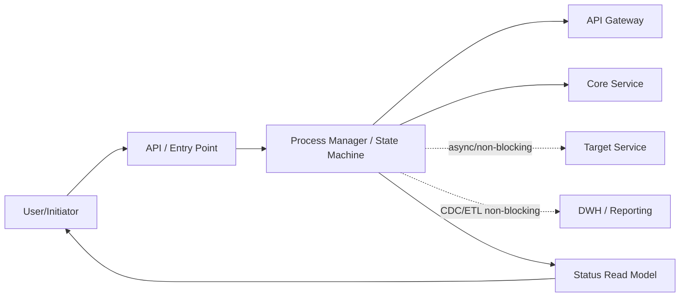
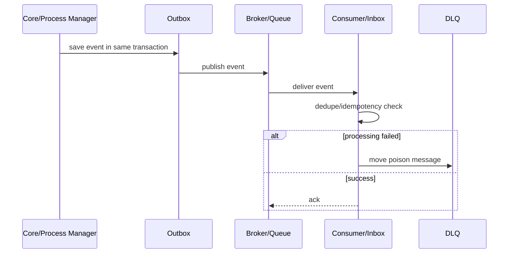
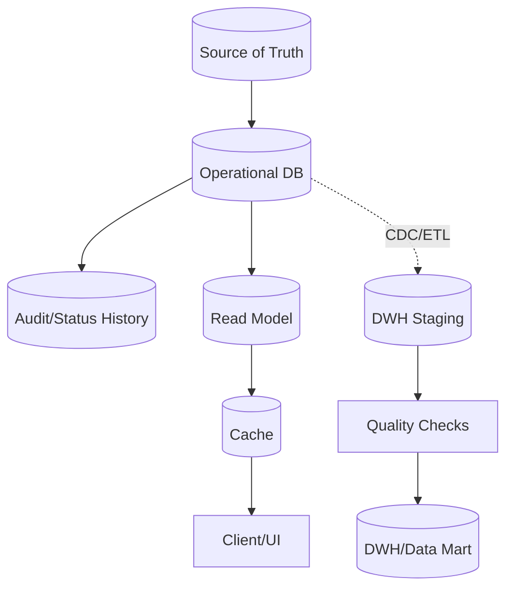
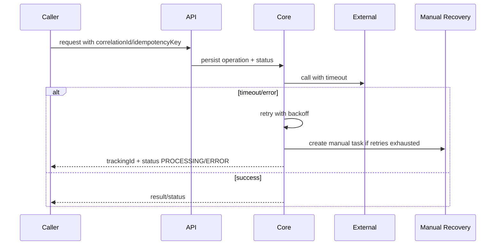
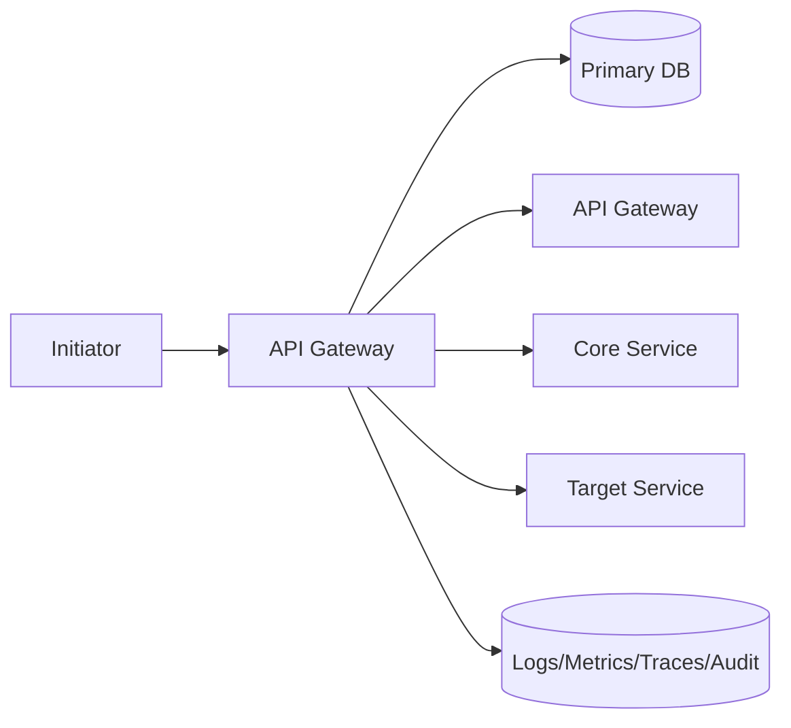
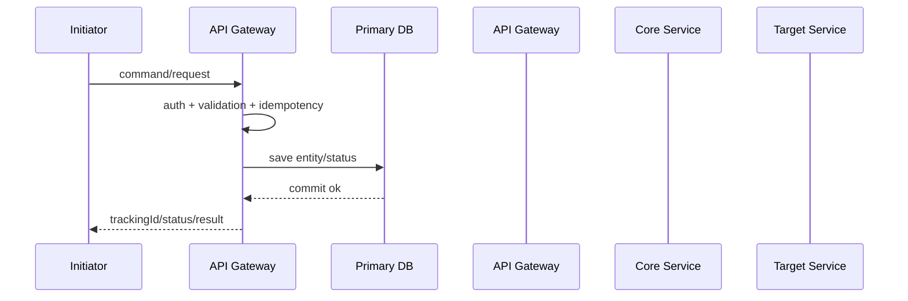
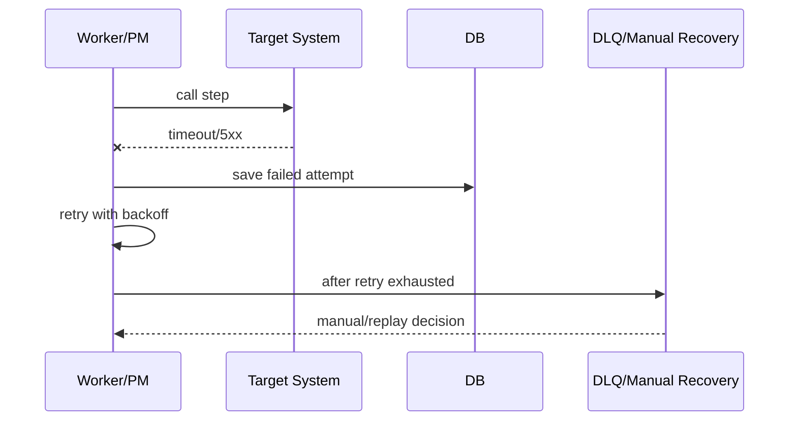
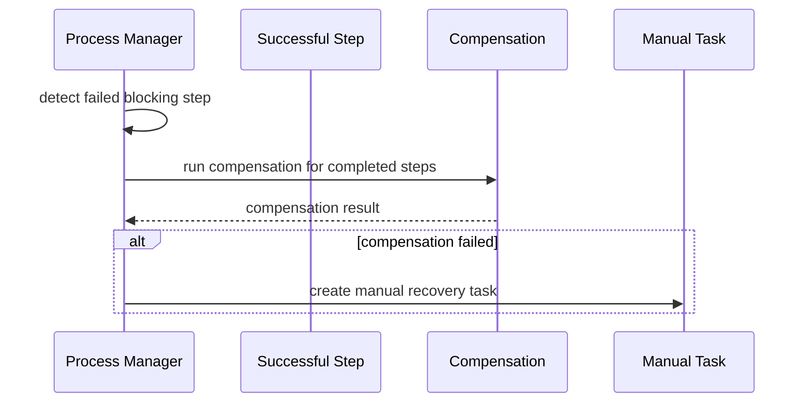

# Архитектурное решение по интеграции: Ультра: цепочка сервисов

Дата генерации: 2026-06-05 17:07

---

## 0. Финальное решение в 5 строк для новичка

- Проектировать: Неинвазивное расширение существующего процесса.
- Ключевые контроли: PostgreSQL OLTP.
- MVP: Зафиксировать входной контракт и error model.
- Production: Полная наблюдаемость: latency/error rate/availability, traces, stuck process age, DLQ/retry rate.

## 1. Резюме

**Тип задачи:** e2e_chain

**Нагрузка:** medium, RPS/TPS=50, peak=2

**Рекомендованный вариант:** Неинвазивное расширение существующего процесса

**Оценка варианта:** 100%

**Готовность требований:** 100%

## 1A. Введённые матрицы полного описания процесса

- Целевые связи: 2 строк
- Переходы процесса: 3 строк
- Контракты: 3 строк
- Бизнес-правила: 3 строк
- Capacity: 2 строк
- Observability: 4 строк
- Rollout/migration: 3 строк
- Data quality/lineage: 3 строк

### Целевые связи

- API Gateway → Core Service; channel=REST; contract=API v1; retry=yes/backoff; dlq=no; idempotency=idempotencyKey

- Core Service → Target Service; channel=Kafka; contract=EntityChanged.v1; retry=yes/backoff; dlq=yes; idempotency=eventId+aggregateVersion

### Бизнес-правила

- BR1: if сумма > лимита → отправить на ручную проверку [S2]

- BR2: if договор закрыт → не публиковать событие обновления [S3]

- BR3: if пришло старое событие version ниже текущей → игнорировать и записать аудит [Consumer]

## 2. Quality gate требований

**Статус:** ready — Данных достаточно для предварительного ADR и обсуждения с архитектором.

### Критично уточнить

1. Какая допустимая задержка DWH, как делаем reconciliation, backfill, lineage и data quality?
2. Какой ключ порядка, sequence/version, и что делать со старыми/out-of-order событиями?
3. Какие поля являются ПДн/секретами, где маскирование, шифрование, retention и аудит доступа?
4. Какие ограничения являются жёсткими, а какие можно пересогласовать: новый сервис, новая инфраструктура, изменение source, сроки, бюджет?
5. Какой остаточный риск бизнес готов принять временно, и какой deadline для перехода к целевому варианту?
6. Что является главным результатом: команда/операция, событие, read-model, batch file, webhook intake, DWH pipeline или migration?

## 2A. Ограничения, компромиссы и реалистичный вариант

### Жёсткие ограничения

- Source-систему нельзя менять: outbox/state-machine в source недоступны без пересогласования.
- Пояснение пользователя: Например: новый сервис слишком дорогой; source менять нельзя; Kafka уже есть только в другом контуре; сроки 2 недели; нужен безопасный минимум.

### Реалистичный v1 при ограничениях

- Ограничения не блокируют целевое решение; можно идти по production-ready варианту поэтапно.

### Целевой вариант без ограничений

- Целевой вариант: архитектура без искусственных ограничений — отдельные границы ответственности, outbox/inbox, dedicated publisher/orchestrator при необходимости, полная observability.

### Остаточные риски компромисса

- Остаточный риск низкий/средний при выполнении non-negotiable controls и тестов.

### Что нельзя выкидывать даже в компромиссе

- correlationId/requestId во всех каналах
- timeouts на sync/REST вызовах
- owner и alert для каждой ошибки
- идемпотентность при retry/async
- логирование без ПДн/секретов
- schema/versioning события
- DLQ/retry/reprocess policy для broker/consumer

### Phase 2 / долг по архитектуре

- После MVP провести production readiness review и решить, нужен ли вынос в отдельный сервис/инфраструктуру.

## 2B. Матрица вариантов: правильно / компромисс / workaround

### A. Архитектурно правильный вариант

Когда: Когда можно менять нужные компоненты и есть бюджет на production controls.

Что делать:

- Использовать целевой top-level паттерн: Неинвазивное расширение существующего процесса.
- Разделить ownership: source of truth, technical publisher/adapter, consumer/target, operations owner.
- Сразу заложить production controls: Outbox/Inbox или эквивалент, DLQ/quarantine, replay, observability, contract tests.

Риск: Ниже, но дороже/дольше.

### B. Безопасный компромисс

Когда: Когда стек/сроки/бюджет ограничены.

Что делать:

- Оставить существующие ограничения стека/бюджета, но добавить минимально безопасные контроли: correlationId, idempotency/replay where retries exist, timeouts + retry limits, owner + alert, monitoring + runbook, ADR with accepted residual risk.
- Не переименовывать компромисс в “идеальную архитектуру”: явно указать residual risk и дату пересмотра.

Риск: Средний; допустим только с ADR, monitoring и планом phase 2.

### C. Временный workaround

Когда: Только для короткого периода или emergency.

Что делать:

- Допустим только как временный workaround: manual/reconciliation path, ограниченный scope, feature flag/kill switch, ежедневный контроль расхождений.
- Запрещено скрывать отсутствие ключевых гарантий: если нет atomics/replay/idempotency — это должно быть blocker или accepted risk.

Риск: Высокий; нужен срок жизни, owner, rollback и ручная сверка.

## 3. Главная архитектура и внутренние слои

**Главная архитектура:** Неинвазивное расширение существующего процесса

### Кратко

- Целевая архитектура должна рассматриваться как композиция слоёв, а не как один паттерн.

### Слои

### 1. Входной контур

Принять команду/запрос безопасно и быстро

Компоненты:

- Service API
- Idempotency validation
- Request validation

Контроли:

- Auth/RBAC
- rate limit
- correlationId
- единая error model

### 2. Core process

Управляемая state machine/Saga для многошаговой цепочки

Компоненты:

- Process Manager
- process_steps
- status_history

Контроли:

- timeout per step
- retry policy
- compensation
- manual recovery

Риски:

- Без owner процесса Saga превратится в distributed mess.

### 5. Read path

Отдельный быстрый контур чтения/статуса

Компоненты:

- Read model/projection
- Cache where allowed
- GET status API

Контроли:

- last_updated
- freshness label
- read-your-writes rule
- TTL/invalidation/cache stampede protection

### 6. Data/DWH

Аналитика и отчётность не блокируют core/client flow

Компоненты:

- CDC/ETL
- staging
- DWH/Data Lake

Контроли:

- lineage
- quality checks
- reconciliation
- backfill/replay
- late events policy

### 7. Security/privacy

Защита данных встроена в интеграцию

Компоненты:

- AuthN/AuthZ
- audit log
- secrets management

Контроли:

- TLS/mTLS
- masking logs
- field minimization
- encryption where needed
- retention

### 8. Observability/SRE

Эксплуатационная готовность

Компоненты:

- logs
- metrics
- traces
- business dashboard

Контроли:

- latency/error rate/availability SLI
- DLQ size
- retry rate
- consumer lag
- stuck process age
- external dependency health

### Сквозные требования

- API lifecycle: versioning, backward compatibility, deprecation policy, pagination/filtering/sorting where needed, rate limits, unified error model.
- Data contracts: schema versioning, compatibility mode, deleted/late/out-of-order events, reprocessing window.
- Capacity planning: RPS/TPS, payload size, partitions/consumers/workers, DB pool/indexes, retention, write amplification.

## 4. MVP-вариант

- Зафиксировать входной контракт и error model.
- Добавить correlationId/requestId во все вызовы.
- Сохранить операцию/заявку до внешних вызовов.
- Настроить timeout и ограниченный retry с backoff.
- Логировать технические и бизнес-ошибки без ПДн.
- Минимальная state machine с финальными и ошибочными статусами.
- Transactional Outbox для публикации критичных событий.
- Inbox/deduplication для входящих событий/callback.
- GET status + понятные статусы для клиента.
- Non-blocking выгрузка в DWH; core-flow не ждёт отчётность.

## 5. Production-вариант

- Полная наблюдаемость: latency/error rate/availability, traces, stuck process age, DLQ/retry rate.
- Runbook и manual recovery для зависших операций.
- Contract/e2e/load/failover tests.
- Security/privacy review: masking, service auth, secrets, retention.
- Process Manager/Saga с таймерами, compensation, manual recovery dashboard.
- Outbox publisher со stuck alerts, replay и мониторингом publish lag.
- Retention, replay и DLQ для Inbox/consumers.
- Topic strategy, partition key, schema registry, compatibility mode, retry topics/DLQ.
- Status read model/cache с last_updated/freshness label и fallback stale-data только для чтения.
- CDC/ETL со staging, data quality checks, reconciliation, lineage, backfill и late-events policy.

## 5A. Impact analysis / что ещё затронет изменение

- Специальный impact-analysis не требуется по выбранным формам; достаточно обычных contract/error/rollout checks.

## 6. Почему не выбраны опасные альтернативы

- **Чистая синхронная REST-цепочка** — Длинная/многоуровневая цепочка нестабильна, плохо восстанавливается и усиливает latency внешних систем.

- **DWH как часть core-flow** — Отчётность не должна блокировать клиентский или финансовый процесс.

## 7. Capacity planning lite

- Peak RPS/TPS: 100
- Payload: 5 KB
- Поток: ~0.49 MB/s
- Дневной объём: ~20.6 GB/day
- Retention: 30 days
- Рекомендуемый стартовый минимум partitions/workers: 6
- Стартовый диапазон для теста: 6–12

### Capacity notes

- Это не sizing, а стартовая гипотеза для нагрузочного теста; финальное число partitions/workers считается по latency, consumer lag, DB write amplification, лимитам downstream и storage.
- Partition key должен совпадать с aggregate/entity id, иначе порядок статусов не гарантируется.
- Для DWH считать batch window, late events, backfill throughput и reconciliation window.

## 8. Проверка текущего состояния против целевого

- Добавить Transactional Outbox.
- Добавить Inbox/idempotency.
- Добавить DLQ.
- Добавить Broker/event stream.

## 9. Отчёты для ролей

### selected_analyst

- Описать статусы, error matrix, source of truth, контракты, owner/SLA, retry/replay и acceptance criteria.
- Проверить открытые вопросы из quality gate до передачи в разработку.

## 10. ADR export

### ADR-001: Интеграционный подход для Ультра: цепочка сервисов

#### Контекст

- Бизнес-цель: Минимум данных: спроектировать цепочку сервисов, БД, события и восстановление ошибок.
- Основная рекомендация: Неинвазивное расширение существующего процесса.
- Готовность требований: 100%.

#### Решение

- Использовать Неинвазивное расширение существующего процесса как главную архитектуру.
- Частные паттерны оформлять как внутренние слои, а не как конкурирующие top-level решения.
- Для критичных операций использовать idempotency, state tracking, audit и recovery.

#### Альтернативы

- Чистая синхронная REST-цепочка: отклонено/ограничено — Длинная/многоуровневая цепочка нестабильна, плохо восстанавливается и усиливает latency внешних систем.
- DWH как часть core-flow: отклонено/ограничено — Отчётность не должна блокировать клиентский или финансовый процесс.

#### Последствия

- Потребуется ownership процесса, контракты, тесты, SRE-метрики и runbook.
- Решение должно пройти архитектурное ревью перед production.

## 11. Дополнительные диаграммы

### Context diagram



### Event flow



### Data flow



### Failure flow



## 12. Библиотека похожих шаблонов

- REST request-response integration
- REST + external API adapter
- Kafka event publication with Outbox
- Kafka consumer + Postgres idempotent sink
- Shared topic selective consumer
- Webhook intake + Inbox
- Batch/File/SFTP exchange
- SFTP reconciliation
- Saga orchestration / process manager
- BFF/API Composition / Customer 360
- Status screen with cache/read model
- DWH offloading and retention
- CDC replication
- Legacy strangler migration
- Reference/master-data synchronization
- Regulatory data model change
- Current solution review / audit
- Queue-based async worker
- Near real-time decision flow

## 12A. Production gate / можно ли отдавать в разработку

**Статус:** GREEN — Можно отдавать в разработку после обычного ревью и фиксации ADR.

### Закрыть до разработки

- Зафиксировать ADR, владельцев, SLA, error matrix и тесты.

### Закрыть до production

- SLO/alerts/runbook
- load test
- replay/recovery drill
- contract tests
- security review
- rollback plan

## 12B. Self-check результата

- source of truth выбран: True
- owner процесса/систем указан: True
- консистентность указана: True
- failure handling указан: True
- контекстный ключ надёжности проверен: Idempotency-Key или business request key для небезопасных повторов
- observability указана: True
- security/auth указаны: True
- rollback/replay указаны: True
- contracts сгенерированы: API/Event/File/CDC/DWH по выбранным паттернам
- test cases сформированы: True

## 13. Архитектурные варианты

### Вариант 1. Неинвазивное расширение существующего процесса

- Оценка: 100%

- Сложность: Средняя

- Задержка: batch/near-real-time

- Надёжность: Средняя/высокая

- Паттерны:

- PostgreSQL OLTP

- Почему:

- Production/source flow менять нельзя, поэтому допустимы read-only/CDC/file/adapter подходы или явно рискованный export/snapshot compromise.
- Выбранный класс кейса требует именно этот top-level каркас: Non-invasive extension of existing/source flow

- Риски:

- Нельзя гарантировать атомарную связь бизнес-изменения и публикации события из read-only канала; нужен ADR с residual risk.

### Вариант 2. Контур данных / DWH

- Оценка: 68%

- Сложность: Средняя

- Задержка: Batch/near-real-time

- Надёжность: Высокая для аналитики

- Паттерны:

- PostgreSQL OLTP

- Почему:

- Аналитика, регуляторная отчётность или near-real-time DWH/offload; главный смысл — retention, watermark/offset, lineage, quality checks и reconciliation, а не просто transport batch/file.

- Риски:

- Нужны reconciliation, lineage, data quality, retention/archive и backfill.
- DWH/ETL — это слой data/reporting, он не должен подменять core-flow.
- Это полезный внутренний слой, но не главный архитектурный каркас для класса кейса non_invasive_extension.

## 14. Выбранные паттерны и контроли

### Kafka / поток событий — оценка 70

- Почему:

- События, replay, fan-out, highload.

- Контроли:

- schema registry
- partition key
- consumer groups
- DLQ/retry topics
- lag monitoring

- Риски:

- Нужны идемпотентные consumer-ы.

### Inbox / идемпотентный consumer — оценка 70

- Почему:

- Защита от дублей.

- Контроли:

- message registry
- payload hash
- unique keys
- retention

- Риски:

- Нужен retention.

### Read model из бизнес-требований — оценка 70

- Почему:

- Из бизнес-контекста следует отдельный быстрый контур чтения/статусов.

- Контроли:

- projection table
- last_updated
- rebuild
- read-your-writes rule
- freshness marker

- Риски:

- Нужно явно объяснять пользователю свежесть данных.

### Кэш / быстрый контур чтения — оценка 68

- Почему:

- Частое чтение, допустимое устаревание и/или горячий клиентский экран.

- Контроли:

- TTL
- invalidation
- cache stampede protection
- warmup
- stale marker

- Риски:

- Не использовать кэш для финального финансового/юридического решения.

### Fallback / управляемая деградация — оценка 60

- Почему:

- Бизнес допускает последний известный/частичный результат или есть нестабильные зависимости.

- Контроли:

- stale response policy
- partial response
- circuit breaker
- degraded status
- manual review

- Риски:

- Fallback должен быть явно виден пользователю/оператору.

### PostgreSQL OLTP — оценка 60

- Почему:

- Транзакционное хранилище.

- Контроли:

- constraints
- indexes
- migrations
- backup
- partitioning

- Риски:

- Не shared DB между сервисами.

### CQRS / read-модели — оценка 55

- Почему:

- Разные модели чтения/записи, highload/fan-out.

- Контроли:

- projections
- rebuild
- eventual consistency

- Риски:

- Усложняет систему.

### API Gateway / входной слой — оценка 45

- Почему:

- Единый вход, auth, rate limit, routing.

- Контроли:

- auth
- rate limit
- WAF
- routing
- request validation

- Риски:

- Gateway не должен содержать бизнес-логику.

## 15. Anti-pattern checker

Критичных anti-patterns не обнаружено.

## 16. Матрица систем

- **API Gateway** — role: приём команды; owner: Product; criticality: critical; channel: rest; blocking: blocking; SLA: 1s

- **Core Service** — role: владелец процесса; owner: Backend; criticality: critical; channel: db,kafka; blocking: blocking; SLA: 3s

- **Target Service** — role: обработка результата; owner: Backend; criticality: important; channel: kafka,db; blocking: non_blocking; SLA: 30s

## 17. Многоуровневая матрица шагов

- level 0 / order 1 / parent root: **Принять команду** → API Gateway via rest; timeout=1s; retry=no; compensation=validation error; owner=Product

- level 1 / order 2 / parent 1: **Зафиксировать процесс** → Core Service via db; timeout=1s; retry=yes; compensation=manual recovery; owner=Backend

- level 2 / order 3 / parent 2: **Передать событие** → Core Service via kafka; timeout=1s; retry=yes; compensation=outbox retry; owner=Backend

- level 3 / order 4 / parent 3: **Обработать результат** → Target Service via kafka/db; timeout=30s; retry=yes; compensation=DLQ/manual; owner=Backend

## 17A. Карта цепочки сервисов, БД и интеграций
### Что делает каждый сервис
- **API Gateway** — роль: приём команды; owner: Product; SLA: 1s.
  - Делает: Принять команду; канал: rest; input: request; output: trackingId; retry: no; compensation: validation error.
- **Core Service** — роль: владелец процесса; owner: Backend; SLA: 3s.
  - Делает: Зафиксировать процесс; канал: db; input: command; output: state; retry: yes; compensation: manual recovery.
  - Делает: Передать событие; канал: kafka; input: state; output: event; retry: yes; compensation: outbox retry.
- **Target Service** — роль: обработка результата; owner: Backend; SLA: 30s.
  - Делает: Обработать результат; канал: kafka/db; input: event; output: projection; retry: yes; compensation: DLQ/manual.
### Связи между сервисами
- **API Gateway → Core Service** через REST; mode=sync; contract=API v1; data=entity data; retry=yes/backoff; DLQ=no; idempotency=idempotencyKey.
- **Core Service → Target Service** через Kafka; mode=async; contract=EntityChanged.v1; data=event payload; retry=yes/backoff; DLQ=yes; idempotency=eventId+aggregateVersion.
### Взаимодействие с БД/хранилищем
- **application** — Локальная read/projection copy, не меняет source system. Индексы: (status), (created_at), (correlation_id), (correlation_id).
- **application_status_history** — История статусов. Индексы: (application_id, changed_at), (new_status, changed_at).
- **audit_log** — Аудит и security-события. Индексы: (correlation_id), (entity_type, entity_id), (created_at).
- **reconciliation_runs** — Сверка batch/CDC/DWH загрузок. Индексы: (source_name,target_name,created_at), (status).


## 18. Компонентная диаграмма



## 19. Последовательность основного сценария



## 20. Последовательность ошибки / retry / DLQ



## 21. Последовательность компенсации



## 22. Основной сценарий

1. Инициатор отправляет команду или событие старта.
2. API Gateway сохраняет состояние Application.
3. Шаг 1: Принять команду → API Gateway через rest (blocking).
4.   Шаг 2: Зафиксировать процесс → Core Service через db (blocking).
5.     Шаг 3: Передать событие → Core Service через kafka (non_blocking).
6.       Шаг 4: Обработать результат → Target Service через kafka/db (non_blocking).
7. Финальный статус фиксируется в entity/status_history/audit_log.

## 23. Альтернативные сценарии и ошибки

### timeout

1. Где: downstream
2. Блокирует: blocking
3. Retry: yes
4. После retry: retry/DLQ/manual
5. Owner: owner

### Общий путь обработки ошибки

1. Техническая ошибка фиксируется в integration_attempts/event_enrichment_attempts.
2. Если retry=yes — выполняется retry with exponential backoff + jitter.
3. При ошибке REST enrichment исходное изменение не откатывается; outbox остаётся в NEW/ENRICHING/FAILED до retry или ручного reprocess.
4. После исчерпания retry сообщение уходит в DLQ/FAILED или создаётся manual_recovery_task.
5. Алерт уходит владельцу шага и дежурной команде.

## 24. Контракты

### API

- Не указано

### EVENTS

- Не указано

### QUEUE

- Не указано

### SELECTIVE_CONSUMER

- Не указано

### ENRICHMENT

- Не указано

### FILES

- Не указано

### CDC

- Не указано

### DWH

- Staging with load_id/batch_id/snapshot_id
- Watermark/offset policy for incremental load
- Data quality: record count, checksum, required fields, referential checks
- Reconciliation report
- Late arriving data and backfill policy
- Retention/archive policy for prod offload and DWH storage growth
- PII minimization/masking for analytics

### SOAP

- Не указано

### SECURITY

- Auth scopes/roles per endpoint/topic/file/feed
- Sensitive fields masked in logs
- mTLS/TLS for service channels
- Audit event for access/change

### PRIVACY

- Не указано

### DECISION

- Не указано

## 25. БД и хранение

### Storage

- PostgreSQL OLTP
- DWH/Data Lake
- Archive/Object storage for cold data

### Таблицы

**Важно:** сценарий неинвазивный; таблицы описывают локальную проекцию/целевой контур, а не изменение source system.

#### application

Назначение: Локальная read/projection copy, не меняет source system

Поля:

- id uuid primary key
- status text not null
- version integer not null default 1
- correlation_id text
- created_at timestamp not null default now()
- updated_at timestamp not null default now()
- archived_at timestamp

Индексы:

- (status)
- (created_at)
- (correlation_id)
- (correlation_id)

#### application_status_history

Назначение: История статусов

Поля:

- id uuid primary key
- application_id uuid not null
- old_status text
- new_status text not null
- reason text
- changed_by text
- changed_at timestamp not null default now()

Индексы:

- (application_id, changed_at)
- (new_status, changed_at)

#### audit_log

Назначение: Аудит и security-события

Поля:

- id uuid primary key
- correlation_id text
- actor text
- action text not null
- entity_type text
- entity_id text
- result text
- metadata jsonb
- created_at timestamp not null default now()

Индексы:

- (correlation_id)
- (entity_type, entity_id)
- (created_at)

#### reconciliation_runs

Назначение: Сверка batch/CDC/DWH загрузок

Поля:

- id uuid primary key
- source_name text not null
- target_name text not null
- load_id text
- records_source integer
- records_target integer
- checksum_source text
- checksum_target text
- status text not null
- created_at timestamp not null default now()

Индексы:

- (source_name,target_name,created_at)
- (status)

### Partitioning / capacity

- Consider monthly partitions for audit/history/integration_attempts.
- Prepare archive jobs before production.

### Retention

- Retention: 3_years.
- Outbox/inbox/integration_attempts имеют отдельный retention.
- Audit/security срок согласовать с ИБ/юристами.

## 26. Draft SQL DDL

```sql

-- Draft SQL DDL. Требует DBA/security review.
-- Статусы: NEW, PROCESSING, SUCCESS, FAILED

-- Локальная read/projection copy, не меняет source system
create table application (
    id uuid primary key,
    status text not null,
    version integer not null default 1,
    correlation_id text,
    created_at timestamp not null default now(),
    updated_at timestamp not null default now(),
    archived_at timestamp
);
create index idx_application_1 on application(status);
create index idx_application_2 on application(created_at);
create index idx_application_3 on application(correlation_id);
create index idx_application_4 on application(correlation_id);

-- История статусов
create table application_status_history (
    id uuid primary key,
    application_id uuid not null,
    old_status text,
    new_status text not null,
    reason text,
    changed_by text,
    changed_at timestamp not null default now()
);
create index idx_application_status_history_1 on application_status_history(application_id, changed_at);
create index idx_application_status_history_2 on application_status_history(new_status, changed_at);

-- Аудит и security-события
create table audit_log (
    id uuid primary key,
    correlation_id text,
    actor text,
    action text not null,
    entity_type text,
    entity_id text,
    result text,
    metadata jsonb,
    created_at timestamp not null default now()
);
create index idx_audit_log_1 on audit_log(correlation_id);
create index idx_audit_log_2 on audit_log(entity_type, entity_id);
create index idx_audit_log_3 on audit_log(created_at);

-- Сверка batch/CDC/DWH загрузок
create table reconciliation_runs (
    id uuid primary key,
    source_name text not null,
    target_name text not null,
    load_id text,
    records_source integer,
    records_target integer,
    checksum_source text,
    checksum_target text,
    status text not null,
    created_at timestamp not null default now()
);
create index idx_reconciliation_runs_1 on reconciliation_runs(source_name,target_name,created_at);
create index idx_reconciliation_runs_2 on reconciliation_runs(status);


```

## 27. Бэклог

- Утвердить owner процесса и систем.
- Утвердить source of truth и владение полями.
- Утвердить статусную модель и финальные статусы.
- Согласовать API/event/file/CDC/DWH contracts.
- API lifecycle: versioning, backward compatibility, deprecation policy, pagination/filtering/sorting, rate limits, unified error model.
- Data governance: schema versioning, compatibility mode, late/out-of-order/deleted events, lineage, quality checks, reprocessing window.
- Capacity plan: RPS/TPS, payload size, partitions/consumers/workers, DB pool/indexes, retention, write amplification.
- SRE/SLI: latency, error rate, availability, consumer lag, DLQ size, retry rate, stuck process age, external dependency health.
- Security/privacy: masking logs, RBAC/service auth, secrets, retention, minimization, encryption where needed.
- Реализовать миграции БД и индексы.
- Добавить correlationId/requestId во все каналы.
- Настроить logs/metrics/traces/audit.
- Подготовить integration/contract/e2e tests.
- Зафиксировать ADR trade-off: почему целевой вариант невозможен сейчас, какой риск принимаем, кто owner риска, когда пересматриваем.
- Разделить delivery на Safe MVP и Phase 2 hardening; запретить “временные” решения без даты пересмотра.

## 28. ADR

### ADR-001: Non-invasive Existing Process Extension

- Решение: Использовать Неинвазивное расширение существующего процесса.

- Последствия: Требуются владельцы, контракты, monitoring и recovery.

### ADR-002: Source of truth

- Решение: Source of truth: own_db; direct DB write запрещён.

- Последствия: Изменения только через согласованный доменный контракт.

### ADR-003: Failure policy

- Решение: Failure policy: retry.

- Последствия: Каждый шаг должен иметь retry/compensation/manual recovery.

## 29. Стратегия тестирования

- Unit tests бизнес-правил.
- Integration tests DB/external clients.
- Contract tests API/events/files.
- E2E happy path and negative paths.
- Load tests.
- Stress tests.
- Soak tests.
- Failover tests.
- DLQ/retry/replay tests.
- Security tests.
- Masking logs verification.
- Audit trail verification.

## 30. План внедрения

- Phase 1: contracts + DB + observability.
- Phase 2: async/outbox/inbox.
- Phase 3: consumers/DWH.
- Phase 4: production readiness review.

## 31. Критерии приёмки

- Happy path выполняется.
- Повтор не создаёт дубль.
- Каждый шаг имеет status, owner, timeout, retry/after_retry.
- DWH/analytics не блокирует клиентский процесс.
- Контракты версионируются и имеют compatibility policy.
- API имеет версионирование, error model, rate limits, idempotency rules для POST/команд.
- Логи не содержат чувствительные данные.
- Метрики и алерты покрывают API, DB, broker, DLQ, outbox, stuck steps, lag, retry rate и external dependency health.
