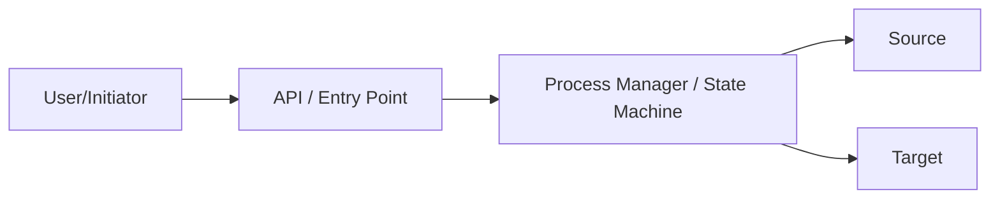
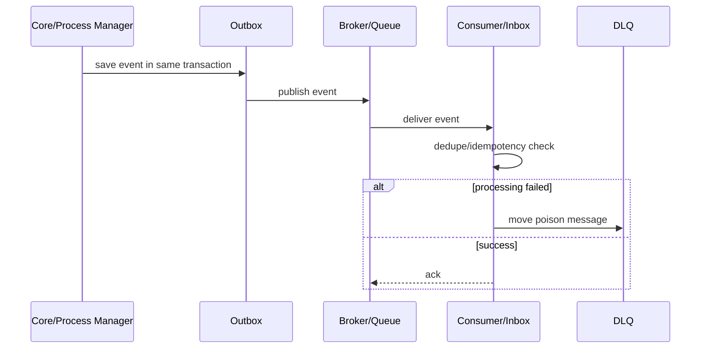
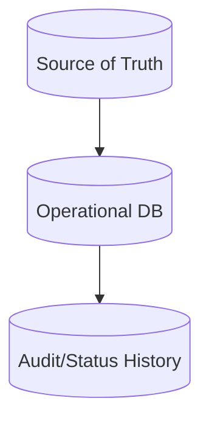
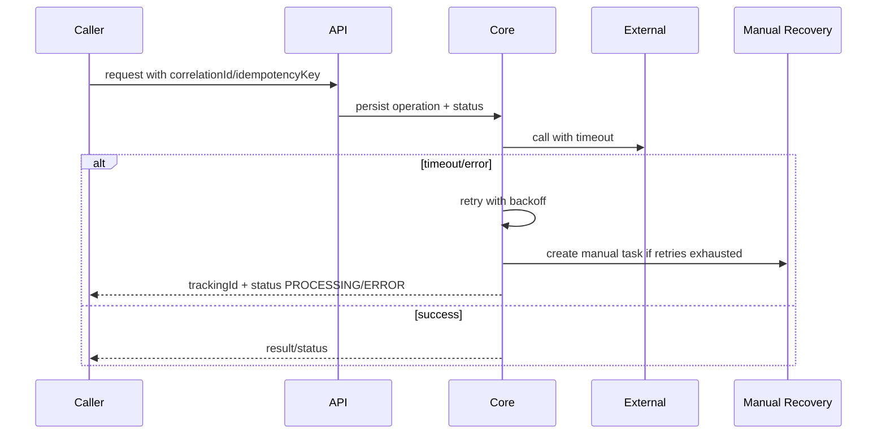
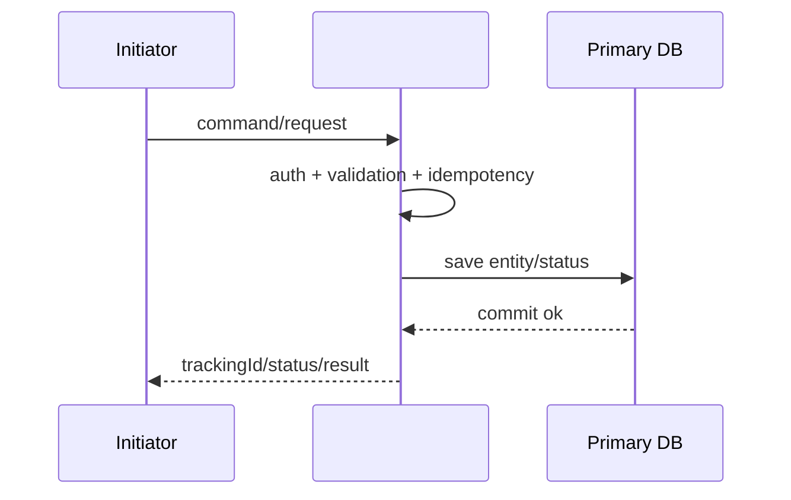
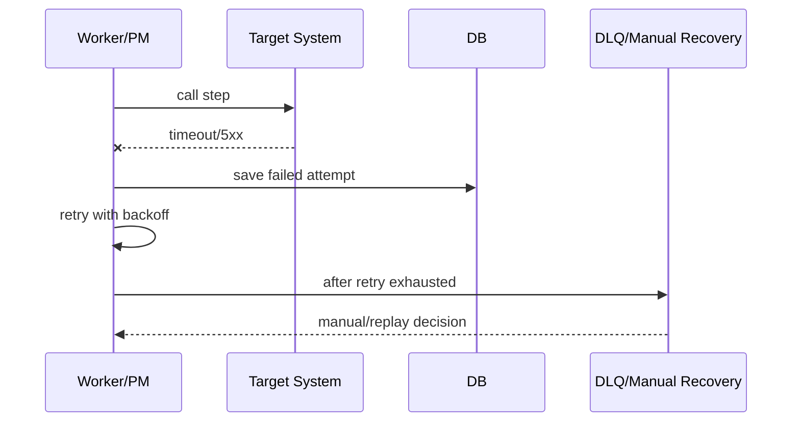
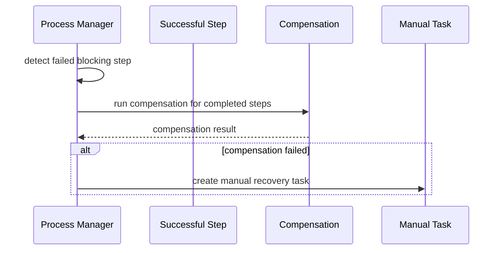

# Архитектурное решение по интеграции: 

Дата генерации: 2026-06-05 17:37

---

## 0. Финальное решение в 5 строк для новичка

- Проектировать: Решение заблокировано: недостаточно данных.
- Ключевые контроли: Timeout Budget + Circuit Breaker + Graceful Degradation, REST API + OpenAPI, PostgreSQL OLTP.
- MVP: Зафиксировать входной контракт и error model.
- Production: Полная наблюдаемость: latency/error rate/availability, traces, stuck process age, DLQ/retry rate.
- Сначала исправить: Недостаточно данных для проектирования.

## 1. Резюме

**Тип задачи:** new_from_scratch

**Нагрузка:** unknown, RPS/TPS=, peak=unknown

**Рекомендованный вариант:** Решение заблокировано: недостаточно данных

**Оценка варианта:** 5%

**Готовность требований:** 32%

### Пробелы

- Не описаны системы-участники или хотя бы система-инициатор.
- Не заполнено обязательное поле: project_name
- Не заполнено обязательное поле: source_system
- Не заполнено обязательное поле: main_entity
- Не заполнено обязательное поле: fields
- Не заполнено обязательное поле: process_steps
- Не заполнено обязательное поле: systems_matrix
- Не определён source of truth.
- Не определено владение данными.
- Не указана нагрузка: low/medium/highload или RPS/TPS.

## 1A. Введённые матрицы полного описания процесса

- Целевые связи: 0 строк
- Переходы процесса: 0 строк
- Контракты: 0 строк
- Бизнес-правила: 0 строк
- Capacity: 0 строк
- Observability: 0 строк
- Rollout/migration: 0 строк
- Data quality/lineage: 0 строк

## 2. Quality gate требований

**Статус:** blocked — Нельзя выдавать финальное архитектурное решение: сначала закрыть блокирующие пробелы.

### Критично уточнить

1. Кто является source of truth по основной сущности и по каждому критичному полю?
2. Какая команда владеет процессом, данными, SLA и ручным восстановлением?
3. Какие ограничения являются жёсткими, а какие можно пересогласовать: новый сервис, новая инфраструктура, изменение source, сроки, бюджет?
4. Какой остаточный риск бизнес готов принять временно, и какой deadline для перехода к целевому варианту?
5. Что является главным результатом: команда/операция, событие, read-model, batch file, webhook intake, DWH pipeline или migration?

### Пробелы входных данных

- Не описаны системы-участники или хотя бы система-инициатор.
- Не указана нагрузка: low/medium/highload или RPS/TPS.
- Не определён source of truth.
- Не определено владение данными.

## 2A. Ограничения, компромиссы и реалистичный вариант

### Жёсткие ограничения

- Source можно менять только минимально: допустимы таблица/status/outbox/API-contract, но не глубокий refactoring core-flow.

### Реалистичный v1 при ограничениях

- Ограничения не блокируют целевое решение; можно идти по production-ready варианту поэтапно.

### Целевой вариант без ограничений

- Целевой вариант: архитектура без искусственных ограничений — отдельные границы ответственности, outbox/inbox, dedicated publisher/orchestrator при необходимости, полная observability.

### Остаточные риски компромисса

- Остаточный риск низкий/средний при выполнении non-negotiable controls и тестов.

### Что нельзя выкидывать даже в компромиссе

- correlationId/requestId во всех каналах
- timeouts на sync/REST вызовах
- owner и alert для каждой ошибки
- идемпотентность при retry/async
- логирование без ПДн/секретов

### Phase 2 / долг по архитектуре

- После MVP провести production readiness review и решить, нужен ли вынос в отдельный сервис/инфраструктуру.

## 2B. Матрица вариантов: правильно / компромисс / workaround

### A. Архитектурно правильный вариант

Когда: Когда можно менять нужные компоненты и есть бюджет на production controls.

Что делать:

- Использовать целевой top-level паттерн: Решение заблокировано: недостаточно данных.
- Разделить ownership: source of truth, technical publisher/adapter, consumer/target, operations owner.
- Сразу заложить production controls: Outbox/Inbox или эквивалент, DLQ/quarantine, replay, observability, contract tests.

Риск: Ниже, но дороже/дольше.

### B. Безопасный компромисс

Когда: Когда стек/сроки/бюджет ограничены.

Что делать:

- Оставить существующие ограничения стека/бюджета, но добавить минимально безопасные контроли: correlationId, idempotency/replay where retries exist, timeouts + retry limits, owner + alert, monitoring + runbook, ADR with accepted residual risk.
- Не переименовывать компромисс в “идеальную архитектуру”: явно указать residual risk и дату пересмотра.

Риск: Средний; допустим только с ADR, monitoring и планом phase 2.

### C. Временный workaround

Когда: Только для короткого периода или emergency.

Что делать:

- Допустим только как временный workaround: manual/reconciliation path, ограниченный scope, feature flag/kill switch, ежедневный контроль расхождений.
- Запрещено скрывать отсутствие ключевых гарантий: если нет atomics/replay/idempotency — это должно быть blocker или accepted risk.

Риск: Высокий; нужен срок жизни, owner, rollback и ручная сверка.

## 3. Главная архитектура и внутренние слои

**Главная архитектура:** Решение заблокировано: недостаточно данных

### Кратко

- Недостаточно данных для составной архитектуры.

### Слои

### 0. Предпроектная проверка

Проектирование заблокировано до уточнения входных данных

Контроли:

- Не описаны системы-участники или хотя бы система-инициатор.
- Не указана нагрузка: low/medium/highload или RPS/TPS.
- Не определён source of truth.
- Не определено владение данными.

## 4. MVP-вариант

- Зафиксировать входной контракт и error model.
- Добавить correlationId/requestId во все вызовы.
- Сохранить операцию/заявку до внешних вызовов.
- Настроить timeout и ограниченный retry с backoff.
- Логировать технические и бизнес-ошибки без ПДн.

## 5. Production-вариант

- Полная наблюдаемость: latency/error rate/availability, traces, stuck process age, DLQ/retry rate.
- Runbook и manual recovery для зависших операций.
- Contract/e2e/load/failover tests.
- Security/privacy review: masking, service auth, secrets, retention.

## 5A. Impact analysis / что ещё затронет изменение

- Специальный impact-analysis не требуется по выбранным формам; достаточно обычных contract/error/rollout checks.

## 6. Почему не выбраны опасные альтернативы

Опасные альтернативы по заполненным данным не выявлены.

## 7. Capacity planning lite

- Peak RPS/TPS: 0
- Payload: 5 KB
- Поток: ~0 MB/s
- Дневной объём: ~0 GB/day
- Retention: 30 days
- Рекомендуемый стартовый минимум partitions/workers: 0
- Стартовый диапазон для теста: 0

### Capacity notes

- Это не sizing, а стартовая гипотеза для нагрузочного теста; финальное число partitions/workers считается по latency, consumer lag, DB write amplification, лимитам downstream и storage.

## 8. Проверка текущего состояния против целевого

- Добавить Monitoring/metrics.
- Добавить Audit.

## 9. Отчёты для ролей

### selected_analyst

- Описать статусы, error matrix, source of truth, контракты, owner/SLA, retry/replay и acceptance criteria.
- Проверить открытые вопросы из quality gate до передачи в разработку.

## 10. ADR export

### ADR-DRAFT: Предпроектная проверка для процесса

#### Контекст

- Бизнес-цель: Простая REST интеграция
- Входные данные недостаточны для выбора архитектуры.
- Готовность требований: 32%.

#### Решение

- Архитектурное решение не утверждать до закрытия блокирующих вопросов.
- Сначала заполнить business goal, systems, steps, source of truth, ownership, load/SLA и error handling.
- После уточнения повторно сформировать ADR.

#### Альтернативы

- Альтернативы не сравнивались: недостаточно входных данных.

#### Последствия

- Нельзя передавать решение в разработку как финальное.
- Следующий шаг — уточнение требований и повторная генерация отчёта.

## 11. Дополнительные диаграммы

### Context diagram



### Event flow



### Data flow



### Failure flow



## 12. Библиотека похожих шаблонов

- REST request-response integration
- REST + external API adapter
- Kafka event publication with Outbox
- Kafka consumer + Postgres idempotent sink
- Shared topic selective consumer
- Webhook intake + Inbox
- Batch/File/SFTP exchange
- SFTP reconciliation
- Saga orchestration / process manager
- BFF/API Composition / Customer 360
- Status screen with cache/read model
- DWH offloading and retention
- CDC replication
- Legacy strangler migration
- Reference/master-data synchronization
- Regulatory data model change
- Current solution review / audit
- Queue-based async worker
- Near real-time decision flow

## 12A. Production gate / можно ли отдавать в разработку

**Статус:** RED — Нельзя отдавать в разработку как production-решение: есть блокирующие риски.

### Закрыть до разработки

- Недостаточно данных для проектирования

### Закрыть до production

- SLO/alerts/runbook
- load test
- replay/recovery drill
- contract tests
- security review
- rollback plan

## 12B. Self-check результата

- source of truth выбран: True
- owner процесса/систем указан: False
- консистентность указана: True
- failure handling указан: True
- контекстный ключ надёжности проверен: partner_request_id + idempotency key для write/command, correlation_id для query
- observability указана: True
- security/auth указаны: True
- rollback/replay указаны: True
- contracts сгенерированы: API/Event/File/CDC/DWH по выбранным паттернам
- test cases сформированы: True

## 13. Архитектурные варианты

### Вариант 1. Решение заблокировано: недостаточно данных

- Оценка: 5%

- Сложность: Не определена

- Задержка: Не определена

- Надёжность: Не определена

- Паттерны:

- Timeout Budget + Circuit Breaker + Graceful Degradation
- REST API + OpenAPI
- PostgreSQL OLTP

- Почему:

- Не описаны системы-участники или хотя бы система-инициатор.

- Риски:

- Заполнить минимальный бизнес-контекст, системы, шаги, SLA/source of truth.

## 14. Выбранные паттерны и контроли

### Fallback / управляемая деградация — оценка 60

- Почему:

- Бизнес допускает последний известный/частичный результат или есть нестабильные зависимости.

- Контроли:

- stale response policy
- partial response
- circuit breaker
- degraded status
- manual review

- Риски:

- Fallback должен быть явно виден пользователю/оператору.

### PostgreSQL OLTP — оценка 60

- Почему:

- Транзакционное хранилище.

- Контроли:

- constraints
- indexes
- migrations
- backup
- partitioning

- Риски:

- Не shared DB между сервисами.

### REST API + OpenAPI — оценка 50

- Почему:

- Команды и получение статусов.

- Контроли:

- OpenAPI
- idempotency
- timeouts
- error model
- versioning

- Риски:

- Не строить длинную sync-цепочку.

### API Gateway / входной слой — оценка 45

- Почему:

- Единый вход, auth, rate limit, routing.

- Контроли:

- auth
- rate limit
- WAF
- routing
- request validation

- Риски:

- Gateway не должен содержать бизнес-логику.

### Timeout Budget + Circuit Breaker + Graceful Degradation — оценка 93

- Почему:

- Защищает синхронную цепочку от каскадных отказов и retry storm.

- Контроли:

- per-hop timeout
- global deadline
- circuit breaker
- bulkhead
- fallback
- retry budget
- jitter

- Риски:

- Без budget даже корректные retry могут положить зависимость.

## 15. Anti-pattern checker

- **CRITICAL — Недостаточно данных для проектирования**: Не описаны системы-участники или хотя бы система-инициатор. Исправление: Заполнить минимум входных данных до выбора архитектуры.

## 16. Матрица систем

## 17. Многоуровневая матрица шагов

## 17A. Карта цепочки сервисов, БД и интеграций
### Что делает каждый сервис
### Связи между сервисами
### Взаимодействие с БД/хранилищем
- **field** — Основная бизнес-сущность. Индексы: (status), (created_at), (correlation_id).


## 18. Компонентная диаграмма

```mermaid

flowchart LR
I[Initiator]
S[]
I --> S
S --> DB[(Primary DB)]
S --> OBS[(Logs/Metrics/Traces/Audit)]

```

## 19. Последовательность основного сценария



## 20. Последовательность ошибки / retry / DLQ



## 21. Последовательность компенсации



## 22. Основной сценарий

1. Проектирование заблокировано: нужно выбрать модель управления цепочкой.

## 23. Альтернативные сценарии и ошибки

### Общий путь обработки ошибки

1. Заполнить orchestration и владельца процесса.

## 24. Контракты

### API

- POST /api/v1/field — создать/запустить процесс
- GET /api/v1/field/{id} — текущее состояние
- GET /api/v1/field/{id}/steps — состояние шагов
- POST /api/v1/field/{id}/retry — контролируемый retry
- Headers: X-Request-Id, Correlation-Id, Idempotency-Key
- Errors: validation_error, duplicate_request, conflict, rate_limited, technical_error
- SLA/timeout/rate limit must be specified per endpoint

### EVENTS

- Не указано

### QUEUE

- Не указано

### SELECTIVE_CONSUMER

- Не указано

### ENRICHMENT

- Не указано

### FILES

- Не указано

### CDC

- Не указано

### DWH

- Не указано

### SOAP

- Не указано

### SECURITY

- Auth scopes/roles per endpoint/topic/file/feed
- Sensitive fields masked in logs
- mTLS/TLS for service channels
- Audit event for access/change

### PRIVACY

- Не указано

### DECISION

- Не указано

## 25. БД и хранение

### Storage

- PostgreSQL OLTP

### Таблицы

#### field

Назначение: Основная бизнес-сущность

Поля:

- id uuid primary key
- status text not null
- version integer not null default 1
- correlation_id text
- created_at timestamp not null default now()
- updated_at timestamp not null default now()
- archived_at timestamp

Индексы:

- (status)
- (created_at)
- (correlation_id)

### Partitioning / capacity

- Partitioning can be postponed but growth strategy must exist.

### Retention

- Retention: not_defined.
- Outbox/inbox/integration_attempts имеют отдельный retention.
- Audit/security срок согласовать с ИБ/юристами.

## 26. Draft SQL DDL

```sql

-- Draft SQL DDL. Требует DBA/security review.
-- Статусы: 

-- Основная бизнес-сущность
create table field (
    id uuid primary key,
    status text not null,
    version integer not null default 1,
    correlation_id text,
    created_at timestamp not null default now(),
    updated_at timestamp not null default now(),
    archived_at timestamp
);
create index idx_field_1 on field(status);
create index idx_field_2 on field(created_at);
create index idx_field_3 on field(correlation_id);


```

## 27. Бэклог

- Утвердить owner процесса и систем.
- Утвердить source of truth и владение полями.
- Утвердить статусную модель и финальные статусы.
- Согласовать API/event/file/CDC/DWH contracts.
- API lifecycle: versioning, backward compatibility, deprecation policy, pagination/filtering/sorting, rate limits, unified error model.
- Data governance: schema versioning, compatibility mode, late/out-of-order/deleted events, lineage, quality checks, reprocessing window.
- Capacity plan: RPS/TPS, payload size, partitions/consumers/workers, DB pool/indexes, retention, write amplification.
- SRE/SLI: latency, error rate, availability, consumer lag, DLQ size, retry rate, stuck process age, external dependency health.
- Security/privacy: masking logs, RBAC/service auth, secrets, retention, minimization, encryption where needed.
- Реализовать миграции БД и индексы.
- Добавить correlationId/requestId во все каналы.
- Настроить logs/metrics/traces/audit.
- Подготовить integration/contract/e2e tests.
- Зафиксировать ADR trade-off: почему целевой вариант невозможен сейчас, какой риск принимаем, кто owner риска, когда пересматриваем.
- Разделить delivery на Safe MVP и Phase 2 hardening; запретить “временные” решения без даты пересмотра.
- Закрыть critical/high anti-patterns до production.

## 28. ADR

Архитектурный ADR не формируется: входные данные недостаточны. Используйте ADR-DRAFT из раздела 10 как список вопросов.

## 29. Стратегия тестирования

- Unit tests бизнес-правил.
- Integration tests DB/external clients.
- Contract tests API/events/files.
- E2E happy path and negative paths.

## 30. План внедрения

- Не указано

## 31. Критерии приёмки

- Happy path выполняется.
- Повтор не создаёт дубль.
- Каждый шаг имеет status, owner, timeout, retry/after_retry.
- DWH/analytics не блокирует клиентский процесс.
- Контракты версионируются и имеют compatibility policy.
- API имеет версионирование, error model, rate limits, idempotency rules для POST/команд.
- Логи не содержат чувствительные данные.
- Метрики и алерты покрывают API, DB, broker, DLQ, outbox, stuck steps, lag, retry rate и external dependency health.


## 17B. Специализированные сложные кейсы, распознанные моделью
Этот раздел добавлен, чтобы результат не сводился к общему “E2E”. Здесь перечислены конкретные архитектурные боли, которые модель увидела во входных данных.

### Синхронная цепочка, внешняя зависимость и retry storm
**Почему сработало:** Несколько блокирующих REST-вызовов или нестабильная внешняя зависимость могут дать каскадные timeout и лавину повторов.

**Решение:**
- Задать общий timeout budget цепочки и отдельный timeout на каждую зависимость.
- Поставить circuit breaker, bulkhead, retry budget, exponential backoff + jitter.
- Не повторять бесконечно non-idempotent операции.
- Для длинных операций рассмотреть async acceptance + status tracking вместо ожидания всего результата.
- Для BFF/fan-out разрешить partial response и freshness markers.

**Обязательные контроли:**
- timeout budget
- circuit breaker
- bulkhead
- retry budget
- exponential backoff + jitter
- rate limit
- fallback/degradation
- idempotency key
- correlationId/tracing

**Основные риски:**
- Retry storm добивает зависимость.
- p99 latency всей цепочки становится суммой худших зависимостей.
- Пользователь получает 500 вместо понятного статуса ожидания.

**Тесты, которые нужно заложить:**
- Dependency 500/timeout: circuit breaker открывается, запрос деградирует.
- Retry ограничен budget и jitter.
- Корреляция проходит через все сервисы.

