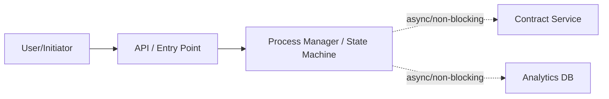
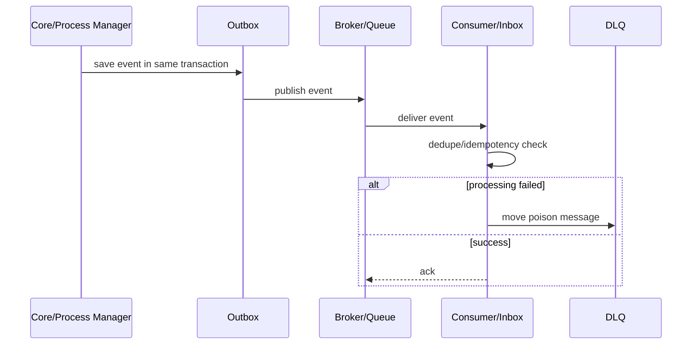
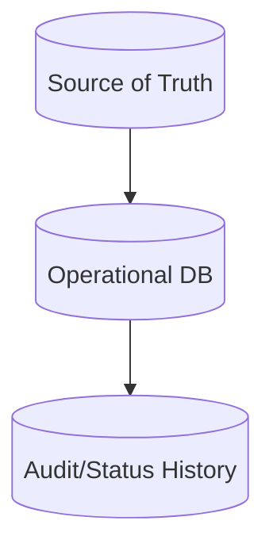
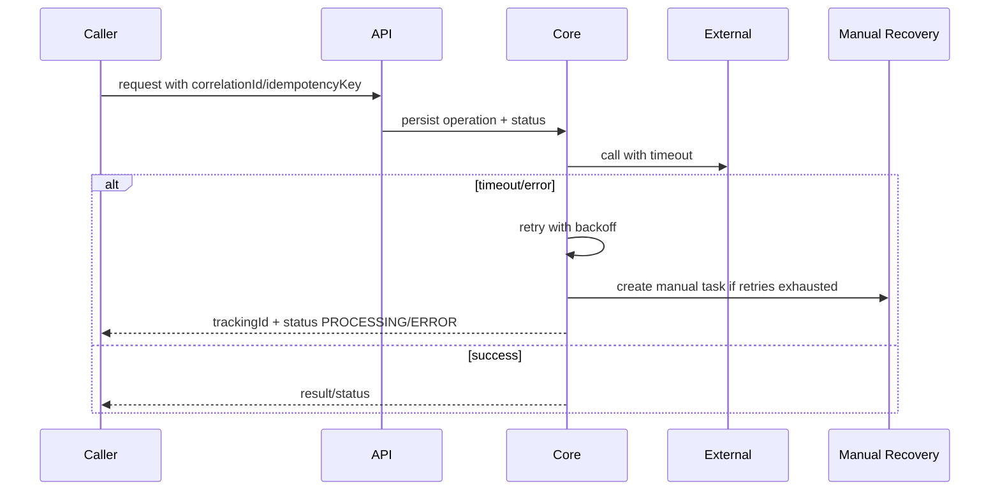
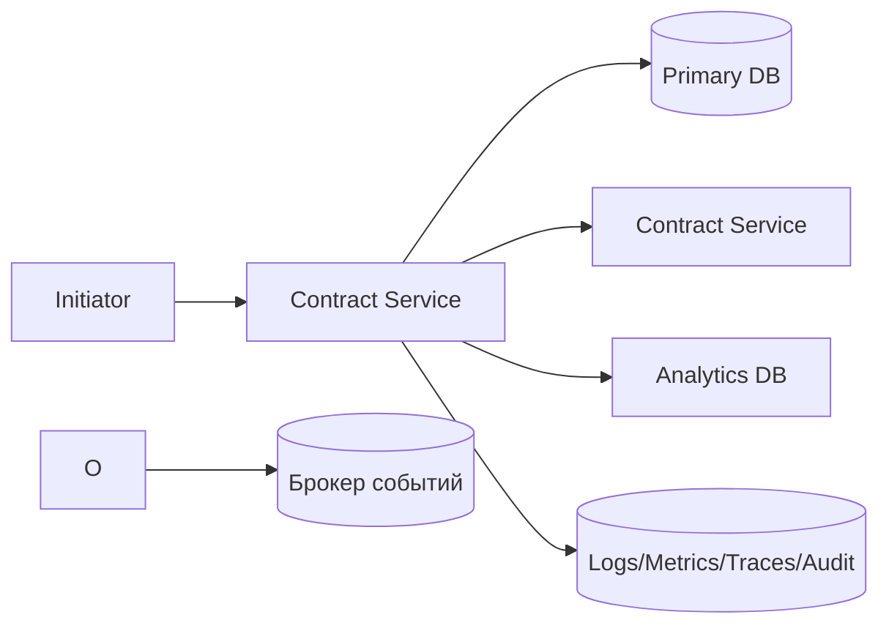
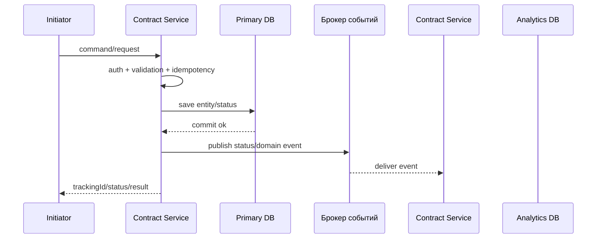
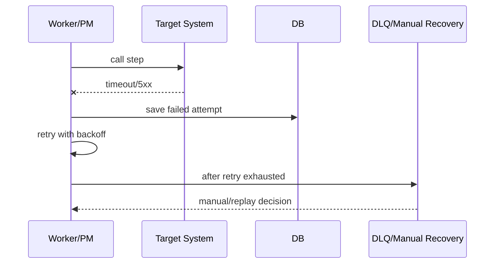
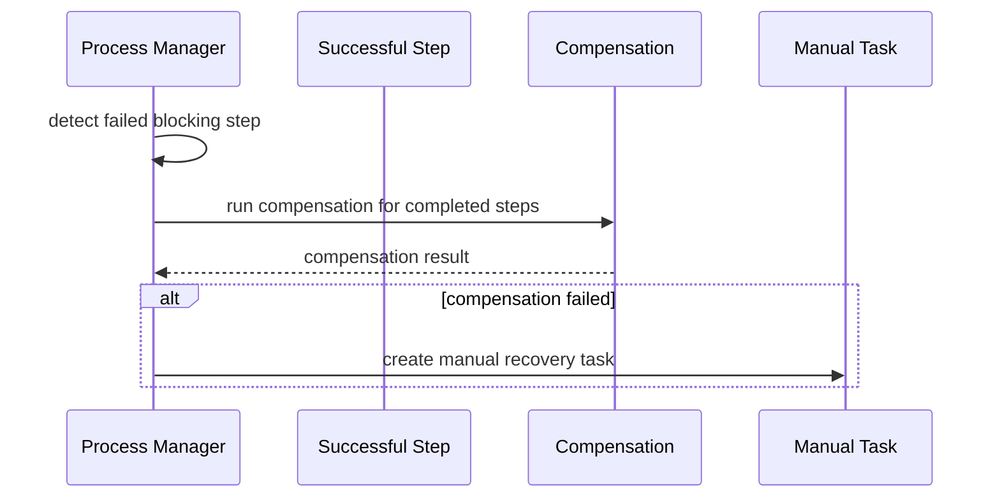

# Архитектурное решение по интеграции: v5 production regression

Дата генерации: 2026-06-05 18:06

---

## 0. Финальное решение в 5 строк для новичка

- Проектировать: Shared Topic Selective Consumer + Idempotent Sink.
- Ключевые контроли: Kafka/Event Streaming, Selective Kafka Consumer, Inbox / Idempotent Consumer, PostgreSQL OLTP, Highload Controls.
- MVP: Зафиксировать входной контракт и error model.
- Production: Полная наблюдаемость: latency/error rate/availability, traces, stuck process age, DLQ/retry rate.

## 1. Резюме

**Тип задачи:** new_from_scratch

**Нагрузка:** highload, RPS/TPS=1200, peak=5

**Рекомендованный вариант:** Shared Topic Selective Consumer + Idempotent Sink

**Оценка варианта:** 100%

**Готовность требований:** 87%

### Пробелы

- Не определён source of truth.
- Не определено владение данными.

## 1A. Введённые матрицы полного описания процесса

- Целевые связи: 0 строк
- Переходы процесса: 0 строк
- Контракты: 0 строк
- Бизнес-правила: 0 строк
- Capacity: 0 строк
- Observability: 0 строк
- Rollout/migration: 0 строк
- Data quality/lineage: 0 строк

## 2. Quality gate требований

**Статус:** ready — Данных достаточно для предварительного ADR и обсуждения с архитектором.

### Критично уточнить

1. Кто является source of truth по основной сущности и по каждому критичному полю?
2. Какая команда владеет процессом, данными, SLA и ручным восстановлением?
3. Какие target RPS/TPS, peak, payload size, retention, допустимый lag, DB write rate и лимиты внешних API?
4. Какие ограничения являются жёсткими, а какие можно пересогласовать: новый сервис, новая инфраструктура, изменение source, сроки, бюджет?
5. Какой остаточный риск бизнес готов принять временно, и какой deadline для перехода к целевому варианту?
6. Что является главным результатом: команда/операция, событие, read-model, batch file, webhook intake, DWH pipeline или migration?

### Пробелы входных данных

- Не определён source of truth.
- Не определено владение данными.

## 2A. Ограничения, компромиссы и реалистичный вариант

### Жёсткие ограничения

- Source-систему нельзя менять: outbox/state-machine в source недоступны без пересогласования.

### Реалистичный v1 при ограничениях

- Ограничения не блокируют целевое решение; можно идти по production-ready варианту поэтапно.

### Целевой вариант без ограничений

- Целевой вариант: архитектура без искусственных ограничений — отдельные границы ответственности, outbox/inbox, dedicated publisher/orchestrator при необходимости, полная observability.

### Остаточные риски компромисса

- Остаточный риск низкий/средний при выполнении non-negotiable controls и тестов.

### Что нельзя выкидывать даже в компромиссе

- correlationId/requestId во всех каналах
- timeouts на sync/REST вызовах
- owner и alert для каждой ошибки
- идемпотентность при retry/async
- логирование без ПДн/секретов
- schema/versioning события
- DLQ/retry/reprocess policy для broker/consumer

### Phase 2 / долг по архитектуре

- После MVP провести production readiness review и решить, нужен ли вынос в отдельный сервис/инфраструктуру.

## 2B. Матрица вариантов: правильно / компромисс / workaround

### A. Архитектурно правильный вариант

Когда: Когда можно менять нужные компоненты и есть бюджет на production controls.

Что делать:

- Использовать целевой top-level паттерн: Shared Topic Selective Consumer + Idempotent Sink.
- Разделить ownership: source of truth, technical publisher/adapter, consumer/target, operations owner.
- Сразу заложить production controls: Outbox/Inbox или эквивалент, DLQ/quarantine, replay, observability, contract tests.

Риск: Ниже, но дороже/дольше.

### B. Безопасный компромисс

Когда: Когда стек/сроки/бюджет ограничены.

Что делать:

- Оставить существующие ограничения стека/бюджета, но добавить минимально безопасные контроли: correlationId, idempotency/replay where retries exist, timeouts + retry limits, owner + alert, monitoring + runbook, ADR with accepted residual risk.
- Не переименовывать компромисс в “идеальную архитектуру”: явно указать residual risk и дату пересмотра.

Риск: Средний; допустим только с ADR, monitoring и планом phase 2.

### C. Временный workaround

Когда: Только для короткого периода или emergency.

Что делать:

- Допустим только как временный workaround: manual/reconciliation path, ограниченный scope, feature flag/kill switch, ежедневный контроль расхождений.
- Запрещено скрывать отсутствие ключевых гарантий: если нет atomics/replay/idempotency — это должно быть blocker или accepted risk.

Риск: Высокий; нужен срок жизни, owner, rollback и ручная сверка.

## 3. Главная архитектура и внутренние слои

**Главная архитектура:** Shared Topic Selective Consumer + Idempotent Sink

### Кратко

- Целевая архитектура должна рассматриваться как композиция слоёв, а не как один паттерн.

### Слои

### 1. Входной контур

Принять команду/запрос безопасно и быстро

Компоненты:

- Service API
- Idempotency validation
- Request validation

Контроли:

- Auth/RBAC
- rate limit
- correlationId
- единая error model

### 2. Core operation

Простая операция в source-of-truth сервисе

Компоненты:

- Primary DB
- domain service

Контроли:

- transaction boundary
- unique constraints
- audit

### 3. Async/events

Отвязать тяжёлые/побочные интеграции от пользовательского потока

Компоненты:

- producer
- Kafka/Queue
- Inbox/idempotent consumers

Контроли:

- partition key
- DLQ/retry topic
- consumer lag alerts
- replay policy

### 8. Observability/SRE

Эксплуатационная готовность

Компоненты:

- logs
- metrics
- traces
- business dashboard

Контроли:

- latency/error rate/availability SLI
- DLQ size
- retry rate
- consumer lag
- stuck process age
- external dependency health

### Сквозные требования

- API lifecycle: versioning, backward compatibility, deprecation policy, pagination/filtering/sorting where needed, rate limits, unified error model.
- Data contracts: schema versioning, compatibility mode, deleted/late/out-of-order events, reprocessing window.
- Capacity planning: RPS/TPS, payload size, partitions/consumers/workers, DB pool/indexes, retention, write amplification.

## 4. MVP-вариант

- Зафиксировать входной контракт и error model.
- Добавить correlationId/requestId во все вызовы.
- Сохранить операцию/заявку до внешних вызовов.
- Настроить timeout и ограниченный retry с backoff.
- Логировать технические и бизнес-ошибки без ПДн.
- Transactional Outbox для публикации критичных событий.
- Inbox/deduplication для входящих событий/callback.

## 5. Production-вариант

- Полная наблюдаемость: latency/error rate/availability, traces, stuck process age, DLQ/retry rate.
- Runbook и manual recovery для зависших операций.
- Contract/e2e/load/failover tests.
- Security/privacy review: masking, service auth, secrets, retention.
- Outbox publisher со stuck alerts, replay и мониторингом publish lag.
- Retention, replay и DLQ для Inbox/consumers.
- Topic strategy, partition key, schema registry, compatibility mode, retry topics/DLQ.

## 5A. Impact analysis / что ещё затронет изменение

- Специальный impact-analysis не требуется по выбранным формам; достаточно обычных contract/error/rollout checks.

## 6. Почему не выбраны опасные альтернативы

Опасные альтернативы по заполненным данным не выявлены.

## 7. Capacity planning lite

- Peak RPS/TPS: 6000
- Payload: 5 KB
- Поток: ~29.3 MB/s
- Дневной объём: ~494.38 GB/day
- Retention: 30 days
- Рекомендуемый стартовый минимум partitions/workers: 9
- Стартовый диапазон для теста: 9–18

### Capacity notes

- Это не sizing, а стартовая гипотеза для нагрузочного теста; финальное число partitions/workers считается по latency, consumer lag, DB write amplification, лимитам downstream и storage.
- Нужны backpressure, rate limit, отдельный capacity plan для consumers/workers и БД.
- Проверьте retention, storage cost, compaction/archiving и write amplification.

## 8. Проверка текущего состояния против целевого

- Добавить Transactional Outbox.
- Добавить Inbox/idempotency.
- Добавить DLQ.
- Добавить Monitoring/metrics.
- Добавить Audit.
- Добавить Broker/event stream.

## 9. Отчёты для ролей

### selected_analyst

- Описать статусы, error matrix, source of truth, контракты, owner/SLA, retry/replay и acceptance criteria.
- Проверить открытые вопросы из quality gate до передачи в разработку.

## 10. ADR export

### ADR-001: Интеграционный подход для v5 production regression

#### Контекст

- Бизнес-цель: Есть общий Kafka topic, source менять нельзя, отдельный topic запрещён, нужно фильтровать 1% событий и писать их в Postgres.
- Основная рекомендация: Shared Topic Selective Consumer + Idempotent Sink.
- Готовность требований: 87%.

#### Решение

- Использовать Shared Topic Selective Consumer + Idempotent Sink как главную архитектуру.
- Частные паттерны оформлять как внутренние слои, а не как конкурирующие top-level решения.
- Для критичных операций использовать idempotency, state tracking, audit и recovery.
- Для shared Kafka topic: не подменять кейс Outbox-ом; главный контур — selective consumer, capacity/backpressure, idempotent sink, DLQ/quarantine, lag/filter metrics и replay plan.

#### Альтернативы

- Альтернативы не выявлены по заполненным данным.

#### Последствия

- Потребуется ownership процесса, контракты, тесты, SRE-метрики и runbook.
- Решение должно пройти архитектурное ревью перед production.

## 11. Дополнительные диаграммы

### Context diagram



### Event flow



### Data flow



### Failure flow



## 12. Библиотека похожих шаблонов

- REST request-response integration
- REST + external API adapter
- Kafka event publication with Outbox
- Kafka consumer + Postgres idempotent sink
- Shared topic selective consumer
- Webhook intake + Inbox
- Batch/File/SFTP exchange
- SFTP reconciliation
- Saga orchestration / process manager
- BFF/API Composition / Customer 360
- Status screen with cache/read model
- DWH offloading and retention
- CDC replication
- Legacy strangler migration
- Reference/master-data synchronization
- Regulatory data model change
- Current solution review / audit
- Queue-based async worker
- Near real-time decision flow

## 12A. Production gate / можно ли отдавать в разработку

**Статус:** GREEN — Можно отдавать в разработку после обычного ревью и фиксации ADR.

### Закрыть до разработки

- Зафиксировать ADR, владельцев, SLA, error matrix и тесты.

### Закрыть до production

- SLO/alerts/runbook
- load test
- replay/recovery drill
- contract tests
- security review
- rollback plan

## 12B. Self-check результата

- source of truth выбран: True
- owner процесса/систем указан: True
- консистентность указана: True
- failure handling указан: True
- контекстный ключ надёжности проверен: event_id + aggregate_id/version + consumer Inbox/idempotent sink
- observability указана: True
- security/auth указаны: True
- rollback/replay указаны: True
- contracts сгенерированы: API/Event/File/CDC/DWH по выбранным паттернам
- test cases сформированы: True

## 13. Архитектурные варианты

### Вариант 1. Shared Topic Selective Consumer + Idempotent Sink

- Оценка: 100%

- Сложность: Средняя

- Задержка: Async; зависит от lag и размера общего topic

- Надёжность: Высокая при capacity plan + idempotent sink + DLQ/quarantine

- Паттерны:

- Kafka / поток событий
- Selective Kafka Consumer
- Inbox / идемпотентный consumer
- PostgreSQL OLTP
- Контроли highload

- Почему:

- Есть общий Kafka topic, отдельный topic/source-change невозможны или нежелательны; нужно безопасно читать весь поток, фильтровать нужные события и писать только accepted subset в БД.
- Выбранный класс кейса требует именно этот top-level каркас: Shared Kafka topic / selective consumer

- Риски:

- Это компромисс, а не идеал: лучше иметь выделенный topic/producer-side routing, но если это запрещено — компенсировать lag monitoring, filter ratio, batch writes и replay plan.

### Вариант 2. Неинвазивное расширение существующего процесса

- Оценка: 100%

- Сложность: Средняя

- Задержка: batch/near-real-time

- Надёжность: Средняя/высокая

- Паттерны:

- PostgreSQL OLTP
- Контроли highload

- Почему:

- Production/source flow менять нельзя, поэтому допустимы read-only/CDC/file/adapter подходы или явно рискованный export/snapshot compromise.

- Риски:

- Нельзя гарантировать атомарную связь бизнес-изменения и публикации события из read-only канала; нужен ADR с residual risk.

### Вариант 3. Синхронизация данных / source-of-truth sync

- Оценка: 100%

- Сложность: Средняя/высокая

- Задержка: Batch/near-real-time

- Надёжность: Высокая для копий данных

- Паттерны:

- Kafka / поток событий
- Inbox / идемпотентный consumer
- PostgreSQL OLTP
- Контроли highload

- Почему:

- Нужно синхронизировать состояние между системами: source of truth, версии, delta/snapshot, conflict resolution и reconciliation.

- Риски:

- Нужно описать правила конфликтов и deleted-события/удаления.

## 14. Выбранные паттерны и контроли

### Selective Kafka Consumer — оценка 82

- Почему:

- Consumer читает общий topic и отбирает только нужные события по key/header/body.

- Контроли:

- filter_ratio
- consumer_lag
- poll_fetch_tuning
- idempotent_sink
- offset_after_processing
- poison_quarantine

- Риски:

- Если нужных событий очень мало, bottleneck может быть не БД, а чтение/десериализация/фильтрация всего topic.

### Kafka / поток событий — оценка 70

- Почему:

- События, replay, fan-out, highload.

- Контроли:

- schema registry
- partition key
- consumer groups
- DLQ/retry topics
- lag monitoring

- Риски:

- Нужны идемпотентные consumer-ы.

### Inbox / идемпотентный consumer — оценка 70

- Почему:

- Защита от дублей.

- Контроли:

- message registry
- payload hash
- unique keys
- retention

- Риски:

- Нужен retention.

### Контроли highload — оценка 70

- Почему:

- Высокая/пиковая нагрузка.

- Контроли:

- rate limit
- backpressure
- autoscaling
- partitioning
- connection pools
- load tests
- capacity plan

- Риски:

- Без capacity plan решение рискованно.

### PostgreSQL OLTP — оценка 60

- Почему:

- Транзакционное хранилище.

- Контроли:

- constraints
- indexes
- migrations
- backup
- partitioning

- Риски:

- Не shared DB между сервисами.

### REST API + OpenAPI — оценка 50

- Почему:

- Команды и получение статусов.

- Контроли:

- OpenAPI
- idempotency
- timeouts
- error model
- versioning

- Риски:

- Не строить длинную sync-цепочку.

### API Gateway / входной слой — оценка 45

- Почему:

- Единый вход, auth, rate limit, routing.

- Контроли:

- auth
- rate limit
- WAF
- routing
- request validation

- Риски:

- Gateway не должен содержать бизнес-логику.

### CQRS / read-модели — оценка 45

- Почему:

- Разные модели чтения/записи, highload/fan-out.

- Контроли:

- projections
- rebuild
- eventual consistency

- Риски:

- Усложняет систему.

## 15. Anti-pattern checker

- **MEDIUM — Компромиссный режим без явного обоснования**: Выбраны ограничения по бюджету/срокам/стеку, но не описано, почему нельзя целевое решение. Исправление: Заполнить поле “Ограничения/компромиссы словами” и зафиксировать это в ADR как trade-off.

## 16. Матрица систем

- **Contract Service** — role: source; owner: Contract Team; criticality: critical; channel: Kafka; blocking: async; SLA: 60s

- **Analytics DB** — role: sink; owner: Data Team; criticality: important; channel: SQL; blocking: async; SLA: 60s

## 17. Многоуровневая матрица шагов

- level 1 / order 1 / parent root: **Read shared topic** → Consumer via Kafka; timeout=60s; retry=yes; compensation=retry; owner=Integration Team

- level 1 / order 2 / parent 1: **Write accepted event** → Consumer via SQL; timeout=5s; retry=yes; compensation=dlq/manual; owner=Integration Team

## 17A. Карта цепочки сервисов, БД и интеграций
### Что делает каждый сервис
- **Contract Service** — роль: source; owner: Contract Team; SLA: 60s.
- **Analytics DB** — роль: sink; owner: Data Team; SLA: 60s.
### Связи между сервисами
### Взаимодействие с БД/хранилищем
- **contract_event** — Основная бизнес-сущность. Индексы: (status), (created_at), (correlation_id), (contract_id), unique(event_id), unique(idempotency_key) where idempotency_key is not null.
- **inbox_messages** — Дедупликация входящих сообщений. Индексы: (processed_at), (status).


## 18. Компонентная диаграмма



## 19. Последовательность основного сценария



## 20. Последовательность ошибки / retry / DLQ



## 21. Последовательность компенсации



## 22. Основной сценарий

1. Инициатор отправляет команду или событие старта.
2. Contract Service сохраняет состояние ContractEvent.
3.   Шаг 1: Read shared topic → Consumer через Kafka (non_blocking).
4.   Шаг 2: Write accepted event → Consumer через SQL (non_blocking).
5. Consumer читает общий Kafka topic, применяет детерминированный фильтр по key/header/body и считает filtered/accepted ratio.
6. Ненужные события пропускаются без записи; нужные события пишутся в sink идемпотентно, после чего фиксируется offset.
7. Poison/invalid accepted events уходят в quarantine/DLQ с owner, alert и reprocess policy.
8. Финальный статус фиксируется в entity/status_history/audit_log.

## 23. Альтернативные сценарии и ошибки

### poison_message

1. Где: Consumer
2. Блокирует: non_blocking
3. Retry: yes
4. После retry: DLQ
5. Owner: Integration Team

### Общий путь обработки ошибки

1. Техническая ошибка фиксируется в integration_attempts/event_enrichment_attempts.
2. Если retry=yes — выполняется retry with exponential backoff + jitter.
3. При ошибке REST enrichment исходное изменение не откатывается; outbox остаётся в NEW/ENRICHING/FAILED до retry или ручного reprocess.
4. После исчерпания retry сообщение уходит в DLQ/FAILED или создаётся manual_recovery_task.
5. Алерт уходит владельцу шага и дежурной команде.

## 24. Контракты

### API

- Не указано

### EVENTS

- Envelope: eventId,eventType,eventVersion,producer,occurredAt,publishedAt,correlationId,causationId,aggregateId,aggregateVersion
- Partition key: aggregateId/entityId
- Events: EntityCreated, EntityUpdated/EntityStatusChanged, ProcessStepCompleted, ProcessStepFailed
- Schema evolution: backward-compatible by default
- Consumer contract: idempotent, handles duplicates, handles out-of-order inside allowed window

### QUEUE

- Не указано

### SELECTIVE_CONSUMER

- Input topic: shared topic name, partitions, retention, schema versions
- Filter contract: field/key/header used for selection, accepted values, null/unknown policy
- Metrics: consumed_total, filtered_out_total, accepted_total, filter_ratio, consumer_lag, db_write_latency, poison_count
- Commit policy: commit offsets only after accepted event is safely written or intentionally skipped by deterministic filter
- Sink contract: unique eventId/businessKey, upsert/insert policy, batch size, retry/DLQ/quarantine and replay window

### ENRICHMENT

- Не указано

### FILES

- Не указано

### CDC

- Не указано

### DWH

- Не указано

### SOAP

- Не указано

### SECURITY

- Auth scopes/roles per endpoint/topic/file/feed
- Sensitive fields masked in logs
- mTLS/TLS for service channels
- Audit event for access/change

### PRIVACY

- Не указано

### DECISION

- Не указано

## 25. БД и хранение

### Storage

- PostgreSQL OLTP
- Read replicas where needed
- Connection pooling
- Partitioned hot tables
- Kafka/Брокер событий
- Archive/Object storage for cold data

### Таблицы

#### contract_event

Назначение: Основная бизнес-сущность

Поля:

- id uuid primary key
- event_id uuid not null
- contract_id uuid not null
- event_type text not null
- idempotency_key text
- status text not null
- version integer not null default 1
- correlation_id text
- created_at timestamp not null default now()
- updated_at timestamp not null default now()
- archived_at timestamp

Индексы:

- (status)
- (created_at)
- (correlation_id)
- (contract_id)
- unique(event_id)
- unique(idempotency_key) where idempotency_key is not null

#### inbox_messages

Назначение: Дедупликация входящих сообщений

Поля:

- message_id text not null
- consumer_name text not null
- payload_hash text
- status text not null
- processed_at timestamp not null default now()
- primary key (message_id, consumer_name)

Индексы:

- (processed_at)
- (status)

### Partitioning / capacity

- Partition audit/history/outbox/inbox/integration_attempts/event_enrichment_attempts by created_at.
- Use aggregateId/entityId as Kafka partition key.
- Capacity plan: broker partitions, DB indexes, connection pools, worker concurrency.

### Retention

- Retention: not_defined.
- Outbox/inbox/integration_attempts имеют отдельный retention.
- Audit/security срок согласовать с ИБ/юристами.

## 26. Draft SQL DDL

```sql

-- Draft SQL DDL. Требует DBA/security review.
-- Статусы: 

-- Основная бизнес-сущность
create table contract_event (
    id uuid primary key,
    event_id uuid not null,
    contract_id uuid not null,
    event_type text not null,
    idempotency_key text,
    status text not null,
    version integer not null default 1,
    correlation_id text,
    created_at timestamp not null default now(),
    updated_at timestamp not null default now(),
    archived_at timestamp
);
create index idx_contract_event_1 on contract_event(status);
create index idx_contract_event_2 on contract_event(created_at);
create index idx_contract_event_3 on contract_event(correlation_id);
create index idx_contract_event_4 on contract_event(contract_id);
create unique index ux_contract_event_5 on contract_event(event_id);
create unique index ux_contract_event_6 on contract_event(idempotency_key) where idempotency_key is not null;

-- Дедупликация входящих сообщений
create table inbox_messages (
    message_id text not null,
    consumer_name text not null,
    payload_hash text,
    status text not null,
    processed_at timestamp not null default now(),
    primary key (message_id, consumer_name)
);
create index idx_inbox_messages_1 on inbox_messages(processed_at);
create index idx_inbox_messages_2 on inbox_messages(status);

-- Highload: validate indexes with EXPLAIN, avoid unbounded scans, tune pool sizes and batch sizes.

```

## 27. Бэклог

- Утвердить owner процесса и систем.
- Утвердить source of truth и владение полями.
- Утвердить статусную модель и финальные статусы.
- Согласовать API/event/file/CDC/DWH contracts.
- API lifecycle: versioning, backward compatibility, deprecation policy, pagination/filtering/sorting, rate limits, unified error model.
- Data governance: schema versioning, compatibility mode, late/out-of-order/deleted events, lineage, quality checks, reprocessing window.
- Capacity plan: RPS/TPS, payload size, partitions/consumers/workers, DB pool/indexes, retention, write amplification.
- SRE/SLI: latency, error rate, availability, consumer lag, DLQ size, retry rate, stuck process age, external dependency health.
- Security/privacy: masking logs, RBAC/service auth, secrets, retention, minimization, encryption where needed.
- Реализовать миграции БД и индексы.
- Добавить correlationId/requestId во все каналы.
- Настроить logs/metrics/traces/audit.
- Подготовить integration/contract/e2e tests.
- Зафиксировать ADR trade-off: почему целевой вариант невозможен сейчас, какой риск принимаем, кто owner риска, когда пересматриваем.
- Разделить delivery на Safe MVP и Phase 2 hardening; запретить “временные” решения без даты пересмотра.
- Подготовить capacity plan: RPS, partitions, workers, DB pool, indexes.
- Провести load/stress/soak tests.
- Настроить backpressure/rate limits/autoscaling.
- Реализовать Inbox/idempotent consumer и retention.
- Описать topic strategy, partition key, schema registry, DLQ/retry topics.
- Для single Kafka topic зафиксировать: raw-событие не публикуется отдельно, outbox ждёт enrichment, в Kafka уходит только финальный event/snapshot.
- Закрыть critical/high anti-patterns до production.

## 28. ADR

### ADR-001: Shared Topic Selective Consumer + Idempotent Sink

- Решение: Использовать Shared Topic Selective Consumer + Idempotent Sink.

- Последствия: Требуются владельцы, контракты, monitoring и recovery.

### ADR-002: Source of truth

- Решение: Source of truth: unclear; direct DB write запрещён.

- Последствия: Изменения только через согласованный доменный контракт.

### ADR-003: Failure policy

- Решение: Failure policy: retry.

- Последствия: Каждый шаг должен иметь retry/compensation/manual recovery.

## 29. Стратегия тестирования

- Unit tests бизнес-правил.
- Integration tests DB/external clients.
- Contract tests API/events/files.
- E2E happy path and negative paths.
- Load tests.
- Stress tests.
- Soak tests.
- Failover tests.
- DLQ/retry/replay tests.

## 30. План внедрения

- Canary на малую долю.
- Сравнить с baseline.
- Расширять при нормальных метриках.

## 31. Критерии приёмки

- Happy path выполняется.
- Повтор не создаёт дубль.
- Каждый шаг имеет status, owner, timeout, retry/after_retry.
- DWH/analytics не блокирует клиентский процесс.
- Контракты версионируются и имеют compatibility policy.
- API имеет версионирование, error model, rate limits, idempotency rules для POST/команд.
- Логи не содержат чувствительные данные.
- Метрики и алерты покрывают API, DB, broker, DLQ, outbox, stuck steps, lag, retry rate и external dependency health.
- Проведён load/stress test на целевой RPS и peak factor.
- Есть backpressure/rate limit/autoscaling policy.
